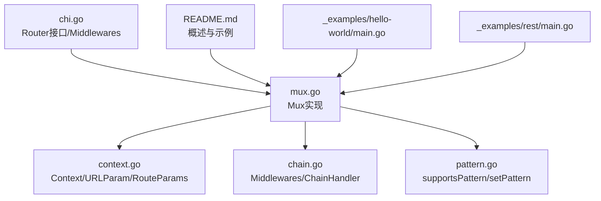
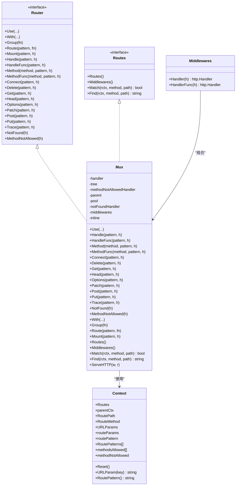
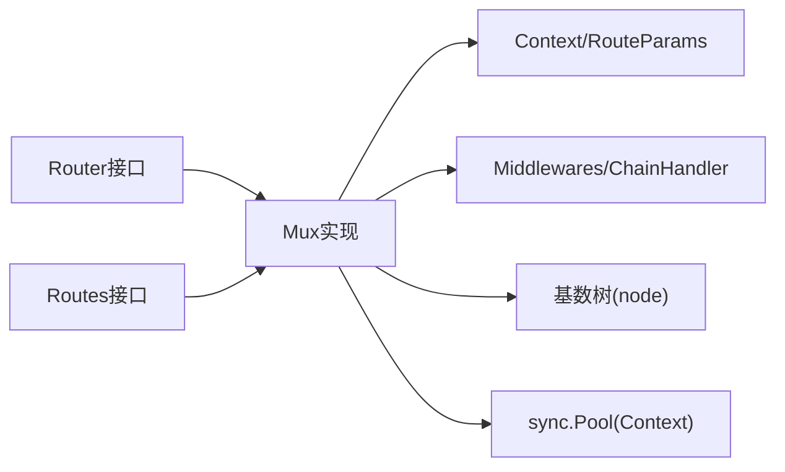

# API参考

<cite>
**本文引用的文件**
- [chi.go](file://chi.go)
- [mux.go](file://mux.go)
- [context.go](file://context.go)
- [chain.go](file://chain.go)
- [pattern.go](file://pattern.go)
- [README.md](file://README.md)
- [_examples/hello-world/main.go](file://_examples/hello-world/main.go)
- [_examples/rest/main.go](file://_examples/rest/main.go)
</cite>

## 目录
1. [简介](#简介)
2. [项目结构](#项目结构)
3. [核心组件](#核心组件)
4. [架构总览](#架构总览)
5. [详细组件分析](#详细组件分析)
6. [依赖关系分析](#依赖关系分析)
7. [性能与行为特性](#性能与行为特性)
8. [故障排查指南](#故障排查指南)
9. [结论](#结论)
10. [附录：常用示例路径](#附录常用示例路径)

## 简介
本API参考面向chi v5路由器，聚焦于Router接口与Mux实现，并系统梳理上下文参数访问工具函数。文档以“方法级”描述为主，覆盖：
- Router接口的所有方法：组合与路由注册、中间件、子路由与挂载、未找到与方法不允许处理
- Mux结构体的实现要点与关键流程
- 上下文相关函数：URLParam、URLParamFromCtx、RouteContext、NewRouteContext、Context与RouteParams
- 使用示例与最佳实践路径

## 项目结构
- 核心接口与类型定义位于chi.go
- 路由器实现位于mux.go
- 请求上下文与参数访问位于context.go
- 中间件链构建位于chain.go
- Go 1.23+对请求模式字段的支持位于pattern.go
- README提供高层说明与示例入口
- 示例程序位于_examples目录

图表来源
- [chi.go](file://chi.go#L64-L138)
- [mux.go](file://mux.go#L1-L120)
- [context.go](file://context.go#L1-L167)
- [chain.go](file://chain.go#L1-L50)
- [pattern.go](file://pattern.go#L1-L17)
- [README.md](file://README.md#L175-L250)
- [_examples/hello-world/main.go](file://_examples/hello-world/main.go#L1-L22)
- [_examples/rest/main.go](file://_examples/rest/main.go#L1-L120)

章节来源
- [chi.go](file://chi.go#L64-L138)
- [mux.go](file://mux.go#L1-L120)
- [context.go](file://context.go#L1-L167)
- [README.md](file://README.md#L175-L250)

## 核心组件
- Router接口：定义路由注册、中间件、子路由与挂载、未找到与方法不允许处理等能力
- Mux：Router的具体实现，负责路由树、中间件链、上下文池化、ServeHTTP分发
- Context与RouteParams：请求上下文中的路由状态、URL参数栈、匹配模式串等
- Middlewares与Chain：中间件链构建与执行

章节来源
- [chi.go](file://chi.go#L64-L138)
- [mux.go](file://mux.go#L1-L120)
- [context.go](file://context.go#L1-L167)
- [chain.go](file://chain.go#L1-L50)

## 架构总览
下面的类图展示了Router接口、Mux实现、Context与中间件链的关系。

图表来源
- [chi.go](file://chi.go#L64-L138)
- [mux.go](file://mux.go#L1-L120)
- [context.go](file://context.go#L1-L167)
- [chain.go](file://chain.go#L1-L50)

## 详细组件分析

### Router接口方法详解
以下方法均在Router接口中定义，Mux实现对应方法。每个方法提供签名、参数说明、返回值与使用示例路径。

- Use(middlewares...)
  - 功能：向路由器堆栈追加一个或多个中间件
  - 参数：可变长度的中间件函数切片
  - 返回：无
  - 备注：必须在定义任何路由之前调用；否则会触发运行时异常
  - 示例路径：[_examples/hello-world/main.go](file://_examples/hello-world/main.go#L11-L18)

- With(middlewares...) -> Router
  - 功能：为端点处理器添加内联中间件，返回新的内联路由器
  - 参数：可变长度的中间件函数切片
  - 返回：新的Router实例（内联）
  - 示例路径：[_examples/rest/main.go](file://_examples/rest/main.go#L79-L93)

- Group(fn) -> Router
  - 功能：沿当前路由路径创建一个新的内联路由器，并复制父级中间件栈
  - 参数：接收一个函数，用于配置该内联路由器
  - 返回：新的Router实例
  - 示例路径：[_examples/rest/main.go](file://_examples/rest/main.go#L79-L93)

- Route(pattern string, fn func(Router)) -> Router
  - 功能：沿pattern挂载一个子路由器
  - 参数：路由模式与子路由器配置函数
  - 返回：子路由器
  - 示例路径：[_examples/rest/main.go](file://_examples/rest/main.go#L79-L93)

- Mount(pattern string, h http.Handler)
  - 功能：将另一个http.Handler或chi.Router作为子路由器挂载到./pattern/*
  - 参数：路由模式与处理器
  - 返回：无
  - 备注：若在同一模式上重复挂载会触发运行时异常；挂载后子路由器继承父级未找到与方法不允许处理器
  - 示例路径：[_examples/rest/main.go](file://_examples/rest/main.go#L95-L98)

- Handle(pattern string, h http.Handler)
  - 功能：为任意HTTP方法注册路由
  - 参数：路由模式与处理器
  - 返回：无
  - 示例路径：[_examples/rest/main.go](file://_examples/rest/main.go#L66-L73)

- HandleFunc(pattern string, h http.HandlerFunc)
  - 功能：为任意HTTP方法注册路由（函数形式）
  - 参数：路由模式与处理器函数
  - 返回：无
  - 示例路径：[_examples/rest/main.go](file://_examples/rest/main.go#L66-L73)

- Method(method string, pattern string, h http.Handler)
  - 功能：为指定HTTP方法注册路由
  - 参数：HTTP方法名、路由模式与处理器
  - 返回：无
  - 备注：不支持的方法名会触发运行时异常
  - 示例路径：[_examples/rest/main.go](file://_examples/rest/main.go#L79-L93)

- MethodFunc(method string, pattern string, h http.HandlerFunc)
  - 功能：为指定HTTP方法注册路由（函数形式）
  - 参数：HTTP方法名、路由模式与处理器函数
  - 返回：无
  - 示例路径：[_examples/rest/main.go](file://_examples/rest/main.go#L79-L93)

- HTTP方法快捷注册
  - Connect(pattern, h)
  - Delete(pattern, h)
  - Get(pattern, h)
  - Head(pattern, h)
  - Options(pattern, h)
  - Patch(pattern, h)
  - Post(pattern, h)
  - Put(pattern, h)
  - Trace(pattern, h)
  - 功能：分别为对应HTTP方法注册路由
  - 参数：路由模式与处理器函数
  - 返回：无
  - 示例路径：[_examples/hello-world/main.go](file://_examples/hello-world/main.go#L16-L18)

- NotFound(h http.HandlerFunc)
  - 功能：设置未找到路由时的自定义处理器
  - 参数：处理器函数
  - 返回：无
  - 备注：若在内联Mux且存在父级，会将处理器链入父级中间件栈
  - 示例路径：[_examples/rest/main.go](file://_examples/rest/main.go#L95-L98)

- MethodNotAllowed(h http.HandlerFunc)
  - 功能：设置方法不允许时的自定义处理器
  - 参数：处理器函数
  - 返回：无
  - 备注：若在内联Mux且存在父级，会将处理器链入父级中间件栈
  - 示例路径：[_examples/rest/main.go](file://_examples/rest/main.go#L95-L98)

章节来源
- [chi.go](file://chi.go#L64-L138)
- [_examples/hello-world/main.go](file://_examples/hello-world/main.go#L11-L18)
- [_examples/rest/main.go](file://_examples/rest/main.go#L66-L98)

### Mux实现要点
- 结构体字段
  - handler：计算后的路由处理器（中间件链 + 路由器）
  - tree：基数树节点，存储路由端点
  - methodNotAllowedHandler/notFoundHandler：未找到与方法不允许处理器
  - middlewares：中间件栈
  - pool：上下文对象池
  - inline/parent：内联与父级Mux
- 关键方法
  - ServeHTTP：从上下文池获取Context，注入RouteCtxKey，调用computed handler
  - Use：在未生成handler前追加中间件
  - Handle/HandleFunc/Method/MethodFunc：解析方法与模式，插入路由树
  - Get/Put/Post/Delete/Patch/Head/Options/Trace/Connect：各HTTP方法的便捷包装
  - NotFound/MethodNotAllowed：设置自定义处理器并递归更新子路由
  - With/Group/Route/Mount：内联中间件、组路由、子路由与挂载
  - Routes/Middlewares/Match/Find：遍历路由树、匹配与查找
  - routeHTTP：根据Context中的RoutePath与RouteMethod在树中查找端点，设置URL参数到请求，执行处理器或返回未找到/方法不允许
  - updateRouteHandler：将中间件链与routeHTTP合并为单一handler
  - methodNotAllowedHandler：构造405响应，填充Allow头
- 行为特性
  - 路由树基于基数树（Radix Trie），支持命名参数与通配符
  - 支持正则参数与通配符“*”
  - 上下文池化减少分配
  - 内联Mux在生成handler后禁止再注册中间件

章节来源
- [mux.go](file://mux.go#L1-L120)
- [mux.go](file://mux.go#L120-L260)
- [mux.go](file://mux.go#L260-L420)
- [mux.go](file://mux.go#L420-L529)

### 上下文与参数访问
- URLParam(r, key) -> string
  - 功能：从http.Request中提取URL参数
  - 参数：请求对象与参数键
  - 返回：参数值，不存在时为空字符串
  - 示例路径：[_examples/rest/main.go](file://_examples/rest/main.go#L129-L133)

- URLParamFromCtx(ctx, key) -> string
  - 功能：从上下文中提取URL参数
  - 参数：上下文与参数键
  - 返回：参数值，不存在时为空字符串

- RouteContext(ctx) -> *Context
  - 功能：从上下文中获取路由Context
  - 参数：上下文
  - 返回：路由Context指针

- NewRouteContext() -> *Context
  - 功能：创建新的路由Context
  - 返回：新Context

- Context结构体
  - 字段：Routes、parentCtx、RoutePath、RouteMethod、URLParams、routeParams、routePattern、RoutePatterns[]、methodsAllowed[]、methodNotAllowed
  - 方法：Reset()、URLParam(key) string、RoutePattern() string
  - 行为：Reset清空状态；RoutePattern拼接并规范化模式串；URLParam按键查找最近一次匹配的值

- RouteParams
  - 字段：Keys、Values
  - 方法：Add(key, value)

- contextKey
  - 用途：RouteCtxKey作为上下文键值

章节来源
- [context.go](file://context.go#L1-L167)

### 中间件链与组合
- Middlewares类型：[]func(http.Handler) http.Handler
- Chain(middlewares...) -> Middlewares
  - 功能：将中间件切片转为Middlewares
- Middlewares.Handler(h) -> http.Handler
  - 功能：将中间件链与最终处理器组合为单个http.Handler
- Middlewares.HandlerFunc(h) -> http.Handler
  - 功能：同上，但处理器为函数
- ChainHandler：封装Endpoint、chain与Middlewares，ServeHTTP委托给chain
- chain(middlewares, endpoint) -> http.Handler
  - 功能：自后向前包裹中间件链

章节来源
- [chain.go](file://chain.go#L1-L50)

### Go 1.23+请求模式支持
- supportsPattern：Go版本满足条件时为true
- setPattern(rctx, r)：将匹配到的路由模式写入http.Request.Pattern

章节来源
- [pattern.go](file://pattern.go#L1-L17)

## 依赖关系分析
- Router接口由Mux实现，Mux同时实现Routes接口
- Mux内部依赖Context进行参数传递与状态管理
- Mux通过Middlewares与Chain构建中间件链
- Mux在ServeHTTP中使用sync.Pool复用Context
- Mount时会检查已存在的路由模式冲突并递归传播未找到/方法不允许处理器

图表来源
- [chi.go](file://chi.go#L64-L138)
- [mux.go](file://mux.go#L1-L120)
- [context.go](file://context.go#L1-L167)
- [chain.go](file://chain.go#L1-L50)

## 性能与行为特性
- 路由查找基于基数树，具备高性能与低分配特性
- 上下文池化避免每次请求重复分配Context
- 中间件链在首次注册路由时一次性构建，后续仅执行链式调用
- 支持正则参数与通配符，便于灵活匹配
- 在Go 1.23+环境下，可将匹配模式写入http.Request.Pattern，便于可观测性

章节来源
- [mux.go](file://mux.go#L1-L120)
- [pattern.go](file://pattern.go#L1-L17)

## 故障排查指南
- 调用Use后又注册路由
  - 现象：运行时异常
  - 原因：Use必须在Handle/Method等路由注册之前调用
  - 解决：调整顺序，先Use再注册路由
  - 参考：[mux.go](file://mux.go#L94-L105)

- 挂载相同模式导致冲突
  - 现象：运行时异常
  - 原因：Mount会检测已存在的路由模式
  - 解决：确保挂载模式唯一
  - 参考：[mux.go](file://mux.go#L282-L307)

- 使用不支持的HTTP方法
  - 现象：运行时异常
  - 原因：Method会校验方法映射
  - 解决：使用受支持的方法或自定义方法
  - 参考：[mux.go](file://mux.go#L125-L133)

- 未找到路由或方法不允许
  - 默认行为：未找到返回404，方法不允许返回405并设置Allow头
  - 自定义：通过NotFound与MethodNotAllowed设置自定义处理器
  - 参考：[mux.go](file://mux.go#L195-L233)

- URL参数无法获取
  - 现象：URLParam返回空字符串
  - 原因：请求未匹配到参数或上下文未正确设置
  - 解决：确认路由模式包含参数，使用URLParamFromCtx或RouteContext
  - 参考：[context.go](file://context.go#L1-L40)

章节来源
- [mux.go](file://mux.go#L94-L133)
- [mux.go](file://mux.go#L282-L307)
- [context.go](file://context.go#L1-L40)

## 结论
本API参考系统梳理了chi v5的Router接口、Mux实现与上下文参数访问工具，提供了方法签名、参数说明、返回值与示例路径，帮助开发者快速定位与使用公共接口。结合示例程序与中间件链机制，可高效构建模块化、可组合的HTTP服务。

## 附录：常用示例路径
- 基础路由与中间件
  - [_examples/hello-world/main.go](file://_examples/hello-world/main.go#L11-L18)
- REST风格路由与子路由
  - [_examples/rest/main.go](file://_examples/rest/main.go#L79-L93)
- 子路由挂载
  - [_examples/rest/main.go](file://_examples/rest/main.go#L95-L98)
- URL参数访问
  - [_examples/rest/main.go](file://_examples/rest/main.go#L129-L133)