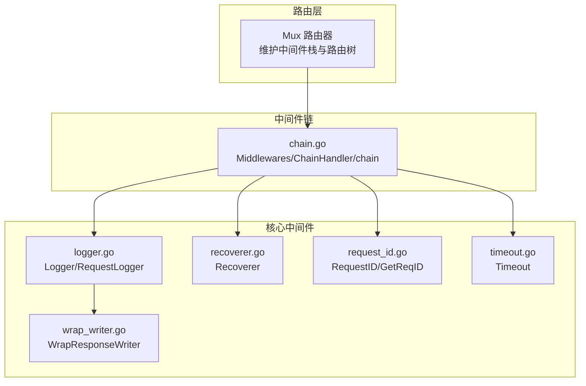
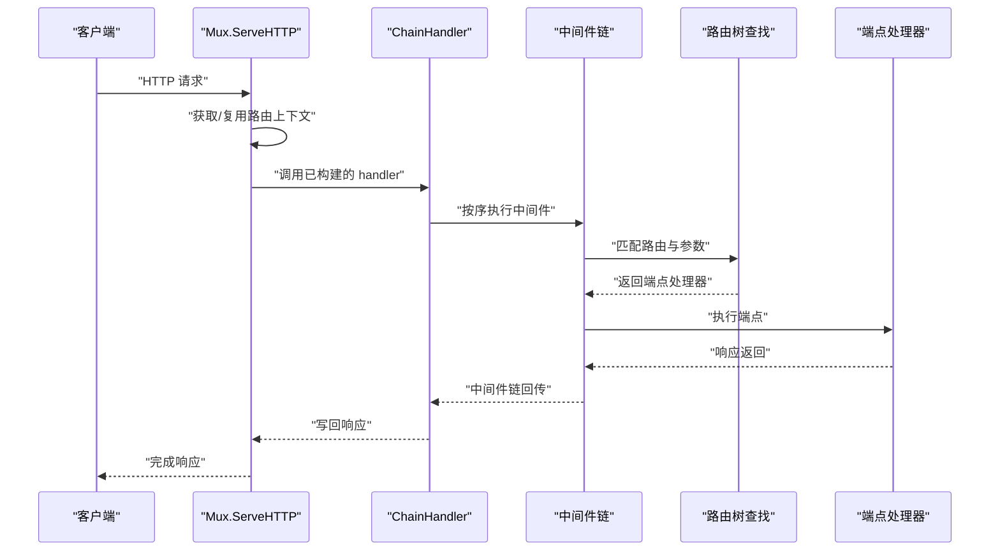
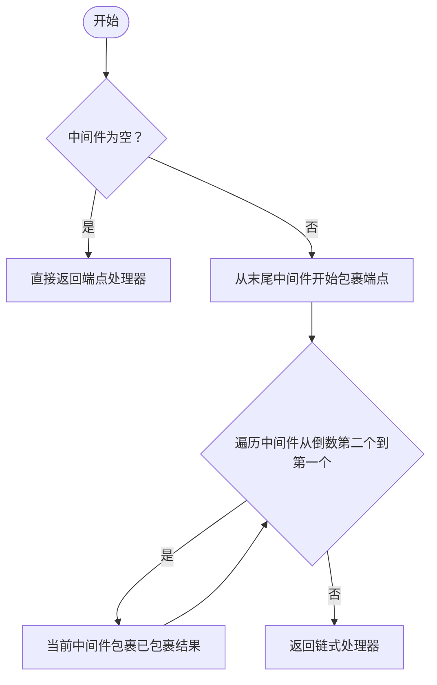
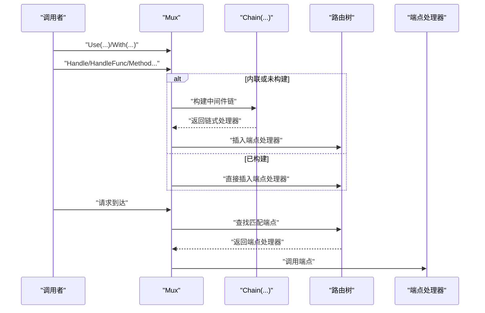
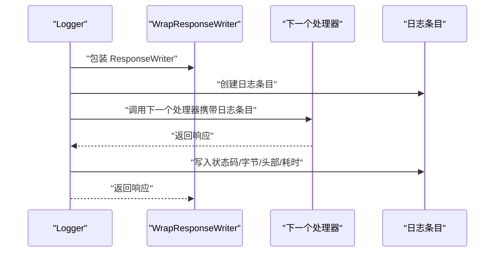
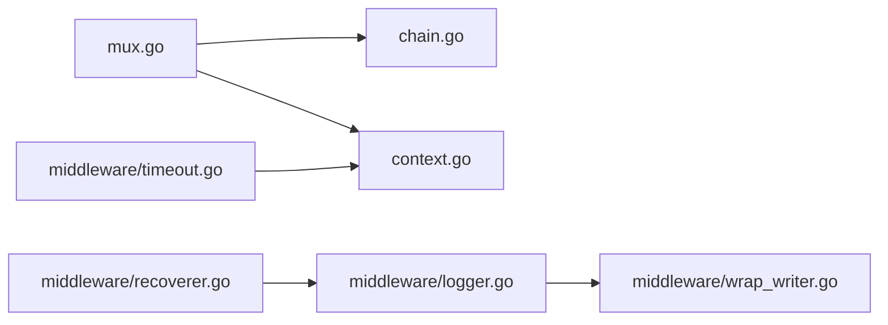

# 中间件系统

<cite>
**本文引用的文件列表**
- [chi.go](file://chi.go)
- [chain.go](file://chain.go)
- [mux.go](file://mux.go)
- [context.go](file://context.go)
- [middleware/middleware.go](file://middleware/middleware.go)
- [middleware/logger.go](file://middleware/logger.go)
- [middleware/recoverer.go](file://middleware/recoverer.go)
- [middleware/request_id.go](file://middleware/request_id.go)
- [middleware/timeout.go](file://middleware/timeout.go)
- [middleware/wrap_writer.go](file://middleware/wrap_writer.go)
- [_examples/graceful/main.go](file://_examples/graceful/main.go)
- [_examples/todos-resource/main.go](file://_examples/todos-resource/main.go)
</cite>

## 目录
1. [引言](#引言)
2. [项目结构](#项目结构)
3. [核心组件](#核心组件)
4. [架构总览](#架构总览)
5. [详细组件分析](#详细组件分析)
6. [依赖关系分析](#依赖关系分析)
7. [性能考量](#性能考量)
8. [故障排查指南](#故障排查指南)
9. [结论](#结论)
10. [附录](#附录)

## 引言
本文件系统性地解析 chi 的中间件体系与执行机制，围绕“标准 net/http 处理器函数（func(http.Handler) http.Handler）”的设计理念，深入讲解中间件链（chain.go）的构建与调用顺序、路由与中间件的组合策略，并逐项说明核心中间件：日志记录（Logger）、错误恢复（Recoverer）、请求 ID（RequestID）、超时控制（Timeout）。同时给出创建自定义中间件的实践建议，包括如何读取与写入请求上下文，以及如何使用全局 Use() 与局部 With() 应用中间件。

## 项目结构
chi 的中间件系统由三层组成：
- 路由与中间件栈：在 Mux 中维护全局中间件栈，并在路由注册时将中间件链包裹到端点处理器上。
- 中间件链构建：通过 chain.go 提供的链式组合工具，将多个中间件函数按序包裹端点处理器。
- 核心中间件：位于 middleware/ 目录，提供日志、恢复、请求 ID、超时等常用能力。

图表来源
- [mux.go](file://mux.go#L94-L105)
- [chain.go](file://chain.go#L10-L20)
- [middleware/logger.go](file://middleware/logger.go#L39-L41)
- [middleware/recoverer.go](file://middleware/recoverer.go#L23-L49)
- [middleware/request_id.go](file://middleware/request_id.go#L62-L79)
- [middleware/timeout.go](file://middleware/timeout.go#L32-L48)
- [middleware/wrap_writer.go](file://middleware/wrap_writer.go#L13-L44)

章节来源
- [chi.go](file://chi.go#L66-L114)
- [chain.go](file://chain.go#L1-L50)
- [mux.go](file://mux.go#L94-L105)

## 核心组件
- 中间件接口与类型
  - Router 接口定义了 Use(...) 与 With(...) 方法，分别用于全局中间件与局部中间件的挂载。
  - Middlewares 是对中间件函数切片的类型别名，便于链式组合。
- 中间件链构建
  - Chain(...) 将若干中间件函数转为 Middlewares。
  - Middlewares.Handler/HandlerFunc 构建最终的 http.Handler，内部以 ChainHandler 包裹端点处理器与链式包装后的处理器。
  - chain(...) 从后向前依次包裹中间件，形成“外层先执行”的调用序列。
- 路由与中间件组合
  - Mux.Use 在路由注册前追加中间件；Mux.With 返回新的内联路由器，复制父栈并叠加局部中间件。
  - Mux.handle 在注册路由时，若处于内联栈或已构建路由处理器，则将中间件链包裹端点处理器；否则延迟构建。

章节来源
- [chi.go](file://chi.go#L66-L114)
- [chi.go](file://chi.go#L135-L138)
- [chain.go](file://chain.go#L5-L20)
- [chain.go](file://chain.go#L34-L50)
- [mux.go](file://mux.go#L94-L105)
- [mux.go](file://mux.go#L235-L257)
- [mux.go](file://mux.go#L414-L437)

## 架构总览
下图展示了请求进入 chi 后，中间件链与路由树的协作流程：

图表来源
- [mux.go](file://mux.go#L60-L92)
- [chain.go](file://chain.go#L30-L33)
- [mux.go](file://mux.go#L439-L487)

## 详细组件分析

### 中间件链（chain.go）
- 设计要点
  - 中间件函数签名 func(http.Handler) http.Handler，符合标准 net/http 处理器模型。
  - chain(...) 采用逆序包裹策略：最后一个中间件包裹端点，然后依次向前包裹，形成“外层先执行、内层后执行”的调用链。
  - Middlewares.Handler/HandlerFunc 返回 ChainHandler，ServeHTTP 直接委托给链式处理器，确保链式调用的一致性。
- 执行顺序
  - 若中间件列表为 [a, b, c]，端点为 ep，则最终链为 a(b(c(ep)))。
- 性能与复杂度
  - 链式构建为 O(n)，每次请求调用也为 O(n)。
  - 通过复用 ChainHandler 与端点处理器，避免重复构造链式对象。

图表来源
- [chain.go](file://chain.go#L34-L49)

章节来源
- [chain.go](file://chain.go#L5-L20)
- [chain.go](file://chain.go#L34-L50)

### 路由与中间件组合（mux.go）
- 全局中间件 Use(...)
  - 仅允许在未注册路由之前添加；一旦路由处理器已构建，再添加会触发异常。
  - 将中间件追加到 Mux.middlewares 切片中。
- 局部中间件 With(...)
  - 返回一个新的内联 Mux，复制父级中间件栈并叠加传入的局部中间件。
  - 内联栈在 handle 时构建路由处理器，且端点处理器会被链式包裹。
- 端点处理器构建
  - handle 在内联栈或未构建路由处理器时，将 Chain(...) 包裹后的处理器插入路由树。
- 路由执行
  - routeHTTP 从请求上下文中提取路由上下文，进行方法校验与路径匹配，找到端点后调用其 ServeHTTP。

图表来源
- [mux.go](file://mux.go#L94-L105)
- [mux.go](file://mux.go#L235-L257)
- [mux.go](file://mux.go#L414-L437)
- [mux.go](file://mux.go#L439-L487)

章节来源
- [mux.go](file://mux.go#L94-L105)
- [mux.go](file://mux.go#L235-L257)
- [mux.go](file://mux.go#L414-L437)
- [mux.go](file://mux.go#L439-L487)

### 日志中间件（middleware/logger.go）
- 功能概述
  - 记录请求开始与结束信息，包含方法、URL、协议、远程地址、状态码、字节数、耗时等。
  - 支持自定义日志格式化器与着色输出。
  - 可通过 WithLogEntry/GetLogEntry 在请求上下文中注入/读取日志条目。
- 关键点
  - Logger 实际委托 DefaultLogger，默认使用 RequestLogger 包装端点。
  - 使用 WrapResponseWriter 捕获状态码、字节统计与头部信息。
  - 建议将 Logger 放在 Recoverer 前，避免恢复后无法正确记录响应状态。
- 上下文与请求 ID
  - 可从请求上下文读取请求 ID，用于日志关联。

图表来源
- [middleware/logger.go](file://middleware/logger.go#L39-L41)
- [middleware/logger.go](file://middleware/logger.go#L43-L59)
- [middleware/logger.go](file://middleware/logger.go#L74-L84)
- [middleware/wrap_writer.go](file://middleware/wrap_writer.go#L13-L44)

章节来源
- [middleware/logger.go](file://middleware/logger.go#L23-L41)
- [middleware/logger.go](file://middleware/logger.go#L43-L59)
- [middleware/logger.go](file://middleware/logger.go#L74-L84)
- [middleware/wrap_writer.go](file://middleware/wrap_writer.go#L13-L44)

### 错误恢复中间件（middleware/recoverer.go）
- 功能概述
  - 捕获 panic 并打印堆栈，尽可能返回 500 错误；对升级连接（如 WebSocket）不做中断处理。
  - 若存在日志条目，优先使用日志条目记录 panic 信息。
- 使用建议
  - 通常应放在 Logger 之后，以便在恢复后仍能记录请求状态。

章节来源
- [middleware/recoverer.go](file://middleware/recoverer.go#L17-L49)

### 请求 ID 中间件（middleware/request_id.go）
- 功能概述
  - 为每个请求生成唯一标识，支持从请求头读取或自动生成。
  - 通过上下文键值存储请求 ID，提供 GetReqID 读取。
- 关键点
  - RequestIDHeader 默认为 X-Request-Id，可自定义。
  - 使用原子计数保证并发安全。
  - 可通过 NextRequestID 获取下一个 ID 值。

章节来源
- [middleware/request_id.go](file://middleware/request_id.go#L17-L26)
- [middleware/request_id.go](file://middleware/request_id.go#L46-L60)
- [middleware/request_id.go](file://middleware/request_id.go#L62-L79)
- [middleware/request_id.go](file://middleware/request_id.go#L81-L91)
- [middleware/request_id.go](file://middleware/request_id.go#L93-L97)

### 超时中间件（middleware/timeout.go）
- 功能概述
  - 为请求设置超时上下文，超时后返回 504 网关超时。
  - 要求在处理器中监听 ctx.Done() 并及时退出，否则超时信号会被忽略。
- 使用建议
  - 在需要阻塞或外部调用的处理器中，务必配合 select 监听 ctx.Done()。

章节来源
- [middleware/timeout.go](file://middleware/timeout.go#L9-L16)
- [middleware/timeout.go](file://middleware/timeout.go#L32-L48)

### 响应写入器包装（middleware/wrap_writer.go）
- 功能概述
  - 根据底层 ResponseWriter 能力选择最优包装器，统一暴露 Status()/BytesWritten()/Tee()/Discard() 等能力。
  - 用于日志中间件统计响应状态码与字节数。
- 类型族
  - basicWriter 为基础代理。
  - flushWriter、hijackWriter、flushHijackWriter、httpFancyWriter、http2FancyWriter 等根据协议与特性提供增强能力。

章节来源
- [middleware/wrap_writer.go](file://middleware/wrap_writer.go#L13-L44)
- [middleware/wrap_writer.go](file://middleware/wrap_writer.go#L46-L69)
- [middleware/wrap_writer.go](file://middleware/wrap_writer.go#L71-L141)

### 自定义中间件开发指南
- 设计原则
  - 中间件应遵循 func(http.Handler) http.Handler 的签名，接收下一个处理器并返回新的处理器。
  - 在中间件内部，先处理请求前置逻辑（读取/写入上下文、记录日志、鉴权等），再调用 next.ServeHTTP，最后处理后置逻辑（统计、清理、日志收尾等）。
- 访问与修改请求上下文
  - 读取：从 http.Request.Context() 获取上下文，使用相应键值读取数据。
  - 写入：使用 context.WithValue 创建新上下文并替换 r.WithContext(...)。
  - 示例参考：请求 ID 中间件通过 RequestIDKey 注入请求 ID，日志中间件通过 LogEntryCtxKey 注入日志条目。
- 与链式调用的关系
  - 中间件的执行顺序由链式包裹决定：越靠外层的中间件越先执行。
  - 若需对响应进行统计或包装，可结合 WrapResponseWriter 使用。

章节来源
- [middleware/middleware.go](file://middleware/middleware.go#L5-L12)
- [middleware/request_id.go](file://middleware/request_id.go#L62-L79)
- [middleware/logger.go](file://middleware/logger.go#L74-L84)
- [middleware/wrap_writer.go](file://middleware/wrap_writer.go#L13-L44)

### 使用示例：全局与局部中间件
- 全局中间件（Use）
  - 在路由注册前调用，作用于所有后续路由。
  - 示例：在示例程序中，先注册 RequestID，再注册 Logger，最后注册 Recoverer。
- 局部中间件（With）
  - 对特定路由组或子路由挂载中间件，不影响全局栈。
  - 示例：在资源挂载场景中，可在子路由上叠加认证或限流中间件。

章节来源
- [_examples/graceful/main.go](file://_examples/graceful/main.go#L45-L69)
- [_examples/todos-resource/main.go](file://_examples/todos-resource/main.go#L14-L30)

## 依赖关系分析
- 组件耦合
  - Mux 依赖 chain.go 构建中间件链；依赖 context.go 提供路由上下文。
  - 日志中间件依赖 WrapResponseWriter 统计响应信息。
  - Recoverer 依赖日志中间件提供的上下文日志条目。
  - Timeout 依赖标准库 context 控制超时。
- 外部依赖
  - 标准库 net/http、context、time、log 等。
- 循环依赖
  - 未发现循环导入；各模块职责清晰，通过接口与函数边界解耦。

图表来源
- [mux.go](file://mux.go#L94-L105)
- [chain.go](file://chain.go#L10-L20)
- [context.go](file://context.go#L1-L40)
- [middleware/logger.go](file://middleware/logger.go#L39-L41)
- [middleware/recoverer.go](file://middleware/recoverer.go#L23-L49)
- [middleware/timeout.go](file://middleware/timeout.go#L32-L48)
- [middleware/wrap_writer.go](file://middleware/wrap_writer.go#L13-L44)

章节来源
- [mux.go](file://mux.go#L94-L105)
- [chain.go](file://chain.go#L10-L20)
- [context.go](file://context.go#L1-L40)
- [middleware/logger.go](file://middleware/logger.go#L39-L41)
- [middleware/recoverer.go](file://middleware/recoverer.go#L23-L49)
- [middleware/timeout.go](file://middleware/timeout.go#L32-L48)
- [middleware/wrap_writer.go](file://middleware/wrap_writer.go#L13-L44)

## 性能考量
- 中间件数量与顺序
  - 中间件越多，每次请求的包裹与调用开销越大；建议按需启用，避免冗余。
  - 将高频低成本中间件置于外层，低频高成本中间件置于内层。
- 响应统计
  - 使用 WrapResponseWriter 进行响应统计时，注意 Tee/Discard 等操作可能带来额外拷贝与写入成本。
- 路由查找
  - chi 的路由树查找为 O(路径长度)，与中间件数量无关；但过多中间件仍会增加每次请求的 CPU 开销。
- 上下文与池化
  - 路由上下文通过 sync.Pool 复用，减少分配；自定义中间件应避免频繁创建大对象。

## 故障排查指南
- 中间件顺序问题
  - 若日志显示不完整，请检查是否将 Logger 放在 Recoverer 之后。
- 超时无效
  - 确认处理器中监听 ctx.Done() 并在超时后及时返回。
- 请求 ID 丢失
  - 检查是否在 RequestID 中间件之后才读取；确认请求头 X-Request-Id 是否正确传递。
- 自定义中间件无效果
  - 确认中间件函数签名正确，且在链式包裹后调用了 next.ServeHTTP。
  - 检查上下文键值是否一致，读取与写入使用同一键。

章节来源
- [middleware/logger.go](file://middleware/logger.go#L32-L41)
- [middleware/recoverer.go](file://middleware/recoverer.go#L23-L49)
- [middleware/timeout.go](file://middleware/timeout.go#L32-L48)
- [middleware/request_id.go](file://middleware/request_id.go#L62-L79)

## 结论
chi 的中间件系统以标准 net/http 处理器函数为核心，通过链式组合实现灵活、可扩展的横切能力。Mux 在路由注册阶段将中间件链包裹端点处理器，形成稳定的执行顺序；核心中间件覆盖日志、恢复、请求 ID、超时等常见需求。开发者可通过 With() 构建局部中间件栈，结合上下文与 WrapResponseWriter 实现强大的可观测性与可控性。遵循中间件顺序与上下文约定，可构建高性能、易维护的 HTTP 服务。

## 附录
- 常用中间件清单
  - 日志：middleware.Logger
  - 错误恢复：middleware.Recoverer
  - 请求 ID：middleware.RequestID
  - 超时：middleware.Timeout
  - 其他：BasicAuth、RealIP、NoCache、Compress、Profiler 等（位于 middleware/ 目录）