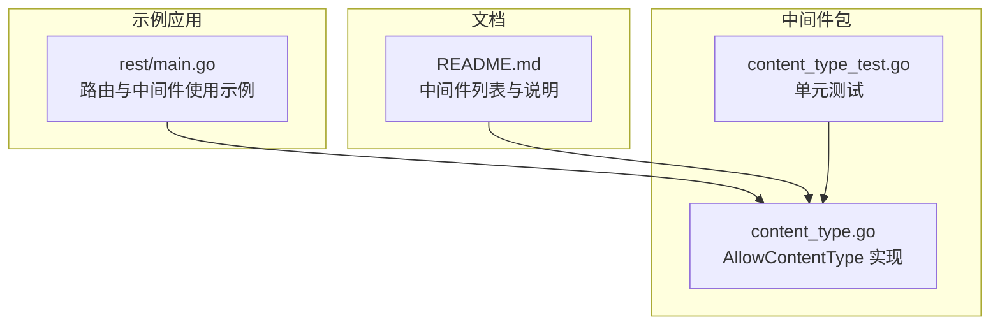
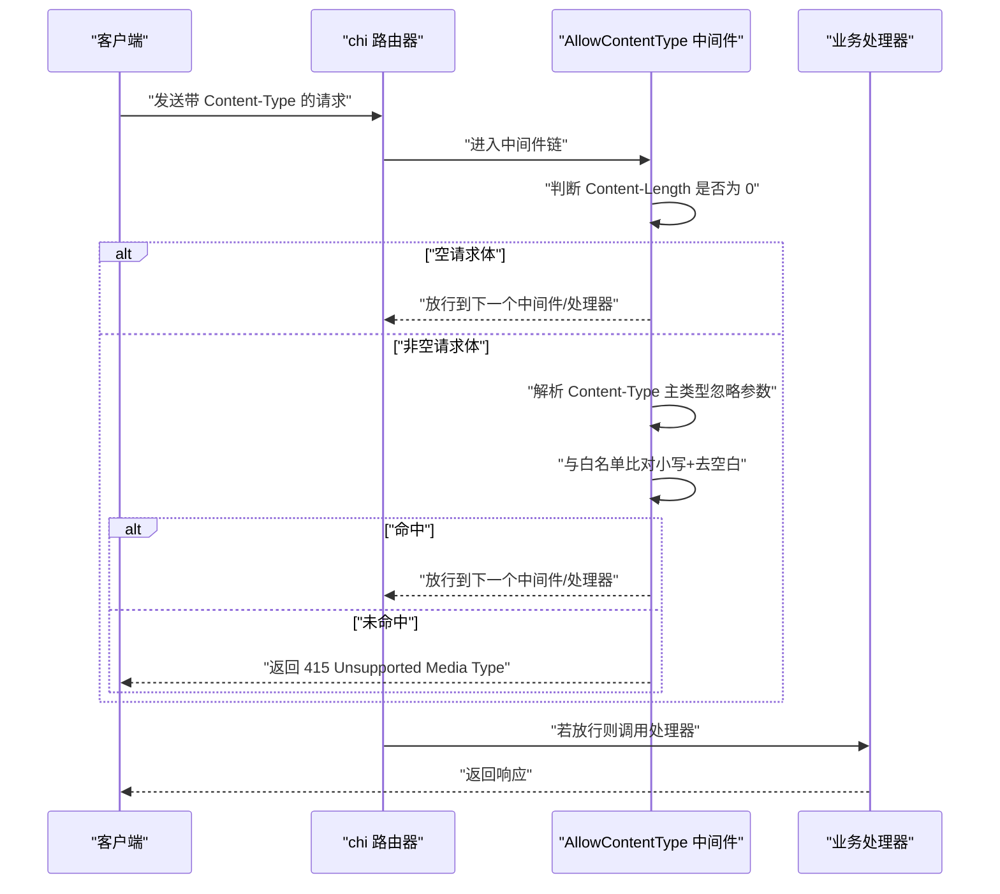
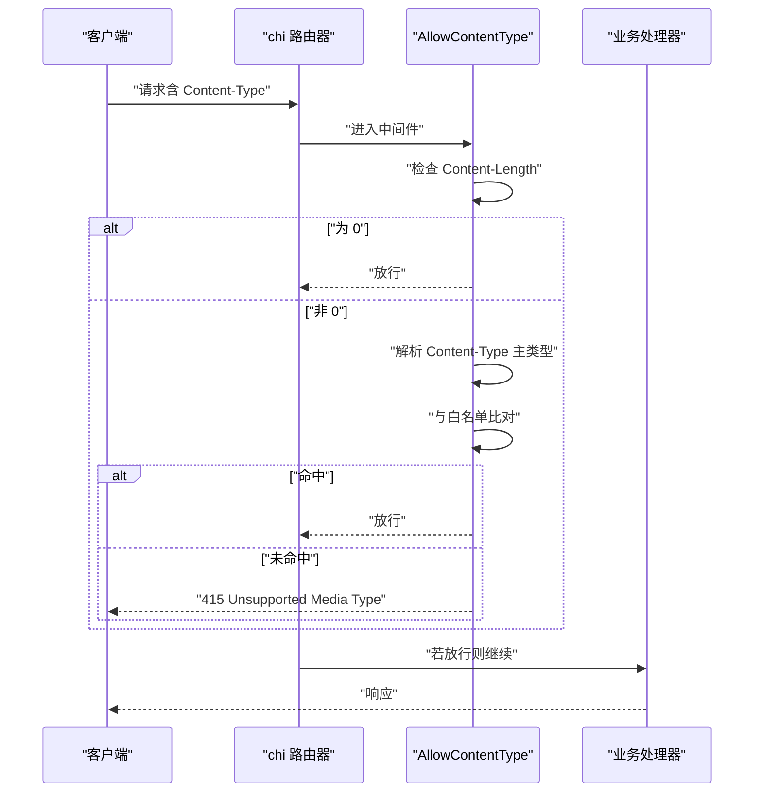
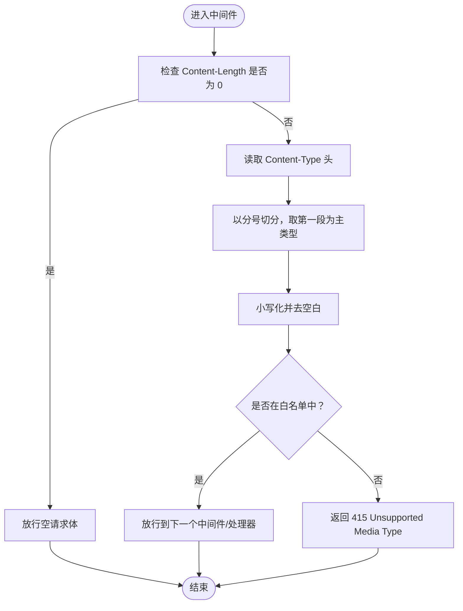

# 内容类型中间件

<cite>
**本文引用的文件**
- [middleware/content_type.go](file://middleware/content_type.go)
- [middleware/content_type_test.go](file://middleware/content_type_test.go)
- [README.md](file://README.md)
- [_examples/rest/main.go](file://_examples/rest/main.go)
</cite>

## 目录
1. [简介](#简介)
2. [项目结构](#项目结构)
3. [核心组件](#核心组件)
4. [架构总览](#架构总览)
5. [详细组件分析](#详细组件分析)
6. [依赖关系分析](#依赖关系分析)
7. [性能考量](#性能考量)
8. [故障排查指南](#故障排查指南)
9. [结论](#结论)
10. [附录](#附录)

## 简介
本篇文档围绕 chi 框架的 middleware.AllowContentType 中间件展开，系统阐述其如何通过白名单机制校验请求的 Content-Type 头，从而提升 REST API 的安全性与一致性。我们将深入解析 allowedContentTypes 映射结构的设计原理、中间件对 Content-Type 的解析策略（忽略字符集参数）、空请求体的特殊处理逻辑，以及在路由系统中的集成方式。同时给出在 REST API 中强制 application/json 的实践建议与多类型配置方法，并通过测试用例路径与示例代码路径帮助读者快速落地。

## 项目结构
AllowContentType 中间件位于 middleware 包内，配套有单元测试；README 对该中间件进行了简要说明；REST 示例展示了在路由栈中使用中间件的常见模式。



图表来源
- [middleware/content_type.go](file://middleware/content_type.go#L1-L46)
- [middleware/content_type_test.go](file://middleware/content_type_test.go#L1-L83)
- [_examples/rest/main.go](file://_examples/rest/main.go#L56-L112)
- [README.md](file://README.md#L330-L404)

章节来源
- [middleware/content_type.go](file://middleware/content_type.go#L1-L46)
- [middleware/content_type_test.go](file://middleware/content_type_test.go#L1-L83)
- [README.md](file://README.md#L330-L404)
- [_examples/rest/main.go](file://_examples/rest/main.go#L56-L112)

## 核心组件
- AllowContentType(contentTypes ...string)：创建一个基于白名单的中间件工厂，接收可变数量的允许内容类型字符串，返回一个符合 http.Handler 的中间件包装器。
- allowedContentTypes 映射：内部将传入的类型统一转为小写并去除首尾空白后存入 map，用于 O(1) 快速查找。
- 请求处理流程：
  - 若请求体为空（Content-Length 为 0），跳过校验直接放行；
  - 否则从 Content-Type 头部解析主类型（忽略分号后的参数如 charset）；
  - 将解析出的主类型同样转换为小写并去空白后与白名单比对；
  - 命中则放行，否则返回 415 Unsupported Media Type。

章节来源
- [middleware/content_type.go](file://middleware/content_type.go#L18-L45)

## 架构总览
AllowContentType 属于 chi 中间件生态的一部分，通常置于路由栈靠前位置，以便尽早拒绝不合规请求，减少后续处理器负担。



图表来源
- [middleware/content_type.go](file://middleware/content_type.go#L20-L45)
- [middleware/content_type_test.go](file://middleware/content_type_test.go#L60-L82)
- [_examples/rest/main.go](file://_examples/rest/main.go#L56-L112)

## 详细组件分析

### AllowContentType 函数与 allowedContentTypes 映射
- 设计要点
  - 白名单构建：遍历传入的 contentTypes，统一做小写化与去空白处理，存入 map，便于常数时间查找。
  - 类型解析：使用字符串分割策略仅取分号前的部分作为“主类型”，从而忽略 charset、boundary 等参数。
  - 兼容性：大小写不敏感，空白字符被标准化，避免因头部格式差异导致误判。
- 数据结构复杂度
  - 构建：O(n)，n 为允许类型的数量。
  - 查找：O(1)，基于 map 的键值访问。
- 错误处理
  - 未命中白名单时返回 415，避免后续处理器执行无意义工作。

章节来源
- [middleware/content_type.go](file://middleware/content_type.go#L20-L45)

### 空内容长度请求的特殊处理
- 行为：当 r.ContentLength 为 0 时，中间件直接放行，不进行任何校验。
- 合理性：空请求体通常表示无负载请求（如 GET/HEAD），此时无需限制内容类型；强制限制可能影响合法场景。

章节来源
- [middleware/content_type.go](file://middleware/content_type.go#L28-L32)

### Content-Type 解析与参数剥离
- 解析策略：从 Header 中读取 Content-Type，以分号为界切分，仅保留第一段作为主类型。
- 规范化：对主类型进行小写化与去空白处理，确保与白名单一致。
- 参数容忍：允许存在 charset、boundary 等参数，不影响匹配结果。

章节来源
- [middleware/content_type.go](file://middleware/content_type.go#L33-L36)

### 在 REST API 中强制 application/json
- 配置方法
  - 在路由器上使用中间件工厂函数，传入 application/json 即可强制只接受 JSON。
  - 可在同一链路中叠加多个允许类型，实现多格式支持。
- 示例参考
  - 在 REST 示例中，路由栈包含多种中间件，可在合适位置插入 AllowContentType。
  - 测试用例覆盖了 application/json（含 charset 参数）与多类型白名单等场景。

章节来源
- [middleware/content_type_test.go](file://middleware/content_type_test.go#L15-L57)
- [_examples/rest/main.go](file://_examples/rest/main.go#L56-L112)

### 与路由系统的集成
- 路由器栈集成：在 chi.NewRouter() 创建后，通过 r.Use(...) 将 AllowContentType 加入中间件链。
- 路由组集成：可对特定路由组或子路由挂载该中间件，实现更细粒度的控制。
- 与其他中间件协作：建议放在日志、鉴权之后、业务处理器之前，以尽早拦截非法请求。

章节来源
- [_examples/rest/main.go](file://_examples/rest/main.go#L56-L112)
- [README.md](file://README.md#L330-L404)

### 类图：中间件与处理器关系
```mermaid
classDiagram
class AllowContentType {
+AllowContentType(contentTypes ...string) func(http.Handler) http.Handler
-allowedContentTypes map[string]struct{}
}
class NextHandler {
+ServeHTTP(w http.ResponseWriter, r *http.Request) void
}
AllowContentType --> NextHandler : "放行/拒绝"
```

图表来源
- [middleware/content_type.go](file://middleware/content_type.go#L18-L45)

### 序列图：请求处理流程


图表来源
- [middleware/content_type.go](file://middleware/content_type.go#L20-L45)
- [middleware/content_type_test.go](file://middleware/content_type_test.go#L60-L82)

### 流程图：内容类型校验算法


图表来源
- [middleware/content_type.go](file://middleware/content_type.go#L28-L45)

## 依赖关系分析
- 内部依赖
  - 标准库 net/http：用于读取请求头与写入状态码。
  - 标准库 strings：用于大小写转换、空白裁剪与分号切分。
- 外部依赖
  - chi 路由器：通过 r.Use(...) 将中间件接入路由链。
  - 测试框架 testing 与 httptest：用于构造请求与断言响应状态码。
- 与其它中间件的关系
  - 与 Logger、Recoverer 等组合使用，形成基础安全与可观测性栈。
  - 与 ContentCharset、AllowContentEncoding 等配合，从不同维度约束请求内容。

章节来源
- [middleware/content_type.go](file://middleware/content_type.go#L3-L6)
- [middleware/content_type_test.go](file://middleware/content_type_test.go#L1-L11)
- [README.md](file://README.md#L330-L404)

## 性能考量
- 时间复杂度
  - 白名单构建：O(n)，n 为允许类型数量。
  - 单次请求校验：O(1)，map 查找。
- 空请求体优化
  - Content-Length 为 0 时直接放行，避免不必要的字符串处理。
- 字符串处理成本
  - 小写化与去空白仅针对主类型，开销极低。
- 建议
  - 白名单规模较小且稳定，适合使用 map；若需要更复杂的匹配规则，可考虑正则或自定义策略。

[本节为通用性能讨论，不直接分析具体文件]

## 故障排查指南
- 常见问题与定位
  - 415 返回但期望放行：检查 Content-Type 是否包含 charset 或其他参数，确认白名单是否包含主类型。
  - 空请求体仍被拒绝：确认中间件是否被正确挂载，或是否存在其他中间件覆盖了状态码。
  - 多类型白名单未生效：确认传入的类型是否已去空白与小写化，以及顺序是否影响匹配。
- 参考测试用例
  - 覆盖了含 charset 的 application/json、额外参数、多类型白名单、不匹配等情况，可对照定位问题。

章节来源
- [middleware/content_type_test.go](file://middleware/content_type_test.go#L15-L57)

## 结论
AllowContentType 中间件通过简洁高效的白名单机制，将内容类型校验前置到请求处理链前端，有效提升了 REST API 的安全性与健壮性。其设计重点在于：
- 使用 map 进行 O(1) 查找；
- 仅比较主类型，忽略 charset 等参数；
- 对空请求体进行特殊放行；
- 易于与路由系统集成，支持多类型白名单。

在实际项目中，建议：
- 在关键路由或路由组上启用 application/json 强制；
- 如需支持多格式，将允许类型集中管理；
- 与日志、错误恢复等中间件协同，形成完整的安全与可观测性栈。

[本节为总结性内容，不直接分析具体文件]

## 附录
- 配置多个允许类型的方法
  - 在路由器上以可变参数形式传入多个类型，中间件会将其统一规范化后加入白名单。
  - 参考测试用例中对 application/json 与 text/xml 的多类型白名单用法。
- 示例代码路径
  - 中间件实现：[middleware/content_type.go](file://middleware/content_type.go#L18-L45)
  - 单元测试：[middleware/content_type_test.go](file://middleware/content_type_test.go#L15-L57)
  - 路由器集成示例：[_examples/rest/main.go](file://_examples/rest/main.go#L56-L112)
  - 中间件列表与说明：[README.md](file://README.md#L330-L404)