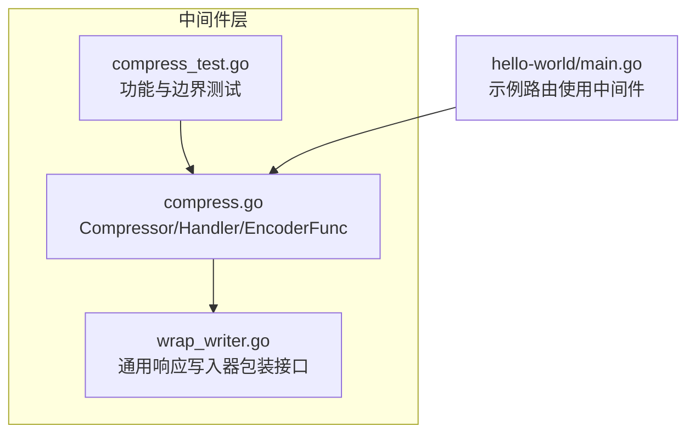
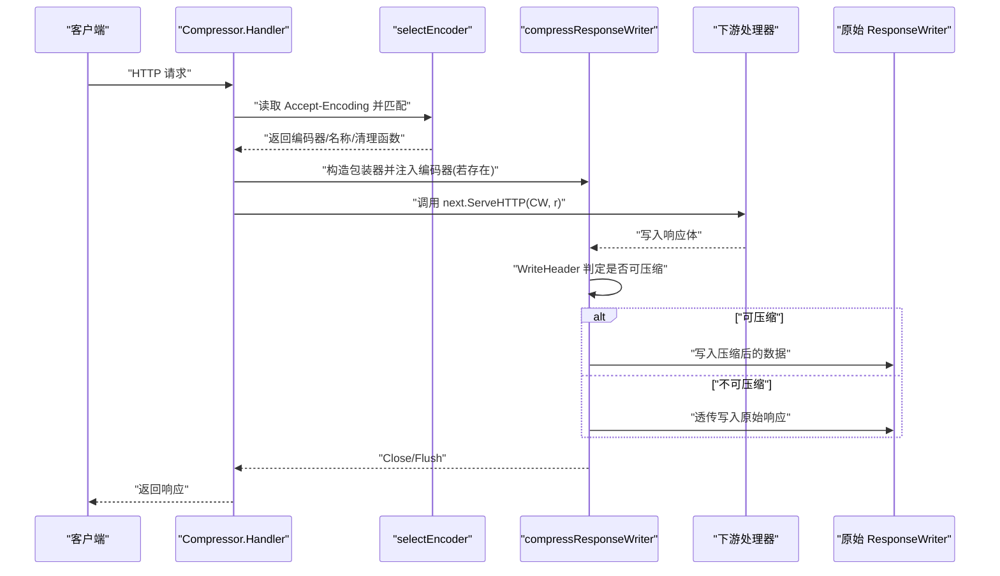

# 响应压缩中间件

<cite>
**本文引用的文件**
- [middleware/compress.go](file://middleware/compress.go)
- [middleware/compress_test.go](file://middleware/compress_test.go)
- [middleware/wrap_writer.go](file://middleware/wrap_writer.go)
- [_examples/hello-world/main.go](file://_examples/hello-world/main.go)
</cite>

## 目录
1. [简介](#简介)
2. [项目结构](#项目结构)
3. [核心组件](#核心组件)
4. [架构总览](#架构总览)
5. [组件详解](#组件详解)
6. [依赖关系分析](#依赖关系分析)
7. [性能与带宽影响](#性能与带宽影响)
8. [故障排查指南](#故障排查指南)
9. [结论](#结论)
10. [附录：最佳实践与示例路径](#附录最佳实践与示例路径)

## 简介
本文件围绕 chi 框架的 middleware.Compress 中间件进行深入解析，重点阐述其如何基于客户端的 Accept-Encoding 头选择合适的压缩算法（默认包含 gzip 与 deflate），并通过 Compressor 结构体管理编码器映射、同步池与优先级列表，实现对响应体的流式压缩。文档同时覆盖：
- Compressor 的设计原理与字段职责（encoders、pooledEncoders、encodingPrecedence）
- Compress(level int, types ...string) 与 NewCompressor(level, types...) 的创建流程
- Handler 方法如何包装响应写入器并处理头部与内容类型判定
- 如何通过 SetEncoder 扩展新压缩算法（例如 Brotli）
- 允许压缩的内容类型配置与通配符规则
- 压缩级别配置建议与性能权衡
- 生产环境最佳实践与示例路径

## 项目结构
与压缩中间件直接相关的文件位于 middleware 目录中，测试用例位于同目录下的 compress_test.go，通用响应写入器包装工具位于 wrap_writer.go。示例程序展示了如何在路由中使用中间件的基本方式。



图表来源
- [middleware/compress.go](file://middleware/compress.go#L1-L393)
- [middleware/wrap_writer.go](file://middleware/wrap_writer.go#L1-L242)
- [middleware/compress_test.go](file://middleware/compress_test.go#L1-L219)
- [_examples/hello-world/main.go](file://_examples/hello-world/main.go#L1-L22)

章节来源
- [middleware/compress.go](file://middleware/compress.go#L1-L393)
- [middleware/compress_test.go](file://middleware/compress_test.go#L1-L219)
- [middleware/wrap_writer.go](file://middleware/wrap_writer.go#L1-L242)
- [_examples/hello-world/main.go](file://_examples/hello-world/main.go#L1-L22)

## 核心组件
- Compressor：封装压缩配置与运行时状态，负责选择编码器、维护优先级与内容类型白名单。
- EncoderFunc：压缩编码器工厂函数，接收底层 io.Writer 与压缩等级，返回一个可写入的压缩流。
- ioResetterWriter：具备 Reset(w io.Writer) 能力的写入器接口，用于复用已分配的编码器实例。
- compressResponseWriter：对 http.ResponseWriter 的包装，按需注入压缩写入器，并在 WriteHeader 阶段根据内容类型与编码器设置 Content-Encoding/Vary/Content-Length。

章节来源
- [middleware/compress.go](file://middleware/compress.go#L45-L274)
- [middleware/compress.go](file://middleware/compress.go#L249-L274)

## 架构总览
下图展示了从请求进入中间件到响应写出的整体流程，包括编码器选择、内容类型判定与压缩写入器的注入。



图表来源
- [middleware/compress.go](file://middleware/compress.go#L185-L208)
- [middleware/compress.go](file://middleware/compress.go#L210-L238)
- [middleware/compress.go](file://middleware/compress.go#L290-L351)

章节来源
- [middleware/compress.go](file://middleware/compress.go#L185-L208)
- [middleware/compress.go](file://middleware/compress.go#L210-L238)
- [middleware/compress.go](file://middleware/compress.go#L290-L351)

## 组件详解

### Compressor 结构体与字段设计
- encoders：非池化编码器映射，键为编码名（如 gzip、deflate），值为 EncoderFunc 工厂。
- pooledEncoders：池化编码器映射，键为编码名，值为 sync.Pool；池中对象需实现 ioResetterWriter 接口以便 Reset(w) 复用。
- allowedTypes/allowedWildcards：允许被压缩的内容类型集合与通配符前缀集合。
- encodingPrecedence：编码器优先级列表，越靠前的元素优先匹配。
- level：压缩等级，传递给 EncoderFunc 工厂以创建具体编码器实例。

章节来源
- [middleware/compress.go](file://middleware/compress.go#L45-L57)

### 编码器注册与优先级
- 默认注册 gzip 与 deflate 编码器，优先级顺序由 SetEncoder 的调用顺序决定（后注册者排在前面）。
- SetEncoder 支持动态替换已有编码器；若编码器实现 Reset(w io.Writer)，则自动纳入 pooledEncoders 池化复用；否则放入 encoders 映射。
- encodingPrecedence 通过将新编码器插入切片开头来更新优先级。

章节来源
- [middleware/compress.go](file://middleware/compress.go#L118-L129)
- [middleware/compress.go](file://middleware/compress.go#L147-L183)

### 内容类型白名单与通配符
- NewCompressor 支持显式指定允许压缩的内容类型；未指定时使用默认集合。
- 支持形如 “text/*” 的通配符前缀；不支持包含任意字符的通配符（例如 “audio/*wav” 或 “application*/*” 将触发 panic）。
- 压缩判定 isCompressible 会先解析 Content-Type 主类型，再检查 allowedWildcards。

章节来源
- [middleware/compress.go](file://middleware/compress.go#L63-L91)
- [middleware/compress.go](file://middleware/compress.go#L16-L27)
- [middleware/compress.go](file://middleware/compress.go#L274-L288)
- [middleware/compress_test.go](file://middleware/compress_test.go#L113-L171)

### 编码器选择逻辑
- 从 Accept-Encoding 请求头解析出客户端支持的编码列表。
- 按 encodingPrecedence 顺序匹配，优先选择客户端支持且已注册的编码器。
- 若命中池化编码器，则从池中取出并 Reset(w) 后返回；否则直接调用 EncoderFunc 工厂创建一次性实例。
- 返回值包含编码器、编码名与清理函数（用于归还池化编码器或无操作）。

章节来源
- [middleware/compress.go](file://middleware/compress.go#L210-L238)
- [middleware/compress.go](file://middleware/compress.go#L240-L247)

### 响应写入器包装与头部处理
- compressResponseWriter 在 WriteHeader 阶段进行判定：
  - 若已有 Content-Encoding，跳过压缩。
  - 若内容类型不在允许列表且无通配符匹配，不压缩。
  - 若存在可用编码器，设置 Content-Encoding 为所选编码，添加 Vary: Accept-Encoding，并删除 Content-Length。
- Write/Flush/Close/Push/Hijack 等方法根据当前 compressible 状态委托给压缩写入器或原始 ResponseWriter。

章节来源
- [middleware/compress.go](file://middleware/compress.go#L290-L351)
- [middleware/compress.go](file://middleware/compress.go#L353-L377)

### 创建与使用 Compressor
- Compress(level int, types ...string)：便捷工厂，创建 Compressor 并返回 Handler。
- NewCompressor(level int, types ...string)：构造 Compressor 实例，初始化 encoders/pooledEncoders/allowedTypes/allowedWildcards/encodingPrecedence，并注册默认 gzip 与 deflate 编码器。
- 示例路由中可直接将 Compressor.Handler 作为中间件挂载到 chi 路由器。

章节来源
- [middleware/compress.go](file://middleware/compress.go#L39-L43)
- [middleware/compress.go](file://middleware/compress.go#L59-L129)
- [_examples/hello-world/main.go](file://_examples/hello-world/main.go#L1-L22)

### 扩展新压缩算法（SetEncoder）
- 通过 SetEncoder(encoding string, fn EncoderFunc) 注册自定义编码器。
- 若 fn 返回的对象实现了 Reset(w io.Writer)，则自动池化；否则仅保存在 encoders 映射中。
- 可用于注册 Brotli 等现代压缩算法，以提升压缩比并满足现代浏览器偏好。

章节来源
- [middleware/compress.go](file://middleware/compress.go#L132-L183)

### 测试验证点
- 默认 gzip/deflate 应被池化；新增 nop 编码器应存入 encoders。
- 当 Content-Type 不在允许列表或未设置时不应压缩。
- 当客户端声明 Accept-Encoding 为 gzip/deflate/nop 时，应按优先级选择对应编码器。
- 通配符规则与非法通配符模式的 panic 行为得到验证。

章节来源
- [middleware/compress_test.go](file://middleware/compress_test.go#L17-L111)
- [middleware/compress_test.go](file://middleware/compress_test.go#L113-L171)

## 依赖关系分析
- compressResponseWriter 依赖 http.ResponseWriter 接口能力（Flush、Hijacker、Pusher 等），并在 compressible=true 时委托给压缩写入器。
- ioResetterWriter 用于池化编码器的复用，避免频繁分配与 GC 压力。
- wrap_writer.go 提供通用响应写入器包装接口集，compressResponseWriter 与之在能力上互补（前者专注于压缩写入，后者提供多种能力代理）。

```mermaid
classDiagram
class Compressor {
+map~string, EncoderFunc~ encoders
+map~string, Pool~ pooledEncoders
+map~string, struct{}~ allowedTypes
+map~string, struct{}~ allowedWildcards
+[]string encodingPrecedence
+int level
+SetEncoder(encoding, fn)
+Handler(next) http.Handler
}
class compressResponseWriter {
+WriteHeader(code)
+Write([]byte) (int, error)
+Flush()
+Close() error
+Hijack() (net.Conn, *bufio.ReadWriter, error)
+Push(target, opts) error
-isCompressible() bool
-writer() io.Writer
}
class ioResetterWriter {
<<interface>>
+Reset(w io.Writer)
}
Compressor --> compressResponseWriter : "创建并注入"
compressResponseWriter --> ioResetterWriter : "可能委托"
```

图表来源
- [middleware/compress.go](file://middleware/compress.go#L45-L274)
- [middleware/compress.go](file://middleware/compress.go#L249-L274)

章节来源
- [middleware/compress.go](file://middleware/compress.go#L45-L274)
- [middleware/compress.go](file://middleware/compress.go#L249-L274)

## 性能与带宽影响
- 压缩比与 CPU 开销的权衡：较高压缩等级通常带来更好的带宽节省，但会增加 CPU 使用率与延迟。默认示例采用中等压缩等级，适合大多数 Web 场景。
- 池化策略：对支持 Reset 的编码器（如 gzip/deflate）使用 sync.Pool 复用，显著降低分配开销与 GC 压力。
- 内容类型过滤：仅对白名单内的文本类内容进行压缩，避免对二进制或已压缩媒体（如图片、视频、压缩包）重复压缩造成浪费。
- 头部处理：设置 Content-Encoding 与 Vary: Accept-Encoding，确保缓存正确区分不同编码版本；删除 Content-Length 以适配流式压缩输出。

章节来源
- [middleware/compress.go](file://middleware/compress.go#L118-L129)
- [middleware/compress.go](file://middleware/compress.go#L290-L316)
- [middleware/compress.go](file://middleware/compress.go#L318-L351)

## 故障排查指南
- 未设置 Content-Type 导致未压缩：中间件在 WriteHeader 时依据 Content-Type 判定是否可压缩，请确保在处理器中设置正确的 Content-Type。
- 未声明 Accept-Encoding：若客户端未发送 Accept-Encoding，中间件不会启用压缩。
- 通配符非法：仅支持 “前缀/*” 形式的通配符，其他形式将触发 panic。
- 自定义编码器未生效：确认 SetEncoder 的编码名大小写统一（内部会转为小写），且 EncoderFunc 返回的对象实现了 Reset 接口以启用池化。
- Hijack/Pusher/Flush 能力：compressResponseWriter 仅在 writer() 返回压缩写入器时才暴露相应能力；若未压缩，这些能力将不可用。

章节来源
- [middleware/compress.go](file://middleware/compress.go#L290-L351)
- [middleware/compress.go](file://middleware/compress.go#L147-L183)
- [middleware/compress_test.go](file://middleware/compress_test.go#L113-L171)

## 结论
chi 的 Compress 中间件通过 Compressor 对编码器、内容类型白名单与优先级进行集中管理，结合池化与流式写入，在保证兼容性的同时兼顾性能与带宽优化。默认 gzip/deflate 已覆盖主流场景，配合 SetEncoder 可灵活扩展新算法（如 Brotli）。生产环境中建议：
- 明确允许压缩的内容类型，避免对已压缩资源重复压缩；
- 根据业务流量与硬件资源选择合适的压缩等级；
- 使用池化编码器以降低分配成本；
- 关注 Vary/Content-Encoding/Content-Length 的头部变化，确保缓存与前端行为符合预期。

## 附录：最佳实践与示例路径
- 在路由中挂载压缩中间件：参考示例程序中对中间件的使用方式。
- 自定义内容类型白名单：通过 NewCompressor(level, types...) 指定允许压缩的 Content-Type。
- 注册新编码器：使用 SetEncoder(encoding, fn) 注册自定义算法（如 Brotli），并确保返回对象可 Reset。
- 验证优先级与通配符：参考测试用例对编码器优先级与通配符规则的行为验证。

章节来源
- [_examples/hello-world/main.go](file://_examples/hello-world/main.go#L1-L22)
- [middleware/compress.go](file://middleware/compress.go#L39-L43)
- [middleware/compress.go](file://middleware/compress.go#L59-L129)
- [middleware/compress.go](file://middleware/compress.go#L132-L183)
- [middleware/compress_test.go](file://middleware/compress_test.go#L17-L111)
- [middleware/compress_test.go](file://middleware/compress_test.go#L113-L171)