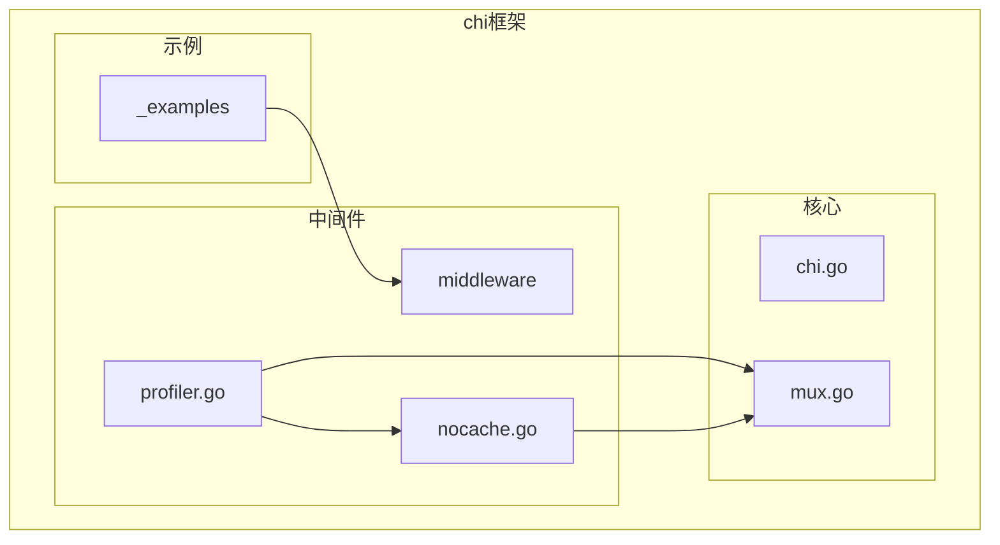
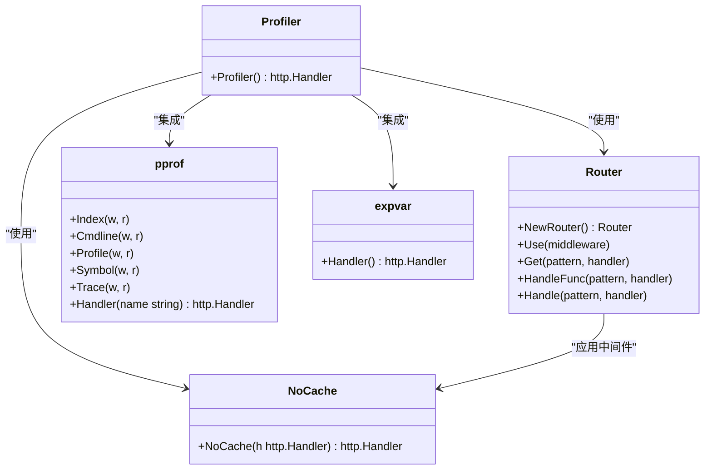
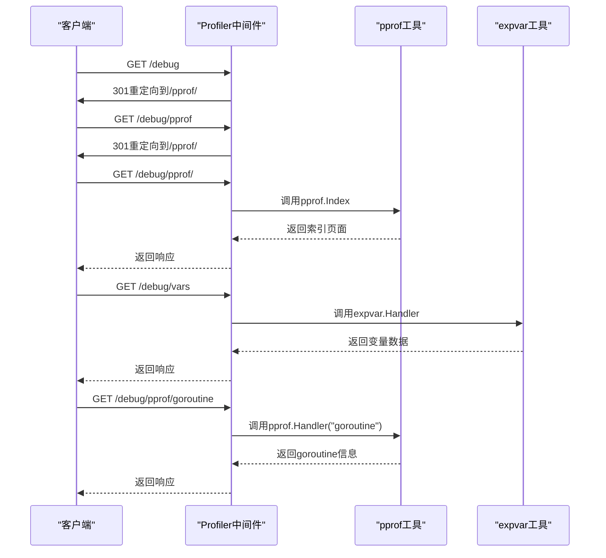
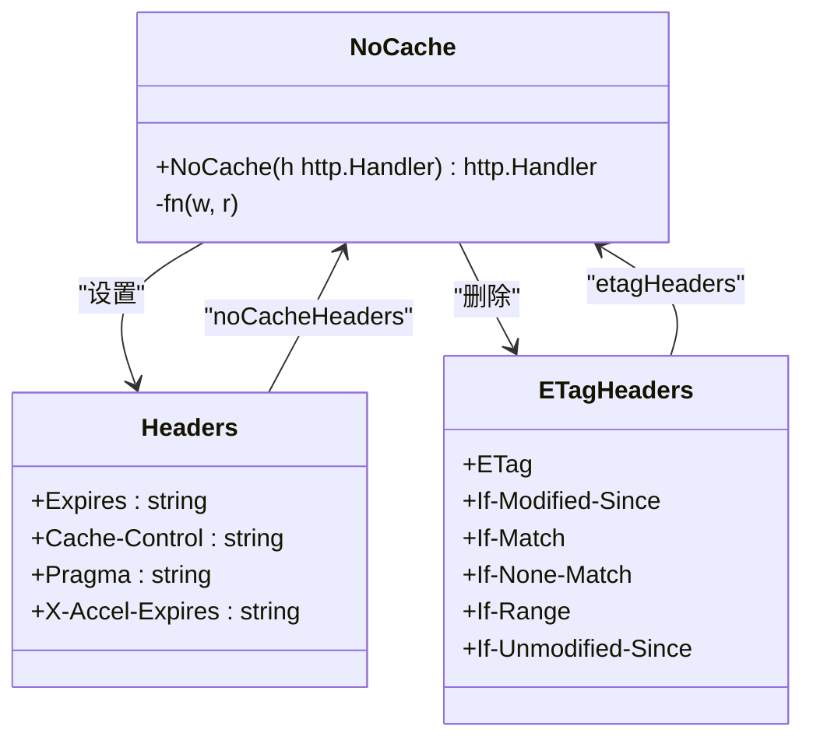
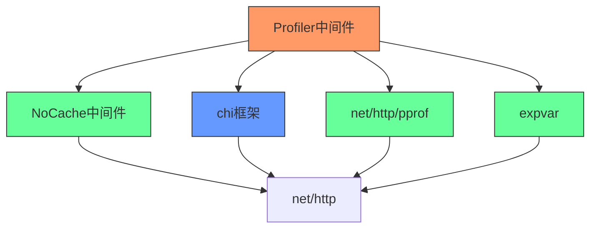

# 性能分析中间件

<cite>
**本文档中引用的文件**   
- [profiler.go](file://middleware/profiler.go)
- [nocache.go](file://middleware/nocache.go)
- [chi.go](file://chi.go)
- [mux.go](file://mux.go)
</cite>

## 目录
1. [简介](#简介)
2. [项目结构](#项目结构)
3. [核心组件](#核心组件)
4. [架构概述](#架构概述)
5. [详细组件分析](#详细组件分析)
6. [依赖分析](#依赖分析)
7. [性能考虑](#性能考虑)
8. [故障排除指南](#故障排除指南)
9. [结论](#结论)

## 简介
本文档深入探讨了chi框架中的Profiler中间件，该中间件用于集成Go语言的pprof性能分析工具。文档详细解释了如何通过该中间件监控应用性能，包括其内部架构设计、路由设置、缓存控制机制以及在生产环境中的安全使用方法。

## 项目结构
chi框架的项目结构清晰，主要分为_examples示例目录和middleware中间件目录。其中，性能分析相关的功能主要集中在middleware目录下的profiler.go文件中。



**图表来源**
- [profiler.go](file://middleware/profiler.go#L1-L49)
- [nocache.go](file://middleware/nocache.go#L1-L60)

**章节来源**
- [profiler.go](file://middleware/profiler.go#L1-L49)
- [middleware](file://middleware#L1-L10)

## 核心组件
性能分析中间件的核心组件包括Profiler函数、NoCache中间件以及与pprof和expvar包的集成。这些组件共同实现了应用性能的全面监控功能。

**章节来源**
- [profiler.go](file://middleware/profiler.go#L23-L49)
- [nocache.go](file://middleware/nocache.go#L40-L59)

## 架构概述
Profiler中间件采用子路由器架构设计，通过chi.NewRouter()创建独立的路由空间，专门用于处理性能分析相关的请求。这种设计实现了功能隔离，确保性能分析接口不会干扰主应用的正常路由。

```mermaid
graph TB
subgraph "性能分析子路由器"
root[/]
pprof[/pprof]
vars[/vars]
goroutine[/pprof/goroutine]
heap[/pprof/heap]
block[/pprof/block]
allocs[/pprof/allocs]
mutex[/pprof/mutex]
threadcreate[/pprof/threadcreate]
cmdline[/pprof/cmdline]
profile[/pprof/profile]
symbol[/pprof/symbol]
trace[/pprof/trace]
end
root --> pprof
pprof --> goroutine
pprof --> heap
pprof --> block
pprof --> allocs
pprof --> mutex
pprof --> threadcreate
pprof --> cmdline
pprof --> profile
pprof --> symbol
pprof --> trace
root --> vars
style root fill:#f9f,stroke:#333
style pprof fill:#f9f,stroke:#333
style vars fill:#f9f,stroke:#333
```

**图表来源**
- [profiler.go](file://middleware/profiler.go#L24-L48)
- [mux.go](file://mux.go#L1-L20)

## 详细组件分析

### Profiler中间件分析
Profiler中间件是一个功能完整的子路由器，专门用于挂载net/http/pprof性能分析工具。它通过精心设计的路由配置，提供了全面的应用性能监控能力。

#### 架构设计


**图表来源**
- [profiler.go](file://middleware/profiler.go#L23-L49)
- [nocache.go](file://middleware/nocache.go#L40-L59)

#### 请求处理流程


**图表来源**
- [profiler.go](file://middleware/profiler.go#L27-L47)
- [mux.go](file://mux.go#L150-L200)

#### 路由配置流程图
```mermaid
flowchart TD
Start([Profiler初始化]) --> CreateRouter["创建新路由器 r := chi.NewRouter()"]
CreateRouter --> ApplyNoCache["应用NoCache中间件 r.Use(NoCache)"]
ApplyNoCache --> SetupRootRedirect["设置根路径重定向 r.Get(\"/\", ...)"]
SetupRootRedirect --> SetupPprofRedirect["设置pprof路径重定向 r.HandleFunc(\"/pprof\", ...)"]
SetupPprofRedirect --> SetupPprofIndex["设置pprof索引 r.HandleFunc(\"/pprof/*\", pprof.Index)"]
SetupPprofIndex --> SetupPprofHandlers["设置pprof具体处理器"]
SetupPprofHandlers --> SetupExpvar["设置expvar处理器 r.Handle(\"/vars\", expvar.Handler())"]
SetupExpvar --> SetupSpecificHandlers["设置特定pprof处理器 r.Handle(\"/pprof/goroutine\", ...)"]
SetupSpecificHandlers --> ReturnRouter["返回路由器 return r"]
ReturnRouter --> End([Profiler准备就绪])
subgraph "pprof具体处理器"
SetupPprofCmdline["r.HandleFunc(\"/pprof/cmdline\", pprof.Cmdline)"]
SetupPprofProfile["r.HandleFunc(\"/pprof/profile\", pprof.Profile)"]
SetupPprofSymbol["r.HandleFunc(\"/pprof/symbol\", pprof.Symbol)"]
SetupPprofTrace["r.HandleFunc(\"/pprof/trace\", pprof.Trace)"]
end
subgraph "特定pprof处理器"
SetupGoroutine["r.Handle(\"/pprof/goroutine\", pprof.Handler(\"goroutine\"))"]
SetupHeap["r.Handle(\"/pprof/heap\", pprof.Handler(\"heap\"))"]
SetupBlock["r.Handle(\"/pprof/block\", pprof.Handler(\"block\"))"]
SetupAllocs["r.Handle(\"/pprof/allocs\", pprof.Handler(\"allocs\"))"]
SetupMutex["r.Handle(\"/pprof/mutex\", pprof.Handler(\"mutex\"))"]
SetupThreadcreate["r.Handle(\"/pprof/threadcreate\", pprof.Handler(\"threadcreate\"))"]
end
SetupPprofIndex --> SetupPprofCmdline
SetupPprofCmdline --> SetupPprofProfile
SetupPprofProfile --> SetupPprofSymbol
SetupPprofSymbol --> SetupPprofTrace
SetupPprofTrace --> SetupExpvar
SetupExpvar --> SetupGoroutine
SetupGoroutine --> SetupHeap
SetupHeap --> SetupBlock
SetupBlock --> SetupAllocs
SetupAllocs --> SetupMutex
SetupMutex --> SetupThreadcreate
SetupThreadcreate --> ReturnRouter
```

**图表来源**
- [profiler.go](file://middleware/profiler.go#L24-L48)
- [mux.go](file://mux.go#L100-L300)

**章节来源**
- [profiler.go](file://middleware/profiler.go#L23-L49)
- [nocache.go](file://middleware/nocache.go#L1-L60)

### NoCache中间件分析
NoCache中间件是Profiler功能的重要组成部分，它确保性能分析端点不会被缓存，从而保证每次请求都能获取到最新的性能数据。

#### NoCache实现机制


**图表来源**
- [nocache.go](file://middleware/nocache.go#L11-L60)
- [profiler.go](file://middleware/profiler.go#L25)

## 依赖分析
Profiler中间件依赖于多个核心组件和标准库包，形成了一个完整的性能监控解决方案。



**图表来源**
- [profiler.go](file://middleware/profiler.go#L6-L12)
- [nocache.go](file://middleware/nocache.go#L6-L9)
- [go.mod](file://go.mod#L1-L10)

**章节来源**
- [profiler.go](file://middleware/profiler.go#L1-L49)
- [nocache.go](file://middleware/nocache.go#L1-L60)

## 性能考虑
在使用Profiler中间件时，需要考虑以下性能和安全因素：

1. **生产环境安全**：性能分析接口包含敏感信息，不应在生产环境中公开暴露
2. **访问控制**：建议通过身份验证和授权机制限制对性能分析接口的访问
3. **资源消耗**：pprof收集性能数据会产生一定的CPU和内存开销
4. **缓存策略**：NoCache中间件确保性能数据实时性，但会增加服务器负载
5. **网络带宽**：性能数据可能较大，需要考虑网络传输成本

## 故障排除指南
当使用Profiler中间件遇到问题时，可以参考以下排查步骤：

**章节来源**
- [profiler.go](file://middleware/profiler.go#L23-L49)
- [mux.go](file://mux.go#L500-L600)
- [chi.go](file://chi.go#L200-L300)

## 结论
chi框架的Profiler中间件提供了一个强大而灵活的性能分析解决方案。通过集成Go语言的pprof工具，开发者可以轻松监控应用的goroutine、堆内存、阻塞情况等关键性能指标。中间件的设计体现了良好的架构思想：使用子路由器实现功能隔离，通过NoCache中间件确保数据实时性，合理的路由配置提供了友好的用户体验。在生产环境中使用时，建议结合身份验证机制，确保性能分析接口的安全性。