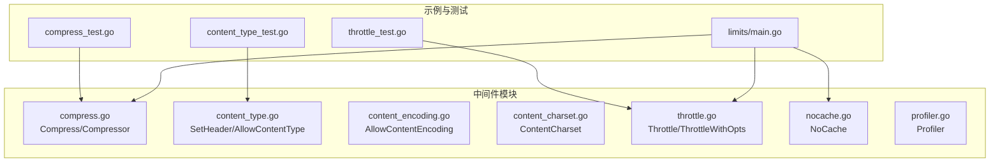
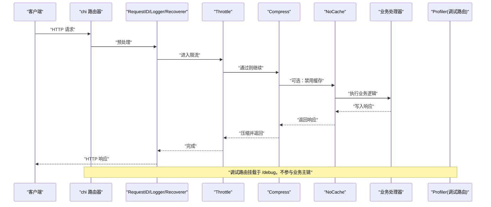
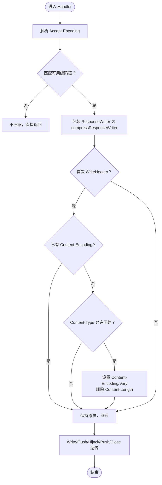
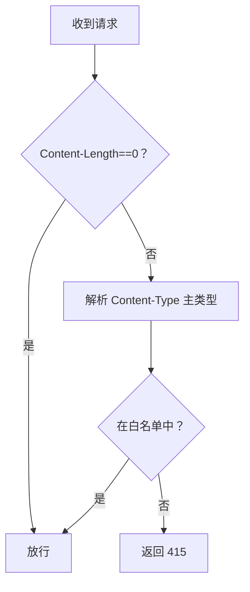
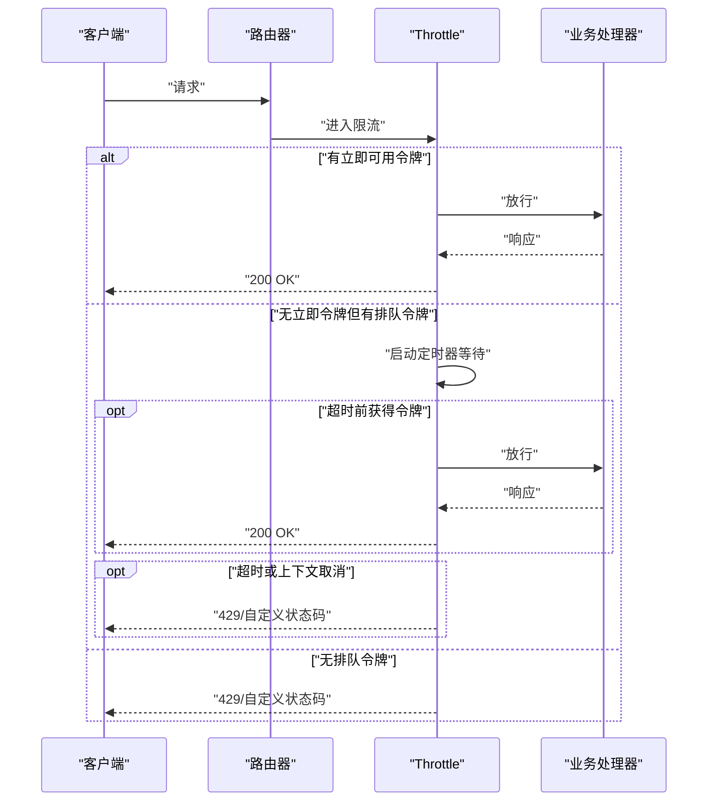
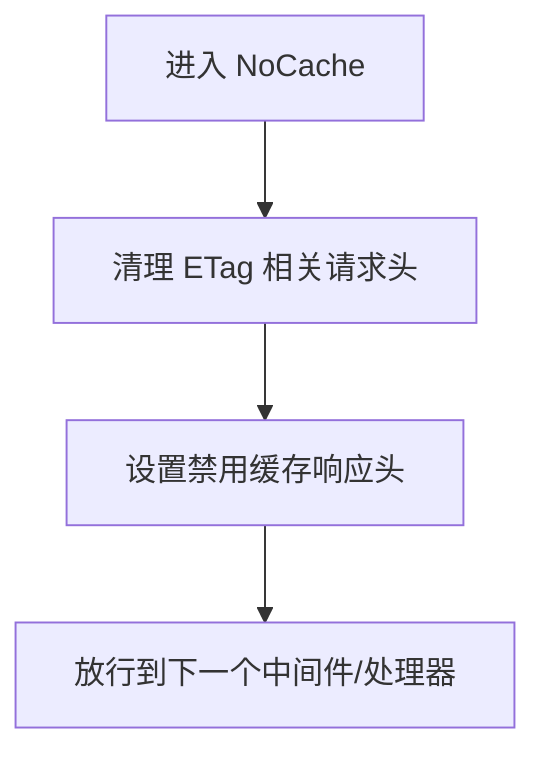
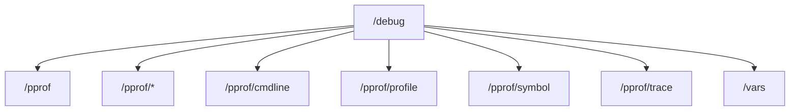
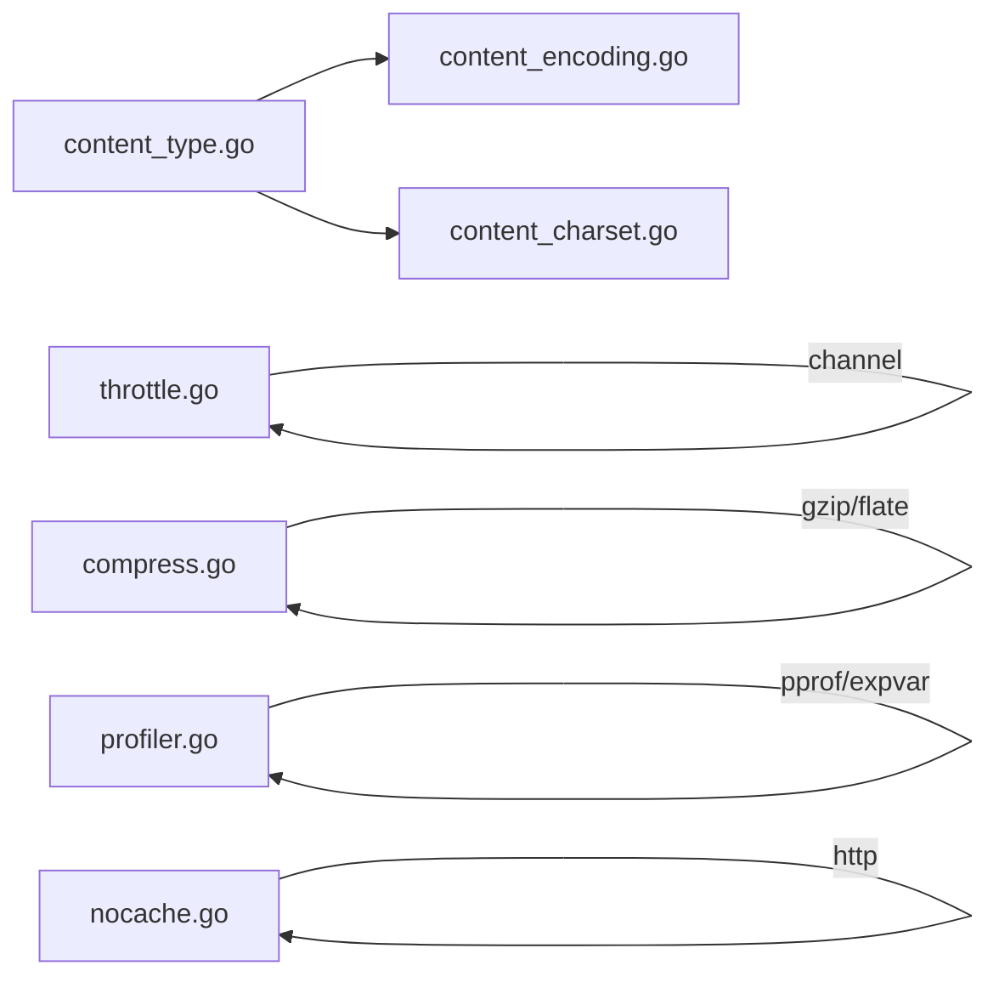

# 扩展中间件

<cite>
**本文引用的文件**
- [middleware/compress.go](file://middleware/compress.go)
- [middleware/content_type.go](file://middleware/content_type.go)
- [middleware/throttle.go](file://middleware/throttle.go)
- [middleware/nocache.go](file://middleware/nocache.go)
- [middleware/profiler.go](file://middleware/profiler.go)
- [middleware/content_encoding.go](file://middleware/content_encoding.go)
- [middleware/content_charset.go](file://middleware/content_charset.go)
- [_examples/limits/main.go](file://_examples/limits/main.go)
- [middleware/compress_test.go](file://middleware/compress_test.go)
- [middleware/throttle_test.go](file://middleware/throttle_test.go)
- [middleware/content_type_test.go](file://middleware/content_type_test.go)
</cite>

## 目录
1. [简介](#简介)
2. [项目结构](#项目结构)
3. [核心组件](#核心组件)
4. [架构总览](#架构总览)
5. [详细组件分析](#详细组件分析)
6. [依赖关系分析](#依赖关系分析)
7. [性能考量](#性能考量)
8. [故障排查指南](#故障排查指南)
9. [结论](#结论)
10. [附录](#附录)

## 简介
本篇文档围绕 chi 框架扩展中间件，系统讲解以下五个中间件：
- middleware.Compress：基于 Accept-Encoding 自动选择 gzip/deflate 压缩响应体，减少传输体积
- middleware.ContentType：自动设置响应内容类型与请求内容类型白名单校验
- middleware.Throttle：限制并发处理请求数量，防止服务过载
- middleware.NoCache：设置 HTTP 头以禁用客户端缓存
- middleware.Profiler：集成 pprof 性能分析工具，便于生产与开发环境下的可观测性

文档将从架构、数据流、处理逻辑、错误处理、性能特征等方面进行深入剖析，并结合实际应用场景给出配置参数说明、启用条件、潜在副作用以及在中间件链中的推荐位置。同时提供示例代码路径，帮助读者快速落地。

## 项目结构
本仓库采用按功能模块组织的中间件目录结构，每个中间件独立为一个文件，职责清晰、可组合性强。与本文相关的核心文件如下：
- 响应压缩：middleware/compress.go
- 内容类型控制：middleware/content_type.go、middleware/content_encoding.go、middleware/content_charset.go
- 请求限流：middleware/throttle.go
- 缓存控制：middleware/nocache.go
- 性能分析：middleware/profiler.go
- 示例与测试：_examples/limits/main.go、各中间件的 *_test.go

图表来源
- [middleware/compress.go](file://middleware/compress.go#L1-L200)
- [middleware/throttle.go](file://middleware/throttle.go#L1-L152)
- [middleware/nocache.go](file://middleware/nocache.go#L1-L60)
- [middleware/profiler.go](file://middleware/profiler.go#L1-L50)
- [_examples/limits/main.go](file://_examples/limits/main.go#L1-L93)
- [middleware/compress_test.go](file://middleware/compress_test.go#L1-L219)
- [middleware/throttle_test.go](file://middleware/throttle_test.go#L1-L331)
- [middleware/content_type_test.go](file://middleware/content_type_test.go#L1-L83)

章节来源
- [middleware/compress.go](file://middleware/compress.go#L1-L200)
- [middleware/throttle.go](file://middleware/throttle.go#L1-L152)
- [middleware/nocache.go](file://middleware/nocache.go#L1-L60)
- [middleware/profiler.go](file://middleware/profiler.go#L1-L50)
- [_examples/limits/main.go](file://_examples/limits/main.go#L1-L93)

## 核心组件
本节概述五个中间件的功能定位、典型用途与适用场景：
- Compress：面向网络带宽优化，适合静态资源、JSON、XML 等文本类响应
- ContentType：面向 API 安全与一致性，确保响应类型正确、请求体类型受控
- Throttle：面向服务稳定性，限制并发处理能力，避免雪崩
- NoCache：面向实时性与一致性，强制每次请求直达后端
- Profiler：面向可观测性，提供 pprof 路由与 expvar 指标

章节来源
- [middleware/compress.go](file://middleware/compress.go#L1-L120)
- [middleware/content_type.go](file://middleware/content_type.go#L1-L46)
- [middleware/throttle.go](file://middleware/throttle.go#L1-L80)
- [middleware/nocache.go](file://middleware/nocache.go#L1-L60)
- [middleware/profiler.go](file://middleware/profiler.go#L1-L50)

## 架构总览
下图展示了中间件在 chi 路由器中的典型装配方式与调用链顺序。建议将安全与稳定性前置，性能与可观测性按需插入。

图表来源
- [_examples/limits/main.go](file://_examples/limits/main.go#L1-L93)
- [middleware/throttle.go](file://middleware/throttle.go#L1-L152)
- [middleware/compress.go](file://middleware/compress.go#L180-L210)
- [middleware/nocache.go](file://middleware/nocache.go#L1-L60)
- [middleware/profiler.go](file://middleware/profiler.go#L1-L50)

## 详细组件分析

### Compress 响应压缩中间件
- 功能要点
  - 基于 Accept-Encoding 选择编码器（默认支持 gzip、deflate），优先级可自定义
  - 仅对允许的内容类型进行压缩，支持精确类型与通配符（如 text/*）
  - 在写入头部时设置 Content-Encoding、Vary 并移除 Content-Length，避免长度不匹配
  - 对可重置的编码器使用 sync.Pool 复用，降低 GC 压力
- 关键流程
  - 解析 Accept-Encoding，按优先级匹配可用编码器
  - 包装 ResponseWriter 为 compressResponseWriter
  - 首次 WriteHeader 判断是否可压缩、是否已有 Content-Encoding
  - 写入响应时根据 compressible 决定走压缩或直写
  - Flush/Hijack/Push/Close 等接口透传到底层 writer
- 配置参数
  - level：压缩等级（传递给 flate/gzip）
  - types：允许压缩的内容类型列表，支持通配符“/*”
- 启用条件
  - 仅当 Content-Type 在允许列表内且客户端声明了支持的编码器时生效
  - 若响应已设置 Content-Encoding，则跳过压缩
- 潜在副作用
  - 增加 CPU 开销，对小响应体收益有限
  - 移除 Content-Length，可能影响某些代理行为
- 推荐位置
  - 放在日志之后、业务处理器之前，确保日志记录到压缩后的状态
- 示例代码路径
  - [compress_test.go](file://middleware/compress_test.go#L1-L120) 展示不同 Accept-Encoding 的选择与断言
  - [compress_test.go](file://middleware/compress_test.go#L120-L219) 展示通配符与编码器优先级

图表来源
- [middleware/compress.go](file://middleware/compress.go#L180-L377)

章节来源
- [middleware/compress.go](file://middleware/compress.go#L1-L200)
- [middleware/compress.go](file://middleware/compress.go#L200-L377)
- [middleware/compress_test.go](file://middleware/compress_test.go#L1-L219)

### ContentType 内容类型中间件
- 功能要点
  - SetHeader：便捷设置任意响应头（常用于固定 Content-Type）
  - AllowContentType：对请求的 Content-Type 进行白名单校验，拒绝不被允许的媒体类型
- 关键流程
  - 对空请求体跳过校验
  - 解析 Content-Type 主类型（忽略 charset 等参数），与白名单比对
  - 不匹配则返回 415 Unsupported Media Type
- 配置参数
  - 允许的 Content-Type 列表（大小写不敏感，去除空白）
- 启用条件
  - 仅对需要严格约束请求体类型的 API 生效
- 潜在副作用
  - 可能误伤携带额外参数的合法 Content-Type（需在白名单中包含）
- 推荐位置
  - 放在鉴权之后、业务处理器之前，统一拦截非法请求体
- 示例代码路径
  - [content_type_test.go](file://middleware/content_type_test.go#L1-L83)

图表来源
- [middleware/content_type.go](file://middleware/content_type.go#L1-L46)

章节来源
- [middleware/content_type.go](file://middleware/content_type.go#L1-L46)
- [middleware/content_type_test.go](file://middleware/content_type_test.go#L1-L83)

### Throttle 速率限制中间件
- 功能要点
  - 限制当前正在处理的请求数量（in-flight），防止服务过载
  - 支持 backlog：允许有限排队等待，超时返回 429 或自定义状态码
  - 可选 Retry-After 回调，动态计算重试时间
- 关键流程
  - 使用令牌通道模拟处理槽位，支持 backlog 槽位
  - 优先尝试立即获取处理令牌；否则在超时时间内等待
  - 上下文取消时返回相应错误消息与状态码
  - 可设置自定义状态码（默认 429）
- 配置参数
  - Limit：并发处理上限
  - BacklogLimit：排队上限
  - BacklogTimeout：排队等待超时
  - StatusCode：拒绝时的状态码
  - RetryAfterFn：可选回调，返回 Retry-After 秒数
- 启用条件
  - 对高成本或易被滥用的接口启用，如批量导入、复杂查询
- 潜在副作用
  - 高并发下可能产生大量 429，需配合客户端退避策略
  - 设置过低可能导致正常流量被限流
- 推荐位置
  - 放在日志与鉴权之后、业务处理器之前
- 示例代码路径
  - [_examples/limits/main.go](file://_examples/limits/main.go#L60-L93)
  - [throttle_test.go](file://middleware/throttle_test.go#L1-L331)

图表来源
- [middleware/throttle.go](file://middleware/throttle.go#L1-L152)

章节来源
- [middleware/throttle.go](file://middleware/throttle.go#L1-L152)
- [_examples/limits/main.go](file://_examples/limits/main.go#L60-L93)
- [middleware/throttle_test.go](file://middleware/throttle_test.go#L1-L331)

### NoCache 缓存控制中间件
- 功能要点
  - 设置一组标准的禁用缓存头（Expires、Cache-Control、Pragma、X-Accel-Expires）
  - 清理可能存在的 ETag 相关请求头，避免上游代理误判
- 关键流程
  - 在进入业务处理器前清理相关请求头
  - 设置响应禁用缓存头
- 配置参数
  - 无显式参数，行为固定
- 启用条件
  - 对需要每次直达后端的接口启用，如动态生成内容、敏感数据
- 潜在副作用
  - 增加带宽消耗，对静态资源不建议全局启用
- 推荐位置
  - 放在路由分组中，针对特定子路由启用
- 示例代码路径
  - [nocache.go](file://middleware/nocache.go#L1-L60)

图表来源
- [middleware/nocache.go](file://middleware/nocache.go#L1-L60)

章节来源
- [middleware/nocache.go](file://middleware/nocache.go#L1-L60)

### Profiler 性能分析中间件
- 功能要点
  - 提供 /debug 子路由，挂载 pprof 与 expvar
  - 内部使用 NoCache，避免调试路由被缓存
  - 路由覆盖 /debug、/debug/pprof、/debug/vars 等常用路径
- 关键流程
  - 创建 chi 子路由器，注册 pprof 各端点与 expvar
  - 返回子路由器作为中间件
- 配置参数
  - 无显式参数，行为固定
- 启用条件
  - 仅在需要性能分析与指标观测时启用，建议仅在开发/测试环境或受控生产环境
- 潜在副作用
  - 暴露内部运行时信息，存在安全风险
- 推荐位置
  - 放在路由末尾或独立分组，避免干扰业务主链
- 示例代码路径
  - [profiler.go](file://middleware/profiler.go#L1-L50)

图表来源
- [middleware/profiler.go](file://middleware/profiler.go#L1-L50)

章节来源
- [middleware/profiler.go](file://middleware/profiler.go#L1-L50)

## 依赖关系分析
- 组件内聚与耦合
  - Compress 与 NoCache：均依赖标准库 http，彼此无直接耦合
  - Throttle 依赖 time 与 channel 实现令牌桶模型，与业务处理器解耦
  - Profiler 依赖 chi 子路由与 pprof/expvar，形成独立子系统
  - ContentType/Content-Encoding/Content-Charset：三者共同构成请求体类型与字符集的校验体系
- 外部依赖
  - Compress 依赖 gzip/flate 编码库
  - Profiler 依赖 pprof/expvar（非 tinygo 构建）
- 循环依赖
  - 未发现循环依赖，中间件间通过函数组合与接口解耦

图表来源
- [middleware/content_type.go](file://middleware/content_type.go#L1-L46)
- [middleware/content_encoding.go](file://middleware/content_encoding.go#L1-L35)
- [middleware/content_charset.go](file://middleware/content_charset.go#L1-L46)
- [middleware/throttle.go](file://middleware/throttle.go#L1-L152)
- [middleware/compress.go](file://middleware/compress.go#L1-L200)
- [middleware/profiler.go](file://middleware/profiler.go#L1-L50)
- [middleware/nocache.go](file://middleware/nocache.go#L1-L60)

章节来源
- [middleware/content_type.go](file://middleware/content_type.go#L1-L46)
- [middleware/content_encoding.go](file://middleware/content_encoding.go#L1-L35)
- [middleware/content_charset.go](file://middleware/content_charset.go#L1-L46)
- [middleware/throttle.go](file://middleware/throttle.go#L1-L152)
- [middleware/compress.go](file://middleware/compress.go#L1-L200)
- [middleware/profiler.go](file://middleware/profiler.go#L1-L50)
- [middleware/nocache.go](file://middleware/nocache.go#L1-L60)

## 性能考量
- Compress
  - 压缩比与 CPU 成正比，对大文本响应收益显著；小响应体可能得不偿失
  - 使用 sync.Pool 复用编码器，降低分配开销
  - 建议对 JSON、XML、HTML、CSS、JS 等文本类型启用
- Throttle
  - Limit 过小会阻断正常流量；过大则无法有效保护服务
  - BacklogLimit 与 BacklogTimeout 需结合业务峰值与 SLA 设定
  - Retry-After 可引导客户端退避，缓解瞬时洪峰
- NoCache
  - 对动态内容非常有用，但会增加带宽与后端压力
  - 建议仅对必要接口启用
- Profiler
  - 开启后会暴露运行时细节，仅在受控环境下使用
  - pprof profile 采样会带来额外 CPU 占用，建议按需开启

[本节为通用指导，无需列出具体文件来源]

## 故障排查指南
- Compress
  - 现象：响应未被压缩
    - 检查是否设置了正确的 Content-Type，或是否命中允许列表
    - 检查客户端是否声明了支持的编码器
    - 检查响应是否已设置 Content-Encoding
  - 参考测试用例路径：[compress_test.go](file://middleware/compress_test.go#L1-L120)
- Throttle
  - 现象：频繁出现 429 或超时
    - 调整 Limit、BacklogLimit、BacklogTimeout
    - 检查 Retry-After 回调是否合理
    - 参考示例路径：[_examples/limits/main.go](file://_examples/limits/main.go#L60-L93)
  - 参考测试用例路径：[throttle_test.go](file://middleware/throttle_test.go#L1-L331)
- ContentType
  - 现象：415 Unsupported Media Type
    - 检查 Content-Type 是否在白名单中（含 charset 参数）
    - 参考测试用例路径：[content_type_test.go](file://middleware/content_type_test.go#L1-L83)
- NoCache
  - 现象：上游代理仍缓存
    - 确认中间件已正确设置禁用缓存头
    - 参考实现路径：[nocache.go](file://middleware/nocache.go#L1-L60)
- Profiler
  - 现象：路由不可访问或返回 404
    - 确认已挂载到 /debug 子路由
    - 参考实现路径：[profiler.go](file://middleware/profiler.go#L1-L50)

章节来源
- [middleware/compress_test.go](file://middleware/compress_test.go#L1-L219)
- [middleware/throttle_test.go](file://middleware/throttle_test.go#L1-L331)
- [middleware/content_type_test.go](file://middleware/content_type_test.go#L1-L83)
- [_examples/limits/main.go](file://_examples/limits/main.go#L60-L93)
- [middleware/nocache.go](file://middleware/nocache.go#L1-L60)
- [middleware/profiler.go](file://middleware/profiler.go#L1-L50)

## 结论
- Compress、Throttle、NoCache、Profiler 分别从传输优化、稳定性保障、缓存控制与可观测性四个维度增强 chi 应用
- 在中间件链中，建议将安全与稳定性前置，性能与可观测性按需插入
- 配置需结合业务场景与 SLA，避免过度限制或过度暴露
- 通过示例与测试文件可快速验证中间件行为，便于在开发与生产环境中迭代优化

[本节为总结性内容，无需列出具体文件来源]

## 附录
- 中间件链推荐位置（示例）
  - 开发环境：RequestID -> Logger -> Recoverer -> Throttle -> Compress -> NoCache -> Profiler -> 业务处理器
  - 生产环境：RequestID -> Logger -> Recoverer -> Throttle -> Compress -> 业务处理器
  - 调试路由：/debug -> Profiler（独立挂载）
- 动态启用建议
  - 通过环境变量控制是否启用 Profiler 与 NoCache
  - 通过配置文件或命令行参数控制 Throttle 的 Limit/Backlog
  - 对不同路由分组启用不同的 Compress 类型白名单

[本节为实践建议，无需列出具体文件来源]