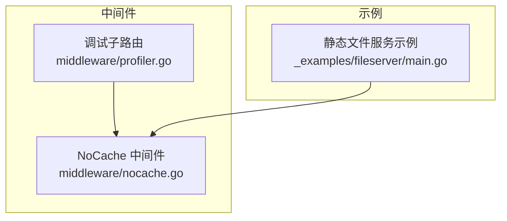
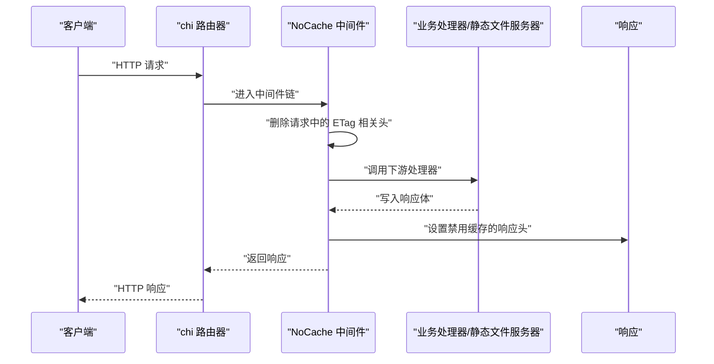
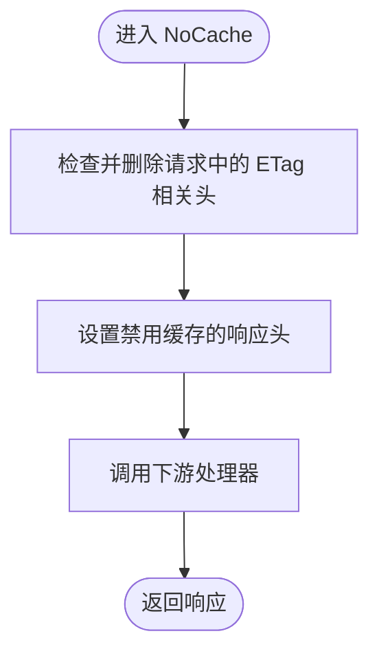
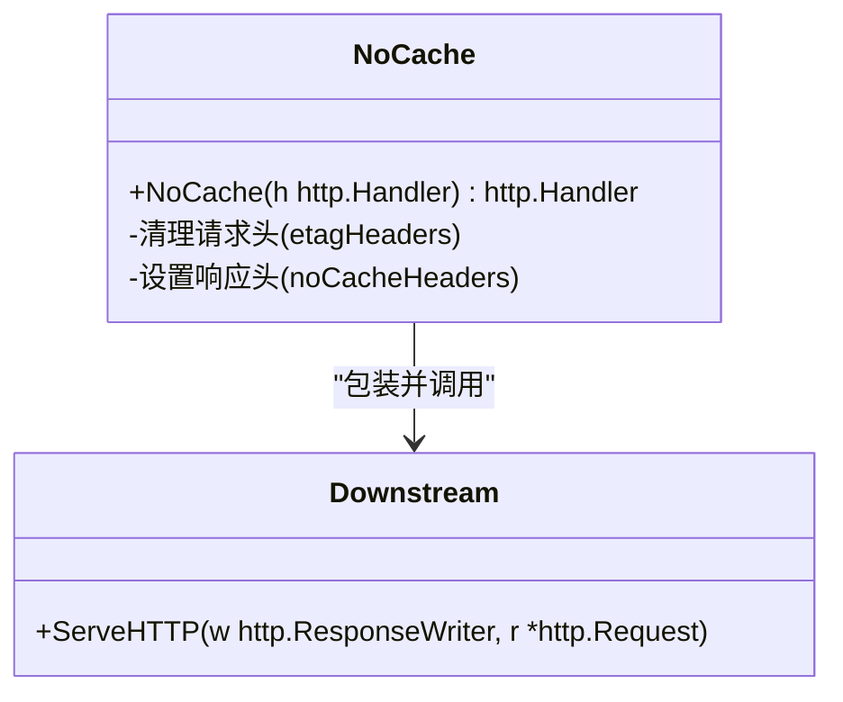
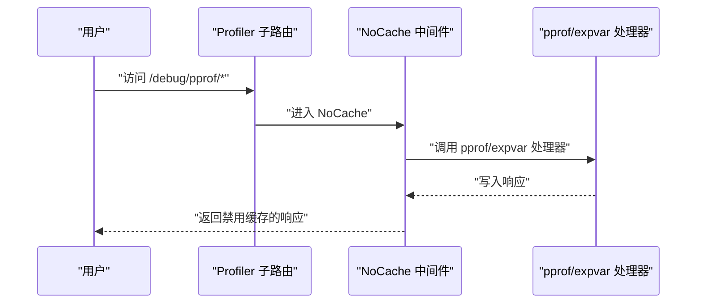
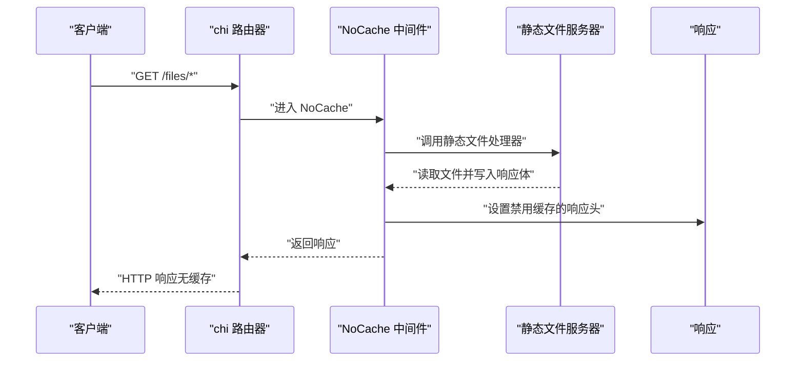
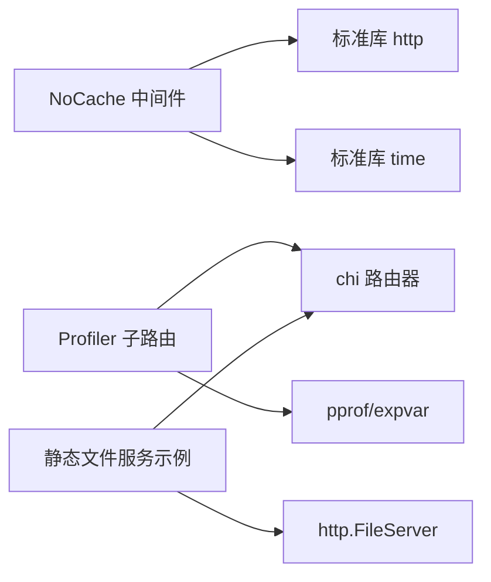

# 禁用缓存中间件

<cite>
**本文引用的文件**
- [middleware/nocache.go](file://middleware/nocache.go)
- [middleware/profiler.go](file://middleware/profiler.go)
- [_examples/fileserver/main.go](file://_examples/fileserver/main.go)
</cite>

## 目录
1. [简介](#简介)
2. [项目结构](#项目结构)
3. [核心组件](#核心组件)
4. [架构总览](#架构总览)
5. [详细组件分析](#详细组件分析)
6. [依赖关系分析](#依赖关系分析)
7. [性能考量](#性能考量)
8. [故障排查指南](#故障排查指南)
9. [结论](#结论)
10. [附录](#附录)

## 简介
本篇文档围绕 chi 框架的 middleware.NoCache 中间件展开，系统阐述其如何通过设置一系列 HTTP 响应头来阻止上游代理与客户端缓存响应；深入解析 noCacheHeaders 与 etagHeaders 映射表的设计原理；详解 NoCache(h http.Handler) 的处理流程：清除请求中的 ETag 相关头部并注入禁用缓存的响应头；结合实际应用场景（开发环境、敏感接口、调试页等）给出集成方式与最佳实践，并讨论在不同浏览器与 CDN 环境下的兼容性注意事项。

## 项目结构
NoCache 中间件位于 middleware 包中，同时在调试子路由中作为默认策略使用。示例工程展示了静态文件服务器的集成方式。

图表来源
- [middleware/nocache.go](file://middleware/nocache.go#L1-L60)
- [middleware/profiler.go](file://middleware/profiler.go#L1-L50)
- [_examples/fileserver/main.go](file://_examples/fileserver/main.go#L1-L65)

章节来源
- [middleware/nocache.go](file://middleware/nocache.go#L1-L60)
- [middleware/profiler.go](file://middleware/profiler.go#L1-L50)
- [_examples/fileserver/main.go](file://_examples/fileserver/main.go#L1-L65)

## 核心组件
- NoCache 中间件：对传入的 http.Handler 进行包装，在请求进入业务处理器前清理 ETag 相关请求头，并在响应阶段设置一组禁用缓存的响应头。
- 调试子路由：在调试页（pprof/expvar）上默认启用 NoCache，确保调试信息不被缓存。
- 静态文件服务示例：展示如何将 NoCache 应用于静态资源路由，避免浏览器或代理缓存静态文件。

章节来源
- [middleware/nocache.go](file://middleware/nocache.go#L1-L60)
- [middleware/profiler.go](file://middleware/profiler.go#L1-L50)
- [_examples/fileserver/main.go](file://_examples/fileserver/main.go#L1-L65)

## 架构总览
NoCache 作为中间件，遵循 chi 的中间件链式调用模式：在下游处理器 ServeHTTP 执行前后分别进行请求头清理与响应头注入，从而保证后续代理与客户端不会缓存该响应。

图表来源
- [middleware/nocache.go](file://middleware/nocache.go#L31-L59)
- [middleware/profiler.go](file://middleware/profiler.go#L23-L49)
- [_examples/fileserver/main.go](file://_examples/fileserver/main.go#L46-L65)

## 详细组件分析

### NoCache 中间件实现与设计
- 设计目标：防止上游代理与客户端缓存响应，常用于调试页、敏感接口、开发环境或需要实时性的接口。
- 关键数据结构：
  - noCacheHeaders：包含若干禁用缓存的响应头键值对，覆盖 Expires、Cache-Control、Pragma、X-Accel-Expires 等。
  - etagHeaders：一组与 ETag 相关的请求头名称列表，NoCache 在请求阶段会检测并删除这些头，避免上游基于条件请求触发缓存命中。
- 处理流程：
  1) 清理请求头：遍历 etagHeaders，若请求头存在则删除，确保后续处理器不会受旧条件请求影响。
  2) 注入响应头：遍历 noCacheHeaders，将禁用缓存的响应头设置到响应头集合。
  3) 调用下游处理器：执行业务逻辑并写入响应体。
- 兼容性考虑：
  - Expires 使用统一时间戳，确保跨代理与客户端一致。
  - Cache-Control 同时包含 no-cache、no-store、must-revalidate、private、max-age=0 等，覆盖现代浏览器与代理的常见缓存策略。
  - Pragma=no-cache 用于兼容 HTTP/1.0 客户端/代理。
  - X-Accel-Expires=0 用于兼容特定代理（如 Nginx）。

图表来源
- [middleware/nocache.go](file://middleware/nocache.go#L31-L59)

章节来源
- [middleware/nocache.go](file://middleware/nocache.go#L1-L60)

### noCacheHeaders 与 etagHeaders 的设计原理
- noCacheHeaders 的键值设计：
  - Expires：统一设置为“Unix 纪元”时间，使客户端认为响应已过期。
  - Cache-Control：组合多种指令，确保严格禁用缓存，包括 no-cache、no-store、must-revalidate、private、max-age=0。
  - Pragma：HTTP/1.0 兼容层，强制要求客户端不要缓存。
  - X-Accel-Expires：针对某些代理（如 Nginx）的内部缓存控制参数，设为 0 表示不缓存。
- etagHeaders 的选择：
  - ETag、If-Modified-Since、If-Match、If-None-Match、If-Range、If-Unmodified-Since：这些头与条件请求/缓存验证密切相关，NoCache 在请求阶段删除它们，避免上游基于条件请求命中缓存。

章节来源
- [middleware/nocache.go](file://middleware/nocache.go#L11-L30)

### NoCache(h http.Handler) 的调用链与行为
- 参数 h：下游处理器（可能是静态文件服务器、API 处理器或另一个中间件链）。
- 返回值：一个新的 http.Handler，包装了原始处理器。
- 调用顺序：
  1) 请求阶段：删除 etagHeaders 对应的请求头。
  2) 响应阶段：设置 noCacheHeaders 对应的响应头。
  3) 交由下游处理器继续处理。

图表来源
- [middleware/nocache.go](file://middleware/nocache.go#L31-L59)

章节来源
- [middleware/nocache.go](file://middleware/nocache.go#L31-L59)

### 实际应用场景与集成方式

#### 调试页（pprof/expvar）禁用缓存
- 场景：调试页通常包含动态统计信息，不应被缓存。
- 集成：在调试子路由中直接启用 NoCache 中间件，即可对所有调试端点生效。

图表来源
- [middleware/profiler.go](file://middleware/profiler.go#L23-L49)

章节来源
- [middleware/profiler.go](file://middleware/profiler.go#L1-L50)

#### 开发环境或敏感接口禁用缓存
- 场景：开发阶段频繁变更的页面、包含敏感信息的接口、需要每次从源站拉取最新数据的端点。
- 集成：在对应路由或子路由上挂载 NoCache 中间件，确保响应头始终禁用缓存。

章节来源
- [middleware/nocache.go](file://middleware/nocache.go#L31-L59)

#### 静态文件服务器集成
- 场景：开发阶段的静态资源（CSS/JS/HTML）频繁更新，需避免浏览器或代理缓存。
- 集成：在静态文件路由上挂载 NoCache 中间件，或在更高层级的路由组上启用，确保所有静态资源响应头禁用缓存。

图表来源
- [_examples/fileserver/main.go](file://_examples/fileserver/main.go#L46-L65)
- [middleware/nocache.go](file://middleware/nocache.go#L31-L59)

章节来源
- [_examples/fileserver/main.go](file://_examples/fileserver/main.go#L1-L65)

### 禁用缓存头的作用机制
- Expires：设置为“Unix 纪元”时间，使客户端认为响应已过期，从而不缓存。
- Cache-Control：
  - no-cache：必须先向服务器验证是否可以复用缓存。
  - no-store：禁止存储任何响应内容。
  - must-revalidate：缓存过期后必须重新验证。
  - private：仅允许客户端缓存，不允许共享缓存（如代理）。
  - max-age=0：立即过期。
- Pragma：HTTP/1.0 兼容层，no-cache 表示不要缓存。
- X-Accel-Expires：Nginx/Accel 等代理的内部缓存控制，0 表示不缓存。

章节来源
- [middleware/nocache.go](file://middleware/nocache.go#L11-L20)

### 不同浏览器与 CDN 的兼容性考虑
- 浏览器差异：现代浏览器普遍支持 Cache-Control 与 Pragma；部分老旧代理仍依赖 Pragma。
- CDN 与代理：Cloudflare、Akamai、Nginx 等对 Cache-Control 有较强支持；X-Accel-Expires 可用于特定代理（如 Nginx）。
- 最佳实践：
  - 在响应头中同时设置 Cache-Control 与 Pragma，兼顾新旧环境。
  - 对于代理可控的场景，可额外设置 X-Accel-Expires 或等效的代理缓存控制头。
  - 对于需要严格禁用缓存的敏感接口，建议在路由组或子路由上统一启用 NoCache。

章节来源
- [middleware/nocache.go](file://middleware/nocache.go#L11-L20)

## 依赖关系分析
- NoCache 依赖标准库 net/http 与 time，用于构造统一的过期时间格式与响应头设置。
- 调试子路由（Profiler）依赖 chi 路由器与 pprof/expvar，通过在子路由上启用 NoCache，确保调试页不被缓存。
- 示例静态文件服务依赖 http.FileServer 与 chi 路由器，可在静态资源路由上挂载 NoCache。

图表来源
- [middleware/nocache.go](file://middleware/nocache.go#L6-L10)
- [middleware/profiler.go](file://middleware/profiler.go#L11-L19)
- [_examples/fileserver/main.go](file://_examples/fileserver/main.go#L18-L26)

章节来源
- [middleware/nocache.go](file://middleware/nocache.go#L6-L10)
- [middleware/profiler.go](file://middleware/profiler.go#L11-L19)
- [_examples/fileserver/main.go](file://_examples/fileserver/main.go#L18-L26)

## 性能考量
- NoCache 本身开销极小，主要为一次请求头扫描与响应头设置，对吞吐量影响可忽略。
- 在高频静态资源场景下，建议仅对必要路由启用 NoCache，避免对所有静态资源都强制禁用缓存带来的带宽浪费。
- 对于生产环境，若静态资源具备强缓存策略（如带版本号或指纹），可按需关闭 NoCache，以提升缓存命中率。

## 故障排查指南
- 症状：响应头未正确禁用缓存
  - 排查：确认是否在正确的路由或子路由上挂载了 NoCache；检查下游处理器是否覆盖了响应头。
- 症状：条件请求仍然命中缓存
  - 排查：确认请求头中是否存在 ETag/If-* 相关字段；NoCache 会在请求阶段删除这些头，但若上游代理或客户端自行添加，可能仍会触发缓存。
- 症状：CDN 缓存未生效
  - 排查：确认 CDN 是否支持 Cache-Control/Pragma/X-Accel-Expires 等头；必要时在代理层配置相应的禁用缓存策略。

章节来源
- [middleware/nocache.go](file://middleware/nocache.go#L31-L59)
- [middleware/profiler.go](file://middleware/profiler.go#L23-L49)

## 结论
NoCache 中间件通过简洁而全面的响应头策略，有效阻止上游代理与客户端缓存响应，适用于开发环境、敏感接口与调试页等场景。其设计将请求头清理与响应头注入分离，既保证了条件请求不会干扰缓存策略，又确保了跨浏览器与代理的兼容性。在实际项目中，建议根据路由粒度灵活启用，平衡缓存收益与安全/实时性需求。

## 附录
- 集成要点
  - 在调试子路由上启用 NoCache，确保 pprof/expvar 页面不被缓存。
  - 在开发环境或敏感接口上启用 NoCache，避免缓存导致的数据陈旧。
  - 在静态文件路由上启用 NoCache，确保开发阶段的资源即时生效。

章节来源
- [middleware/profiler.go](file://middleware/profiler.go#L23-L49)
- [middleware/nocache.go](file://middleware/nocache.go#L31-L59)
- [_examples/fileserver/main.go](file://_examples/fileserver/main.go#L46-L65)