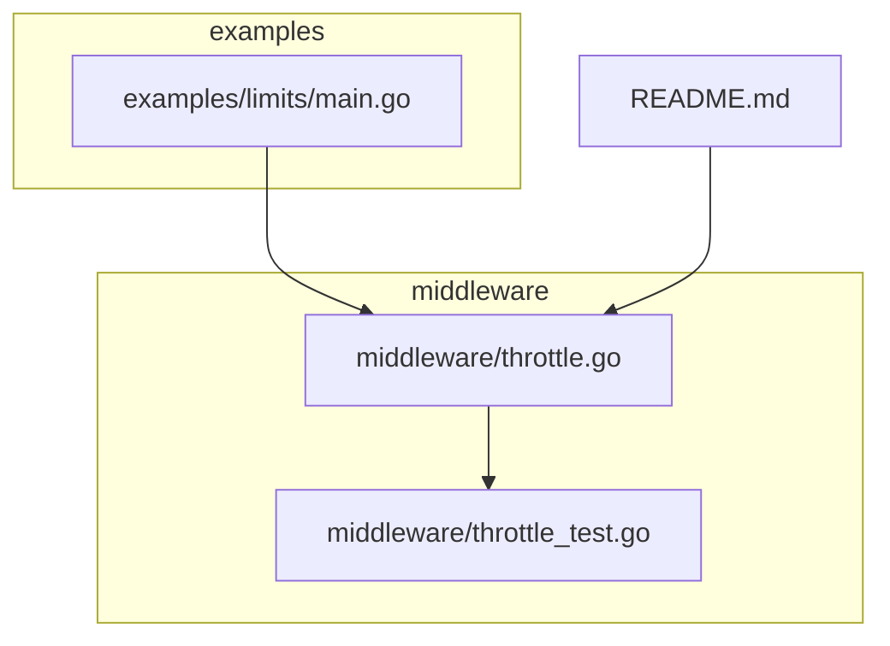
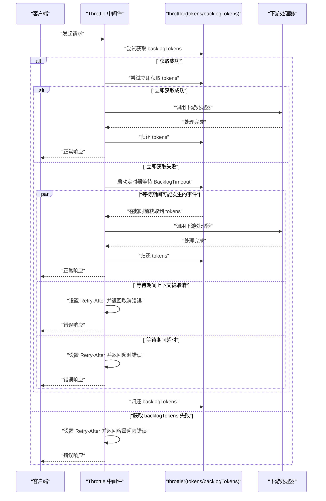
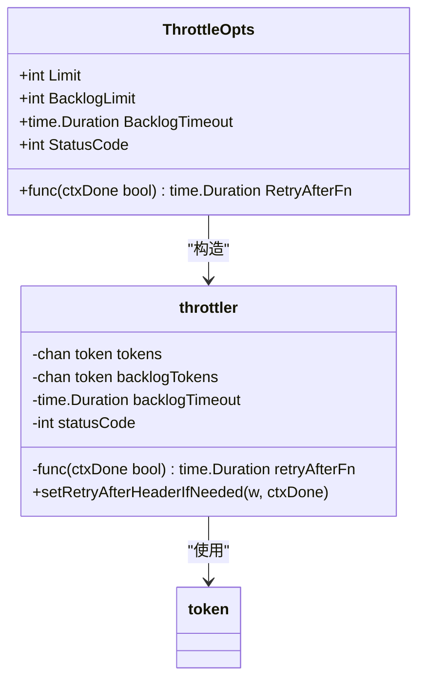
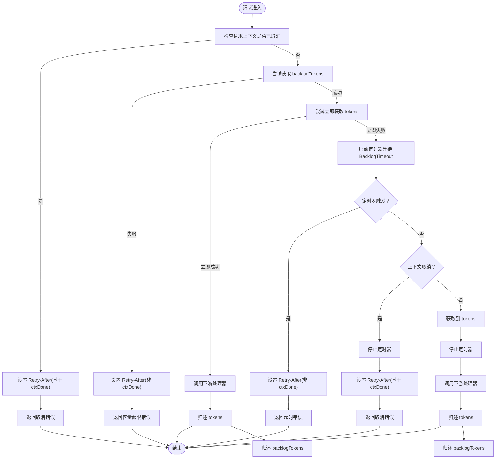
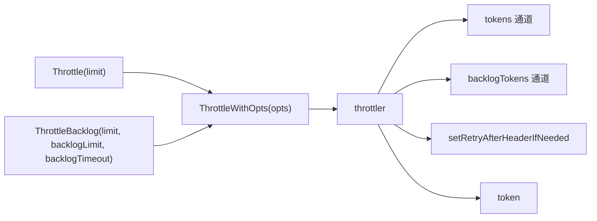

# 请求限流中间件

<cite>
**本文引用的文件列表**
- [middleware/throttle.go](file://middleware/throttle.go)
- [middleware/throttle_test.go](file://middleware/throttle_test.go)
- [_examples/limits/main.go](file://_examples/limits/main.go)
- [README.md](file://README.md)
</cite>

## 目录
1. [简介](#简介)
2. [项目结构](#项目结构)
3. [核心组件](#核心组件)
4. [架构总览](#架构总览)
5. [详细组件分析](#详细组件分析)
6. [依赖关系分析](#依赖关系分析)
7. [性能考量](#性能考量)
8. [故障排查指南](#故障排查指南)
9. [结论](#结论)
10. [附录](#附录)

## 简介
本文件围绕 chi 框架 middleware 包中的 Throttle 中间件进行系统化技术文档整理，重点阐述其基于令牌桶思想的并发请求限制机制，解析 throttler 结构体中 tokens 与 backlogTokens 通道的设计原理与限流流程；同时给出 Throttle(limit)、ThrottleWithOpts(opts) 的使用方式与参数配置策略（Limit、BacklogLimit、BacklogTimeout、StatusCode、RetryAfterFn），并结合实际场景展示如何通过该中间件保护后端服务免受 DDoS 攻击，包括自定义状态码、Retry-After 响应头以及上下文取消处理的最佳实践。最后提供高并发环境下的性能优化建议。

## 项目结构
本次文档聚焦于 middleware/throttle.go 及其配套测试用例 middleware/throttle_test.go，以及示例程序 _examples/limits/main.go 中对 Throttle 的集成使用。README.md 提供了中间件概览与生态背景。

图表来源
- [middleware/throttle.go](file://middleware/throttle.go#L1-L152)
- [middleware/throttle_test.go](file://middleware/throttle_test.go#L1-L331)
- [_examples/limits/main.go](file://_examples/limits/main.go#L1-L93)
- [README.md](file://README.md#L330-L420)

章节来源
- [middleware/throttle.go](file://middleware/throttle.go#L1-L152)
- [middleware/throttle_test.go](file://middleware/throttle_test.go#L1-L331)
- [_examples/limits/main.go](file://_examples/limits/main.go#L1-L93)
- [README.md](file://README.md#L330-L420)

## 核心组件
- ThrottleOpts：限流配置选项集合，包含 Limit、BacklogLimit、BacklogTimeout、StatusCode、RetryAfterFn。
- throttler：内部限流器，持有 tokens 与 backlogTokens 两个无缓冲令牌通道，以及超时与状态码配置。
- token：占位类型，用于表示“正在处理的请求”。
- Throttle、ThrottleBacklog、ThrottleWithOpts：对外暴露的三个构造函数，分别提供基础限流、带回退队列的限流与完整配置的限流。

章节来源
- [middleware/throttle.go](file://middleware/throttle.go#L19-L151)

## 架构总览
Throttle 中间件通过“令牌桶”思想控制并发请求数量。每个被挂载的路由组或单个路由上，都会创建一个 throttler 实例，初始化 tokens 与 backlogTokens 通道，容量分别为 Limit 与 Limit+BacklogLimit。当有新请求到来时：
- 首先尝试从 backlogTokens 获取一个“排队令牌”，若失败则直接返回容量超限错误；
- 若能获取到排队令牌，则优先尝试立即从 tokens 获取“处理令牌”；
- 若无法立即获取处理令牌，则启动一个定时器等待 BacklogTimeout；
- 在等待期间，如果请求上下文被取消，会设置 Retry-After 并返回相应错误；
- 若在超时前获得处理令牌，则继续调用下游处理器；
- 若超时仍未获得处理令牌，则设置 Retry-After 并返回超时错误；
- 处理完成后，释放令牌回到对应通道，供后续请求复用。

图表来源
- [middleware/throttle.go](file://middleware/throttle.go#L44-L131)

## 详细组件分析

### throttler 结构体与令牌通道设计
- tokens：容量为 Limit 的通道，用于控制当前可并行处理的请求数量。每次成功从 tokens 获取令牌即代表进入“处理阶段”，处理完成后必须归还。
- backlogTokens：容量为 Limit+BacklogLimit 的通道，用于控制“排队等待”的请求数量。请求只有在拿到 backlogTokens 后才进入等待阶段；一旦超时或上下文取消，需要及时归还。
- backlogTimeout：等待处理令牌的超时时间，超过该时间未获得处理令牌则拒绝请求。
- statusCode：自定义错误状态码，默认使用 Too Many Requests。
- retryAfterFn：可选的 Retry-After 计算函数，根据 ctxDone 参数返回秒数，用于设置响应头 Retry-After。

图表来源
- [middleware/throttle.go](file://middleware/throttle.go#L19-L151)

章节来源
- [middleware/throttle.go](file://middleware/throttle.go#L19-L151)

### Throttle(limit) 与 ThrottleWithOpts(opts)
- Throttle(limit)：快速构造仅限制并发数的限流器，内部默认使用默认回退超时。
- ThrottleWithOpts(opts)：完整配置入口，校验 Limit > 0、BacklogLimit >= 0，设置默认状态码，初始化令牌通道并填充初始令牌，返回中间件函数。
- ThrottleBacklog(limit, backlogLimit, backlogTimeout)：便捷构造带回退队列的限流器。

章节来源
- [middleware/throttle.go](file://middleware/throttle.go#L32-L41)
- [middleware/throttle.go](file://middleware/throttle.go#L44-L73)

### 令牌获取与等待逻辑（流程图）
以下流程图映射到 ThrottleWithOpts 内部的请求处理主流程，涵盖上下文取消、超时与正常处理路径。

图表来源
- [middleware/throttle.go](file://middleware/throttle.go#L74-L131)

章节来源
- [middleware/throttle.go](file://middleware/throttle.go#L74-L131)

### 参数与配置策略
- Limit：最大并发处理数。建议根据后端资源（CPU、内存、数据库连接池）与 SLA 设定，避免过载导致雪崩。
- BacklogLimit：排队等待的最大请求数。与 Limit 共同决定 backlogTokens 容量，合理设置可提升吞吐但需注意内存占用与延迟。
- BacklogTimeout：排队等待超时时间。过短可能导致大量排队请求被拒绝，过长会放大排队延迟与资源占用。
- StatusCode：自定义错误状态码。默认使用 Too Many Requests；在某些场景下可改为 Service Unavailable 以区分“临时过载”与“速率限制”。
- RetryAfterFn：可选的 Retry-After 计算函数。可用于动态调整重试间隔，例如基于队列长度或系统负载指数增长。

章节来源
- [middleware/throttle.go](file://middleware/throttle.go#L19-L64)
- [middleware/throttle.go](file://middleware/throttle.go#L145-L151)

### 使用示例与场景
- 示例一：在路由组中使用 Throttle(1) 限制单实例并发处理，配合 Timeout 防止慢请求拖垮服务。
- 示例二：ThrottleBacklog(10, 50, time.Second*10) 在高并发场景下允许有限排队，平衡吞吐与延迟。
- 示例三：ThrottleWithOpts(ThrottleOpts{Limit: 5, BacklogLimit: 0, RetryAfterFn: ...}) 自定义 Retry-After 以指导客户端重试策略。

章节来源
- [_examples/limits/main.go](file://_examples/limits/main.go#L63-L92)
- [middleware/throttle_test.go](file://middleware/throttle_test.go#L17-L56)
- [middleware/throttle_test.go](file://middleware/throttle_test.go#L202-L262)

### 错误处理与响应行为
- 上下文取消：设置 Retry-After 并返回取消错误。
- 超时：设置 Retry-After 并返回超时错误。
- 容量超限：设置 Retry-After 并返回容量超限错误。
- 默认状态码：若未显式设置，使用 Too Many Requests；可通过 StatusCode 自定义。

章节来源
- [middleware/throttle.go](file://middleware/throttle.go#L74-L131)
- [middleware/throttle.go](file://middleware/throttle.go#L53-L56)

### 测试覆盖要点
- 回退队列吞吐：验证在 Limit=10、BacklogLimit=50、BacklogTimeout=10s 下的并发处理与客户端超时行为。
- 客户端超时：验证客户端自身超时导致的请求失败。
- 网关超时触发：验证在长时间处理场景下，排队请求最终因超时而被拒绝。
- 最大容量限制：验证在服务器处理高峰时，超出容量的请求被拒绝。
- Retry-After 设置：验证 Retry-After 响应头按 RetryAfterFn 返回的秒数设置。
- 自定义状态码：验证 StatusCode 可被设置为 Service Unavailable 等。

章节来源
- [middleware/throttle_test.go](file://middleware/throttle_test.go#L17-L56)
- [middleware/throttle_test.go](file://middleware/throttle_test.go#L58-L142)
- [middleware/throttle_test.go](file://middleware/throttle_test.go#L144-L200)
- [middleware/throttle_test.go](file://middleware/throttle_test.go#L202-L262)
- [middleware/throttle_test.go](file://middleware/throttle_test.go#L264-L314)

## 依赖关系分析
- Throttle 与 ThrottleBacklog 通过 ThrottleWithOpts 统一构建 throttler 实例，后者负责令牌通道初始化与默认值设置。
- throttler 依赖 token 类型作为令牌占位符，不携带业务数据。
- setRetryAfterHeaderIfNeeded 仅在 RetryAfterFn 非空时设置 Retry-After 响应头。

图表来源
- [middleware/throttle.go](file://middleware/throttle.go#L32-L73)
- [middleware/throttle.go](file://middleware/throttle.go#L133-L151)

章节来源
- [middleware/throttle.go](file://middleware/throttle.go#L32-L73)
- [middleware/throttle.go](file://middleware/throttle.go#L133-L151)

## 性能考量
- 令牌通道容量与并发：Limit 直接决定峰值并发，BacklogLimit 决定排队容量。两者越大，延迟与内存占用越高。
- 超时阈值：BacklogTimeout 过小会导致大量排队请求被拒绝，过大则放大排队延迟。建议结合监控指标动态调整。
- Retry-After 动态策略：通过 RetryAfterFn 返回指数增长的重试间隔，有助于削峰与缓解 DDoS。
- 上下文取消：利用请求上下文取消快速释放资源，避免僵尸请求占用令牌。
- 基准测试：参考 BenchmarkThrottle，评估在高 QPS 场景下的分配与执行开销，必要时考虑更高效的并发控制方案或分层限流。

章节来源
- [middleware/throttle_test.go](file://middleware/throttle_test.go#L315-L331)

## 故障排查指南
- 状态码异常：确认 StatusCode 是否被正确设置；默认为 Too Many Requests。
- Retry-After 缺失：确认 RetryAfterFn 是否为空；仅在非空时设置响应头。
- 频繁超时：检查 BacklogTimeout 是否过短；适当增大以允许更多排队。
- 排队过多：检查 BacklogLimit 是否过小；适当增大以提升吞吐，同时关注内存占用。
- 上下文取消频繁：检查上游 Timeout 或客户端主动取消；确保合理的超时与重试策略。
- DDoS 防护：结合 Rate Limiter（如独立的 httprate）与 Throttle 分层防护，Throttle 侧重“并发上限”，Rate Limiter 侧重“速率限制”。

章节来源
- [middleware/throttle.go](file://middleware/throttle.go#L53-L56)
- [middleware/throttle.go](file://middleware/throttle.go#L145-L151)
- [middleware/throttle_test.go](file://middleware/throttle_test.go#L58-L142)

## 结论
Throttle 中间件通过令牌桶思想有效限制了服务的并发处理能力，结合回退队列与超时机制，在高并发与突发流量场景下提供了稳定的保护。通过合理配置 Limit、BacklogLimit、BacklogTimeout、StatusCode 与 RetryAfterFn，可以在保证用户体验的同时，避免服务过载与雪崩。建议在生产环境中结合监控与动态调参，持续优化限流策略以适配业务流量特征。

## 附录
- 参考示例：在路由组中使用 Throttle 与 Timeout 组合，保护昂贵操作。
- 文档索引：README 中列出 Throttle、ThrottleBacklog、ThrottleWithOpts 等中间件条目与链接。

章节来源
- [_examples/limits/main.go](file://_examples/limits/main.go#L63-L92)
- [README.md](file://README.md#L330-L420)