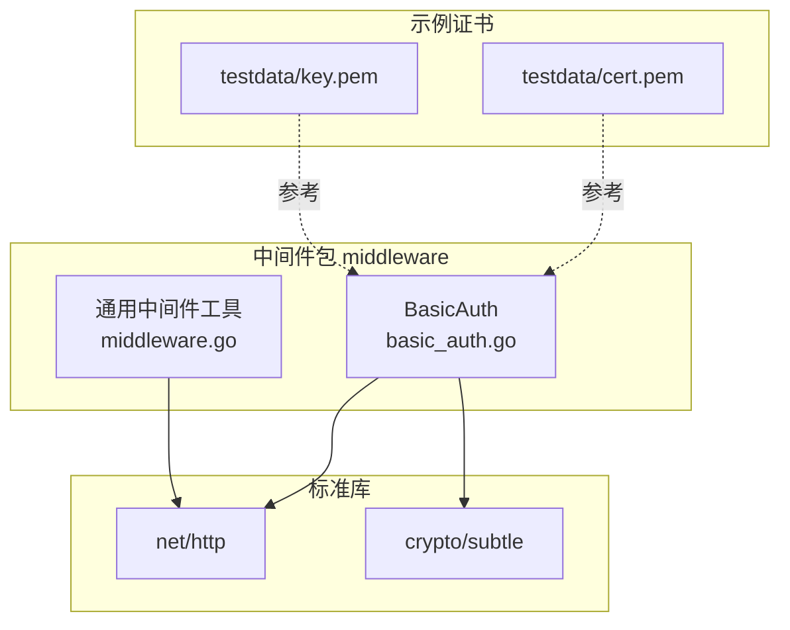
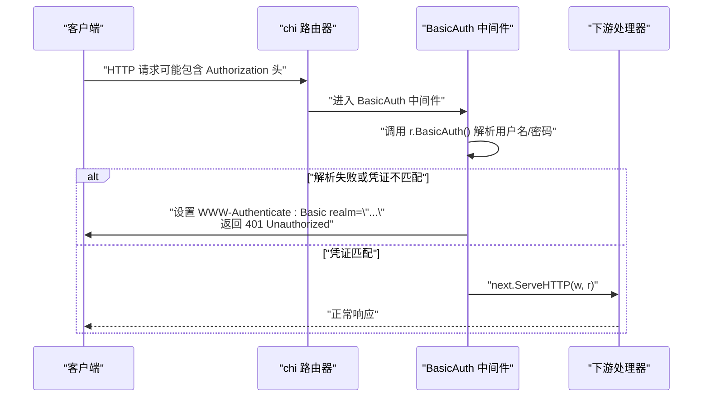
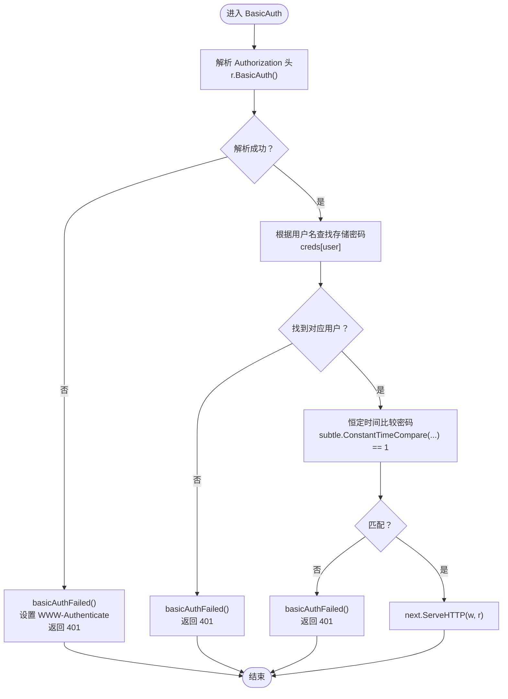
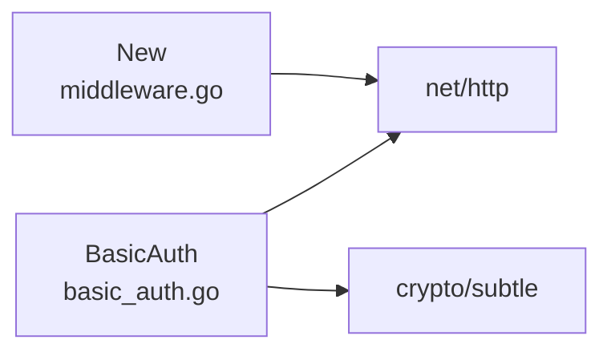

# 基本认证中间件

<cite>
**本文引用的文件**
- [middleware/basic_auth.go](file://middleware/basic_auth.go)
- [middleware/middleware.go](file://middleware/middleware.go)
- [README.md](file://README.md)
- [testdata/cert.pem](file://testdata/cert.pem)
- [testdata/key.pem](file://testdata/key.pem)
</cite>

## 目录
1. [简介](#简介)
2. [项目结构](#项目结构)
3. [核心组件](#核心组件)
4. [架构总览](#架构总览)
5. [详细组件分析](#详细组件分析)
6. [依赖关系分析](#依赖关系分析)
7. [性能考量](#性能考量)
8. [故障排查指南](#故障排查指南)
9. [结论](#结论)
10. [附录](#附录)

## 简介
本篇文档围绕 chi 框架的 BasicAuth 中间件展开，系统阐述其如何实现 HTTP 基本认证机制：从解析 Authorization 头、校验用户名与密码，到返回 401 Unauthorized 响应；重点解释如何使用 crypto/subtle 的恒定时间字符串比较以抵御时序攻击；说明 realm 参数在 WWW-Authenticate 头中的作用；并基于源码展示认证流程的关键步骤。同时给出在实际项目中使用该中间件的最佳实践，包括密码安全存储建议（应使用哈希）、与 TLS 的配合使用、在 API 网关中的应用以及替代方案（如 JWT）。

## 项目结构
BasicAuth 中间件位于 middleware 包内，采用“闭包式中间件”风格，返回一个函数，该函数接收下一个处理器并返回一个新的 http.Handler。其依赖标准库 net/http 提供的请求解析能力，以及 crypto/subtle 提供的恒定时间比较。

图表来源
- [middleware/basic_auth.go](file://middleware/basic_auth.go#L1-L34)
- [middleware/middleware.go](file://middleware/middleware.go#L1-L24)
- [testdata/cert.pem](file://testdata/cert.pem#L1-L27)
- [testdata/key.pem](file://testdata/key.pem#L1-L27)

章节来源
- [middleware/basic_auth.go](file://middleware/basic_auth.go#L1-L34)
- [middleware/middleware.go](file://middleware/middleware.go#L1-L24)
- [README.md](file://README.md#L330-L390)

## 核心组件
- BasicAuth(realm string, creds map[string]string) func(next http.Handler) http.Handler
  - 返回一个闭包式中间件，接收下一个处理器 next 并返回新的 http.Handler。
  - 在内部处理逻辑中：
    - 调用 r.BasicAuth() 解析 Authorization 头，得到用户名与密码。
    - 若解析失败或凭证不匹配，则设置 WWW-Authenticate: Basic realm="..." 并返回 401。
    - 若匹配成功，则放行至下一个处理器 next.ServeHTTP(w, r)。

- basicAuthFailed(w http.ResponseWriter, realm string)
  - 设置 WWW-Authenticate 头并返回 401 状态码。

- 凭证存储模型
  - 使用 map[string]string 存储用户名到明文密码的映射。
  - 该模型简单直观，适用于小规模、静态配置的场景；生产环境强烈建议使用密码哈希存储。

- 恒定时间比较
  - 使用 crypto/subtle.ConstantTimeCompare 对比客户端提供的密码与存储的密码，避免时序攻击。

- realm 参数
  - 作为 WWW-Authenticate 响应头中的 realm 字段值，用于向客户端提示受保护资源的域名称。

章节来源
- [middleware/basic_auth.go](file://middleware/basic_auth.go#L9-L33)

## 架构总览
BasicAuth 中间件在 chi 的中间件链路中扮演“鉴权守门人”的角色。它在进入业务处理器之前执行，若认证失败则直接返回 401，不再继续后续处理。

图表来源
- [middleware/basic_auth.go](file://middleware/basic_auth.go#L12-L26)

## 详细组件分析

### BasicAuth 实现与数据流
- 输入
  - realm: 字符串，用于 WWW-Authenticate 头的 realm 字段。
  - creds: map[string]string，用户名到密码的映射。
  - next: 下一个处理器。

- 处理逻辑
  - 解析 Authorization 头：r.BasicAuth() 返回用户名、密码与是否解析成功的布尔值。
  - 用户名查找：creds[user] 获取存储的密码。
  - 密码比较：subtle.ConstantTimeCompare([]byte(pass), []byte(credPass)) == 1 才视为匹配。
  - 失败路径：basicAuthFailed(w, realm) 设置 WWW-Authenticate 头并返回 401。
  - 成功路径：next.ServeHTTP(w, r) 继续处理。

- 关键点
  - 恒定时间比较：避免因比较过程中的分支差异导致时序侧信道泄露。
  - WWW-Authenticate 头：遵循 HTTP 基本认证规范，提示客户端重新发起带凭据的请求。

图表来源
- [middleware/basic_auth.go](file://middleware/basic_auth.go#L12-L26)

章节来源
- [middleware/basic_auth.go](file://middleware/basic_auth.go#L9-L33)

### realm 参数的作用
- BasicAuth 在认证失败时会设置响应头 WWW-Authenticate: Basic realm="..."。
- realm 的作用是向客户端提示受保护资源所属的域或区域，便于客户端正确弹出认证对话框或构造后续请求。
- 该行为符合 HTTP 基本认证规范。

章节来源
- [middleware/basic_auth.go](file://middleware/basic_auth.go#L30-L33)

### 凭证存储模型与适用场景
- 当前实现使用 map[string]string 存储用户名到明文密码的映射。
- 优点：实现简单、易于配置。
- 局限性：明文密码存储存在安全风险；不适合大规模或动态管理的场景。
- 适用场景：开发测试、内部工具、一次性部署且对安全性要求不高的场景。
- 生产建议：将密码替换为哈希值（例如 bcrypt、scrypt、argon2），并在认证时使用哈希验证算法进行比对。

章节来源
- [middleware/basic_auth.go](file://middleware/basic_auth.go#L9-L11)

### 时序攻击与恒定时间比较
- BasicAuth 使用 crypto/subtle.ConstantTimeCompare 进行密码比较，确保比较过程的时间复杂度与输入无关，从而避免时序侧信道攻击。
- 这对于防止通过微秒级计时推断密码长度或部分字符非常关键。

章节来源
- [middleware/basic_auth.go](file://middleware/basic_auth.go#L19-L21)

### 与 TLS 的配合使用
- HTTP 基本认证在传输层未加密的情况下，用户名与密码会以 Base64 编码形式在网络中传输，存在被截获的风险。
- 因此，BasicAuth 应与 TLS（HTTPS）配合使用，确保传输层加密。
- 仓库中提供了自签名证书样例文件，可参考其使用方式在本地或测试环境中启用 HTTPS。

章节来源
- [testdata/cert.pem](file://testdata/cert.pem#L1-L27)
- [testdata/key.pem](file://testdata/key.pem#L1-L27)

### 在 API 网关中的应用
- BasicAuth 可用于 API 网关的入口处，统一拦截并校验客户端凭据，再将请求转发给后端服务。
- 适合对内部接口或调试接口进行轻量级访问控制。
- 对于需要细粒度权限控制、多租户隔离或长期令牌管理的场景，建议采用更成熟的鉴权方案（见“替代方案”）。

### 替代方案（如 JWT）
- JWT：适合长生命周期令牌、跨域单点登录、携带声明（claims）等场景。
- OAuth2/OpenID Connect：适合复杂的授权与身份协议集成。
- BasicAuth：适合简单场景、临时访问或内部工具。

章节来源
- [README.md](file://README.md#L409-L421)

## 依赖关系分析
- BasicAuth 依赖
  - net/http：r.BasicAuth()、状态码与响应头设置。
  - crypto/subtle：恒定时间字符串比较。
- 通用中间件工具
  - middleware.New：提供将 http.Handler 封装为中间件的标准模式，便于理解中间件链的构建方式。

图表来源
- [middleware/basic_auth.go](file://middleware/basic_auth.go#L3-L7)
- [middleware/middleware.go](file://middleware/middleware.go#L1-L12)

章节来源
- [middleware/basic_auth.go](file://middleware/basic_auth.go#L3-L7)
- [middleware/middleware.go](file://middleware/middleware.go#L1-L12)

## 性能考量
- BasicAuth 的认证开销主要来自：
  - 解析 Authorization 头（常数时间）。
  - map 查找用户名（平均 O(1)，取决于实现细节）。
  - 恒定时间字符串比较（与密码长度线性相关，但时间消耗与输入无关）。
- 对于高并发场景，建议：
  - 将 BasicAuth 放置在中间件链靠前位置，尽早失败以减少后续处理。
  - 使用内存缓存或只读共享数据结构存储凭证，避免频繁拷贝。
  - 配合上游限流与重试策略，降低暴力破解压力。

## 故障排查指南
- 401 Unauthorized 但浏览器未弹窗
  - 检查是否正确设置了 WWW-Authenticate: Basic realm="..."。
  - 确认请求是否通过 HTTPS 发送（HTTP 明文传输可能导致客户端不触发弹窗）。
- 认证失败但日志无异常
  - 确认 Authorization 头格式是否符合 Basic scheme（用户名:密码 Base64 编码）。
  - 检查用户名是否存在且大小写是否一致。
- 时序攻击防护
  - 确保使用恒定时间比较，避免提前短路判断。
- TLS 配置问题
  - 自签名证书仅用于测试，生产需使用受信任 CA 签发的证书。

章节来源
- [middleware/basic_auth.go](file://middleware/basic_auth.go#L30-L33)
- [testdata/cert.pem](file://testdata/cert.pem#L1-L27)
- [testdata/key.pem](file://testdata/key.pem#L1-L27)

## 结论
BasicAuth 中间件以简洁的实现提供了 HTTP 基本认证的核心能力：解析 Authorization 头、校验用户名与密码、返回 401 并设置 WWW-Authenticate 头。通过 crypto/subtle 的恒定时间比较有效降低了时序攻击风险。凭证存储采用 map[string]string 的简单模型，适合小规模与测试场景；生产环境应改用密码哈希存储。配合 TLS 使用可显著提升安全性。对于更复杂的鉴权需求，可考虑 JWT 或 OAuth2 等替代方案。

## 附录
- 在 chi 中使用 BasicAuth 的典型步骤
  - 定义 realm 字符串与凭证映射。
  - 将 BasicAuth 作为中间件插入到路由器的中间件栈中。
  - 在需要保护的路由或路由组上应用该中间件。
- 示例路径参考
  - BasicAuth 定义与实现：[middleware/basic_auth.go](file://middleware/basic_auth.go#L9-L33)
  - 中间件通用封装工具：[middleware/middleware.go](file://middleware/middleware.go#L1-L12)
  - README 中 BasicAuth 列表项与说明：[README.md](file://README.md#L338-L344)