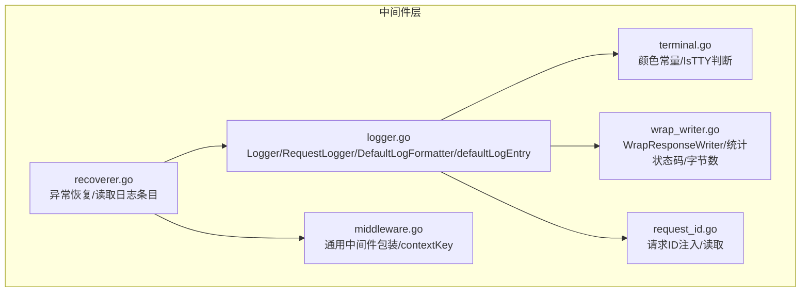
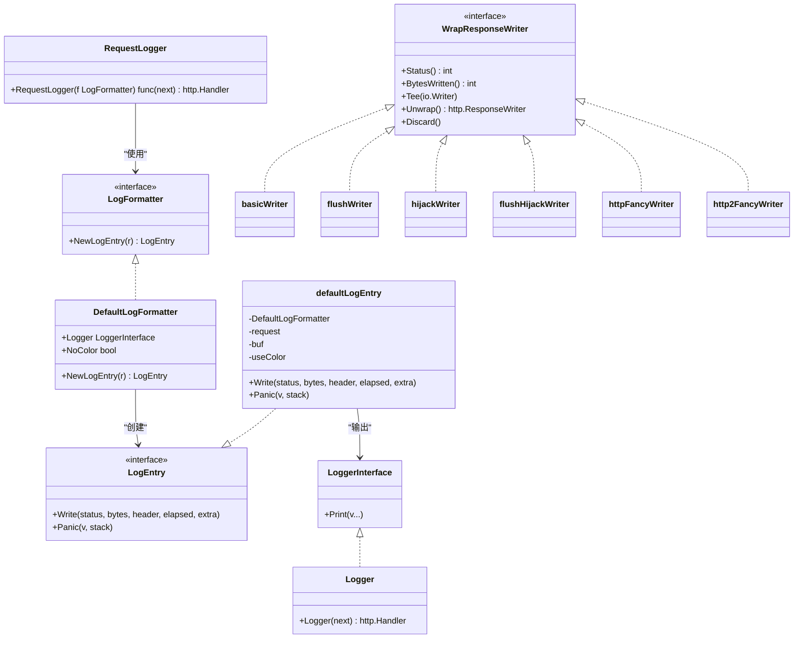
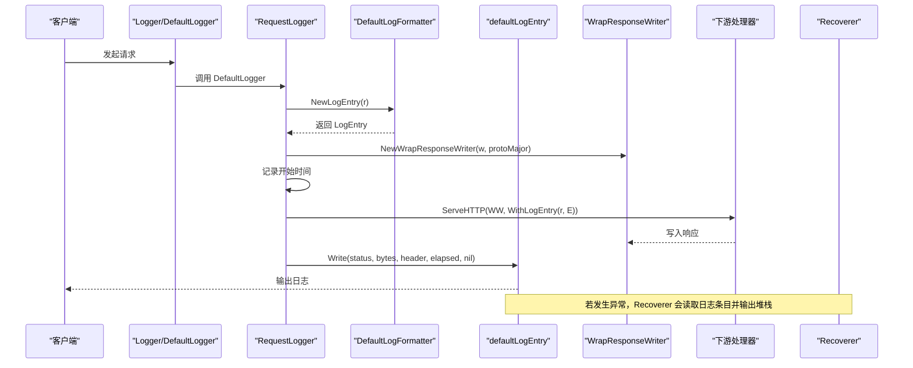
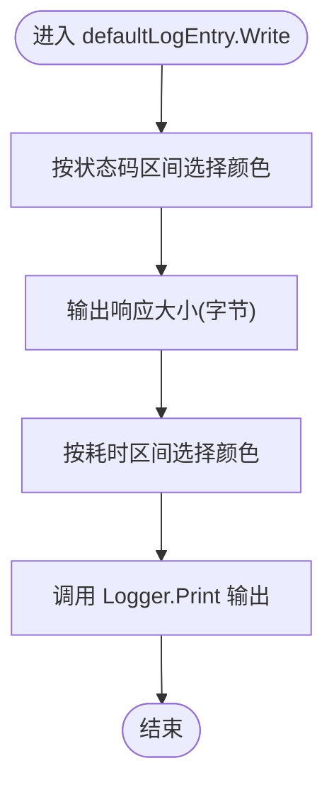
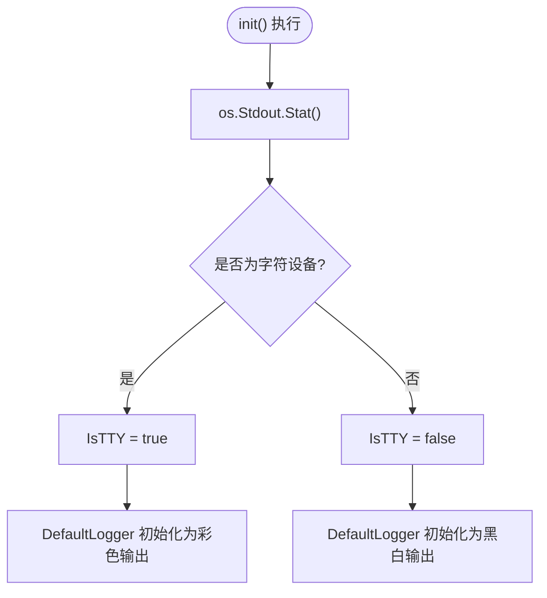
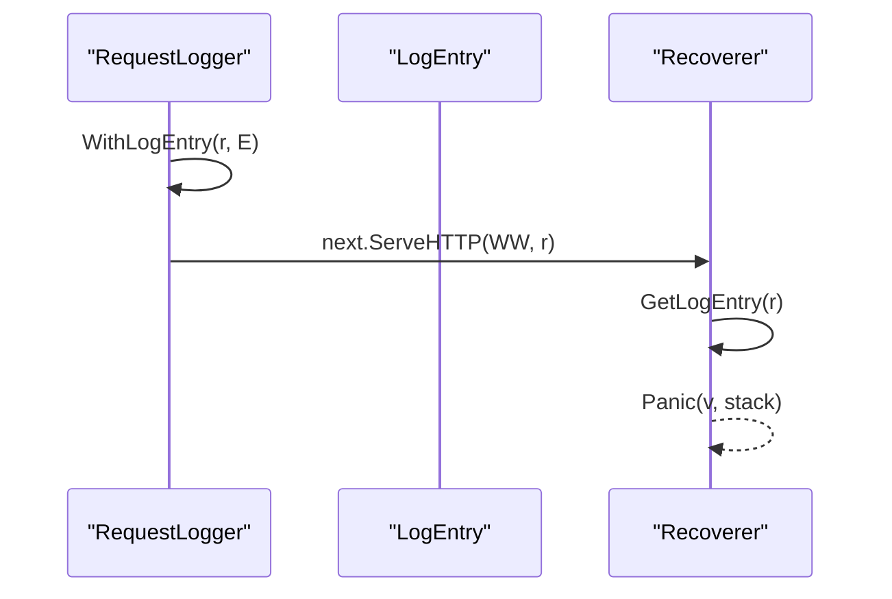
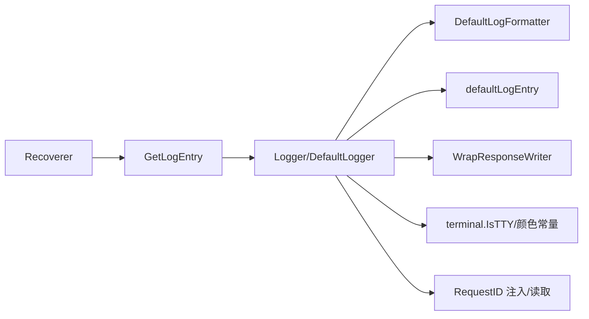

# 日志记录中间件

<cite>
**本文引用的文件**
- [middleware/logger.go](file://middleware/logger.go)
- [middleware/terminal.go](file://middleware/terminal.go)
- [middleware/wrap_writer.go](file://middleware/wrap_writer.go)
- [middleware/request_id.go](file://middleware/request_id.go)
- [middleware/recoverer.go](file://middleware/recoverer.go)
- [middleware/middleware.go](file://middleware/middleware.go)
- [_examples/logging/main.go](file://_examples/logging/main.go)
</cite>

## 目录
1. [简介](#简介)
2. [项目结构](#项目结构)
3. [核心组件](#核心组件)
4. [架构总览](#架构总览)
5. [组件详解](#组件详解)
6. [依赖关系分析](#依赖关系分析)
7. [性能考量](#性能考量)
8. [故障排查指南](#故障排查指南)
9. [结论](#结论)
10. [附录](#附录)

## 简介
本文件围绕 chi 框架的 middleware.Logger 日志中间件展开，系统性解析其内部实现机制与最佳实践。重点覆盖：
- Logger 的工作原理：如何通过 RequestLogger 包装链路，记录请求方法、协议、状态码、响应大小、处理时间等关键指标
- 默认日志格式器 DefaultLogFormatter 与默认日志条目 defaultLogEntry 的职责划分
- TTY 环境下的彩色输出机制与 Windows 平台兼容策略
- 通过 RequestLogger 函数自定义日志格式的扩展点
- 日志条目如何借助 context.Context 在中间件链中传递与共享
- 与其他中间件（如 Recoverer）的启用顺序要求与原因
- 全局与局部应用 Logger 的差异与示例路径

## 项目结构
日志中间件位于 middleware 子包中，核心文件如下：
- middleware/logger.go：Logger 中间件主体、默认格式器、日志条目接口与上下文存取工具
- middleware/terminal.go：终端颜色常量与 TTY 判断逻辑
- middleware/wrap_writer.go：响应写入器包装器，用于统计状态码、字节数与支持高级接口
- middleware/request_id.go：请求 ID 注入与读取，便于日志关联
- middleware/recoverer.go：异常恢复中间件，演示如何从上下文中读取日志条目
- middleware/middleware.go：通用中间件包装与 contextKey 定义
- _examples/logging/main.go：示例入口（指向更完整的结构化日志方案）

图表来源
- [middleware/logger.go](file://middleware/logger.go#L1-L173)
- [middleware/terminal.go](file://middleware/terminal.go#L1-L64)
- [middleware/wrap_writer.go](file://middleware/wrap_writer.go#L1-L242)
- [middleware/request_id.go](file://middleware/request_id.go#L1-L97)
- [middleware/recoverer.go](file://middleware/recoverer.go#L1-L204)
- [middleware/middleware.go](file://middleware/middleware.go#L1-L24)

章节来源
- [middleware/logger.go](file://middleware/logger.go#L1-L173)
- [middleware/terminal.go](file://middleware/terminal.go#L1-L64)
- [middleware/wrap_writer.go](file://middleware/wrap_writer.go#L1-L242)
- [middleware/request_id.go](file://middleware/request_id.go#L1-L97)
- [middleware/recoverer.go](file://middleware/recoverer.go#L1-L204)
- [middleware/middleware.go](file://middleware/middleware.go#L1-L24)

## 核心组件
- Logger 中间件：对外暴露 Logger 函数，内部委托给 DefaultLogger；注释明确要求应置于可能修改响应的中间件（如 Recoverer）之前
- RequestLogger：以自定义 LogFormatter 创建每请求的日志条目，包装 ResponseWriter 以统计状态码与字节数，计算耗时并最终写入日志
- DefaultLogFormatter：默认格式器，负责生成日志条目并控制是否启用彩色输出
- defaultLogEntry：默认日志条目实现，负责最终格式化输出与按状态码/耗时着色
- WrapResponseWriter：响应写入器包装器，提供 Status()/BytesWritten() 等统计能力
- TTY 颜色输出：通过 terminal.go 提供的颜色常量与 IsTTY 判断，在终端环境下输出彩色日志
- 请求 ID：通过 request_id.go 注入并读取，便于跨中间件关联日志
- 上下文传递：通过 LogEntryCtxKey 与 GetLogEntry/WithLogEntry 在中间件链中传递日志条目

章节来源
- [middleware/logger.go](file://middleware/logger.go#L1-L173)
- [middleware/terminal.go](file://middleware/terminal.go#L1-L64)
- [middleware/wrap_writer.go](file://middleware/wrap_writer.go#L1-L242)
- [middleware/request_id.go](file://middleware/request_id.go#L1-L97)

## 架构总览
下面的类图展示了日志中间件的核心类型与关系，映射到实际源码：

图表来源
- [middleware/logger.go](file://middleware/logger.go#L61-L173)
- [middleware/wrap_writer.go](file://middleware/wrap_writer.go#L46-L242)

章节来源
- [middleware/logger.go](file://middleware/logger.go#L61-L173)
- [middleware/wrap_writer.go](file://middleware/wrap_writer.go#L46-L242)

## 组件详解

### Logger 中间件与 RequestLogger 工作流
- Logger 将请求交由 DefaultLogger 处理，默认委托给 RequestLogger(&DefaultLogFormatter{})
- RequestLogger 接收自定义 LogFormatter，为每个请求创建 LogEntry
- 使用 NewWrapResponseWriter 包装原始 ResponseWriter，以便统计状态码与字节数
- 记录开始时间，defer 中计算耗时并调用 LogEntry.Write 输出结果
- 通过 WithLogEntry 将日志条目放入请求上下文，供后续中间件读取

图表来源
- [middleware/logger.go](file://middleware/logger.go#L39-L84)
- [middleware/logger.go](file://middleware/logger.go#L107-L125)
- [middleware/logger.go](file://middleware/logger.go#L134-L160)
- [middleware/wrap_writer.go](file://middleware/wrap_writer.go#L13-L44)
- [middleware/recoverer.go](file://middleware/recoverer.go#L32-L43)

章节来源
- [middleware/logger.go](file://middleware/logger.go#L39-L84)
- [middleware/logger.go](file://middleware/logger.go#L107-L125)
- [middleware/logger.go](file://middleware/logger.go#L134-L160)
- [middleware/wrap_writer.go](file://middleware/wrap_writer.go#L13-L44)
- [middleware/recoverer.go](file://middleware/recoverer.go#L32-L43)

### 默认日志格式器与日志条目
- DefaultLogFormatter
  - 负责创建 defaultLogEntry
  - 控制是否启用彩色输出（NoColor 或平台判断）
  - 可注入任意 LoggerInterface（如标准库 log）
  - 会在日志前缀中打印请求 ID（若存在）
- defaultLogEntry
  - Write 方法按状态码区间选择不同颜色
  - 输出响应大小（字节）与耗时，并根据耗时区间选择颜色
  - Panic 方法用于在异常时输出美化堆栈

图表来源
- [middleware/logger.go](file://middleware/logger.go#L134-L160)

章节来源
- [middleware/logger.go](file://middleware/logger.go#L91-L125)
- [middleware/logger.go](file://middleware/logger.go#L134-L160)

### TTY 环境下的彩色输出机制
- terminal.go 定义了 ANSI 颜色常量与重置序列
- init 过程检测 stdout 是否为字符设备（即 TTY），设置 IsTTY
- Windows 平台默认禁用彩色输出，避免控制台兼容问题
- cW 函数在 IsTTY 且允许彩色时插入颜色前缀与重置序列

图表来源
- [middleware/terminal.go](file://middleware/terminal.go#L35-L64)
- [middleware/logger.go](file://middleware/logger.go#L166-L173)

章节来源
- [middleware/terminal.go](file://middleware/terminal.go#L1-L64)
- [middleware/logger.go](file://middleware/logger.go#L166-L173)

### 响应写入器包装与统计
- NewWrapResponseWriter 根据协议版本与接口能力返回不同类型的包装器
- basicWriter 实现最小响应接口，并统计状态码、字节数、是否丢弃写入
- flushWriter/hijackWriter/httpFancyWriter/http2FancyWriter 等在满足条件时额外实现 http.Flusher、http.Hijacker、http.Pusher、io.ReaderFrom
- defaultLogEntry 通过 WrapResponseWriter 的 Status()/BytesWritten() 获取最终状态与字节数

章节来源
- [middleware/wrap_writer.go](file://middleware/wrap_writer.go#L13-L44)
- [middleware/wrap_writer.go](file://middleware/wrap_writer.go#L71-L141)
- [middleware/wrap_writer.go](file://middleware/wrap_writer.go#L142-L242)

### 请求 ID 的注入与读取
- RequestID 中间件从请求头或生成新的请求 ID，并注入到上下文
- GetReqID 从上下文中读取请求 ID，供日志格式器在日志前缀中输出
- Logger 注释明确建议在 Recoverer 之前使用，以确保异常时能正确获取日志条目

章节来源
- [middleware/request_id.go](file://middleware/request_id.go#L62-L97)
- [middleware/logger.go](file://middleware/logger.go#L23-L41)

### 上下文中的日志条目传递
- LogEntryCtxKey 作为 context 的键，用于存储当前请求的日志条目
- WithLogEntry 将日志条目写入请求上下文
- GetLogEntry 从请求上下文中取出日志条目，供其他中间件（如 Recoverer）使用

图表来源
- [middleware/logger.go](file://middleware/logger.go#L74-L84)
- [middleware/recoverer.go](file://middleware/recoverer.go#L32-L43)

章节来源
- [middleware/logger.go](file://middleware/logger.go#L74-L84)
- [middleware/recoverer.go](file://middleware/recoverer.go#L32-L43)

### 自定义日志格式：RequestLogger 与 LogFormatter
- RequestLogger 接收自定义 LogFormatter，为每个请求创建 LogEntry
- LogFormatter.NewLogEntry(r) 返回具体日志条目实现，可完全自定义输出格式
- 通过替换 DefaultLogger 的构造参数，即可实现全局自定义日志格式

章节来源
- [middleware/logger.go](file://middleware/logger.go#L43-L59)
- [middleware/logger.go](file://middleware/logger.go#L61-L73)

### 全局与局部应用的区别
- 全局应用：在根路由上使用 Logger，所有子路由均生效
- 局部应用：通过 r.With(func(next) http.Handler {...}) 或子路由组使用，仅对特定子树生效
- 示例路径参考：_examples/logging/main.go（指向更完整的结构化日志示例）

章节来源
- [_examples/logging/main.go](file://_examples/logging/main.go#L1-L10)

## 依赖关系分析
- Logger 依赖 DefaultLogFormatter 与 defaultLogEntry 输出日志
- Logger 依赖 WrapResponseWriter 统计状态码与字节数
- Logger 依赖 TTY 判断与颜色常量进行彩色输出
- Logger 依赖 RequestID 注入的请求 ID
- Recoverer 依赖 GetLogEntry 从上下文中读取日志条目，以便在异常时输出堆栈

图表来源
- [middleware/logger.go](file://middleware/logger.go#L39-L84)
- [middleware/logger.go](file://middleware/logger.go#L91-L160)
- [middleware/wrap_writer.go](file://middleware/wrap_writer.go#L13-L44)
- [middleware/terminal.go](file://middleware/terminal.go#L35-L64)
- [middleware/request_id.go](file://middleware/request_id.go#L62-L97)
- [middleware/recoverer.go](file://middleware/recoverer.go#L32-L43)

章节来源
- [middleware/logger.go](file://middleware/logger.go#L39-L84)
- [middleware/recoverer.go](file://middleware/recoverer.go#L32-L43)

## 性能考量
- 彩色输出：仅在 IsTTY 且未显式禁用 NoColor 时启用，避免非终端输出的开销
- 响应统计：WrapResponseWriter 在满足条件时返回更高效的实现（如 httpFancyWriter），减少额外分配
- 日志写入：默认使用标准库 log，输出成本较低；可通过自定义 LoggerInterface 替换为高性能日志库
- 时间统计：仅在 defer 中计算耗时，开销极小
- 建议：生产环境可考虑结构化日志与异步写入，进一步降低阻塞

[本节为通用性能讨论，不直接分析具体文件]

## 故障排查指南
- 异常堆栈输出：Recoverer 会在捕获 panic 后尝试从上下文中读取日志条目，若不存在则直接输出堆栈
- 请求 ID 缺失：确认 RequestID 中间件已先于 Logger 执行，且请求头或生成的 ID 正确
- 彩色输出异常：检查终端是否为 TTY，Windows 平台默认禁用彩色
- 响应被提前终止：若下游中间件使用 http.Hijacker 或特殊处理，需确保 WrapResponseWriter 的接口能力满足需求

章节来源
- [middleware/recoverer.go](file://middleware/recoverer.go#L32-L43)
- [middleware/terminal.go](file://middleware/terminal.go#L35-L64)
- [middleware/wrap_writer.go](file://middleware/wrap_writer.go#L13-L44)

## 结论
middleware.Logger 通过 RequestLogger 与 DefaultLogFormatter 的组合，提供了简洁而强大的 HTTP 请求日志能力。其设计遵循“先记录、后处理”的原则，确保在异常恢复等中间件之后仍能正确输出日志。通过 WrapResponseWriter 的统计能力与 TTY 彩色输出机制，既保证了可观测性又兼顾了性能与可读性。实践中建议：
- 将 Logger 放在可能修改响应的中间件（如 Recoverer）之前
- 在需要结构化日志时，使用 RequestLogger 自定义 LogFormatter
- 在生产环境考虑异步日志与结构化字段，提升可观测性与检索效率

[本节为总结性内容，不直接分析具体文件]

## 附录

### 最佳实践清单
- 中间件顺序
  - Logger 应在 Recoverer 之前
  - 与压缩、缓存等可能改变响应的中间件配合时，需验证 WrapResponseWriter 的行为
- 日志格式化
  - 使用 RequestLogger 自定义 LogFormatter，输出结构化字段（如 trace_id、route、user_agent）
  - 在非 TTY 环境（CI/容器）保持黑白输出，避免转义字符
- 性能优化
  - 避免在日志中进行昂贵的字符串拼接或 IO 操作
  - 对高频路由可考虑采样日志
- 可观测性
  - 结合请求 ID 与 Trace ID，统一追踪链路
  - 在异常场景下确保日志条目可被 Recoverer 读取并输出堆栈

[本节为通用指导，不直接分析具体文件]