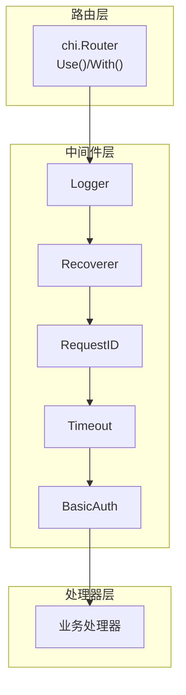
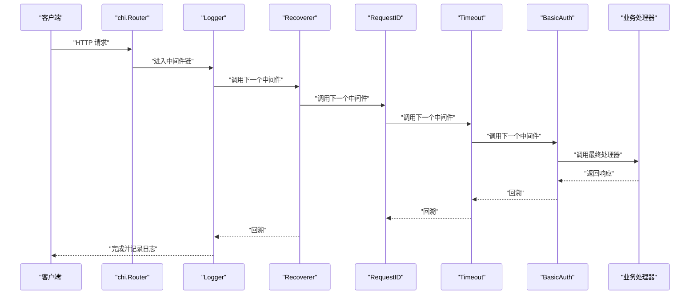
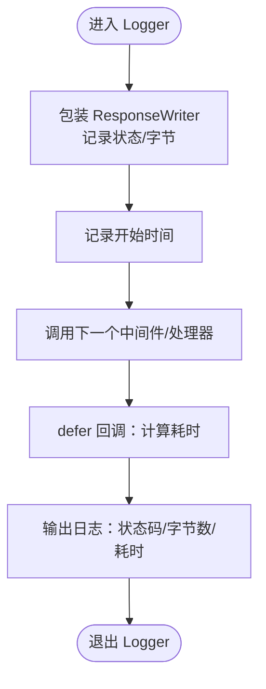
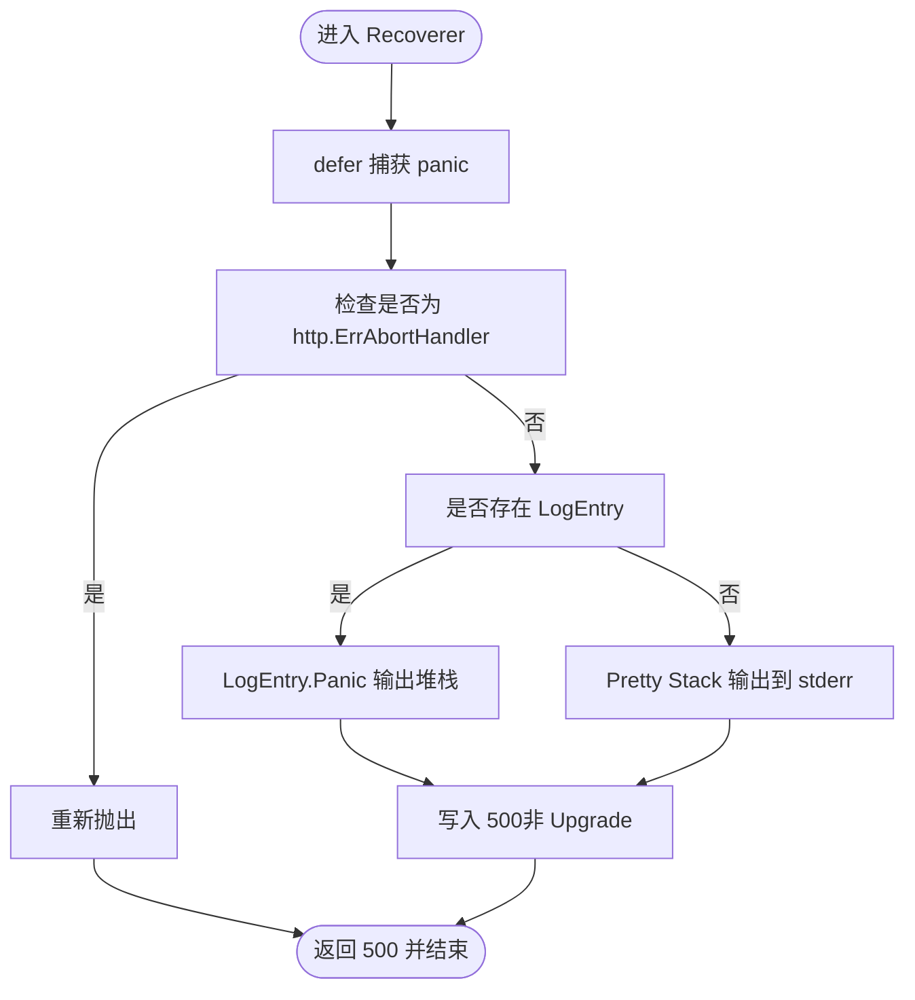
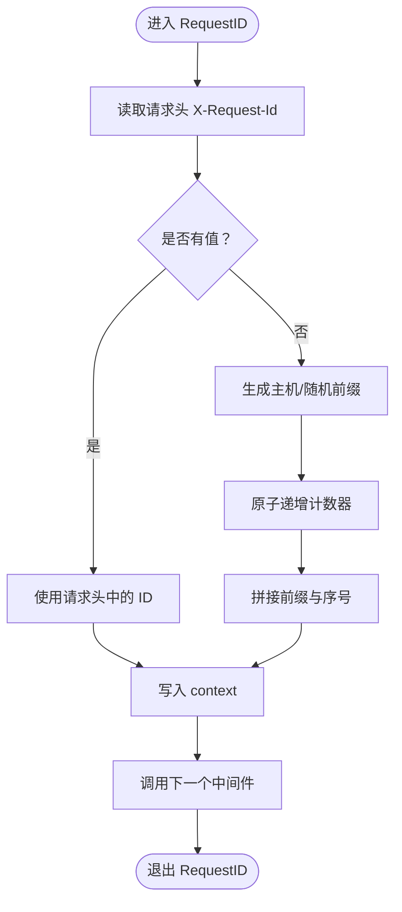
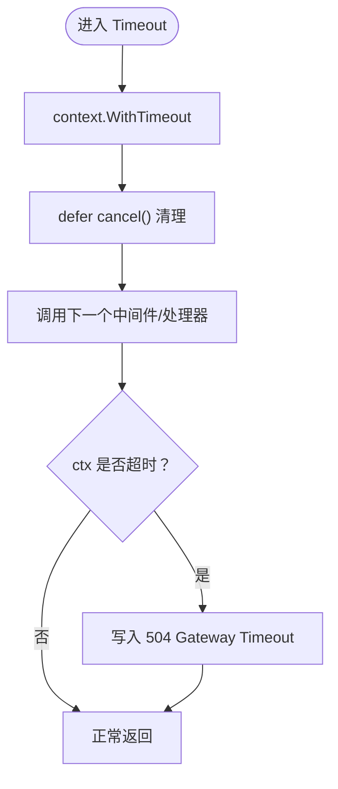
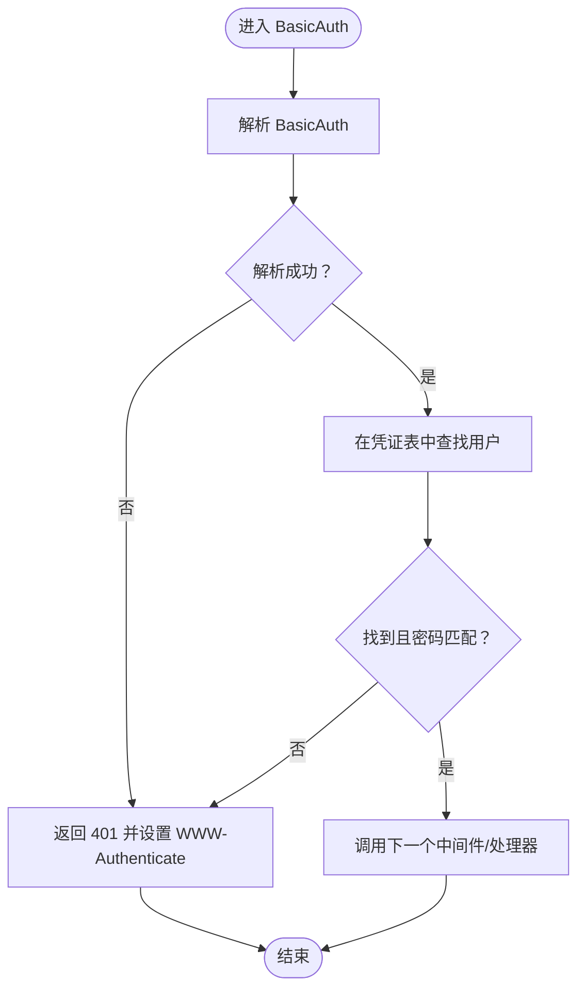
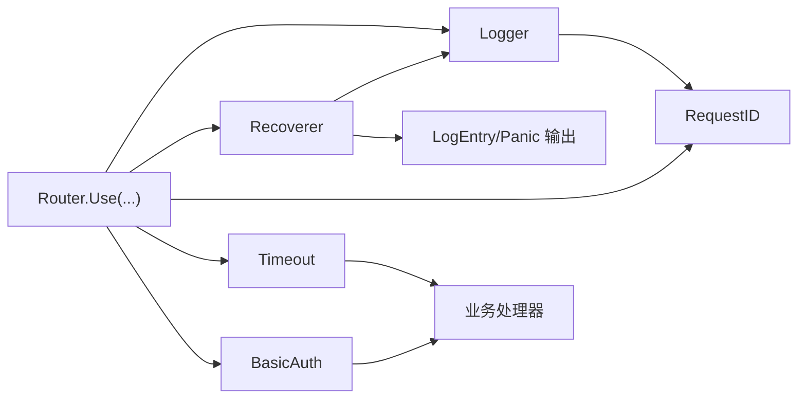

# 核心中间件

<cite>
**本文引用的文件列表**
- [middleware/logger.go](file://middleware/logger.go)
- [middleware/recoverer.go](file://middleware/recoverer.go)
- [middleware/request_id.go](file://middleware/request_id.go)
- [middleware/timeout.go](file://middleware/timeout.go)
- [middleware/basic_auth.go](file://middleware/basic_auth.go)
- [middleware/middleware.go](file://middleware/middleware.go)
- [chi.go](file://chi.go)
- [mux.go](file://mux.go)
- [_examples/hello-world/main.go](file://_examples/hello-world/main.go)
- [_examples/graceful/main.go](file://_examples/graceful/main.go)
- [middleware/logger_test.go](file://middleware/logger_test.go)
- [middleware/recoverer_test.go](file://middleware/recoverer_test.go)
- [middleware/request_id_test.go](file://middleware/request_id_test.go)
</cite>

## 目录
1. [简介](#简介)
2. [项目结构](#项目结构)
3. [核心组件](#核心组件)
4. [架构总览](#架构总览)
5. [详细组件分析](#详细组件分析)
6. [依赖关系分析](#依赖关系分析)
7. [性能考量](#性能考量)
8. [故障排查指南](#故障排查指南)
9. [结论](#结论)
10. [附录](#附录)

## 简介
本文件聚焦于 chi 框架的核心中间件，系统性解析以下中间件的实现机制与最佳实践：
- middleware.Logger：记录 HTTP 请求的进入与结束日志，包含状态码、响应字节数、耗时等信息，并可与请求 ID 集成。
- middleware.Recoverer：捕获 panic 并优雅恢复，避免服务崩溃，同时输出堆栈信息。
- middleware.RequestID：为每个请求生成唯一标识符，便于分布式追踪与日志关联。
- middleware.Timeout：为请求设置超时，基于 context 的 Deadline 触发中断。
- middleware.BasicAuth：实现 HTTP 基本认证，校验用户名与密码。

所有中间件均遵循统一的函数签名模式 func(http.Handler) http.Handler，通过 chi.Router 的 Use() 方法进行全局或局部组合。

## 项目结构
- 中间件位于 middleware 目录，每个中间件独立为一个文件，职责清晰。
- chi 路由器定义在 chi.go 与 mux.go 中，提供 Use() 用于注册中间件链。
- 示例位于 _examples 目录，展示中间件在真实项目中的用法。

图表来源
- [chi.go](file://chi.go#L64-L114)
- [mux.go](file://mux.go#L94-L105)
- [middleware/logger.go](file://middleware/logger.go#L39-L41)
- [middleware/recoverer.go](file://middleware/recoverer.go#L22-L49)
- [middleware/request_id.go](file://middleware/request_id.go#L62-L79)
- [middleware/timeout.go](file://middleware/timeout.go#L32-L48)
- [middleware/basic_auth.go](file://middleware/basic_auth.go#L9-L28)

章节来源
- [chi.go](file://chi.go#L64-L114)
- [mux.go](file://mux.go#L94-L105)

## 核心组件
- Logger：负责请求生命周期日志记录，支持自定义格式化器与颜色输出，内部通过 WrapResponseWriter 记录状态码与字节数。
- Recoverer：在 defer 中捕获 panic，记录堆栈并返回 500（除非是升级连接），确保服务稳定。
- RequestID：从请求头提取或生成全局唯一的请求 ID，注入到 context，供下游日志与追踪使用。
- Timeout：为请求上下文设置截止时间，超时后清理并返回 504。
- BasicAuth：对 Basic Auth 进行校验，失败时返回 401 并携带 WWW-Authenticate 头。

章节来源
- [middleware/logger.go](file://middleware/logger.go#L39-L41)
- [middleware/recoverer.go](file://middleware/recoverer.go#L22-L49)
- [middleware/request_id.go](file://middleware/request_id.go#L62-L79)
- [middleware/timeout.go](file://middleware/timeout.go#L32-L48)
- [middleware/basic_auth.go](file://middleware/basic_auth.go#L9-L28)

## 架构总览
中间件采用“洋葱模型”：外层中间件先执行，内层后执行；当请求到达末端处理器后，再按相反顺序回溯，形成“进入-处理-返回”的完整生命周期。

图表来源
- [chi.go](file://chi.go#L64-L114)
- [mux.go](file://mux.go#L94-L105)
- [middleware/logger.go](file://middleware/logger.go#L39-L41)
- [middleware/recoverer.go](file://middleware/recoverer.go#L22-L49)
- [middleware/request_id.go](file://middleware/request_id.go#L62-L79)
- [middleware/timeout.go](file://middleware/timeout.go#L32-L48)
- [middleware/basic_auth.go](file://middleware/basic_auth.go#L9-L28)

## 详细组件分析

### Logger 实现机制
- 设计要点
  - Logger 是一个包装器，内部委托给 DefaultLogger，默认实现通过 RequestLogger 创建带格式化器的日志处理器。
  - 使用 WrapResponseWriter 包装原始 ResponseWriter，以便在响应写入完成后统计状态码、字节数与头部。
  - 在 defer 中计算耗时并调用 LogEntry.Write 输出结果；若存在请求 ID，则在日志中显示。
  - 支持自定义 LogFormatter/LogEntry 接口，便于扩展结构化日志。
- 关键流程
  - 构造 LogEntry：根据请求信息拼接日志前缀，包含请求方法、URL、远程地址等。
  - 执行下游：将 LogEntry 注入到请求上下文中，传递给下一个处理器。
  - 结束回调：统计耗时、状态码、字节数，输出彩色日志。
- 注意事项
  - Logger 应置于 Recoverer 之前，否则无法记录到异常后的响应状态。

图表来源
- [middleware/logger.go](file://middleware/logger.go#L43-L59)
- [middleware/logger.go](file://middleware/logger.go#L134-L160)

章节来源
- [middleware/logger.go](file://middleware/logger.go#L39-L41)
- [middleware/logger.go](file://middleware/logger.go#L43-L59)
- [middleware/logger.go](file://middleware/logger.go#L134-L160)

### Recoverer 捕获与恢复
- 设计要点
  - 在 defer 中调用 recover()，捕获 panic 并输出堆栈信息；若非 http.ErrAbortHandler 则返回 500。
  - 若已存在 LogEntry，则通过 LogEntry.Panic 输出；否则使用 Pretty Stack 输出到标准错误。
  - 对 Upgrade 连接不写入状态码，直接让其终止。
- 错误处理策略
  - 对特定错误（如 http.ErrAbortHandler）不屏蔽，允许正常传播。
  - 保证即使发生异常也能返回响应，避免连接挂起。
- 测试验证
  - 单测覆盖了 500 返回码与堆栈首行包含目标函数名的断言。

图表来源
- [middleware/recoverer.go](file://middleware/recoverer.go#L22-L49)
- [middleware/recoverer.go](file://middleware/recoverer.go#L52-L64)
- [middleware/recoverer.go](file://middleware/recoverer.go#L66-L110)
- [middleware/recoverer.go](file://middleware/recoverer.go#L112-L204)

章节来源
- [middleware/recoverer.go](file://middleware/recoverer.go#L22-L49)
- [middleware/recoverer_test.go](file://middleware/recoverer_test.go#L13-L42)

### RequestID 唯一标识
- 设计要点
  - 优先从请求头 X-Request-Id 读取；若不存在则生成基于主机名与随机前缀的唯一 ID，并递增计数器。
  - 将请求 ID 写入 context，后续中间件与处理器可通过 GetReqID 获取。
  - 提供 NextRequestID 用于显式生成下一个 ID。
- 分布式追踪
  - 可通过 RequestIDHeader 自定义请求头名称，适配不同系统的追踪头规范。
- 测试验证
  - 单测覆盖了默认头与自定义头两种场景，确认能正确透传或生成 ID。

图表来源
- [middleware/request_id.go](file://middleware/request_id.go#L62-L79)
- [middleware/request_id.go](file://middleware/request_id.go#L81-L91)

章节来源
- [middleware/request_id.go](file://middleware/request_id.go#L23-L26)
- [middleware/request_id.go](file://middleware/request_id.go#L46-L61)
- [middleware/request_id.go](file://middleware/request_id.go#L62-L79)
- [middleware/request_id.go](file://middleware/request_id.go#L81-L91)
- [middleware/request_id_test.go](file://middleware/request_id_test.go#L20-L71)

### Timeout 超时控制
- 设计要点
  - 为请求上下文设置截止时间，超时后取消并返回 504。
  - 要求业务处理器在关键阻塞点 select ctx.Done()，否则超时信号会被忽略。
- 使用建议
  - 在长耗时操作（数据库查询、外部调用）处定期检查 ctx.Done()，及时退出。
  - 为不同路由设置合理的超时阈值，避免过短导致误杀或过长影响资源占用。

图表来源
- [middleware/timeout.go](file://middleware/timeout.go#L32-L48)

章节来源
- [middleware/timeout.go](file://middleware/timeout.go#L9-L15)
- [middleware/timeout.go](file://middleware/timeout.go#L32-L48)

### BasicAuth 基本认证
- 设计要点
  - 从 Authorization 头解析用户名与密码，与配置的凭证表进行常量时间比较，防止时序攻击。
  - 认证失败时返回 401，并设置 WWW-Authenticate 头提示 realm。
- 安全建议
  - 使用 HTTPS 传输，避免明文泄露。
  - 凭证表应来自安全配置源，避免硬编码。

图表来源
- [middleware/basic_auth.go](file://middleware/basic_auth.go#L9-L28)

章节来源
- [middleware/basic_auth.go](file://middleware/basic_auth.go#L9-L28)

## 依赖关系分析
- 中间件之间的依赖
  - Logger 依赖 RequestID（通过 GetReqID 获取请求 ID），并在日志中打印。
  - Recoverer 依赖 Logger（通过 GetLogEntry 输出堆栈），若无日志入口则直接输出到 stderr。
  - Timeout 与 BasicAuth 独立工作，但都可能被其他中间件（如 Logger/Recoverer）影响其行为。
- 路由器集成
  - chi.Router 的 Use() 方法接收多个 func(http.Handler) http.Handler，按注册顺序构建中间件链。
  - Mux.ServeHTTP 在处理请求前会将中间件链与路由处理器合并，形成最终的 http.Handler。

图表来源
- [middleware/logger.go](file://middleware/logger.go#L107-L125)
- [middleware/recoverer.go](file://middleware/recoverer.go#L32-L43)
- [chi.go](file://chi.go#L64-L114)
- [mux.go](file://mux.go#L94-L105)

章节来源
- [middleware/logger.go](file://middleware/logger.go#L107-L125)
- [middleware/recoverer.go](file://middleware/recoverer.go#L32-L43)
- [chi.go](file://chi.go#L64-L114)
- [mux.go](file://mux.go#L94-L105)

## 性能考量
- Logger
  - 彩色输出在非 TTY 环境会禁用，减少不必要的字符开销。
  - WrapResponseWriter 仅在需要时统计状态码与字节数，避免额外分配。
- Recoverer
  - 仅在 panic 发生时触发，正常路径开销极低。
  - 堆栈解析与输出在异常时进行，不影响正常请求吞吐。
- RequestID
  - 生成前缀与递增计数器均为轻量级操作；从请求头读取可避免重复生成。
- Timeout
  - 依赖 context 的 deadline 通知，零分配；业务需配合 ctx.Done() 检查。
- BasicAuth
  - 使用常量时间比较，避免时序攻击；解析与查找为 O(1) 或 O(n)（取决于凭证数量）。

[本节为通用性能讨论，无需列出具体文件来源]

## 故障排查指南
- 日志未显示请求 ID
  - 确认 RequestID 已在 Logger 之前注册，且请求头 X-Request-Id 正确传递。
  - 参考单测中对自定义头的覆盖场景。
- 500 异常未被捕获
  - 确保 Recoverer 在 Logger 之后注册，且业务处理器未自行恢复。
  - 检查是否为 http.ErrAbortHandler 导致的特殊处理。
- 超时未生效
  - 确认业务处理器在关键阻塞点 select ctx.Done()，否则超时信号会被忽略。
- BasicAuth 401
  - 检查 Authorization 头格式与 realm 设置；确认凭证表中存在对应用户且密码一致。

章节来源
- [middleware/request_id_test.go](file://middleware/request_id_test.go#L20-L71)
- [middleware/recoverer_test.go](file://middleware/recoverer_test.go#L13-L42)
- [middleware/timeout.go](file://middleware/timeout.go#L16-L31)

## 结论
上述中间件通过统一的中间件签名与 chi 的中间件链机制，实现了高内聚、低耦合的 HTTP 请求处理能力。合理选择与组合这些中间件，可在保障稳定性的同时提升可观测性与安全性。建议在生产环境中优先启用 RequestID、Logger、Recoverer，并根据业务特性引入 Timeout 与 BasicAuth。

[本节为总结性内容，无需列出具体文件来源]

## 附录

### 在 chi.Router 中的应用方式
- 全局应用
  - 在根路由上使用 Use() 注册中间件，影响所有子路由与处理器。
  - 示例参考：hello-world 与 graceful 示例展示了 RequestID、Logger、Recoverer 的典型组合。
- 局部应用
  - 使用 With() 为特定路由组创建新的中间件栈，不影响全局中间件。
  - 可在 Group/Route 中嵌套中间件链，实现更细粒度的控制。

章节来源
- [chi.go](file://chi.go#L70-L85)
- [_examples/hello-world/main.go](file://_examples/hello-world/main.go#L10-L21)
- [_examples/graceful/main.go](file://_examples/graceful/main.go#L45-L69)

### 中间件启用顺序与最佳实践
- 推荐顺序（从外到内）
  1) RequestID：尽早生成并注入请求 ID，便于后续日志与追踪。
  2) Logger：记录请求进入与结束，包含状态码、耗时等。
  3) Recoverer：捕获异常并返回 500，保证服务稳定。
  4) Timeout：为长请求设置超时，避免资源占用。
  5) BasicAuth：在最内层进行认证，保护敏感资源。
- 性能与错误处理
  - Logger 与 Recoverer 通常不会显著影响性能，但应避免在高频路径中进行昂贵的格式化。
  - Timeout 需要业务配合 ctx.Done() 检查，否则超时无效。
  - BasicAuth 的凭证查找应尽量高效，必要时使用缓存。

章节来源
- [middleware/logger.go](file://middleware/logger.go#L32-L39)
- [middleware/recoverer.go](file://middleware/recoverer.go#L17-L22)
- [middleware/request_id.go](file://middleware/request_id.go#L23-L26)
- [middleware/timeout.go](file://middleware/timeout.go#L9-L15)
- [middleware/basic_auth.go](file://middleware/basic_auth.go#L9-L11)