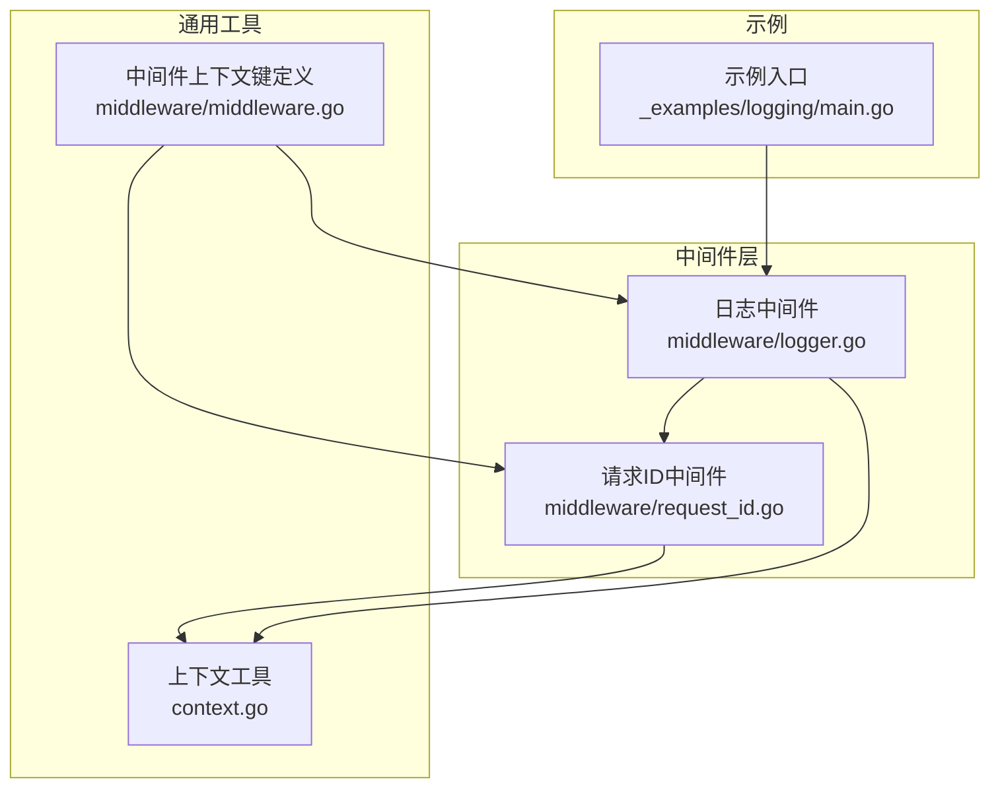
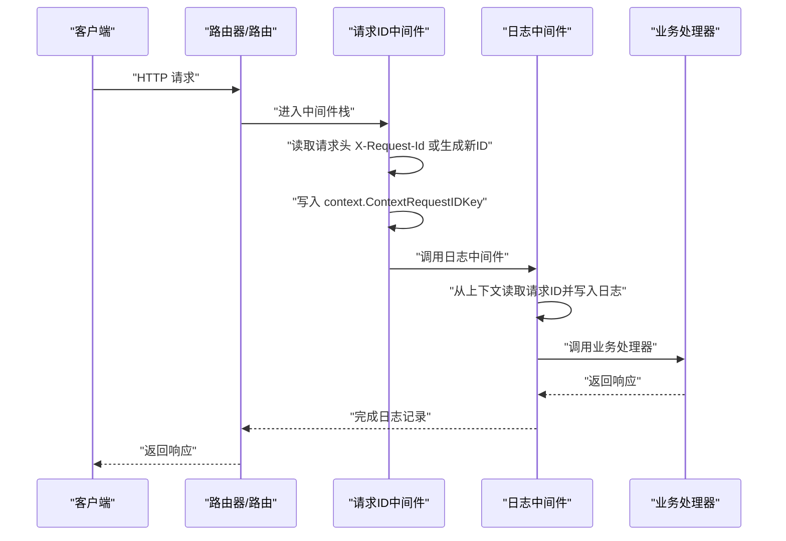
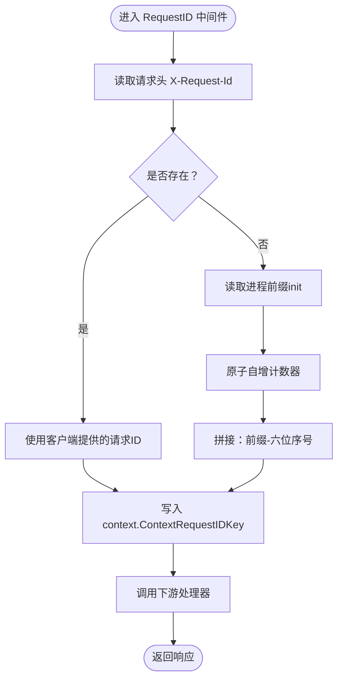
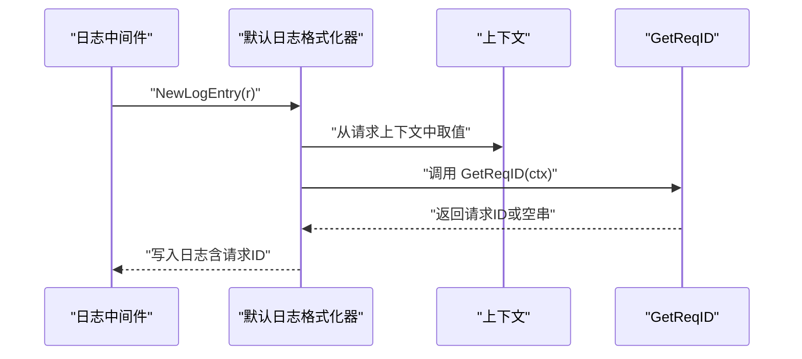
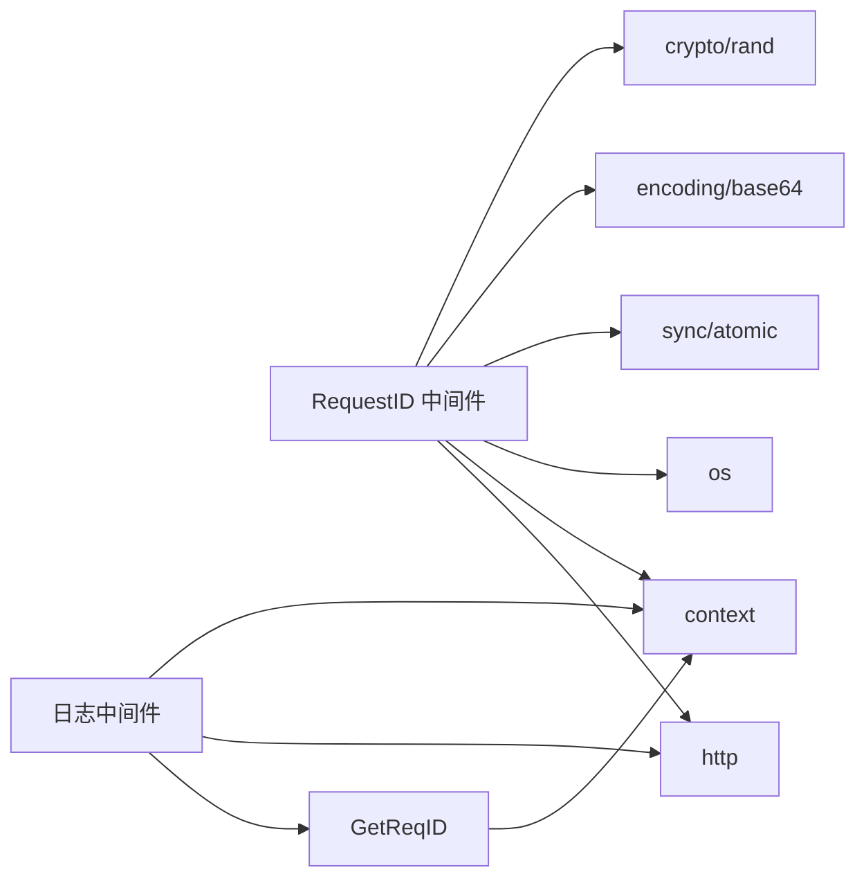

# 请求ID中间件

<cite>
**本文引用的文件**
- [middleware/request_id.go](file://middleware/request_id.go)
- [middleware/request_id_test.go](file://middleware/request_id_test.go)
- [middleware/logger.go](file://middleware/logger.go)
- [middleware/middleware.go](file://middleware/middleware.go)
- [context.go](file://context.go)
- [_examples/logging/main.go](file://_examples/logging/main.go)
</cite>

## 目录
1. [简介](#简介)
2. [项目结构](#项目结构)
3. [核心组件](#核心组件)
4. [架构总览](#架构总览)
5. [详细组件分析](#详细组件分析)
6. [依赖分析](#依赖分析)
7. [性能考量](#性能考量)
8. [故障排查指南](#故障排查指南)
9. [结论](#结论)
10. [附录](#附录)

## 简介
本文件围绕 chi 框架的请求ID中间件进行系统化说明，重点解释 middleware.RequestID 如何为每个 HTTP 请求生成唯一标识符，以支撑分布式追踪与日志关联。内容涵盖：
- 优先使用客户端提供的 X-Request-Id 头；若不存在，则基于主机名、随机前缀与原子计数器生成唯一 ID；
- RequestIDKey 在 context.Context 中的作用；
- GetReqID 与 NextRequestID 辅助函数的用法；
- init 函数生成进程唯一前缀的算法与碰撞概率估算；
- 实战最佳实践：与日志中间件集成、微服务传播策略、安全性与防预测性考虑；
- 结合源码展示 ID 生成逻辑与上下文传递机制，并通过代码示例路径演示如何在处理器中获取与使用请求 ID。

## 项目结构
请求ID中间件位于 middleware/request_id.go，配套测试位于 middleware/request_id_test.go；日志中间件位于 middleware/logger.go，用于在日志中打印请求 ID；通用上下文工具位于 context.go；中间件通用上下文键定义位于 middleware/middleware.go。



图表来源
- [middleware/request_id.go](file://middleware/request_id.go#L1-L96)
- [middleware/logger.go](file://middleware/logger.go#L1-L173)
- [context.go](file://context.go#L1-L166)
- [middleware/middleware.go](file://middleware/middleware.go#L1-L24)
- [_examples/logging/main.go](file://_examples/logging/main.go#L1-L10)

章节来源
- [middleware/request_id.go](file://middleware/request_id.go#L1-L96)
- [middleware/logger.go](file://middleware/logger.go#L1-L173)
- [context.go](file://context.go#L1-L166)
- [middleware/middleware.go](file://middleware/middleware.go#L1-L24)
- [_examples/logging/main.go](file://_examples/logging/main.go#L1-L10)

## 核心组件
- 请求ID中间件：注入并管理请求上下文中的唯一标识符，支持从请求头读取或自动生成。
- 上下文键：RequestIDKey 作为 context.Context 的键，承载请求 ID。
- 日志中间件：在日志输出中读取并展示请求 ID，便于跨服务链路追踪。
- 辅助函数：GetReqID 从上下文中提取请求 ID；NextRequestID 获取下一个自增序列号。

章节来源
- [middleware/request_id.go](file://middleware/request_id.go#L18-L21)
- [middleware/request_id.go](file://middleware/request_id.go#L71-L79)
- [middleware/request_id.go](file://middleware/request_id.go#L81-L91)
- [middleware/request_id.go](file://middleware/request_id.go#L93-L96)
- [middleware/logger.go](file://middleware/logger.go#L97-L125)

## 架构总览
请求ID中间件在处理链中处于上游位置，负责为后续中间件与业务处理器提供统一的请求 ID。日志中间件在下游读取该 ID 并写入日志，形成端到端的可追踪性。



图表来源
- [middleware/request_id.go](file://middleware/request_id.go#L62-L79)
- [middleware/logger.go](file://middleware/logger.go#L97-L125)

## 详细组件分析

### 请求ID中间件（RequestID）
- 功能要点
  - 优先使用客户端提供的请求头（默认 X-Request-Id），若不存在则自动生成；
  - 自动 ID 组成：主机名/随机前缀-六位递增序号；
  - 将请求 ID 写入 context.Context，键为 RequestIDKey；
  - 提供 GetReqID 从上下文提取请求 ID；
  - 提供 NextRequestID 获取下一个自增序号。

- 关键实现点
  - 进程唯一前缀生成：init 阶段从主机名与随机字节生成固定前缀，避免重复；
  - 原子计数器：使用原子整型确保并发安全的自增；
  - 上下文传递：通过 r.WithContext 将包含请求 ID 的新上下文传给下游。

- 代码片段路径
  - [请求ID中间件主体](file://middleware/request_id.go#L62-L79)
  - [GetReqID 辅助函数](file://middleware/request_id.go#L81-L91)
  - [NextRequestID 辅助函数](file://middleware/request_id.go#L93-L96)
  - [init 生成进程唯一前缀](file://middleware/request_id.go#L46-L60)



图表来源
- [middleware/request_id.go](file://middleware/request_id.go#L46-L79)

章节来源
- [middleware/request_id.go](file://middleware/request_id.go#L46-L79)
- [middleware/request_id.go](file://middleware/request_id.go#L81-L96)

### 上下文键与上下文传递
- RequestIDKey 为 context.Context 的键，类型为自定义整型，避免与其他键冲突；
- RequestID 中间件通过 context.WithValue 将请求 ID 注入上下文；
- 业务处理器通过 GetReqID 从上下文中提取请求 ID；
- chi 通用上下文工具提供 contextKey 的指针式实现，减少分配开销。

- 代码片段路径
  - [RequestIDKey 定义](file://middleware/request_id.go#L18-L21)
  - [RequestID 写入上下文](file://middleware/request_id.go#L71-L76)
  - [GetReqID 读取上下文](file://middleware/request_id.go#L81-L91)
  - [contextKey 指针式实现](file://middleware/middleware.go#L14-L23)

```mermaid
classDiagram
class RequestIDKey {
"+常量：ctxKeyRequestID=0"
}
class RequestID中间件 {
"+RequestID(next) http.Handler"
"+GetReqID(ctx) string"
"+NextRequestID() uint64"
}
class contextKey {
"+name string"
"+String() string"
}
RequestID中间件 --> RequestIDKey : "使用"
RequestID中间件 --> contextKey : "上下文键"
```

图表来源
- [middleware/request_id.go](file://middleware/request_id.go#L18-L21)
- [middleware/request_id.go](file://middleware/request_id.go#L62-L96)
- [middleware/middleware.go](file://middleware/middleware.go#L14-L23)

章节来源
- [middleware/request_id.go](file://middleware/request_id.go#L18-L21)
- [middleware/request_id.go](file://middleware/request_id.go#L62-L96)
- [middleware/middleware.go](file://middleware/middleware.go#L14-L23)

### 日志中间件与请求ID集成
- 日志中间件在初始化时创建 DefaultLogger；
- 在日志格式化阶段调用 GetReqID 读取请求 ID，并将其写入日志；
- 建议将日志中间件置于其他可能修改响应的中间件之前（如 Recoverer）。

- 代码片段路径
  - [日志中间件初始化](file://middleware/logger.go#L166-L173)
  - [日志格式化中读取请求ID](file://middleware/logger.go#L97-L125)



图表来源
- [middleware/logger.go](file://middleware/logger.go#L97-L125)
- [middleware/request_id.go](file://middleware/request_id.go#L81-L91)

章节来源
- [middleware/logger.go](file://middleware/logger.go#L97-L125)
- [middleware/logger.go](file://middleware/logger.go#L166-L173)

### 测试与使用示例
- 单元测试验证：
  - 从默认头 X-Request-Id 读取；
  - 支持自定义头名称；
  - 在处理器中通过 GetReqID 获取请求 ID。
- 示例入口文件指向更完善的日志库示例。

- 代码片段路径
  - [请求ID测试用例](file://middleware/request_id_test.go#L20-L71)
  - [示例入口说明](file://_examples/logging/main.go#L1-L10)

章节来源
- [middleware/request_id_test.go](file://middleware/request_id_test.go#L20-L71)
- [_examples/logging/main.go](file://_examples/logging/main.go#L1-L10)

## 依赖分析
- RequestID 中间件依赖：
  - crypto/rand 与 encoding/base64 生成进程唯一前缀；
  - sync/atomic 提供原子计数器；
  - os 读取主机名；
  - context 与 http 提供上下文与请求对象。
- 日志中间件依赖：
  - context 与 http；
  - DefaultLogFormatter 通过 GetReqID 读取请求 ID；
  - middleware/middleware.go 提供 contextKey 指针式键定义。



图表来源
- [middleware/request_id.go](file://middleware/request_id.go#L6-L15)
- [middleware/logger.go](file://middleware/logger.go#L1-L11)
- [middleware/request_id.go](file://middleware/request_id.go#L81-L91)

章节来源
- [middleware/request_id.go](file://middleware/request_id.go#L6-L15)
- [middleware/logger.go](file://middleware/logger.go#L1-L11)
- [middleware/request_id.go](file://middleware/request_id.go#L81-L91)

## 性能考量
- 原子计数器：NextRequestID 与 RequestID 中的自增操作均使用原子整型，保证高并发下的线程安全与低开销。
- 前缀生成：init 阶段一次性生成进程唯一前缀，避免每次请求重复计算。
- 字符串拼接：ID 由固定前缀与六位数字组成，字符串操作成本极低。
- 日志输出：日志中间件仅在格式化阶段读取一次请求 ID，对性能影响可忽略。

章节来源
- [middleware/request_id.go](file://middleware/request_id.go#L27-L29)
- [middleware/request_id.go](file://middleware/request_id.go#L71-L74)
- [middleware/request_id.go](file://middleware/request_id.go#L93-L96)

## 故障排查指南
- 请求头未生效
  - 确认 RequestIDHeader 是否被正确设置为期望的头部名称；
  - 检查客户端是否正确发送请求头。
  - 参考测试用例中的自定义头验证方式。
  - 代码片段路径：[请求ID测试用例](file://middleware/request_id_test.go#L20-L71)
- 上下文无法读取请求ID
  - 确保 RequestID 中间件已先于日志中间件执行；
  - 检查处理器是否使用 r.WithContext 传递了包含 RequestIDKey 的上下文；
  - 使用 GetReqID(ctx) 返回空串时，通常表示未注入或键不匹配。
  - 代码片段路径：[GetReqID 实现](file://middleware/request_id.go#L81-L91)
- 日志中未显示请求ID
  - 确认日志中间件已启用且在 Recoverer 等中间件之前；
  - 检查 DefaultLogFormatter 是否正确调用 GetReqID。
  - 代码片段路径：[日志格式化读取请求ID](file://middleware/logger.go#L97-L125)
- 并发问题
  - RequestID 与 NextRequestID 均使用原子计数器，正常情况下不会出现竞态；
  - 若发现异常，请检查自定义中间件是否覆盖了上下文键。
  - 代码片段路径：[原子计数器使用](file://middleware/request_id.go#L27-L29)

章节来源
- [middleware/request_id_test.go](file://middleware/request_id_test.go#L20-L71)
- [middleware/request_id.go](file://middleware/request_id.go#L81-L91)
- [middleware/logger.go](file://middleware/logger.go#L97-L125)

## 结论
请求ID中间件通过“客户端优先 + 进程前缀 + 原子计数”的组合策略，为每个请求生成稳定、可追踪的唯一标识符。配合日志中间件，可在全链路中实现一致的日志关联与分布式追踪。其设计兼顾性能与安全性，适合在微服务架构中广泛采用。

## 附录

### 最佳实践
- 与日志中间件集成
  - 将 RequestID 放在日志中间件之前，确保日志中能正确显示请求 ID；
  - 使用 DefaultLogger 或自定义 LogFormatter，确保在 NewLogEntry 中调用 GetReqID。
  - 代码片段路径：[日志中间件初始化](file://middleware/logger.go#L166-L173)，[日志格式化读取请求ID](file://middleware/logger.go#L97-L125)
- 微服务传播策略
  - 在网关或入口服务设置 RequestIDHeader（默认 X-Request-Id），并将请求 ID 透传至下游服务；
  - 下游服务若未收到请求 ID，自动为其生成新的唯一 ID，保证链路完整性。
  - 代码片段路径：[请求ID中间件主体](file://middleware/request_id.go#L62-L79)
- 安全性与防预测
  - 进程前缀由主机名与随机字节组成，降低碰撞概率；
  - 原子计数器保证并发安全，但不提供加密强度；
  - 对于需要更强安全性的场景，建议在入口处生成强随机 ID 并透传，避免暴露内部计数器状态。
  - 代码片段路径：[init 生成进程唯一前缀](file://middleware/request_id.go#L46-L60)
- 在处理器中获取与使用请求ID
  - 使用 GetReqID(r.Context()) 获取请求 ID；
  - 在日志、错误记录、审计等场景统一使用该 ID 进行关联。
  - 代码片段路径：[GetReqID 实现](file://middleware/request_id.go#L81-L91)