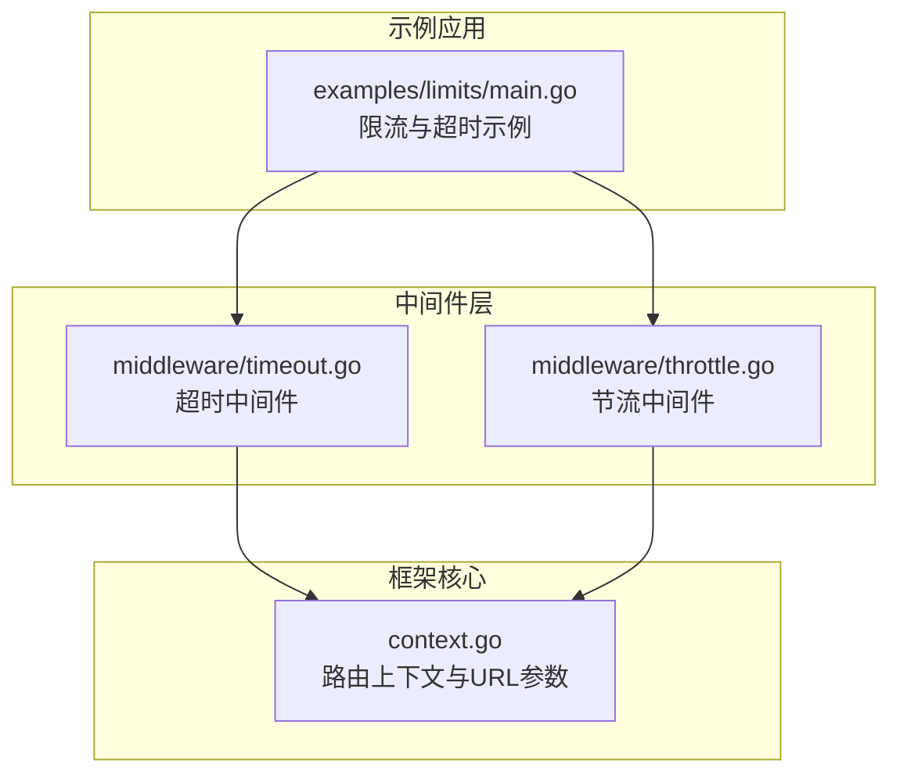
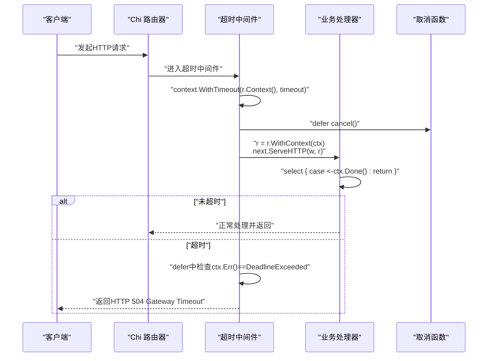
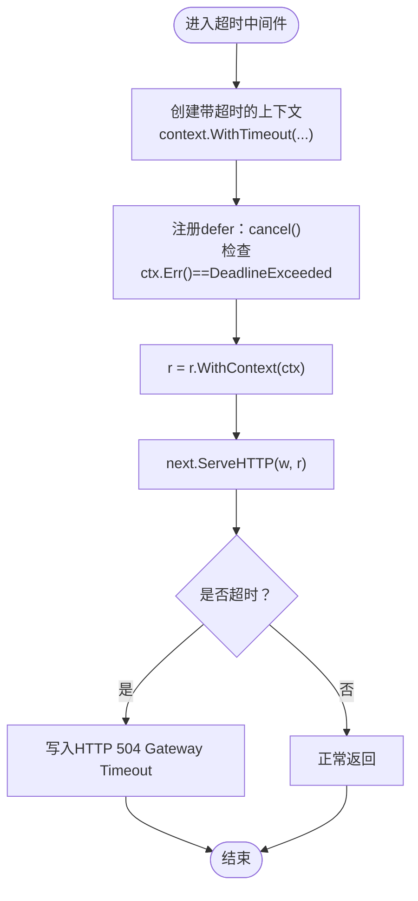
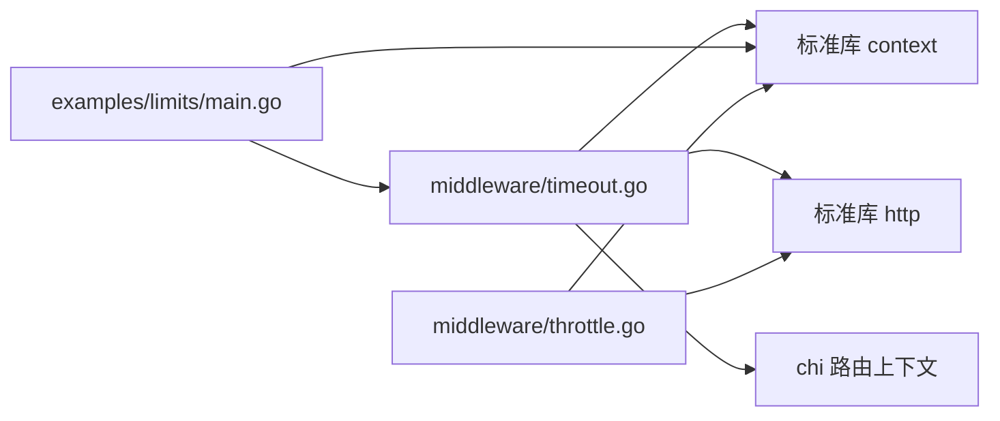

# 请求超时中间件

<cite>
**本文引用的文件**
- [middleware/timeout.go](file://middleware/timeout.go)
- [_examples/limits/main.go](file://_examples/limits/main.go)
- [middleware/throttle.go](file://middleware/throttle.go)
- [context.go](file://context.go)
</cite>

## 目录
1. [简介](#简介)
2. [项目结构](#项目结构)
3. [核心组件](#核心组件)
4. [架构总览](#架构总览)
5. [详细组件分析](#详细组件分析)
6. [依赖关系分析](#依赖关系分析)
7. [性能考量](#性能考量)
8. [故障排查指南](#故障排查指南)
9. [结论](#结论)
10. [附录](#附录)

## 简介
本篇文档围绕 chi 框架的请求超时中间件 middleware.Timeout 展开，系统阐述其如何基于 Go 标准库 context 包为请求上下文注入超时能力：通过 context.WithTimeout 设置截止时间并在超时后自动取消；通过检查 ctx.Err() 是否等于 context.DeadlineExceeded 来识别超时场景，并向客户端返回 HTTP 504 Gateway Timeout；同时强调处理器必须主动监听 ctx.Done() 通道以实现真正的超时中断。文档还讨论了该中间件在防御慢速攻击与资源耗尽方面的安全价值，给出最佳实践建议（如合理设置阈值、兼容长轮询/流式响应、加入性能监控），并通过源码路径与示例演示在处理器中正确处理上下文取消信号。

## 项目结构
本次分析聚焦于以下文件：
- middleware/timeout.go：超时中间件的核心实现
- _examples/limits/main.go：示例程序，展示如何在路由组中使用 Timeout 中间件，并在处理器中监听 ctx.Done()
- middleware/throttle.go：节流中间件示例，体现 ctx.Done() 的通用监听模式
- context.go：展示 chi 自身对 context 的扩展与使用方式（URL 参数、路由上下文等）

图表来源
- [middleware/timeout.go](file://middleware/timeout.go#L1-L48)
- [_examples/limits/main.go](file://_examples/limits/main.go#L1-L92)
- [middleware/throttle.go](file://middleware/throttle.go#L76-L151)
- [context.go](file://context.go#L1-L167)

章节来源
- [middleware/timeout.go](file://middleware/timeout.go#L1-L48)
- [_examples/limits/main.go](file://_examples/limits/main.go#L1-L92)
- [middleware/throttle.go](file://middleware/throttle.go#L76-L151)
- [context.go](file://context.go#L1-L167)

## 核心组件
- 超时中间件 middleware.Timeout
  - 功能：为每个进入的请求创建带超时的上下文，将该上下文注入到请求对象中传递给后续处理器；当超时发生时，检查 ctx.Err() 并返回 HTTP 504。
  - 关键点：
    - 使用 context.WithTimeout(r.Context(), timeout) 创建带截止时间的子上下文
    - 在 defer 中调用 cancel() 并检查 ctx.Err() == context.DeadlineExceeded
    - 将新上下文写回请求对象 r = r.WithContext(ctx)，确保下游处理器可访问
    - 处理器需主动监听 ctx.Done() 才能真正中断处理流程

章节来源
- [middleware/timeout.go](file://middleware/timeout.go#L1-L48)

## 架构总览
下图展示了从客户端到处理器的请求链路，以及超时中间件如何介入并影响最终响应。

图表来源
- [middleware/timeout.go](file://middleware/timeout.go#L32-L47)
- [_examples/limits/main.go](file://_examples/limits/main.go#L40-L61)

## 详细组件分析

### 组件A：超时中间件 Timeout 的实现与行为
- 设计要点
  - 中间件工厂函数 Timeout(timeout) 返回一个函数，该函数接收下一个 http.Handler 并返回一个新的 http.Handler
  - 在内部函数中：
    - 通过 context.WithTimeout(r.Context(), timeout) 生成带截止时间的新上下文
    - 使用 defer 在函数退出时调用 cancel()，确保资源释放
    - 在 defer 中检查 ctx.Err() 是否等于 context.DeadlineExceeded，若是则向客户端写入 HTTP 504
    - 将新上下文写回到请求对象 r = r.WithContext(ctx)，使下游处理器可感知超时
    - 调用 next.ServeHTTP(w, r) 将请求交给下一个处理器

- 关键流程图（对应源码逻辑）

图表来源
- [middleware/timeout.go](file://middleware/timeout.go#L32-L47)

- 处理器必须监听 ctx.Done() 的原因
  - 超时中间件仅负责设置截止时间和在必要时返回 504，它不会强制终止处理器的执行
  - 若处理器不监听 ctx.Done()，即使超时已触发，处理器仍可能继续运行并产生副作用或占用资源
  - 因此，处理器应采用 select 语句监听 ctx.Done()，一旦收到信号立即返回

- 示例参考
  - 限流示例中展示了如何在处理器中监听 ctx.Done() 并根据 ctx.Err() 判断超时类型
  - 参考路径：[_examples/limits/main.go](file://_examples/limits/main.go#L40-L61)、[_examples/limits/main.go](file://_examples/limits/main.go#L71-L89)

章节来源
- [middleware/timeout.go](file://middleware/timeout.go#L1-L48)
- [_examples/limits/main.go](file://_examples/limits/main.go#L40-L61)
- [_examples/limits/main.go](file://_examples/limits/main.go#L71-L89)

### 组件B：处理器如何正确处理上下文取消信号
- 典型模式
  - 在处理器入口处获取 ctx = r.Context()
  - 使用 select 语句同时监听：
    - <-ctx.Done()：当上下文被取消（含超时）时触发
    - 其他通道（如 <-time.After(d) 或数据库/外部服务调用的完成通道）
  - 当收到 ctx.Done() 时，立即返回，避免继续阻塞资源

- 示例参考
  - 限流示例中演示了两种写法：
    - 仅监听 ctx.Done() 并直接返回
      - 参考路径：[_examples/limits/main.go](file://_examples/limits/main.go#L40-L61)
    - 根据 ctx.Err() 判断具体原因（超时/取消），分别返回不同响应
      - 参考路径：[_examples/limits/main.go](file://_examples/limits/main.go#L71-L89)

- 与节流中间件的对比
  - 节流中间件同样要求处理器监听 ctx.Done()，并在收到信号时及时返回
  - 参考路径：[middleware/throttle.go](file://middleware/throttle.go#L76-L151)

章节来源
- [_examples/limits/main.go](file://_examples/limits/main.go#L40-L61)
- [_examples/limits/main.go](file://_examples/limits/main.go#L71-L89)
- [middleware/throttle.go](file://middleware/throttle.go#L76-L151)

### 组件C：与 Go 标准库 context 的集成机制
- context.WithTimeout
  - 为请求上下文创建带截止时间的子上下文，超时后自动触发取消
  - 参考路径：[middleware/timeout.go](file://middleware/timeout.go#L35-L35)

- ctx.Err() 与 context.DeadlineExceeded
  - 超时发生时，ctx.Err() 返回 DeadlineExceeded，用于区分“超时”与其他取消原因
  - 参考路径：[middleware/timeout.go](file://middleware/timeout.go#L38-L38)

- ctx.Done() 通道
  - 任何监听 ctx.Done() 的 goroutine 都会在超时或取消时收到信号
  - 参考路径：[middleware/timeout.go](file://middleware/timeout.go#L38-L38)、[_examples/limits/main.go](file://_examples/limits/main.go#L40-L61)

- chi 对 context 的扩展
  - 提供 URLParam、RouteContext 等工具，便于在处理器中读取路由信息
  - 参考路径：[context.go](file://context.go#L1-L167)

章节来源
- [middleware/timeout.go](file://middleware/timeout.go#L32-L47)
- [_examples/limits/main.go](file://_examples/limits/main.go#L40-L61)
- [context.go](file://context.go#L1-L167)

### 组件D：安全价值与最佳实践
- 安全价值
  - 防止慢速攻击：当上游代理或客户端故意发送慢请求时，超时中间件可快速中断，避免线程/连接被长期占用
  - 防止资源耗尽：通过超时限制单次请求的最长处理时间，避免数据库连接池、goroutine 数量等资源被拖垮

- 最佳实践
  - 合理设置超时阈值
    - 基于业务特性与依赖服务 SLA 设定超时，避免过短导致误杀正常请求，过长失去防护意义
    - 参考路径：[_examples/limits/main.go](file://_examples/limits/main.go#L40-L61) 中对慢操作的超时设置
  - 与长轮询/流式响应的兼容性
    - 对于需要长时间保持连接的场景（如 SSE、长轮询），应在路由组或特定处理器上谨慎使用全局超时，或采用更细粒度的超时策略
    - 参考路径：[middleware/throttle.go](file://middleware/throttle.go#L76-L151) 中对 ctx.Done() 的统一处理思路
  - 性能监控
    - 记录超时事件数量、超时比例与平均处理时间，辅助定位慢查询与瓶颈
    - 结合日志与指标系统，对超时进行告警与趋势分析

章节来源
- [_examples/limits/main.go](file://_examples/limits/main.go#L40-L61)
- [middleware/throttle.go](file://middleware/throttle.go#L76-L151)

## 依赖关系分析
- 超时中间件依赖
  - 标准库 context：用于创建带截止时间的上下文、检查取消原因
  - 标准库 http：作为中间件接口与 HTTP 响应写入
  - chi 路由上下文：通过 r.WithContext(ctx) 将超时上下文传递给下游处理器

- 示例与中间件的关系
  - 限流示例在路由组中启用 Timeout 中间件，并在处理器中监听 ctx.Done()
  - 节流中间件展示了 ctx.Done() 的通用监听模式，可与 Timeout 协同使用

图表来源
- [middleware/timeout.go](file://middleware/timeout.go#L1-L48)
- [_examples/limits/main.go](file://_examples/limits/main.go#L1-L92)
- [middleware/throttle.go](file://middleware/throttle.go#L76-L151)

章节来源
- [middleware/timeout.go](file://middleware/timeout.go#L1-L48)
- [_examples/limits/main.go](file://_examples/limits/main.go#L1-L92)
- [middleware/throttle.go](file://middleware/throttle.go#L76-L151)

## 性能考量
- 超时阈值设定
  - 过短：可能误伤正常耗时较长的请求（如复杂查询、外部依赖）
  - 过长：失去防护效果，资源占用时间拉长
- 上游代理与网络延迟
  - 需考虑反向代理、负载均衡器、CDN 等环节的超时配置，避免“外层超时先于内层超时”导致的不一致行为
- 监控与告警
  - 对超时率、P95/P99 延迟进行持续观测，结合业务峰值时段调整阈值
- 与并发控制配合
  - 与节流/限流中间件组合使用，既能控制并发，又能限制单请求最长处理时间

## 故障排查指南
- 症状：设置了超时但请求仍长时间占用
  - 排查要点：确认处理器是否监听 ctx.Done() 并在收到信号时返回
  - 参考路径：[_examples/limits/main.go](file://_examples/limits/main.go#L40-L61)
- 症状：超时后仍继续写入响应
  - 排查要点：确保在 ctx.Done() 分支中尽早返回，避免后续写入
  - 参考路径：[_examples/limits/main.go](file://_examples/limits/main.go#L71-L89)
- 症状：超时判定不准确
  - 排查要点：确认使用 ctx.Err() 判断 DeadlineExceeded，而非简单依赖时间戳
  - 参考路径：[middleware/timeout.go](file://middleware/timeout.go#L38-L38)

章节来源
- [_examples/limits/main.go](file://_examples/limits/main.go#L40-L61)
- [_examples/limits/main.go](file://_examples/limits/main.go#L71-L89)
- [middleware/timeout.go](file://middleware/timeout.go#L38-L38)

## 结论
middleware.Timeout 通过与 Go 标准库 context 的深度集成，为 chi 应用提供了简洁而强大的请求超时能力。其核心在于：
- 使用 context.WithTimeout 为请求上下文注入截止时间
- 在 defer 中检查 ctx.Err() 并返回 HTTP 504
- 强制要求处理器监听 ctx.Done() 实现真正的超时中断

结合合理的阈值设定、与长轮询/流式响应的兼容策略以及完善的性能监控，超时中间件能在保障用户体验的同时有效提升系统的稳定性与安全性。

## 附录
- 快速参考
  - 超时中间件定义与使用：[middleware/timeout.go](file://middleware/timeout.go#L32-L47)
  - 处理器监听 ctx.Done() 的示例：[_examples/limits/main.go](file://_examples/limits/main.go#L40-L61)、[_examples/limits/main.go](file://_examples/limits/main.go#L71-L89)
  - 节流中间件对 ctx.Done() 的通用监听模式：[middleware/throttle.go](file://middleware/throttle.go#L76-L151)
  - chi 对 context 的扩展（URL 参数、路由上下文）：[context.go](file://context.go#L1-L167)