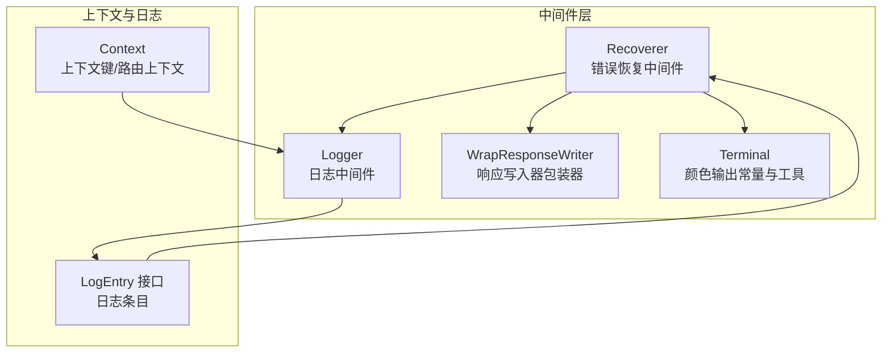
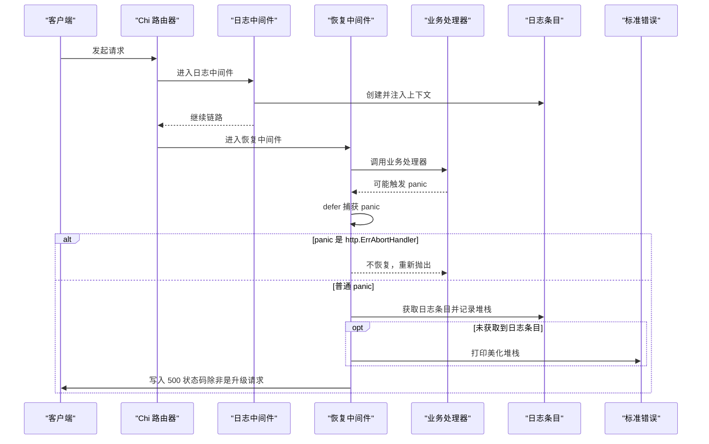
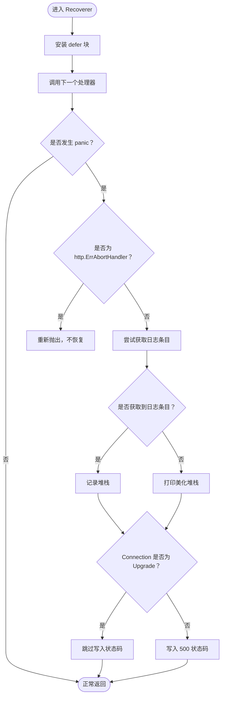
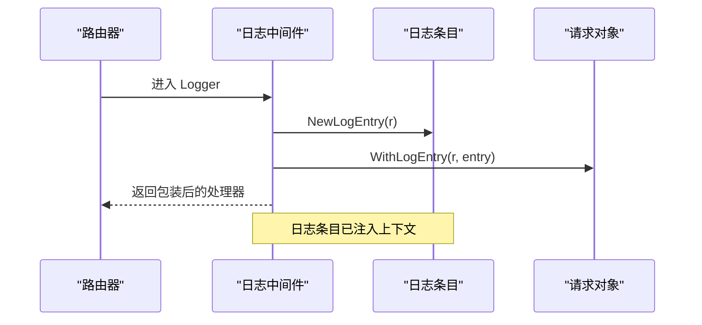
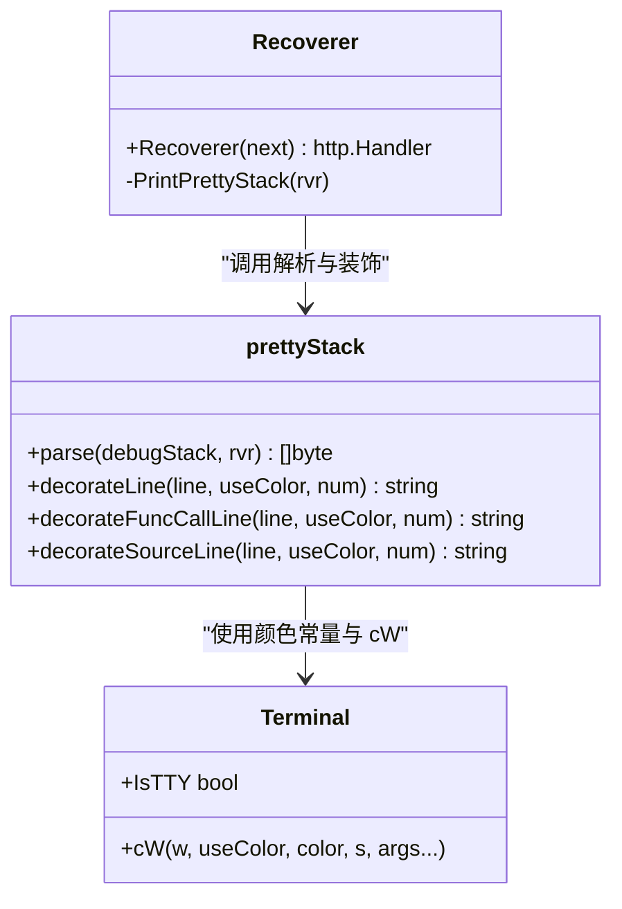
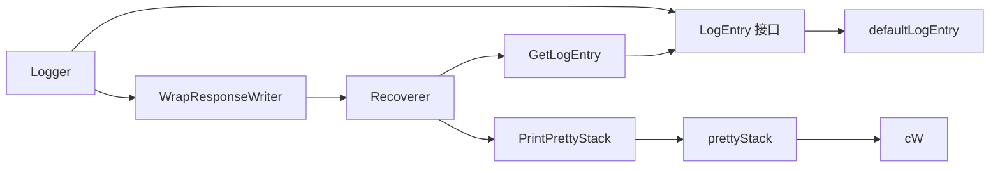

# 错误恢复中间件

<cite>
**本文引用的文件**
- [middleware/recoverer.go](file://middleware/recoverer.go)
- [middleware/recoverer_test.go](file://middleware/recoverer_test.go)
- [middleware/logger.go](file://middleware/logger.go)
- [middleware/terminal.go](file://middleware/terminal.go)
- [middleware/wrap_writer.go](file://middleware/wrap_writer.go)
- [context.go](file://context.go)
</cite>

## 目录
1. [简介](#简介)
2. [项目结构](#项目结构)
3. [核心组件](#核心组件)
4. [架构总览](#架构总览)
5. [详细组件分析](#详细组件分析)
6. [依赖关系分析](#依赖关系分析)
7. [性能考量](#性能考量)
8. [故障排查指南](#故障排查指南)
9. [结论](#结论)
10. [附录](#附录)

## 简介
本篇文档围绕 chi 框架的错误恢复中间件 middleware.Recoverer 展开，系统性说明其如何通过 defer + recover 机制捕获 panic 并优雅恢复，防止服务崩溃；如何区分 http.ErrAbortHandler 特殊错误并选择不恢复；如何通过 GetLogEntry 从上下文中获取日志条目并记录详细堆栈；如何使用 PrintPrettyStack 美化和格式化堆栈输出（含函数调用行与源码行的彩色输出）；在 WebSocket 升级等场景下如何避免发送状态码；以及在实际项目中与日志中间件协同工作的最佳实践与生产环境建议。

## 项目结构
本次分析聚焦于以下文件：
- middleware/recoverer.go：错误恢复中间件主体实现
- middleware/recoverer_test.go：恢复中间件行为测试
- middleware/logger.go：日志中间件与日志条目接口
- middleware/terminal.go：颜色输出常量与写入工具
- middleware/wrap_writer.go：响应写入器包装器（用于理解状态码写入时机）
- context.go：上下文键与路由上下文（用于理解日志条目上下文）

图表来源
- [middleware/recoverer.go](file://middleware/recoverer.go#L1-L204)
- [middleware/logger.go](file://middleware/logger.go#L1-L173)
- [middleware/terminal.go](file://middleware/terminal.go#L1-L64)
- [middleware/wrap_writer.go](file://middleware/wrap_writer.go#L1-L242)
- [context.go](file://context.go#L1-L167)

章节来源
- [middleware/recoverer.go](file://middleware/recoverer.go#L1-L204)
- [middleware/logger.go](file://middleware/logger.go#L1-L173)
- [middleware/terminal.go](file://middleware/terminal.go#L1-L64)
- [middleware/wrap_writer.go](file://middleware/wrap_writer.go#L1-L242)
- [context.go](file://context.go#L1-L167)

## 核心组件
- Recoverer 中间件：在每个请求处理前安装 defer 块，捕获 panic 后根据条件决定是否恢复、记录堆栈、返回 500 状态码（WebSocket 升级场景除外）。
- 日志条目接口与实现：Logger 中间件在请求开始时创建日志条目并注入到上下文中，Recoverer 在捕获 panic 时优先使用该日志条目记录堆栈。
- 颜色输出工具：通过终端颜色常量与 cW 工具函数美化堆栈输出。
- 响应写入器包装器：用于理解状态码写入时机与协议差异（如 HTTP/1.x vs HTTP/2）。

章节来源
- [middleware/recoverer.go](file://middleware/recoverer.go#L1-L204)
- [middleware/logger.go](file://middleware/logger.go#L1-L173)
- [middleware/terminal.go](file://middleware/terminal.go#L1-L64)
- [middleware/wrap_writer.go](file://middleware/wrap_writer.go#L1-L242)

## 架构总览
Recoverer 作为中间件链中的关键节点，位于上游日志中间件之后，确保在捕获 panic 时能利用日志条目记录详细堆栈。其核心流程如下：

图表来源
- [middleware/recoverer.go](file://middleware/recoverer.go#L18-L46)
- [middleware/logger.go](file://middleware/logger.go#L43-L85)
- [middleware/recoverer_test.go](file://middleware/recoverer_test.go#L44-L68)

## 详细组件分析

### Recoverer 中间件实现与调用堆栈
- defer + recover：在进入业务处理器前安装 defer 块，捕获 panic；若为 http.ErrAbortHandler 则不恢复，直接重新抛出，以允许客户端连接被正确中止。
- 日志集成：优先通过 GetLogEntry 从请求上下文中获取日志条目，调用其 Panic 方法记录堆栈；否则回退到 PrintPrettyStack 输出到标准错误。
- 状态码控制：当请求头 Connection 不等于 Upgrade 时才写入 500 状态码，避免在 WebSocket 升级场景下发送错误状态码。
- 错误输出目标：recovererErrorWriter 可在测试中替换为缓冲区，便于断言堆栈输出。

图表来源
- [middleware/recoverer.go](file://middleware/recoverer.go#L18-L46)

章节来源
- [middleware/recoverer.go](file://middleware/recoverer.go#L18-L46)
- [middleware/recoverer_test.go](file://middleware/recoverer_test.go#L13-L42)

### 日志中间件与上下文协作
- Logger 中间件在请求开始时创建日志条目并通过 WithLogEntry 注入到上下文中，供后续中间件（如 Recoverer）使用。
- GetLogEntry 从上下文中取出日志条目；defaultLogEntry 实现了 Panic 方法，内部调用 PrintPrettyStack 将堆栈输出到标准错误。
- Logger 应置于 Recoverer 之前，以确保在捕获 panic 时能拿到日志条目并记录完整堆栈。

图表来源
- [middleware/logger.go](file://middleware/logger.go#L43-L85)
- [context.go](file://context.go#L74-L84)

章节来源
- [middleware/logger.go](file://middleware/logger.go#L43-L85)
- [context.go](file://context.go#L74-L84)

### 堆栈美化与颜色输出
- PrintPrettyStack 使用 debug.Stack 获取原始堆栈，交由 prettyStack.parse 处理，最终写入 recovererErrorWriter（默认指向标准错误）。
- prettyStack.parse 将堆栈按“函数调用行”和“源码行”两类进行装饰，使用终端颜色常量输出，突出首行与次行的关键信息。
- cW 工具函数根据 IsTTY 自动判断是否启用颜色输出。

图表来源
- [middleware/recoverer.go](file://middleware/recoverer.go#L52-L204)
- [middleware/terminal.go](file://middleware/terminal.go#L1-L64)

章节来源
- [middleware/recoverer.go](file://middleware/recoverer.go#L52-L204)
- [middleware/terminal.go](file://middleware/terminal.go#L1-L64)

### WebSocket 升级场景下的状态码策略
- Recoverer 在检测到请求头 Connection 为 Upgrade 时，不会写入 500 状态码，从而避免破坏升级握手。
- 这一设计与 HTTP 协议升级语义一致：升级成功后状态码应为 101，失败则不应发送 500。

章节来源
- [middleware/recoverer.go](file://middleware/recoverer.go#L39-L41)

### 测试验证要点
- 恢复中间件会将堆栈输出到 recovererErrorWriter（测试中可替换为缓冲区），并通过断言堆栈首行包含特定处理器名来验证堆栈解析与输出。
- 对 http.ErrAbortHandler 的测试验证了不恢复的行为，确保客户端连接被正确中止。

章节来源
- [middleware/recoverer_test.go](file://middleware/recoverer_test.go#L13-L42)
- [middleware/recoverer_test.go](file://middleware/recoverer_test.go#L44-L68)

## 依赖关系分析
- Recoverer 依赖：
  - 日志条目接口与实现：通过 GetLogEntry 与 defaultLogEntry.Panic 协作。
  - 终端颜色与输出：通过 terminal.go 的颜色常量与 cW 工具。
  - 上下文键：通过 context.go 的 LogEntryCtxKey 存取日志条目。
  - 响应写入器包装器：用于理解状态码写入时机与协议差异。
- Logger 依赖：
  - WrapResponseWriter：用于统计状态码、字节数等。
  - 日志条目接口：统一记录请求完成后的日志。

图表来源
- [middleware/recoverer.go](file://middleware/recoverer.go#L18-L46)
- [middleware/logger.go](file://middleware/logger.go#L43-L85)
- [middleware/wrap_writer.go](file://middleware/wrap_writer.go#L1-L242)
- [middleware/terminal.go](file://middleware/terminal.go#L1-L64)
- [context.go](file://context.go#L74-L84)

章节来源
- [middleware/recoverer.go](file://middleware/recoverer.go#L18-L46)
- [middleware/logger.go](file://middleware/logger.go#L43-L85)
- [middleware/wrap_writer.go](file://middleware/wrap_writer.go#L1-L242)
- [middleware/terminal.go](file://middleware/terminal.go#L1-L64)
- [context.go](file://context.go#L74-L84)

## 性能考量
- defer 开销：每个请求均安装一次 defer，通常开销极小，但应避免在高频路径上重复创建复杂闭包。
- 堆栈解析成本：prettyStack.parse 会对堆栈逐行解析与装饰，建议仅在 panic 发生时触发，避免在正常路径产生额外负担。
- I/O 成本：PrintPrettyStack 默认写入标准错误，生产环境建议重定向至日志系统，避免频繁写磁盘或网络 I/O。
- 颜色输出：cW 会在非 TTY 环境自动关闭颜色，减少不必要的转义序列输出。

[本节为通用指导，无需具体文件分析]

## 故障排查指南
- 现象：panic 未被捕获或状态码异常
  - 检查中间件顺序：Logger 必须在 Recoverer 之前，确保日志条目已注入上下文。
  - 检查 Connection 头：WebSocket 升级场景下不会写入 500，属预期行为。
- 现象：堆栈输出不符合预期
  - 确认 recovererErrorWriter 是否被替换（测试中常见），生产环境应保持默认。
  - 检查终端是否为 TTY，非 TTY 环境将禁用颜色输出。
- 现象：http.ErrAbortHandler 未按预期中止
  - 该错误类型会被重新抛出，不恢复，确保客户端连接被中止，这是正确行为。

章节来源
- [middleware/recoverer.go](file://middleware/recoverer.go#L18-L46)
- [middleware/recoverer_test.go](file://middleware/recoverer_test.go#L44-L68)
- [middleware/logger.go](file://middleware/logger.go#L32-L41)

## 结论
Recoverer 中间件通过 defer + recover 机制在 chi 路由链中提供关键的稳定性保障：对普通 panic 进行捕获与记录，对 http.ErrAbortHandler 采取不恢复策略，对 WebSocket 升级场景避免发送状态码，同时通过 GetLogEntry 与日志中间件协同，实现可读性强且结构化的堆栈输出。配合颜色输出与 WrapResponseWriter 的状态码写入逻辑，可在生产环境中安全、可控地处理异常并维持服务可用性。

[本节为总结性内容，无需具体文件分析]

## 附录

### 最佳实践清单
- 中间件顺序
  - 先 Logger，再 Recoverer，确保捕获 panic 时能记录完整堆栈。
- 错误输出目标
  - 生产环境将 recovererErrorWriter 重定向至日志系统（如结构化日志库），避免直接写标准错误。
- WebSocket 场景
  - 升级请求不写入 500 状态码，属预期行为；如需自定义错误，请在升级失败时自行处理。
- 日志条目
  - 保证日志中间件在路由链中尽早执行，以便 Recoverer 能获取到日志条目。
- 颜色输出
  - 在非 TTY 环境自动关闭颜色，避免转义字符污染日志；如需强制彩色输出，可通过环境变量或配置调整。

[本节为通用指导，无需具体文件分析]