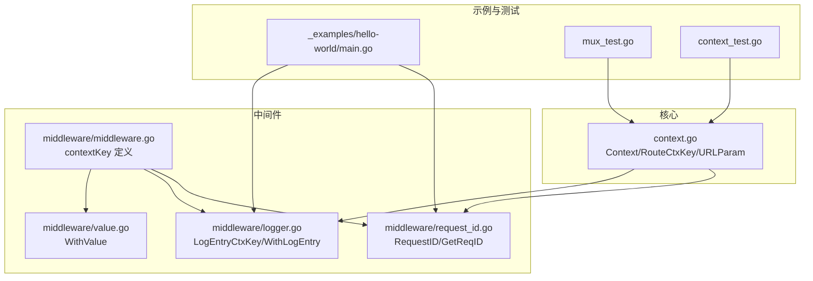
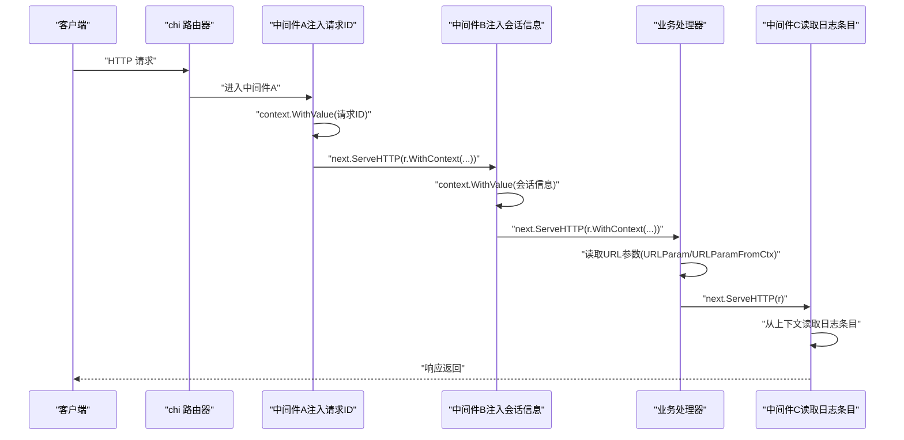
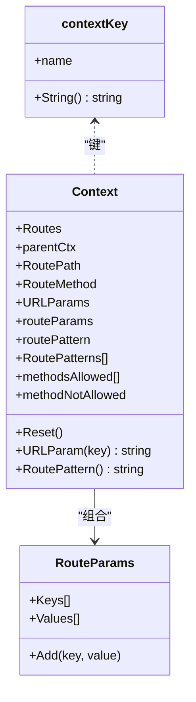
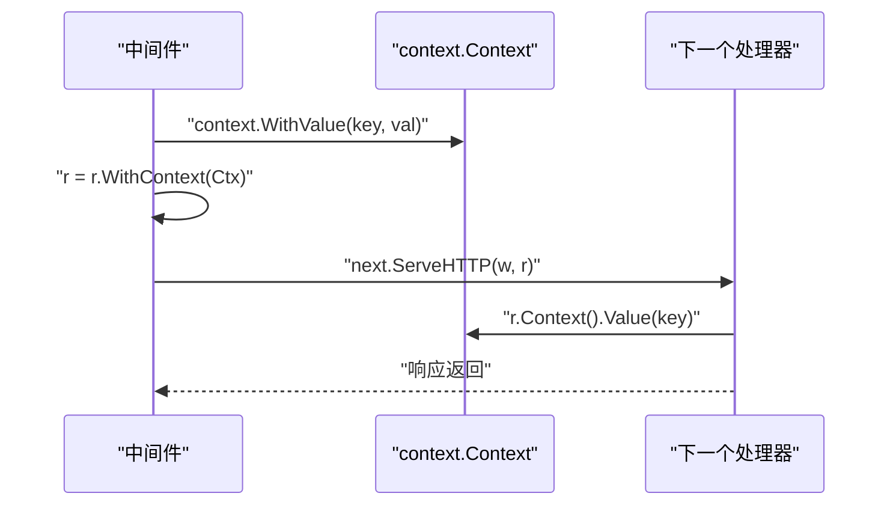
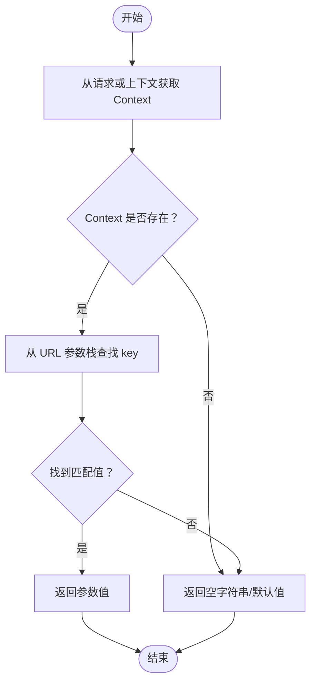
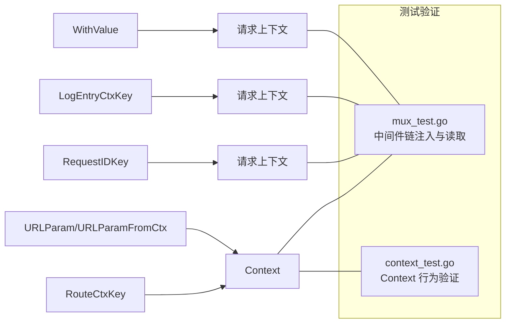

# 上下文管理

<cite>
**本文引用的文件**
- [context.go](file://context.go)
- [middleware/middleware.go](file://middleware/middleware.go)
- [middleware/request_id.go](file://middleware/request_id.go)
- [middleware/logger.go](file://middleware/logger.go)
- [middleware/value.go](file://middleware/value.go)
- [chi.go](file://chi.go)
- [mux_test.go](file://mux_test.go)
- [context_test.go](file://context_test.go)
- [_examples/hello-world/main.go](file://_examples/hello-world/main.go)
</cite>

## 目录
1. [引言](#引言)
2. [项目结构](#项目结构)
3. [核心组件](#核心组件)
4. [架构总览](#架构总览)
5. [详细组件分析](#详细组件分析)
6. [依赖关系分析](#依赖关系分析)
7. [性能考量](#性能考量)
8. [故障排查指南](#故障排查指南)
9. [结论](#结论)
10. [附录](#附录)

## 引言
本指南围绕 chi 中间件链中的上下文（context）数据管理展开，系统讲解如何在中间件之间安全传递请求特定数据，覆盖从 URL 参数到自定义用户信息等常见场景。文档以 context.go 中的 Context 结构体与 RouteCtxKey 为核心，结合路由参数解析、中间件链式调用、日志与请求 ID 等实际示例，帮助读者掌握：
- 如何在中间件中提取并注入上下文数据
- RouteCtxKey 的使用方法与最佳实践
- 上下文键的命名约定、类型安全处理与内存泄漏规避
- 中间件间数据共享的作用机制与性能影响

## 项目结构
本仓库与上下文管理相关的关键文件分布如下：
- 核心上下文与路由上下文：context.go
- 中间件通用上下文键定义：middleware/middleware.go
- 请求 ID 注入中间件：middleware/request_id.go
- 日志中间件（含日志条目上下文键）：middleware/logger.go
- 通用值注入中间件：middleware/value.go
- 路由器接口与上下文交互：chi.go
- 测试用例（包含上下文链式传递与 URL 参数读取）：mux_test.go、context_test.go
- 示例程序：_examples/hello-world/main.go

图表来源
- [context.go](file://context.go#L1-L167)
- [middleware/middleware.go](file://middleware/middleware.go#L1-L24)
- [middleware/request_id.go](file://middleware/request_id.go#L1-L97)
- [middleware/logger.go](file://middleware/logger.go#L1-L173)
- [middleware/value.go](file://middleware/value.go#L1-L17)
- [_examples/hello-world/main.go](file://_examples/hello-world/main.go#L1-L22)
- [mux_test.go](file://mux_test.go#L969-L1002)
- [context_test.go](file://context_test.go#L1-L105)

章节来源
- [context.go](file://context.go#L1-L167)
- [middleware/middleware.go](file://middleware/middleware.go#L1-L24)
- [middleware/request_id.go](file://middleware/request_id.go#L1-L97)
- [middleware/logger.go](file://middleware/logger.go#L1-L173)
- [middleware/value.go](file://middleware/value.go#L1-L17)
- [chi.go](file://chi.go#L1-L138)
- [_examples/hello-world/main.go](file://_examples/hello-world/main.go#L1-L22)
- [mux_test.go](file://mux_test.go#L969-L1002)
- [context_test.go](file://context_test.go#L1-L105)

## 核心组件
- Context 与 RouteCtxKey
  - Context 是 chi 在每次请求根上下文中存储的路由上下文对象，用于记录匹配的路由路径、方法、URL 参数栈、模式栈等。通过 RouteCtxKey 将 Context 存储在标准库 context.Context 中，供后续中间件与处理器安全读取。
  - URLParam/URLParamFromCtx 提供从请求或上下文中读取 URL 参数的能力；RouteContext 则从上下文中取出 Context 对象。
- 上下文键的定义与命名
  - chi 内部使用 contextKey 指针作为键，避免分配开销；同时提供 String() 便于调试输出。
  - middleware 包也定义了 contextKey，用于其内部键（如 RequestIDKey、LogEntryCtxKey），体现“按包隔离”的命名约定。
- 中间件对上下文的注入与读取
  - RequestID 中间件将请求 ID 注入上下文，供后续中间件（如 Logger）读取。
  - Logger 中间件将日志条目对象写入上下文，供结束阶段统一落盘。
  - WithValue 中间件提供通用的键值注入能力，便于在任意中间件中注入自定义数据。

章节来源
- [context.go](file://context.go#L1-L167)
- [middleware/middleware.go](file://middleware/middleware.go#L1-L24)
- [middleware/request_id.go](file://middleware/request_id.go#L1-L97)
- [middleware/logger.go](file://middleware/logger.go#L1-L173)
- [middleware/value.go](file://middleware/value.go#L1-L17)

## 架构总览
下图展示了请求在中间件链中的上下文流转过程，重点标注了 Context 的注入点、URL 参数的读取时机以及日志条目的写入与读取。

图表来源
- [middleware/request_id.go](file://middleware/request_id.go#L62-L97)
- [middleware/logger.go](file://middleware/logger.go#L43-L85)
- [context.go](file://context.go#L9-L23)
- [mux_test.go](file://mux_test.go#L969-L1002)

## 详细组件分析

### 组件一：Context 与 RouteCtxKey
- Context 的职责
  - 记录当前请求的路由路径、方法、匹配的模式栈、URL 参数栈等，支持在子路由器栈中累积。
  - 提供 Reset 方法重置状态，减少重复分配。
  - 提供 URLParam 从 URL 参数栈中查找最近一次匹配的值。
- RouteCtxKey 的作用
  - 作为 context.Context 的键，存储 *Context 对象，使后续中间件与处理器可安全读取。
  - 建议仅在 chi 内部使用该键，避免与业务键冲突。
- URL 参数读取
  - URLParam/URLParamFromCtx 提供从请求或上下文读取 URL 参数的便捷函数；建议在调用 next 后再读取 RoutePattern，以获得最终匹配结果。

图表来源
- [context.go](file://context.go#L42-L167)

章节来源
- [context.go](file://context.go#L1-L167)
- [context_test.go](file://context_test.go#L1-L105)

### 组件二：中间件链中的上下文注入与读取
- 请求 ID 注入（RequestID）
  - 在中间件中读取请求头或生成唯一 ID，使用 context.WithValue 注入到上下文，随后将新上下文回写到请求对象。
  - 后续中间件（如 Logger）可通过 GetReqID 从上下文中读取请求 ID。
- 日志条目写入（Logger）
  - Logger 中间件在进入处理器前创建日志条目对象，使用 WithLogEntry 将其写入上下文；在 defer 中读取并输出。
  - 通过 LogEntryCtxKey 隔离日志上下文键，避免与其他中间件冲突。
- 通用值注入（WithValue）
  - 提供一个通用中间件，将任意键值对注入上下文，便于在中间件链中传递自定义数据。

图表来源
- [middleware/request_id.go](file://middleware/request_id.go#L62-L97)
- [middleware/logger.go](file://middleware/logger.go#L43-L85)
- [middleware/value.go](file://middleware/value.go#L1-L17)

章节来源
- [middleware/request_id.go](file://middleware/request_id.go#L1-L97)
- [middleware/logger.go](file://middleware/logger.go#L1-L173)
- [middleware/value.go](file://middleware/value.go#L1-L17)

### 组件三：URL 参数与上下文键的协同使用
- URL 参数读取
  - 使用 URLParam/URLParamFromCtx 从 Context 中读取最近匹配的 URL 参数值；建议在 next 调用之后读取，确保参数栈已完整。
- 上下文键的命名约定
  - chi 内部使用 contextKey 指针作为键，避免分配；建议业务键采用“包名/用途”或“结构体类型”形式，避免冲突。
  - middleware 包内键（如 RequestIDKey、LogEntryCtxKey）采用整型常量或指针类型，体现“按包隔离”的设计。
- 类型安全与错误处理
  - 从上下文读取时应进行类型断言检查，避免运行时 panic。
  - 对于可能缺失的键，提供默认值策略，保证健壮性。

图表来源
- [context.go](file://context.go#L9-L23)
- [context.go](file://context.go#L98-L107)

章节来源
- [context.go](file://context.go#L1-L167)
- [mux_test.go](file://mux_test.go#L969-L1002)

### 组件四：示例与最佳实践
- 示例程序
  - _examples/hello-world/main.go 展示了 RequestID 与 Logger 的典型组合，体现“先注入后记录”的顺序。
- 最佳实践
  - 键的命名：使用指针或结构体类型作为键，避免字符串键冲突；按包隔离键空间。
  - 类型安全：读取上下文值时进行类型断言与存在性检查。
  - 生命周期：仅在必要时注入上下文，避免无谓的键值堆积；在中间件末尾清理或复用上下文。
  - 性能：context.WithValue 每次都会创建新的上下文对象，应避免在高频路径中频繁注入大量键值。

章节来源
- [_examples/hello-world/main.go](file://_examples/hello-world/main.go#L1-L22)
- [middleware/request_id.go](file://middleware/request_id.go#L62-L97)
- [middleware/logger.go](file://middleware/logger.go#L43-L85)

## 依赖关系分析
- Context 与路由上下文键
  - Context 通过 RouteCtxKey 存储在请求上下文中；URLParam/URLParamFromCtx/RouteContext 提供读取入口。
- 中间件与上下文键
  - RequestID 使用 RequestIDKey；Logger 使用 LogEntryCtxKey；WithValue 提供通用注入。
- 测试用例验证
  - mux_test.go 展示了在中间件链中注入键值并在处理器中读取的行为；context_test.go 验证了 Context 的行为与模式拼接逻辑。

图表来源
- [context.go](file://context.go#L1-L167)
- [middleware/request_id.go](file://middleware/request_id.go#L1-L97)
- [middleware/logger.go](file://middleware/logger.go#L1-L173)
- [middleware/value.go](file://middleware/value.go#L1-L17)
- [mux_test.go](file://mux_test.go#L969-L1002)
- [context_test.go](file://context_test.go#L1-L105)

章节来源
- [context.go](file://context.go#L1-L167)
- [middleware/request_id.go](file://middleware/request_id.go#L1-L97)
- [middleware/logger.go](file://middleware/logger.go#L1-L173)
- [middleware/value.go](file://middleware/value.go#L1-L17)
- [mux_test.go](file://mux_test.go#L969-L1002)
- [context_test.go](file://context_test.go#L1-L105)

## 性能考量
- context.WithValue 的成本
  - 每次调用都会复制并返回一个新的上下文对象，频繁注入大量键值会增加内存分配与 GC 压力。建议：
    - 控制注入键的数量与频率；
    - 复用已有的上下文对象，避免不必要的 r.WithContext 调用；
    - 对高频路径进行上下文键的合并或延迟注入。
- Context 的重置
  - Context.Reset 可将内部状态清零，减少重复分配；在中间件链中合理使用有助于降低内存占用。
- URL 参数栈
  - URL 参数栈在子路由器栈中累积，注意避免在深层嵌套路由中产生过多参数键，导致查找成本上升。

章节来源
- [context.go](file://context.go#L81-L96)
- [context.go](file://context.go#L146-L167)

## 故障排查指南
- 无法读取 URL 参数
  - 确认在调用 next 后再读取 URL 参数；若在 next 前读取，可能尚未完成参数栈构建。
  - 检查是否正确获取 Context（RouteContext），确认 RouteCtxKey 是否被其他中间件覆盖。
- 类型断言失败
  - 从上下文读取值时务必进行类型断言检查，避免 panic；为缺失键提供默认值。
- 键冲突
  - 使用指针或结构体类型作为键，避免字符串键冲突；按包隔离键空间。
- 内存泄漏风险
  - 避免在中间件中长期持有大对象引用；在中间件末尾清理或复用上下文；谨慎使用 WithValue 注入大型数据。
- 日志与请求 ID 不一致
  - 确保 RequestID 在 Logger 之前注入，且 Logger 正确读取 LogEntryCtxKey。

章节来源
- [context.go](file://context.go#L9-L23)
- [middleware/request_id.go](file://middleware/request_id.go#L62-L97)
- [middleware/logger.go](file://middleware/logger.go#L43-L85)
- [mux_test.go](file://mux_test.go#L969-L1002)

## 结论
通过 chi 的 Context 与 RouteCtxKey，中间件链可以安全、高效地传递请求特定数据。结合 RequestID、Logger、WithValue 等中间件，可以在不侵入业务代码的情况下实现可观测性与可扩展性。遵循键命名约定、类型安全与性能优化原则，可有效避免上下文滥用带来的问题，提升整体系统的稳定性与可维护性。

## 附录
- 常见上下文键与用途
  - RouteCtxKey：存储 chi 的路由上下文对象
  - RequestIDKey：存储请求 ID
  - LogEntryCtxKey：存储日志条目对象
  - 通用键：通过 WithValue 注入的任意键值对
- 推荐流程
  - 在路由匹配完成后、调用 next 前注入上下文数据；
  - 在处理器中读取 URL 参数与上下文数据；
  - 在中间件末尾统一输出日志或清理上下文。