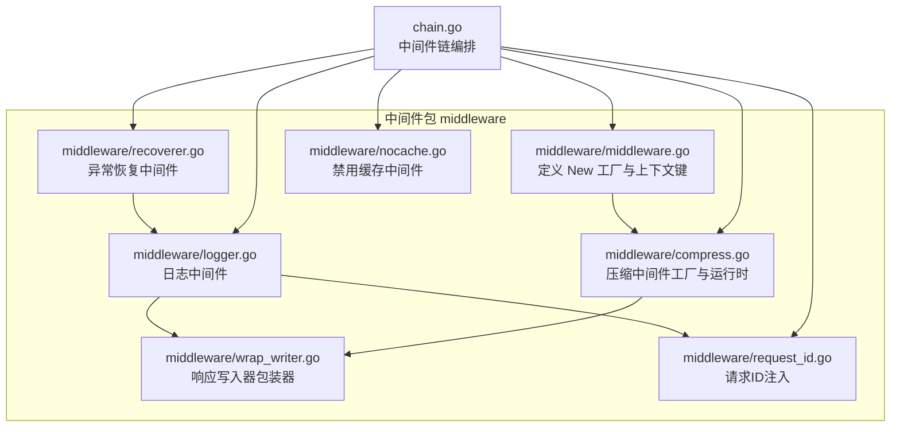
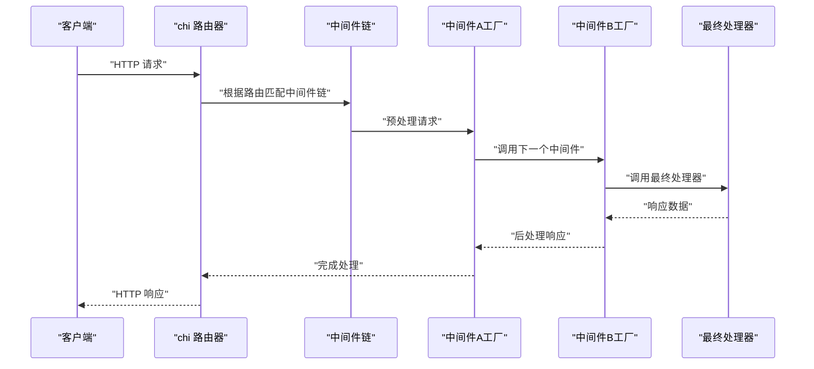
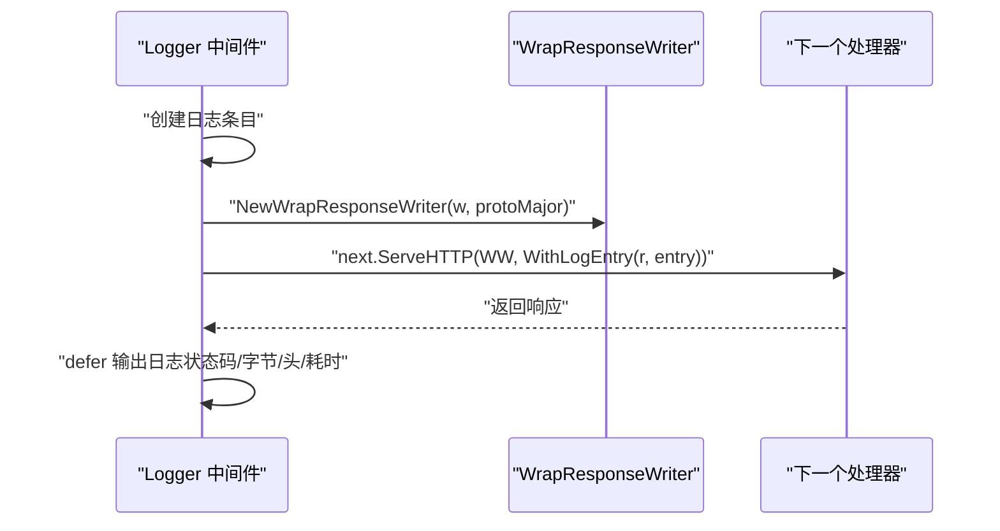
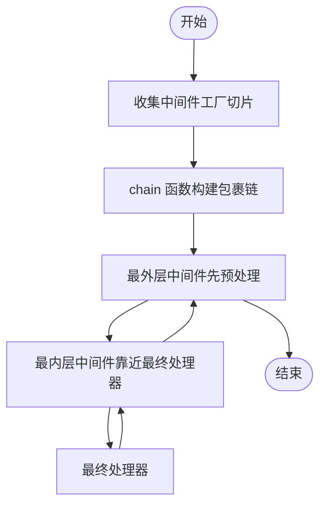
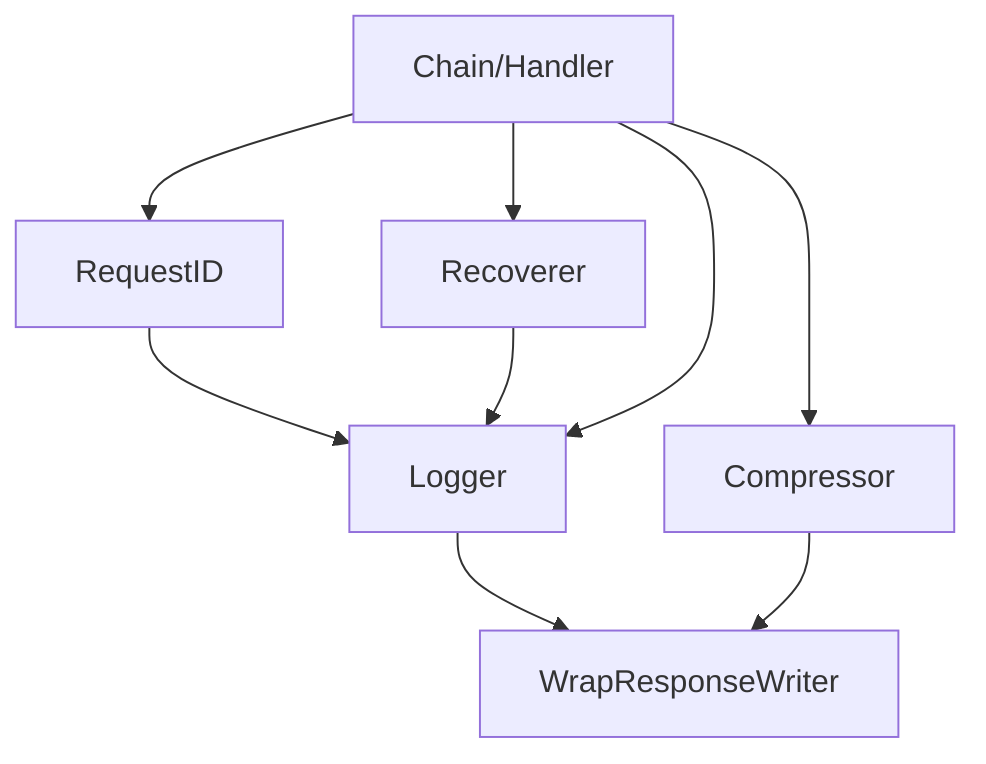

# 中间件创建模式

<cite>
**本文引用的文件**
- [middleware/middleware.go](file://middleware/middleware.go)
- [middleware/compress.go](file://middleware/compress.go)
- [middleware/logger.go](file://middleware/logger.go)
- [middleware/wrap_writer.go](file://middleware/wrap_writer.go)
- [middleware/recoverer.go](file://middleware/recoverer.go)
- [middleware/request_id.go](file://middleware/request_id.go)
- [middleware/nocache.go](file://middleware/nocache.go)
- [chain.go](file://chain.go)
- [README.md](file://README.md)
- [_examples/hello-world/main.go](file://_examples/hello-world/main.go)
</cite>

## 目录
1. [简介](#简介)
2. [项目结构](#项目结构)
3. [核心组件](#核心组件)
4. [架构总览](#架构总览)
5. [详细组件分析](#详细组件分析)
6. [依赖关系分析](#依赖关系分析)
7. [性能考量](#性能考量)
8. [故障排查指南](#故障排查指南)
9. [结论](#结论)
10. [附录](#附录)

## 简介
本指南围绕 chi 框架的中间件创建模式展开，重点解释以 func(http.Handler) http.Handler 为签名的中间件工厂设计思想与实践方法。文档将通过 middleware.New 的实现讲解“包装下一个处理器”的通用生命周期：预处理请求、调用下一个处理器、后处理响应；并通过 compress.go 中的 Compress/NewCompressor 示例，展示如何在中间件中持有状态与配置，形成可复用的工厂模式。最后，从简单日志中间件到复杂压缩中间件，给出渐进式示例，帮助读者掌握不同类型的中间件创建模式。

## 项目结构
- 中间件包 middleware 提供标准中间件集合，采用统一的工厂签名，便于组合与复用。
- chain.go 定义了中间件链的编排机制，将多个中间件按顺序包裹最终处理器。
- README.md 展示了中间件的使用方式与推荐栈，便于理解整体架构。



图表来源
- [middleware/middleware.go](file://middleware/middleware.go#L1-L24)
- [middleware/compress.go](file://middleware/compress.go#L1-L200)
- [middleware/logger.go](file://middleware/logger.go#L1-L173)
- [middleware/wrap_writer.go](file://middleware/wrap_writer.go#L1-L242)
- [middleware/recoverer.go](file://middleware/recoverer.go#L1-L204)
- [middleware/request_id.go](file://middleware/request_id.go#L1-L97)
- [middleware/nocache.go](file://middleware/nocache.go#L1-L60)
- [chain.go](file://chain.go#L1-L50)

章节来源
- [README.md](file://README.md#L330-L404)
- [chain.go](file://chain.go#L1-L50)

## 核心组件
- 中间件工厂签名：func(http.Handler) http.Handler
  - 设计目的：以闭包捕获配置，返回一个包装后的 http.Handler，从而实现“预处理-调用-后处理”的生命周期。
  - 优势：可组合、可复用、可注入配置，且与标准库完全兼容。
- middleware.New 工厂
  - 将任意 http.Handler 包装为中间件工厂，返回一个“直接调用原处理器”的中间件，常用于将非工厂形式的处理器转换为中间件。
- 中间件链编排
  - chain.go 提供 Chain 和 Handler/HandlerFunc，将多个中间件按顺序包裹最终处理器，形成可执行的 http.Handler。

章节来源
- [middleware/middleware.go](file://middleware/middleware.go#L1-L24)
- [chain.go](file://chain.go#L1-L50)

## 架构总览
下图展示了从路由到中间件链再到最终处理器的整体调用流程，以及中间件内部的预处理、调用与后处理三段式生命周期。



图表来源
- [chain.go](file://chain.go#L1-L50)
- [middleware/middleware.go](file://middleware/middleware.go#L1-L24)

## 详细组件分析

### 中间件工厂签名与生命周期
- 预处理请求
  - 在中间件函数体内读取/修改请求上下文、头信息或请求体。
  - 可设置自定义上下文键值，供后续中间件或处理器使用。
- 调用下一个处理器
  - 通过 next.ServeHTTP(w, r) 将控制权交给链中的下一个中间件或最终处理器。
- 后处理响应
  - 在 defer 或返回后对响应进行统计、记录、改写头等操作。
  - 可通过包装 ResponseWriter 实现对状态码、字节数、Flush/Hijack/Push 等能力的增强。

章节来源
- [middleware/middleware.go](file://middleware/middleware.go#L1-L24)
- [middleware/logger.go](file://middleware/logger.go#L1-L173)
- [middleware/wrap_writer.go](file://middleware/wrap_writer.go#L1-L242)

### 日志中间件（RequestLogger）示例
- 关键点
  - 使用 NewWrapResponseWriter 包装原始 ResponseWriter，以便统计状态码、字节数、头信息与耗时。
  - 通过 WithLogEntry/GetLogEntry 在请求上下文中传递日志条目对象。
  - 在 defer 中输出日志，确保无论正常返回还是异常，都能记录结束态。
- 生命周期
  - 预处理：创建日志条目，包装 ResponseWriter。
  - 调用：next.ServeHTTP(ww, WithLogEntry(r, entry))。
  - 后处理：defer 输出日志。



图表来源
- [middleware/logger.go](file://middleware/logger.go#L1-L173)
- [middleware/wrap_writer.go](file://middleware/wrap_writer.go#L1-L242)

章节来源
- [middleware/logger.go](file://middleware/logger.go#L1-L173)
- [middleware/wrap_writer.go](file://middleware/wrap_writer.go#L1-L242)

### 请求ID中间件（RequestID）示例
- 关键点
  - 从请求头读取或生成唯一请求ID，注入到请求上下文中。
  - 通过 GetReqID 从上下文中读取，供日志等中间件使用。
- 生命周期
  - 预处理：解析/生成请求ID，写入上下文。
  - 调用：next.ServeHTTP(w, r.WithContext(ctx))。
  - 后处理：无需额外处理。

章节来源
- [middleware/request_id.go](file://middleware/request_id.go#L1-L97)

### 异常恢复中间件（Recoverer）示例
- 关键点
  - 使用 defer 捕获 panic，记录日志或打印堆栈，必要时返回 500。
  - 对升级连接（Upgrade）做特殊处理，避免中断。
- 生命周期
  - 预处理：注册 recover defer。
  - 调用：next.ServeHTTP(w, r)。
  - 后处理：在 defer 中处理 panic 并输出。

章节来源
- [middleware/recoverer.go](file://middleware/recoverer.go#L1-L204)

### 禁用缓存中间件（NoCache）示例
- 关键点
  - 删除可能影响缓存的条件头，设置标准的 no-cache 头。
  - 直接调用下一个处理器，不改变响应内容。
- 生命周期
  - 预处理：清理条件头并设置 no-cache 头。
  - 调用：h.ServeHTTP(w, r)。
  - 后处理：无需处理。

章节来源
- [middleware/nocache.go](file://middleware/nocache.go#L1-L60)

### 压缩中间件（Compress/NewCompressor）示例
- 工厂模式
  - Compress(level, types...) 返回一个中间件工厂，内部通过 NewCompressor 创建 Compressor 实例，再调用其 Handler 方法。
  - Compressor 持有压缩级别、允许类型集合、编码器映射、优先级列表等状态。
- 运行时行为
  - Handler 接收下一个处理器，返回一个新的 http.Handler。
  - 在请求到达时选择合适的编码器（deflate/gzip 等），并根据 Accept-Encoding 与 Content-Type 决定是否压缩。
  - 通过 compressResponseWriter 包装 ResponseWriter，拦截 WriteHeader/Write/Flush 等，动态切换写入目标并设置必要的响应头（如 Content-Encoding、Vary、删除 Content-Length）。
  - 支持池化编码器（sync.Pool）以减少分配与 GC 压力。
- 生命周期
  - 预处理：解析 Accept-Encoding，选择编码器，准备 compressResponseWriter。
  - 调用：next.ServeHTTP(cw, r)。
  - 后处理：在 compressResponseWriter.WriteHeader 中判断可压缩性并设置头；在 defer 中关闭编码器并清理池。

```mermaid
classDiagram
class Compressor {
+int level
+map[string]EncoderFunc encoders
+map[string]*sync.Pool pooledEncoders
+map[string]struct{} allowedTypes
+map[string]struct{} allowedWildcards
+[]string encodingPrecedence
+SetEncoder(encoding, fn)
+Handler(next) http.Handler
-selectEncoder(header, w) (io.Writer, string, func())
}
class compressResponseWriter {
+WriteHeader(code)
+Write(p) (int, error)
+Flush()
+Hijack()
+Push(target, opts)
+Close() error
+Unwrap() http.ResponseWriter
-writer() io.Writer
-isCompressible() bool
}
class EncoderFunc {
<<function>>
}
Compressor --> compressResponseWriter : "创建并使用"
Compressor --> EncoderFunc : "注册/调用"
```

图表来源
- [middleware/compress.go](file://middleware/compress.go#L1-L200)
- [middleware/compress.go](file://middleware/compress.go#L200-L393)

章节来源
- [middleware/compress.go](file://middleware/compress.go#L1-L200)
- [middleware/compress.go](file://middleware/compress.go#L200-L393)

### 中间件链编排与组合
- Chain
  - 将多个中间件工厂函数收集为 Middlewares 切片。
- Handler/HandlerFunc
  - 通过 chain 函数将中间件按顺序包裹最终处理器，形成单一 http.Handler。
- 组合原则
  - 先注册的中间件在外层，后注册的在内层；调用顺序遵循“外层先预处理，内层先调用”的规则。



图表来源
- [chain.go](file://chain.go#L1-L50)

章节来源
- [chain.go](file://chain.go#L1-L50)

## 依赖关系分析
- 中间件之间的耦合
  - 日志中间件依赖 WrapResponseWriter 以统计响应细节。
  - 压缩中间件依赖 compressResponseWriter 以拦截写入与头部设置。
  - Recoverer 依赖日志中间件提供的日志入口，以便在 panic 时输出堆栈。
  - RequestID 为其他中间件（如日志）提供请求标识。
- 外部依赖
  - compressResponseWriter 依赖标准库的 io、net/http、sync 等。
  - chain.go 仅依赖标准库 net/http。



图表来源
- [middleware/request_id.go](file://middleware/request_id.go#L1-L97)
- [middleware/logger.go](file://middleware/logger.go#L1-L173)
- [middleware/wrap_writer.go](file://middleware/wrap_writer.go#L1-L242)
- [middleware/recoverer.go](file://middleware/recoverer.go#L1-L204)
- [middleware/compress.go](file://middleware/compress.go#L1-L200)
- [chain.go](file://chain.go#L1-L50)

章节来源
- [middleware/request_id.go](file://middleware/request_id.go#L1-L97)
- [middleware/logger.go](file://middleware/logger.go#L1-L173)
- [middleware/wrap_writer.go](file://middleware/wrap_writer.go#L1-L242)
- [middleware/recoverer.go](file://middleware/recoverer.go#L1-L204)
- [middleware/compress.go](file://middleware/compress.go#L1-L200)
- [chain.go](file://chain.go#L1-L50)

## 性能考量
- 编码器池化
  - Compressor 对支持 Reset 的编码器使用 sync.Pool 复用，降低频繁分配带来的 GC 压力。
- 写入路径优化
  - compressResponseWriter 在未压缩时直接透传到原始 ResponseWriter，避免额外拷贝。
- 延迟写入头
  - basicWriter 在首次写入前延迟写入状态码，减少不必要的系统调用。
- 压缩判定
  - 仅当 Content-Type 在允许列表且未设置 Content-Encoding 时才进行压缩，避免重复压缩与无效开销。

章节来源
- [middleware/compress.go](file://middleware/compress.go#L1-L200)
- [middleware/wrap_writer.go](file://middleware/wrap_writer.go#L1-L242)

## 故障排查指南
- 压缩中间件未生效
  - 检查是否设置了正确的 Content-Type，否则 isCompressible 会返回 false。
  - 确认客户端 Accept-Encoding 是否包含 gzip/deflate 等受支持的算法。
  - 若已设置 Content-Encoding，压缩中间件会跳过压缩。
- 日志中间件输出为空
  - 确保 Logger 在 Recoverer 之前注册，避免异常恢复导致日志丢失。
  - 检查是否正确使用 WithLogEntry 注入日志条目。
- 请求ID不可见
  - 确认 RequestID 中间件已注册，且下游中间件/处理器通过 GetReqID 读取。
- 压缩池化失效
  - 确认编码器实现了 Reset 接口，否则不会被放入池中。

章节来源
- [middleware/compress.go](file://middleware/compress.go#L200-L393)
- [middleware/logger.go](file://middleware/logger.go#L1-L173)
- [middleware/request_id.go](file://middleware/request_id.go#L1-L97)
- [middleware/recoverer.go](file://middleware/recoverer.go#L1-L204)

## 结论
chi 的中间件体系以统一的工厂签名为核心，通过“预处理-调用-后处理”的生命周期实现可组合、可复用的中间件。middleware.New 提供了将任意处理器转换为中间件的能力；compress.go 展示了如何在工厂中持有状态与配置，形成稳定的中间件实例；logger、request_id、nocache、recoverer 等示例则覆盖了常见场景。借助 chain.go 的链式编排，开发者可以灵活地构建从简单到复杂的中间件栈，满足多样化的业务需求。

## 附录
- 实际使用示例
  - hello-world 示例展示了基础中间件栈的注册与使用方式，可作为入门参考。

章节来源
- [_examples/hello-world/main.go](file://_examples/hello-world/main.go#L1-L22)