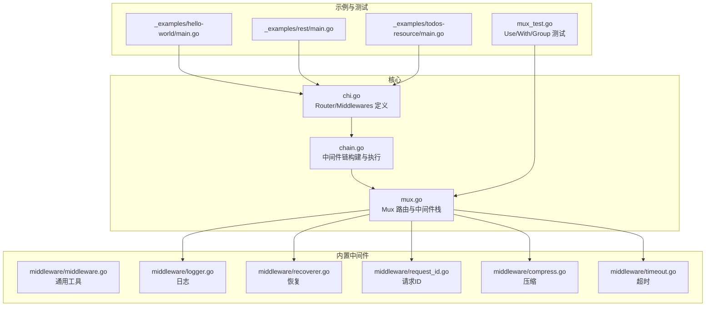
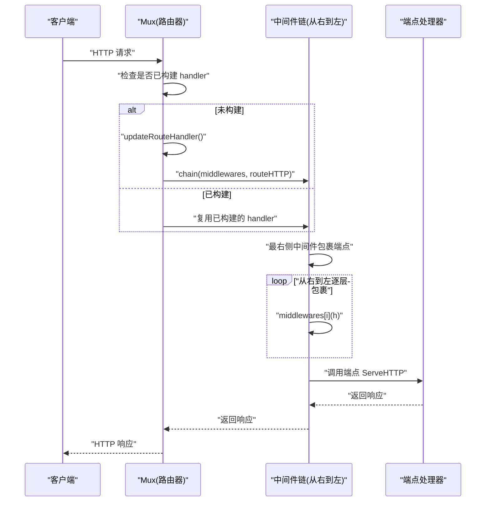
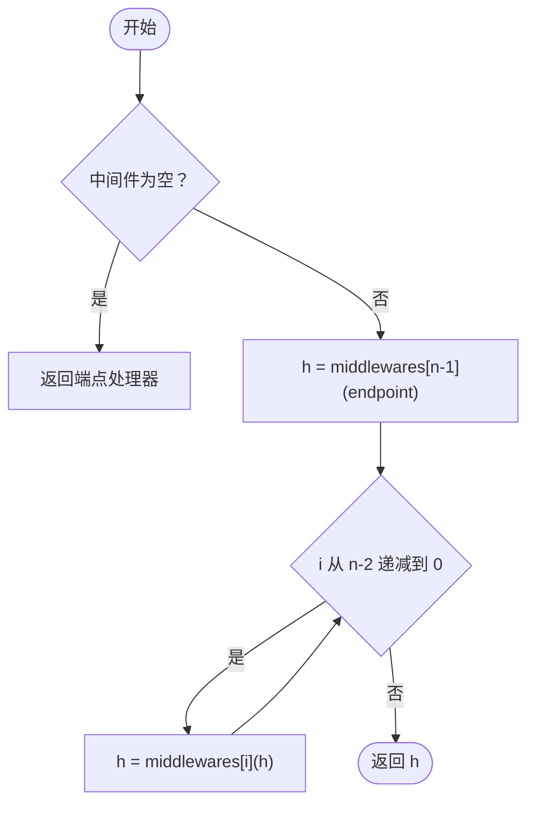
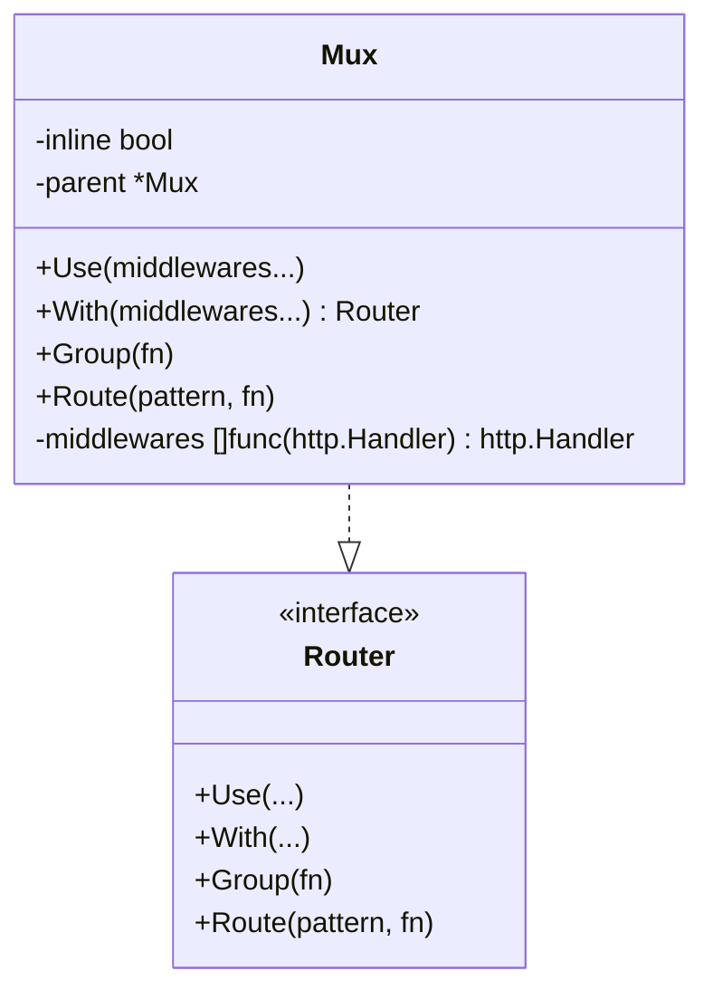
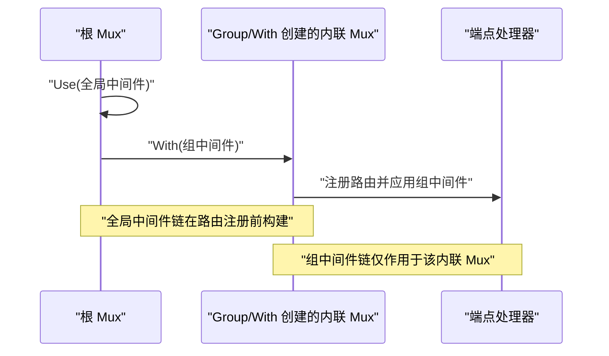
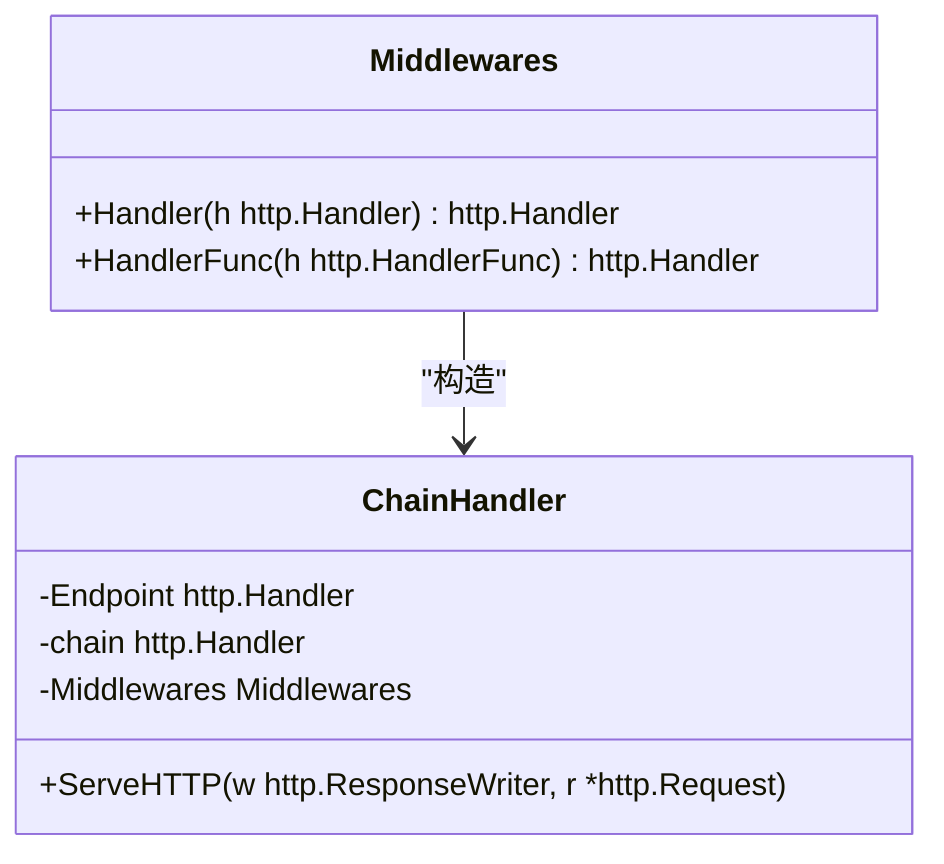
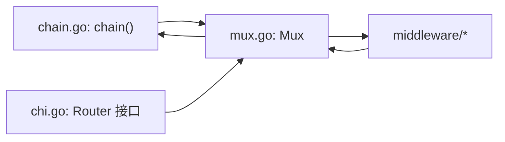

# 中间件组合策略

<cite>
**本文引用的文件**
- [chain.go](file://chain.go)
- [chi.go](file://chi.go)
- [mux.go](file://mux.go)
- [middleware/middleware.go](file://middleware/middleware.go)
- [middleware/logger.go](file://middleware/logger.go)
- [middleware/recoverer.go](file://middleware/recoverer.go)
- [middleware/request_id.go](file://middleware/request_id.go)
- [middleware/compress.go](file://middleware/compress.go)
- [middleware/timeout.go](file://middleware/timeout.go)
- [_examples/hello-world/main.go](file://_examples/hello-world/main.go)
- [_examples/rest/main.go](file://_examples/rest/main.go)
- [_examples/todos-resource/main.go](file://_examples/todos-resource/main.go)
- [mux_test.go](file://mux_test.go)
</cite>

## 目录
1. [引言](#引言)
2. [项目结构](#项目结构)
3. [核心组件](#核心组件)
4. [架构总览](#架构总览)
5. [详细组件分析](#详细组件分析)
6. [依赖关系分析](#依赖关系分析)
7. [性能考量](#性能考量)
8. [故障排查指南](#故障排查指南)
9. [结论](#结论)
10. [附录](#附录)

## 引言
本文件系统性阐述 chi 框架的中间件组合策略，重点围绕 chain.go 中 chain 函数的实现与中间件从右到左嵌套包装机制，解释 Use() 与 With() 在控制中间件作用范围上的差异与使用场景，并通过示例展示全局、路由组与单路由中间件的组合效果。同时，结合内置中间件（如日志、恢复、请求 ID、压缩、超时）说明执行顺序对请求处理流程的影响，给出复杂中间件堆栈的设计模式与最佳实践，最后演示如何使用 Middlewares.Handler 和 Middlewares.HandlerFunc 构建自定义中间件链。

## 项目结构
- 核心路由与中间件链：
  - chain.go：定义中间件链构建与执行的核心逻辑，包含 chain 函数、Middlewares 类型以及 ChainHandler。
  - chi.go：定义 Router 接口、Middlewares 类型及 Use/With 等方法签名。
  - mux.go：Mux 实现 Router 接口，负责路由树、中间件栈、Handler 组合与请求分发。
- 内置中间件：
  - middleware/logger.go：请求日志中间件，记录请求开始/结束、状态码、耗时等。
  - middleware/recoverer.go：异常恢复中间件，捕获 panic 并返回 500。
  - middleware/request_id.go：注入请求 ID 到上下文。
  - middleware/compress.go：响应压缩中间件，按 Accept-Encoding 选择编码器。
  - middleware/timeout.go：基于 context 超时中间件，超时返回 504。
  - middleware/middleware.go：通用中间件工具，如 New 将 http.Handler 包装为中间件。
- 示例与测试：
  - _examples/hello-world/main.go：基础全局中间件示例。
  - _examples/rest/main.go：路由组与 With 的综合使用示例。
  - _examples/todos-resource/main.go：子路由挂载与全局中间件示例。
  - mux_test.go：大量验证 Use/With/Group/Nested Groups 的行为与上下文传递。

**图表来源**
- [chain.go](file://chain.go#L1-L50)
- [chi.go](file://chi.go#L64-L138)
- [mux.go](file://mux.go#L1-L120)
- [middleware/logger.go](file://middleware/logger.go#L1-L60)
- [middleware/recoverer.go](file://middleware/recoverer.go#L1-L50)
- [middleware/request_id.go](file://middleware/request_id.go#L1-L40)
- [middleware/compress.go](file://middleware/compress.go#L1-L60)
- [middleware/timeout.go](file://middleware/timeout.go#L1-L49)
- [_examples/hello-world/main.go](file://_examples/hello-world/main.go#L1-L22)
- [_examples/rest/main.go](file://_examples/rest/main.go#L56-L112)
- [_examples/todos-resource/main.go](file://_examples/todos-resource/main.go#L14-L31)
- [mux_test.go](file://mux_test.go#L328-L370)

**章节来源**
- [chain.go](file://chain.go#L1-L50)
- [chi.go](file://chi.go#L64-L138)
- [mux.go](file://mux.go#L1-L120)

## 核心组件
- Middlewares 类型：表示一组标准中间件函数切片，支持链式组合与 Handler/HandlerFunc 构造。
- Chain 函数：将多个中间件转换为 Middlewares，便于后续组合。
- chain 函数：从右到左嵌套包装中间件，最终包裹端点处理器，返回新的 http.Handler。
- ChainHandler：封装端点与中间件链，统一 ServeHTTP 执行入口。
- Router 接口：定义 Use/With/Group/Route/Mount 等方法，用于中间件与路由组合。
- Mux：实现 Router，维护中间件栈、路由树与最终 handler；在路由注册阶段或首次请求前构建中间件链。

**章节来源**
- [chi.go](file://chi.go#L64-L138)
- [chain.go](file://chain.go#L1-L50)
- [mux.go](file://mux.go#L1-L120)

## 架构总览
下图展示了从请求进入路由器到端点执行的完整链路，强调中间件从右到左的嵌套顺序与执行路径。

**图表来源**
- [mux.go](file://mux.go#L509-L516)
- [chain.go](file://chain.go#L34-L49)

**章节来源**
- [mux.go](file://mux.go#L509-L516)
- [chain.go](file://chain.go#L34-L49)

## 详细组件分析

### chain 函数与中间件嵌套顺序
- 设计要点：
  - chain 接收中间件切片与端点处理器，若中间件为空则直接返回端点。
  - 从最后一个中间件开始，逐层向左包裹，形成“从右到左”的嵌套链。
  - 最终返回一个组合后的 http.Handler，该 handler 在 ServeHTTP 时按顺序依次执行。
- 执行顺序影响：
  - 右侧中间件先执行，左侧后执行；因此日志、恢复、压缩等中间件的相对位置直接影响请求生命周期内的行为。
  - 例如：日志中间件通常放在更靠右（靠近端点），以便在端点修改响应后再输出日志；恢复中间件通常放在更靠左（靠近入口），以尽早捕获 panic。

**图表来源**
- [chain.go](file://chain.go#L34-L49)

**章节来源**
- [chain.go](file://chain.go#L34-L49)

### Use() 与 With() 的差异与使用场景
- Use(middlewares...)：
  - 将中间件追加到当前 Mux 的全局中间件栈。
  - 影响所有后续注册的路由与端点处理器。
  - 注册路由前必须先定义 Use，否则会触发断言。
- With(middlewares...)：
  - 返回一个新的内联 Mux（inline=true），复制父级中间件栈并追加传入的中间件。
  - 仅对该内联 Mux 下的路由生效，不影响父级或其他子路由。
  - 适合为特定路由组或单路由添加专用中间件，而不污染全局栈。
- Group(fn)：
  - With() 的便捷封装，常用于批量为同路径下的路由设置中间件。
- Route(pattern, fn)：
  - 创建子路由并挂载，适合模块化组织路由与中间件。

**图表来源**
- [mux.go](file://mux.go#L94-L120)
- [mux.go](file://mux.go#L235-L268)
- [chi.go](file://chi.go#L64-L107)

**章节来源**
- [mux.go](file://mux.go#L94-L120)
- [mux.go](file://mux.go#L235-L268)
- [chi.go](file://chi.go#L64-L107)

### 全局中间件、路由组中间件与单路由中间件的组合效果
- 全局中间件（Use）：
  - 在 Mux 初始化后注册，影响所有路由。
  - 示例见 _examples/hello-world/main.go 与 _examples/todos-resource/main.go。
- 路由组中间件（Group/With）：
  - 通过 Group 或 With 为一组路由添加专用中间件，不污染全局栈。
  - 示例见 _examples/rest/main.go，其中 Route("/articles", ...) 下使用 With(ArticleCtx) 为特定资源组设置上下文加载中间件。
- 单路由中间件（With(...) + 路由注册）：
  - 对单条路由应用中间件，作用域最小。
  - mux_test.go 中验证了多层嵌套组与 With 的叠加效果，确保上下文值按中间件数量正确累加。

**图表来源**
- [_examples/hello-world/main.go](file://_examples/hello-world/main.go#L11-L21)
- [_examples/rest/main.go](file://_examples/rest/main.go#L78-L93)
- [_examples/todos-resource/main.go](file://_examples/todos-resource/main.go#L14-L31)
- [mux_test.go](file://mux_test.go#L1392-L1446)

**章节来源**
- [_examples/hello-world/main.go](file://_examples/hello-world/main.go#L11-L21)
- [_examples/rest/main.go](file://_examples/rest/main.go#L78-L93)
- [_examples/todos-resource/main.go](file://_examples/todos-resource/main.go#L14-L31)
- [mux_test.go](file://mux_test.go#L1392-L1446)

### 中间件执行顺序的重要性与对请求处理流程的影响
- 顺序决定上下文传播、错误恢复时机与响应修改时机：
  - 日志中间件通常靠右，以便在端点修改响应后再输出日志。
  - 恢复中间件靠左，尽早捕获 panic 并返回 500。
  - 压缩中间件在端点之后，需要根据响应头判断是否可压缩。
  - 超时中间件在端点之前，确保端点能感知 context 超时信号。
- 示例参考：
  - 日志中间件注释明确建议其应在恢复中间件之前，避免被恢复中间件吞掉日志。
  - 恢复中间件在端点之后，捕获 panic 并写入 500。
  - 压缩中间件根据 Content-Type 与 Content-Encoding 判断是否压缩。
  - 超时中间件在端点之前注入 context 超时。

**章节来源**
- [middleware/logger.go](file://middleware/logger.go#L23-L41)
- [middleware/recoverer.go](file://middleware/recoverer.go#L17-L49)
- [middleware/compress.go](file://middleware/compress.go#L1-L40)
- [middleware/timeout.go](file://middleware/timeout.go#L9-L32)

### 复杂中间件堆栈的设计模式与最佳实践
- 错误处理中间件位置：
  - 恢复中间件应尽量靠左，确保端点 panic 能被捕获并返回 500。
  - 若需结构化日志，可在恢复中间件之后再输出日志，但注意不要覆盖恢复中间件的输出。
- 日志中间件层级：
  - 日志中间件应尽可能靠近端点，以便记录最终状态码、耗时与响应体大小。
  - 使用请求 ID 中间件贯穿整个链路，便于跨服务追踪。
- 压缩中间件：
  - 放在端点之后，根据 Content-Type 与 Content-Encoding 决定是否压缩。
  - 注意 Content-Length 的删除与 Vary: Accept-Encoding 的设置。
- 超时中间件：
  - 放在端点之前，确保端点能 select ctx.Done() 优雅退出。
- 上下文传递与作用域：
  - Use 作用于全局；With/Group 作用于内联 Mux；Route 作用于子路由。
  - 通过 mux_test.go 验证多层嵌套组与 With 的叠加效果，确保上下文值按中间件数量正确累加。

**章节来源**
- [middleware/request_id.go](file://middleware/request_id.go#L1-L40)
- [middleware/compress.go](file://middleware/compress.go#L289-L316)
- [middleware/timeout.go](file://middleware/timeout.go#L16-L49)
- [mux_test.go](file://mux_test.go#L1392-L1446)

### 使用 Middlewares.Handler 与 Middlewares.HandlerFunc 构建自定义中间件链
- Middlewares.Handler(h)：将中间件切片与 http.Handler 组合，返回新的 http.Handler。
- Middlewares.HandlerFunc(h)：将中间件切片与 http.HandlerFunc 组合，返回新的 http.Handler。
- Chain(middlewares...)：将多个中间件转换为 Middlewares，便于与 Handler/HandlerFunc 配合使用。
- ChainHandler：内部持有端点与组合后的 handler，统一 ServeHTTP 执行。

**图表来源**
- [chain.go](file://chain.go#L10-L20)
- [chain.go](file://chain.go#L22-L33)

**章节来源**
- [chain.go](file://chain.go#L10-L20)
- [chain.go](file://chain.go#L22-L33)

## 依赖关系分析
- Mux 依赖中间件链构建函数 chain，在路由注册或首次请求前构建 handler。
- Router 接口定义 Use/With/Group/Route/Mount 等方法，Mux 实现这些接口。
- 内置中间件通过标准中间件签名与 ChainHandler 协作，形成统一的链式调用。

**图表来源**
- [chain.go](file://chain.go#L34-L49)
- [mux.go](file://mux.go#L509-L516)
- [chi.go](file://chi.go#L64-L107)

**章节来源**
- [chain.go](file://chain.go#L34-L49)
- [mux.go](file://mux.go#L509-L516)
- [chi.go](file://chi.go#L64-L107)

## 性能考量
- 中间件链构建发生在路由注册或首次请求前，避免每次请求重复构建。
- ChainHandler 仅保存端点与组合后的 handler，ServeHTTP 直接委托执行，开销低。
- 压缩中间件使用池化 encoder，减少分配与 GC 压力。
- 超时中间件通过 context 超时控制端点执行时间，避免阻塞。

[本节为通用指导，无需引用具体文件]

## 故障排查指南
- 注册顺序问题：
  - Use 必须在路由注册前完成，否则会触发断言。
  - 日志中间件应在恢复中间件之前，避免被吞掉日志。
- 上下文丢失或覆盖：
  - 使用 With/Group 时，确认中间件是否正确传递上下文。
  - 参考 mux_test.go 中对上下文值的断言与验证。
- 压缩无效：
  - 检查 Content-Type 是否在允许列表，以及是否已有 Content-Encoding。
- 超时未生效：
  - 确认端点是否 select ctx.Done()，并在超时时返回 504。

**章节来源**
- [mux.go](file://mux.go#L94-L105)
- [middleware/logger.go](file://middleware/logger.go#L23-L41)
- [middleware/compress.go](file://middleware/compress.go#L289-L316)
- [middleware/timeout.go](file://middleware/timeout.go#L16-L49)
- [mux_test.go](file://mux_test.go#L328-L370)

## 结论
chi 的中间件组合策略以 chain 函数为核心，采用从右到左的嵌套顺序，使中间件能够以声明式方式层层包裹端点处理器。Use 提供全局中间件能力，With/Group 提供路由组与单路由的局部中间件能力，三者配合可实现灵活的作用域控制。通过合理安排中间件顺序（如恢复靠左、日志靠右、压缩在端点后、超时在端点前），可获得清晰的请求生命周期与稳定的运行表现。借助 Middlewares.Handler/HandlerFunc 与 Chain，开发者可以轻松构建自定义中间件链，满足复杂业务需求。

[本节为总结，无需引用具体文件]

## 附录
- 示例参考：
  - 全局中间件：[_examples/hello-world/main.go](file://_examples/hello-world/main.go#L11-L21)
  - 路由组与 With：[_examples/rest/main.go](file://_examples/rest/main.go#L78-L93)
  - 子路由挂载：[_examples/todos-resource/main.go](file://_examples/todos-resource/main.go#L22-L31)
- 测试参考：
  - 多层嵌套组与 With 的叠加效果：[mux_test.go](file://mux_test.go#L1392-L1446)
  - NotFound/MethodNotAllowed 的中间件链构建：[mux.go](file://mux.go#L195-L233)

[本节为补充信息，无需引用具体文件]