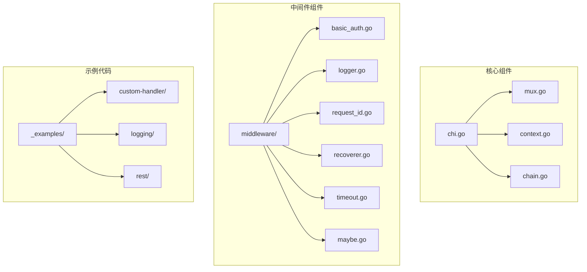
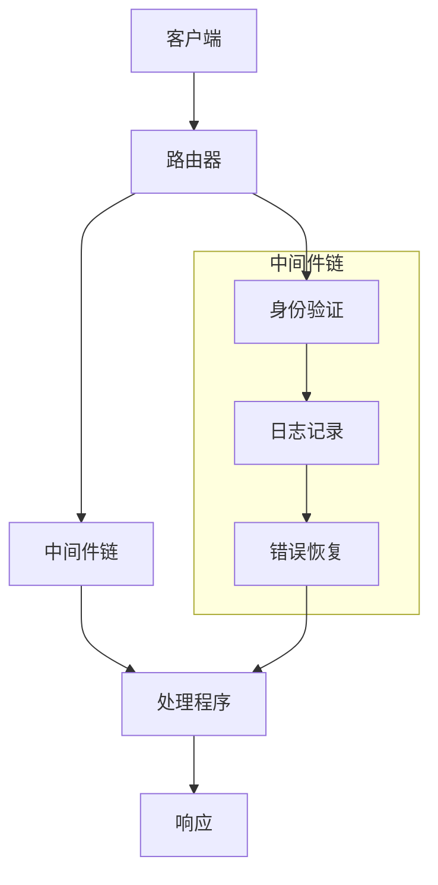
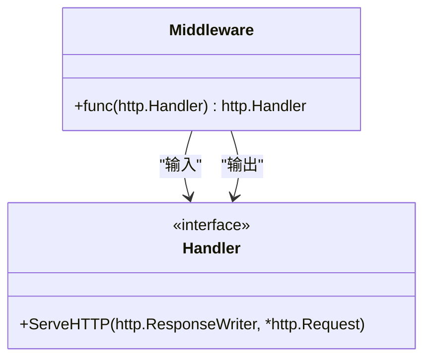
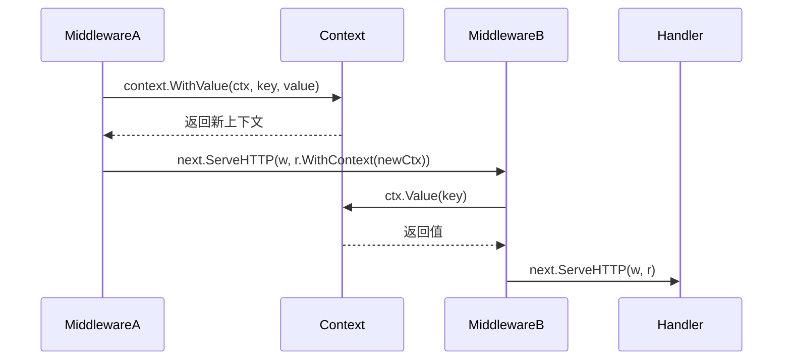
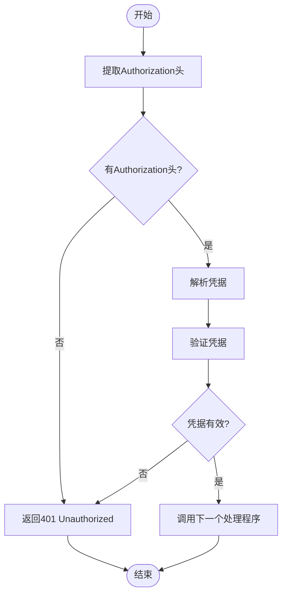
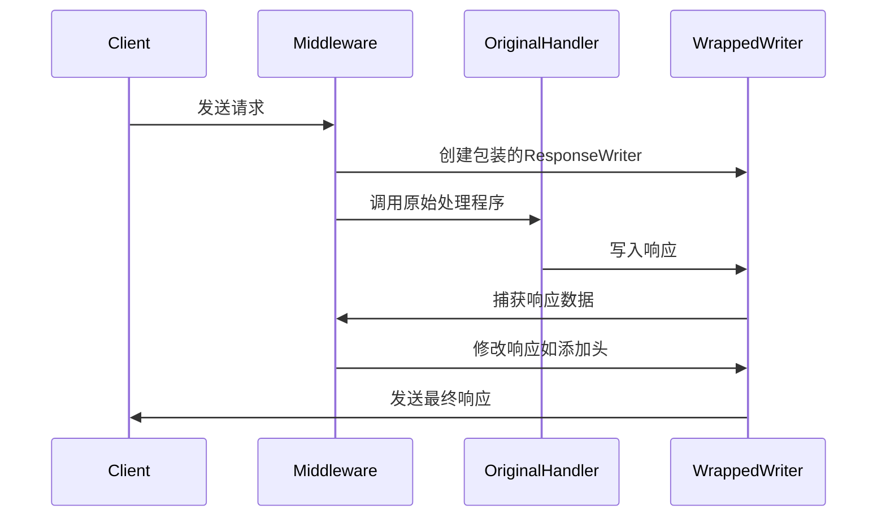
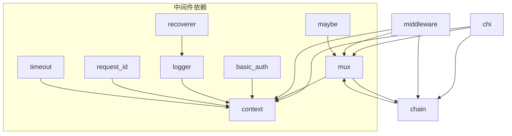

# 自定义中间件

<cite>
**本文档中引用的文件**   
- [middleware.go](file://middleware/middleware.go)
- [chain.go](file://chain.go)
- [context.go](file://context.go)
- [chi.go](file://chi.go)
- [mux.go](file://mux.go)
- [logger.go](file://middleware/logger.go)
- [request_id.go](file://middleware/request_id.go)
- [basic_auth.go](file://middleware/basic_auth.go)
- [recoverer.go](file://middleware/recoverer.go)
- [timeout.go](file://middleware/timeout.go)
- [maybe.go](file://middleware/maybe.go)
</cite>

## 目录
1. [简介](#简介)
2. [项目结构](#项目结构)
3. [核心组件](#核心组件)
4. [架构概述](#架构概述)
5. [详细组件分析](#详细组件分析)
6. [依赖分析](#依赖分析)
7. [性能考虑](#性能考虑)
8. [故障排除指南](#故障排除指南)
9. [结论](#结论)

## 简介
本指南详细介绍了如何在chi框架中开发自定义中间件。我们将深入探讨中间件的创建模式，包括如何利用`middleware.New`函数和`func(http.Handler) http.Handler`签名来构建中间件。我们将展示如何使用context包在中间件之间传递请求上下文数据，包括从请求中提取信息（如用户身份、设备信息）并注入到context中。通过具体示例，我们将演示如何编写身份验证、请求日志、响应修改等自定义中间件。我们还将解释中间件执行顺序的重要性以及如何通过`Use()`和`With()`方法控制作用范围。结合`chain.go`中的中间件链组装逻辑，说明多个中间件如何嵌套调用。最后，我们将提供调试技巧和常见陷阱（如中间件顺序错误、context键冲突）的解决方案。

## 项目结构
chi框架的项目结构清晰地组织了其核心功能和中间件组件。主要分为三个部分：核心路由组件、中间件组件和示例代码。核心路由组件包括`chi.go`、`mux.go`、`context.go`和`chain.go`，这些文件构成了框架的基础。中间件组件位于`middleware`目录下，包含了各种预定义的中间件实现。示例代码位于`_examples`目录下，提供了实际使用框架的参考。



**Diagram sources**
- [chi.go](file://chi.go#L1-L138)
- [mux.go](file://mux.go#L1-L529)
- [context.go](file://context.go#L1-L167)
- [chain.go](file://chain.go#L1-L50)

**Section sources**
- [chi.go](file://chi.go#L1-L138)
- [mux.go](file://mux.go#L1-L529)
- [context.go](file://context.go#L1-L167)
- [chain.go](file://chain.go#L1-L50)

## 核心组件
chi框架的核心组件包括路由系统、中间件系统和上下文管理系统。路由系统由`Mux`结构体实现，负责处理HTTP请求的路由匹配。中间件系统提供了一种机制，可以在请求处理的各个阶段插入自定义逻辑。上下文管理系统则允许在请求生命周期内安全地传递数据。

**Section sources**
- [chi.go](file://chi.go#L59-L138)
- [mux.go](file://mux.go#L21-L529)
- [context.go](file://context.go#L9-L167)

## 架构概述
chi框架的架构基于Go的`http.Handler`接口，通过组合模式实现了灵活的中间件系统。框架的核心是一个路由多路复用器（Mux），它负责将HTTP请求路由到相应的处理程序。中间件系统通过函数式编程的方式实现，每个中间件都是一个接受`http.Handler`并返回`http.Handler`的函数。这种设计使得中间件可以轻松地组合和嵌套。



**Diagram sources**
- [chi.go](file://chi.go#L66-L114)
- [mux.go](file://mux.go#L100-L105)
- [chain.go](file://chain.go#L6-L20)

## 详细组件分析

### 中间件创建模式分析
chi框架中的中间件遵循一个标准的创建模式：接收一个`http.Handler`作为参数，并返回一个新的`http.Handler`。这种设计模式允许中间件在不改变原始处理程序的情况下，添加额外的功能。`middleware.New`函数提供了一个基础的中间件创建方法，可以将任何`http.Handler`转换为中间件。



**Diagram sources**
- [middleware.go](file://middleware/middleware.go#L5-L11)
- [chi.go](file://chi.go#L71-L74)

**Section sources**
- [middleware.go](file://middleware/middleware.go#L5-L24)
- [chi.go](file://chi.go#L71-L74)

### 上下文数据传递分析
chi框架使用Go的`context`包来在中间件之间传递请求上下文数据。通过`context.WithValue`函数，可以在请求上下文中存储键值对数据。为了确保类型安全，chi框架推荐使用自定义的上下文键类型，避免字符串键的冲突。



**Diagram sources**
- [context.go](file://context.go#L37-L40)
- [request_id.go](file://middleware/request_id.go#L18-L21)
- [logger.go](file://middleware/logger.go#L14-L15)

**Section sources**
- [context.go](file://context.go#L9-L167)
- [request_id.go](file://middleware/request_id.go#L18-L97)
- [logger.go](file://middleware/logger.go#L14-L173)

### 身份验证中间件分析
身份验证中间件是保护API端点的重要组件。chi框架提供了`BasicAuth`中间件作为示例，展示了如何实现基本的身份验证。该中间件检查请求的Authorization头，验证提供的凭据，并在验证失败时返回401状态码。



**Diagram sources**
- [basic_auth.go](file://middleware/basic_auth.go#L9-L34)
- [request_id.go](file://middleware/request_id.go#L67-L79)

**Section sources**
- [basic_auth.go](file://middleware/basic_auth.go#L9-L34)
- [request_id.go](file://middleware/request_id.go#L67-L97)

### 请求日志中间件分析
请求日志中间件用于记录每个HTTP请求的详细信息，包括请求方法、路径、响应状态码和处理时间。chi框架的`Logger`中间件提供了一个完整的日志记录解决方案，支持自定义日志格式和彩色输出。

```mermaid
classDiagram
class Logger {
+func(next http.Handler) http.Handler
}
class LogFormatter {
<<interface>>
+NewLogEntry(r *http.Request) LogEntry
}
class LogEntry {
<<interface>>
+Write(status, bytes int, header http.Header, elapsed time.Duration, extra interface{})
+Panic(v interface{}, stack []byte)
}
class DefaultLogFormatter {
+Logger LoggerInterface
+NoColor bool
}
class defaultLogEntry {
+*DefaultLogFormatter
+request *http.Request
+buf *bytes.Buffer
+useColor bool
}
Logger --> LogFormatter
LogFormatter --> LogEntry
DefaultLogFormatter --> LogFormatter
defaultLogEntry --> LogEntry
```

**Diagram sources**
- [logger.go](file://middleware/logger.go#L23-L173)
- [recoverer.go](file://middleware/recoverer.go#L22-L49)

**Section sources**
- [logger.go](file://middleware/logger.go#L23-L173)
- [recoverer.go](file://middleware/recoverer.go#L22-L49)

### 响应修改中间件分析
响应修改中间件可以在响应发送给客户端之前对其进行修改。这种中间件通常用于添加响应头、压缩响应体或修改响应内容。chi框架通过包装`http.ResponseWriter`来实现响应修改，允许中间件在不改变原始处理程序的情况下修改响应。



**Diagram sources**
- [wrap_writer.go](file://middleware/wrap_writer.go#L1-L100)
- [compress.go](file://middleware/compress.go#L1-L100)

**Section sources**
- [wrap_writer.go](file://middleware/wrap_writer.go#L1-L100)
- [compress.go](file://middleware/compress.go#L1-L100)

## 依赖分析
chi框架的依赖关系清晰地展示了其模块化设计。核心组件之间通过接口和函数式编程的方式进行通信，而不是直接依赖具体的实现。这种设计使得框架具有很高的灵活性和可扩展性。



**Diagram sources**
- [chi.go](file://chi.go#L57-L138)
- [mux.go](file://mux.go#L3-L529)
- [chain.go](file://chain.go#L3-L50)
- [context.go](file://context.go#L3-L167)

**Section sources**
- [chi.go](file://chi.go#L57-L138)
- [mux.go](file://mux.go#L3-L529)
- [chain.go](file://chain.go#L3-L50)
- [context.go](file://context.go#L3-L167)

## 性能考虑
在设计和实现中间件时，需要考虑性能影响。每个中间件都会增加一定的处理开销，因此应该尽量减少不必要的中间件。此外，中间件的执行顺序也会影响性能，应该将开销较大的中间件放在链的后面，以便在早期中间件可以短路请求处理。

## 故障排除指南
在使用chi框架的中间件时，可能会遇到一些常见问题。最常见的问题是中间件顺序错误，这可能导致预期之外的行为。例如，日志中间件应该放在恢复中间件之前，以便记录所有请求，包括那些导致panic的请求。另一个常见问题是context键冲突，应该使用自定义的上下文键类型来避免这个问题。

**Section sources**
- [mux.go](file://mux.go#L101-L103)
- [middleware.go](file://middleware/middleware.go#L17-L23)
- [context.go](file://context.go#L37-L40)

## 结论
chi框架提供了一个强大而灵活的中间件系统，允许开发者轻松地扩展和定制HTTP请求处理流程。通过理解中间件的创建模式、上下文数据传递机制和执行顺序，开发者可以构建出高效、可维护的Web应用程序。本指南详细介绍了这些概念，并提供了具体的实现示例，希望能帮助开发者更好地利用chi框架的功能。