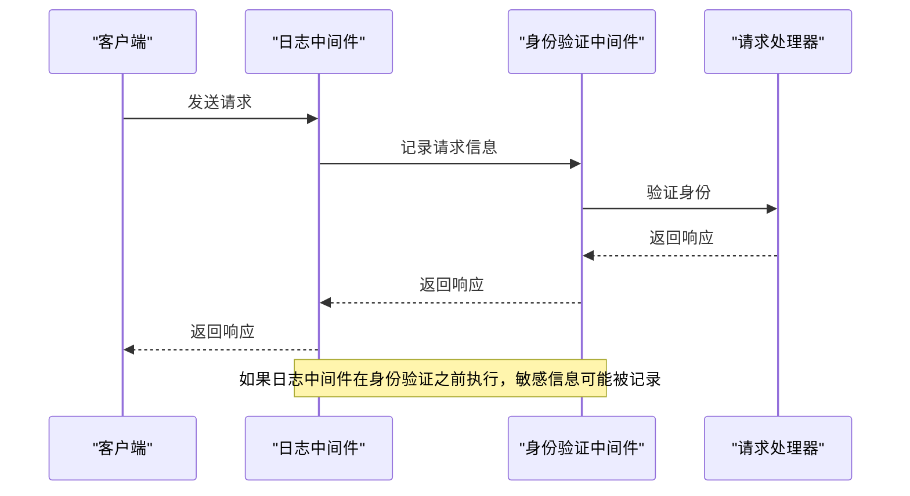
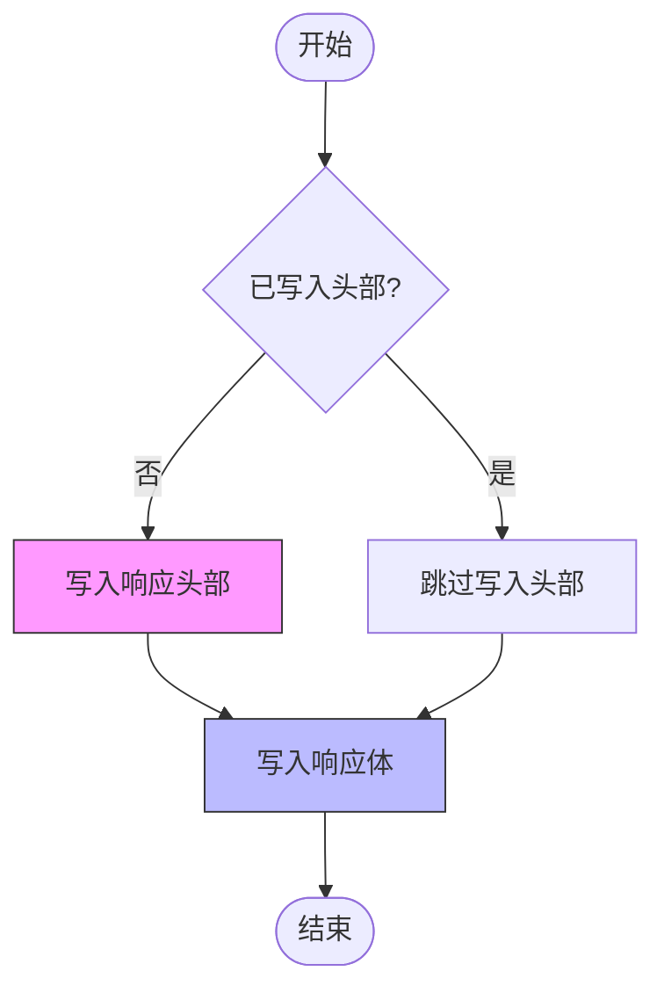
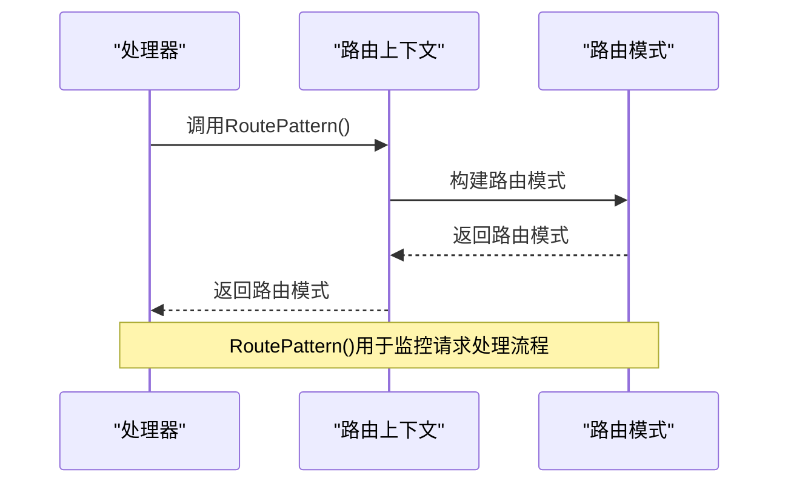
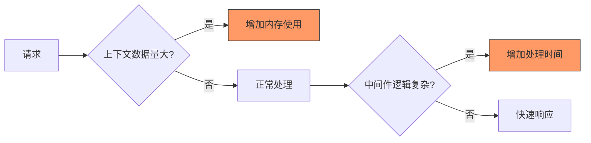

# 调试技巧与常见陷阱

<cite>
**本文档中引用的文件**  
- [chi.go](file://chi.go)
- [context.go](file://context.go)
- [chain.go](file://chain.go)
- [mux.go](file://mux.go)
- [middleware/middleware.go](file://middleware/middleware.go)
- [middleware/logger.go](file://middleware/logger.go)
- [middleware/recoverer.go](file://middleware/recoverer.go)
- [middleware/request_id.go](file://middleware/request_id.go)
- [middleware/basic_auth.go](file://middleware/basic_auth.go)
- [middleware/timeout.go](file://middleware/timeout.go)
- [middleware/value.go](file://middleware/value.go)
- [middleware/wrap_writer.go](file://middleware/wrap_writer.go)
- [middleware/request_id_test.go](file://middleware/request_id_test.go)
- [mux_test.go](file://mux_test.go)
- [context_test.go](file://context_test.go)
</cite>

## 目录
1. [引言](#引言)
2. [中间件顺序错误](#中间件顺序错误)
3. [上下文键冲突](#上下文键冲突)
4. [中间件无限循环与响应提前写入](#中间件无限循环与响应提前写入)
5. [请求处理流程监控](#请求处理流程监控)
6. [性能瓶颈识别](#性能瓶颈识别)
7. [故障排除清单与最佳实践](#故障排除清单与最佳实践)

## 引言
chi是一个小型、惯用且可组合的HTTP服务路由器，支持Go的四个最新主要版本。它提供了核心路由方法，允许开发者构建模块化和可组合的HTTP服务。chi的中间件系统是其核心特性之一，允许在请求处理过程中插入各种功能，如日志记录、身份验证、请求ID生成等。然而，中间件的使用也带来了调试复杂性和潜在陷阱，如中间件顺序错误、上下文键冲突、无限循环等问题。本文档旨在提供一个实用指南，帮助开发者识别和解决这些常见问题。

**Section sources**
- [chi.go](file://chi.go#L1-L138)
- [mux.go](file://mux.go#L1-L529)

## 中间件顺序错误
中间件顺序是chi框架中一个关键但容易出错的方面。中间件的执行顺序直接影响请求处理流程和最终结果。例如，如果身份验证中间件在日志中间件之后执行，可能会导致敏感信息（如认证凭据）被记录到日志中，造成安全风险。

在chi中，中间件通过`Use`方法添加到路由器的中间件栈中。中间件栈的执行顺序是从外到内，即最先添加的中间件最后执行。这意味着中间件的顺序必须仔细规划，以确保正确的执行流程。



**Diagram sources**
- [middleware/logger.go](file://middleware/logger.go#L39-L41)
- [middleware/basic_auth.go](file://middleware/basic_auth.go#L10-L28)

**Section sources**
- [middleware/logger.go](file://middleware/logger.go#L23-L41)
- [middleware/basic_auth.go](file://middleware/basic_auth.go#L9-L34)

## 上下文键冲突
在Go的`context`包中，使用`context.WithValue`来存储请求范围的数据。然而，如果多个中间件使用相同的键来存储数据，就会发生键冲突，导致数据被意外覆盖。

chi框架通过使用类型安全的上下文键来避免这种问题。例如，在`request_id.go`文件中，定义了一个`ctxKeyRequestID`类型，并使用该类型作为上下文键：

```go
type ctxKeyRequestID int

const RequestIDKey ctxKeyRequestID = 0
```

这种方法确保了上下文键的唯一性，避免了与其他中间件的键冲突。开发者在创建自定义中间件时，应遵循这一模式，使用唯一的类型作为上下文键。

```mermaid
classDiagram
class Context {
+WithValue(key, val interface{}) context.Context
+Value(key interface{}) interface{}
}
class RequestIDKey {
<<constant>>
+RequestIDKey ctxKeyRequestID
}
class ctxKeyRequestID {
<<type>>
+int
}
Context --> RequestIDKey : "使用"
RequestIDKey --> ctxKeyRequestID : "类型"
```

**Diagram sources**
- [middleware/request_id.go](file://middleware/request_id.go#L18-L21)
- [context.go](file://context.go#L157-L166)

**Section sources**
- [middleware/request_id.go](file://middleware/request_id.go#L17-L97)
- [context.go](file://context.go#L37-L40)

## 中间件无限循环与响应提前写入
中间件无限循环通常发生在中间件错误地调用`next.ServeHTTP`方法，导致请求在中间件之间无限循环。为了避免这种情况，开发者应确保在适当的时候调用`next.ServeHTTP`，并在不需要继续处理请求时直接返回响应。

响应提前写入是指中间件在调用`next.ServeHTTP`之前就向响应写入数据。这可能导致后续中间件或处理器无法正确设置响应头或状态码。chi框架通过`WrapResponseWriter`来解决这个问题，它允许中间件在最终响应写入之前拦截和修改响应。



**Diagram sources**
- [middleware/wrap_writer.go](file://middleware/wrap_writer.go#L82-L114)
- [middleware/logger.go](file://middleware/logger.go#L46-L57)

**Section sources**
- [middleware/wrap_writer.go](file://middleware/wrap_writer.go#L1-L242)
- [middleware/logger.go](file://middleware/logger.go#L43-L58)

## 请求处理流程监控
chi框架提供了`RoutePattern()`方法，用于监控请求处理流程。该方法返回当前请求的路由模式，可以帮助开发者了解请求是如何被路由的。`RoutePattern()`方法在请求处理完成后调用，以确保获取到完整的路由模式。



**Diagram sources**
- [context.go](file://context.go#L123-L134)
- [context_test.go](file://context_test.go#L24-L86)

**Section sources**
- [context.go](file://context.go#L109-L134)
- [context_test.go](file://context_test.go#L5-L86)

## 性能瓶颈识别
性能瓶颈可能出现在多个方面，如过度的上下文数据存储或复杂的中间件逻辑。过度的上下文数据存储会增加内存使用量，而复杂的中间件逻辑会增加请求处理时间。

为了识别性能瓶颈，开发者可以使用以下方法：
- 使用`context`的`Value`方法时，避免存储大量数据。
- 简化中间件逻辑，避免不必要的计算。
- 使用`timeout`中间件来限制请求处理时间，防止长时间运行的请求影响整体性能。



**Diagram sources**
- [middleware/timeout.go](file://middleware/timeout.go#L32-L48)
- [context.go](file://context.go#L45-L79)

**Section sources**
- [middleware/timeout.go](file://middleware/timeout.go#L9-L49)
- [context.go](file://context.go#L42-L79)

## 故障排除清单与最佳实践
为了帮助开发者快速识别和解决常见问题，以下是一个故障排除清单和最佳实践建议：

1. **检查中间件顺序**：确保中间件按正确的顺序添加，特别是日志和身份验证中间件。
2. **使用类型安全的上下文键**：避免上下文键冲突，确保数据的唯一性和安全性。
3. **避免无限循环**：确保中间件在适当的时候调用`next.ServeHTTP`，并在不需要继续处理请求时直接返回响应。
4. **监控响应写入**：使用`WrapResponseWriter`来拦截和修改响应，避免响应提前写入。
5. **优化性能**：避免过度的上下文数据存储和复杂的中间件逻辑，使用`timeout`中间件来限制请求处理时间。

通过遵循这些最佳实践，开发者可以有效地利用chi框架的中间件系统，构建高效、安全和可维护的HTTP服务。

**Section sources**
- [chi.go](file://chi.go#L60-L137)
- [mux.go](file://mux.go#L100-L105)
- [middleware/middleware.go](file://middleware/middleware.go#L6-L11)
- [middleware/recoverer.go](file://middleware/recoverer.go#L22-L49)
- [middleware/request_id.go](file://middleware/request_id.go#L67-L78)
- [middleware/value.go](file://middleware/value.go#L9-L17)