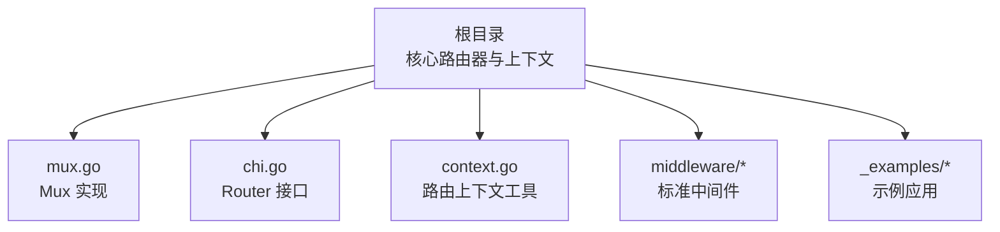
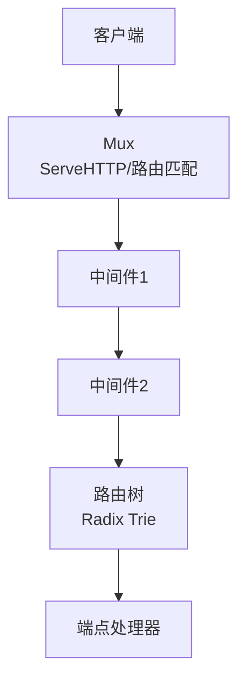
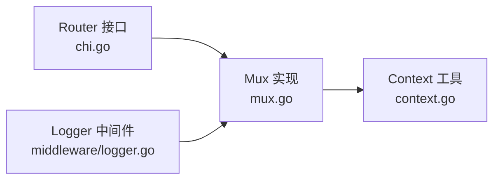

# 快速开始

<cite>
**本文引用的文件**
- [README.md](file://README.md)
- [go.mod](file://go.mod)
- [chi.go](file://chi.go)
- [mux.go](file://mux.go)
- [context.go](file://context.go)
- [middleware/logger.go](file://middleware/logger.go)
- [_examples/hello-world/main.go](file://_examples/hello-world/main.go)
- [_examples/rest/main.go](file://_examples/rest/main.go)
</cite>

## 目录
1. [简介](#简介)
2. [项目结构](#项目结构)
3. [核心组件](#核心组件)
4. [架构总览](#架构总览)
5. [详细组件分析](#详细组件分析)
6. [依赖关系分析](#依赖关系分析)
7. [性能考量](#性能考量)
8. [故障排查指南](#故障排查指南)
9. [结论](#结论)
10. [附录](#附录)

## 简介
本指南面向初学者与有经验的开发者，帮助你在最短时间内上手 chi 路由器：它是一个轻量、惯用且可组合的 Go HTTP 路由器，基于标准库 net/http 构建，并通过 Go 1.7 引入的 context 包实现请求级上下文传递。chi 的设计目标是帮助你构建大型 REST API 服务，保持可维护性与可扩展性；同时提供模块化、可组合的中间件与子路由能力，支持挂载其他处理器或子路由器，便于拆分复杂系统为多个小模块。

安装与基础示例
- 安装：使用 go get 命令安装最新 v5 版本。
- 基础示例：参考 README 中的“Hello World”示例，展示如何创建路由器、添加日志中间件、定义路由并启动 HTTP 服务器。

章节来源
- file://README.md#L21-L26
- file://README.md#L46-L66

## 项目结构
chi 仓库采用按功能域划分的组织方式：
- 根目录包含核心路由器实现、上下文工具与基准测试等。
- middleware 子包提供一组标准的 net/http 中间件，可直接与 chi 集成。
- _examples 提供多种典型场景示例，包括基础 Hello World、REST API、文件服务器、优雅关闭等。

下面以概念图展示项目结构与关键文件的关系（该图为概念示意，不映射到具体源码）：

章节来源
- file://README.md#L1-L20

## 核心组件
- 路由器接口 Router：定义了 Use、With、Group、Route、Mount、各 HTTP 方法路由、NotFound、MethodNotAllowed 等方法，完全兼容 net/http。
- Mux 实现：实现了 Router 接口，内部使用前缀树（Radix Trie）进行高效路由匹配；支持中间件链式组合、子路由挂载、通配符参数等。
- 上下文 Context：在请求生命周期内记录路由路径、URL 参数、允许的方法集合等信息，并通过 context.Context 传递。
- 中间件：遵循标准 net/http 中间件范式，可自由组合，例如日志、恢复、超时、请求 ID 等。

章节来源
- file://chi.go#L64-L138
- file://mux.go#L1-L120
- file://context.go#L1-L80
- file://README.md#L330-L422

## 架构总览
chi 的运行时架构围绕“路由器 + 中间件栈 + 路由树”的组合展开。请求进入时，Mux 将请求上下文注入路由上下文，随后按中间件顺序执行，再在路由树中查找匹配端点，最后调用对应处理器。

图表来源
- [mux.go](file://mux.go#L60-L120)
- [chi.go](file://chi.go#L64-L138)

章节来源
- file://mux.go#L60-L120
- file://chi.go#L64-L138

## 详细组件分析

### 组件一：创建路由器与基础路由
- 创建路由器实例：通过 NewRouter() 获取一个新的 Mux 实例。
- 添加路由：使用 Get、Post、Put、Delete 等方法注册路径与处理器。
- 启动服务器：将路由器作为 http.Handler 传给 http.ListenAndServe。

示例参考
- README 中的“Hello World”示例展示了最小可用流程。
- 示例文件展示了更完整的中间件与路由组织方式。

章节来源
- file://README.md#L46-L66
- file://_examples/hello-world/main.go#L1-L22

### 组件二：中间件与日志
- 中间件栈：Use 在全局层追加中间件；With 为单个端点生成内联中间件栈；Group 用于同一路径下的中间件分组。
- 日志中间件：Logger 记录请求开始与结束、状态码、耗时等；建议放在可能改变响应的中间件之前（如 Recoverer）。

章节来源
- file://chi.go#L64-L138
- file://mux.go#L94-L120
- file://mux.go#L235-L268
- file://middleware/logger.go#L23-L41

### 组件三：上下文与 URL 参数
- URL 参数：通过 URLParam 或 URLParamFromCtx 从请求上下文中读取命名参数或通配符参数。
- 路由上下文：Context 记录 RoutePath、RouteMethod、URLParams、RoutePatterns 等，贯穿子路由链路。

章节来源
- file://context.go#L1-L80
- file://context.go#L81-L167

### 组件四：子路由与挂载
- Route：沿某模式挂载一个子路由器，适合资源型 REST API。
- Mount：将另一个 http.Handler 或 chi.Router 挂载到某模式下，常用于模块化拆分。

章节来源
- file://mux.go#L269-L340
- file://_examples/rest/main.go#L95-L98

### 组件五：错误处理与自定义处理器
- NotFound 与 MethodNotAllowed：可设置自定义处理器，未匹配时返回 404，方法不允许时返回 405 并设置 Allow 头。
- 内置默认处理器：NotFoundHandler 与 MethodNotAllowedHandler 返回标准行为。

章节来源
- file://mux.go#L195-L233
- file://mux.go#L396-L413

### 组件六：REST 示例与最佳实践
- 使用 Route 与 With 组织资源路由与中间件。
- 使用 URLFormat、RequestID、Logger、Recoverer 等中间件提升可观测性与健壮性。
- 使用 render 设置内容类型，简化 JSON 响应。

章节来源
- file://_examples/rest/main.go#L56-L112
- file://_examples/rest/main.go#L78-L94
- file://_examples/rest/main.go#L121-L145

## 依赖关系分析
- chi.go 定义 Router 接口与中间件类型，为整个库的契约。
- mux.go 实现 Router 接口，负责中间件链构建、路由树插入与请求分发。
- context.go 提供 URL 参数与路由上下文工具，支撑参数提取与跨子路由传递。
- middleware/logger.go 提供日志中间件，遵循标准 net/http 中间件范式。

图表来源
- [chi.go](file://chi.go#L64-L138)
- [mux.go](file://mux.go#L1-L120)
- [context.go](file://context.go#L1-L80)
- [middleware/logger.go](file://middleware/logger.go#L23-L41)

章节来源
- file://chi.go#L64-L138
- file://mux.go#L1-L120
- file://context.go#L1-L80
- file://middleware/logger.go#L23-L41

## 性能考量
- chi 路由器基于 Radix Trie，具备良好的路由查找性能，适合大规模 REST API。
- 中间件链在路由注册前构建，避免运行时重复组装，减少分配与开销。
- 请求上下文通过 sync.Pool 复用，降低每次请求的内存分配。

章节来源
- file://README.md#L30-L39
- file://mux.go#L60-L92

## 故障排查指南
- 中间件顺序问题：若希望日志记录完整响应，请将 Logger 放在可能修改响应的中间件之前（如 Recoverer）。
- 路由未命中：检查是否正确设置 NotFound 与 MethodNotAllowed；确认路径大小写与尾斜杠。
- 参数读取失败：确认路由模式中已定义命名参数或通配符，并在处理器中使用 URLParam 读取。
- 子路由挂载冲突：在同一模式下重复 Mount 会触发 panic，需确保挂载路径唯一。

章节来源
- file://middleware/logger.go#L32-L41
- file://mux.go#L195-L233
- file://context.go#L1-L24
- file://mux.go#L282-L340

## 结论
chi 以简洁的接口、强大的中间件生态与模块化的子路由能力，为构建可维护的 Go HTTP 服务提供了优雅方案。通过本指南的安装与示例，你可以快速搭建一个带日志、恢复与 REST 风格路由的最小可用服务，并在此基础上逐步扩展为复杂的微服务或 API 网关。

## 附录
- 安装命令与版本要求：参见 go.mod 与 README 的安装说明。
- 更多示例：参考 _examples 下的 hello-world、rest 等示例文件。

章节来源
- file://go.mod#L1-L6
- file://README.md#L21-L26
- file://_examples/hello-world/main.go#L1-L22
- file://_examples/rest/main.go#L56-L112