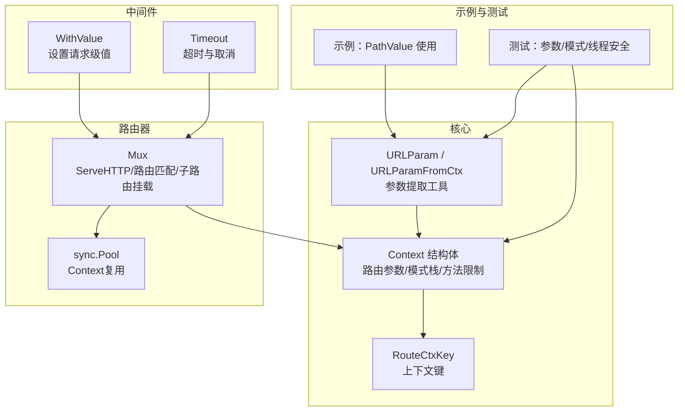
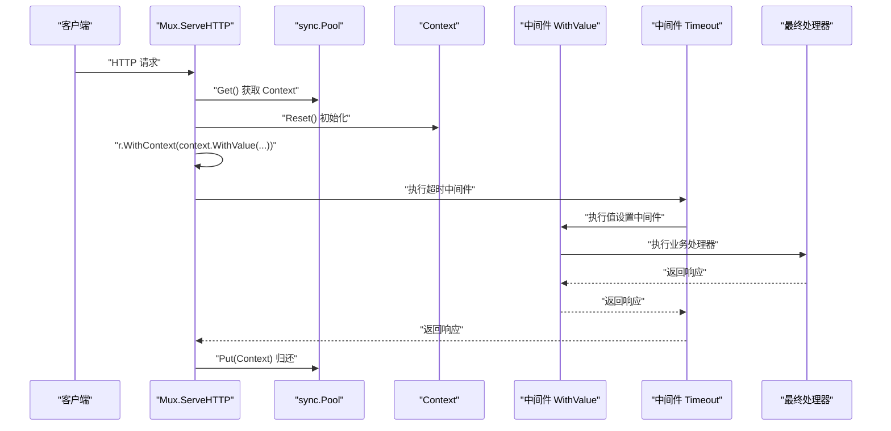
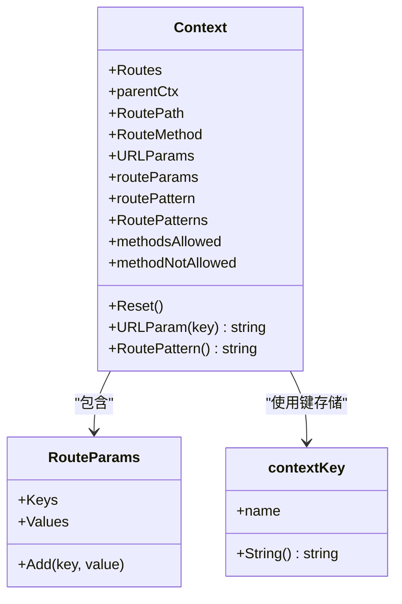
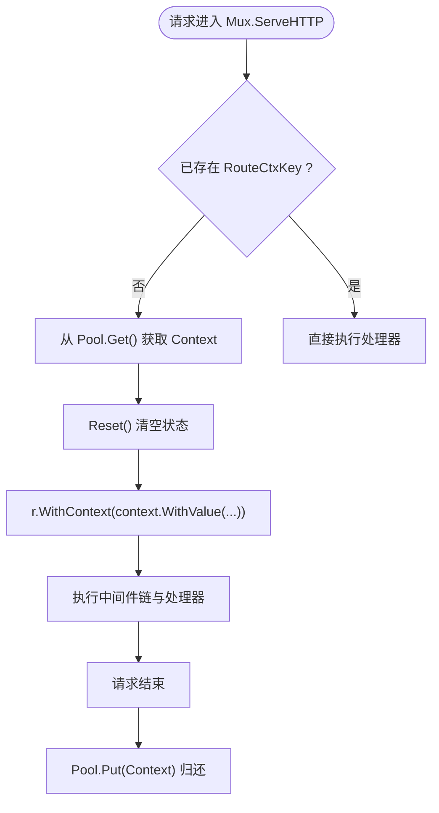
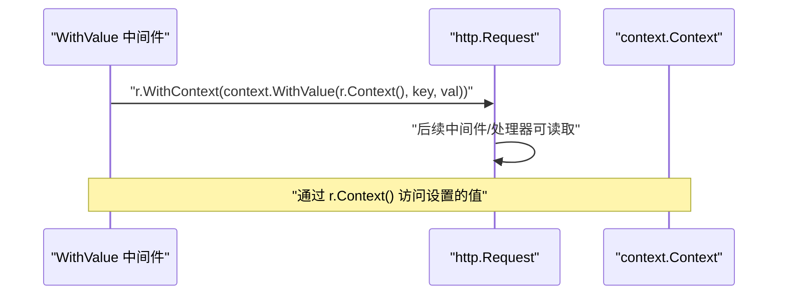
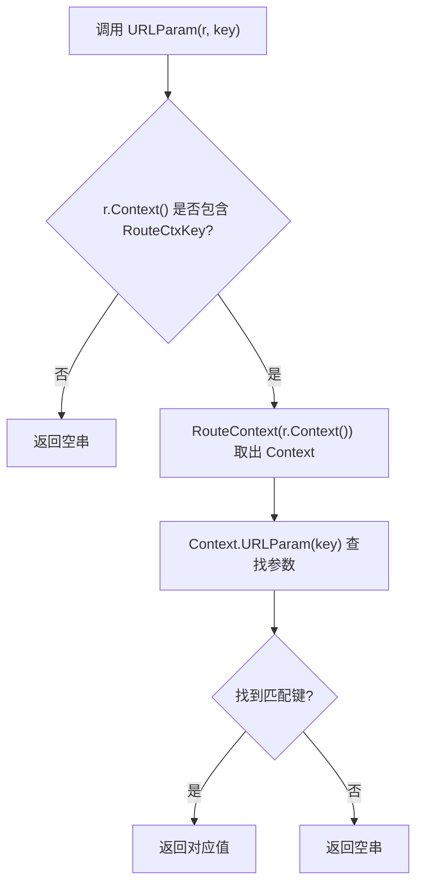
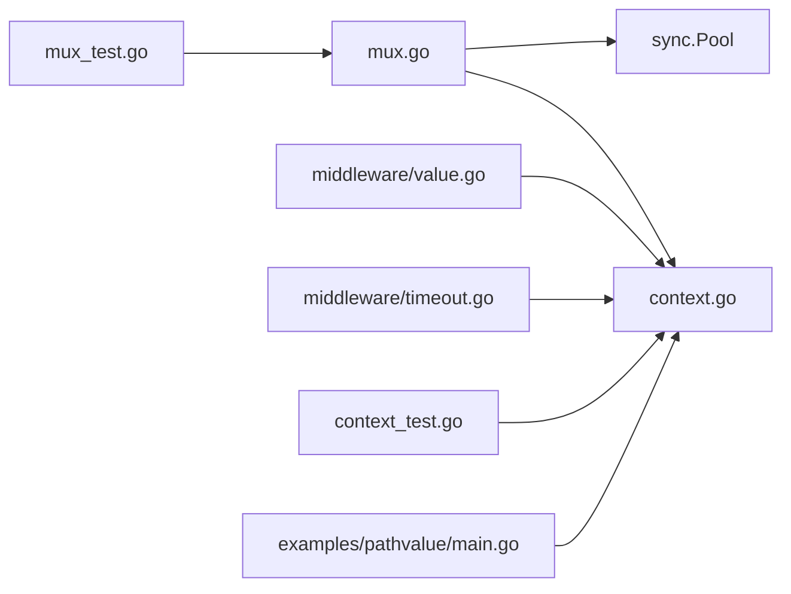

# 上下文管理

<cite>
**本文引用的文件**
- [context.go](file://context.go)
- [mux.go](file://mux.go)
- [middleware/value.go](file://middleware/value.go)
- [middleware/timeout.go](file://middleware/timeout.go)
- [middleware/middleware.go](file://middleware/middleware.go)
- [_examples/pathvalue/main.go](file://_examples/pathvalue/main.go)
- [README.md](file://README.md)
- [context_test.go](file://context_test.go)
- [mux_test.go](file://mux_test.go)
</cite>

## 目录
1. [引言](#引言)
2. [项目结构](#项目结构)
3. [核心组件](#核心组件)
4. [架构总览](#架构总览)
5. [详细组件分析](#详细组件分析)
6. [依赖关系分析](#依赖关系分析)
7. [性能考量](#性能考量)
8. [故障排查指南](#故障排查指南)
9. [结论](#结论)
10. [附录](#附录)

## 引言
本篇文档围绕chi框架如何利用Go 1.7+的context包实现请求上下文管理展开，重点解释：
- Context结构体的设计与职责：路由参数、请求范围值传递、路径与模式栈、方法限制信息等。
- 如何通过context安全地在中间件与处理器之间共享数据，避免使用全局变量。
- 路由参数的提取方式（URLParam、URLParamFromCtx）与内部实现原理。
- 超时控制与取消信号的传播（context.WithTimeout、r.WithContext）。
- 最佳实践：正确使用context.WithValue、避免内存泄漏、高并发下的性能考量。

## 项目结构
chi的上下文管理主要分布在以下模块：
- 核心上下文定义与工具：context.go
- 路由器与请求生命周期：mux.go
- 中间件：middleware/value.go、middleware/timeout.go
- 示例与测试：_examples/pathvalue/main.go、context_test.go、mux_test.go
- 文档与基准：README.md

图表来源
- [context.go](file://context.go#L9-L30)
- [mux.go](file://mux.go#L60-L92)
- [middleware/value.go](file://middleware/value.go#L8-L18)
- [middleware/timeout.go](file://middleware/timeout.go#L9-L49)
- [_examples/pathvalue/main.go](file://_examples/pathvalue/main.go#L19-L25)
- [context_test.go](file://context_test.go#L1-L105)

章节来源
- [context.go](file://context.go#L9-L30)
- [mux.go](file://mux.go#L60-L92)

## 核心组件
- Context：承载路由参数、当前匹配的路由模式栈、允许的方法列表、父级context等，用于在一次请求生命周期内跨中间件与处理器共享状态。
- RouteContext：从请求的context中取出Context对象；NewRouteContext用于创建新的上下文实例。
- URLParam/URLParamFromCtx：从请求或context中提取路由参数值。
- Mux：在每次请求开始时从sync.Pool获取Context，注入到请求的context中，并在请求结束时归还给Pool。
- 中间件WithValue：在中间件链中为请求的context设置键值对，供后续处理器读取。
- 中间件Timeout：基于context.WithTimeout为请求设置截止时间，若超时则返回网关超时。

章节来源
- [context.go](file://context.go#L9-L30)
- [context.go](file://context.go#L42-L107)
- [context.go](file://context.go#L146-L167)
- [mux.go](file://mux.go#L50-L92)
- [middleware/value.go](file://middleware/value.go#L8-L18)
- [middleware/timeout.go](file://middleware/timeout.go#L9-L49)

## 架构总览
下面的序列图展示了从请求进入路由器到处理器执行期间，Context如何贯穿整个调用链，并通过中间件进行值传递与超时控制。

图表来源
- [mux.go](file://mux.go#L60-L92)
- [middleware/value.go](file://middleware/value.go#L8-L18)
- [middleware/timeout.go](file://middleware/timeout.go#L33-L48)

## 详细组件分析

### Context结构体与路由参数提取
- 设计要点
  - Context嵌入parentCtx以作为context.Context直接使用，减少一次分配开销。
  - URLParams与routeParams分别记录“当前子路由器”和“累计栈式”的路由参数，确保在多级子路由中仍能正确获取最近一次匹配的参数。
  - RoutePatterns维护请求在多层子路由中的模式拼接，便于生成最终路由模式字符串。
  - methodsAllowed与methodNotAllowed用于405场景的处理。
- 参数提取
  - URLParam/URLParamFromCtx会先通过RouteContext从请求的context中取出Context，再在URLParams中按“后进先出”的顺序查找匹配键，从而优先返回最近匹配的参数值。
- 模式构建
  - RoutePattern会将RoutePatterns拼接后，对“/*”进行折叠处理，去除中间通配符，保留尾部通配符，保证输出的模式字符串语义正确。

图表来源
- [context.go](file://context.go#L42-L107)
- [context.go](file://context.go#L146-L167)

章节来源
- [context.go](file://context.go#L42-L107)
- [context.go](file://context.go#L109-L145)
- [context_test.go](file://context_test.go#L1-L105)

### 路由器如何注入与复用Context
- 注入时机
  - 在Mux.ServeHTTP中，如果当前请求的context中不存在RouteCtxKey，则从sync.Pool获取一个Context，Reset后将其与父级context一起通过context.WithValue注入到请求中。
- 复用策略
  - 使用sync.Pool避免频繁分配Context，提升高并发下的性能。
- 生命周期
  - 请求结束后，将Context归还到Pool，等待下一次请求复用。

图表来源
- [mux.go](file://mux.go#L60-L92)

章节来源
- [mux.go](file://mux.go#L50-L92)

### 中间件与处理器之间的值传递
- WithValue中间件
  - 在中间件中通过context.WithValue为请求的context设置键值对，随后通过r.WithContext将新context写回请求，供后续中间件与处理器读取。
- Timeout中间件
  - 基于context.WithTimeout为请求创建带截止时间的context，并在defer中取消，若ctx.Err()为DeadlineExceeded则返回504。
- 处理器读取
  - 处理器通过r.Context()读取中间件设置的值，或通过URLParam等工具读取路由参数。

图表来源
- [middleware/value.go](file://middleware/value.go#L8-L18)
- [middleware/timeout.go](file://middleware/timeout.go#L33-L48)

章节来源
- [middleware/value.go](file://middleware/value.go#L8-L18)
- [middleware/timeout.go](file://middleware/timeout.go#L9-L49)
- [mux_test.go](file://mux_test.go#L1-L120)

### 路由参数提取工具：URLParam与URLParamFromCtx
- URLParam(r, key)：从请求中提取路由参数。
- URLParamFromCtx(ctx, key)：从context中提取路由参数。
- 实现逻辑：先通过RouteContext(ctx)获取Context，再在URLParams中按键查找最近一次匹配的值。

图表来源
- [context.go](file://context.go#L9-L23)

章节来源
- [context.go](file://context.go#L9-L23)

### 子路由与通配符参数的处理
- Mount子路由时，会重置“连接子路由的通配符参数”，并将RoutePath更新为子路由的起始路径，确保后续子路由匹配正确。
- 在多级子路由中，Context的URLParams与RoutePatterns会累积，最终通过RoutePattern组合出完整模式。

章节来源
- [mux.go](file://mux.go#L309-L340)
- [context.go](file://context.go#L109-L145)

## 依赖关系分析
- Mux依赖context与sync.Pool，负责请求上下文的注入与复用。
- Context依赖contextKey作为唯一键，避免重复分配。
- 中间件WithValue与Timeout依赖标准库context，分别提供值传递与超时控制能力。
- 测试覆盖了参数提取、模式拼接、线程安全与基准性能。

图表来源
- [mux.go](file://mux.go#L1-L92)
- [context.go](file://context.go#L1-L167)
- [middleware/value.go](file://middleware/value.go#L1-L18)
- [middleware/timeout.go](file://middleware/timeout.go#L1-L49)
- [context_test.go](file://context_test.go#L1-L105)
- [mux_test.go](file://mux_test.go#L1-L120)
- [_examples/pathvalue/main.go](file://_examples/pathvalue/main.go#L1-L26)

章节来源
- [mux.go](file://mux.go#L1-L92)
- [context.go](file://context.go#L1-L167)
- [middleware/value.go](file://middleware/value.go#L1-L18)
- [middleware/timeout.go](file://middleware/timeout.go#L1-L49)
- [context_test.go](file://context_test.go#L1-L105)
- [mux_test.go](file://mux_test.go#L1-L120)
- [_examples/pathvalue/main.go](file://_examples/pathvalue/main.go#L1-L26)

## 性能考量
- Context复用：通过sync.Pool在请求间复用Context，减少分配与GC压力。
- 请求克隆成本：README指出，设置context到http.Request会触发请求克隆，这是Go标准库行为，属于正常开销。
- 中间件链长度：中间件越多，context传递链越长，建议按需组合中间件，避免冗余。
- 避免不必要的context.WithValue：仅在必要时设置请求级值，减少context负载。

章节来源
- [mux.go](file://mux.go#L50-L92)
- [README.md](file://README.md#L464-L468)

## 故障排查指南
- 路由参数为空
  - 确认URLParam/URLParamFromCtx调用前，请求的context中已注入Context（通常由Mux自动完成）。
  - 检查是否在子路由中被重置或覆盖。
- 模式字符串异常
  - 确认RoutePattern调用时机：应在调用next之后读取，避免早期值不完整。
  - 检查是否存在多个连续通配符导致的折叠逻辑影响。
- 超时未生效
  - 确认处理器是否select监听r.Context().Done()并在超时后及时返回。
  - 确认Timeout中间件位于需要超时保护的处理器之前。
- 内存泄漏风险
  - 不要在context中存放大型对象或不可回收资源；必要时在defer中清理。
  - 避免在中间件中无限制地累积context值，防止长期持有。

章节来源
- [context.go](file://context.go#L109-L145)
- [middleware/timeout.go](file://middleware/timeout.go#L33-L48)
- [context_test.go](file://context_test.go#L1-L105)
- [mux_test.go](file://mux_test.go#L1-L120)

## 结论
chi通过在请求生命周期内注入并复用Context，实现了路由参数、模式栈与方法限制等状态的统一管理；配合中间件WithValue与Timeout，提供了安全且高效的请求级值传递与超时控制能力。遵循本文的最佳实践，可在高并发场景下获得更优的性能与更低的内存占用。

## 附录
- 示例：使用PathValue读取参数
  - 参考示例文件路径：[_examples/pathvalue/main.go](file://_examples/pathvalue/main.go#L19-L25)
- 文档：context简介与基准
  - 参考文档路径：[README.md](file://README.md#L424-L430)、[README.md](file://README.md#L464-L468)