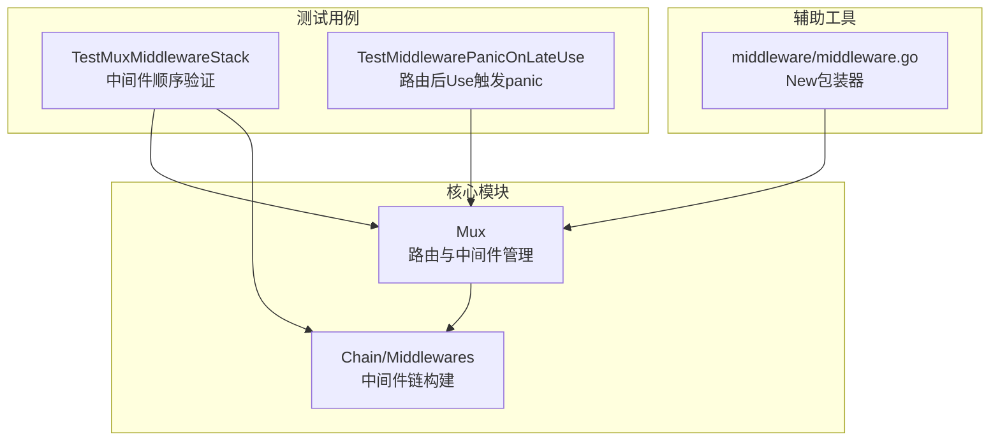
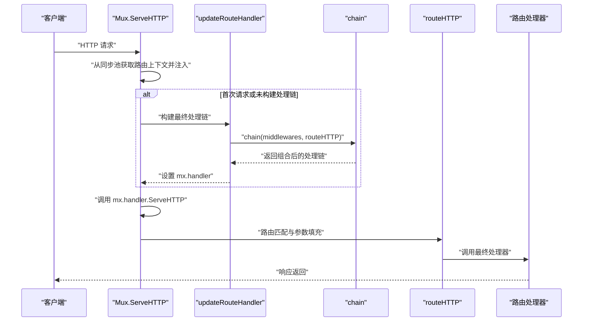
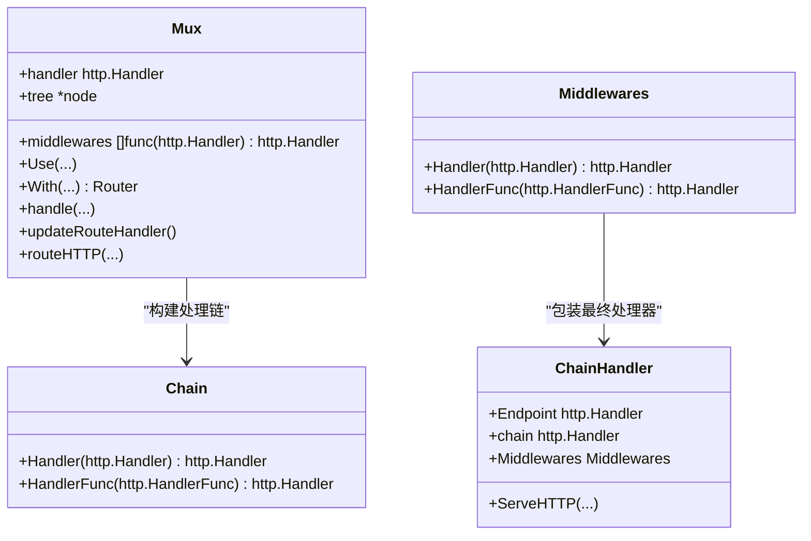

# 中间件执行流程

<cite>
**本文引用的文件列表**
- [mux.go](file://mux.go)
- [chain.go](file://chain.go)
- [mux_test.go](file://mux_test.go)
- [middleware/middleware.go](file://middleware/middleware.go)
</cite>

## 目录
1. [简介](#简介)
2. [项目结构与定位](#项目结构与定位)
3. [核心组件：Mux、中间件栈与处理链](#核心组件mux中间件栈与处理链)
4. [架构总览](#架构总览)
5. [关键流程详解](#关键流程详解)
6. [依赖关系与耦合分析](#依赖关系与耦合分析)
7. [性能与并发特性](#性能与并发特性)
8. [调试与排障指南](#调试与排障指南)
9. [结论](#结论)

## 简介
本文件围绕 chi 框架的中间件执行流程与生命周期管理展开，重点解释：
- Mux 结构体的 middlewares 字段如何承载全局中间件栈
- Use 方法如何在路由前注册中间件
- With 方法如何为特定路由组添加中间件
- mux.go 的 updateRouteHandler 如何调用 chain 构建最终处理链
- 通过 mux_test.go 的 TestMuxMiddlewareStack 展示中间件初始化与处理函数的调用顺序
- 当开发者在路由定义后再调用 Use 触发 panic 的机制（参考 TestMiddlewarePanicOnLateUse）
- 调试技巧：使用日志中间件跟踪请求流经的中间件顺序

## 项目结构与定位
- mux.go 定义了 Mux 核心类型与路由、中间件、子路由等能力
- chain.go 提供中间件链式组合工具（Chain、Middlewares、chain 函数）
- mux_test.go 包含大量中间件行为验证用例，包括中间件顺序、分组中间件、panic 场景等
- middleware/middleware.go 提供通用中间件包装工具（New），便于将任意 http.Handler 包装为中间件

图表来源
- [mux.go](file://mux.go#L1-L120)
- [chain.go](file://chain.go#L1-L50)
- [mux_test.go](file://mux_test.go#L754-L827)
- [mux_test.go](file://mux_test.go#L1448-L1468)
- [middleware/middleware.go](file://middleware/middleware.go#L1-L24)

章节来源
- [mux.go](file://mux.go#L1-L120)
- [chain.go](file://chain.go#L1-L50)
- [mux_test.go](file://mux_test.go#L754-L827)
- [mux_test.go](file://mux_test.go#L1448-L1468)
- [middleware/middleware.go](file://middleware/middleware.go#L1-L24)

## 核心组件：Mux、中间件栈与处理链
- Mux 结构体包含：
  - handler：已构建的最终处理链（由中间件链 + 路由树组成）
  - tree：路由树节点
  - middlewares：全局中间件栈
  - inline：标记是否为内联组（With/Group 创建）
- 中间件以“函数式”形式注入，每个中间件接收下一个 http.Handler 并返回新的 http.Handler
- 处理链通过 chain 函数自右向左包裹，形成洋葱模型

章节来源
- [mux.go](file://mux.go#L21-L48)
- [chain.go](file://chain.go#L34-L50)

## 架构总览
下图展示了请求从进入 Mux 到最终到达路由处理器的完整路径，以及中间件链的构建与执行时机。

图表来源
- [mux.go](file://mux.go#L63-L92)
- [mux.go](file://mux.go#L509-L516)
- [mux.go](file://mux.go#L439-L487)
- [chain.go](file://chain.go#L34-L50)

## 关键流程详解

### 1) Use 方法：在路由前注册中间件
- 作用：将中间件追加到 Mux.middlewares
- 限制：一旦 mx.handler 已存在（即已构建过处理链），再次调用 Use 将触发 panic，确保中间件必须在路由定义之前注册
- 设计意图：保证中间件链在路由注册阶段就固定，避免运行期动态变更带来的不确定性

章节来源
- [mux.go](file://mux.go#L94-L105)

### 2) With 方法：为特定路由组添加中间件
- 作用：创建一个“内联 Mux”，复制父级中间件栈，并在其上追加额外中间件
- 行为：
  - 若当前 Mux 未内联且尚未构建处理链，则先构建一次
  - 复制父级 middlewares，再追加传入的中间件
  - 返回一个新的 Mux（inline=true），用于后续路由注册
- 适用场景：对某一段路径下的路由统一增加鉴权、限流、日志等中间件

章节来源
- [mux.go](file://mux.go#L235-L257)

### 3) updateRouteHandler：构建最终处理链
- 时机：当首次注册路由或使用 With 时，若尚未构建处理链，则调用该方法
- 实现：通过 chain(middlewares, routeHTTP) 将所有中间件按顺序包裹到路由处理器上
- 结果：mx.handler 成为一个完整的处理链，后续请求直接走该 handler

章节来源
- [mux.go](file://mux.go#L509-L516)
- [chain.go](file://chain.go#L34-L50)

### 4) handle：路由注册与内联中间件处理
- 在 handle 内部：
  - 若非内联且尚未构建处理链，先构建
  - 若当前是内联 Mux，则使用 Chain(middlewares...) 包裹单个路由处理器
  - 将路由节点插入树中
- 这保证了“根级全局中间件”与“内联组中间件”的分别生效

章节来源
- [mux.go](file://mux.go#L414-L437)

### 5) routeHTTP：路由匹配与执行
- 从请求上下文中读取方法与路径
- 在路由树中查找匹配节点，设置 URL 参数到请求对象
- 调用匹配到的处理器（可能是内联组的链式处理器）

章节来源
- [mux.go](file://mux.go#L439-L487)

### 6) 测试用例：中间件初始化与处理顺序
- TestMuxMiddlewareStack 展示：
  - 全局中间件在路由前注册
  - 内联中间件通过 With 注册，仅影响该组路由
  - 通过上下文值与计数器验证中间件初始化与每次请求处理的调用次数
- 该用例清晰体现了“洋葱模型”的执行顺序：外层中间件先初始化，请求到来时外层先执行，内层后执行；返回时则相反

章节来源
- [mux_test.go](file://mux_test.go#L754-L827)

### 7) 测试用例：路由后 Use 触发 panic
- TestMiddlewarePanicOnLateUse 展示：
  - 先注册路由，再调用 Use，会触发 panic
  - 目的是强制开发者在路由定义前完成中间件注册，避免运行期状态不一致

章节来源
- [mux_test.go](file://mux_test.go#L1448-L1468)

## 依赖关系与耦合分析
- Mux 对 chain 的依赖：
  - 通过 chain 将中间件与路由处理器组合
  - 通过 Chain/Middlewares 提供的 Handler/HandlerFunc 可在 With 内联组中快速构建链
- Mux 对路由树的依赖：
  - 路由注册与匹配均依赖 tree
- With 与 Group 的关系：
  - Group 是 With 的特化封装，便于批量注册同一组路由并共享中间件
- panic 触发点：
  - Use 在 mx.handler 非空时触发，防止中间件在路由之后注册

图表来源
- [mux.go](file://mux.go#L94-L105)
- [mux.go](file://mux.go#L235-L257)
- [mux.go](file://mux.go#L414-L437)
- [mux.go](file://mux.go#L509-L516)
- [chain.go](file://chain.go#L10-L33)
- [chain.go](file://chain.go#L34-L50)

## 性能与并发特性
- 同步池复用路由上下文，减少每次请求的分配开销
- 中间件链在首次注册路由或 With 时一次性构建，后续请求直接复用
- 内联组中间件仅在该组内生效，避免不必要的全局链路开销

章节来源
- [mux.go](file://mux.go#L52-L60)
- [mux.go](file://mux.go#L509-L516)

## 调试与排障指南

### 使用日志中间件追踪中间件顺序
- 建议在开发环境引入日志中间件，记录进入与退出的关键节点
- 可以通过 context 传递请求标识（如 request-id），便于串联一次请求在各中间件中的执行轨迹
- middleware/middleware.go 提供的 New 可将任意 http.Handler 包装为中间件，便于快速接入日志器

章节来源
- [middleware/middleware.go](file://middleware/middleware.go#L1-L24)

### 常见问题与排查
- 路由后注册中间件导致 panic
  - 现象：先注册路由，再调用 Use，触发 panic
  - 解决：将 Use 放在所有路由注册之前
  - 参考测试：TestMiddlewarePanicOnLateUse
- 内联组中间件只影响该组
  - 现象：通过 With 注册的中间件不会影响其他路由组
  - 解决：在需要的组内使用 With 或 Group
  - 参考测试：TestMuxMiddlewareStack、TestMuxRouteGroups

章节来源
- [mux_test.go](file://mux_test.go#L754-L827)
- [mux_test.go](file://mux_test.go#L829-L883)
- [mux_test.go](file://mux_test.go#L1448-L1468)

## 结论
- chi 的中间件体系采用“先注册、后构建”的设计，确保中间件链在路由注册阶段就固定，从而获得可预测的执行顺序与良好的性能
- Use 保证全局中间件在路由前注册；With/Group 提供内联组中间件，实现局部中间件叠加
- updateRouteHandler 与 chain 协作，将中间件与路由处理器组合成最终处理链
- 通过 mux_test.go 的多个测试用例，可以验证中间件初始化与处理顺序、内联组中间件的作用范围，以及路由后注册中间件的 panic 保护机制
- 调试建议：使用日志中间件与 request-id 上下文，结合测试用例思路，快速定位中间件执行顺序与异常