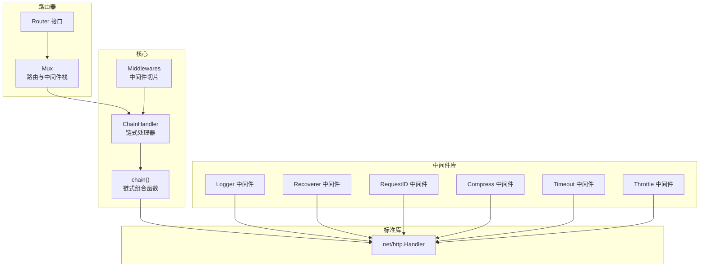
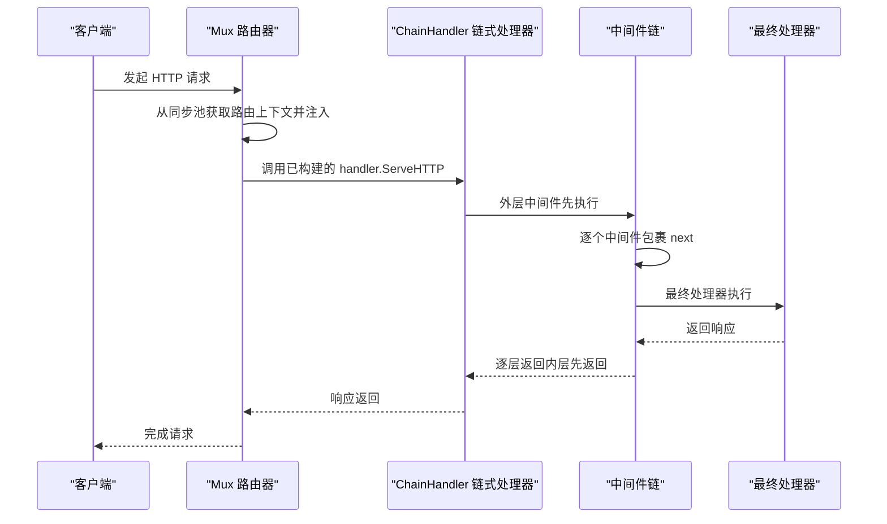
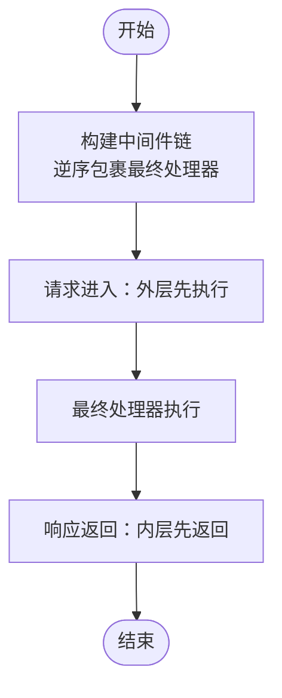
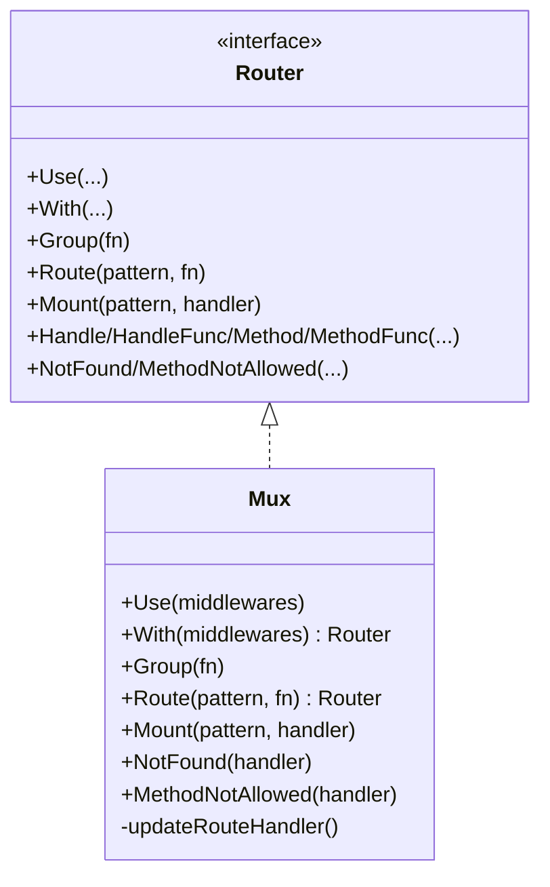
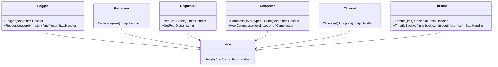
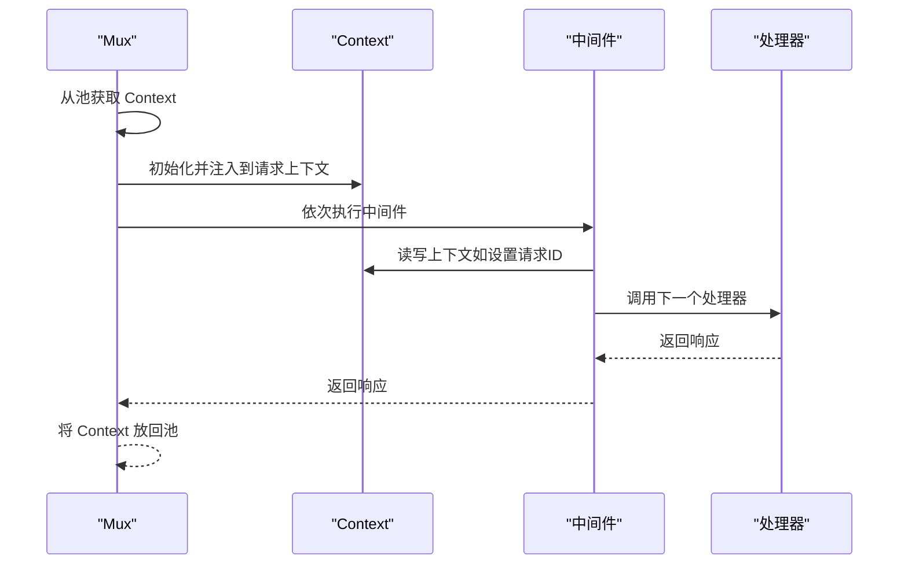
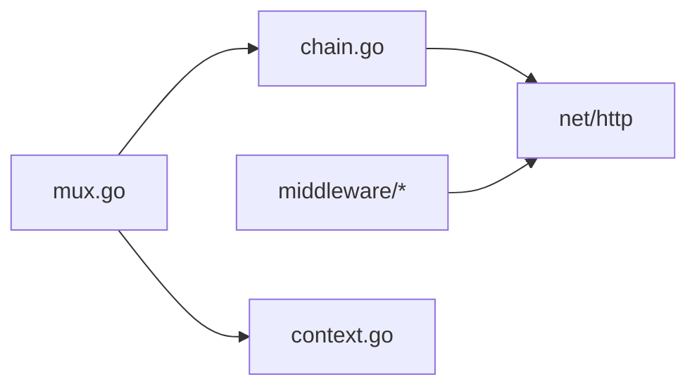

# 中间件架构

<cite>
**本文引用的文件列表**
- [chain.go](file://chain.go)
- [chi.go](file://chi.go)
- [mux.go](file://mux.go)
- [context.go](file://context.go)
- [middleware/middleware.go](file://middleware/middleware.go)
- [middleware/logger.go](file://middleware/logger.go)
- [middleware/recoverer.go](file://middleware/recoverer.go)
- [middleware/request_id.go](file://middleware/request_id.go)
- [middleware/compress.go](file://middleware/compress.go)
- [middleware/timeout.go](file://middleware/timeout.go)
- [middleware/throttle.go](file://middleware/throttle.go)
- [_examples/limits/main.go](file://_examples/limits/main.go)
</cite>

## 目录
1. [引言](#引言)
2. [项目结构](#项目结构)
3. [核心组件](#核心组件)
4. [架构总览](#架构总览)
5. [详细组件分析](#详细组件分析)
6. [依赖关系分析](#依赖关系分析)
7. [性能考量](#性能考量)
8. [故障排查指南](#故障排查指南)
9. [结论](#结论)
10. [附录](#附录)

## 引言
本文件系统性解析 chi 框架的中间件系统设计原理，重点围绕中间件链（middleware chain）的组合模式展开，解释如何通过 Use、With 等方法构建可复用的功能堆栈；深入分析 chain.go 中中间件链的执行流程，包括请求前处理与响应后处理机制；阐述中间件与标准 net/http.Handler 的无缝集成，使任何兼容 net/http 的中间件均可在 chi 中使用；并通过实际示例展示中间件的编写方法，涵盖状态传递、错误处理与短路控制；最后说明中间件在请求生命周期中的执行顺序及其对性能的影响。

## 项目结构
chi 的中间件体系由以下关键模块构成：
- 路由器与中间件栈：Mux 实现 Router 接口，维护全局中间件栈，并提供 Use、With、Group、Route、Mount 等路由与中间件组合能力。
- 中间件链构建：chain.go 提供 Chain、Middlewares、ChainHandler 以及底层 chain 函数，负责将多个中间件按指定顺序组合为单一 http.Handler。
- 标准中间件库：middleware 包提供日志、恢复、请求 ID、压缩、超时、节流等常用中间件，均遵循 func(http.Handler) http.Handler 的签名。
- 请求上下文：context.go 定义路由上下文与参数容器，贯穿请求生命周期，支持中间件与处理器之间的状态传递。

图表来源
- [chain.go](file://chain.go#L1-L50)
- [mux.go](file://mux.go#L1-L120)
- [context.go](file://context.go#L1-L120)
- [middleware/logger.go](file://middleware/logger.go#L1-L60)
- [middleware/recoverer.go](file://middleware/recoverer.go#L1-L50)
- [middleware/request_id.go](file://middleware/request_id.go#L1-L80)
- [middleware/compress.go](file://middleware/compress.go#L1-L120)
- [middleware/timeout.go](file://middleware/timeout.go#L1-L49)
- [middleware/throttle.go](file://middleware/throttle.go#L1-L152)

章节来源
- [chain.go](file://chain.go#L1-L50)
- [mux.go](file://mux.go#L1-L120)
- [context.go](file://context.go#L1-L120)

## 核心组件
- 中间件链与组合
  - Chain 将若干中间件函数转换为 Middlewares 切片，便于统一管理与组合。
  - Middlewares 提供 Handler 和 HandlerFunc 方法，分别将最终处理器封装进中间件链。
  - ChainHandler 是一个实现了 http.Handler 的包装器，内部持有 Endpoint、chain 与 Middlewares 字段，ServeHTTP 直接委托给 chain。
  - chain 函数以逆序包裹最终处理器，形成“外层先执行，内层后执行”的洋葱模型。
- 路由器与中间件栈
  - Router 接口定义了 Use、With、Group、Route、Mount 等方法，用于注册与组合中间件。
  - Mux 维护全局 middlewares 切片，并在首次路由注册或处理请求前构建 handler（即中间件链 + 路由器自身）。
  - With 返回一个新的内联 Mux，允许在特定路由组上叠加中间件，形成局部中间件栈。
- 标准中间件
  - middleware.New 可将任意 http.Handler 包装为中间件。
  - logger、recoverer、request_id、compress、timeout、throttle 等中间件遵循统一签名，可直接传入 Use 或 With。

章节来源
- [chain.go](file://chain.go#L1-L50)
- [chi.go](file://chi.go#L60-L138)
- [mux.go](file://mux.go#L90-L170)
- [middleware/middleware.go](file://middleware/middleware.go#L1-L24)

## 架构总览
下图展示了从请求进入路由器到最终处理器执行的完整链路，以及中间件在其中的执行顺序与职责划分。

图表来源
- [mux.go](file://mux.go#L60-L120)
- [chain.go](file://chain.go#L10-L32)

章节来源
- [mux.go](file://mux.go#L60-L120)
- [chain.go](file://chain.go#L10-L32)

## 详细组件分析

### 中间件链与组合模式（chain.go）
- 组合模式要点
  - Chain 将多个中间件函数聚合成 Middlewares 切片，便于后续统一组合。
  - Middlewares.Handler/HandlerFunc 将最终处理器 h 与中间件链组合，返回新的 http.Handler。
  - ChainHandler 仅保存 Endpoint、chain 与 Middlewares，ServeHTTP 直接调用 chain，简化调用路径。
  - chain 函数采用逆序包裹策略：h = middlewares[n-1](middlewares[n-2](...middlewares[0](endpoint)...))，确保外层中间件先于内层执行。
- 执行顺序
  - 请求进入：外层中间件最先执行，最后到达最终处理器。
  - 响应返回：最终处理器先返回，然后逐层向外层中间件返回，实现“请求前处理 + 响应后处理”的完整生命周期。
- 性能特征
  - 组合过程发生在路由注册阶段或首次请求前，运行时仅一次链式封装，后续请求直接走链式 handler，开销极低。
  - 逆序包裹避免了递归深度过大，且链式组合为 O(n) 时间复杂度。

图表来源
- [chain.go](file://chain.go#L34-L49)

章节来源
- [chain.go](file://chain.go#L1-L50)

### 路由器与中间件栈（mux.go）
- Use 与中间件注册
  - Use 在 handler 未生成前追加中间件；一旦 handler 已存在则禁止再注册中间件，防止中间件链不一致。
  - 中间件栈在首次 handle 或 ServeHTTP 时构建，形成“中间件链 + 路由器”的单一处理器。
- With 与 Group
  - With 返回内联 Mux，复制父级中间件栈并在其基础上追加新中间件，形成局部中间件堆栈。
  - Group 是 With 的便捷封装，适合对同一路径下的多条路由共享一组中间件。
- Route 与 Mount
  - Route 用于挂载子路由器，Mount 将另一个 http.Handler 或 Router 挂载到某路径，支持子路由的 NotFound/MethodNotAllowed 继承。
- NotFound 与 MethodNotAllowed
  - NotFound/MethodNotAllowed 支持在内联场景下将父级中间件链应用到自定义处理器，保证错误处理也经过中间件栈。

图表来源
- [mux.go](file://mux.go#L90-L260)
- [chi.go](file://chi.go#L60-L138)

章节来源
- [mux.go](file://mux.go#L90-L260)
- [chi.go](file://chi.go#L60-L138)

### 标准中间件与 net/http 集成
- 中间件签名一致性
  - 所有中间件遵循 func(http.Handler) http.Handler，可直接传入 Use 或 With。
  - middleware.New 可将任意 http.Handler 包装为中间件，实现与标准库的无缝衔接。
- 典型中间件示例
  - Logger：记录请求开始与结束、状态码、耗时等信息，支持写入器包装以统计字节数。
  - Recoverer：捕获 panic 并输出堆栈，必要时返回 500。
  - RequestID：为请求注入唯一 ID，便于跨服务追踪。
  - Compress：根据 Accept-Encoding 选择编码器，动态压缩响应体。
  - Timeout：基于 context.WithTimeout 设置截止时间，超时返回 504。
  - Throttle：限制并发请求数与回压队列长度，超限时返回 429/504。

图表来源
- [middleware/logger.go](file://middleware/logger.go#L1-L120)
- [middleware/recoverer.go](file://middleware/recoverer.go#L1-L60)
- [middleware/request_id.go](file://middleware/request_id.go#L1-L90)
- [middleware/compress.go](file://middleware/compress.go#L1-L120)
- [middleware/timeout.go](file://middleware/timeout.go#L1-L49)
- [middleware/throttle.go](file://middleware/throttle.go#L1-L152)
- [middleware/middleware.go](file://middleware/middleware.go#L1-L24)

章节来源
- [middleware/logger.go](file://middleware/logger.go#L1-L173)
- [middleware/recoverer.go](file://middleware/recoverer.go#L1-L204)
- [middleware/request_id.go](file://middleware/request_id.go#L1-L97)
- [middleware/compress.go](file://middleware/compress.go#L1-L393)
- [middleware/timeout.go](file://middleware/timeout.go#L1-L49)
- [middleware/throttle.go](file://middleware/throttle.go#L1-L152)
- [middleware/middleware.go](file://middleware/middleware.go#L1-L24)

### 请求生命周期与状态传递（context.go）
- 路由上下文
  - Mux 在每次请求时从同步池获取 Context，并通过 WithContext 注入到请求上下文中。
  - Context 记录 RoutePath、RouteMethod、URLParams、RoutePatterns 等路由相关信息，支持跨子路由累积。
- 中间件与处理器的状态传递
  - 中间件可在请求上下文中设置键值（如 RequestID、LogEntry），处理器读取这些值进行业务处理或指标上报。
  - 上下文在请求结束后被放回池中，减少分配开销。

图表来源
- [mux.go](file://mux.go#L60-L120)
- [context.go](file://context.go#L1-L120)

章节来源
- [mux.go](file://mux.go#L60-L120)
- [context.go](file://context.go#L1-L120)

### 实际使用示例与最佳实践
- 示例程序
  - _examples/limits/main.go 展示了如何在根路由上注册 RequestID、Logger、Recoverer，在分组路由上叠加 Timeout 与 Throttle，演示了中间件链在不同作用域内的组合效果。
- 编写中间件的建议
  - 使用 func(http.Handler) http.Handler 签名，确保与标准库兼容。
  - 在请求前处理：读取/写入上下文、设置响应头、短路返回。
  - 在响应后处理：统计耗时、记录日志、清理资源。
  - 错误处理：优先捕获 panic（Recoverer），其次处理业务异常并设置合适的状态码。
  - 短路控制：当满足条件时直接返回，不再调用 next.ServeHTTP。
- 中间件顺序的重要性
  - Logger 应位于 Recoverer 之前，以便在恢复后仍能记录请求结果。
  - RequestID 通常放在日志之前，便于日志关联。
  - Timeout/Throttle 等限流中间件应靠近处理器，确保及时取消或拒绝请求。

章节来源
- [_examples/limits/main.go](file://_examples/limits/main.go#L1-L93)
- [middleware/logger.go](file://middleware/logger.go#L1-L60)
- [middleware/recoverer.go](file://middleware/recoverer.go#L1-L50)
- [middleware/request_id.go](file://middleware/request_id.go#L1-L80)
- [middleware/timeout.go](file://middleware/timeout.go#L1-L49)
- [middleware/throttle.go](file://middleware/throttle.go#L1-L152)

## 依赖关系分析
- 组件耦合
  - Mux 与 chain.go 紧密协作：Mux 在 handle 或 ServeHTTP 时构建 handler，底层依赖 chain 函数完成中间件链组合。
  - ChainHandler 作为桥接层，将中间件链与最终处理器解耦，便于统一管理。
  - 中间件库与标准库强耦合：所有中间件遵循统一签名，天然兼容 net/http。
- 外部依赖
  - 标准库 net/http、context、sync.Pool 等。
  - 日志与压缩中间件依赖相应标准库功能。

图表来源
- [mux.go](file://mux.go#L1-L120)
- [chain.go](file://chain.go#L1-L50)
- [context.go](file://context.go#L1-L120)

章节来源
- [mux.go](file://mux.go#L1-L120)
- [chain.go](file://chain.go#L1-L50)
- [context.go](file://context.go#L1-L120)

## 性能考量
- 中间件链构建成本
  - 构建发生在路由注册阶段或首次请求前，运行时仅一次链式封装，后续请求直接复用链式处理器，开销极低。
- 中间件数量与顺序
  - 中间件越多，请求前处理与响应后处理的总耗时越高；应按需裁剪中间件，避免冗余。
  - 将高频短路中间件（如限流、鉴权）置于链前端，尽早失败可显著降低下游压力。
- 内存与上下文
  - 使用 sync.Pool 复用 Context，减少分配；中间件尽量避免在上下文中存储大对象。
- I/O 与压缩
  - Compress 中间件会引入额外的 I/O 与 CPU 开销，应合理配置压缩级别与内容类型白名单。

[本节为通用性能指导，无需列出具体文件来源]

## 故障排查指南
- 中间件注册时机错误
  - 若在已注册路由之后再调用 Use，Mux 会抛出异常，提示必须在路由注册前定义中间件。
- 中断与超时
  - Timeout 中间件通过 context.WithTimeout 触发截止时间，若处理器未监听 r.Context().Done()，将无法及时中断。
  - Throttle 在容量不足或等待超时时返回相应状态码，可通过 Retry-After 头提示重试策略。
- 错误恢复
  - Recoverer 会在 panic 时记录堆栈并返回 500（除非连接升级），建议配合 Logger 与 RequestID 追踪问题。
- 压缩相关问题
  - 若未设置 Content-Type，Compress 不会压缩响应体；同时注意 Content-Encoding 已存在的场景。

章节来源
- [mux.go](file://mux.go#L90-L120)
- [middleware/timeout.go](file://middleware/timeout.go#L1-L49)
- [middleware/throttle.go](file://middleware/throttle.go#L1-L152)
- [middleware/recoverer.go](file://middleware/recoverer.go#L1-L60)
- [middleware/compress.go](file://middleware/compress.go#L1-L120)

## 结论
chi 的中间件系统以组合模式为核心，通过 Chain 与 Middlewares 将多个中间件按洋葱模型串联，实现请求前处理与响应后处理的完整生命周期。Mux 提供 Use、With、Group、Route、Mount 等能力，使中间件栈既可全局生效，也可按路由组局部叠加。中间件与 net/http 的无缝集成，使得任何兼容标准库的中间件均可直接使用。通过合理的中间件顺序与裁剪，可在保证可观测性与稳定性的同时，最大化系统性能。

[本节为总结性内容，无需列出具体文件来源]

## 附录
- 关键接口与类型
  - Router：定义中间件与路由的核心接口。
  - Middlewares：中间件切片类型，提供链式组合方法。
  - ChainHandler：链式处理器包装器。
  - Context：路由上下文，承载请求期间的路由信息与参数。
- 常用中间件清单
  - 日志：Logger、RequestLogger
  - 恢复：Recoverer
  - 请求 ID：RequestID
  - 压缩：Compress
  - 超时：Timeout
  - 节流：Throttle、ThrottleBacklog

[本节为概览性内容，无需列出具体文件来源]