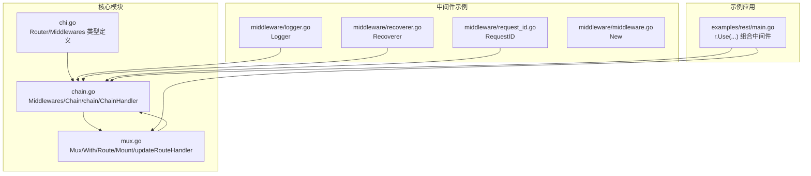
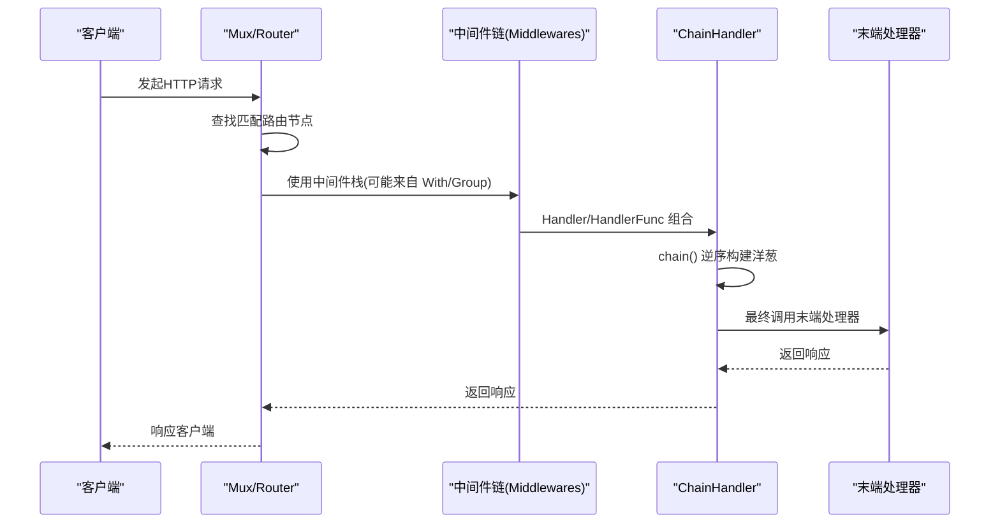
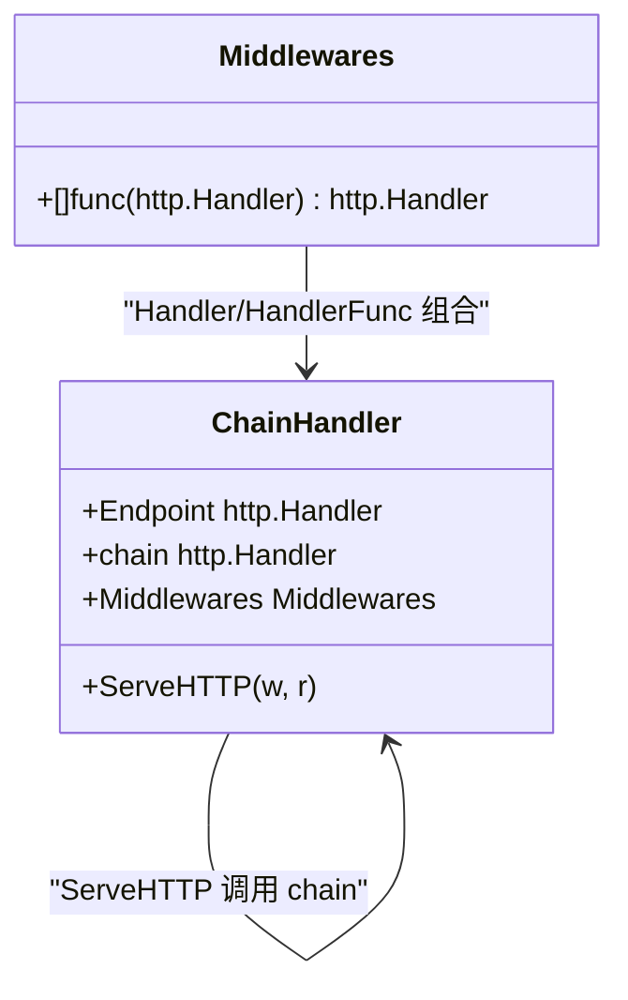
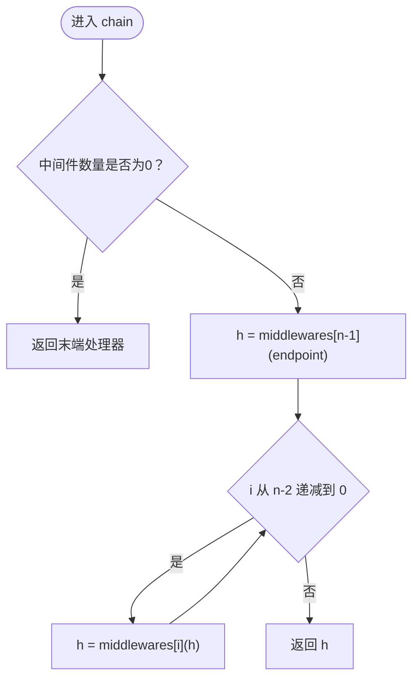
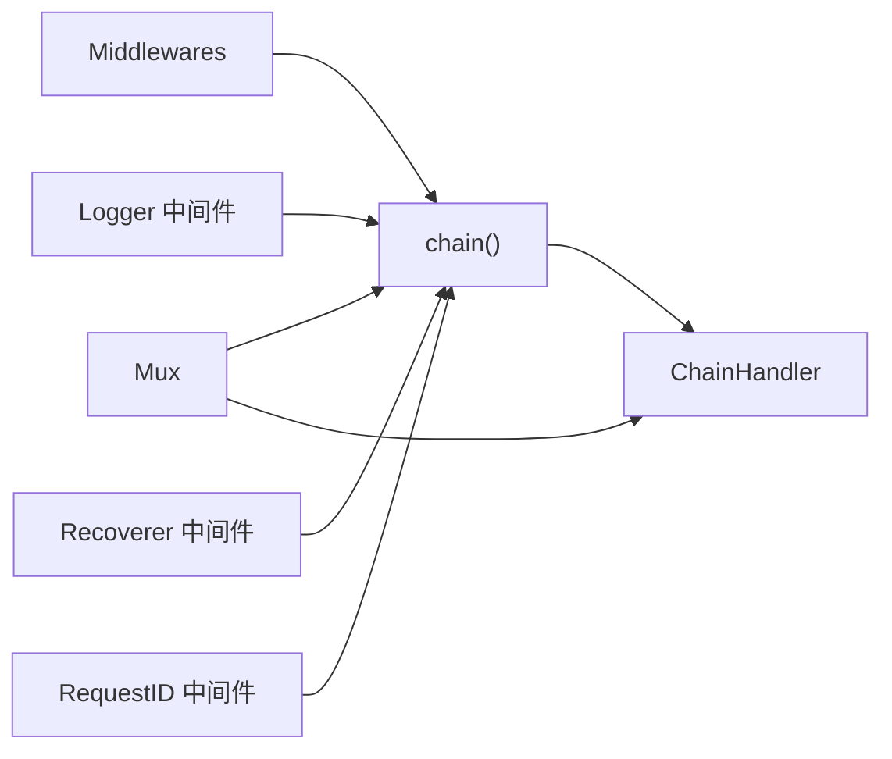

# 中间件组合模式

<cite>
**本文引用的文件列表**
- [chain.go](file://chain.go)
- [chi.go](file://chi.go)
- [mux.go](file://mux.go)
- [middleware/logger.go](file://middleware/logger.go)
- [middleware/recoverer.go](file://middleware/recoverer.go)
- [middleware/request_id.go](file://middleware/request_id.go)
- [middleware/middleware.go](file://middleware/middleware.go)
- [_examples/rest/main.go](file://_examples/rest/main.go)
</cite>

## 目录
1. [引言](#引言)
2. [项目结构与定位](#项目结构与定位)
3. [核心组件](#核心组件)
4. [架构总览](#架构总览)
5. [详细组件分析](#详细组件分析)
6. [依赖关系分析](#依赖关系分析)
7. [性能考量](#性能考量)
8. [故障排查指南](#故障排查指南)
9. [结论](#结论)

## 引言
本篇文档聚焦于 chi 框架中的“中间件组合模式”，系统性解析 Middlewares 类型如何通过 Handler 和 HandlerFunc 将多个中间件函数组合为单一的 http.Handler；深入剖析 chain 函数的执行流程，尤其是中间件堆栈的逆序构建过程（从最后一个中间件开始逐层包装）；给出可复用中间件链的创建方式与在请求处理管道中的作用；阐明 ChainHandler 结构体三字段（Endpoint、chain、Middlewares）的用途及运行时交互；并提供性能优化建议，如避免不必要的中间件嵌套。

## 项目结构与定位
- 中间件组合的核心实现位于根目录的 chain.go 文件，定义了 Middlewares 类型以及链式组合函数 chain。
- 路由器 Mux 在 mux.go 中负责路由树、中间件栈的构建与最终处理器的生成。
- chi.go 定义了 Router 接口与 Middlewares 类型别名，为组合模式提供统一抽象。
- middleware 子包提供了常用中间件示例，便于理解中间件的职责与顺序要求。
- 示例程序 _examples/rest/main.go 展示了在真实服务中如何组织中间件链。

图表来源
- [chain.go](file://chain.go#L1-L49)
- [mux.go](file://mux.go#L414-L516)
- [chi.go](file://chi.go#L135-L138)
- [_examples/rest/main.go](file://_examples/rest/main.go#L56-L70)

章节来源
- [chain.go](file://chain.go#L1-L49)
- [mux.go](file://mux.go#L414-L516)
- [chi.go](file://chi.go#L135-L138)
- [_examples/rest/main.go](file://_examples/rest/main.go#L56-L70)

## 核心组件
- Middlewares 类型：表示一组标准的中间件函数切片，每个元素签名形如 func(http.Handler) http.Handler。
- Chain 函数：将若干中间件函数转换为 Middlewares 类型，便于后续组合。
- Handler/HandlerFunc 方法：将 Middlewares 与末端处理器（http.Handler 或 http.HandlerFunc）组合，返回一个 http.Handler。
- ChainHandler 结构体：封装 Endpoint、chain、Middlewares 三个字段，ServeHTTP 直接委托给 chain 执行。
- chain 函数：按逆序构建中间件堆栈，先用最后一个中间件包裹末端处理器，再逐层向前包裹，形成“洋葱模型”。

章节来源
- [chain.go](file://chain.go#L5-L49)
- [chi.go](file://chi.go#L135-L138)

## 架构总览
下面的序列图展示了从路由注册到请求处理的关键调用链，体现中间件组合在请求生命周期中的位置与作用。

图表来源
- [mux.go](file://mux.go#L414-L516)
- [chain.go](file://chain.go#L10-L20)
- [chain.go](file://chain.go#L34-L49)

## 详细组件分析

### Middlewares 类型与组合入口
- Middlewares 是一个函数切片类型，每个元素接受一个 http.Handler 并返回一个新的 http.Handler，从而形成可叠加的中间件链。
- Chain 函数将若干中间件函数直接转为 Middlewares，便于后续统一处理。

章节来源
- [chi.go](file://chi.go#L135-L138)
- [chain.go](file://chain.go#L5-L8)

### Handler 与 HandlerFunc 的组合逻辑
- Middlewares.Handler：将末端处理器作为 http.Handler 进行组合，返回 ChainHandler。
- Middlewares.HandlerFunc：将末端处理器作为 http.HandlerFunc 进行组合，同样返回 ChainHandler。
- ChainHandler 内部保存 Endpoint、chain、Middlewares 三者，ServeHTTP 直接委托给 chain 执行。

图表来源
- [chain.go](file://chain.go#L10-L20)
- [chain.go](file://chain.go#L22-L32)

章节来源
- [chain.go](file://chain.go#L10-L20)
- [chain.go](file://chain.go#L22-L32)

### chain 函数的逆序构建流程
- 当中间件数组为空时，直接返回末端处理器。
- 否则，从最后一个中间件开始，将其包裹末端处理器得到 h；
- 然后从倒数第二个中间件开始，依次将当前中间件包裹 h，直至第一个中间件；
- 最终返回的 h 即为完整的洋葱式中间件链。

图表来源
- [chain.go](file://chain.go#L34-L49)

章节来源
- [chain.go](file://chain.go#L34-L49)

### 请求处理管道中的作用
- 在 Mux 的路由注册阶段，若处于内联组或子路由场景，会通过 Chain(...) 对末端处理器进行包裹，确保该末端处理器始终运行在正确的中间件栈上下文中。
- Mux.updateRouteHandler 将全局中间件栈与路由树结合，形成最终的路由处理器；而 handle 在注册具体路由时，也会对末端处理器进行内联中间件包裹，保证每条路由都拥有独立的中间件链。

章节来源
- [mux.go](file://mux.go#L414-L516)
- [mux.go](file://mux.go#L421-L437)

### ChainHandler 字段的运行时交互
- Endpoint：记录原始末端处理器（可能是 http.Handler 或 http.HandlerFunc），用于调试或元信息获取。
- chain：记录已构建好的洋葱式中间件链，ServeHTTP 直接委托执行。
- Middlewares：记录参与本次组合的中间件集合，便于后续追踪或日志输出。

章节来源
- [chain.go](file://chain.go#L22-L32)

### 实际使用示例：可复用中间件链
- 在示例程序中，通过 r.Use(middleware.RequestID)、r.Use(middleware.Logger)、r.Use(middleware.Recoverer) 等方式将多个中间件叠加到路由器上。
- 通过 r.With(...) 可为特定路由组或子路由创建内联中间件链，这些链会在路由注册时被 Chain(...) 包裹，形成独立的处理管道。
- 中间件顺序至关重要：例如日志中间件通常应在异常恢复中间件之前，以便在发生 panic 时仍能记录请求信息。

章节来源
- [_examples/rest/main.go](file://_examples/rest/main.go#L56-L70)
- [middleware/logger.go](file://middleware/logger.go#L32-L39)
- [middleware/recoverer.go](file://middleware/recoverer.go#L17-L23)

## 依赖关系分析
- Middlewares 与 chain：Middlewares 作为输入，chain 负责逆序构建洋葱式中间件链。
- Mux 与 Middlewares：Mux 在路由注册与更新处理器时，使用 Chain(...) 对末端处理器进行包裹，确保中间件链贯穿整个请求生命周期。
- ChainHandler：作为组合后的处理器载体，持有 Middlewares 与 chain，ServeHTTP 将请求交由 chain 处理。
- 中间件示例：logger、recoverer、request_id 等中间件均遵循 func(http.Handler) http.Handler 的签名，可无缝接入组合链。

图表来源
- [chain.go](file://chain.go#L34-L49)
- [chain.go](file://chain.go#L10-L20)
- [mux.go](file://mux.go#L414-L516)
- [middleware/logger.go](file://middleware/logger.go#L32-L39)
- [middleware/recoverer.go](file://middleware/recoverer.go#L17-L23)
- [middleware/request_id.go](file://middleware/request_id.go#L62-L79)

章节来源
- [chain.go](file://chain.go#L10-L20)
- [chain.go](file://chain.go#L34-L49)
- [mux.go](file://mux.go#L414-L516)

## 性能考量
- 避免不必要的中间件嵌套：仅在需要的路由或分组上使用 With(...) 创建内联中间件链，减少全局中间件对所有路由的影响，降低每次请求的包裹层数。
- 中间件顺序优化：将轻量且高频的中间件（如 RequestID、日志）置于靠前位置，将可能引发 panic 的中间件（如 Recoverer）置于靠后位置，确保日志能够完整记录。
- 复用中间件链：通过 Group/With 为相似业务场景复用中间件组合，减少重复构建链的成本。
- 控制中间件数量：中间件越多，链越深，每次请求的包裹与解包开销越大。建议按需裁剪中间件，保持链路简洁。

## 故障排查指南
- 中间件顺序导致的日志缺失：若 Recoverer 放置过早，可能导致 panic 时无法记录请求信息。请参考中间件注释说明，调整顺序。
- 内联中间件未生效：确认在路由注册前已调用 With(...)，并在 handle 中正确使用 Chain(...) 包裹末端处理器。
- 全局中间件注册时机：Mux 在已有处理器生成后不允许再注册全局中间件，避免中间件链不一致。

章节来源
- [middleware/logger.go](file://middleware/logger.go#L32-L39)
- [mux.go](file://mux.go#L94-L105)
- [mux.go](file://mux.go#L414-L437)

## 结论
chi 的中间件组合模式通过 Middlewares 类型与 chain 函数实现了简洁而强大的洋葱式中间件链构建。Handler/HandlerFunc 将中间件与末端处理器组合为 ChainHandler，ServeHTTP 直接委托执行，形成清晰的请求处理管道。通过 With/Group 等机制，可在不同路由层级复用中间件链，既保证灵活性又控制性能开销。实践中应重视中间件顺序与数量，避免不必要的嵌套，以获得更高效、可维护的服务处理链。