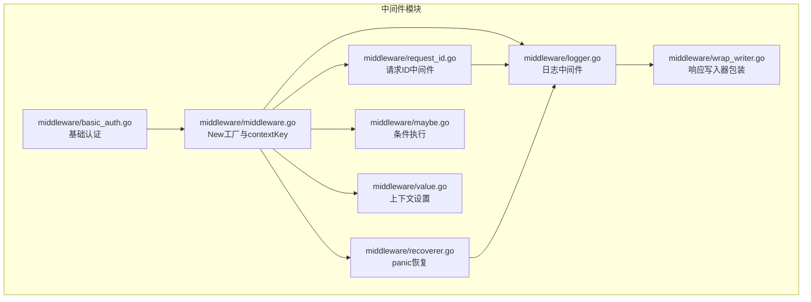
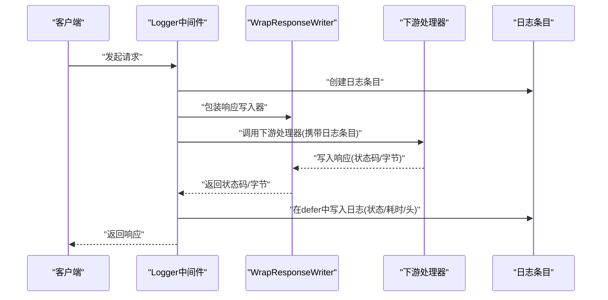
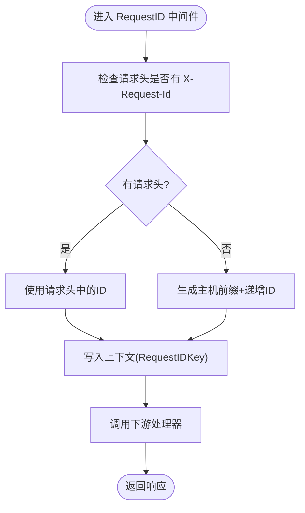
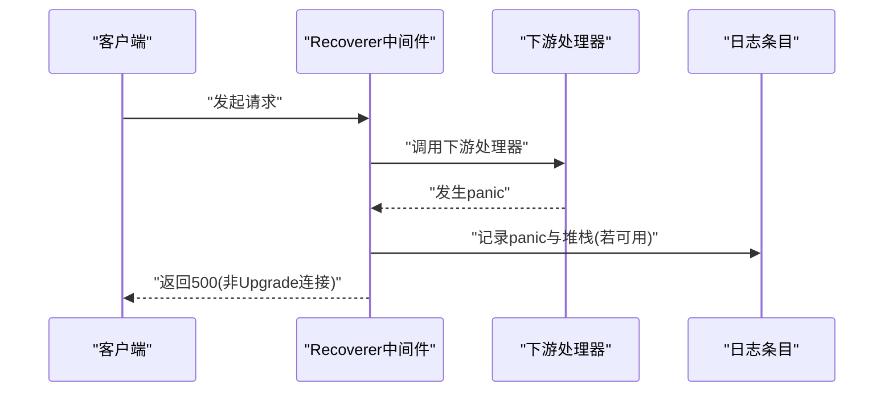
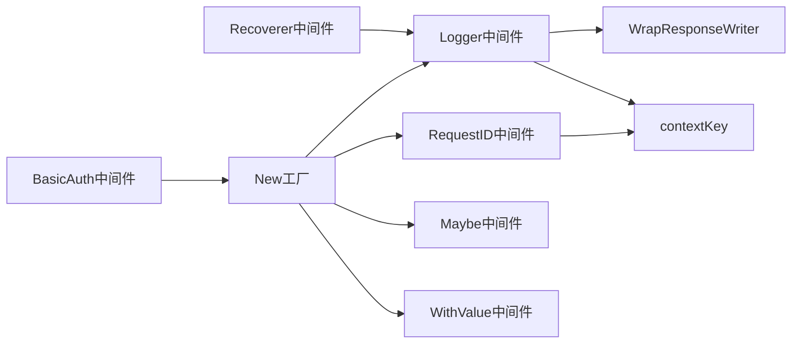

# 自定义中间件开发

<cite>
**本文引用的文件**
- [middleware/middleware.go](file://middleware/middleware.go)
- [middleware/logger.go](file://middleware/logger.go)
- [middleware/request_id.go](file://middleware/request_id.go)
- [middleware/recoverer.go](file://middleware/recoverer.go)
- [middleware/maybe.go](file://middleware/maybe.go)
- [middleware/value.go](file://middleware/value.go)
- [middleware/wrap_writer.go](file://middleware/wrap_writer.go)
- [middleware/basic_auth.go](file://middleware/basic_auth.go)
- [context.go](file://context.go)
</cite>

## 目录
1. [简介](#简介)
2. [项目结构](#项目结构)
3. [核心组件](#核心组件)
4. [架构总览](#架构总览)
5. [详细组件分析](#详细组件分析)
6. [依赖关系分析](#依赖关系分析)
7. [性能考量](#性能考量)
8. [故障排查指南](#故障排查指南)
9. [结论](#结论)
10. [附录：实用中间件示例](#附录实用中间件示例)

## 简介
本指南面向希望为 chi 路由器编写自定义中间件的开发者。我们将从 middleware.New 的标准签名入手，解释“函数签名 func(http.Handler) http.Handler”的含义与实现模式；通过 logger.go 和 request_id.go 的实现，演示如何在中间件中访问请求上下文、修改响应头、传递状态信息；深入讲解 contextKey 结构体的用途及在上下文中安全存储与检索数据的最佳实践；并结合 recoverer.go 展示优雅处理 panic 的策略；最后介绍如何使用 maybe.go 的 Maybe 函数创建条件执行的中间件。

## 项目结构
本仓库与中间件相关的目录位于 middleware 子目录，核心文件包括：
- middleware/middleware.go：定义 New 工厂函数与 contextKey 基础设施
- middleware/logger.go：日志中间件与日志条目接口
- middleware/request_id.go：请求 ID 注入与提取
- middleware/recoverer.go：panic 恢复与错误栈打印
- middleware/maybe.go：条件执行中间件
- middleware/value.go：通用上下文键值设置中间件
- middleware/wrap_writer.go：响应写入器包装器，用于统计状态码与字节数
- middleware/basic_auth.go：基础认证中间件
- context.go：路由上下文与 contextKey 定义（框架内）



图表来源
- [middleware/middleware.go](file://middleware/middleware.go#L1-L24)
- [middleware/logger.go](file://middleware/logger.go#L1-L173)
- [middleware/request_id.go](file://middleware/request_id.go#L1-L97)
- [middleware/recoverer.go](file://middleware/recoverer.go#L1-L204)
- [middleware/maybe.go](file://middleware/maybe.go#L1-L19)
- [middleware/value.go](file://middleware/value.go#L1-L18)
- [middleware/wrap_writer.go](file://middleware/wrap_writer.go#L1-L242)
- [middleware/basic_auth.go](file://middleware/basic_auth.go#L1-L34)
- [context.go](file://context.go#L151-L167)

章节来源
- [middleware/middleware.go](file://middleware/middleware.go#L1-L24)
- [middleware/logger.go](file://middleware/logger.go#L1-L173)
- [middleware/request_id.go](file://middleware/request_id.go#L1-L97)
- [middleware/recoverer.go](file://middleware/recoverer.go#L1-L204)
- [middleware/maybe.go](file://middleware/maybe.go#L1-L19)
- [middleware/value.go](file://middleware/value.go#L1-L18)
- [middleware/wrap_writer.go](file://middleware/wrap_writer.go#L1-L242)
- [middleware/basic_auth.go](file://middleware/basic_auth.go#L1-L34)
- [context.go](file://context.go#L151-L167)

## 核心组件
- New 工厂函数：用于将一个 http.Handler 包装为“返回函数”的中间件，即“func(http.Handler) http.Handler”。这是 chi 中间件的标准模式，便于链式组合。
- contextKey：一种轻量级的上下文键类型，避免分配到 interface{}，并以指针形式存在，确保键的唯一性与安全性。
- 日志中间件：通过包装响应写入器统计状态码与字节数，并在请求结束时输出日志。
- 请求 ID 中间件：在请求上下文中注入唯一请求 ID，支持从请求头读取或生成。
- panic 恢复中间件：捕获 panic 并记录堆栈，必要时返回 500。
- 条件执行中间件：根据请求条件决定是否执行某个中间件。
- 上下文设置中间件：将任意键值放入请求上下文，供下游中间件或处理器使用。
- 响应写入器包装器：提供状态码、字节数统计与 Tee/Discard 等能力。

章节来源
- [middleware/middleware.go](file://middleware/middleware.go#L1-L24)
- [middleware/logger.go](file://middleware/logger.go#L1-L173)
- [middleware/request_id.go](file://middleware/request_id.go#L1-L97)
- [middleware/recoverer.go](file://middleware/recoverer.go#L1-L204)
- [middleware/maybe.go](file://middleware/maybe.go#L1-L19)
- [middleware/value.go](file://middleware/value.go#L1-L18)
- [middleware/wrap_writer.go](file://middleware/wrap_writer.go#L1-L242)
- [context.go](file://context.go#L151-L167)

## 架构总览
下面的类图展示了中间件基础设施与关键组件之间的关系，特别是 contextKey 的使用方式与日志/请求 ID/恢复等中间件如何协作。

```mermaid
classDiagram
class contextKey {
+String() string
}
class NewFactory {
+New(h http.Handler) func(next http.Handler) http.Handler
}
class LoggerMiddleware {
+Logger(next http.Handler) http.Handler
+RequestLogger(formatter LogFormatter) func(next http.Handler) http.Handler
+GetLogEntry(r *http.Request) LogEntry
+WithLogEntry(r *http.Request, entry LogEntry) *http.Request
}
class LogFormatter {
<<interface>>
+NewLogEntry(r *http.Request) LogEntry
}
class LogEntry {
<<interface>>
+Write(status int, bytes int, header http.Header, elapsed time.Duration, extra interface{})
+Panic(v interface{}, stack []byte)
}
class RequestIDMiddleware {
+RequestID(next http.Handler) http.Handler
+GetReqID(ctx context.Context) string
}
class RecovererMiddleware {
+Recoverer(next http.Handler) http.Handler
+PrintPrettyStack(rvr interface{})
}
class MaybeMiddleware {
+Maybe(mw func(http.Handler) http.Handler, maybeFn func(r *http.Request) bool) func(next http.Handler) http.Handler
}
class ValueMiddleware {
+WithValue(key, val interface{}) func(next http.Handler) http.Handler
}
class WrapResponseWriter {
<<interface>>
+Status() int
+BytesWritten() int
+Tee(io.Writer)
+Unwrap() http.ResponseWriter
+Discard()
}
NewFactory --> LoggerMiddleware : "作为基础设施"
LoggerMiddleware --> LogFormatter : "使用"
LoggerMiddleware --> LogEntry : "创建/写入"
LoggerMiddleware --> WrapResponseWriter : "包装响应"
RequestIDMiddleware --> contextKey : "使用"
LoggerMiddleware --> contextKey : "使用"
RecovererMiddleware --> LogEntry : "可选写入"
MaybeMiddleware --> NewFactory : "组合"
ValueMiddleware --> contextKey : "使用"
```

图表来源
- [middleware/middleware.go](file://middleware/middleware.go#L1-L24)
- [middleware/logger.go](file://middleware/logger.go#L1-L173)
- [middleware/request_id.go](file://middleware/request_id.go#L1-L97)
- [middleware/recoverer.go](file://middleware/recoverer.go#L1-L204)
- [middleware/maybe.go](file://middleware/maybe.go#L1-L19)
- [middleware/value.go](file://middleware/value.go#L1-L18)
- [middleware/wrap_writer.go](file://middleware/wrap_writer.go#L1-L242)
- [context.go](file://context.go#L151-L167)

## 详细组件分析

### New 工厂与中间件签名
- 标准签名：func(http.Handler) http.Handler
  - 输入是一个 http.Handler（下一个处理器）
  - 输出是一个新的 http.Handler（当前中间件包裹后的处理器）
- 作用：将“处理请求”的逻辑封装为“返回处理器”的函数，从而可以链式组合
- 使用场景：所有中间件都遵循该模式，便于 r.Use(...) 组合

章节来源
- [middleware/middleware.go](file://middleware/middleware.go#L1-L12)

### contextKey：上下文键的设计与使用
- 设计目的：避免将字符串直接用作上下文键，减少分配与碰撞风险
- 实现要点：
  - 以指针形式存在于 interface{} 中
  - String() 返回稳定标识，便于调试
- 在框架内的使用：
  - chi/context.go 中定义了 RouteCtxKey
  - middleware/logger.go 中定义了 LogEntryCtxKey
  - middleware/request_id.go 中定义了 RequestIDKey（自定义整型键）
- 安全存储与检索：
  - 使用 context.WithValue 将值存入请求上下文
  - 使用 r.Context().Value(key) 取出，注意类型断言与空值检查

章节来源
- [middleware/middleware.go](file://middleware/middleware.go#L13-L24)
- [context.go](file://context.go#L151-L167)
- [middleware/logger.go](file://middleware/logger.go#L13-L21)
- [middleware/request_id.go](file://middleware/request_id.go#L17-L22)

### 日志中间件：访问上下文、统计响应状态与字节
- 关键点：
  - 使用 RequestLogger 创建带格式化器的日志中间件
  - 通过 NewWrapResponseWriter 包装响应写入器，统计状态码与字节数
  - 使用 WithLogEntry/GetLogEntry 在请求上下文中传递日志条目
  - 在 defer 中统一输出日志，包含耗时与响应头
- 注意事项：
  - Logger 应置于可能改变响应的中间件之前（例如 Recoverer），否则无法正确记录最终状态



图表来源
- [middleware/logger.go](file://middleware/logger.go#L43-L84)
- [middleware/wrap_writer.go](file://middleware/wrap_writer.go#L13-L44)

章节来源
- [middleware/logger.go](file://middleware/logger.go#L23-L84)
- [middleware/wrap_writer.go](file://middleware/wrap_writer.go#L13-L121)

### 请求 ID 中间件：在上下文中注入与提取
- 功能：
  - 优先从请求头读取 X-Request-Id
  - 若不存在，则生成基于主机名与随机前缀的唯一 ID，并递增计数
  - 将请求 ID 写入请求上下文，供后续中间件与日志使用
- 提取：
  - 通过 GetReqID 从上下文中安全提取字符串



图表来源
- [middleware/request_id.go](file://middleware/request_id.go#L62-L79)
- [middleware/request_id.go](file://middleware/request_id.go#L81-L91)

章节来源
- [middleware/request_id.go](file://middleware/request_id.go#L46-L91)

### panic 恢复中间件：优雅处理 panic
- 行为：
  - defer 捕获 panic，区分 http.ErrAbortHandler
  - 记录日志条目（若存在）或打印美化堆栈
  - 对非 Upgrade 连接写入 500
- 最佳实践：
  - 将 Recoverer 放置在 Logger 之后，以便记录最终状态
  - 使用 PrintPrettyStack 输出可读堆栈



图表来源
- [middleware/recoverer.go](file://middleware/recoverer.go#L17-L49)
- [middleware/logger.go](file://middleware/logger.go#L32-L41)

章节来源
- [middleware/recoverer.go](file://middleware/recoverer.go#L17-L49)

### 条件执行中间件：Maybe
- 作用：根据 maybeFn(r) 的布尔结果决定是否执行某个中间件
- 典型用法：仅对特定路径或用户角色启用某中间件

章节来源
- [middleware/maybe.go](file://middleware/maybe.go#L1-L19)

### 通用上下文设置中间件：WithValue
- 作用：将任意键值放入请求上下文，供下游使用
- 适用场景：注入用户信息、租户 ID、请求追踪 ID 等

章节来源
- [middleware/value.go](file://middleware/value.go#L1-L18)

### 响应写入器包装器：统计状态与字节
- 能力：
  - 提供 Status()/BytesWritten() 获取状态码与字节数
  - 支持 Tee/Discard，便于审计或转发
  - 针对 HTTP/1.x/2 的不同特性选择合适包装器
- 与日志配合：在日志中间件中用于准确统计响应状态与大小

章节来源
- [middleware/wrap_writer.go](file://middleware/wrap_writer.go#L13-L121)

### 基础认证中间件：鉴权示例
- 作用：从请求中解析 Basic Auth，校验用户名密码
- 失败时设置 WWW-Authenticate 头并返回 401

章节来源
- [middleware/basic_auth.go](file://middleware/basic_auth.go#L1-L34)

## 依赖关系分析
- New 工厂与 contextKey 是所有中间件的基础
- 日志中间件依赖 WrapResponseWriter 以统计响应
- 请求 ID 中间件与日志中间件通过上下文键协同工作
- panic 恢复中间件与日志中间件顺序敏感，需先日志后恢复
- Maybe 与 Value 作为通用工具，可被任意中间件组合使用



图表来源
- [middleware/middleware.go](file://middleware/middleware.go#L1-L24)
- [middleware/logger.go](file://middleware/logger.go#L1-L173)
- [middleware/request_id.go](file://middleware/request_id.go#L1-L97)
- [middleware/recoverer.go](file://middleware/recoverer.go#L1-L204)
- [middleware/maybe.go](file://middleware/maybe.go#L1-L19)
- [middleware/value.go](file://middleware/value.go#L1-L18)
- [middleware/wrap_writer.go](file://middleware/wrap_writer.go#L1-L242)
- [middleware/basic_auth.go](file://middleware/basic_auth.go#L1-L34)
- [context.go](file://context.go#L151-L167)

章节来源
- [middleware/middleware.go](file://middleware/middleware.go#L1-L24)
- [middleware/logger.go](file://middleware/logger.go#L1-L173)
- [middleware/request_id.go](file://middleware/request_id.go#L1-L97)
- [middleware/recoverer.go](file://middleware/recoverer.go#L1-L204)
- [middleware/maybe.go](file://middleware/maybe.go#L1-L19)
- [middleware/value.go](file://middleware/value.go#L1-L18)
- [middleware/wrap_writer.go](file://middleware/wrap_writer.go#L1-L242)
- [middleware/basic_auth.go](file://middleware/basic_auth.go#L1-L34)
- [context.go](file://context.go#L151-L167)

## 性能考量
- contextKey 使用指针避免分配，降低 GC 压力
- WrapResponseWriter 在 HTTP/2 下选择更优实现，减少额外拷贝
- 日志中间件仅在请求结束时输出，避免阻塞主处理流程
- Maybe 中间件按需执行，减少不必要的中间件开销
- Recoverer 在捕获 panic 后尽快返回，避免长时间占用

[本节为一般性建议，不直接分析具体文件]

## 故障排查指南
- 日志未记录最终状态
  - 检查中间件顺序：Logger 应在 Recoverer 之前
  - 确认日志中间件已正确包装响应写入器
- 请求 ID 为空
  - 检查请求头 X-Request-Id 是否传入
  - 确认 RequestID 中间件已注入上下文
- panic 未被捕获
  - 确认 Recoverer 已注册且在 Logger 之后
  - 检查是否为 http.ErrAbortHandler 导致直接重新抛出
- 响应头未生效
  - 确保在写入响应体之前设置头
  - 检查下游处理器是否覆盖了头

章节来源
- [middleware/logger.go](file://middleware/logger.go#L32-L41)
- [middleware/recoverer.go](file://middleware/recoverer.go#L23-L49)
- [middleware/request_id.go](file://middleware/request_id.go#L62-L79)
- [middleware/wrap_writer.go](file://middleware/wrap_writer.go#L82-L121)

## 结论
chi 的中间件体系以 New 工厂与 contextKey 为核心，提供了清晰、可组合、可扩展的中间件模型。通过日志、请求 ID、panic 恢复、条件执行与上下文设置等中间件，开发者可以构建健壮、可观测、可维护的服务层。遵循本文的实现模式与最佳实践，能够快速编写高质量的自定义中间件。

[本节为总结性内容，不直接分析具体文件]

## 附录：实用中间件示例
以下示例描述如何实现常见中间件，不包含具体代码，仅给出实现思路与参考路径。

- 身份验证中间件
  - 思路：解析 Authorization 头，校验凭据，失败时返回 401 并设置 WWW-Authenticate
  - 参考：[middleware/basic_auth.go](file://middleware/basic_auth.go#L1-L34)
  - 上下文：可将用户信息写入上下文，供后续中间件使用

- 请求计数中间件
  - 思路：在请求进入时递增计数器，可在日志中输出累计值
  - 参考：[middleware/request_id.go](file://middleware/request_id.go#L27-L31) 的原子计数思想
  - 上下文：使用 WithValue 将计数器句柄或当前计数值放入上下文

- 响应时间统计中间件
  - 思路：记录开始时间，在 defer 中计算耗时并输出
  - 参考：[middleware/logger.go](file://middleware/logger.go#L43-L59) 的时间统计模式
  - 参考：[middleware/wrap_writer.go](file://middleware/wrap_writer.go#L116-L121) 的状态码/字节统计

- 条件执行中间件
  - 思路：根据请求路径、方法或头信息决定是否执行某个中间件
  - 参考：[middleware/maybe.go](file://middleware/maybe.go#L1-L19)

- 上下文设置中间件
  - 思路：将任意键值放入请求上下文，供下游使用
  - 参考：[middleware/value.go](file://middleware/value.go#L1-L18)

- 错误处理中间件（panic 恢复）
  - 思路：defer 捕获 panic，记录堆栈，必要时返回 500
  - 参考：[middleware/recoverer.go](file://middleware/recoverer.go#L17-L49)

章节来源
- [middleware/basic_auth.go](file://middleware/basic_auth.go#L1-L34)
- [middleware/request_id.go](file://middleware/request_id.go#L27-L31)
- [middleware/logger.go](file://middleware/logger.go#L43-L59)
- [middleware/wrap_writer.go](file://middleware/wrap_writer.go#L116-L121)
- [middleware/maybe.go](file://middleware/maybe.go#L1-L19)
- [middleware/value.go](file://middleware/value.go#L1-L18)
- [middleware/recoverer.go](file://middleware/recoverer.go#L17-L49)