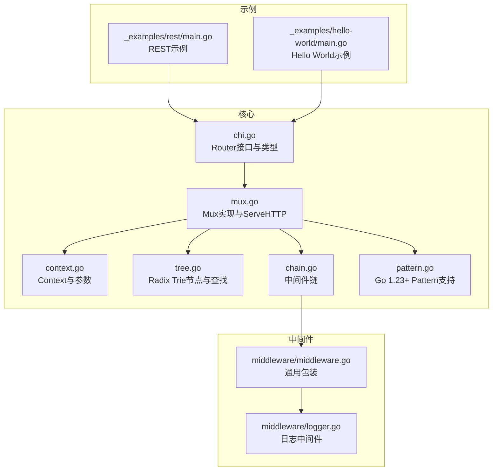
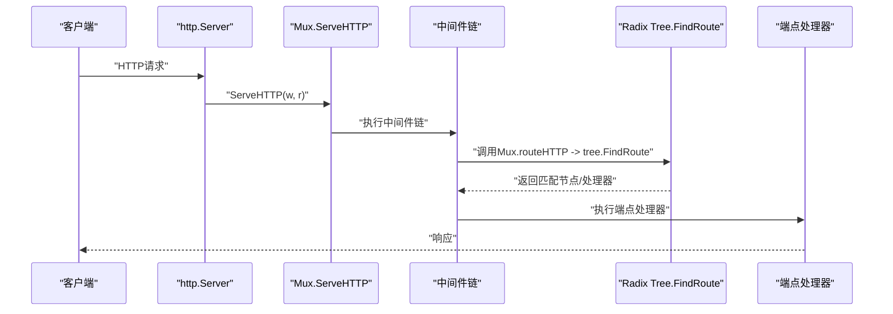
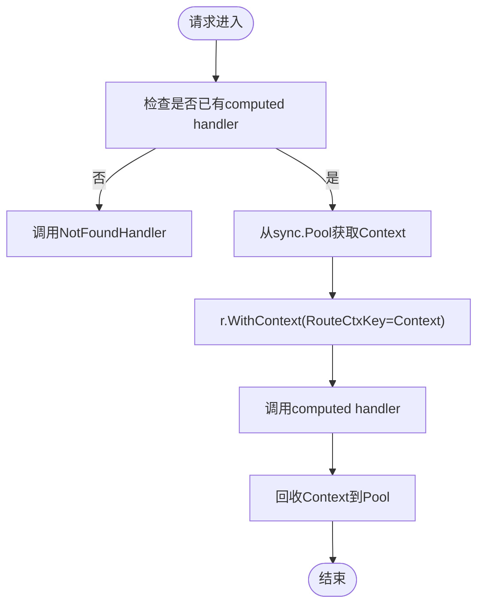
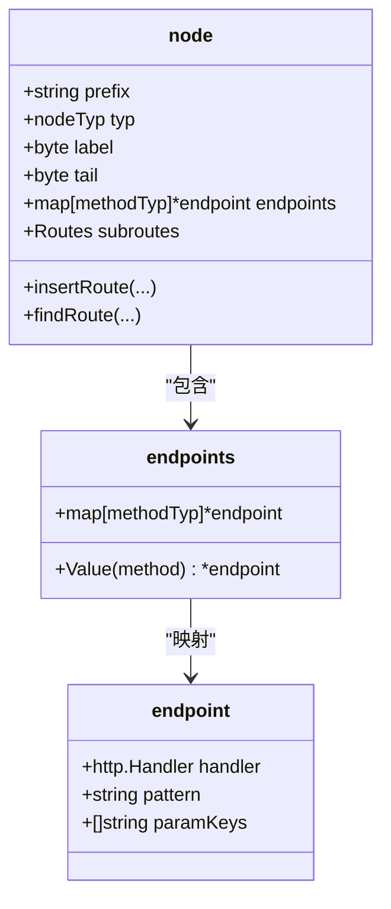
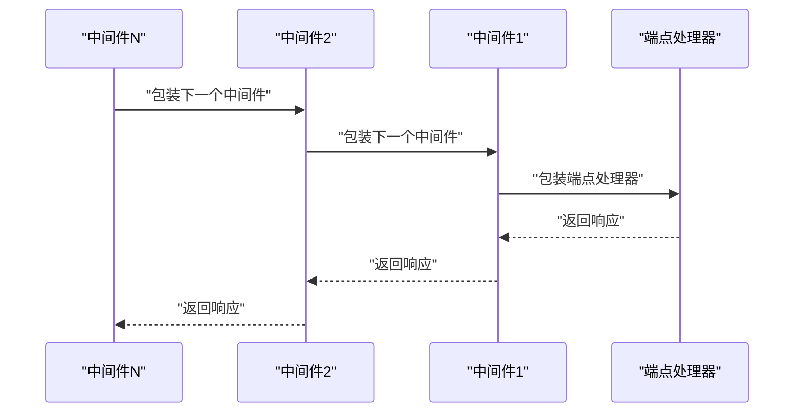
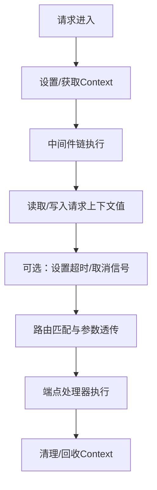
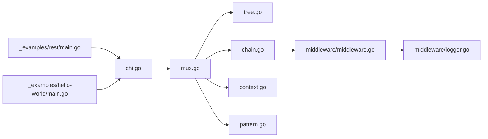

# 核心概念

<cite>
**本文引用的文件**
- [chi.go](file://chi.go)
- [mux.go](file://mux.go)
- [context.go](file://context.go)
- [tree.go](file://tree.go)
- [chain.go](file://chain.go)
- [pattern.go](file://pattern.go)
- [middleware/middleware.go](file://middleware/middleware.go)
- [middleware/logger.go](file://middleware/logger.go)
- [go.mod](file://go.mod)
- [_examples/rest/main.go](file://_examples/rest/main.go)
- [_examples/hello-world/main.go](file://_examples/hello-world/main.go)
</cite>

## 目录
1. [引言](#引言)
2. [项目结构](#项目结构)
3. [核心组件](#核心组件)
4. [架构总览](#架构总览)
5. [详细组件分析](#详细组件分析)
6. [依赖关系分析](#依赖关系分析)
7. [性能考量](#性能考量)
8. [故障排查指南](#故障排查指南)
9. [结论](#结论)
10. [附录](#附录)

## 引言
本篇文档聚焦于chi框架的核心架构理念与实现细节，重点阐释其基于Patricia Radix Trie（前缀树）的路由器设计及其高性能路由查找机制；系统化梳理Router接口的职责与方法族，包括Use、Route、Mount等；深入解析中间件系统的设计哲学与组合模式；详解基于Go 1.7+ context包的请求上下文管理，涵盖值传递、取消与超时控制；并通过分析chi.go与mux.go的源码，阐明核心组件之间的关系与数据流，帮助开发者建立对框架内部工作原理的完整认知。

## 项目结构
chi采用“按职责分层”的组织方式：
- 路由器与接口定义：chi.go
- 多路复用器与HTTP处理：mux.go
- 请求上下文与参数：context.go
- 前缀树路由实现：tree.go
- 中间件链构建：chain.go
- Go版本特性支持：pattern.go
- 中间件库：middleware/
- 示例工程：_examples/

图表来源
- [chi.go](file://chi.go#L59-L138)
- [mux.go](file://mux.go#L1-L120)
- [context.go](file://context.go#L1-L80)
- [tree.go](file://tree.go#L1-L120)
- [chain.go](file://chain.go#L1-L50)
- [pattern.go](file://pattern.go#L1-L17)
- [middleware/middleware.go](file://middleware/middleware.go#L1-L24)
- [middleware/logger.go](file://middleware/logger.go#L1-L60)
- [_examples/rest/main.go](file://_examples/rest/main.go#L56-L112)
- [_examples/hello-world/main.go](file://_examples/hello-world/main.go#L10-L21)

章节来源
- [chi.go](file://chi.go#L59-L138)
- [mux.go](file://mux.go#L1-L120)
- [context.go](file://context.go#L1-L80)
- [tree.go](file://tree.go#L1-L120)
- [chain.go](file://chain.go#L1-L50)
- [pattern.go](file://pattern.go#L1-L17)
- [middleware/middleware.go](file://middleware/middleware.go#L1-L24)
- [middleware/logger.go](file://middleware/logger.go#L1-L60)
- [_examples/rest/main.go](file://_examples/rest/main.go#L56-L112)
- [_examples/hello-world/main.go](file://_examples/hello-world/main.go#L10-L21)

## 核心组件
- Router接口：定义了路由注册、中间件挂载、子路由挂载、方法路由、NotFound/MethodNotAllowed等能力，并继承自http.Handler与Routes接口，确保与标准库完全兼容。
- Mux多路复用器：实现Router接口，负责将中间件链与前缀树路由组合成单一处理器，提供ServeHTTP入口、路由注册、子路由挂载、匹配与查找等能力。
- Context请求上下文：在每个请求生命周期内承载路由路径、方法、URL参数、匹配到的路由模式串等信息，并作为context.Context的轻量封装。
- Radix Trie前缀树：以节点类型区分静态段、参数段、正则段、通配段，按标签排序与尾字符优先策略遍历，实现O(路径长度)的高效查找。
- 中间件链：通过组合模式将多个中间件函数串联，形成从外到内的洋葱式调用链，最终到达端点处理器。
- Go 1.23+ Pattern支持：在满足条件时将匹配到的路由模式写入http.Request.Pattern字段，便于调试与可观测性。

章节来源
- [chi.go](file://chi.go#L64-L138)
- [mux.go](file://mux.go#L1-L120)
- [context.go](file://context.go#L1-L80)
- [tree.go](file://tree.go#L1-L120)
- [chain.go](file://chain.go#L1-L50)
- [pattern.go](file://pattern.go#L1-L17)

## 架构总览
chi的整体架构围绕“前缀树路由 + 中间件链 + 标准库兼容”展开。请求进入Mux后，先通过中间件链处理，再交由前缀树进行路径与方法匹配，最后执行端点处理器。Context贯穿整个流程，用于参数透传与状态记录。

图表来源
- [mux.go](file://mux.go#L60-L120)
- [mux.go](file://mux.go#L439-L487)
- [tree.go](file://tree.go#L373-L400)

章节来源
- [mux.go](file://mux.go#L60-L120)
- [mux.go](file://mux.go#L439-L487)
- [tree.go](file://tree.go#L373-L400)

## 详细组件分析

### Router接口与方法族
- 继承能力：Router同时实现了http.Handler与Routes接口，保证与标准库无缝对接。
- 中间件栈：Use用于全局中间件注册；With用于为单个端点或分组添加内联中间件；Group用于复制父级中间件栈并创建新的内联子路由。
- 子路由与挂载：Route用于在指定模式下创建子路由；Mount用于将另一个http.Handler或Router挂载到某模式下，常用于模块化拆分。
- 方法路由：Handle/HandleFunc、Method/MethodFunc以及各HTTP方法快捷方法（Get、Post等）统一注册到前缀树。
- 错误处理：NotFound与MethodNotAllowed分别设置未找到与方法不允许的处理器，并在内联场景中向父级传播。

章节来源
- [chi.go](file://chi.go#L64-L138)
- [mux.go](file://mux.go#L107-L233)
- [mux.go](file://mux.go#L235-L341)
- [mux.go](file://mux.go#L342-L413)

### Mux多路复用器与ServeHTTP
- 初始化：NewMux创建Mux实例，初始化空的根节点与同步池。
- ServeHTTP：从同步池获取Context，注入到请求上下文中，然后调用computed handler（中间件链 + 路由HTTP），结束后回收Context。
- 中间件注册限制：Use必须在路由注册之前调用，否则会触发panic，确保中间件链在路由注册完成前冻结。
- 内联中间件：With创建内联Mux，复制父级中间件栈并在其上追加新中间件，随后生成该内联栈的处理器。
- 子路由挂载：Mount在指定模式下注册一个挂载处理器，若目标模式已存在则panic；挂载时自动传播父级NotFound与MethodNotAllowed处理器；支持子路由的Routes接口以标记stub路由。
- 匹配与查找：Find与Match通过tree.FindRoute定位节点并返回匹配模式；nextRoutePath用于子路由路径切片。

图表来源
- [mux.go](file://mux.go#L60-L120)

章节来源
- [mux.go](file://mux.go#L50-L120)
- [mux.go](file://mux.go#L100-L120)
- [mux.go](file://mux.go#L235-L341)
- [mux.go](file://mux.go#L342-L413)

### 前缀树Radix Trie与高性能查找
- 节点类型：静态段、参数段、正则段、通配段；children按标签排序，参数节点按尾字符优先策略调整顺序，确保更精确的匹配优先级。
- 插入逻辑：InsertRoute将路径按段解析，按类型拆分并插入；当公共前缀存在时进行节点分裂；为叶子节点维护endpoints映射（方法->处理器）。
- 查找逻辑：FindRoute递归遍历children，按类型匹配；静态段要求前缀一致；参数/正则段按尾字符分割，避免跨段匹配；通配段捕获剩余路径。
- 方法支持：支持标准HTTP方法与自定义方法注册；mALL位掩码聚合所有方法；405场景收集允许的方法集合。
- 模式遍历：routes/walk遍历树输出路由表，按唯一模式聚合方法处理器。

图表来源
- [tree.go](file://tree.go#L78-L128)
- [tree.go](file://tree.go#L138-L228)
- [tree.go](file://tree.go#L373-L543)

章节来源
- [tree.go](file://tree.go#L78-L128)
- [tree.go](file://tree.go#L138-L228)
- [tree.go](file://tree.go#L373-L543)
- [tree.go](file://tree.go#L577-L665)

### 中间件系统与组合模式
- 中间件链：Chain将多个(func(http.Handler) http.Handler)串联，形成洋葱式调用；ChainHandler持有最终端点与链式处理器，ServeHTTP直接委托链式处理器。
- 组合模式：Mux.Use在路由注册前追加中间件；With复制父级中间件栈并追加新中间件，形成新的内联栈；Group是对With的便捷封装。
- 兼容性：中间件遵循标准net/http接口，可与任何http.Handler/http.HandlerFunc组合，保持与标准库的完全兼容。

图表来源
- [chain.go](file://chain.go#L1-L50)
- [mux.go](file://mux.go#L100-L120)
- [mux.go](file://mux.go#L235-L257)

章节来源
- [chain.go](file://chain.go#L1-L50)
- [mux.go](file://mux.go#L100-L120)
- [mux.go](file://mux.go#L235-L257)

### 请求上下文管理与Go 1.7+ context集成
- Context结构：承载Routes引用、父级context、路由路径与方法覆盖、URL参数栈、当前与累积路由模式、方法允许列表与405标记等。
- 值传递：URLParam/URLParamFromCtx从请求上下文中读取参数；RouteContext从context.Value提取；中间件可在请求上下文中存取业务值。
- 取消与超时：示例展示了通过中间件为请求上下文设置超时，从而在后续处理中通过ctx.Done()感知超时并停止进一步处理。
- Go 1.23+ Pattern：当满足条件时，将匹配到的路由模式写入http.Request.Pattern，便于调试与可观测性。

图表来源
- [context.go](file://context.go#L1-L80)
- [context.go](file://context.go#L81-L167)
- [pattern.go](file://pattern.go#L1-L17)
- [_examples/rest/main.go](file://_examples/rest/main.go#L89-L112)

章节来源
- [context.go](file://context.go#L1-L80)
- [context.go](file://context.go#L81-L167)
- [pattern.go](file://pattern.go#L1-L17)
- [_examples/rest/main.go](file://_examples/rest/main.go#L89-L112)

### 示例与最佳实践
- Hello World：展示基本路由注册与中间件使用。
- REST示例：演示子路由、挂载、内联中间件、参数提取、上下文值传递与错误处理。
- 日志中间件：展示如何在中间件中记录请求开始与结束、状态码、耗时与字节数。

章节来源
- [_examples/hello-world/main.go](file://_examples/hello-world/main.go#L10-L21)
- [_examples/rest/main.go](file://_examples/rest/main.go#L56-L112)
- [middleware/logger.go](file://middleware/logger.go#L1-L60)

## 依赖关系分析
- chi.go定义Router接口与类型，为整个框架的契约层。
- mux.go实现Router接口，依赖tree.go的前缀树、chain.go的中间件链、context.go的请求上下文与pattern.go的Go版本特性。
- middleware/目录提供通用中间件包装与具体中间件实现，与标准库保持一致。
- 示例工程依赖chi与middleware库，验证接口与行为。

图表来源
- [chi.go](file://chi.go#L59-L138)
- [mux.go](file://mux.go#L1-L120)
- [tree.go](file://tree.go#L1-L120)
- [chain.go](file://chain.go#L1-L50)
- [context.go](file://context.go#L1-L80)
- [pattern.go](file://pattern.go#L1-L17)
- [middleware/middleware.go](file://middleware/middleware.go#L1-L24)
- [middleware/logger.go](file://middleware/logger.go#L1-L60)
- [_examples/rest/main.go](file://_examples/rest/main.go#L56-L112)
- [_examples/hello-world/main.go](file://_examples/hello-world/main.go#L10-L21)

章节来源
- [chi.go](file://chi.go#L59-L138)
- [mux.go](file://mux.go#L1-L120)
- [tree.go](file://tree.go#L1-L120)
- [chain.go](file://chain.go#L1-L50)
- [context.go](file://context.go#L1-L80)
- [pattern.go](file://pattern.go#L1-L17)
- [middleware/middleware.go](file://middleware/middleware.go#L1-L24)
- [middleware/logger.go](file://middleware/logger.go#L1-L60)
- [_examples/rest/main.go](file://_examples/rest/main.go#L56-L112)
- [_examples/hello-world/main.go](file://_examples/hello-world/main.go#L10-L21)

## 性能考量
- 前缀树查找复杂度：在典型REST路径上，按段匹配，静态段前缀匹配与参数/正则段的有序遍历，整体接近O(路径长度)。
- 中间件链开销：中间件链在路由注册前冻结，避免运行时重复组装；链式调用仅在请求时发生一次。
- 上下文池化：通过sync.Pool复用Context，减少GC压力与分配次数。
- Go 1.23+特性：启用Pattern字段可提升可观测性，但不会影响路由性能。
- 示例基准：README中提供了多类路径与参数组合的基准测试，可作为参考。

章节来源
- [tree.go](file://tree.go#L373-L543)
- [mux.go](file://mux.go#L50-L92)
- [README.md](file://README.md#L452-L461)

## 故障排查指南
- 中间件注册时机：Use必须在路由注册之前调用，否则会panic。请确保在所有Handle/Method/Route/Mount之前完成中间件注册。
- 挂载冲突：Mount在同一模式下重复挂载会panic。请检查挂载路径是否与现有路由冲突。
- 方法不支持：请求方法不在支持列表时会触发MethodNotAllowedHandler；可通过MethodNotAllowed设置自定义处理器。
- 参数重复：路由模式中的参数键重复会导致panic。请确保参数键唯一。
- 正则表达式：参数段的正则需合法且以^$包裹，否则会panic。
- 超时与取消：如需在中间件中设置超时，请在请求进入时设置context.WithTimeout，并在后续处理中监听ctx.Done()。

章节来源
- [mux.go](file://mux.go#L100-L120)
- [mux.go](file://mux.go#L282-L341)
- [tree.go](file://tree.go#L720-L770)
- [_examples/rest/main.go](file://_examples/rest/main.go#L89-L112)

## 结论
chi通过“前缀树路由 + 中间件链 + 标准库兼容”的设计，在保证高性能的同时提供了强大的可组合性与易用性。Router接口清晰地定义了路由能力边界，Mux将中间件与树查找整合为单一处理器，Context贯穿全链路实现参数与状态管理，Go 1.23+特性进一步提升了可观测性。示例工程展示了从基础到复杂的实际用法，开发者可据此快速构建模块化、可维护的HTTP服务。

## 附录
- 版本与兼容：模块声明支持Go 1.22及以上版本，面向最新四个主要版本。
- 接口与类型：Router、Routes、Context、Mux、Middlewares等核心类型与方法定义见相应文件。

章节来源
- [go.mod](file://go.mod#L1-L6)
- [chi.go](file://chi.go#L64-L138)
- [context.go](file://context.go#L1-L80)
- [mux.go](file://mux.go#L1-L120)
- [tree.go](file://tree.go#L1-L120)
- [chain.go](file://chain.go#L1-L50)