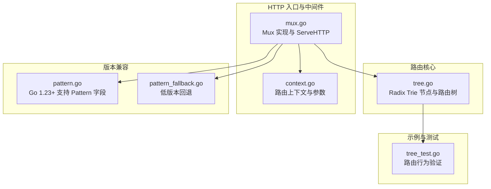
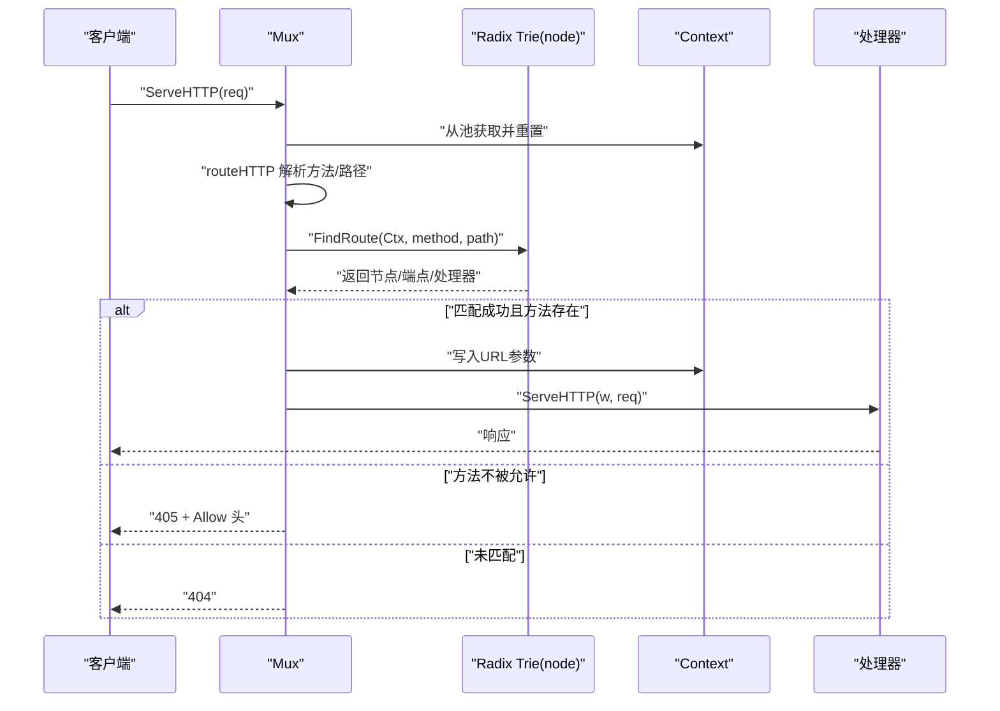
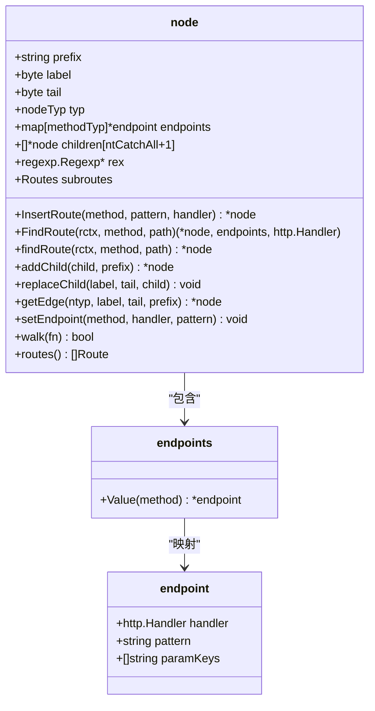
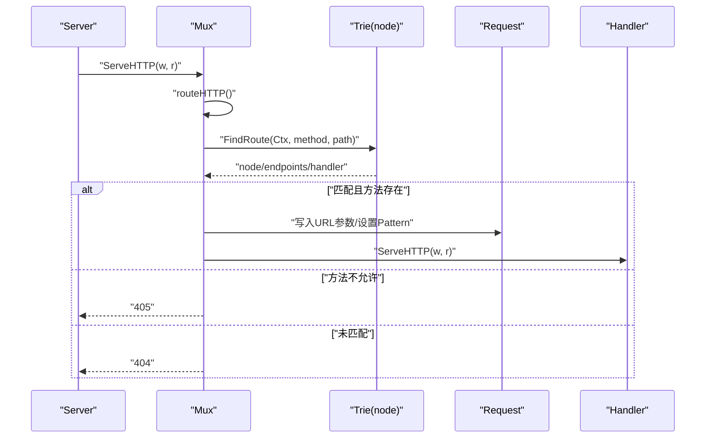
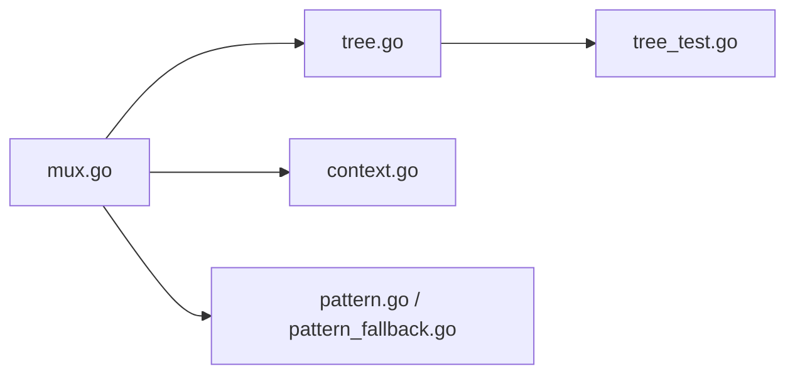

# Radix Trie 路由架构

<cite>
**本文引用的文件**
- [tree.go](file://tree.go)
- [mux.go](file://mux.go)
- [chi.go](file://chi.go)
- [context.go](file://context.go)
- [pattern.go](file://pattern.go)
- [pattern_fallback.go](file://pattern_fallback.go)
- [tree_test.go](file://tree_test.go)
</cite>

## 目录
1. [引言](#引言)
2. [项目结构](#项目结构)
3. [核心组件](#核心组件)
4. [架构总览](#架构总览)
5. [详细组件分析](#详细组件分析)
6. [依赖关系分析](#依赖关系分析)
7. [性能考量](#性能考量)
8. [故障排查指南](#故障排查指南)
9. [结论](#结论)

## 引言
本文件系统性解析 chi 框架基于 Patricia Radix Trie 的路由器架构，重点阐释：
- 如何通过多维 Radix 树实现高效路由匹配；
- 支持的路由模式：精确匹配、参数化路由、正则表达式路由、通配符路由；
- tree.go 中 node 结构体的插入、查找与遍历机制；
- 不同节点类型（ntStatic、ntParam、ntRegexp、ntCatchAll）的处理策略与组织方式；
- HTTP 请求从进入 mux 到最终路由到处理器的完整流程；
- 路由优先级与冲突处理策略；
- 面向开发者的性能优化建议（路由定义顺序与模式选择）。

## 项目结构
chi 的路由核心位于 tree.go，请求入口与中间件链路在 mux.go，上下文与工具在 context.go，Go 版本兼容在 pattern.go/pattern_fallback.go，示例与测试在 tree_test.go。

图表来源
- [tree.go](file://tree.go#L1-L120)
- [mux.go](file://mux.go#L1-L120)
- [context.go](file://context.go#L1-L120)
- [pattern.go](file://pattern.go#L1-L17)
- [pattern_fallback.go](file://pattern_fallback.go#L1-L18)
- [tree_test.go](file://tree_test.go#L1-L120)

章节来源
- [tree.go](file://tree.go#L1-L120)
- [mux.go](file://mux.go#L1-L120)
- [context.go](file://context.go#L1-L120)
- [pattern.go](file://pattern.go#L1-L17)
- [pattern_fallback.go](file://pattern_fallback.go#L1-L18)
- [tree_test.go](file://tree_test.go#L1-L120)

## 核心组件
- Radix Trie 节点与端点映射
  - 节点类型：静态段、参数段、正则段、通配段
  - 端点映射：按 HTTP 方法存储处理器与模式信息
- Mux 路由器
  - 实现 Router 接口，封装中间件链与路由树
  - 提供 Handle/Method/Get/Put/Delete 等方法注册
- 路由上下文
  - 记录当前匹配路径、参数栈、已匹配模式栈、允许的方法集合等
- 版本兼容
  - Go 1.23+ 可写入 http.Request.Pattern 字段；低版本回退为空操作

章节来源
- [tree.go](file://tree.go#L78-L140)
- [mux.go](file://mux.go#L1-L120)
- [context.go](file://context.go#L1-L120)
- [pattern.go](file://pattern.go#L1-L17)
- [pattern_fallback.go](file://pattern_fallback.go#L1-L18)

## 架构总览
chi 的请求处理流程如下：
- 客户端请求到达 Mux.ServeHTTP，从 sync.Pool 获取 Context 并注入到请求上下文
- 调用 Mux.routeHTTP，解析方法与路径
- 在 Radix Trie 上执行 FindRoute 查找匹配节点
- 若找到叶子节点且对应方法存在处理器，则设置 URL 参数并调用处理器
- 否则根据是否命中路径但方法不匹配返回 405，否则返回 404

图表来源
- [mux.go](file://mux.go#L439-L487)
- [tree.go](file://tree.go#L373-L396)
- [context.go](file://context.go#L1-L120)

章节来源
- [mux.go](file://mux.go#L439-L487)
- [tree.go](file://tree.go#L373-L396)
- [context.go](file://context.go#L1-L120)

## 详细组件分析

### Radix Trie 节点与路由树（tree.go）
- 节点类型与字段
  - 节点类型：ntStatic、ntRegexp、ntParam、ntCatchAll
  - 关键字段：prefix（公共前缀）、label（首字节）、tail（尾分隔符）、children（按类型分组有序数组）、endpoints（按方法映射处理器）、rex（正则编译结果）、subroutes（子路由）
- 插入逻辑（InsertRoute）
  - 逐段解析模式，识别静态/参数/正则/通配段
  - 对于静态段，计算最长公共前缀并可能拆分现有节点
  - 对于参数/正则/通配段，构建子节点并通过 addChild 递归添加后续段
  - 设置端点：支持 mALL（所有方法）与单个方法，记录 pattern 与 paramKeys
- 查找逻辑（FindRoute/findRoute）
  - 多维遍历：按节点类型组（静态/参数/正则/通配）依次尝试
  - 静态段：按 label 二分查找匹配边，检查前缀匹配
  - 参数/正则段：按 tail 分隔符定位段值，正则段需满足正则匹配，避免跨段匹配
  - 通配段：将剩余路径作为参数值
  - 递归深入子节点，回溯时清理参数栈
- 边与排序
  - getEdge：按 label 二分查找
  - tailSort：将以 '/' 为 tail 的参数节点排在末尾，确保更精确的匹配优先
- 遍历与导出路由
  - walk：深度优先遍历，收集端点与子路由
  - routes：将端点按唯一模式聚合，输出可遍历的 Route 列表

图表来源
- [tree.go](file://tree.go#L78-L140)
- [tree.go](file://tree.go#L138-L228)
- [tree.go](file://tree.go#L230-L316)
- [tree.go](file://tree.go#L318-L341)
- [tree.go](file://tree.go#L343-L371)
- [tree.go](file://tree.go#L398-L543)
- [tree.go](file://tree.go#L619-L682)

章节来源
- [tree.go](file://tree.go#L78-L140)
- [tree.go](file://tree.go#L138-L228)
- [tree.go](file://tree.go#L230-L316)
- [tree.go](file://tree.go#L318-L341)
- [tree.go](file://tree.go#L343-L371)
- [tree.go](file://tree.go#L398-L543)
- [tree.go](file://tree.go#L545-L571)
- [tree.go](file://tree.go#L619-L682)

### HTTP 请求到处理器的流程（mux.go）
- ServeHTTP
  - 从 sync.Pool 获取 Context，注入到请求上下文
  - 若尚未构建路由处理器，先构建
- routeHTTP
  - 解析方法与路径，调用 tree.FindRoute
  - 将参数写入请求，设置 Pattern（Go 1.23+）
  - 调用处理器或返回 405/404
- handle
  - 注册路由时构建处理器链（内联中间件），并将端点加入树

图表来源
- [mux.go](file://mux.go#L60-L120)
- [mux.go](file://mux.go#L439-L487)
- [tree.go](file://tree.go#L373-L396)

章节来源
- [mux.go](file://mux.go#L60-L120)
- [mux.go](file://mux.go#L439-L487)
- [tree.go](file://tree.go#L373-L396)

### 路由模式与匹配策略
- 精确匹配
  - 静态段完全匹配，使用 longestPrefix 与二分查找
- 参数化路由
  - 形如 {id} 或 {user}，以 tail 为分隔符提取段值，避免跨段匹配
- 正则表达式路由
  - 形如 {id:[0-9]+}，编译正则后在匹配阶段校验
- 通配符路由
  - 形如 /*，将剩余路径作为参数值
- 节点组织与优先级
  - 子节点按 label 升序排列，参数节点若 tail 为 '/' 则排在末尾，保证更精确的静态/参数匹配优先于通配
  - 同一模式下后注册覆盖先注册（latest wins）

章节来源
- [tree.go](file://tree.go#L398-L543)
- [tree.go](file://tree.go#L545-L571)
- [tree.go](file://tree.go#L684-L752)
- [tree_test.go](file://tree_test.go#L1-L120)
- [tree_test.go](file://tree_test.go#L154-L268)
- [tree_test.go](file://tree_test.go#L270-L385)

### 路由优先级与冲突处理
- 节点排序与遍历顺序
  - 静态/参数/正则按 label 二分查找，参数节点 tailSort 将 '/' 尾部参数置于末位，提升精确匹配优先级
- 冲突与覆盖
  - 同一模式下后注册覆盖先注册（latest wins）
  - 参数键重复会触发 panic
- 方法不匹配
  - 若路径匹配但方法不支持，记录允许的方法列表并在 405 响应中返回

章节来源
- [tree.go](file://tree.go#L545-L571)
- [tree.go](file://tree.go#L790-L800)
- [tree.go](file://tree.go#L754-L770)
- [tree.go](file://tree.go#L400-L543)

### 数据流与上下文
- Context
  - 记录 RoutePath、RouteMethod、URLParams、routePattern、RoutePatterns、methodsAllowed、methodNotAllowed
  - Reset 清空状态，URLParam 按键取最近作用域的值
- 参数传递
  - 匹配过程中累积参数值，最终写入请求对象

章节来源
- [context.go](file://context.go#L1-L167)

### 版本兼容与 Pattern 字段
- Go 1.23+：支持写入 http.Request.Pattern
- 低版本：回退为空操作，不影响功能

章节来源
- [pattern.go](file://pattern.go#L1-L17)
- [pattern_fallback.go](file://pattern_fallback.go#L1-L18)

## 依赖关系分析
- Mux 依赖 Radix Trie 节点进行路由匹配
- Mux 依赖 Context 进行参数与模式记录
- Mux 依赖 pattern.go/pattern_fallback.go 提供 Pattern 字段写入能力
- 测试依赖 tree_test.go 验证路由行为

图表来源
- [mux.go](file://mux.go#L1-L120)
- [tree.go](file://tree.go#L1-L120)
- [context.go](file://context.go#L1-L120)
- [pattern.go](file://pattern.go#L1-L17)
- [pattern_fallback.go](file://pattern_fallback.go#L1-L18)
- [tree_test.go](file://tree_test.go#L1-L120)

章节来源
- [mux.go](file://mux.go#L1-L120)
- [tree.go](file://tree.go#L1-L120)
- [context.go](file://context.go#L1-L120)
- [pattern.go](file://pattern.go#L1-L17)
- [pattern_fallback.go](file://pattern_fallback.go#L1-L18)
- [tree_test.go](file://tree_test.go#L1-L120)

## 性能考量
- 路由定义顺序
  - 更精确的静态/参数路由应尽量靠前，避免被通配段吞没
  - 参数节点 tailSort 将 '/' 尾部参数置于末位，建议将更具体的参数放在前面
- 模式选择
  - 优先使用静态段与参数段，减少正则匹配开销
  - 正则仅用于必要场景，避免过于宽泛的匹配导致回溯
- 节点数量与深度
  - 合理拆分路径段，避免过深的树层级
  - 使用通配符时注意其兜底特性，避免过多通配导致匹配分支增多
- 缓存与复用
  - 使用 sync.Pool 复用 Context，降低分配成本
  - 中间件链只在路由注册完成后构建一次，避免重复构建

## 故障排查指南
- 405 Method Not Allowed
  - 检查是否路径匹配但方法不支持，确认允许的方法列表
- 404 Not Found
  - 确认路由是否正确注册，是否存在通配符覆盖了更具体路径
- 参数缺失或错误
  - 检查参数键是否重复（重复键会 panic）
  - 确认参数 tail 是否符合预期，避免跨段匹配
- 正则匹配失败
  - 检查正则表达式是否正确，确保 ^$ 已自动补全
- 版本兼容问题
  - Go 低版本无法写入 Pattern 字段，属正常行为

章节来源
- [tree.go](file://tree.go#L754-L770)
- [tree.go](file://tree.go#L400-L543)
- [pattern_fallback.go](file://pattern_fallback.go#L1-L18)

## 结论
chi 的 Radix Trie 路由器通过多维有序节点组织与二分查找，实现了对静态、参数、正则与通配路由的高效匹配。其 tailSort 与遍历顺序确保了更精确匹配优先，配合端点聚合与上下文参数管理，提供了清晰、可控且高性能的路由体验。开发者在实践中应重视路由定义顺序与模式选择，以获得最佳性能与可维护性。