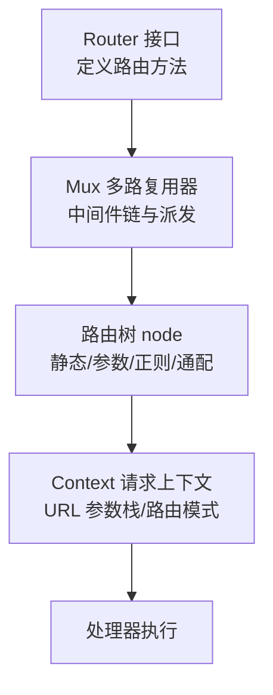
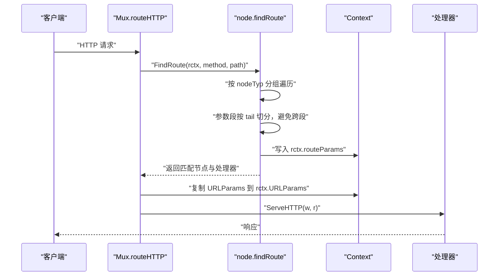
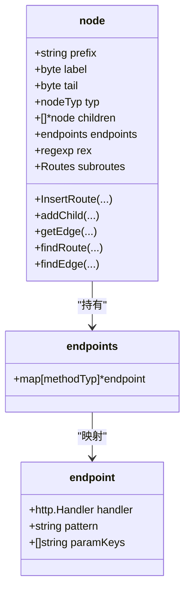
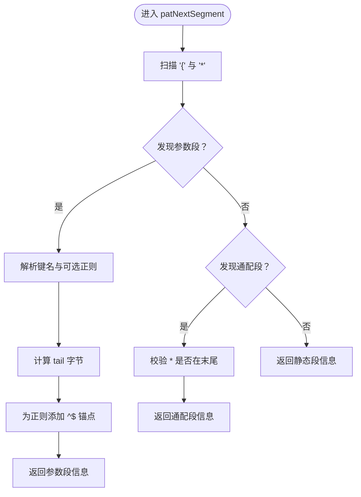
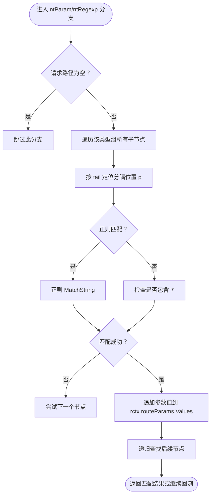
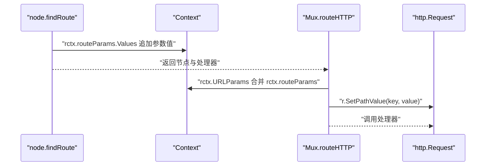
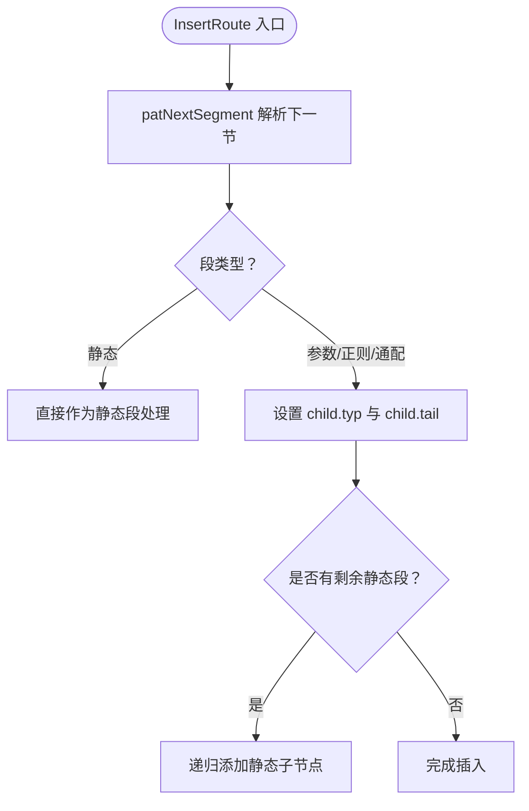
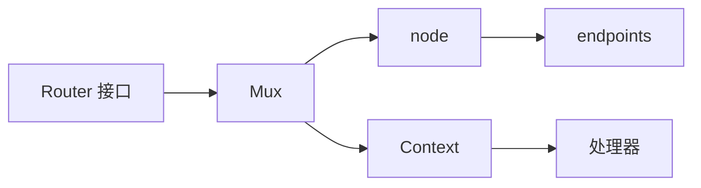

# 参数化路由

<cite>
**本文引用的文件列表**
- [chi.go](file://chi.go)
- [mux.go](file://mux.go)
- [tree.go](file://tree.go)
- [context.go](file://context.go)
- [pattern.go](file://pattern.go)
- [tree_test.go](file://tree_test.go)
- [_examples/pathvalue/main.go](file://_examples/pathvalue/main.go)
- [_examples/todos-resource/main.go](file://_examples/todos-resource/main.go)
- [README.md](file://README.md)
</cite>

## 目录
1. [简介](#简介)
2. [项目结构](#项目结构)
3. [核心组件](#核心组件)
4. [架构总览](#架构总览)
5. [详细组件分析](#详细组件分析)
6. [依赖关系分析](#依赖关系分析)
7. [性能考量](#性能考量)
8. [故障排查指南](#故障排查指南)
9. [结论](#结论)
10. [附录](#附录)

## 简介
本章节聚焦于 chi 框架中“参数化路由”（/{param}）的实现原理，系统性解析：
- 路由树中 node 结构体的 ntParam 类型节点如何组织与匹配
- patNextSegment 函数如何解析路径中的参数段
- 分隔符尾字节（tail byte）在参数匹配中的作用
- 参数值在 Context 中的存储与访问方式
- 参数化路由在路由树中的组织结构与查找流程
- 实际使用示例：如何定义与使用参数化路由，以及如何通过 Context 或 PathValue 获取 URL 参数
- 性能特征与常见使用场景

## 项目结构
chi 的参数化路由能力由以下模块协同完成：
- 路由器接口与方法：定义路由注册与匹配入口
- 多路复用器（Mux）：负责中间件链、请求派发与路由树查找
- 路由树（Radix Tree）：以 node 为节点，按静态段、参数段、正则段、通配段组织
- 上下文（Context）：承载路由模式、URL 参数栈、方法允许集合等
- 模式解析：将路由模式拆分为段，识别参数段与尾分隔符
- 示例与测试：验证参数化路由行为与性能

图表来源
- [chi.go](file://chi.go#L64-L138)
- [mux.go](file://mux.go#L1-L120)
- [tree.go](file://tree.go#L78-L128)
- [context.go](file://context.go#L42-L110)

章节来源
- [chi.go](file://chi.go#L64-L138)
- [mux.go](file://mux.go#L1-L120)
- [tree.go](file://tree.go#L78-L128)
- [context.go](file://context.go#L42-L110)

## 核心组件
- 路由树节点类型（nodeTyp）
  - 静态段（ntStatic）
  - 正则段（ntRegexp）
  - 参数段（ntParam）
  - 通配段（ntCatchAll）
- 节点结构（node）
  - typ：节点类型
  - prefix：公共前缀
  - label：首字节
  - tail：尾分隔符字节
  - children：按类型分组的子节点数组
  - endpoints：方法到处理器映射
  - rex：正则表达式（仅 ntRegexp）
  - subroutes：子路由（可选）
- 模式解析（patNextSegment）
  - 解析下一个段：类型、键名、正则串、尾字节、起止索引
- 查找流程（findRoute）
  - 对每个 nodeTyp 组进行遍历与匹配
  - 参数段按 tail 字节切分，避免跨段匹配
  - 将匹配到的参数值写入 rctx.routeParams
- 上下文（Context）
  - URLParams：参数键值对栈
  - routeParams：当前子路由器匹配到的参数
  - RoutePatterns：匹配到的路由模式栈
  - 提供 URLParam(key) 从栈顶开始查找最近的同名参数

章节来源
- [tree.go](file://tree.go#L78-L128)
- [tree.go](file://tree.go#L684-L752)
- [tree.go](file://tree.go#L373-L543)
- [context.go](file://context.go#L42-L110)
- [context.go](file://context.go#L146-L156)

## 架构总览
参数化路由的端到端流程如下：

图表来源
- [mux.go](file://mux.go#L440-L487)
- [tree.go](file://tree.go#L373-L543)
- [context.go](file://context.go#L42-L110)

## 详细组件分析

### 节点类型与路由树组织
- 节点类型
  - ntStatic：纯静态路径段
  - ntParam：命名参数段 {name}
  - ntRegexp：带正则约束的参数段 {name:regexp}
  - ntCatchAll：通配段 *
- 路由树插入
  - addChild 会根据下一个段类型创建对应子节点
  - 若段以参数开头，则设置 child.typ 与 child.tail
  - 若存在剩余静态段，递归添加静态子节点
- 边查找
  - getEdge 会同时比较 label 与 tail，确保参数段匹配正确
  - findEdge 使用二分查找定位静态/参数/正则边

图表来源
- [tree.go](file://tree.go#L78-L128)
- [tree.go](file://tree.go#L114-L128)

章节来源
- [tree.go](file://tree.go#L230-L316)
- [tree.go](file://tree.go#L318-L341)
- [tree.go](file://tree.go#L343-L371)
- [tree.go](file://tree.go#L330-L341)
- [tree.go](file://tree.go#L545-L571)

### 模式解析：patNextSegment
- 功能：从路由模式中解析下一个段，返回类型、键名、正则串、尾字节、起止索引
- 关键点
  - 识别 {name:regexp} 与 {name} 两种形式
  - 计算 tail：若参数后紧邻字符则作为尾分隔符；默认为 /
  - 正则自动加前后锚点（^/$），确保整段匹配
- 错误检查
  - 检查 * 必须位于末尾
  - 缺少闭合 } 时抛出异常

图表来源
- [tree.go](file://tree.go#L684-L752)

章节来源
- [tree.go](file://tree.go#L684-L752)

### 参数段匹配与 tail byte 的作用
- 匹配策略
  - findRoute 在 ntParam/ntRegexp 分支中，先检查空输入短路
  - 遍历该类型组的所有子节点，按 label 二分查找
  - 对每个候选节点，按其 tail 字节定位分隔位置 p
  - 若为 ntRegexp，使用预编译正则匹配；否则检查是否包含 /
  - 将匹配到的片段追加到 rctx.routeParams.Values
- tail byte 的意义
  - 用于限定参数边界，避免跨段匹配
  - 默认 tail 为 /，当参数后紧跟非 / 字符时，tail 即为该字符
  - 这保证了参数只在段内有效，例如 {id} 不会错误地吞掉 /foo 后缀

图表来源
- [tree.go](file://tree.go#L418-L500)
- [tree.go](file://tree.go#L400-L543)

章节来源
- [tree.go](file://tree.go#L400-L543)

### 参数提取与 Context 存储
- 参数提取
  - findRoute 在匹配到参数段时，将参数值追加到 rctx.routeParams.Values
  - 当到达叶子节点且方法匹配时，将 paramKeys 与 handler 写入 endpoints
- Context 存储
  - rctx.routeParams：当前子路由器匹配到的参数（临时）
  - rctx.URLParams：累积的参数栈（最终对外可见）
  - FindRoute 会在返回前将 rctx.routeParams 合并到 rctx.URLParams
- 参数访问
  - URLParam(r, key) 从 r.Context 中取出 RouteContext，再调用 URLParam(key)
  - Context.URLParam(key) 从 URLParams.Keys 从后向前查找最近的同名参数

图表来源
- [tree.go](file://tree.go#L373-L396)
- [mux.go](file://mux.go#L440-L487)
- [context.go](file://context.go#L98-L107)

章节来源
- [tree.go](file://tree.go#L373-L396)
- [mux.go](file://mux.go#L440-L487)
- [context.go](file://context.go#L98-L107)

### 路由树插入与参数段组织
- 插入流程
  - InsertRoute 逐段解析，遇到参数段时调用 patNextSegment 获取类型与尾字节
  - addChild 根据段类型创建子节点：若以参数开头，设置 child.typ 与 child.tail，并递归添加剩余静态段
- 组织结构
  - 静态段与参数段交错排列，参数段的 tail 决定其边界
  - 正则段在插入时编译正则，匹配时直接使用

图表来源
- [tree.go](file://tree.go#L138-L228)
- [tree.go](file://tree.go#L230-L316)
- [tree.go](file://tree.go#L253-L311)

章节来源
- [tree.go](file://tree.go#L138-L228)
- [tree.go](file://tree.go#L230-L316)

### 实际使用示例与最佳实践
- 定义参数化路由
  - 使用 {name} 或 {name:regexp} 形式
  - 可在同一路径中串联多个参数段
- 访问参数
  - 使用 URLParam(r, "key") 从请求上下文中取值
  - 使用 r.PathValue("key")（Go 1.23+）直接从请求对象取值
- 示例参考
  - _examples/pathvalue/main.go 展示了通过 r.PathValue 获取参数
  - _examples/todos-resource/main.go 展示了子路由挂载与参数化路径的组合使用

章节来源
- [_examples/pathvalue/main.go](file://_examples/pathvalue/main.go#L1-L26)
- [_examples/todos-resource/main.go](file://_examples/todos-resource/main.go#L1-L31)

## 依赖关系分析
- 路由器接口 Router 与多路复用器 Mux
  - Router 定义路由注册与匹配方法
  - Mux 实现中间件链与请求派发，内部持有路由树
- 路由树 node 与 endpoints
  - node 按类型组织子节点，endpoints 记录方法到处理器映射
  - node.findRoute 与 Mux.routeHTTP 协作完成匹配与执行
- 上下文 Context
  - 承载路由模式、参数栈、方法允许集合
  - URLParam 与 RouteContext 提供参数访问与上下文检索

图表来源
- [chi.go](file://chi.go#L64-L138)
- [mux.go](file://mux.go#L1-L120)
- [tree.go](file://tree.go#L114-L128)
- [context.go](file://context.go#L42-L110)

章节来源
- [chi.go](file://chi.go#L64-L138)
- [mux.go](file://mux.go#L1-L120)
- [tree.go](file://tree.go#L114-L128)
- [context.go](file://context.go#L42-L110)

## 性能考量
- 路由树采用基数树（Radix Tree）结构，查找复杂度近似 O(L)，L 为路径长度
- 参数段匹配通过 tail byte 限制范围，避免不必要的回溯
- Context 使用 sync.Pool 复用，减少每请求分配
- 测试与基准显示参数化路由具有较低的分配与耗时
  - BenchmarkChi_GPlusParam、BenchmarkChi_GPlus2Params 等指标表明参数化路由开销低
- 建议
  - 合理设计参数边界（tail），避免过长参数导致匹配失败
  - 使用正则约束参数格式，减少歧义匹配
  - 控制参数数量，避免过多串联导致匹配成本上升

章节来源
- [README.md](file://README.md#L452-L461)
- [mux.go](file://mux.go#L54-L92)
- [tree.go](file://tree.go#L418-L500)

## 故障排查指南
- 常见问题与定位
  - 参数未匹配：检查 tail byte 是否与路径分隔一致；确认参数后是否缺少分隔符
  - 正则无效：确认正则已自动添加 ^$，并符合预期
  - 重复参数键：模式中不允许重复键名
  - 通配符位置错误：* 必须位于末尾
- 定位手段
  - 使用 Mux.Find 或 Mux.Match 检查模式匹配结果
  - 在中间件中打印 rctx.URLParams 与 rctx.RoutePatterns
  - 参考测试用例验证期望行为

章节来源
- [tree.go](file://tree.go#L684-L752)
- [tree.go](file://tree.go#L754-L770)
- [mux.go](file://mux.go#L353-L394)
- [tree_test.go](file://tree_test.go#L1-L200)
- [tree_test.go](file://tree_test.go#L276-L410)

## 结论
chi 的参数化路由通过“尾字节（tail byte）+ 路径分段”的策略，在保证语义清晰的同时实现了高效的匹配与参数提取。路由树以 node 为单位按类型组织，参数段与静态段交错，配合 Context 的参数栈管理，使得参数访问简单可靠。结合正则约束与通配段，能够覆盖大多数 REST 与资源型路由场景。性能方面，基数树与上下文池化设计使其在高并发下仍保持较低开销。

## 附录
- 关键 API 与路径
  - 路由注册与匹配：[chi.go](file://chi.go#L64-L138)
  - 多路复用器派发与参数注入：[mux.go](file://mux.go#L440-L487)
  - 路由树插入与查找：[tree.go](file://tree.go#L138-L228), [tree.go](file://tree.go#L373-L543)
  - 模式解析：[tree.go](file://tree.go#L684-L752)
  - 上下文参数访问：[context.go](file://context.go#L98-L107)
  - Go 1.23+ Pattern 设置：[pattern.go](file://pattern.go#L1-L17)
  - 示例：参数化路由与 PathValue：[_examples/pathvalue/main.go](file://_examples/pathvalue/main.go#L1-L26)
  - 示例：子路由与参数化路径：[_examples/todos-resource/main.go](file://_examples/todos-resource/main.go#L1-L31)
  - 行为验证与测试：[tree_test.go](file://tree_test.go#L1-L200), [tree_test.go](file://tree_test.go#L276-L410)