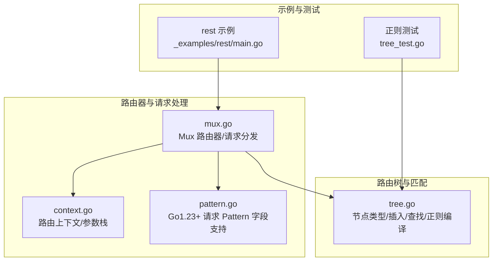
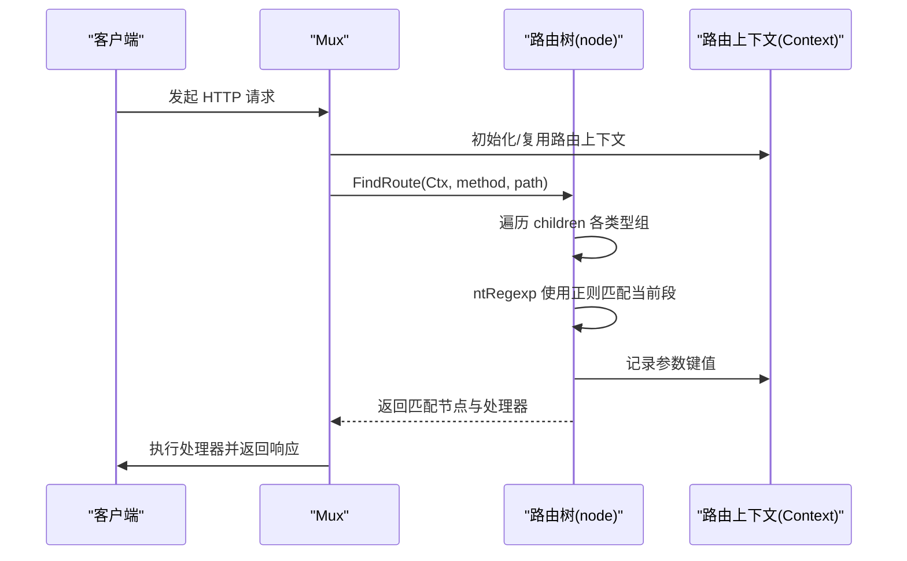
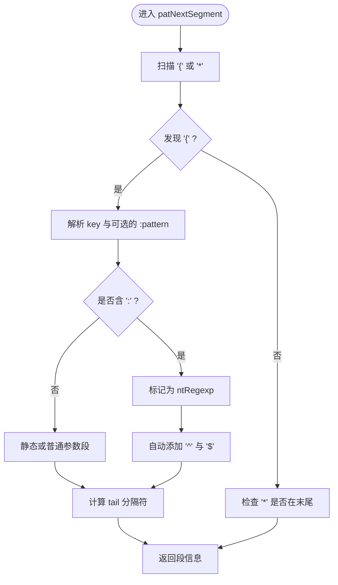
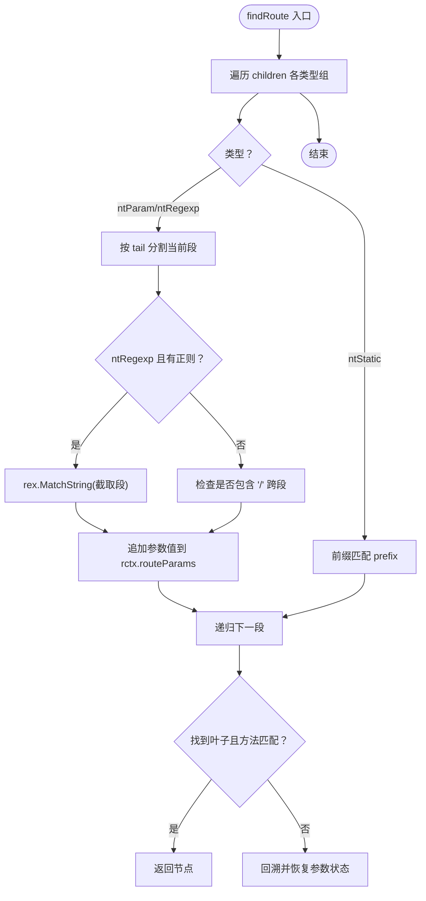
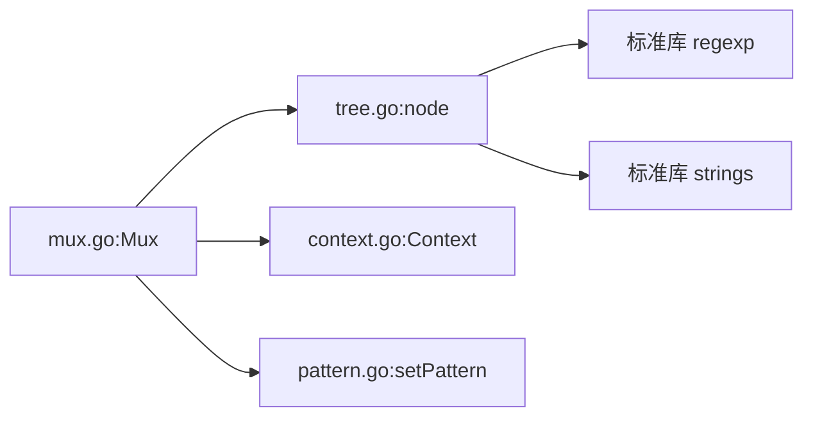

# 正则表达式路由

<cite>
**本文引用的文件**
- [tree.go](file://tree.go)
- [mux.go](file://mux.go)
- [context.go](file://context.go)
- [pattern.go](file://pattern.go)
- [tree_test.go](file://tree_test.go)
- [_examples/rest/main.go](file://_examples/rest/main.go)
</cite>

## 目录
1. [简介](#简介)
2. [项目结构](#项目结构)
3. [核心组件](#核心组件)
4. [架构总览](#架构总览)
5. [详细组件分析](#详细组件分析)
6. [依赖关系分析](#依赖关系分析)
7. [性能考量](#性能考量)
8. [故障排查指南](#故障排查指南)
9. [结论](#结论)
10. [附录：示例与最佳实践](#附录示例与最佳实践)

## 简介
本文件聚焦于 chi 框架中“基于正则表达式的路由匹配”能力，系统性解析以下关键点：
- ntRegexp 类型节点的实现细节：正则表达式模式的编译、存储（rex 字段）、匹配执行过程
- patNextSegment 函数如何解析 {param:pattern} 格式的路由段，并说明正则表达式自动添加 ^ 和 $ 边界符的机制
- findRoute 方法中对正则节点的遍历匹配逻辑，以及如何确保正则匹配不跨越路径段
- 具体示例展示正则路由的定义方法与使用场景
- 性能优化建议，如避免复杂正则表达式

## 项目结构
围绕正则路由的核心代码主要集中在树形路由结构与路由查找逻辑中，同时包含上下文参数收集与请求处理链路。

图表来源
- [tree.go](file://tree.go#L78-L113)
- [mux.go](file://mux.go#L414-L487)
- [context.go](file://context.go#L42-L113)
- [pattern.go](file://pattern.go#L8-L17)
- [_examples/rest/main.go](file://_examples/rest/main.go#L78-L93)
- [tree_test.go](file://tree_test.go#L270-L334)

章节来源
- [tree.go](file://tree.go#L78-L113)
- [mux.go](file://mux.go#L414-L487)
- [context.go](file://context.go#L42-L113)
- [pattern.go](file://pattern.go#L8-L17)
- [_examples/rest/main.go](file://_examples/rest/main.go#L78-L93)
- [tree_test.go](file://tree_test.go#L270-L334)

## 核心组件
- 节点类型与正则节点
  - ntRegexp：表示带正则约束的参数段，节点内保存编译后的正则对象
  - 关键字段：typ、prefix、tail、rex（正则对象）
- 正则编译与存储
  - 在 addChild 中对 {param:pattern} 的 pattern 进行编译并存入 child.rex
- 匹配流程
  - findRoute 对各节点组进行遍历，针对 ntRegexp 使用正则匹配；通过 tail 分隔符限定参数范围，避免跨段匹配
- 上下文参数
  - routeParams 记录匹配到的参数键值，最终写入 http.Request 的 PathValue

章节来源
- [tree.go](file://tree.go#L78-L113)
- [tree.go](file://tree.go#L253-L316)
- [tree.go](file://tree.go#L398-L543)
- [context.go](file://context.go#L42-L113)

## 架构总览
chi 的路由树采用多维前缀树（radix trie），将静态段、参数段、正则段、通配段分别建模为不同类型的子节点。请求到来时，Mux 将路径交给树的查找算法，按顺序在各维度上尝试匹配，最终定位到叶子节点的处理器。

图表来源
- [mux.go](file://mux.go#L441-L487)
- [tree.go](file://tree.go#L398-L543)
- [context.go](file://context.go#L42-L113)

## 详细组件分析

### ntRegexp 节点与正则编译
- 节点类型
  - ntRegexp：用于承载带正则约束的参数段
- 编译与存储
  - 在 addChild 中，当识别到 ntRegexp 时，对 pattern 进行编译并保存到 child.rex
  - 若编译失败，触发 panic 提示无效的正则模式
- 存储位置
  - child.rex 保存编译后的正则对象，供后续匹配使用

章节来源
- [tree.go](file://tree.go#L78-L113)
- [tree.go](file://tree.go#L253-L316)

### patNextSegment：解析 {param:pattern} 并自动添加边界符
- 功能
  - 解析下一个路由段，返回段类型、参数名、正则串、尾分隔符、起止索引
- 关键逻辑
  - 从 { 开始扫描，匹配到 } 结束，提取 key:rex
  - 若存在冒号分隔的正则部分，则标记为 ntRegexp
  - 自动为正则串添加 ^ 和 $ 边界符（若缺失）
  - 计算 tail（默认 '/'），用于后续按段分割
- 错误处理
  - 缺少闭合 } 时 panic
  - wildcard '*' 必须位于末尾，否则 panic

图表来源
- [tree.go](file://tree.go#L684-L752)

章节来源
- [tree.go](file://tree.go#L684-L752)

### findRoute：正则节点遍历与匹配逻辑
- 控制流
  - 递归遍历 children 的各类型组（ntStatic、ntParam、ntRegexp、ntCatchAll）
  - 对 ntRegexp：先按 tail 分割当前段，再用 child.rex 进行正则匹配
  - 通过 strings.IndexByte(xsearch, xn.tail) 定位分隔，避免跨段匹配
  - 若匹配成功，将参数值追加到 rctx.routeParams，并递归进入下一段
- 关键约束
  - 当 tail 为 '/' 且未找到 '/' 时，p 设为 len(xsearch)，确保参数仅限于当前段
  - ntRegexp 且 p==0 时跳过，防止空参数参与匹配
  - 若字符串中出现 '/'，说明跨段，直接 continue
- 返回
  - 到达叶子节点且方法匹配时，返回该节点；否则继续回溯

图表来源
- [tree.go](file://tree.go#L398-L543)

章节来源
- [tree.go](file://tree.go#L398-L543)

### 参数收集与请求写入
- 参数栈
  - rctx.routeParams 作为参数栈，按匹配顺序追加键值
- 写入请求
  - routeHTTP 将 rctx.URLParams 的键值写入 http.Request 的 PathValue
- Pattern 字段（Go 1.23+）
  - setPattern 将匹配到的路由模式写入 r.Pattern

章节来源
- [context.go](file://context.go#L42-L113)
- [mux.go](file://mux.go#L441-L487)
- [pattern.go](file://pattern.go#L8-L17)

## 依赖关系分析
- 组件耦合
  - Mux 依赖 node.FindRoute 完成路由查找
  - node 在插入阶段完成正则编译，降低运行时开销
  - Context 负责参数与模式记录，贯穿整个匹配生命周期
- 外部依赖
  - 使用标准库 regexp 进行正则编译与匹配
  - 使用 strings 进行前缀匹配与分隔符处理

图表来源
- [mux.go](file://mux.go#L414-L487)
- [tree.go](file://tree.go#L253-L316)
- [context.go](file://context.go#L42-L113)
- [pattern.go](file://pattern.go#L8-L17)

章节来源
- [mux.go](file://mux.go#L414-L487)
- [tree.go](file://tree.go#L253-L316)
- [context.go](file://context.go#L42-L113)
- [pattern.go](file://pattern.go#L8-L17)

## 性能考量
- 正则编译时机
  - 在 InsertRoute 阶段完成编译，运行时仅做匹配，减少正则编译开销
- 匹配短路
  - findRoute 对空参数、跨段检测等进行早期短路，避免无谓的正则匹配
- 路径段限制
  - 通过 tail 分隔与 '/' 检查，确保正则只作用于当前段，避免全局扫描
- 建议
  - 避免过于复杂的正则，优先使用简单明确的模式
  - 合理利用静态段与参数段，减少 ntRegexp 的数量
  - 对高频路径尽量使用静态段或简单参数段

[本节为通用性能指导，无需特定文件引用]

## 故障排查指南
- 编译错误
  - 插入路由时若正则非法，会 panic 提示无效的正则模式
- 结构错误
  - 缺少 '}' 或 '*' 不在末尾会触发 panic
- 匹配失败
  - 检查 tail 分隔符是否正确，确认参数未跨段
  - 确认正则串是否已自动添加 ^/$，必要时显式提供边界符
- 参数未生效
  - 确认在处理器中通过 URLParam 获取参数
  - 确认 routeHTTP 已将参数写入 http.Request 的 PathValue

章节来源
- [tree.go](file://tree.go#L253-L316)
- [tree.go](file://tree.go#L684-L752)
- [mux.go](file://mux.go#L441-L487)
- [context.go](file://context.go#L42-L113)

## 结论
chi 的正则路由通过“段级正则匹配 + 边界符约束”的设计，在保证灵活性的同时兼顾了性能与安全性。核心在于：
- 在构建期完成正则编译，运行期专注匹配
- 通过 tail 与 '/' 检测，严格限制正则只作用于当前段
- 以 Context 为载体，统一管理参数与模式记录

[本节为总结性内容，无需特定文件引用]

## 附录：示例与最佳实践

### 示例一：REST 资源路由中的正则参数
- 路由定义
  - 在资源子路由中使用 {articleID} 并绑定正则约束
- 使用场景
  - 限定 ID 为数字，提升匹配准确性与安全性
- 参考路径
  - [REST 示例](file://_examples/rest/main.go#L78-L93)

章节来源
- [_examples/rest/main.go](file://_examples/rest/main.go#L78-L93)

### 示例二：多段正则组合
- 路由定义
  - 多个参数段分别带有不同的正则约束
- 使用场景
  - 复杂业务路径的精细化匹配
- 参考路径
  - [正则测试-多段](file://tree_test.go#L336-L385)

章节来源
- [tree_test.go](file://tree_test.go#L336-L385)

### 示例三：边界符与跨段检测
- 行为验证
  - 仅允许整段匹配，禁止跨段
- 参考路径
  - [正则匹配整段测试](file://tree_test.go#L387-L415)

章节来源
- [tree_test.go](file://tree_test.go#L387-L415)

### 最佳实践清单
- 明确边界
  - 正则串已自动添加 ^/$，如需自定义可显式提供
- 控制复杂度
  - 避免回溯严重的正则，优先使用简单字符类与量词
- 合理分段
  - 将静态段与参数段结合，减少 ntRegexp 的数量
- 参数命名
  - 使用语义化参数名，便于在处理器中读取

[本节为通用指导，无需特定文件引用]