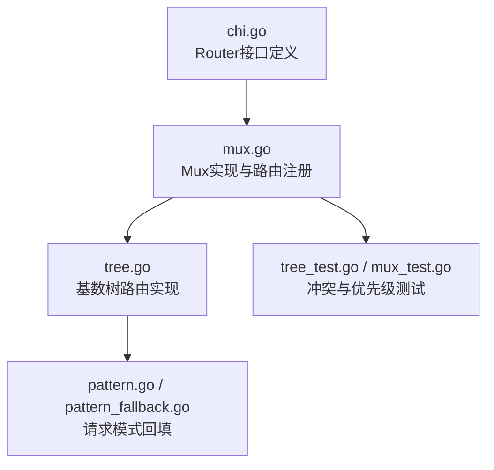
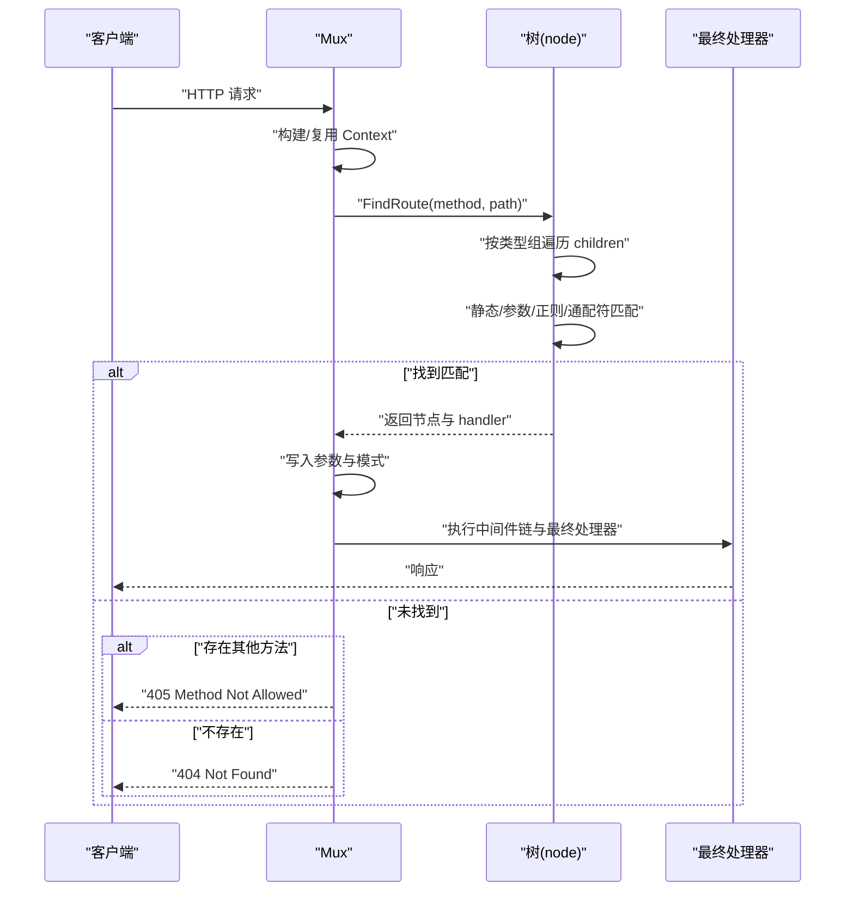
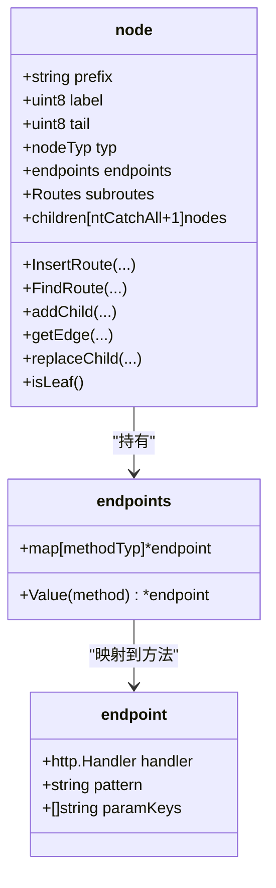
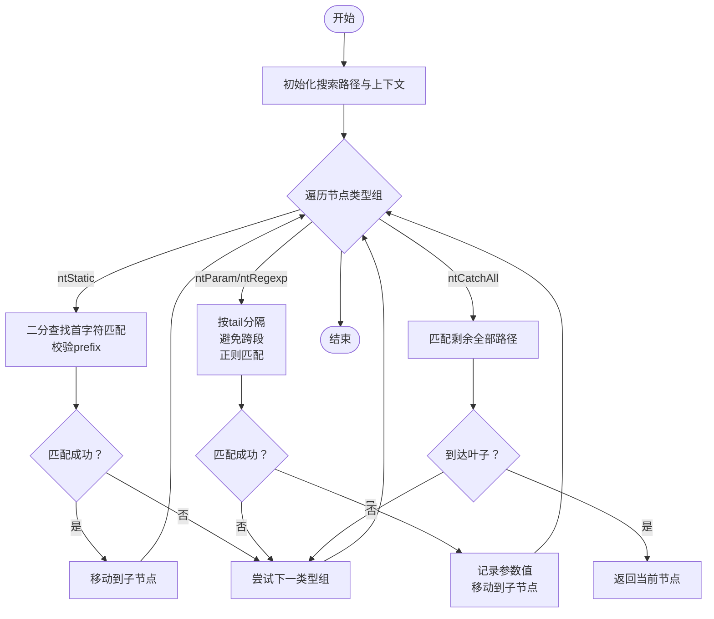
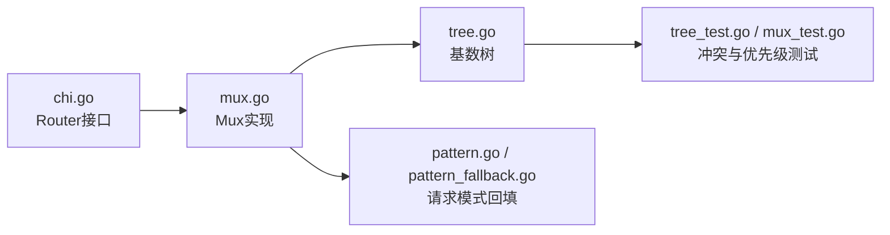

# 路由优先级与冲突处理

<cite>
**本文引用的文件**
- [chi.go](file://chi.go)
- [mux.go](file://mux.go)
- [tree.go](file://tree.go)
- [pattern.go](file://pattern.go)
- [pattern_fallback.go](file://pattern_fallback.go)
- [tree_test.go](file://tree_test.go)
- [mux_test.go](file://mux_test.go)
</cite>

## 目录
1. [引言](#引言)
2. [项目结构](#项目结构)
3. [核心组件](#核心组件)
4. [架构总览](#架构总览)
5. [详细组件分析](#详细组件分析)
6. [依赖关系分析](#依赖关系分析)
7. [性能考量](#性能考量)
8. [故障排查指南](#故障排查指南)
9. [结论](#结论)
10. [附录：最佳实践清单](#附录最佳实践清单)

## 引言
本篇文档系统阐述 chi 框架中多种路由类型的匹配优先级与冲突解决策略，重点解析静态路由、参数路由、正则路由与通配符路由在路由树中的遍历与选择顺序，以及如何通过节点类型分组、尾部排序（tailSort）等机制确保“最长前缀匹配”和“最具体路由优先”。同时结合测试用例，给出典型冲突场景与框架的处理方式，并提供面向开发者的最佳实践建议。

## 项目结构
- chi.go 定义了 Router 接口与常用方法，是对外 API 的入口。
- mux.go 实现了 Mux，负责中间件链、路由注册、请求分发与 NotFound/MethodNotAllowed 处理。
- tree.go 实现了基于基数树（radix trie）的路由树，包含节点类型、插入、查找、排序与通配符处理。
- pattern.go/pattern_fallback.go 提供 Go 1.23+ 下将匹配到的路由模式写入 http.Request 的能力。
- tree_test.go 与 mux_test.go 包含大量覆盖不同路由类型与冲突场景的测试，是理解优先级与冲突处理的重要依据。

图表来源
- [chi.go](file://chi.go#L60-L138)
- [mux.go](file://mux.go#L1-L120)
- [tree.go](file://tree.go#L78-L128)
- [pattern.go](file://pattern.go#L1-L17)
- [pattern_fallback.go](file://pattern_fallback.go#L1-L18)
- [tree_test.go](file://tree_test.go#L1-L120)
- [mux_test.go](file://mux_test.go#L100-L160)

章节来源
- [chi.go](file://chi.go#L60-L138)
- [mux.go](file://mux.go#L1-L120)
- [tree.go](file://tree.go#L78-L128)

## 核心组件
- 路由接口与方法：Router 定义了 Handle/Method/Get/Put/Delete 等方法，Mux 实现这些方法并通过内部树进行路由注册与查找。
- 基数树节点：node 结构体包含 prefix、children、endpoints、subroutes 等字段；children 按节点类型分组存储，支持静态、参数、正则、通配符四类节点。
- 节点类型与优先级：ntStatic < ntParam < ntRegexp < ntCatchAll，树在遍历时按类型顺序检查，且同一类型内按 label 排序，参数节点再通过 tailSort 将以 “/” 作为尾分隔符的节点排在末尾，从而实现“更具体优先”。

章节来源
- [chi.go](file://chi.go#L60-L138)
- [mux.go](file://mux.go#L100-L220)
- [tree.go](file://tree.go#L78-L128)
- [tree.go](file://tree.go#L138-L228)
- [tree.go](file://tree.go#L784-L800)

## 架构总览
chi 的路由查找流程如下：
- 请求进入 Mux.ServeHTTP 后，构建或复用 Context，调用 Mux.routeHTTP。
- routeHTTP 解析方法与路径，委托给树的 FindRoute 进行查找。
- 树的 findRoute 递归遍历 children，按节点类型组顺序尝试匹配：
  - 静态段：按首字符二分查找匹配 prefix。
  - 参数段：按 tail 分隔符切分，避免跨段匹配；正则段需满足正则。
  - 通配符：匹配剩余全部路径。
- 若某分支未命中但已到达叶子节点，记录允许的方法集合，用于 MethodNotAllowed 响应。
- 找到匹配后，将参数与模式写入 Context，并交由中间件链与最终 Handler 执行。

图表来源
- [mux.go](file://mux.go#L440-L487)
- [tree.go](file://tree.go#L373-L543)

章节来源
- [mux.go](file://mux.go#L440-L487)
- [tree.go](file://tree.go#L373-L543)

## 详细组件分析

### 路由树节点与类型分组
- 节点类型定义：静态、参数、正则、通配符。
- 子节点数组按类型分组存储，每组内部按 label 升序排序，便于快速定位。
- 参数节点的 tailSort 将以 “/” 作为 tail 的节点排到最后，使“更具体的参数匹配”优先于“以斜杠为分隔的参数”，从而保证最长前缀与更具体优先。

图表来源
- [tree.go](file://tree.go#L78-L128)
- [tree.go](file://tree.go#L114-L128)

章节来源
- [tree.go](file://tree.go#L78-L128)
- [tree.go](file://tree.go#L784-L800)

### 插入与覆盖规则
- InsertRoute 在插入过程中会拆分公共前缀，必要时分裂节点，确保静态、参数、正则、通配符段落被拆分为独立节点。
- 当同一路径在同一方法上重复注册时，后者会覆盖前者（latest wins），这在测试中有明确体现。

章节来源
- [tree.go](file://tree.go#L138-L228)
- [tree_test.go](file://tree_test.go#L40-L70)
- [mux_test.go](file://mux_test.go#L100-L120)

### 查找与优先级顺序
- findRoute 对每个父节点的 children 按类型组顺序遍历：
  - ntStatic：按首字符二分查找，匹配 prefix。
  - ntParam/ntRegexp：按 tail 分隔，避免跨段；正则节点需满足正则；空值短路。
  - ntCatchAll：匹配剩余全部路径。
- 若某分支未命中但已到达叶子节点，记录允许的方法集合，用于 MethodNotAllowed。
- 由于同一类型内按 label 排序，且参数节点 tailSort 将以 “/” 为 tail 的节点排在末尾，因此：
  - 更长的静态前缀优先；
  - 更具体的参数段优先；
  - 正则段在满足条件时优先；
  - 通配符仅在前面都未命中时才考虑。

图表来源
- [tree.go](file://tree.go#L398-L543)
- [tree.go](file://tree.go#L784-L800)

章节来源
- [tree.go](file://tree.go#L398-L543)
- [tree.go](file://tree.go#L784-L800)

### 冲突场景与处理策略
- 同一路径同方法重复注册：后者覆盖前者（latest wins）。
  - 示例：多次注册相同路径，后者覆盖前者；删除方法的参数路由覆盖 GET 的同路径参数路由。
- 参数与静态冲突：静态前缀更长优先。
  - 示例：静态 “/admin/user” 与参数 “/admin/user/{id}” 同时存在时，静态先匹配。
- 参数与通配符冲突：参数优先于通配符（tailSort 将以 “/” 为 tail 的参数节点排在末尾，从而在同层比较时优先匹配非 “/” 尾的参数或静态）。
- 正则与参数冲突：满足正则约束的正则优先；否则参数优先。
- 子路由挂载冲突：Mount 会在同一模式下挂载子路由，若已有相同模式会 panic，避免覆盖。

章节来源
- [tree_test.go](file://tree_test.go#L40-L70)
- [tree_test.go](file://tree_test.go#L154-L203)
- [mux.go](file://mux.go#L282-L340)

### 最长前缀匹配与最具体优先
- 最长前缀：静态段通过公共前缀匹配实现，插入时会按公共前缀拆分节点，确保更长的静态前缀优先。
- 最具体优先：参数段按 tail 分隔，避免跨段；正则段满足约束；通配符仅在前面都未命中时使用。
- tailSort：将以 “/” 为 tail 的参数节点排到最后，使“更具体的参数匹配”优先于“以斜杠为分隔的参数”，从而保证“最具体优先”。

章节来源
- [tree.go](file://tree.go#L190-L227)
- [tree.go](file://tree.go#L784-L800)

### 方法不匹配与 405 处理
- 当路径匹配但方法不支持时，记录允许的方法集合，返回 405 并设置 Allow 头。
- Mux 在路由查找失败且存在允许方法时，调用 MethodNotAllowedHandler。

章节来源
- [tree.go](file://tree.go#L460-L525)
- [mux.go](file://mux.go#L414-L487)

### 请求模式回填（Go 1.23+）
- 在 Go 1.23 及以上版本，框架会将匹配到的路由模式写入 http.Request 的 Pattern 字段，便于日志与调试。
- 低版本或 tinygo 时不支持该特性。

章节来源
- [pattern.go](file://pattern.go#L1-L17)
- [pattern_fallback.go](file://pattern_fallback.go#L1-L18)
- [mux.go](file://mux.go#L470-L478)

## 依赖关系分析
- Mux 依赖树进行路由注册与查找；树负责节点类型分组与排序；Chi 接口定义路由 API。
- 测试文件覆盖了静态、参数、正则、通配符与子路由挂载等场景，验证优先级与冲突处理。

图表来源
- [chi.go](file://chi.go#L60-L138)
- [mux.go](file://mux.go#L1-L120)
- [tree.go](file://tree.go#L78-L128)
- [tree_test.go](file://tree_test.go#L1-L120)
- [mux_test.go](file://mux_test.go#L100-L160)

章节来源
- [chi.go](file://chi.go#L60-L138)
- [mux.go](file://mux.go#L1-L120)
- [tree.go](file://tree.go#L78-L128)
- [tree_test.go](file://tree_test.go#L1-L120)
- [mux_test.go](file://mux_test.go#L100-L160)

## 性能考量
- 基数树查找：静态段通过公共前缀与二分查找，参数/正则段按 tail 分隔，通配符仅在最后考虑，整体查找复杂度接近 O(L)，L 为路径长度。
- 排序与 tailSort：每组节点按 label 排序，参数节点再做 tailSort，减少无效分支尝试，提升命中效率。
- 中间件链：Mux 在首次注册路由后构建中间件链，后续请求直接复用，避免重复组装。

章节来源
- [tree.go](file://tree.go#L398-L543)
- [tree.go](file://tree.go#L784-L800)
- [mux.go](file://mux.go#L509-L516)

## 故障排查指南
- 404 未找到：确认路径是否正确注册，是否存在通配符覆盖导致的意外匹配。
- 405 方法不允许：检查路径是否注册了其他方法；框架会返回允许的方法列表。
- 路由覆盖问题：若发现后注册的路由未生效，请检查是否在同一方法上重复注册，后者会覆盖前者。
- 子路由挂载冲突：在同一模式下重复挂载会触发 panic，避免覆盖。
- 参数与静态冲突：若期望静态优先，请调整路径设计，确保静态前缀更长或避免歧义。

章节来源
- [mux.go](file://mux.go#L414-L487)
- [mux.go](file://mux.go#L282-L340)
- [tree_test.go](file://tree_test.go#L40-L70)
- [mux_test.go](file://mux_test.go#L100-L120)

## 结论
chi 通过基数树与严格的节点类型分组、排序与 tailSort，实现了“最长前缀匹配 + 最具体优先”的路由匹配策略。在冲突场景中，框架遵循“latest wins”覆盖规则，并通过 MethodNotAllowed 与 NotFound 提供清晰的错误反馈。开发者应充分利用静态前缀、参数 tail 设计与通配符的合理组合，避免歧义路径，确保路由行为可预期。

## 附录：最佳实践清单
- 避免参数与静态路径的歧义：尽量让静态前缀更长，或显式区分参数与静态段。
- 使用 tailSort 的语义：以 “/” 为 tail 的参数通常更具体，避免在同层出现以 “/” 为 tail 的参数与静态段造成混淆。
- 正则约束要完整：确保正则只匹配整个参数，避免跨段匹配。
- 通配符慎用：仅在末尾使用，避免覆盖更具体的静态/参数路由。
- 子路由挂载：避免在同一模式下重复挂载，防止 panic。
- 覆盖策略：如需覆盖，确保在同一方法上重复注册，后者生效；跨方法请使用不同路径。