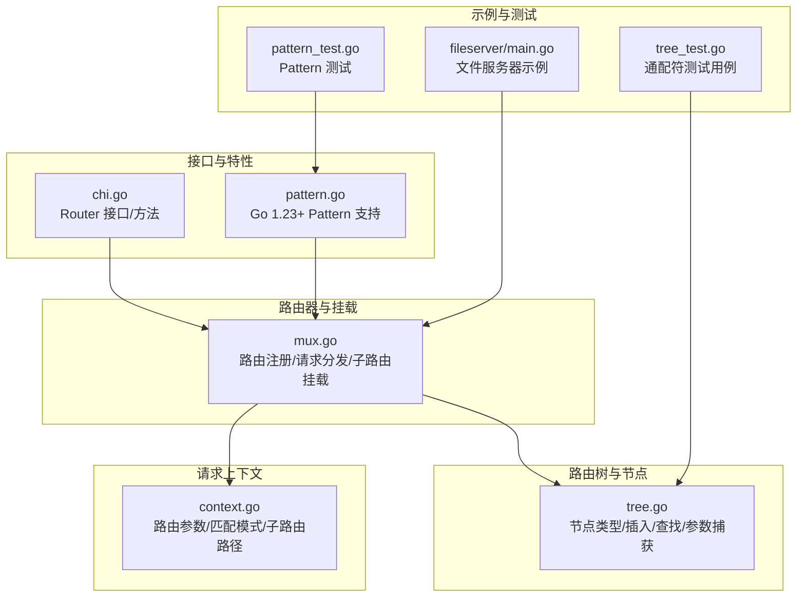
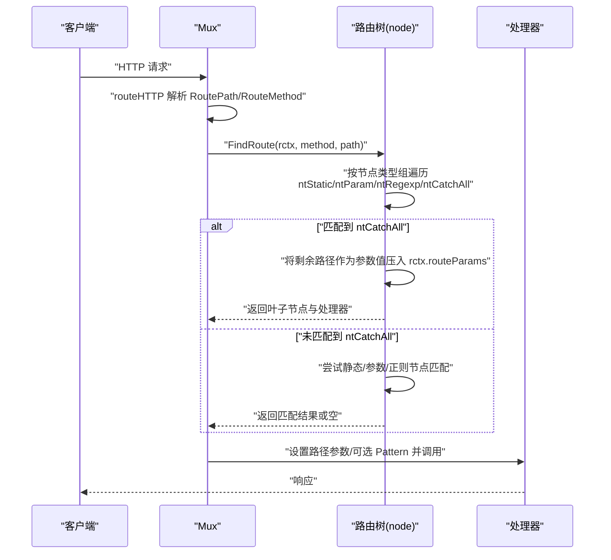
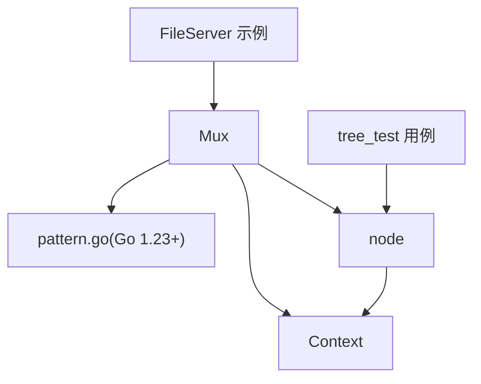

# 通配符路由

<cite>
**本文引用的文件**
- [tree.go](file://tree.go)
- [mux.go](file://mux.go)
- [context.go](file://context.go)
- [chi.go](file://chi.go)
- [pattern.go](file://pattern.go)
- [pattern_test.go](file://pattern_test.go)
- [_examples/fileserver/main.go](file://_examples/fileserver/main.go)
- [tree_test.go](file://tree_test.go)
</cite>

## 目录
1. [引言](#引言)
2. [项目结构](#项目结构)
3. [核心组件](#核心组件)
4. [架构总览](#架构总览)
5. [详细组件分析](#详细组件分析)
6. [依赖分析](#依赖分析)
7. [性能考量](#性能考量)
8. [故障排查指南](#故障排查指南)
9. [结论](#结论)
10. [附录](#附录)

## 引言
本篇文档聚焦于 chi 框架中“通配符路由（/*）”的实现机制，系统阐述 ntCatchAll 类型节点的特殊性、在路由树中的唯一性与优先级策略、通配符节点的插入规则（尤其是必须位于路由模式末尾的约束）、findRoute 方法对通配符节点的处理流程，以及如何将剩余路径作为单个参数值捕获。同时结合源码示例，展示通配符路由在文件服务器与子路由挂载等典型场景中的应用，并讨论通配符路由与其他路由类型的优先级关系与潜在陷阱。

## 项目结构
围绕通配符路由的关键代码分布在以下模块：
- 路由树与节点：tree.go 定义了节点类型、插入与查找逻辑、参数捕获与优先级排序。
- 路由器与挂载：mux.go 提供路由注册、请求分发、子路由挂载与通配符挂载的安全检查。
- 请求上下文：context.go 管理路由参数、匹配模式、子路由路径等。
- 文档与版本特性：chi.go 与 pattern.go 提供接口定义与 Go 1.23+ 的 Pattern 字段支持。
- 示例与测试：_examples/fileserver/main.go 展示文件服务器用法；tree_test.go 与 pattern_test.go 验证行为与边界。

图表来源
- [tree.go](file://tree.go#L78-L112)
- [mux.go](file://mux.go#L414-L437)
- [context.go](file://context.go#L45-L110)
- [chi.go](file://chi.go#L64-L114)
- [pattern.go](file://pattern.go#L9-L17)
- [_examples/fileserver/main.go](file://_examples/fileserver/main.go#L46-L66)
- [tree_test.go](file://tree_test.go#L100-L126)
- [pattern_test.go](file://pattern_test.go#L12-L57)

章节来源
- [tree.go](file://tree.go#L78-L112)
- [mux.go](file://mux.go#L414-L437)
- [context.go](file://context.go#L45-L110)
- [chi.go](file://chi.go#L64-L114)
- [pattern.go](file://pattern.go#L9-L17)
- [_examples/fileserver/main.go](file://_examples/fileserver/main.go#L46-L66)
- [tree_test.go](file://tree_test.go#L100-L126)
- [pattern_test.go](file://pattern_test.go#L12-L57)

## 核心组件
- 节点类型与通配符节点
  - ntCatchAll 是节点类型枚举中的一个分支，用于表示“通配符”节点。
  - 在路由树中，ntCatchAll 节点具有唯一性：同一层级仅允许存在一个通配符节点，且其遍历顺序被特别处理以确保优先级。
- 插入规则
  - 通配符“*”必须出现在路由模式的末尾；否则会触发校验错误。
  - 当路由以“*”开头或中间出现时，会被视为非法模式，插入阶段即抛出异常。
- 查找与参数捕获
  - findRoute 对不同节点类型进行分组遍历；当遇到 ntCatchAll 分支时，会将剩余路径整体作为参数值压入 rctx.routeParams.Values，并将搜索指针置空，从而完成匹配。
- 子路由挂载
  - Mount 将处理器挂载到“pattern/*”，并在必要时为子路由设置通配符参数，以便后续子路由继续匹配。

章节来源
- [tree.go](file://tree.go#L78-L112)
- [tree.go](file://tree.go#L684-L752)
- [tree.go](file://tree.go#L398-L542)
- [mux.go](file://mux.go#L282-L340)

## 架构总览
下图展示了从请求进入路由器到匹配通配符路由并执行处理器的整体流程。

图表来源
- [mux.go](file://mux.go#L441-L487)
- [tree.go](file://tree.go#L373-L542)
- [context.go](file://context.go#L45-L110)
- [pattern.go](file://pattern.go#L9-L17)

## 详细组件分析

### ntCatchAll 类型节点的特殊性
- 唯一性
  - 在同一父节点的子节点数组中，ntCatchAll 类型节点只允许存在一个，且其遍历顺序被置于最后，确保静态/参数/正则节点优先匹配，避免通配符吞噬更具体的路由。
- 优先级处理
  - nodes.tailSort 将以“/”为尾分隔符的参数节点排在末尾，而 findEdge 对 ntCatchAll 的默认取第一个子节点，保证通配符在所有同级节点之后被考虑。
- 参数捕获
  - 在 findRoute 中，当进入 ntCatchAll 分支时，直接将剩余完整路径作为参数值压入 rctx.routeParams.Values，并将搜索指针置空，从而立即完成匹配。

章节来源
- [tree.go](file://tree.go#L78-L112)
- [tree.go](file://tree.go#L545-L571)
- [tree.go](file://tree.go#L494-L500)
- [tree.go](file://tree.go#L573-L575)

### 通配符节点的插入规则
- 模式校验
  - patNextSegment 对“*”进行严格位置校验：若“*”不在路由末尾，或“*”出现在“{...}”之前，将触发 panic，提示必须位于末尾或改用命名参数。
- 插入过程
  - addChild 在路由起始处识别“*”后，将其标记为 ntCatchAll，并将剩余部分作为静态边追加，确保“*”始终处于末尾。
- 安全挂载
  - Mount 在挂载前检查是否已存在“pattern*”或“pattern/*”模式，避免重复挂载导致冲突。

章节来源
- [tree.go](file://tree.go#L684-L752)
- [tree.go](file://tree.go#L230-L316)
- [mux.go](file://mux.go#L282-L340)

### findRoute 对通配符节点的处理流程
- 多维遍历
  - findRoute 对每个节点类型组进行遍历，ntCatchAll 分支单独处理。
- 匹配与回溯
  - 对于 ntCatchAll，直接将剩余路径作为参数值压入 rctx.routeParams.Values，并将 xsearch 置空，随后递归进入子节点；若子节点无匹配，则回溯并移除该参数值。
- 叶子节点判定
  - 若当前节点为叶子节点且存在对应方法的处理器，则返回该节点；否则记录允许的方法集合以生成 405 响应。

章节来源
- [tree.go](file://tree.go#L398-L542)
- [context.go](file://context.go#L45-L110)

### 将剩余路径作为单个参数值捕获
- 参数键名
  - 通配符参数键名为“*”，在 setEndpoint 时记录 paramKeys，最终在路由上下文中暴露为 URL 参数。
- 参数值拼接
  - 在 findRoute 中，ntCatchAll 分支将剩余路径整体作为参数值压入 rctx.routeParams.Values，便于后续处理器读取。

章节来源
- [tree.go](file://tree.go#L343-L371)
- [tree.go](file://tree.go#L494-L500)
- [context.go](file://context.go#L146-L156)

### 典型应用场景示例

#### 文件服务器
- 使用方式
  - FileServer 将“/files/*”映射到文件系统，利用通配符捕获请求路径后通过 http.StripPrefix 去除前缀，再交由 http.FileServer 处理。
- 关键点
  - 路由中禁止包含“{}”或“*”，否则会 panic。
  - 通过 rctx.RoutePattern 获取原始匹配模式，再去除“/*”得到真实前缀。

章节来源
- [_examples/fileserver/main.go](file://_examples/fileserver/main.go#L46-L66)

#### 子路由挂载与代理
- 使用方式
  - Mount 将子路由器挂载到“pattern/*”，并在内部重置通配符参数，使子路由能继续匹配剩余路径。
- 关键点
  - 挂载前进行重复挂载检测，避免冲突。
  - nextRoutePath 基于最后一个“*”参数计算子路由的 RoutePath。

章节来源
- [mux.go](file://mux.go#L282-L340)
- [mux.go](file://mux.go#L489-L496)

### 优先级关系与潜在陷阱
- 优先级顺序
  - 遍历顺序：ntStatic -> ntParam -> ntRegexp -> ntCatchAll。静态与参数节点优先于通配符，避免通配符吞噬更具体路由。
- 潜在陷阱
  - 将通配符放在中间或前面会导致 panic 或不匹配预期。
  - 若存在更具体的静态/参数路由，通配符不会覆盖它们。
  - 在子路由挂载中，注意“pattern/*”与“pattern”之间的区别，避免重复挂载。

章节来源
- [tree.go](file://tree.go#L545-L571)
- [tree.go](file://tree.go#L684-L752)
- [mux.go](file://mux.go#L282-L340)

## 依赖分析
- 组件耦合
  - Mux 依赖 node.FindRoute 进行路由匹配；node 内部通过 nodes.tailSort 与 findEdge 控制遍历顺序；context 负责参数与模式的传递。
- 外部依赖
  - Go 1.23+ 版本支持 http.Request.Pattern 字段，通过 pattern.go 注入匹配模式，便于调试与日志输出。

图表来源
- [mux.go](file://mux.go#L441-L487)
- [tree.go](file://tree.go#L398-L542)
- [context.go](file://context.go#L45-L110)
- [pattern.go](file://pattern.go#L9-L17)
- [_examples/fileserver/main.go](file://_examples/fileserver/main.go#L46-L66)
- [tree_test.go](file://tree_test.go#L100-L126)

章节来源
- [mux.go](file://mux.go#L441-L487)
- [tree.go](file://tree.go#L398-L542)
- [context.go](file://context.go#L45-L110)
- [pattern.go](file://pattern.go#L9-L17)
- [_examples/fileserver/main.go](file://_examples/fileserver/main.go#L46-L66)
- [tree_test.go](file://tree_test.go#L100-L126)

## 性能考量
- 时间复杂度
  - 路由树为多维有序结构，findRoute 对每层节点类型组进行线性扫描；在最坏情况下，复杂度与节点数量成线性关系。
- 空间复杂度
  - 参数栈 rctx.routeParams 在回溯时可能增长，但通常与路径深度成正比。
- 优化建议
  - 合理组织路由层级，减少 ntCatchAll 的使用频率，优先采用静态/参数路由提升匹配效率。
  - 避免在同一层级放置过多 ntCatchAll，以免影响遍历顺序与性能。

[本节提供一般性指导，无需特定文件分析]

## 故障排查指南
- 常见错误与定位
  - “* 必须位于路由末尾”：检查路由模式是否包含“*”在非末尾位置，或“*”出现在“{...}”之前。
  - “重复挂载”：确认未对同一 pattern 重复 Mount。
  - “未找到处理器”：确认是否存在更具体的静态/参数路由覆盖了通配符。
- 调试技巧
  - 利用 rctx.RoutePattern 与 rctx.URLParams 查看匹配模式与参数值。
  - 在 Go 1.23+ 环境下，可通过 http.Request.Pattern 获取最终匹配模式。

章节来源
- [tree.go](file://tree.go#L684-L752)
- [mux.go](file://mux.go#L282-L340)
- [context.go](file://context.go#L45-L110)
- [pattern.go](file://pattern.go#L9-L17)

## 结论
chi 的通配符路由通过 ntCatchAll 节点实现了“捕获剩余路径”的能力，并在路由树中以唯一性与特定遍历顺序确保与其他路由类型的优先级关系清晰可靠。插入阶段严格的模式校验与挂载阶段的安全检查共同保障了路由的一致性与可预测性。在实际工程中，应遵循“* 必须位于末尾”的约束，合理使用通配符，避免与更具体的路由产生冲突，并充分利用参数与模式信息进行调试与可观测性建设。

[本节为总结性内容，无需特定文件分析]

## 附录

### 通配符路由行为验证
- 单元测试覆盖
  - tree_test 中包含大量通配符用例，涵盖“/pages/*”、“/users/{id}/settings/*”等组合场景，验证参数键名与值的正确性。
  - pattern_test 验证 Go 1.23+ 下 Pattern 字段的行为。

章节来源
- [tree_test.go](file://tree_test.go#L100-L126)
- [pattern_test.go](file://pattern_test.go#L12-L57)