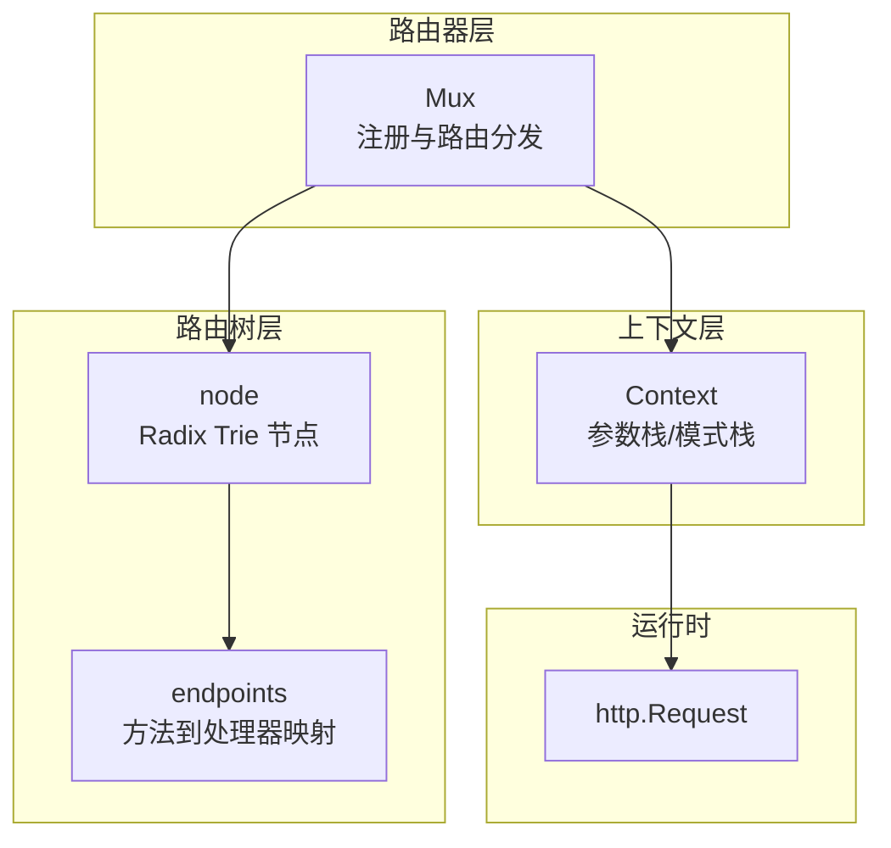
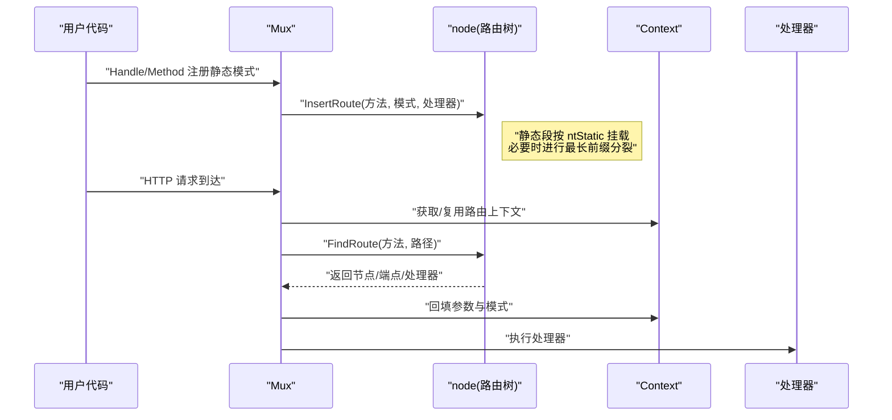
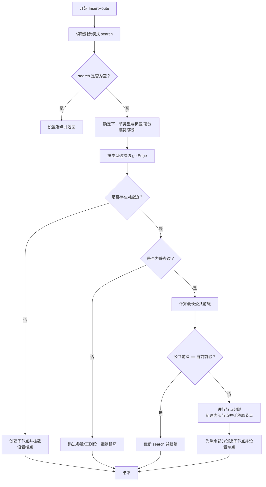
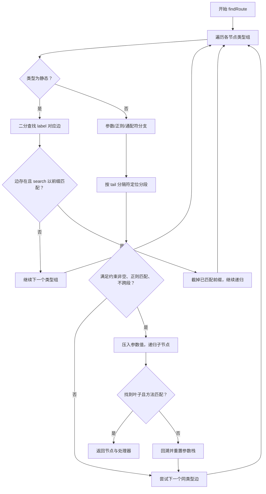
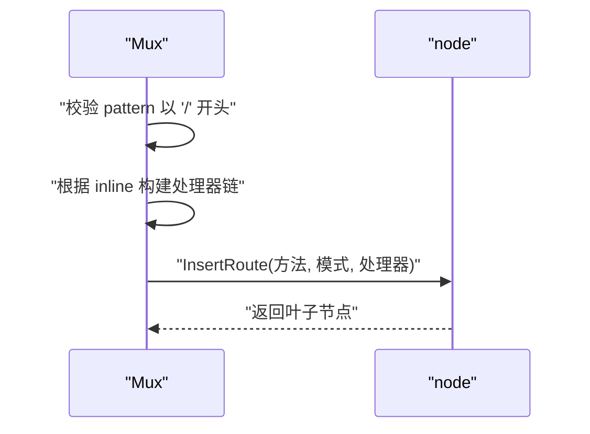
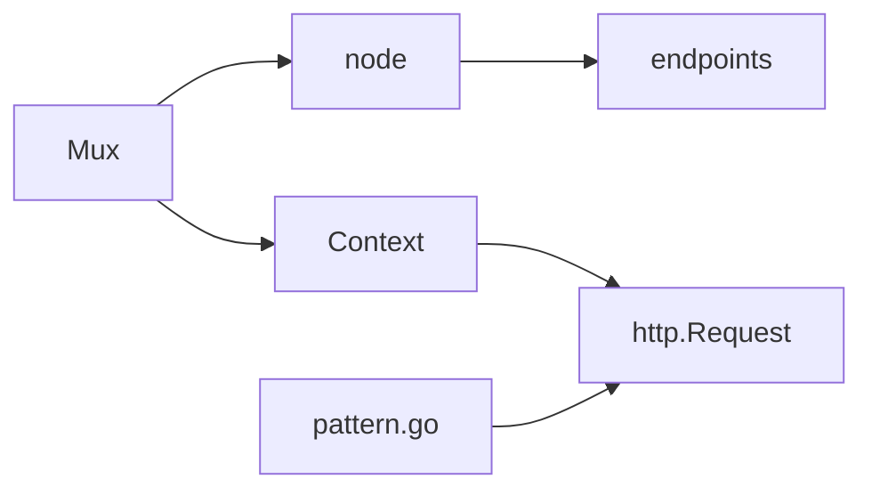

# 静态路由

<cite>
**本文引用的文件**
- [tree.go](file://tree.go)
- [mux.go](file://mux.go)
- [context.go](file://context.go)
- [pattern.go](file://pattern.go)
- [chi.go](file://chi.go)
- [tree_test.go](file://tree_test.go)
</cite>

## 目录
1. [引言](#引言)
2. [项目结构](#项目结构)
3. [核心组件](#核心组件)
4. [架构总览](#架构总览)
5. [详细组件分析](#详细组件分析)
6. [依赖关系分析](#依赖关系分析)
7. [性能考量](#性能考量)
8. [故障排查指南](#故障排查指南)
9. [结论](#结论)
10. [附录](#附录)

## 引言
本篇文档聚焦于 chi 框架中“基于 Radix Trie 的静态路由”实现机制，系统性阐述：
- 节点类型 ntStatic 在路由树中的插入、查找与匹配逻辑；
- 最长前缀匹配算法在静态路径上的应用；
- mux.go 中 handle 方法如何将静态路径模式注册到路由树；
- 路由冲突处理策略（覆盖与重复注册行为）；
- 通过源码路径示例展示 HTTP 请求路径与静态路由节点的匹配过程；
- 静态路由定义的最佳实践：路径规范化与性能优化建议。

## 项目结构
围绕静态路由的关键代码分布在以下文件：
- tree.go：Radix Trie 路由树实现，包含节点结构、插入、查找、参数/正则/通配符节点与静态节点的协同工作；
- mux.go：Mux 路由器对外 API（Handle/Method 等），以及将路由注册到树中的入口；
- context.go：路由上下文与参数栈，用于记录匹配到的参数与模式；
- pattern.go：Go 1.23+ 下将匹配到的路由模式写入 http.Request 的能力；
- chi.go：Router 接口与基础类型声明；
- tree_test.go：大量静态/动态路由用例，验证匹配与参数提取。

图表来源
- [mux.go](file://mux.go#L414-L487)
- [tree.go](file://tree.go#L87-L128)
- [context.go](file://context.go#L45-L113)

章节来源
- [mux.go](file://mux.go#L1-L120)
- [tree.go](file://tree.go#L78-L128)
- [context.go](file://context.go#L45-L113)

## 核心组件
- 节点类型与结构
  - 节点类型：ntStatic、ntRegexp、ntParam、ntCatchAll；
  - 节点字段：前缀、子节点数组按类型分组、标签字节、尾分隔符、端点映射等。
- 插入流程
  - 将路由模式按段解析，静态段直接挂载为 ntStatic 子节点；参数/正则/通配符段会递归拆分并挂载；
  - 若公共前缀存在，进行节点分裂以保持 Radix 特性。
- 查找流程
  - 优先按静态边匹配，若不满足再尝试参数/正则/通配符分支；
  - 参数/正则节点严格按尾分隔符切分，避免跨段匹配；
  - 匹配成功后回填参数与模式到上下文。
- 上下文与参数
  - Context 维护 routePattern、RoutePatterns、URLParams（键值对栈）；
  - 支持多级子路由参数合并与最终写入 http.Request 的 Pattern 字段。

章节来源
- [tree.go](file://tree.go#L78-L128)
- [tree.go](file://tree.go#L138-L228)
- [tree.go](file://tree.go#L373-L543)
- [context.go](file://context.go#L45-L113)

## 架构总览
chi 的静态路由以 Radix Trie 为核心，Mux 作为入口负责：
- 将用户输入的路由模式标准化（校验以斜杠开头、构建处理器链）；
- 调用 node.InsertRoute 完成树上静态段的插入；
- 在请求到来时，调用 node.FindRoute 进行匹配，回填参数与模式，最终执行处理器。

图表来源
- [mux.go](file://mux.go#L414-L487)
- [tree.go](file://tree.go#L373-L543)

章节来源
- [mux.go](file://mux.go#L414-L487)
- [tree.go](file://tree.go#L373-L543)

## 详细组件分析

### 静态节点 ntStatic 的插入与分裂
- 插入主流程
  - 从根开始遍历，逐段解析模式；
  - 若当前段为静态，则沿 ntStatic 边前进；
  - 若无对应边，创建新子节点；
  - 若已有边但公共前缀小于当前节点前缀，进行“最长前缀分裂”，保留公共前缀为新内部节点，并将原节点迁移至其子节点。
- 关键函数
  - InsertRoute：主插入循环，处理静态段与公共前缀；
  - addChild：按段类型拆分并挂载子节点；
  - replaceChild：替换父节点的某条边；
  - longestPrefix：计算两个字符串的最长公共前缀长度。

图表来源
- [tree.go](file://tree.go#L138-L228)
- [tree.go](file://tree.go#L230-L316)
- [tree.go](file://tree.go#L318-L341)
- [tree.go](file://tree.go#L772-L780)

章节来源
- [tree.go](file://tree.go#L138-L228)
- [tree.go](file://tree.go#L230-L316)
- [tree.go](file://tree.go#L318-L341)
- [tree.go](file://tree.go#L772-L780)

### 静态节点的查找与最长前缀匹配
- 查找主流程
  - 对每个节点类型组（静态/参数/正则/通配符）依次尝试；
  - 静态边：按 label 二分查找对应边，再检查 search 是否以该边前缀开头；
  - 参数/正则边：按 tail 分隔符定位分段边界，避免跨段匹配；正则节点需满足正则匹配；
  - 成功匹配后递归进入子节点，直至叶子节点或参数栈回溯失败。
- 最长前缀匹配
  - 在插入阶段保证 Radix 特性；
  - 在查找阶段通过“静态边前缀匹配 + 二分查找边”的组合，确保 O(log n) 的边查找复杂度，整体匹配复杂度近似 O(L)，L 为路径长度。

图表来源
- [tree.go](file://tree.go#L398-L543)
- [tree.go](file://tree.go#L545-L571)

章节来源
- [tree.go](file://tree.go#L398-L543)
- [tree.go](file://tree.go#L545-L571)

### mux.handle 如何注册静态路径到路由树
- 输入校验与处理器链
  - 校验模式必须以斜杠开头；
  - 若为内联 Mux，先构建处理器链（中间件 + routeHTTP）；
  - 否则直接使用传入处理器。
- 注册到树
  - 调用 node.InsertRoute(method, pattern, handler) 完成静态段插入；
  - 返回插入后的叶子节点（可用于后续子路由挂载等场景）。

图表来源
- [mux.go](file://mux.go#L414-L437)
- [tree.go](file://tree.go#L138-L228)

章节来源
- [mux.go](file://mux.go#L414-L437)

### 路由冲突处理策略
- 覆盖语义
  - 测试用例显示：对同一路径多次注册相同方法时，后者会覆盖前者处理器；
  - 示例路径：同一路径重复注册、参数化路径覆盖静态路径等。
- 冲突检测与挂载安全
  - Mount 前会检查目标模式是否已存在（含通配符变体），若存在则 panic，避免覆盖；
  - 这种策略确保挂载点的安全性，防止意外覆盖。

章节来源
- [tree_test.go](file://tree_test.go#L80-L121)
- [tree_test.go](file://tree_test.go#L154-L200)
- [mux.go](file://mux.go#L294-L307)

### HTTP 请求路径与静态路由节点的匹配过程（源码路径示例）
- 请求进入 Mux.ServeHTTP，获取/复用 Context；
- 调用 Mux.routeHTTP 获取方法与路径；
- 调用 node.FindRoute 执行匹配；
- 匹配成功后将参数写入 http.Request 的 PathValue，并在高版本 Go 下写入 Pattern 字段。

章节来源
- [mux.go](file://mux.go#L440-L487)
- [pattern.go](file://pattern.go#L9-L17)
- [context.go](file://context.go#L45-L113)

### 静态路由定义最佳实践
- 路径规范化
  - 以斜杠开头：所有路由模式必须以 “/” 开头；
  - 明确尾斜杠：若期望精确匹配末尾斜杠，应在模式中显式包含；
  - 避免跨段参数：参数/正则节点以 tail 分隔符限定范围，不要省略尾分隔符导致意外跨段匹配。
- 性能优化建议
  - 静态段尽量前置：将高频静态前缀放在前面，利于 Radix 前缀压缩与快速匹配；
  - 减少参数化段数量：参数/正则段会触发回溯与正则匹配，尽量减少；
  - 使用具体正则：避免过于宽泛的正则，降低回溯成本；
  - 合理组织挂载：利用 Mount 的冲突检测，避免重复挂载造成 panic。

章节来源
- [mux.go](file://mux.go#L414-L437)
- [tree.go](file://tree.go#L418-L459)
- [tree.go](file://tree.go#L459-L543)

## 依赖关系分析
- Mux 依赖 node 实现路由树的插入与查找；
- node 依赖 endpoints 记录方法到处理器映射；
- Context 提供参数与模式栈，贯穿匹配生命周期；
- pattern.go 在特定 Go 版本下将匹配模式写入 http.Request。

图表来源
- [mux.go](file://mux.go#L414-L487)
- [tree.go](file://tree.go#L87-L128)
- [context.go](file://context.go#L45-L113)
- [pattern.go](file://pattern.go#L9-L17)

章节来源
- [mux.go](file://mux.go#L414-L487)
- [tree.go](file://tree.go#L87-L128)
- [context.go](file://context.go#L45-L113)
- [pattern.go](file://pattern.go#L9-L17)

## 性能考量
- 时间复杂度
  - 插入：O(L)（L 为模式长度），涉及最长前缀分裂与边排序；
  - 查找：近似 O(L)，静态边采用二分查找，参数/正则边按 tail 分隔符线性扫描；
  - 参数/正则匹配：受正则复杂度影响，建议使用简单明确的正则表达式。
- 空间复杂度
  - Radix Trie 压缩公共前缀，静态路径越多越有利于压缩；
  - 子节点数组按类型分组，排序后按 label 二分查找，内存局部性良好。
- 实践建议
  - 静态路径优先：将高频静态路径前置，提升匹配效率；
  - 控制参数段数量：参数/正则段越多，回溯与匹配成本越高；
  - 正则优化：避免贪婪与回溯复杂的正则，必要时预编译并缓存。

[本节为通用性能讨论，无需列出具体文件来源]

## 故障排查指南
- 注册 panic
  - 模式未以斜杠开头：handle 会抛出异常；
  - Mount 时挂载点已存在：Mount 会检测并 panic，避免覆盖。
- 匹配不到处理器
  - 方法不支持：routeHTTP 会调用 MethodNotAllowedHandler；
  - 路径不存在：最终回落到 NotFoundHandler；
  - 参数/正则不匹配：回溯后仍无匹配则返回 404。
- 参数与模式问题
  - 参数键重复：参数键重复会在解析阶段 panic；
  - 模式写入：在支持的 Go 版本下，请求对象会携带 Pattern 字段，便于调试与日志。

章节来源
- [mux.go](file://mux.go#L414-L487)
- [mux.go](file://mux.go#L498-L529)
- [tree.go](file://tree.go#L744-L770)
- [pattern.go](file://pattern.go#L9-L17)

## 结论
chi 的静态路由通过 Radix Trie 实现了高效的路径匹配与参数提取。静态段（ntStatic）在插入时进行最长前缀分裂，在查找时通过“静态边前缀匹配 + 二分查找”实现近似 O(L) 的匹配复杂度。mux.handle 将静态路径注册到树中，配合 Context 的参数与模式栈，最终在请求生命周期内完成处理器执行与参数注入。遵循路径规范化与性能优化建议，可获得稳定、可维护且高性能的静态路由体验。

[本节为总结性内容，无需列出具体文件来源]

## 附录
- 关键函数与路径参考
  - 插入：InsertRoute（路径：file://tree.go#L138-L228）
  - 子节点挂载：addChild（路径：file://tree.go#L230-L316）
  - 边替换：replaceChild（路径：file://tree.go#L318-L341）
  - 最长前缀：longestPrefix（路径：file://tree.go#L772-L780）
  - 查找：FindRoute（路径：file://tree.go#L373-L543）
  - 静态边查找：findEdge（路径：file://tree.go#L545-L571）
  - 注册入口：handle（路径：file://mux.go#L414-L437）
  - 请求路由：routeHTTP（路径：file://mux.go#L440-L487）
  - 参数与模式：Context（路径：file://context.go#L45-L113）
  - 模式写入：pattern.go（路径：file://pattern.go#L9-L17）

[本节为参考清单，无需列出具体文件来源]