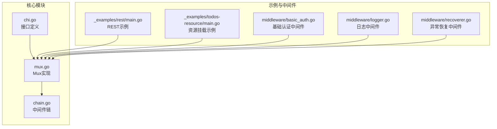
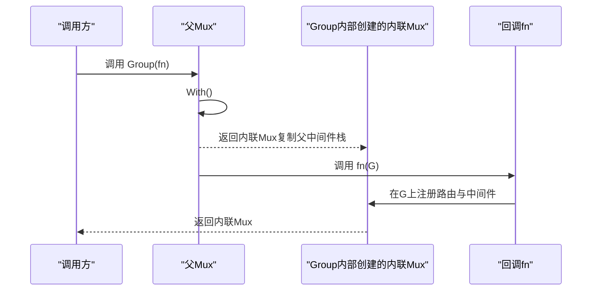
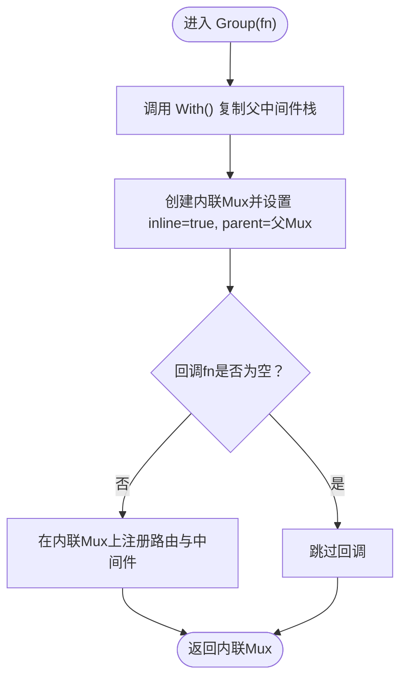
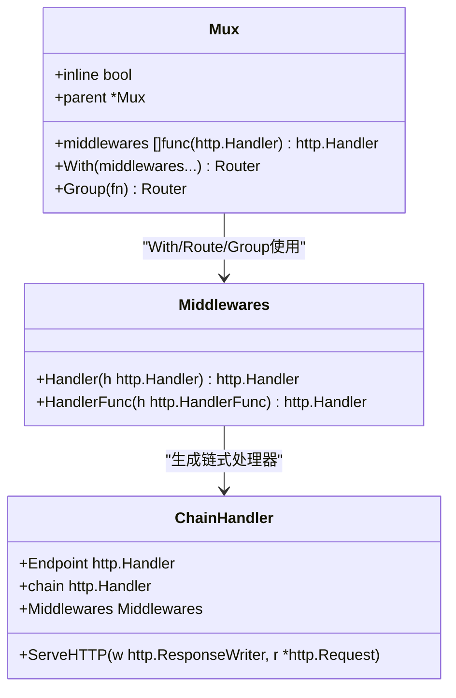
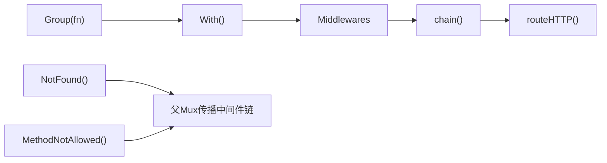

# Group方法

<cite>
**本文引用的文件列表**
- [chi.go](file://chi.go)
- [mux.go](file://mux.go)
- [chain.go](file://chain.go)
- [mux_test.go](file://mux_test.go)
- [_examples/rest/main.go](file://_examples/rest/main.go)
- [_examples/todos-resource/main.go](file://_examples/todos-resource/main.go)
- [middleware/basic_auth.go](file://middleware/basic_auth.go)
- [middleware/logger.go](file://middleware/logger.go)
- [middleware/recoverer.go](file://middleware/recoverer.go)
</cite>

## 目录
1. [简介](#简介)
2. [项目结构与定位](#项目结构与定位)
3. [核心组件](#核心组件)
4. [架构总览](#架构总览)
5. [详细组件分析](#详细组件分析)
6. [依赖关系分析](#依赖关系分析)
7. [性能考量](#性能考量)
8. [故障排查指南](#故障排查指南)
9. [结论](#结论)
10. [附录：常见用法与最佳实践](#附录常见用法与最佳实践)

## 简介
本篇文档聚焦于chi框架中的Group方法，系统阐述其用途、内部实现机制以及在组织具有共同前置逻辑（如身份验证、日志记录等）的路由时的便利性。Group方法用于创建一个“内联子路由器”，该子路由器拥有独立的中间件栈，并能从父路由器复制中间件，再叠加额外的中间件，从而实现对特定路由组的功能增强与隔离。

## 项目结构与定位
- Group方法位于Mux类型上，属于chi的核心路由实现。
- 与之密切相关的还有With方法（用于为单个端点或一组端点叠加中间件）、Route方法（挂载子路由器）、Mount方法（挂载另一个处理器或子路由器）。
- 中间件链由Chain与chain函数负责组装，形成标准的洋葱模型调用顺序。

图表来源
- [chi.go](file://chi.go#L64-L114)
- [mux.go](file://mux.go#L235-L268)
- [chain.go](file://chain.go#L1-L50)
- [_examples/rest/main.go](file://_examples/rest/main.go#L56-L112)
- [_examples/todos-resource/main.go](file://_examples/todos-resource/main.go#L14-L31)
- [middleware/basic_auth.go](file://middleware/basic_auth.go#L1-L33)
- [middleware/logger.go](file://middleware/logger.go#L1-L200)
- [middleware/recoverer.go](file://middleware/recoverer.go#L1-L200)

章节来源
- [chi.go](file://chi.go#L64-L114)
- [mux.go](file://mux.go#L235-L268)
- [chain.go](file://chain.go#L1-L50)

## 核心组件
- Router接口：定义了Use、With、Group、Route、Mount等方法，是所有路由能力的契约。
- Mux：Router的具体实现，维护中间件栈、路由树、上下文池、父Mux引用等。
- Middlewares：中间件切片类型，配合Chain/chain实现洋葱式调用。
- Group方法：创建一个内联子路由器，复制父路由器的中间件栈，并允许在此基础上追加新的中间件。

章节来源
- [chi.go](file://chi.go#L64-L114)
- [mux.go](file://mux.go#L235-L268)
- [chain.go](file://chain.go#L1-L50)

## 架构总览
Group方法的调用流程如下：
- 调用者传入一个函数fn，该函数接收一个Router参数。
- Group内部先调用With()，以复制当前Mux的中间件栈到一个新的内联Mux。
- 将fn作为回调，在新内联Mux上注册路由与中间件。
- 返回该内联Mux，供后续继续注册或挂载。

图表来源
- [mux.go](file://mux.go#L259-L268)
- [mux.go](file://mux.go#L235-L257)

## 详细组件分析

### Group方法的实现与行为
- 复制父中间件栈：Group内部通过With()完成，确保新内联Mux拥有与父Mux相同的初始中间件序列。
- 叠加新中间件：在回调fn中，可以在该内联Mux上调用Use()追加新的中间件，这些中间件仅作用于该组内的路由。
- 内联特性：内联Mux的inline标记为true，且parent指向父Mux；这影响后续处理（例如NotFound/MethodNotAllowed的传播策略）。
- 返回值：返回新建的内联Mux，便于继续在其上注册更多路由或嵌套Group。

图表来源
- [mux.go](file://mux.go#L259-L268)
- [mux.go](file://mux.go#L235-L257)

章节来源
- [mux.go](file://mux.go#L259-L268)
- [mux.go](file://mux.go#L235-L257)

### With方法与中间件链
- With的作用是在当前Mux上为“端点”或“内联子路由器”叠加中间件，形成新的中间件栈。
- 对于内联Mux（inline=true），With会复制父Mux的中间件栈，再追加新的中间件，从而保证每组路由拥有独立的中间件序列。
- 中间件链由Chain与chain函数实现，采用后进先出的洋葱模型，最终将端点处理器包裹在中间件链最外层。

图表来源
- [mux.go](file://mux.go#L235-L257)
- [chain.go](file://chain.go#L1-L50)

章节来源
- [mux.go](file://mux.go#L235-L257)
- [chain.go](file://chain.go#L1-L50)

### Group在组织共同前置逻辑中的应用
- 典型场景：为一组路由统一增加身份验证、日志记录、限流、请求追踪等中间件，而不影响其他路由。
- 通过Group，可以将这些通用前置逻辑集中在一个内联Mux中，避免在每个路由上重复Use()，提升代码可读性与可维护性。
- 嵌套Group支持多层隔离，便于按功能域进一步细分（如用户域、管理域等）。

章节来源
- [mux_test.go](file://mux_test.go#L1392-L1446)
- [_examples/rest/main.go](file://_examples/rest/main.go#L219-L245)

### 实际案例与用法
- REST示例：在根路由上注册全局中间件（请求ID、日志、异常恢复、URL格式化、内容类型渲染），并通过Route与With组合实现资源级中间件（如文章上下文加载）。
- 资源挂载示例：将用户与待办事项资源分别挂载到不同路径，便于扩展与维护。
- 认证中间件：使用基础认证中间件保护特定路由组，体现Group在权限控制上的灵活性。

章节来源
- [_examples/rest/main.go](file://_examples/rest/main.go#L56-L112)
- [_examples/rest/main.go](file://_examples/rest/main.go#L219-L245)
- [_examples/todos-resource/main.go](file://_examples/todos-resource/main.go#L14-L31)
- [middleware/basic_auth.go](file://middleware/basic_auth.go#L1-L33)

## 依赖关系分析
- Group依赖With完成中间件栈复制与叠加。
- With依赖Middlewares与chain函数构建洋葱式处理器。
- Mux在处理路由时，若处于内联状态，会将中间件链应用于端点处理器。
- NotFound与MethodNotAllowed在内联场景下会根据父Mux传播中间件链，保持一致性。

图表来源
- [mux.go](file://mux.go#L235-L268)
- [mux.go](file://mux.go#L215-L233)
- [chain.go](file://chain.go#L34-L50)

章节来源
- [mux.go](file://mux.go#L215-L233)
- [mux.go](file://mux.go#L235-L268)
- [chain.go](file://chain.go#L34-L50)

## 性能考量
- 中间件链的构建发生在路由注册阶段或首次请求前，随后复用已构建的处理器，避免每次请求都重新组装。
- 内联Mux的中间件栈独立，有助于减少不必要的中间件执行，提高特定路由组的性能。
- 使用sync.Pool复用路由上下文，降低GC压力。

章节来源
- [mux.go](file://mux.go#L60-L92)
- [mux.go](file://mux.go#L509-L516)

## 故障排查指南
- 晚期Use中间件：一旦路由处理器被注册，再调用Use会触发panic，需在注册路由之前完成中间件配置。
- 路由未找到/方法不允许：在内联场景下，NotFound与MethodNotAllowed会沿父Mux传播中间件链，确保一致的错误响应行为。
- 嵌套组计数验证：测试用例展示了嵌套Group如何正确叠加中间件数量，可用于验证自定义中间件链的正确性。

章节来源
- [mux.go](file://mux.go#L94-L105)
- [mux.go](file://mux.go#L215-L233)
- [mux_test.go](file://mux_test.go#L1392-L1446)

## 结论
Group方法通过With复制父路由器中间件栈并允许叠加新中间件，为特定路由组提供了独立、可维护、可扩展的前置逻辑容器。结合With、Route、Mount等能力，chi能够以清晰的层次化结构组织复杂服务，既满足通用中间件的全局覆盖，又能在子域内进行精细化控制，是构建大型REST服务与微服务网关的重要基石。

## 附录：常见用法与最佳实践
- 为一组路由统一添加日志与异常恢复中间件，使用Group包裹。
- 为受保护的路由组添加鉴权中间件，确保仅在该组内生效。
- 使用嵌套Group实现功能域隔离（如用户域、管理域），并在每个域内叠加各自中间件。
- 避免在路由注册后再调用Use，防止panic。
- 利用With为单个端点叠加临时中间件，与Group的组级中间件形成互补。

章节来源
- [mux.go](file://mux.go#L235-L268)
- [mux.go](file://mux.go#L94-L105)
- [_examples/rest/main.go](file://_examples/rest/main.go#L219-L245)
- [middleware/logger.go](file://middleware/logger.go#L1-L200)
- [middleware/recoverer.go](file://middleware/recoverer.go#L1-L200)
- [middleware/basic_auth.go](file://middleware/basic_auth.go#L1-L33)