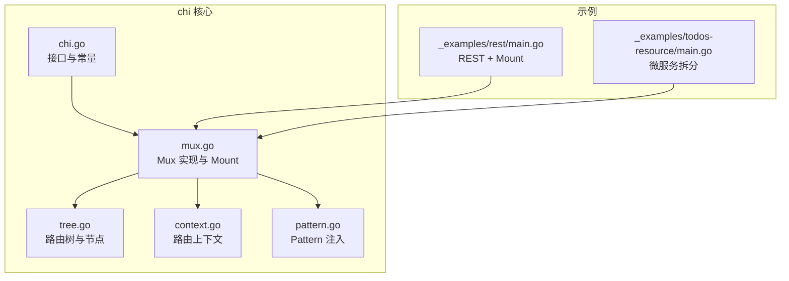
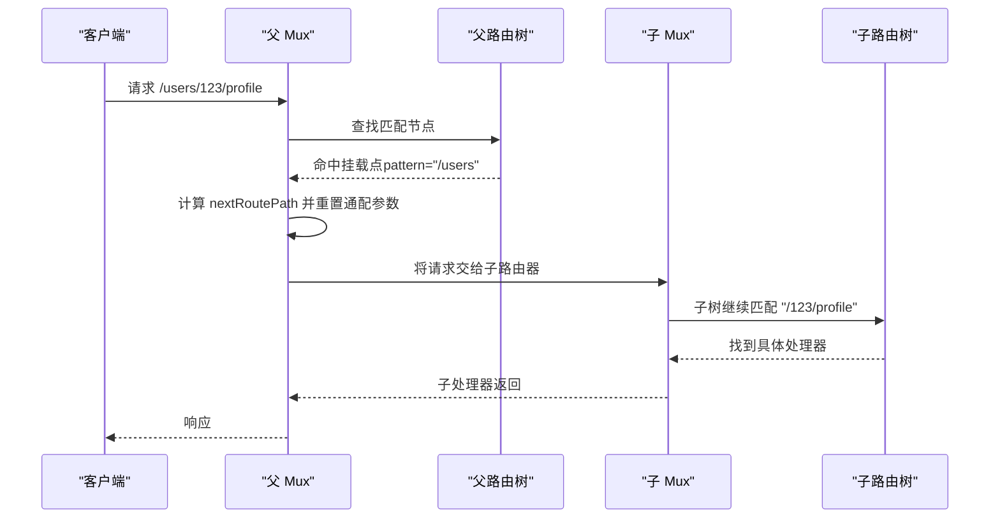
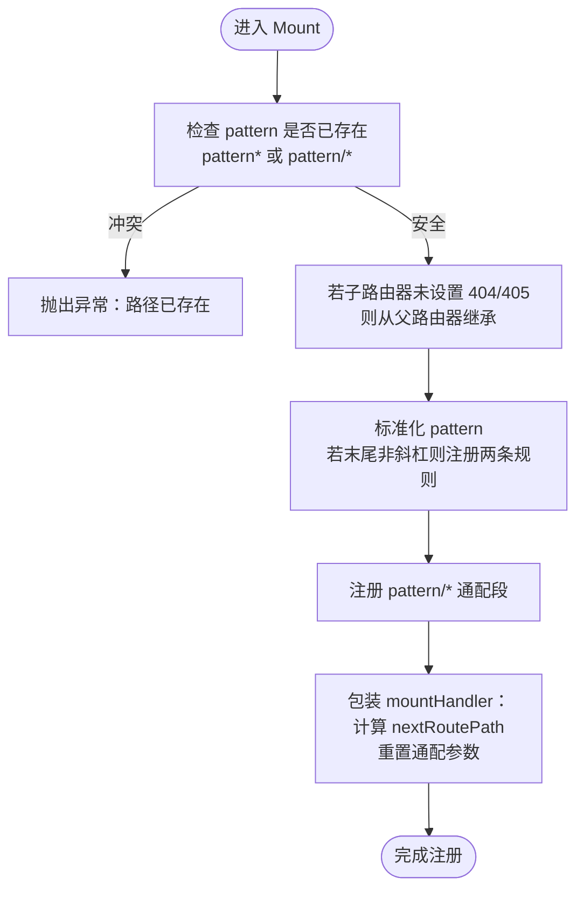
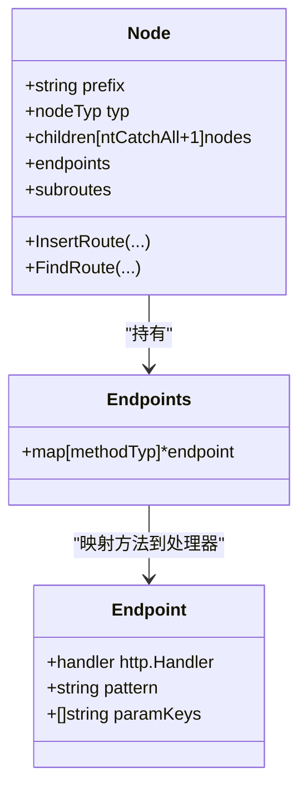
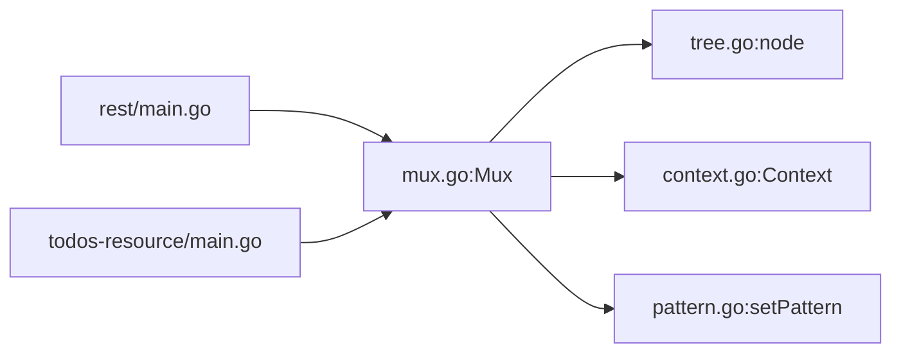

# Mount方法

<cite>
**本文引用的文件列表**
- [chi.go](file://chi.go)
- [mux.go](file://mux.go)
- [tree.go](file://tree.go)
- [context.go](file://context.go)
- [pattern.go](file://pattern.go)
- [_examples/rest/main.go](file://_examples/rest/main.go)
- [_examples/todos-resource/main.go](file://_examples/todos-resource/main.go)
- [README.md](file://README.md)
</cite>

## 目录
1. [引言](#引言)
2. [项目结构](#项目结构)
3. [核心组件](#核心组件)
4. [架构总览](#架构总览)
5. [详细组件分析](#详细组件分析)
6. [依赖关系分析](#依赖关系分析)
7. [性能考量](#性能考量)
8. [故障排查指南](#故障排查指南)
9. [结论](#结论)
10. [附录](#附录)

## 引言
本篇文档围绕 chi 框架中的 Mount 方法展开，系统阐述其原理、实现细节与在大型微服务架构中的应用。Mount 方法用于将一个完整的 http.Handler 或 chi Router 作为“子路由器”挂载到父路由器的某个路径上，并通过通配符模式实现“路由委托”。同时，我们将深入解析挂载过程中的路径处理逻辑（斜杠处理、URL 路径传递），并说明父路由器的 404 和 405 处理器在子路由器上的继承机制。

## 项目结构
- chi 包提供核心 Router 接口与 Mux 实现，负责路由注册、中间件链、请求分发与上下文管理。
- tree.go 提供基于前缀树（Radix Trie）的路由树结构，支持静态段、参数段、正则段与通配段。
- context.go 定义路由上下文与参数栈，贯穿父子路由器调用链。
- pattern.go 在特定 Go 版本下为 http.Request 注入 Pattern 字段，便于可观测性与调试。
- 示例位于 _examples，展示了 Mount 的典型用法与微服务拆分实践。

图表来源
- [chi.go](file://chi.go#L60-L114)
- [mux.go](file://mux.go#L1-L120)
- [tree.go](file://tree.go#L1-L120)
- [context.go](file://context.go#L1-L80)
- [pattern.go](file://pattern.go#L1-L17)
- [_examples/rest/main.go](file://_examples/rest/main.go#L55-L112)
- [_examples/todos-resource/main.go](file://_examples/todos-resource/main.go#L14-L31)

章节来源
- [chi.go](file://chi.go#L60-L114)
- [mux.go](file://mux.go#L1-L120)
- [tree.go](file://tree.go#L1-L120)
- [context.go](file://context.go#L1-L80)
- [pattern.go](file://pattern.go#L1-L17)
- [_examples/rest/main.go](file://_examples/rest/main.go#L55-L112)
- [_examples/todos-resource/main.go](file://_examples/todos-resource/main.go#L14-L31)

## 核心组件
- Router 接口：定义了 Mount、Handle、Method、NotFound、MethodNotAllowed 等核心方法，统一对外暴露路由能力。
- Mux：实现了 Router 接口，内置中间件栈、路由树、父路由器引用、上下文池等；Mount 即在此实现。
- 路由树（node）：支持静态段、参数段、正则段、通配段，FindRoute 递归遍历并记录参数与允许方法。
- 上下文（Context）：记录 RoutePath、URLParams、RoutePatterns、methodsAllowed 等，跨子路由器传递。
- Pattern 注入：在满足条件时将匹配到的路由模式写入 http.Request.Pattern，便于日志与追踪。

章节来源
- [chi.go](file://chi.go#L60-L114)
- [mux.go](file://mux.go#L1-L120)
- [tree.go](file://tree.go#L1-L120)
- [context.go](file://context.go#L1-L80)
- [pattern.go](file://pattern.go#L1-L17)

## 架构总览
Mount 的工作流可概括为：
- 预检查：确保挂载路径不与现有路由冲突。
- 继承：若子路由器未显式设置 404/405 处理器，则从父路由器继承。
- 注册：在父路由树上注册两条规则（带斜杠与不带斜杠），并以 pattern/* 通配段委托给子路由器。
- 委托：请求进入父路由后，若命中挂载点，将把剩余路径切片到子路由器上下文，并交由子路由器继续匹配。

图表来源
- [mux.go](file://mux.go#L282-L340)
- [mux.go](file://mux.go#L489-L496)
- [tree.go](file://tree.go#L373-L543)

章节来源
- [mux.go](file://mux.go#L282-L340)
- [mux.go](file://mux.go#L489-L496)
- [tree.go](file://tree.go#L373-L543)

## 详细组件分析

### Mount 方法实现与通配符委托
- 预检查与冲突保护：Mount 会先检查父路由树是否已存在 pattern* 或 pattern/*，避免重复挂载导致的歧义。
- 继承机制：若子路由器未显式设置 404/405 处理器，Mount 会将其设置为与父路由器一致，从而保证全局一致性。
- 注册两条规则：当 pattern 不以斜杠结尾时，会同时注册 pattern 与 pattern+/ 两条规则，确保尾斜杠兼容。
- 通配符委托：最终以 pattern/* 注册一条 catch-all 节点，将匹配到的剩余路径传给子路由器。
- 子路由器上下文：进入子路由器前，Mount 会计算 nextRoutePath（即去掉已消费的挂载段），并将通配参数重置为空字符串，避免污染后续匹配。

图表来源
- [mux.go](file://mux.go#L282-L340)
- [mux.go](file://mux.go#L489-L496)

章节来源
- [mux.go](file://mux.go#L282-L340)
- [mux.go](file://mux.go#L489-L496)

### 路由树与通配符匹配
- 节点类型：静态、参数、正则、通配（catch-all）。通配段以 “*” 表示，匹配任意剩余路径。
- 查找流程：findRoute 递归遍历子节点，按类型优先级尝试匹配；通配段会把剩余路径整体作为参数保存，供后续子树继续匹配。
- 参数与方法收集：在匹配过程中，会累积 URL 参数与允许的方法集合，用于 405 场景。

图表来源
- [tree.go](file://tree.go#L87-L128)
- [tree.go](file://tree.go#L138-L228)
- [tree.go](file://tree.go#L373-L543)

章节来源
- [tree.go](file://tree.go#L87-L128)
- [tree.go](file://tree.go#L138-L228)
- [tree.go](file://tree.go#L373-L543)

### 路径处理逻辑与 URL 参数传递
- 斜杠处理：Mount 会在 pattern 末尾补斜杠并注册两条规则，确保用户访问带/与不带/都能命中。
- nextRoutePath：当父路由命中挂载点时，会根据最后一个参数（通配符）计算剩余路径，作为子路由器的 RoutePath。
- 通配参数重置：Mount 会清空最后一个 URL 参数（键为“*”）的值，避免父路由参数污染子路由匹配。
- URL 参数栈：Context 中维护 URLParams 与 routeParams 叠加栈，子路由器匹配到的新参数会追加到 URLParams，形成完整参数集。

章节来源
- [mux.go](file://mux.go#L324-L339)
- [mux.go](file://mux.go#L489-L496)
- [context.go](file://context.go#L42-L80)
- [context.go](file://context.go#L146-L150)

### 404 与 405 处理器的继承机制
- 404 继承：Mount 会检查子路由器是否设置了自定义 NotFound 处理器，若未设置则将其设置为父路由器的 404 处理器，并递归更新所有子路由。
- 405 继承：同理，MethodNotAllowed 也会被继承并递归传播。
- 这样设计保证了在大型微服务中，子模块可以保持与父模块一致的错误响应风格。

章节来源
- [mux.go](file://mux.go#L195-L233)
- [mux.go](file://mux.go#L282-L340)

### 在大型微服务架构中的应用
- 微服务拆分：每个业务域（如用户、订单、权限）可独立构建 Router，通过 Mount 挂载到主路由上，形成清晰的边界。
- 示例一：REST 示例中，主路由挂载了 admin 子路由，子路由拥有独立中间件栈与路由表。
- 示例二：todos-resource 示例中，将用户与待办两个资源分别挂载到不同路径，便于团队协作与演进。

章节来源
- [_examples/rest/main.go](file://_examples/rest/main.go#L55-L112)
- [_examples/todos-resource/main.go](file://_examples/todos-resource/main.go#L14-L31)
- [README.md](file://README.md#L120-L172)

## 依赖关系分析
- Mux 依赖路由树（node）进行路由注册与查找。
- Mux 依赖 Context 管理参数与方法集合。
- Pattern 注入依赖 Go 版本特性，仅在满足条件时生效。
- 示例依赖 Mux 的 Mount 能力，展示微服务拆分与组合。

图表来源
- [mux.go](file://mux.go#L1-L120)
- [tree.go](file://tree.go#L1-L120)
- [context.go](file://context.go#L1-L80)
- [pattern.go](file://pattern.go#L1-L17)
- [_examples/rest/main.go](file://_examples/rest/main.go#L55-L112)
- [_examples/todos-resource/main.go](file://_examples/todos-resource/main.go#L14-L31)

章节来源
- [mux.go](file://mux.go#L1-L120)
- [tree.go](file://tree.go#L1-L120)
- [context.go](file://context.go#L1-L80)
- [pattern.go](file://pattern.go#L1-L17)
- [_examples/rest/main.go](file://_examples/rest/main.go#L55-L112)
- [_examples/todos-resource/main.go](file://_examples/todos-resource/main.go#L14-L31)

## 性能考量
- 路由树为前缀树，插入与查找均为 O(L)，L 为路径长度，适合高并发场景。
- Mount 采用通配符委托，避免在父路由上重复解析子路由路径，减少不必要的字符串操作。
- Context 使用 sync.Pool 复用，降低 GC 压力。
- 通配参数重置与 nextRoutePath 计算均为常数时间操作，开销极低。

## 故障排查指南
- 路径冲突：若挂载同一 pattern 两次，Mount 会抛出异常提示路径已存在。请检查是否存在重复挂载或路径覆盖。
- 404/405 不一致：若发现子模块的 404/405 与预期不符，请确认是否显式设置了自定义处理器，或检查是否被父路由器继承覆盖。
- 通配参数污染：若子路由无法正确匹配，请检查是否在父路由中误用了通配参数，或确认 Mount 是否正确重置了通配参数。
- 路径斜杠问题：访问带/与不带/的行为差异通常由 Mount 的两条规则导致，建议统一入口规范，避免歧义。

章节来源
- [mux.go](file://mux.go#L282-L340)
- [mux.go](file://mux.go#L195-L233)
- [mux.go](file://mux.go#L489-L496)

## 结论
Mount 方法通过“预检查—继承—注册—委托”的流程，将子路由器无缝接入父路由器，借助通配符实现高效、稳定的路由委托。其对斜杠与 URL 路径的处理、对 404/405 的继承机制，使得在大型微服务架构中能够保持一致的错误处理与良好的可维护性。配合示例工程，开发者可以快速将业务模块化、服务化，并通过 Mount 构建清晰、可扩展的路由体系。

## 附录
- 关键实现位置参考
  - Mount 主体实现：[mux.go](file://mux.go#L282-L340)
  - nextRoutePath 计算：[mux.go](file://mux.go#L489-L496)
  - 路由树插入与查找：[tree.go](file://tree.go#L138-L228), [tree.go](file://tree.go#L373-L543)
  - 上下文参数栈与路由模式：[context.go](file://context.go#L42-L80), [context.go](file://context.go#L109-L134)
  - Pattern 注入（Go 1.23+）：[pattern.go](file://pattern.go#L1-L17)
  - 示例用法：[README.md](file://README.md#L120-L172), [_examples/rest/main.go](file://_examples/rest/main.go#L55-L112), [_examples/todos-resource/main.go](file://_examples/todos-resource/main.go#L14-L31)