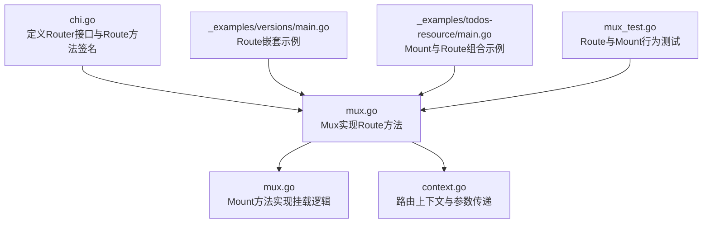
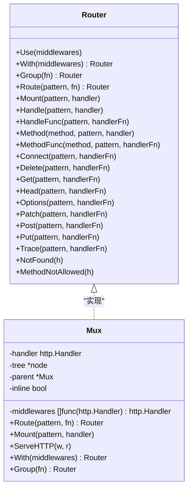
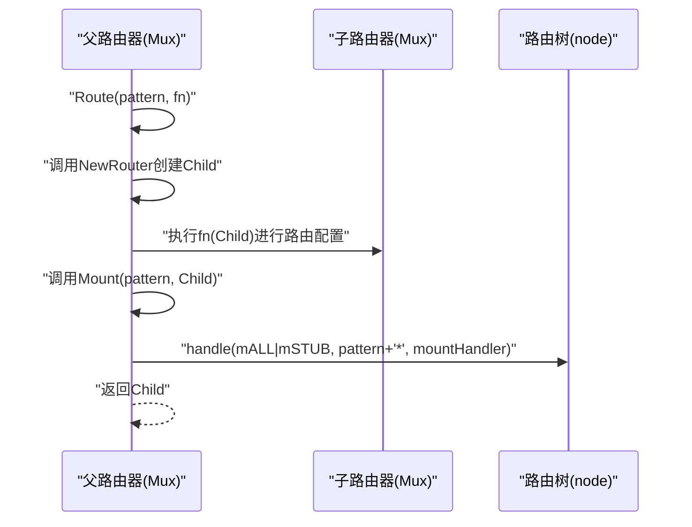
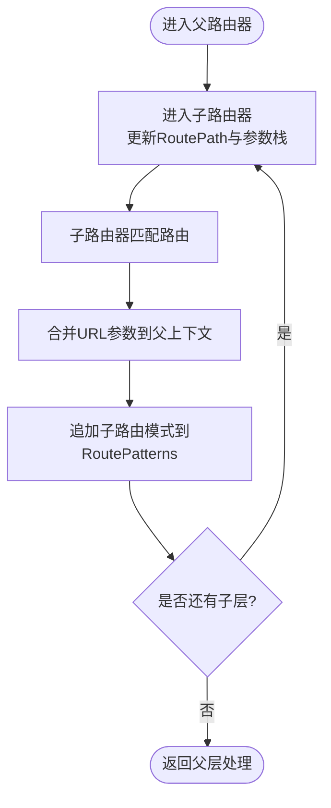
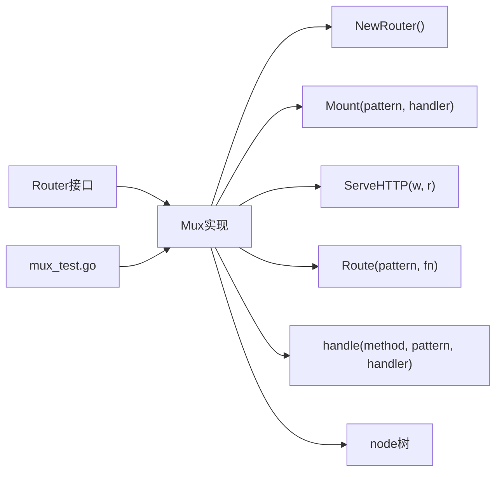

# Route方法

<cite>
**本文引用的文件列表**
- [chi.go](file://chi.go)
- [mux.go](file://mux.go)
- [context.go](file://context.go)
- [_examples/versions/main.go](file://_examples/versions/main.go)
- [_examples/todos-resource/main.go](file://_examples/todos-resource/main.go)
- [mux_test.go](file://mux_test.go)
</cite>

## 目录
1. [简介](#简介)
2. [项目结构](#项目结构)
3. [核心组件](#核心组件)
4. [架构总览](#架构总览)
5. [详细组件分析](#详细组件分析)
6. [依赖关系分析](#依赖关系分析)
7. [性能考量](#性能考量)
8. [故障排查指南](#故障排查指南)
9. [结论](#结论)
10. [附录](#附录)

## 简介
本文件聚焦于chi框架中的Route方法，系统性解析其工作机制：如何通过调用NewRouter创建子路由器、如何执行传入的配置函数以定义子路由规则、如何将子路由器挂载到父路由器的指定路径上。同时，我们将阐明Route方法在代码组织上的优势（模块化与复用）、与Mount方法的异同，并结合示例展示如何使用Route方法构建层次化的API路由结构。

## 项目结构
本次文档涉及的核心文件与示例如下：
- 核心接口与实现：chi.go、mux.go
- 路由上下文：context.go
- 示例程序：_examples/versions/main.go、_examples/todos-resource/main.go
- 行为验证：mux_test.go

图表来源
- [chi.go](file://chi.go#L64-L114)
- [mux.go](file://mux.go#L270-L340)
- [context.go](file://context.go#L42-L113)
- [_examples/versions/main.go](file://_examples/versions/main.go#L29-L47)
- [_examples/todos-resource/main.go](file://_examples/todos-resource/main.go#L22-L30)
- [mux_test.go](file://mux_test.go#L1100-L1299)

章节来源
- [chi.go](file://chi.go#L64-L114)
- [mux.go](file://mux.go#L270-L340)
- [context.go](file://context.go#L42-L113)
- [_examples/versions/main.go](file://_examples/versions/main.go#L29-L47)
- [_examples/todos-resource/main.go](file://_examples/todos-resource/main.go#L22-L30)
- [mux_test.go](file://mux_test.go#L1100-L1299)

## 核心组件
- Router接口：定义了Route方法的签名，用于创建并挂载子路由器。
- Mux实现：提供Route的具体实现，内部通过NewRouter创建子路由器，执行配置函数，再调用Mount完成挂载。
- 上下文与参数：通过Context在父子路由器间传递URL参数、路由模式栈等信息，保证匹配与参数透传的一致性。

章节来源
- [chi.go](file://chi.go#L64-L114)
- [mux.go](file://mux.go#L270-L340)
- [context.go](file://context.go#L42-L113)

## 架构总览
下面的类图展示了Router接口、Mux实现以及关键方法之间的关系。

图表来源
- [chi.go](file://chi.go#L64-L114)
- [mux.go](file://mux.go#L1-L120)

## 详细组件分析

### Route方法的实现机制
- 创建子路由器：Route内部调用NewRouter生成一个新的Mux实例作为子路由器。
- 执行配置函数：将子路由器传入用户提供的配置函数，允许在子路由器上注册中间件与路由规则。
- 挂载到父路由器：调用Mount将子路由器挂载到父路由器的指定路径上，形成层级路由树。
- 返回值：返回新创建的子路由器，便于后续链式或复用。

图表来源
- [mux.go](file://mux.go#L270-L340)

章节来源
- [mux.go](file://mux.go#L270-L340)

### Route方法与Mount方法的异同
- 相同点
  - 都用于将子路由挂载到父路由器的某个路径下。
  - 内部都通过handle注册通配符“*”节点，并在请求时将路径切片传递给子路由器继续匹配。
- 不同点
  - Route是“创建子路由器并挂载”的一步操作；Mount是直接将任意http.Handler或实现了Routes接口的处理器挂载到指定路径。
  - Route返回的是子路由器实例，便于在配置函数中继续定义子路由；Mount更偏向于“挂载已有处理器”。

章节来源
- [mux.go](file://mux.go#L270-L340)

### 参数与上下文传递
- URL参数透传：子路由器匹配到的参数会合并到父路由器的上下文中，确保在多层嵌套路由中都能访问到所有参数。
- 路由模式栈：Context维护RoutePatterns，记录请求在各子路由器中的匹配模式，便于调试与统计。

图表来源
- [context.go](file://context.go#L42-L113)
- [mux.go](file://mux.go#L324-L340)

章节来源
- [context.go](file://context.go#L42-L113)
- [mux.go](file://mux.go#L324-L340)

### 代码组织优势：模块化与复用
- 层次化路由：通过Route可以自然地将API按版本、资源域等维度拆分为独立的子路由器，提升可读性与可维护性。
- 中间件作用域：在Route块内定义的中间件仅对当前子树生效，避免全局污染，便于按域隔离。
- 复用与组合：子路由器可被多次复用（如多个版本共享同一子路由集合），并通过Route/Mount灵活组合。

章节来源
- [_examples/versions/main.go](file://_examples/versions/main.go#L29-L47)
- [_examples/todos-resource/main.go](file://_examples/todos-resource/main.go#L22-L30)

### 实际示例：构建层次化API路由
- 版本化API：在根路由器上使用Route为不同版本创建子路由器，在每个版本子树内注册文章相关路由。
- 嵌套资源：在文章子树内再次使用Route为具体文章ID创建子路由器，进一步细分详情与同步等子操作。
- 组合使用：示例中也展示了Mount与Route的组合使用，体现两者在不同场景下的取舍。

章节来源
- [_examples/versions/main.go](file://_examples/versions/main.go#L29-L47)
- [_examples/todos-resource/main.go](file://_examples/todos-resource/main.go#L22-L30)

## 依赖关系分析
- 接口到实现：Router接口定义能力，Mux实现具体逻辑。
- 方法依赖：Route依赖NewRouter、Mount；Mount依赖handle与node树插入；ServeHTTP依赖上下文池与路由树查找。
- 测试验证：mux_test中包含大量关于Route与Mount行为的断言，覆盖嵌套、参数透传、模式栈等关键特性。

图表来源
- [chi.go](file://chi.go#L64-L114)
- [mux.go](file://mux.go#L1-L120)
- [mux_test.go](file://mux_test.go#L1100-L1299)

章节来源
- [chi.go](file://chi.go#L64-L114)
- [mux.go](file://mux.go#L1-L120)
- [mux_test.go](file://mux_test.go#L1100-L1299)

## 性能考量
- 路由树结构：基于多路前缀树的查找算法，具备良好的时间复杂度，适合大规模路由表。
- 中间件链：在首次注册路由时构建中间件链，后续请求直接复用，避免重复拼接。
- 上下文池：使用sync.Pool复用路由上下文，降低GC压力。
- 子路由挂载：通过通配符节点与路径切分，减少不必要的字符串处理。

章节来源
- [mux.go](file://mux.go#L1-L120)
- [mux.go](file://mux.go#L414-L529)

## 故障排查指南
- 路由未命中：检查路径是否以斜杠开头、是否存在重复挂载导致panic、确认方法是否受支持。
- 参数丢失：确认在子路由器中正确使用URLParam或从Context读取URLParam。
- 中间件顺序：注意Route块内的中间件仅作用于该子树，避免与父树中间件期望不一致。
- 模式栈异常：若发现RoutePatterns不符合预期，检查Route/Mount的嵌套顺序与通配符使用。

章节来源
- [mux.go](file://mux.go#L414-L529)
- [context.go](file://context.go#L42-L113)
- [mux_test.go](file://mux_test.go#L1100-L1299)

## 结论
Route方法通过“创建子路由器—执行配置—挂载”的三步流程，提供了简洁而强大的子路由组织能力。它与Mount方法相辅相成：前者强调“定义与复用”，后者强调“挂载与组合”。借助上下文参数与模式栈，Route在多层嵌套路由中保持参数与模式的清晰传递。配合示例与测试，开发者可以高效地构建层次化、模块化的API路由结构。

## 附录
- 关键实现位置参考
  - Route方法实现：[mux.go](file://mux.go#L270-L340)
  - Mount方法实现：[mux.go](file://mux.go#L282-L340)
  - 上下文与参数：[context.go](file://context.go#L42-L113)
  - 示例：版本化API与嵌套资源
    - [versions示例](file://_examples/versions/main.go#L29-L47)
    - [todos-resource示例](file://_examples/todos-resource/main.go#L22-L30)
  - 行为测试：嵌套、参数透传、模式栈
    - [mux_test.go](file://mux_test.go#L1100-L1299)