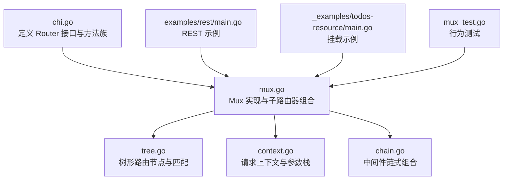
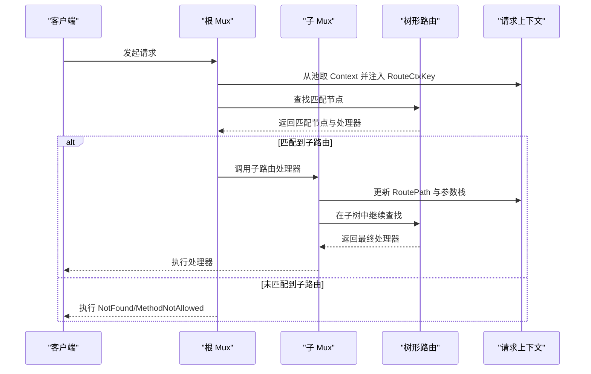
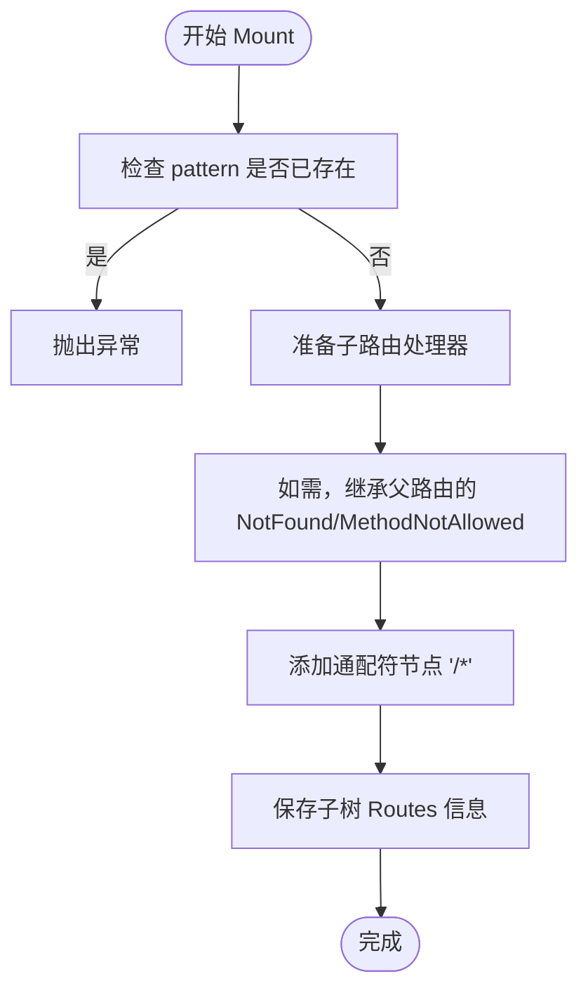
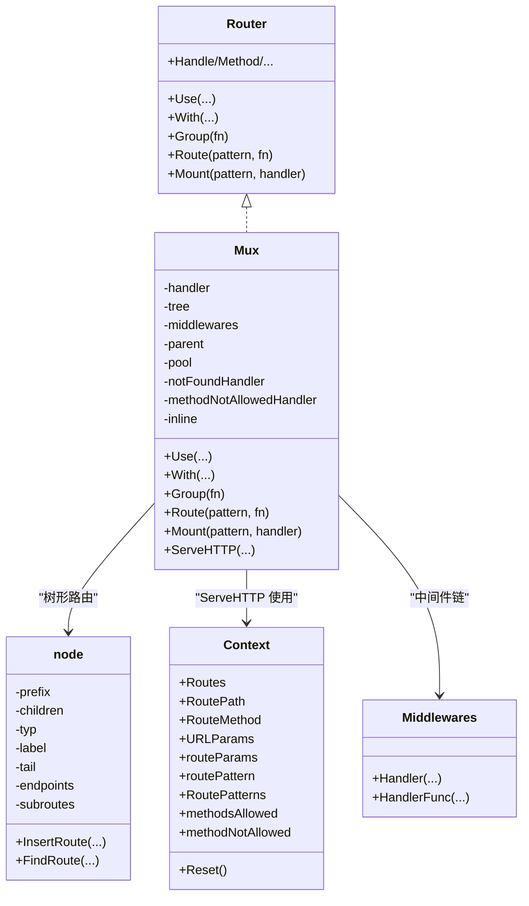

# 子路由器组合

<cite>
**本文引用的文件**
- [chi.go](file://chi.go)
- [mux.go](file://mux.go)
- [tree.go](file://tree.go)
- [context.go](file://context.go)
- [chain.go](file://chain.go)
- [_examples/rest/main.go](file://_examples/rest/main.go)
- [_examples/todos-resource/main.go](file://_examples/todos-resource/main.go)
- [mux_test.go](file://mux_test.go)
</cite>

## 目录
1. [引言](#引言)
2. [项目结构](#项目结构)
3. [核心组件](#核心组件)
4. [架构总览](#架构总览)
5. [详细组件分析](#详细组件分析)
6. [依赖关系分析](#依赖关系分析)
7. [性能考量](#性能考量)
8. [故障排查指南](#故障排查指南)
9. [结论](#结论)
10. [附录](#附录)

## 引言
本篇文档聚焦于 chi 框架中“子路由器”的组合机制，系统性解析以下能力：
- Route、Mount 和 Group 方法的实现原理与使用场景
- 嵌套路由如何通过树结构实现，以及路由上下文与中间件在父子路由器间的传递与继承
- 子路由器在代码组织与模块化设计中的优势
- 如何通过实际示例构建大型 API 服务
- 子路由器的生命周期管理与资源回收机制

## 项目结构
chi 的子路由器能力主要由以下文件提供支撑：
- 路由器接口与入口：chi.go
- 路由器实现与子路由器组合：mux.go
- 树形路由结构与匹配算法：tree.go
- 请求上下文与参数传递：context.go
- 中间件链式组合：chain.go
- 示例工程：_examples/rest/main.go、_examples/todos-resource/main.go
- 行为验证：mux_test.go

图表来源
- [chi.go](file://chi.go#L64-L138)
- [mux.go](file://mux.go#L1-L120)
- [tree.go](file://tree.go#L1-L120)
- [context.go](file://context.go#L1-L80)
- [chain.go](file://chain.go#L1-L50)
- [_examples/rest/main.go](file://_examples/rest/main.go#L56-L112)
- [_examples/todos-resource/main.go](file://_examples/todos-resource/main.go#L14-L31)
- [mux_test.go](file://mux_test.go#L1095-L1294)

章节来源
- [chi.go](file://chi.go#L64-L138)
- [mux.go](file://mux.go#L1-L120)
- [tree.go](file://tree.go#L1-L120)
- [context.go](file://context.go#L1-L80)
- [chain.go](file://chain.go#L1-L50)
- [_examples/rest/main.go](file://_examples/rest/main.go#L56-L112)
- [_examples/todos-resource/main.go](file://_examples/todos-resource/main.go#L14-L31)
- [mux_test.go](file://mux_test.go#L1095-L1294)

## 核心组件
- Router 接口：定义了 Use、With、Group、Route、Mount、Handle/Method 等方法族，是子路由器组合的契约层。
- Mux：Router 的具体实现，负责：
  - 维护中间件栈与已生成的 handler 链
  - 维护树形路由结构与子路由节点
  - ServeHTTP 生命周期管理（上下文池、父上下文透传）
  - Route/Mount/Group 的具体实现
- node/endpoints：树形路由节点，记录各 HTTP 方法的处理器、参数键、子路由 Routes 接口等
- Context：请求上下文，承载路由路径、参数栈、模式串栈、允许方法集合等
- Middlewares/Chain：中间件链式组合工具

章节来源
- [chi.go](file://chi.go#L64-L138)
- [mux.go](file://mux.go#L1-L120)
- [tree.go](file://tree.go#L78-L128)
- [context.go](file://context.go#L42-L110)
- [chain.go](file://chain.go#L1-L50)

## 架构总览
子路由器组合的核心在于“树形路由 + 上下文栈 + 中间件链”的协同：
- Route：创建子路由器并在当前路径挂载，本质是 Mount 的快捷方式
- Mount：将另一个 http.Handler 或 Router 作为子路由挂载到某路径前缀，内部以通配符节点承接后续路由
- Group：复制父级中间件栈，形成新的内联子路由器，便于分组复用中间件
- 上下文与中间件：通过 sync.Pool 复用 Context；父路由器将自身中间件链与子路由器串联，参数与模式串在多级子路由器间累积

图表来源
- [mux.go](file://mux.go#L60-L120)
- [mux.go](file://mux.go#L270-L340)
- [tree.go](file://tree.go#L373-L400)
- [context.go](file://context.go#L42-L110)

## 详细组件分析

### Route 方法：子路由器的“快捷挂载”
- 作用：在指定 pattern 下创建一个新子路由器，并调用 fn 定义其路由，最后通过 Mount 将其挂载到父路由树
- 关键点：
  - 若 fn 为空则直接 panic，避免无效挂载
  - 创建子路由器后立即执行 fn，确保子树在挂载前就已构建完成
  - 最终委托给 Mount 完成挂载逻辑

章节来源
- [mux.go](file://mux.go#L270-L280)

### Mount 方法：子路由器的“通配符挂载”
- 作用：将任意 http.Handler 或 Router 作为子路由挂载到某 pattern 前缀
- 关键点：
  - 安全校验：若 pattern 已存在则 panic，防止覆盖
  - 子路由默认处理：当子路由未设置 NotFound/MethodNotAllowed 时，自动继承父路由的对应处理器
  - 通配符策略：在 pattern 后追加 “/*” 作为通配符节点，使后续路由在子树继续匹配
  - 路径切分：通过 nextRoutePath 将父路径切分为子路径，清空通配符参数，保证子树从正确位置开始匹配
  - 子树信息：若被挂载的是 Routes 接口，则记录在节点上，供 Find/遍历使用

图表来源
- [mux.go](file://mux.go#L282-L340)

章节来源
- [mux.go](file://mux.go#L282-L340)

### Group 方法：内联中间件栈的复制与隔离
- 作用：复制父级中间件栈，创建一个新的内联子路由器，便于在同一路径下分组复用一组中间件
- 关键点：
  - With 内部会复制父级中间件栈，并追加新的内联中间件
  - inline 标记用于区分是否为内联子路由器，影响后续中间件链构建与 NotFound/MethodNotAllowed 的继承策略
  - Group 是 With 的封装，简化了“复制父中间件 + 定义子路由”的常见模式

章节来源
- [mux.go](file://mux.go#L235-L268)

### 树形路由结构与嵌套匹配
- 节点类型：静态、参数、正则、通配符
- 插入与拆分：InsertRoute 会根据路径段类型拆分或合并节点，确保不同类型的段落在树中独立存储
- 匹配流程：FindRoute 递归遍历子节点，按类型匹配路径段，累积参数与模式串；遇到子路由节点时，切换到子树继续匹配
- 子树信息：节点可持有子路由 Routes 接口，Find 时可联动子树返回完整模式串

章节来源
- [tree.go](file://tree.go#L138-L228)
- [tree.go](file://tree.go#L230-L316)
- [tree.go](file://tree.go#L373-L400)
- [tree.go](file://tree.go#L400-L543)

### 路由上下文与参数栈
- Context 结构：包含 RoutePath、RouteMethod、URLParams（累积参数）、routeParams（当前子树参数）、routePattern（当前匹配模式）、RoutePatterns（模式串栈）、methodsAllowed、methodNotAllowed 等
- 参数累积：每进入一个子树，都会将当前子树匹配到的参数累积到 URLParams，最终在请求到达处理器时一次性注入到 http.Request
- 模式串栈：RoutePatterns 记录了从根到当前节点的完整匹配路径，便于调试与可观测性

章节来源
- [context.go](file://context.go#L42-L110)
- [context.go](file://context.go#L110-L167)

### 中间件链与父子继承
- 中间件链：Chain/Middlewares 提供链式组合，最终通过 chain 函数将中间件按逆序包裹端点处理器
- 父子继承：
  - With/Group 会在内联子路由器中复制父级中间件栈
  - NotFound/MethodNotAllowed 在子树未显式设置时，会向上游父树继承并应用到子树
  - ServeHTTP 使用 sync.Pool 复用 Context，避免重复分配

章节来源
- [chain.go](file://chain.go#L1-L50)
- [mux.go](file://mux.go#L195-L233)
- [mux.go](file://mux.go#L235-L268)
- [mux.go](file://mux.go#L60-L120)

### 生命周期管理与资源回收
- Context 池：通过 sync.Pool 在每次请求开始时取出 Context，在请求结束时放回，减少 GC 压力
- 中间件链构建：首次注册路由时构建 handler 链，之后禁止再注册中间件，保证一致性与性能
- 子树更新：updateSubRoutes 递归更新子树的 NotFound/MethodNotAllowed，确保层级一致

章节来源
- [mux.go](file://mux.go#L50-L90)
- [mux.go](file://mux.go#L509-L516)
- [mux.go](file://mux.go#L498-L508)

### 实际示例与最佳实践

#### REST API 示例（嵌套子路由 + 挂载）
- 使用 Route 构建资源域（如 /articles），在其中再嵌套子域（如 /{articleID}）
- 使用 With 为特定资源域附加中间件（如鉴权、加载数据）
- 使用 Mount 将独立的子路由（如 /admin）挂载到根路由，实现模块化拆分

章节来源
- [_examples/rest/main.go](file://_examples/rest/main.go#L56-L112)
- [_examples/rest/main.go](file://_examples/rest/main.go#L114-L170)
- [_examples/rest/main.go](file://_examples/rest/main.go#L199-L245)

#### 模块化挂载示例
- 将用户与待办两个资源分别定义为独立 Router，并通过 Mount 挂载到根路由的不同前缀下
- 这样可以将复杂服务拆分为多个可维护的模块，每个模块拥有自己的中间件与路由

章节来源
- [_examples/todos-resource/main.go](file://_examples/todos-resource/main.go#L14-L31)

#### 测试验证（行为与模式串）
- 测试覆盖了 Route/Group/Nested Mount/NotFound/MethodNotAllowed 等多种场景
- 通过 RoutePatterns 断言，验证多级子路由的模式串拼接是否正确

章节来源
- [mux_test.go](file://mux_test.go#L1095-L1294)
- [mux_test.go](file://mux_test.go#L208-L243)
- [mux_test.go](file://mux_test.go#L316-L392)
- [mux_test.go](file://mux_test.go#L431-L495)

## 依赖关系分析

图表来源
- [chi.go](file://chi.go#L64-L138)
- [mux.go](file://mux.go#L1-L120)
- [tree.go](file://tree.go#L78-L128)
- [context.go](file://context.go#L42-L110)
- [chain.go](file://chain.go#L1-L50)

章节来源
- [chi.go](file://chi.go#L64-L138)
- [mux.go](file://mux.go#L1-L120)
- [tree.go](file://tree.go#L78-L128)
- [context.go](file://context.go#L42-L110)
- [chain.go](file://chain.go#L1-L50)

## 性能考量
- 树形结构：通过静态/参数/正则/通配符四类节点有序存储与二分查找优化，提升匹配效率
- 中间件链：一次性构建 handler 链，避免运行时重复拼装
- 上下文池：sync.Pool 复用 Context，降低内存分配与 GC 压力
- 路径切分：nextRoutePath 仅在进入子树时重置通配符参数，减少不必要的字符串操作

章节来源
- [tree.go](file://tree.go#L572-L617)
- [mux.go](file://mux.go#L509-L516)
- [mux.go](file://mux.go#L60-L120)

## 故障排查指南
- 路由未命中：
  - 检查是否正确使用 Route/Mount，确认 pattern 末尾斜杠与通配符使用
  - 使用 Find/Match 辅助定位问题
- NotFound/MethodNotAllowed 不生效：
  - 确认子树是否显式设置了处理器；若未设置，将继承父树处理器
  - 检查 inline 标记与父树继承逻辑
- 参数丢失或不完整：
  - 确保在子树进入前正确切分 RoutePath
  - 核对 URLParams 是否被正确累积
- 中间件顺序异常：
  - Group/With 会复制父级中间件栈，注意叠加顺序
  - 首次注册路由后禁止再注册中间件，避免运行时状态不一致

章节来源
- [mux.go](file://mux.go#L195-L233)
- [mux.go](file://mux.go#L235-L268)
- [mux.go](file://mux.go#L489-L496)
- [context.go](file://context.go#L42-L110)

## 结论
chi 的子路由器组合通过“树形路由 + 上下文栈 + 中间件链”的协同，提供了高内聚、低耦合的路由组织方式：
- Route/Mount/Group 三者互补：Route 用于快速定义子域，Mount 用于模块化挂载，Group 用于内联中间件复用
- 嵌套匹配基于树形结构，支持静态、参数、正则与通配符，具备良好的扩展性
- 上下文与中间件在父子树之间自然传递与继承，既保证了模块边界，又维持了请求生命周期的一致性
- 通过 sync.Pool、一次性中间件链构建与路径切分策略，兼顾易用性与性能

## 附录
- 参考示例：
  - REST 示例：[main.go](file://_examples/rest/main.go#L56-L112)
  - 模块化挂载：[main.go](file://_examples/todos-resource/main.go#L14-L31)
- 行为测试：
  - 子路由嵌套与模式串：[mux_test.go](file://mux_test.go#L1095-L1294)
  - Mount/NotFound/MethodNotAllowed：[mux_test.go](file://mux_test.go#L208-L243), [mux_test.go](file://mux_test.go#L316-L392), [mux_test.go](file://mux_test.go#L431-L495)