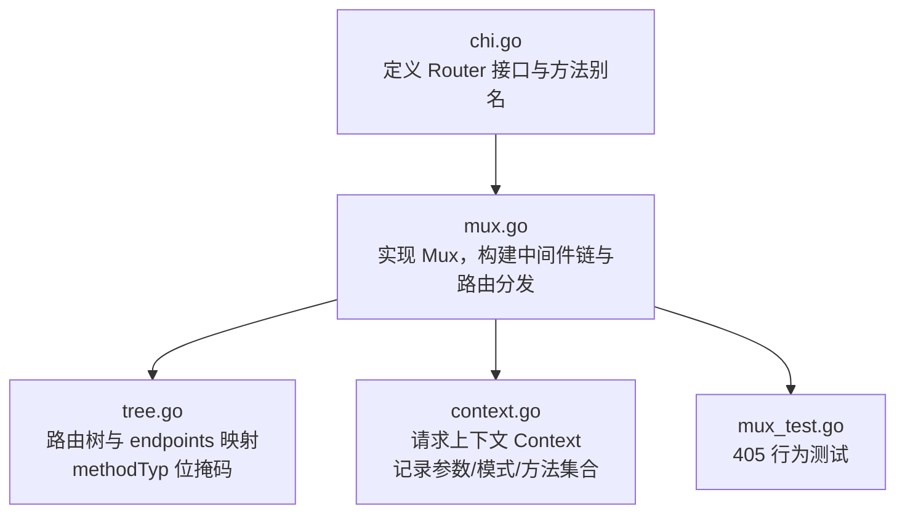
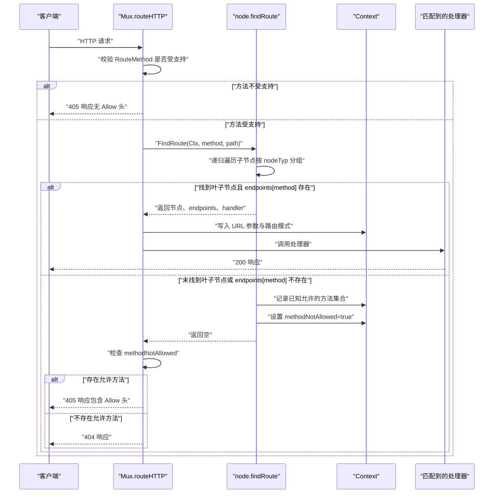
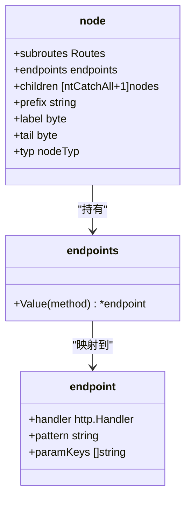
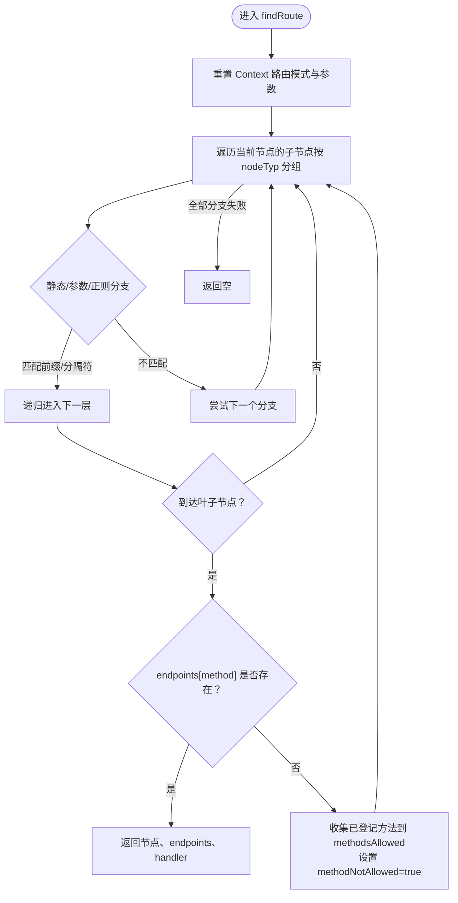
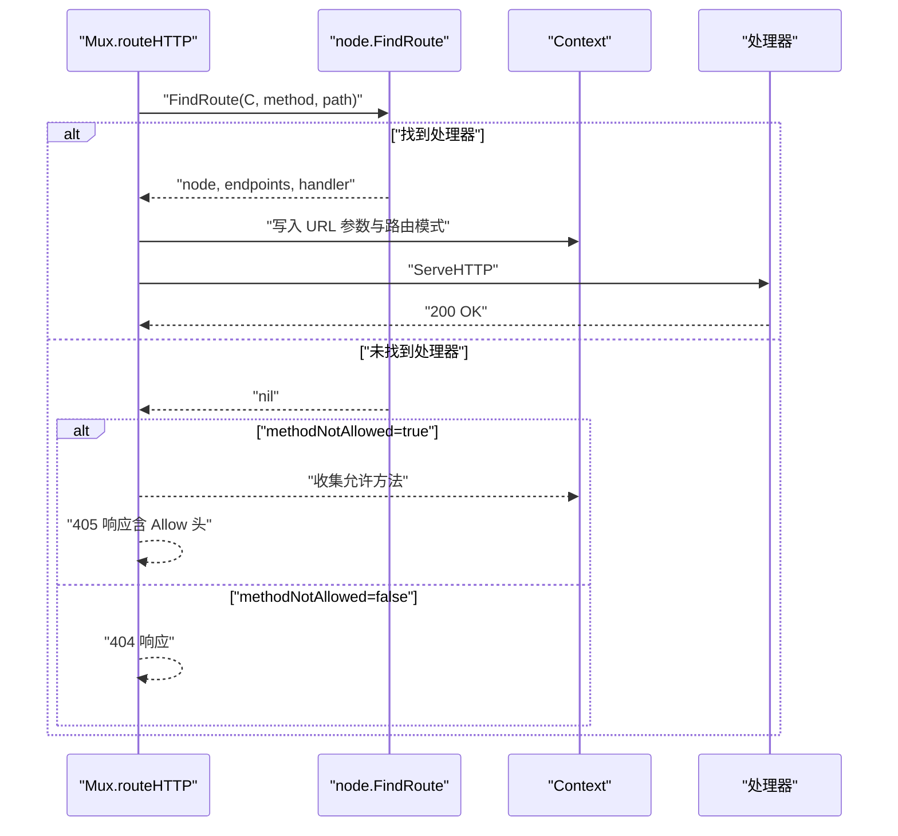
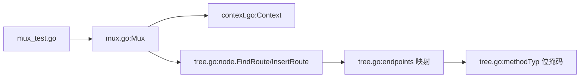

# HTTP方法匹配

<cite>
**本文引用的文件列表**
- [chi.go](file://chi.go)
- [mux.go](file://mux.go)
- [tree.go](file://tree.go)
- [context.go](file://context.go)
- [mux_test.go](file://mux_test.go)
</cite>

## 目录
1. [引言](#引言)
2. [项目结构](#项目结构)
3. [核心组件](#核心组件)
4. [架构总览](#架构总览)
5. [详细组件分析](#详细组件分析)
6. [依赖关系分析](#依赖关系分析)
7. [性能考量](#性能考量)
8. [故障排查指南](#故障排查指南)
9. [结论](#结论)

## 引言
本文件围绕 chi 路由器在路由树中进行 HTTP 方法匹配的完整流程展开，重点解释：
- findRoute 如何使用 methodTyp 位掩码在路由节点的 endpoints 映射中查找对应处理器；
- 请求到达时，框架如何结合 URL 路径与 HTTP 方法双重条件进行精确匹配；
- 当仅路径匹配而方法不匹配时，如何记录允许的方法集合并返回 405；
- 通过实际代码路径追踪，展示路由匹配成功与失败时的执行路径，以及 methodNotAllowed 标志位的设置时机。

## 项目结构
chi 的路由系统主要由以下模块组成：
- 路由接口与入口：chi.go 定义 Router 接口、常用方法（如 Get、Post 等）及 Routes 接口；
- 路由器实现：mux.go 实现 Mux，负责中间件链构建、ServeHTTP、路由注册、方法/路径匹配与最终分发；
- 路由树与方法位掩码：tree.go 定义 methodTyp 位掩码、node/endpoints 结构、路由树插入与查找逻辑；
- 请求上下文：context.go 定义 Context，用于在请求生命周期内记录匹配到的参数、模式、方法集合等；
- 测试用例：mux_test.go 包含对 405 场景的验证，体现方法不匹配时的行为。

图表来源
- [chi.go](file://chi.go#L60-L138)
- [mux.go](file://mux.go#L1-L120)
- [tree.go](file://tree.go#L16-L77)
- [context.go](file://context.go#L37-L96)
- [mux_test.go](file://mux_test.go#L394-L458)

章节来源
- [chi.go](file://chi.go#L60-L138)
- [mux.go](file://mux.go#L1-L120)
- [tree.go](file://tree.go#L16-L77)
- [context.go](file://context.go#L37-L96)
- [mux_test.go](file://mux_test.go#L394-L458)

## 核心组件
- methodTyp 位掩码：通过位运算表示支持的 HTTP 方法集合，例如 mGET、mPOST 等；mALL 表示所有方法集合；mSTUB 用于标记“桩”或“通配”节点。
- endpoints 映射：每个节点维护一个 methodTyp 到 endpoint 的映射，endpoint 记录处理器、模式与参数键。
- Context：在请求生命周期内累积匹配到的 URL 参数、路由模式、以及当路径匹配但方法不匹配时收集的允许方法集合。
- Mux.routeHTTP：统一的请求入口，先校验方法是否受支持，再调用树查找，最后根据结果分发到处理器或 404/405。

章节来源
- [tree.go](file://tree.go#L16-L77)
- [tree.go](file://tree.go#L114-L128)
- [context.go](file://context.go#L37-L96)
- [mux.go](file://mux.go#L440-L487)

## 架构总览
下图展示了从请求进入 Mux 到路由树匹配再到最终响应的关键交互。

图表来源
- [mux.go](file://mux.go#L440-L487)
- [tree.go](file://tree.go#L373-L542)
- [context.go](file://context.go#L37-L96)

章节来源
- [mux.go](file://mux.go#L440-L487)
- [tree.go](file://tree.go#L373-L542)
- [context.go](file://context.go#L37-L96)

## 详细组件分析

### 1) methodTyp 位掩码与 endpoints 映射
- methodTyp 使用 uint 类型，每个 HTTP 方法对应一个唯一的位，mALL 为所有方法位的并集，mSTUB 用于特殊节点。
- endpoints 是 methodTyp 到 endpoint 的映射，每个 endpoint 记录处理器、路由模式与参数键。
- 在插入路由时，setEndpoint 会根据 method 的位掩码更新对应条目；当 method 含有 mALL 或 mSTUB 时，会批量填充或设置“全量”条目。

图表来源
- [tree.go](file://tree.go#L78-L128)
- [tree.go](file://tree.go#L343-L371)

章节来源
- [tree.go](file://tree.go#L16-L77)
- [tree.go](file://tree.go#L114-L128)
- [tree.go](file://tree.go#L343-L371)

### 2) findRoute 的方法匹配机制
- FindRoute 先重置 Context 的路由模式与参数，然后调用内部递归函数 findRoute。
- findRoute 按 nodeTyp 分组遍历子节点：
  - 静态/参数/正则节点：按前缀或分隔符匹配，递归进入下一层；
  - 叶子节点：检查 endpoints[method] 是否存在有效处理器；
  - 若仅路径匹配而方法不匹配，则收集所有已登记的方法到 Context.methodsAllowed 并设置 methodNotAllowed=true。
- 最终返回匹配到的节点、endpoints 以及对应方法的处理器。

图表来源
- [tree.go](file://tree.go#L373-L542)

章节来源
- [tree.go](file://tree.go#L373-L542)

### 3) 路由匹配成功与失败的执行路径
- 成功路径：findRoute 返回非空节点与处理器，Mux.routeHTTP 将 Context 中的 URL 参数写回请求，随后调用处理器返回 200。
- 失败路径：
  - 若 Context.methodNotAllowed 为真，Mux.MethodNotAllowedHandler 会根据 Context.methodsAllowed 生成 405 响应，并设置 Allow 头；
  - 否则返回 404。

图表来源
- [mux.go](file://mux.go#L440-L487)
- [tree.go](file://tree.go#L373-L542)

章节来源
- [mux.go](file://mux.go#L440-L487)
- [tree.go](file://tree.go#L373-L542)

### 4) methodNotAllowed 标志位的设置时机
- 在 findRoute 的两个关键位置设置：
  - 参数/正则分支的叶子节点处：若路径走到头但 endpoints[method] 为空，会遍历该节点已登记的所有方法，收集到 Context.methodsAllowed，并设置 methodNotAllowed=true；
  - 静态分支的叶子节点处：同上逻辑。
- Mux.routeHTTP 在未找到处理器时检查 Context.methodNotAllowed，决定返回 405 还是 404。

章节来源
- [tree.go](file://tree.go#L460-L478)
- [tree.go](file://tree.go#L506-L524)
- [mux.go](file://mux.go#L482-L486)

### 5) 路径与方法双重匹配的验证
- mux_test.go 中的测试覆盖了：
  - 已注册方法返回 200，且不设置 Allow 头；
  - 未注册方法返回 405，并正确设置 Allow 头包含已登记的方法；
  - 嵌套路由中自定义 MethodNotAllowed 的行为验证。

章节来源
- [mux_test.go](file://mux_test.go#L394-L458)
- [mux_test.go](file://mux_test.go#L431-L495)

## 依赖关系分析
- Mux 依赖 Context 维护请求上下文状态；
- Mux 通过 tree.go 的 FindRoute/InsertRoute 与路由树交互；
- tree.go 的 endpoints 映射依赖 methodTyp 位掩码；
- mux_test.go 通过 HTTP 测试验证方法匹配与 405 行为。

图表来源
- [mux.go](file://mux.go#L440-L487)
- [tree.go](file://tree.go#L16-L77)
- [tree.go](file://tree.go#L114-L128)
- [context.go](file://context.go#L37-L96)
- [mux_test.go](file://mux_test.go#L394-L458)

章节来源
- [mux.go](file://mux.go#L440-L487)
- [tree.go](file://tree.go#L16-L77)
- [tree.go](file://tree.go#L114-L128)
- [context.go](file://context.go#L37-L96)
- [mux_test.go](file://mux_test.go#L394-L458)

## 性能考量
- 路由树采用多维 radix trie，按 nodeTyp 分组遍历，避免不必要的匹配；
- endpoints 使用 map[methodTyp]*endpoint，查找复杂度近似 O(1)；
- Context 使用 sync.Pool 复用，减少每次请求的分配开销；
- methodNotAllowed 收集允许方法时仅遍历节点已登记的方法集合，避免全量扫描。

[本节为通用性能讨论，无需特定文件引用]

## 故障排查指南
- 405 未出现 Allow 头：
  - 检查是否已注册对应方法；若仅部分方法注册，405 应包含 Allow 头。
- 405 出现但 Allow 内容不正确：
  - 确认路由注册时是否使用了相同方法名大小写一致；methodMap 依赖标准库方法常量。
- 404 误判为 405：
  - 确认请求路径是否确实存在其他方法的路由；若仅路径匹配但无任何方法登记，将返回 404。

章节来源
- [mux.go](file://mux.go#L482-L486)
- [mux.go](file://mux.go#L517-L528)
- [tree.go](file://tree.go#L460-L524)

## 结论
chi 在路由树中进行 HTTP 方法匹配的核心在于：
- 使用 methodTyp 位掩码在 endpoints 映射中快速定位处理器；
- 通过 findRoute 的递归遍历，同时满足路径与方法双重约束；
- 当仅路径匹配而方法不匹配时，通过 Context.methodsAllowed 与 methodNotAllowed 标志位准确返回 405，并设置 Allow 头；
- 在路由匹配成功时，将参数与模式写入 Context 并调用处理器返回 200。

[本节为总结性内容，无需特定文件引用]