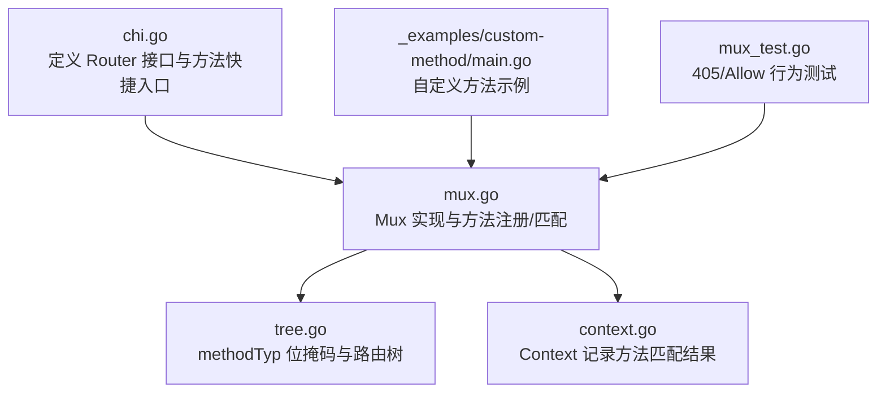
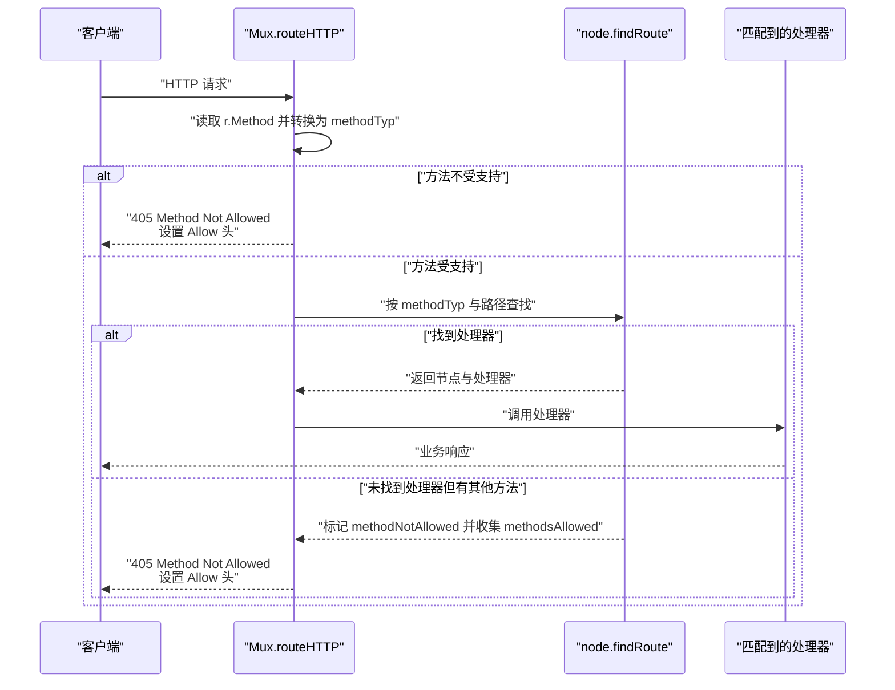
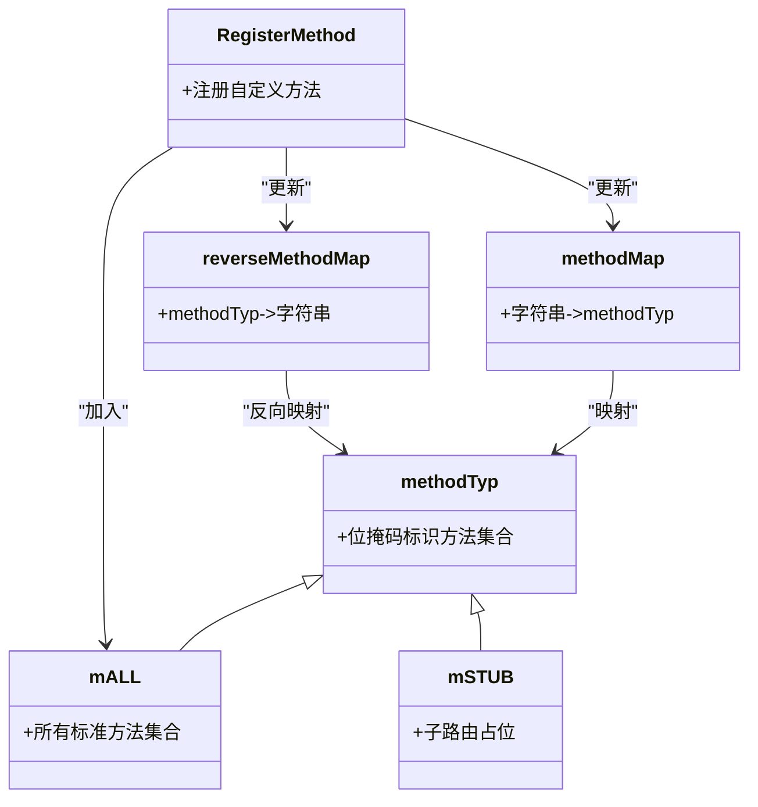
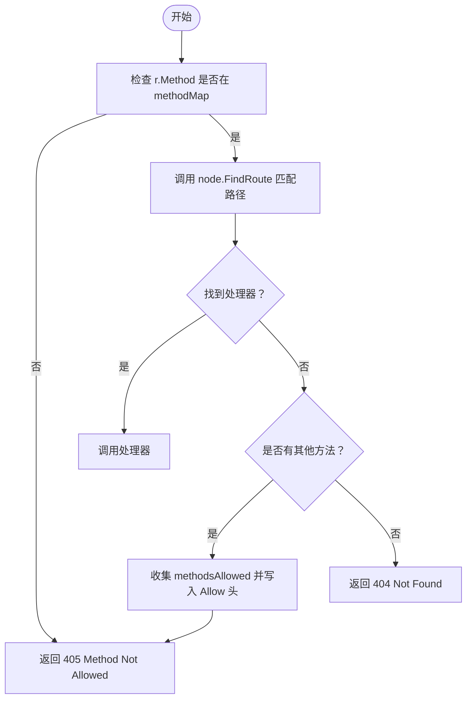
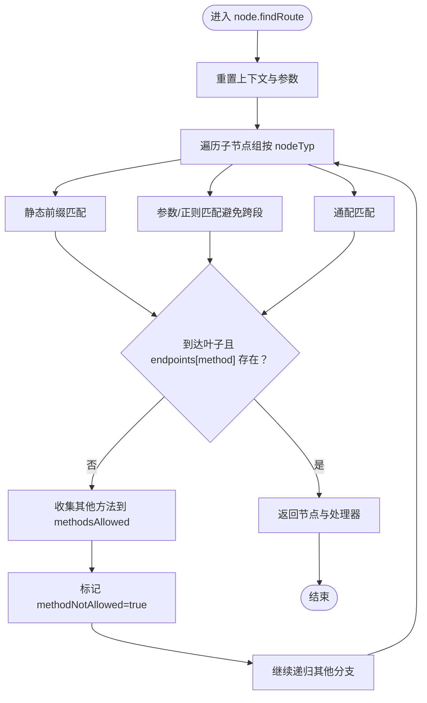
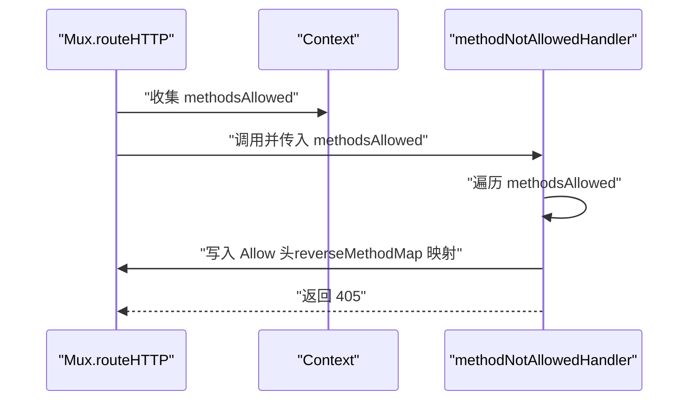
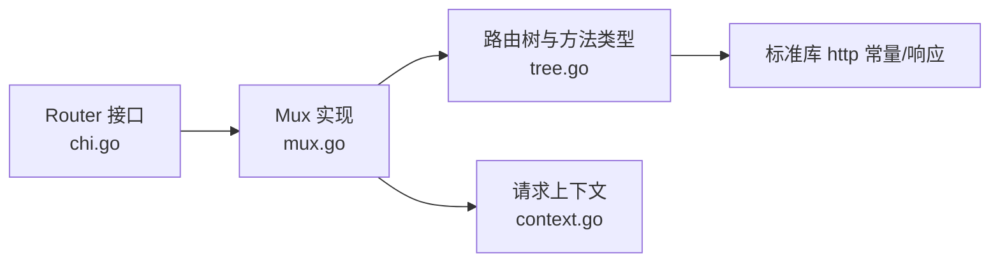

# HTTP方法处理

<cite>
**本文引用的文件**
- [chi.go](file://chi.go)
- [mux.go](file://mux.go)
- [tree.go](file://tree.go)
- [context.go](file://context.go)
- [_examples/custom-method/main.go](file://_examples/custom-method/main.go)
- [mux_test.go](file://mux_test.go)
</cite>

## 目录
1. [引言](#引言)
2. [项目结构](#项目结构)
3. [核心组件](#核心组件)
4. [架构总览](#架构总览)
5. [详细组件分析](#详细组件分析)
6. [依赖关系分析](#依赖关系分析)
7. [性能考量](#性能考量)
8. [故障排查指南](#故障排查指南)
9. [结论](#结论)
10. [附录](#附录)

## 引言
本文件系统性讲解 chi 路由器对 HTTP 方法（GET、POST、PUT、DELETE 等）的处理机制，重点覆盖：
- methodTyp 类型如何通过位掩码实现方法的高效存储与查询
- methodMap 和 reverseMethodMap 映射表的作用
- 请求到达时，框架如何验证 HTTP 方法的有效性，并在路由匹配过程中进行方法比对
- 方法未允许（405）状态码的生成逻辑，包括 Allow 响应头的构建过程
- 自定义 HTTP 方法的注册与使用
- 常见方法处理问题的解决方案

## 项目结构
chi 的 HTTP 方法处理主要集中在以下模块：
- 路由接口与方法快捷入口：chi.go
- 路由器实现与方法注册：mux.go
- 方法类型与树形路由匹配：tree.go
- 请求上下文与方法缓存：context.go
- 示例与测试用例：_examples/custom-method/main.go、mux_test.go

图表来源
- [chi.go](file://chi.go#L64-L138)
- [mux.go](file://mux.go#L107-L193)
- [tree.go](file://tree.go#L16-L76)
- [context.go](file://context.go#L42-L96)
- [_examples/custom-method/main.go](file://_examples/custom-method/main.go#L1-L34)
- [mux_test.go](file://mux_test.go#L400-L428)

章节来源
- [chi.go](file://chi.go#L64-L138)
- [mux.go](file://mux.go#L107-L193)
- [tree.go](file://tree.go#L16-L76)
- [context.go](file://context.go#L42-L96)
- [_examples/custom-method/main.go](file://_examples/custom-method/main.go#L1-L34)
- [mux_test.go](file://mux_test.go#L400-L428)

## 核心组件
- Router 接口与方法快捷入口：提供 Handle、HandleFunc、Method、MethodFunc 以及各 HTTP 方法的快捷方法（如 Get、Post、Put、Delete、Options、Patch、Head、Trace、Connect），并支持自定义方法（Method/MethodFunc）。
- Mux 路由器：实现 Router 接口，负责中间件链构建、路由注册、请求分发、404/405 处理。
- 路由树与方法类型：使用 methodTyp 位掩码标识方法集合，通过 radix trie 存储路径段，按节点类型（静态、参数、正则、通配）进行匹配。
- 上下文 Context：记录路由匹配过程中的方法允许列表、是否方法未允许标志、参数与模式等。

章节来源
- [chi.go](file://chi.go#L64-L138)
- [mux.go](file://mux.go#L107-L193)
- [tree.go](file://tree.go#L16-L76)
- [context.go](file://context.go#L42-L96)

## 架构总览
下面的序列图展示了从请求进入路由器到方法匹配与响应的关键流程，包括 405 与 Allow 头的生成。

图表来源
- [mux.go](file://mux.go#L441-L487)
- [tree.go](file://tree.go#L398-L542)
- [mux.go](file://mux.go#L517-L528)

## 详细组件分析

### 1) methodTyp 位掩码与映射表
- 定义：methodTyp 是无符号整数类型，使用位掩码表示一组 HTTP 方法；mALL 表示所有标准方法的集合；mSTUB 用于“桩”或子路由占位。
- 映射表：
  - methodMap：字符串方法名到 methodTyp 的映射，包含标准方法常量。
  - reverseMethodMap：methodTyp 到字符串方法名的反向映射，用于生成 Allow 头。
- 自定义方法：
  - RegisterMethod 支持动态注册自定义方法，通过位移生成新的 methodTyp，更新两个映射表，并加入 mALL。

图表来源
- [tree.go](file://tree.go#L16-L76)

章节来源
- [tree.go](file://tree.go#L16-L76)

### 2) 方法注册与验证（Mux）
- 注册入口：
  - Method/MethodFunc：先通过 methodMap 校验方法是否受支持，再调用内部 handle 注册。
  - 各快捷方法（Get、Post、Put、Delete、Options、Patch、Head、Trace、Connect）直接调用 handle。
- 验证流程：
  - 在 routeHTTP 中，将 r.Method 转换为 methodTyp，若不在 methodMap 中，立即返回 405。
- 错误处理：
  - NotFoundHandler/MethodNotAllowedHandler 提供默认或自定义处理器。

图表来源
- [mux.go](file://mux.go#L125-L139)
- [mux.go](file://mux.go#L441-L487)
- [tree.go](file://tree.go#L398-L542)

章节来源
- [mux.go](file://mux.go#L125-L139)
- [mux.go](file://mux.go#L441-L487)

### 3) 路由匹配与方法比对（树）
- 节点类型：静态、参数、正则、通配。
- 查找过程：
  - node.FindRoute 先重置上下文，再递归遍历子节点组，按 nodeTyp 分支匹配。
  - 在每个分支中，若当前节点是叶子且 endpoints[method] 存在，则命中；否则收集其他可用方法到 methodsAllowed，并标记 methodNotAllowed。
- 参数与模式：
  - 将匹配到的参数追加到 Context，最终在 routeHTTP 中回填到 http.Request 的路径值。

图表来源
- [tree.go](file://tree.go#L398-L542)

章节来源
- [tree.go](file://tree.go#L398-L542)

### 4) 405 与 Allow 头生成
- 生成逻辑：
  - 当未找到处理器但存在其他方法时，routeHTTP 会调用 MethodNotAllowedHandler，并传入 methodsAllowed。
  - methodNotAllowedHandler 会遍历 methodsAllowed，将对应的字符串方法名写入 Allow 头，最后返回 405。
- 自定义 405：
  - 可通过 MethodNotAllowed 设置自定义处理器，覆盖默认行为。

图表来源
- [mux.go](file://mux.go#L481-L487)
- [mux.go](file://mux.go#L517-L528)
- [tree.go](file://tree.go#L46-L56)

章节来源
- [mux.go](file://mux.go#L517-L528)
- [tree.go](file://tree.go#L46-L56)

### 5) 自定义 HTTP 方法的注册与使用
- 注册方式：在应用启动阶段调用 RegisterMethod 注册自定义方法（如 LINK、UNLINK、WOOHOO）。
- 使用方式：通过 Method 或 MethodFunc 指定自定义方法名与路径进行注册。
- 示例参考：_examples/custom-method/main.go 展示了在 init 中注册并在路由中使用自定义方法。

章节来源
- [tree.go](file://tree.go#L58-L76)
- [_examples/custom-method/main.go](file://_examples/custom-method/main.go#L1-L34)

### 6) 常见问题与解决方案
- 问题：请求使用未注册的方法导致 405。
  - 解决：在路由中注册该方法，或在路由层添加 MethodNotAllowed 自定义处理器以统一返回格式。
- 问题：Allow 头缺失或不完整。
  - 解决：确认路由树中确实存在其他方法；确保 Context.methodsAllowed 已被正确填充；检查自定义 405 处理器是否正确写入 Allow 头。
- 问题：子路由 405 行为不符合预期。
  - 解决：检查 Mount 时是否继承父路由的 MethodNotAllowed 处理器；必要时在子路由单独设置 MethodNotAllowed。

章节来源
- [mux.go](file://mux.go#L300-L340)
- [mux_test.go](file://mux_test.go#L431-L495)

## 依赖关系分析
- 组件耦合：
  - Mux 依赖 tree.go 的路由树与 methodTyp；依赖 context.go 的上下文；依赖 chi.go 的 Router 接口。
  - tree.go 定义 methodTyp、methodMap、reverseMethodMap 与 RegisterMethod；为 Mux 提供高效的路径与方法匹配。
  - context.go 提供 Context 结构体，承载方法匹配期间的状态（methodsAllowed、methodNotAllowed 等）。
- 外部依赖：
  - 标准库 net/http 的方法常量与响应写入。

图表来源
- [chi.go](file://chi.go#L64-L138)
- [mux.go](file://mux.go#L107-L193)
- [tree.go](file://tree.go#L16-L76)
- [context.go](file://context.go#L42-L96)

章节来源
- [chi.go](file://chi.go#L64-L138)
- [mux.go](file://mux.go#L107-L193)
- [tree.go](file://tree.go#L16-L76)
- [context.go](file://context.go#L42-L96)

## 性能考量
- 位掩码查询：methodMap 与 reverseMethodMap 基于 map，查询为平均 O(1)，适合高频方法校验。
- 路由树匹配：radix trie 按节点类型分组遍历，静态前缀匹配与二分查找优化，整体复杂度接近 O(L)（L 为路径长度）。
- 上下文复用：通过 sync.Pool 复用 Context，减少分配开销。
- 方法集合：mALL 一次性包含所有标准方法，便于快速判断“全部方法”场景。

## 故障排查指南
- 405 但 Allow 缺失：
  - 检查是否存在其他方法；确认 node.findRoute 是否正确收集 methodsAllowed。
- 405 但 Allow 内容异常：
  - 检查 reverseMethodMap 是否包含对应 methodTyp；确认自定义 405 处理器是否调用了写入 Allow 头的逻辑。
- 自定义方法无效：
  - 确认已调用 RegisterMethod；确保在注册路由前完成注册；检查 Method/MethodFunc 的方法名大小写与空格处理。

章节来源
- [mux.go](file://mux.go#L517-L528)
- [tree.go](file://tree.go#L46-L56)
- [mux_test.go](file://mux_test.go#L400-L428)

## 结论
chi 通过 methodTyp 位掩码与映射表实现了对 HTTP 方法的高效存储与查询；借助 radix 路由树，结合 Context 的方法匹配状态，能够在请求生命周期内准确完成方法校验与路由匹配；当方法未允许时，框架自动收集允许的方法并生成 405 与 Allow 头，同时支持自定义处理器与自定义方法扩展，满足多样化的业务需求。

## 附录
- 关键 API 路径参考：
  - 方法注册入口：[Method/MethodFunc](file://mux.go#L125-L139)
  - 快捷方法入口：[Get/Post/Put/Delete/Options/Patch/Head/Trace/Connect](file://mux.go#L141-L193)
  - 方法类型与映射：[methodTyp/methodMap/reverseMethodMap/RegisterMethod](file://tree.go#L16-L76)
  - 请求分发与 405 生成：[routeHTTP/methodNotAllowedHandler](file://mux.go#L441-L487)
  - 路由匹配与方法收集：[node.FindRoute/node.findRoute](file://tree.go#L398-L542)
  - 上下文结构与状态：[Context](file://context.go#L42-L96)
  - 自定义方法示例：[_examples/custom-method/main.go](file://_examples/custom-method/main.go#L1-L34)
  - 405/Allow 行为测试：[mux_test.go](file://mux_test.go#L400-L428)