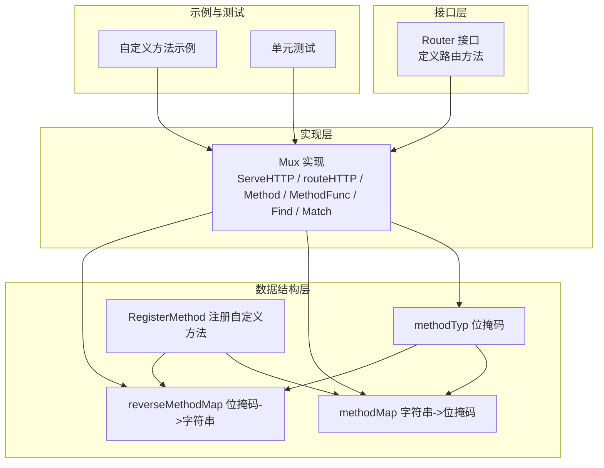
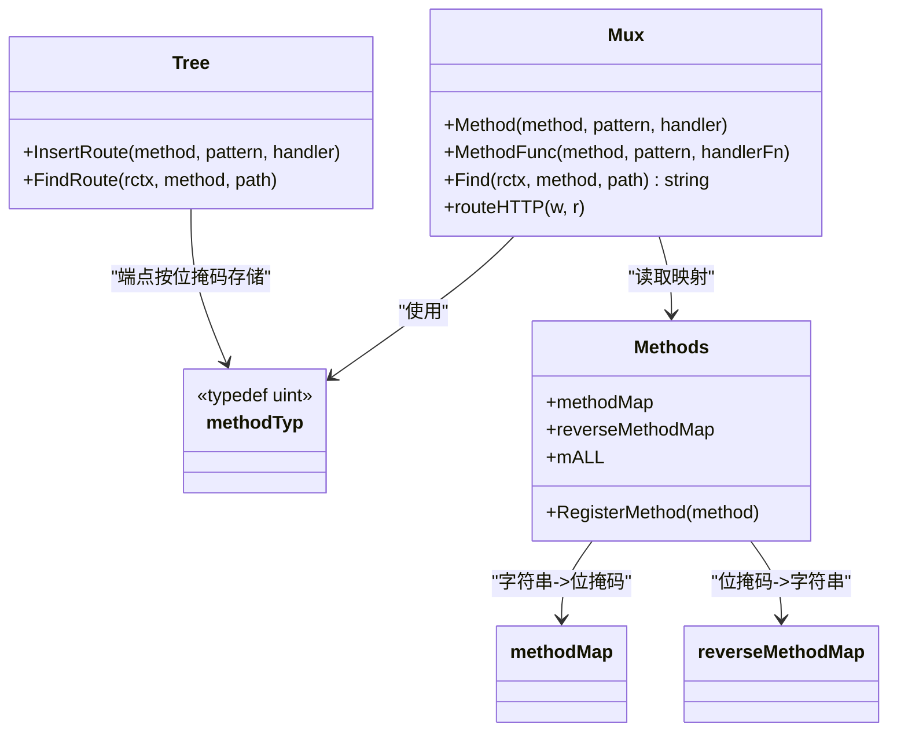
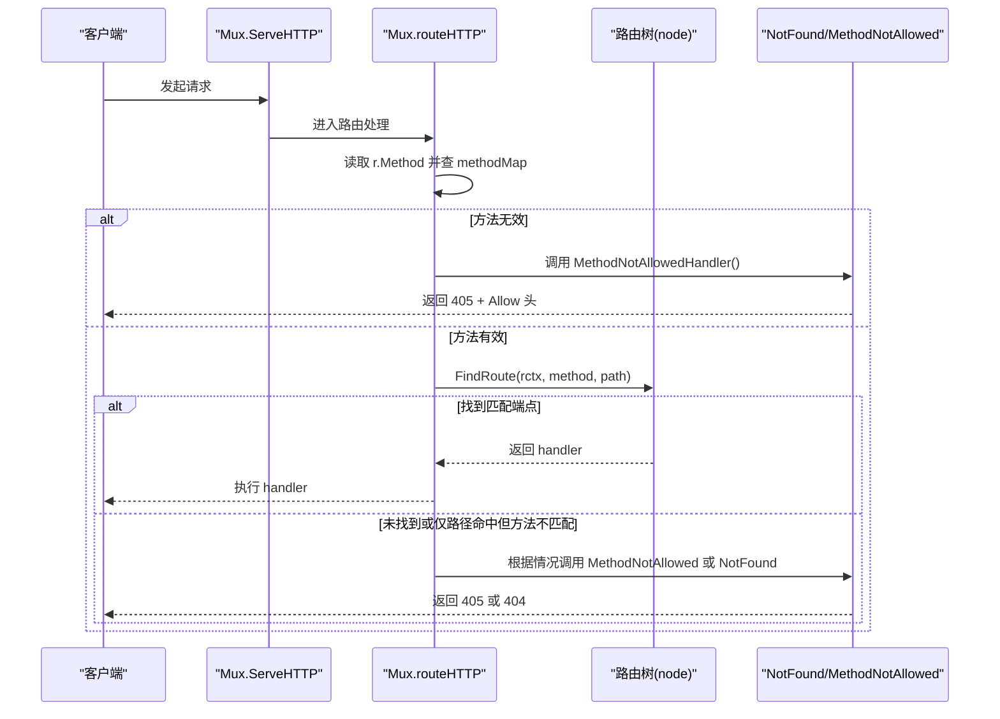
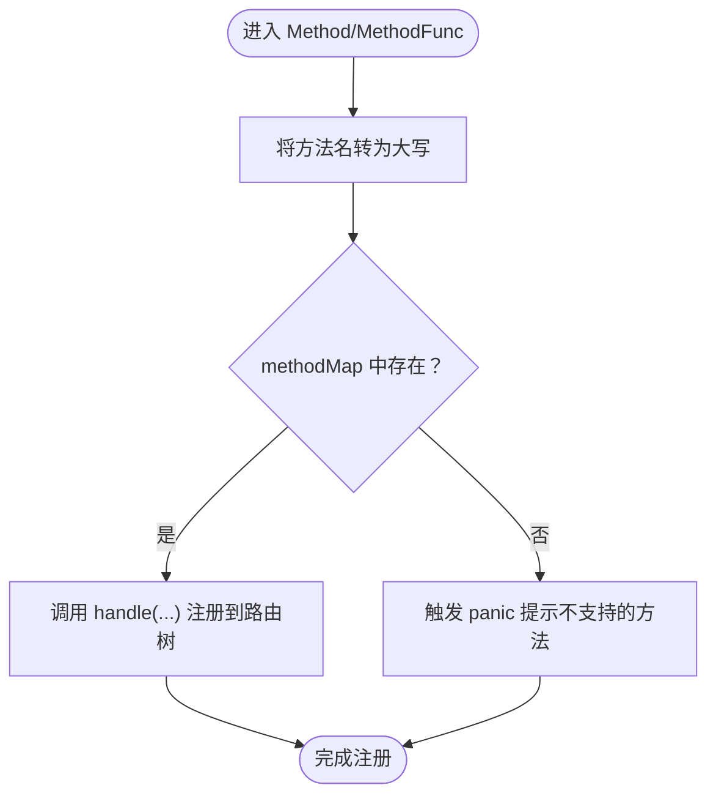
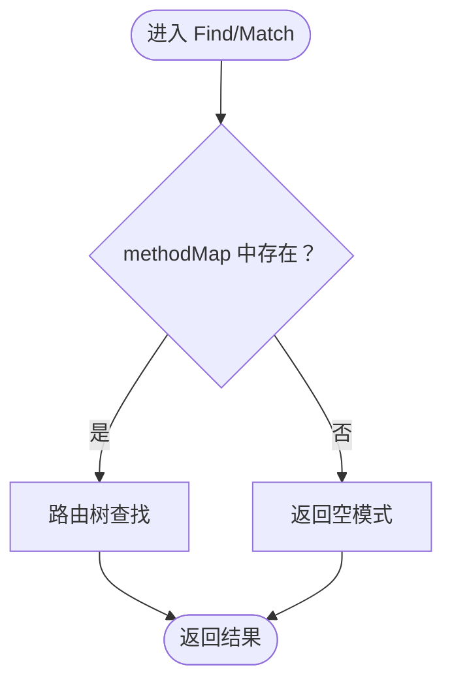
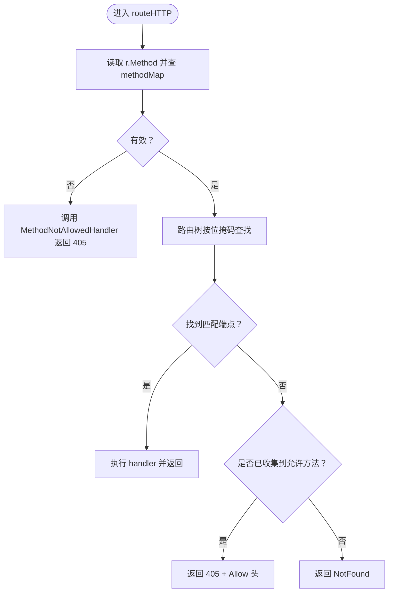
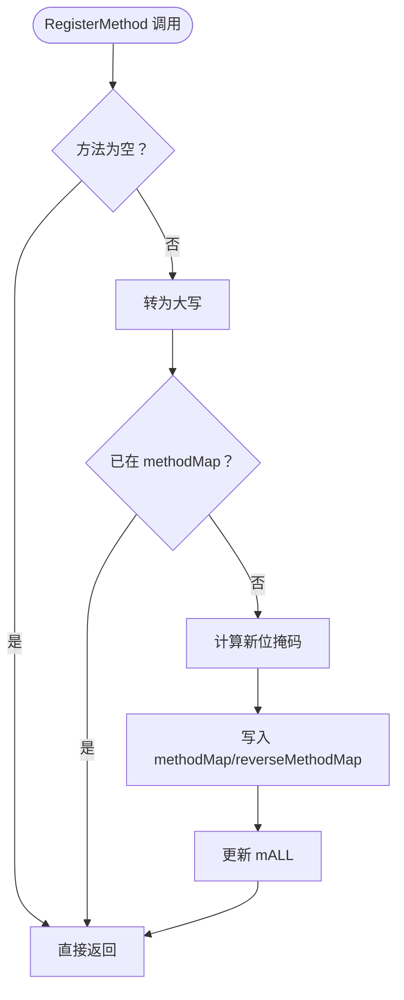
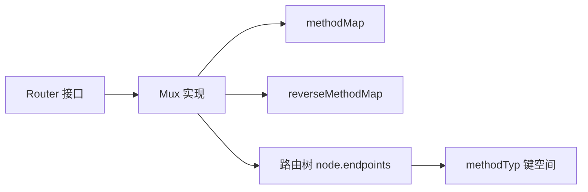

# HTTP方法验证

<cite>
**本文引用的文件列表**
- [chi.go](file://chi.go)
- [mux.go](file://mux.go)
- [tree.go](file://tree.go)
- [_examples/custom-method/main.go](file://_examples/custom-method/main.go)
- [mux_test.go](file://mux_test.go)
</cite>

## 目录
1. [引言](#引言)
2. [项目结构与定位](#项目结构与定位)
3. [核心组件：方法映射与验证机制](#核心组件方法映射与验证机制)
4. [架构总览：路由匹配前的HTTP方法验证流程](#架构总览路由匹配前的http方法验证流程)
5. [详细组件分析](#详细组件分析)
6. [依赖关系分析](#依赖关系分析)
7. [性能特性与优化建议](#性能特性与优化建议)
8. [故障排查指南](#故障排查指南)
9. [结论](#结论)
10. [附录：示例与最佳实践](#附录示例与最佳实践)

## 引言
本篇文档系统性讲解 chi 路由器在“路由匹配前”对 HTTP 方法进行验证的机制。重点包括：
- methodMap 映射表如何将字符串方法名（如 "GET"）转换为位掩码类型 methodTyp；
- 该设计如何通过位运算提升性能；
- 当开发者尝试注册不支持的 HTTP 方法时，框架如何通过 panic 机制确保路由定义的正确性；
- 在 Find 与 routeHTTP 中如何验证请求的 HTTP 方法有效性；
- 自定义 HTTP 方法的注册流程及其在 methodMap 中的存储方式。

## 项目结构与定位
- chi.go 定义了 Router 接口及核心路由方法（如 Get、Post、Method 等），并暴露了 Routes 接口用于匹配与查找。
- mux.go 实现了 Mux（路由器）的核心逻辑，包含 ServeHTTP、routeHTTP、Method、MethodFunc、Find、Match 等关键方法；并在注册阶段对 HTTP 方法进行验证。
- tree.go 定义了 methodTyp 位掩码类型、标准方法映射 methodMap、反向映射 reverseMethodMap，以及自定义方法注册函数 RegisterMethod；同时实现了路由树节点与端点存储结构。
- _examples/custom-method/main.go 展示了如何在应用启动阶段注册自定义 HTTP 方法，并在路由中使用。
- mux_test.go 包含大量测试用例，覆盖标准方法、子路由、自定义方法等场景，是理解验证流程的重要参考。

图表来源
- [chi.go](file://chi.go#L66-L133)
- [mux.go](file://mux.go#L107-L193)
- [tree.go](file://tree.go#L16-L76)
- [_examples/custom-method/main.go](file://_examples/custom-method/main.go#L1-L34)
- [mux_test.go](file://mux_test.go#L1760-L1805)

章节来源
- [chi.go](file://chi.go#L66-L133)
- [mux.go](file://mux.go#L107-L193)
- [tree.go](file://tree.go#L16-L76)
- [_examples/custom-method/main.go](file://_examples/custom-method/main.go#L1-L34)
- [mux_test.go](file://mux_test.go#L1760-L1805)

## 核心组件：方法映射与验证机制
- methodTyp 是一个无符号整型，采用位移的方式为每个 HTTP 方法分配唯一的二进制位，形成位掩码。标准方法包括 CONNECT、DELETE、GET、HEAD、OPTIONS、PATCH、POST、PUT、TRACE；另有 mALL 表示所有标准方法的组合。
- methodMap 将标准 HTTP 方法字符串映射到对应的 methodTyp 值；reverseMethodMap 则提供从位掩码到字符串的反向映射。
- RegisterMethod 允许在运行时注册自定义 HTTP 方法，将其加入 methodMap 和 reverseMethodMap，并更新 mALL，使自定义方法可被路由系统识别。

图表来源
- [tree.go](file://tree.go#L16-L76)
- [mux.go](file://mux.go#L125-L193)
- [mux.go](file://mux.go#L363-L487)

章节来源
- [tree.go](file://tree.go#L16-L76)
- [mux.go](file://mux.go#L125-L193)
- [mux.go](file://mux.go#L363-L487)

## 架构总览：路由匹配前的HTTP方法验证流程
- 注册阶段（路由定义时）
  - Method/MethodFunc 在注册路由时，会通过 methodMap 将字符串方法名转换为 methodTyp。
  - 若字符串方法不在 methodMap 中，直接触发 panic，阻止非法方法进入路由树。
- 请求阶段（路由匹配前）
  - routeHTTP 在进入路由树查找前，先检查请求的 r.Method 是否在 methodMap 中。
  - 若不在，直接调用 MethodNotAllowed 处理器返回 405。
- 查找阶段（路由匹配）
  - Find/Match 使用 methodMap 将方法字符串转换为 methodTyp，再在路由树中按位掩码查找匹配端点。
  - 若路径命中但方法不匹配，会收集允许的方法列表，最终返回 405 并设置 Allow 头。

图表来源
- [mux.go](file://mux.go#L441-L487)
- [mux.go](file://mux.go#L363-L413)
- [tree.go](file://tree.go#L373-L400)

章节来源
- [mux.go](file://mux.go#L441-L487)
- [mux.go](file://mux.go#L363-L413)
- [tree.go](file://tree.go#L373-L400)

## 详细组件分析

### 组件A：Method/MethodFunc 注册阶段的验证
- Method/MethodFunc 在注册时，会将传入的字符串方法名转换为大写后查表 methodMap。
- 如果不存在，则立即 panic，防止非法方法进入路由树，避免后续运行期错误。
- 该策略确保路由定义的正确性，且在编译期即可发现配置错误。

图表来源
- [mux.go](file://mux.go#L125-L139)

章节来源
- [mux.go](file://mux.go#L125-L139)

### 组件B：Find/Match 阶段的验证
- Find/Match 在执行前，先将方法字符串查表 methodMap。
- 若不存在，直接返回空模式，表示未匹配。
- 该设计避免了将非法方法带入路由树查找，减少不必要的遍历开销。

图表来源
- [mux.go](file://mux.go#L363-L394)

章节来源
- [mux.go](file://mux.go#L363-L394)

### 组件C：routeHTTP 路由匹配前的验证
- routeHTTP 在进入路由树前，会检查 r.Method 是否在 methodMap 中。
- 若不在，直接调用 MethodNotAllowedHandler 返回 405，并设置 Allow 头。
- 若存在，则继续在路由树中按位掩码查找匹配端点；若仅路径命中而方法不匹配，会收集允许的方法列表，最终返回 405。

图表来源
- [mux.go](file://mux.go#L441-L487)
- [tree.go](file://tree.go#L400-L543)

章节来源
- [mux.go](file://mux.go#L441-L487)
- [tree.go](file://tree.go#L400-L543)

### 组件D：自定义HTTP方法的注册与存储
- RegisterMethod 支持在应用启动阶段注册自定义 HTTP 方法。
- 注册流程：
  - 忽略空字符串；
  - 转为大写；
  - 若已存在则跳过；
  - 计算新位掩码（基于当前映射数量左移一位）；
  - 将新方法加入 methodMap 与 reverseMethodMap；
  - 更新 mALL 以包含新方法。
- 注册后，开发者可通过 Method/MethodFunc 使用该自定义方法。

图表来源
- [tree.go](file://tree.go#L58-L76)

章节来源
- [tree.go](file://tree.go#L58-L76)
- [_examples/custom-method/main.go](file://_examples/custom-method/main.go#L1-L34)
- [mux_test.go](file://mux_test.go#L1760-L1805)

## 依赖关系分析
- Router 接口定义了路由方法（Get、Post、Method 等），Mux 实现了这些方法的具体逻辑。
- Mux 在注册与请求处理两个阶段均依赖 methodMap 进行方法校验。
- 路由树 node 的 endpoints 使用 methodTyp 作为键，实现按方法快速定位端点。
- reverseMethodMap 用于生成 405 响应的 Allow 头。

图表来源
- [chi.go](file://chi.go#L66-L133)
- [mux.go](file://mux.go#L107-L193)
- [tree.go](file://tree.go#L16-L76)

章节来源
- [chi.go](file://chi.go#L66-L133)
- [mux.go](file://mux.go#L107-L193)
- [tree.go](file://tree.go#L16-L76)

## 性能特性与优化建议
- 位掩码设计的优势
  - methodTyp 采用位移分配唯一标识，查找为 O(1) 哈希表操作；
  - 按位与运算可用于快速判断“是否包含某方法”或“是否为全部方法”，避免字符串比较；
  - mALL 一次性聚合所有标准方法，便于批量匹配。
- 早期失败策略
  - 在注册阶段与请求阶段均进行方法校验，尽早拒绝非法输入，减少后续路由树遍历成本；
  - Find/Match 在进入路由树前就丢弃无效方法，避免无谓的路径匹配。
- 自定义方法的限制
  - RegisterMethod 会根据当前映射数量计算新位掩码，存在上限保护（IntSize-2），防止位掩码溢出。

章节来源
- [tree.go](file://tree.go#L16-L76)
- [mux.go](file://mux.go#L125-L139)
- [mux.go](file://mux.go#L363-L394)
- [mux.go](file://mux.go#L441-L487)

## 故障排查指南
- 注册不支持的 HTTP 方法
  - 现象：在调用 Method/MethodFunc 时触发 panic，提示该方法不受支持。
  - 排查：确认方法名大小写与拼写；若为自定义方法，需先调用 RegisterMethod 注册。
  - 参考路径：[mux.go](file://mux.go#L125-L139)
- 请求使用不受支持的方法
  - 现象：返回 405 Method Not Allowed，且响应头包含 Allow 列表。
  - 排查：检查路由树中该路径允许的方法集合；确认客户端请求方法是否正确。
  - 参考路径：[mux.go](file://mux.go#L441-L487)
- 自定义方法未生效
  - 现象：Method/MethodFunc 报错或 405。
  - 排查：确认 RegisterMethod 已在路由注册前调用；确保未重复注册导致被忽略。
  - 参考路径：[tree.go](file://tree.go#L58-L76)，[_examples/custom-method/main.go](file://_examples/custom-method/main.go#L1-L34)

章节来源
- [mux.go](file://mux.go#L125-L139)
- [mux.go](file://mux.go#L441-L487)
- [tree.go](file://tree.go#L58-L76)
- [_examples/custom-method/main.go](file://_examples/custom-method/main.go#L1-L34)

## 结论
chi 在“路由匹配前”的 HTTP 方法验证通过 methodMap + methodTyp 的位掩码设计实现，既保证了注册与请求阶段的早期失败，又通过哈希表与位运算提升了性能。标准方法与自定义方法共享同一验证与存储机制，确保一致性与可扩展性。开发者应遵循“先注册后使用”的原则，配合 RegisterMethod 实现自定义方法的无缝集成。

## 附录：示例与最佳实践
- 标准方法使用
  - 通过 Get、Post、Method 等接口注册路由，框架自动进行方法校验。
  - 参考路径：[chi.go](file://chi.go#L96-L106)
- 自定义方法注册与使用
  - 在应用初始化阶段调用 RegisterMethod 注册自定义方法；
  - 使用 Method/MethodFunc 指定自定义方法与路径；
  - 参考路径：[_examples/custom-method/main.go](file://_examples/custom-method/main.go#L1-L34)，[mux_test.go](file://mux_test.go#L1760-L1805)
- 方法验证流程的测试覆盖
  - 测试用例覆盖了标准方法、子路由、自定义方法等场景，可作为行为参考。
  - 参考路径：[mux_test.go](file://mux_test.go#L1760-L1805)