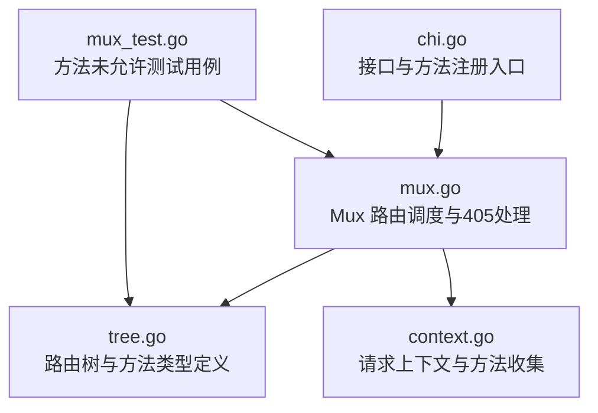
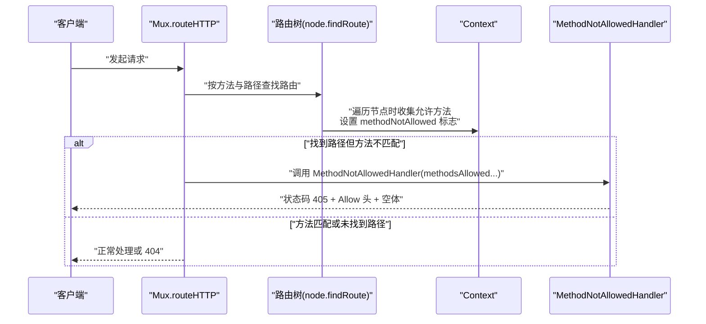
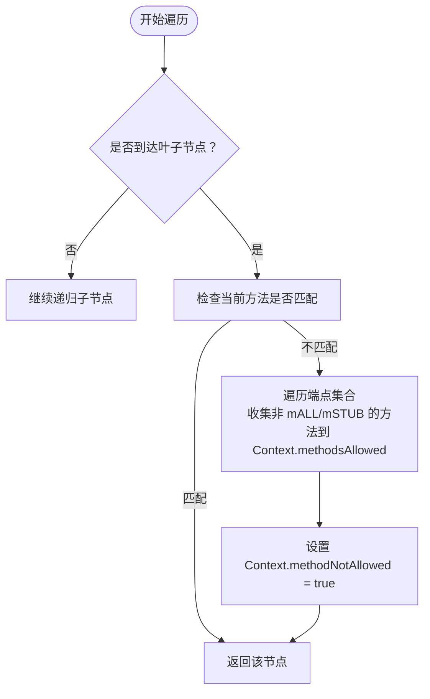
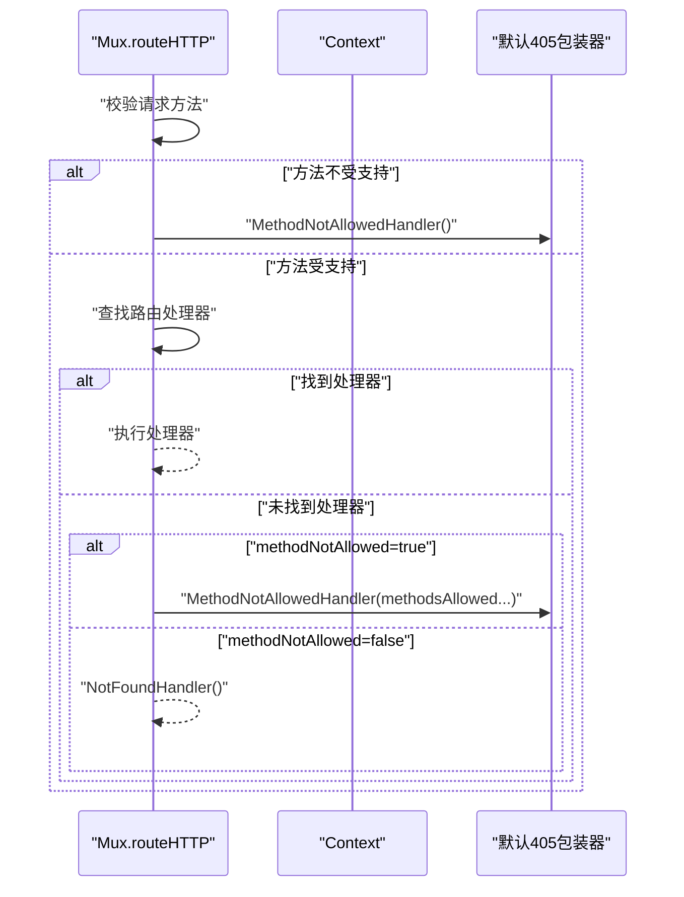
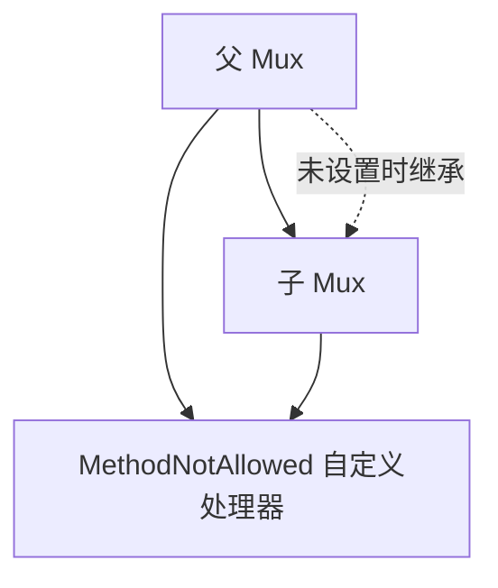
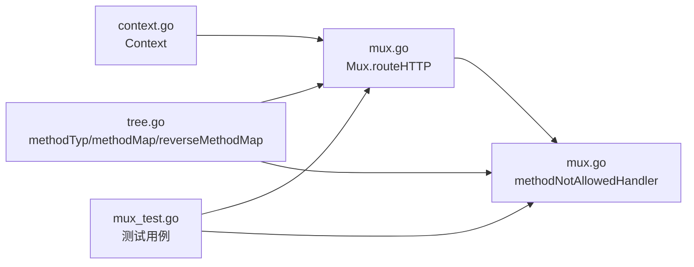

# 方法未允许处理

<cite>
**本文引用的文件**
- [chi.go](file://chi.go)
- [mux.go](file://mux.go)
- [tree.go](file://tree.go)
- [context.go](file://context.go)
- [mux_test.go](file://mux_test.go)
</cite>

## 目录
1. [引言](#引言)
2. [项目结构](#项目结构)
3. [核心组件](#核心组件)
4. [架构总览](#架构总览)
5. [详细组件分析](#详细组件分析)
6. [依赖关系分析](#依赖关系分析)
7. [性能考量](#性能考量)
8. [故障排查指南](#故障排查指南)
9. [结论](#结论)
10. [附录](#附录)

## 引言
本文件系统性阐述 chi 框架在“路由路径已匹配但 HTTP 方法不匹配”场景下的处理机制，重点解释：
- 当路由命中但方法不匹配时，框架如何收集所有允许的方法；
- reverseMethodMap 如何将内部 methodTyp 位掩码转换为标准 HTTP 方法字符串；
- methodNotAllowedHandler 如何生成符合 HTTP 规范的 405 响应（状态码、Allow 头、空响应体）；
- 通过测试用例验证 Allow 头的正确性与行为边界。

## 项目结构
围绕方法未允许处理的关键文件与职责如下：
- chi.go：定义 Router 接口及方法注册入口（如 Get、Post 等），并提供 MethodNotAllowed 配置入口。
- mux.go：Mux 的核心调度逻辑，包含路由查找、方法校验、405 响应生成与默认处理器链。
- tree.go：路由树节点与方法类型定义，包含 methodTyp、methodMap、reverseMethodMap，以及方法集合遍历与收集。
- context.go：请求上下文 Context，记录方法未允许标志与允许方法列表等。
- mux_test.go：覆盖方法未允许的测试用例，验证 Allow 头与状态码行为。



图表来源
- [chi.go](file://chi.go#L60-L138)
- [mux.go](file://mux.go#L441-L487)
- [tree.go](file://tree.go#L16-L76)
- [context.go](file://context.go#L45-L96)
- [mux_test.go](file://mux_test.go#L394-L429)

章节来源
- [chi.go](file://chi.go#L60-L138)
- [mux.go](file://mux.go#L441-L487)
- [tree.go](file://tree.go#L16-L76)
- [context.go](file://context.go#L45-L96)
- [mux_test.go](file://mux_test.go#L394-L429)

## 核心组件
- 方法类型与映射
  - methodTyp 是位掩码类型，用于表示 HTTP 方法集合；内置标准方法常量包括 mCONNECT、mDELETE、mGET、mHEAD、mOPTIONS、mPATCH、mPOST、mPUT、mTRACE。
  - methodMap 将标准 HTTP 方法字符串映射到 methodTyp 值；reverseMethodMap 则反向映射，将 methodTyp 映射回标准字符串。
- 上下文 Context
  - 记录 methodNotAllowed 标志与 methodsAllowed 列表，用于在路由树遍历时收集该路径上所有可用方法。
- Mux 路由器
  - 在路由查找过程中，若找到路径但方法不匹配，则将 Context 中收集到的 methodsAllowed 传入 MethodNotAllowedHandler，生成 405 响应。
- 默认 405 处理器
  - methodNotAllowedHandler 会将每个允许方法写入 Allow 响应头，设置状态码为 405，并输出空响应体。

章节来源
- [tree.go](file://tree.go#L16-L76)
- [context.go](file://context.go#L45-L96)
- [mux.go](file://mux.go#L405-L412)
- [mux.go](file://mux.go#L517-L528)

## 架构总览
下图展示了从请求进入 Mux 到最终生成 405 响应的完整流程，包括方法校验、路由树遍历、允许方法收集与响应生成。



图表来源
- [mux.go](file://mux.go#L441-L487)
- [tree.go](file://tree.go#L468-L524)
- [context.go](file://context.go#L76-L79)
- [mux.go](file://mux.go#L517-L528)

## 详细组件分析

### 组件一：路由树中的方法收集与标志设置
- 路由树遍历
  - 在 node.findRoute 中，当某条分支到达叶子节点但当前方法不匹配时，会遍历该节点的所有端点（endpoints），跳过 mALL 与 mSTUB，将其他方法对应的 methodTyp 追加到 Context.methodsAllowed。
  - 同时设置 Context.methodNotAllowed 为 true，标记“路径存在但方法不匹配”的情况。
- 收集范围
  - 仅收集当前叶子节点上已注册的方法集合，确保 Allow 头只包含该路径上的实际允许方法。



图表来源
- [tree.go](file://tree.go#L468-L524)
- [context.go](file://context.go#L76-L79)

章节来源
- [tree.go](file://tree.go#L468-L524)
- [context.go](file://context.go#L76-L79)

### 组件二：Mux 中的方法校验与 405 分发
- 方法校验
  - 在 Mux.routeHTTP 中，先将请求方法映射到 methodTyp；若不在支持范围内，直接调用 MethodNotAllowedHandler（无参数）。
- 路由查找
  - 若未找到匹配处理器，检查 Context.methodNotAllowed 标志：
    - 若为 true：调用 MethodNotAllowedHandler(rctx.methodsAllowed...)，传入收集到的允许方法集合。
    - 否则：调用 NotFoundHandler。
- 默认处理器选择
  - MethodNotAllowedHandler 可由用户自定义；若未自定义，默认使用 methodNotAllowedHandler 包装器。



图表来源
- [mux.go](file://mux.go#L441-L487)
- [mux.go](file://mux.go#L405-L412)

章节来源
- [mux.go](file://mux.go#L441-L487)
- [mux.go](file://mux.go#L405-L412)

### 组件三：reverseMethodMap 的作用与 Allow 头构建
- reverseMethodMap 的作用
  - 将内部 methodTyp 位掩码转换为标准 HTTP 方法字符串（如 GET、POST 等）。
- Allow 头构建
  - methodNotAllowedHandler 遍历传入的 methodsAllowed，逐个调用 Header.Add("Allow", reverseMethodMap[m])，最终设置状态码 405 并输出空响应体。

```mermaid
flowchart TD
A["接收 methodsAllowed[methodTyp...]"] --> B["遍历每个 methodTyp"]
B --> C["reverseMethodMap[methodTyp] -> 标准方法字符串"]
C --> D["Header.Add(\"Allow\", 方法字符串)"]
D --> E["设置状态码 405"]
E --> F["写入空响应体"]
```

图表来源
- [tree.go](file://tree.go#L46-L56)
- [mux.go](file://mux.go#L517-L528)

章节来源
- [tree.go](file://tree.go#L46-L56)
- [mux.go](file://mux.go#L517-L528)

### 组件四：用户自定义 405 处理器与子路由器继承
- 自定义处理器
  - 用户可通过 Mux.MethodNotAllowed 注册自定义 405 处理器；该处理器会继承父级中间件栈。
- 子路由器继承
  - 当通过 Mount 或 Route 挂载子路由器时，若子路由器未显式设置 MethodNotAllowed，将自动继承父级处理器。



图表来源
- [mux.go](file://mux.go#L215-L233)
- [mux.go](file://mux.go#L300-L307)

章节来源
- [mux.go](file://mux.go#L215-L233)
- [mux.go](file://mux.go#L300-L307)

### 组件五：测试用例验证行为
- 已注册方法不应返回 Allow 头
  - 对于已注册的 GET/HEAD 等方法，状态码应为 200，且不应出现 Allow 头。
- 未注册方法应返回 405 与 Allow 头
  - 对于未注册的 POST 等方法，状态码应为 405，Allow 头应包含该路径上所有允许的方法（例如 GET、HEAD）。
- 子路由器 405 行为
  - 子路由器可独立设置 MethodNotAllowed，优先于父级；否则继承父级。

章节来源
- [mux_test.go](file://mux_test.go#L394-L429)
- [mux_test.go](file://mux_test.go#L431-L495)

## 依赖关系分析
- 方法类型与映射
  - methodTyp 与 methodMap/reverseMethodMap 定义在 tree.go，供路由树与处理器共同使用。
- 上下文与路由树
  - Context 在路由树遍历中被修改，记录允许方法与标志位，供 Mux 在后续阶段使用。
- Mux 与处理器
  - Mux.routeHTTP 依赖 Context 的收集结果决定调用 MethodNotAllowedHandler 或 NotFoundHandler。
- 测试驱动
  - mux_test.go 通过 HTTP 请求验证 405 行为与 Allow 头内容。



图表来源
- [tree.go](file://tree.go#L16-L76)
- [context.go](file://context.go#L45-L96)
- [mux.go](file://mux.go#L441-L487)
- [mux.go](file://mux.go#L517-L528)
- [mux_test.go](file://mux_test.go#L394-L429)

章节来源
- [tree.go](file://tree.go#L16-L76)
- [context.go](file://context.go#L45-L96)
- [mux.go](file://mux.go#L441-L487)
- [mux.go](file://mux.go#L517-L528)
- [mux_test.go](file://mux_test.go#L394-L429)

## 性能考量
- 位掩码存储与快速判断
  - 使用 methodTyp 位掩码表示方法集合，避免频繁字符串比较，提升路由匹配与允许方法收集效率。
- 单次遍历收集
  - 路由树遍历在发现路径但方法不匹配时一次性收集所有允许方法，避免重复扫描。
- Header 写入策略
  - 405 响应仅写入 Allow 头与状态码，不写入响应体，减少网络传输与内存占用。

## 故障排查指南
- Allow 头为空或缺失
  - 确认请求方法确实未在该路径注册；检查 Context.methodsAllowed 是否被正确填充。
- Allow 头内容异常
  - 检查 reverseMethodMap 是否包含对应 methodTyp；确认未误将 mALL 或 mSTUB 加入 Allow。
- 自定义 405 未生效
  - 确认已调用 Mux.MethodNotAllowed 设置处理器；若挂载子路由器，确认子路由器是否继承父级或已设置独立处理器。
- 子路由器 405 不一致
  - 检查子路由器是否显式设置了 MethodNotAllowed；否则将继承父级处理器。

章节来源
- [mux.go](file://mux.go#L215-L233)
- [mux.go](file://mux.go#L300-L307)
- [tree.go](file://tree.go#L46-L56)
- [context.go](file://context.go#L76-L79)

## 结论
chi 框架在“路径匹配但方法不匹配”时，通过路由树遍历收集允许方法，结合 reverseMethodMap 将位掩码转换为标准方法字符串，最终以 405 响应返回 Allow 头与空响应体。该机制既满足 HTTP 规范，又具备良好的扩展性与性能表现。用户可通过 MethodNotAllowed 自定义 405 行为，并在子路由器中灵活继承或覆盖。

## 附录
- 关键实现位置参考
  - 方法类型与映射：[tree.go](file://tree.go#L16-L76)
  - 上下文与标志：[context.go](file://context.go#L45-L96)
  - 路由查找与 405 分发：[mux.go](file://mux.go#L441-L487)
  - 默认 405 处理器：[mux.go](file://mux.go#L517-L528)
  - 测试用例验证：[mux_test.go](file://mux_test.go#L394-L429)