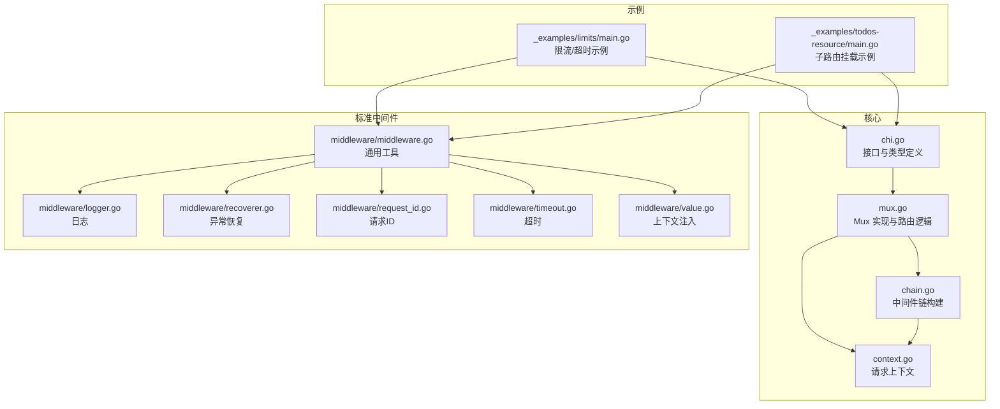
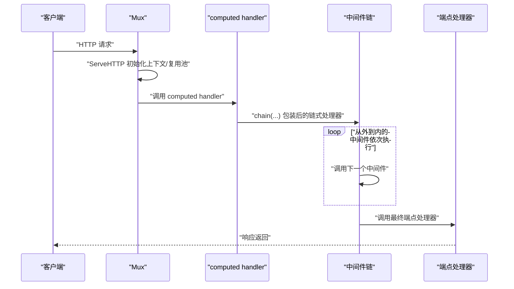
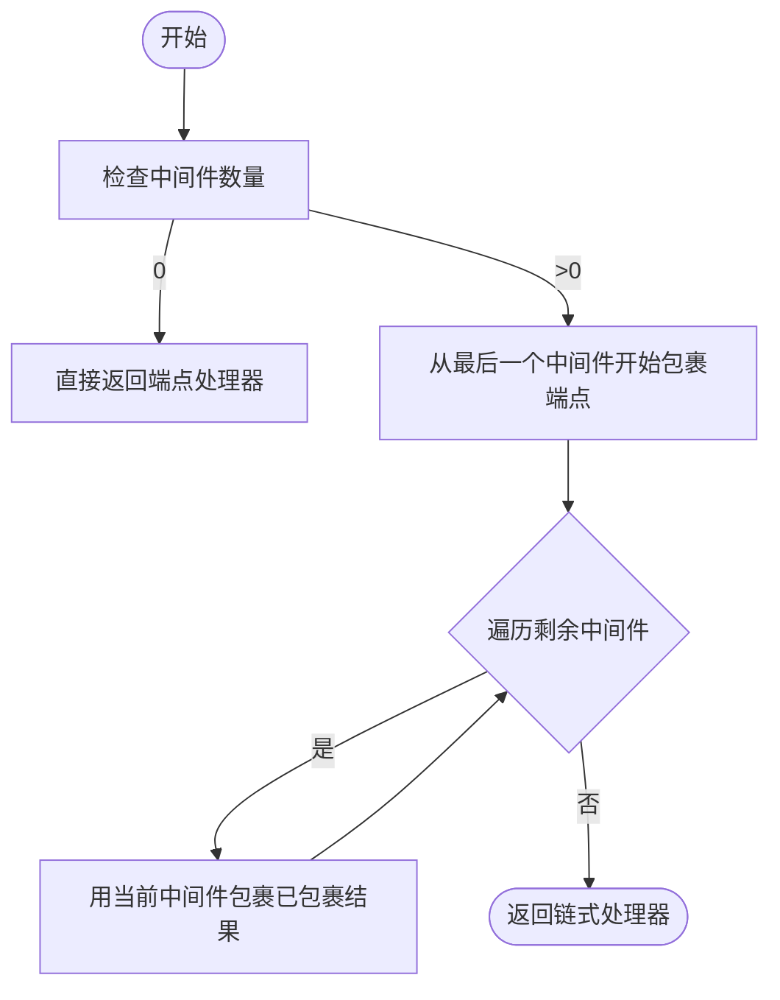
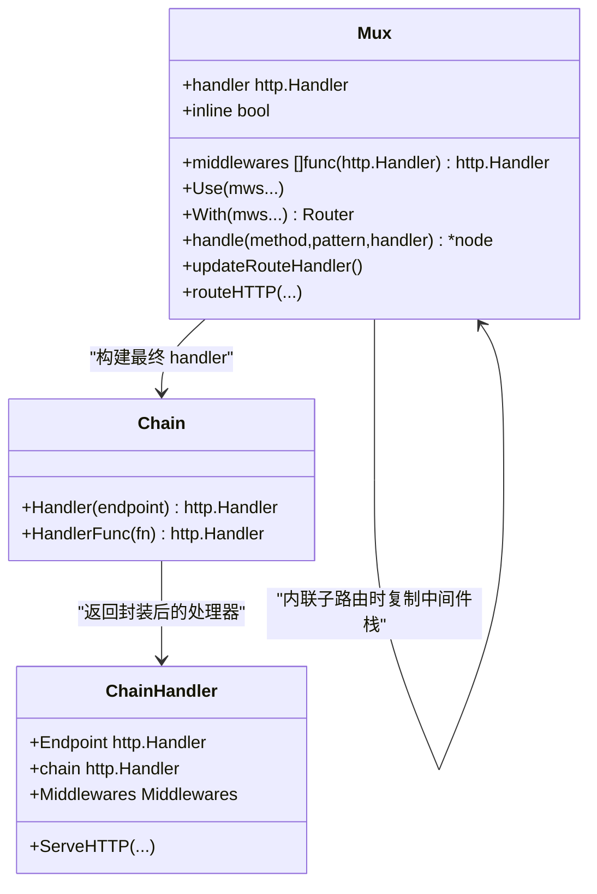
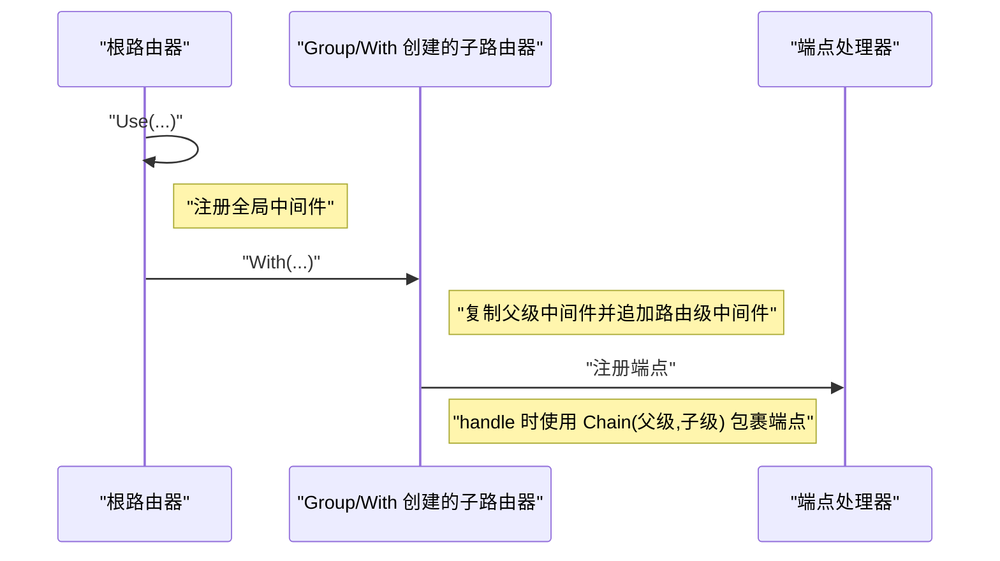
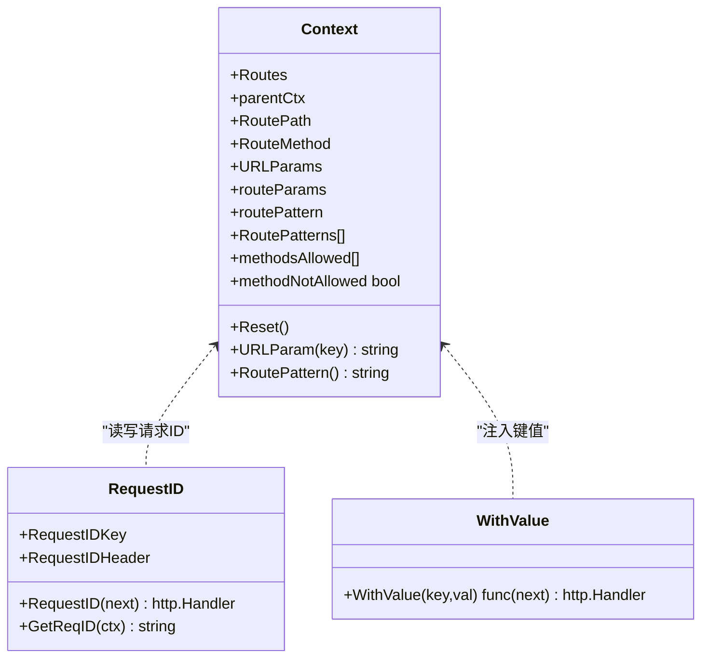
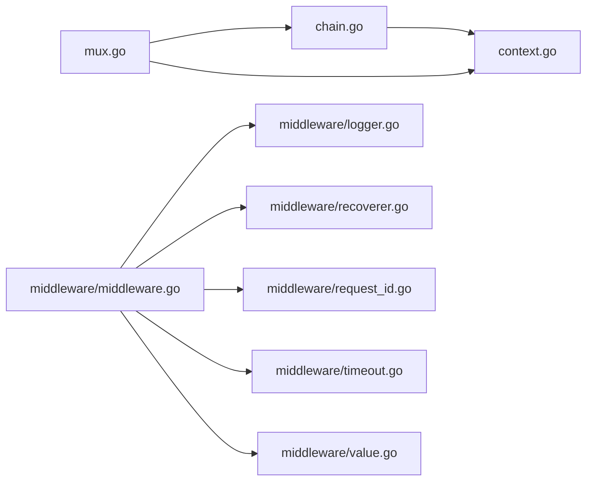

# 中间件链执行机制

<cite>
**本文引用的文件**
- [chain.go](file://chain.go)
- [chi.go](file://chi.go)
- [mux.go](file://mux.go)
- [context.go](file://context.go)
- [middleware/middleware.go](file://middleware/middleware.go)
- [middleware/logger.go](file://middleware/logger.go)
- [middleware/recoverer.go](file://middleware/recoverer.go)
- [middleware/request_id.go](file://middleware/request_id.go)
- [middleware/timeout.go](file://middleware/timeout.go)
- [middleware/value.go](file://middleware/value.go)
- [_examples/limits/main.go](file://_examples/limits/main.go)
- [_examples/todos-resource/main.go](file://_examples/todos-resource/main.go)
</cite>

## 目录
1. [引言](#引言)
2. [项目结构](#项目结构)
3. [核心组件](#核心组件)
4. [架构总览](#架构总览)
5. [详细组件分析](#详细组件分析)
6. [依赖关系分析](#依赖关系分析)
7. [性能考量](#性能考量)
8. [故障排查指南](#故障排查指南)
9. [结论](#结论)
10. [附录](#附录)

## 引言
本文件深入解析 chi 框架中“中间件链”的构建与执行流程，重点阐述：
- chain 函数如何将多个中间件组合为单一处理器；
- 中间件链与 Mux.handler 的集成方式；
- 请求处理流程中的调用顺序与责任链模式；
- 通过闭包机制实现中间件链式调用；
- 结合 Use、With 等方法的实际调用示例，展示中间件栈的累积与继承行为；
- 中间件如何访问和修改请求上下文，以及如何实现短路处理（如身份验证失败直接返回）；
- 自定义中间件的最佳实践（错误处理、性能监控、资源清理），并指出常见陷阱（如中间件注册顺序错误导致的功能异常）。

## 项目结构
chi 的中间件链相关代码主要分布在以下模块：
- 路由器与中间件栈：mux.go、chi.go
- 中间件链构建与执行：chain.go
- 请求上下文与参数：context.go
- 标准中间件示例：middleware/*.go
- 示例程序：_examples/*

图表来源
- [chi.go](file://chi.go#L60-L138)
- [mux.go](file://mux.go#L1-L120)
- [chain.go](file://chain.go#L1-L50)
- [context.go](file://context.go#L1-L80)
- [middleware/middleware.go](file://middleware/middleware.go#L1-L24)
- [_examples/limits/main.go](file://_examples/limits/main.go#L1-L93)
- [_examples/todos-resource/main.go](file://_examples/todos-resource/main.go#L1-L31)

章节来源
- [chi.go](file://chi.go#L60-L138)
- [mux.go](file://mux.go#L1-L120)
- [chain.go](file://chain.go#L1-L50)
- [context.go](file://context.go#L1-L80)

## 核心组件
- Router 接口与 Middlewares 类型：定义了 Use、With、Group、Route、Mount 等方法，以及 Middlewares 切片类型，用于组合中间件链。
- Mux：实现了 Router 接口，维护全局中间件栈、路由树、上下文池、NotFound/MethodNotAllowed 处理器；负责将中间件链与路由树整合为最终的 handler。
- Chain 与 chain：提供 Middlewares 的 Handler/HandlerFunc 构造方法，以及内部链式包装函数，按传入顺序从外到内包裹端点处理器。
- Context：请求上下文容器，承载路由路径、方法、URL 参数、匹配模式栈、允许方法集合等，贯穿整个请求生命周期。

章节来源
- [chi.go](file://chi.go#L60-L138)
- [mux.go](file://mux.go#L1-L120)
- [chain.go](file://chain.go#L1-L50)
- [context.go](file://context.go#L1-L80)

## 架构总览
下面以序列图展示一次请求从进入 Mux 到最终到达端点处理器的完整链路，以及中间件链的构建与执行过程。

图表来源
- [mux.go](file://mux.go#L60-L120)
- [chain.go](file://chain.go#L10-L50)

## 详细组件分析

### 中间件链构建与执行（chain 函数）
- 构建策略：chain 将中间件数组从最后一个开始，逐个包裹前一个，形成“外层包裹内层”的链式结构。当无中间件时，直接返回端点处理器。
- 执行顺序：由于包裹顺序是从后往前，因此链式执行顺序为“先注册的中间件在外层，最后执行”，符合责任链模式的“外层先检查、可短路”的特性。
- 返回值：返回一个实现了 http.Handler 的处理器，可在 Mux 中作为最终 handler 使用。

图表来源
- [chain.go](file://chain.go#L34-L49)

章节来源
- [chain.go](file://chain.go#L10-L50)

### Mux.handler 与中间件链的集成
- 全局中间件：Mux 维护一个全局 middlewares 切片，Use 方法追加中间件；一旦路由注册完成（updateRouteHandler 被调用），就不再允许追加中间件。
- 计算 handler：updateRouteHandler 将全局中间件与 Mux 内部的 routeHTTP 组合成最终的 handler。
- 路由级中间件：handle 在注册具体路由时，若处于内联子路由（inline），会使用 Chain(mx.middlewares...) 对端点进行包裹，形成“全局中间件 + 路由级中间件”的叠加。
- NotFound/MethodNotAllowed：当这些处理器被设置时，也会根据是否内联，将父级中间件链应用到它们之上。

图表来源
- [mux.go](file://mux.go#L420-L516)
- [chain.go](file://chain.go#L10-L33)

章节来源
- [mux.go](file://mux.go#L94-L120)
- [mux.go](file://mux.go#L414-L516)
- [chain.go](file://chain.go#L10-L33)

### 调用顺序与责任链模式
- 注册顺序决定执行顺序：先注册的中间件在外层，后注册的在内层。这使得外层中间件可以提前短路（如鉴权失败直接返回），避免后续中间件与端点执行。
- 闭包机制：每个中间件函数返回一个闭包，该闭包持有 next（下一个处理器）并在内部调用 next.ServeHTTP，从而形成链式调用。
- 短路处理：当外层中间件检测到异常或不满足条件时，可直接写入响应并返回，不再调用 next，实现“短路”。

章节来源
- [chain.go](file://chain.go#L34-L49)
- [middleware/recoverer.go](file://middleware/recoverer.go#L23-L49)
- [middleware/request_id.go](file://middleware/request_id.go#L62-L79)

### Use 与 With 的累积与继承
- Use：向 Mux 的全局中间件栈追加中间件；要求在所有路由注册之前调用，否则会触发 panic。
- With：创建一个新的内联 Mux，复制父级中间件栈，再追加新的路由级中间件，形成“父级中间件 + 子级中间件”的叠加。With 返回的子路由器可继续嵌套，形成多层继承。
- Group：With() 的便捷封装，适合对同一路径下的多个路由统一添加中间件。

图表来源
- [mux.go](file://mux.go#L94-L120)
- [mux.go](file://mux.go#L235-L280)
- [mux.go](file://mux.go#L414-L437)

章节来源
- [mux.go](file://mux.go#L94-L120)
- [mux.go](file://mux.go#L235-L280)
- [mux.go](file://mux.go#L414-L437)

### 请求上下文的访问与修改
- Context 容器：包含 RoutePath、RouteMethod、URLParams、RoutePatterns、methodsAllowed 等字段，贯穿请求生命周期。
- 上下文键：RouteCtxKey 用于在 context.Context 中存储 Context；URLParam/URLParamFromCtx 提供从请求或上下文中读取参数的方法。
- 中间件对上下文的使用：中间件可读取/写入上下文中的路由信息（如 RoutePattern），也可通过 WithValue 注入自定义键值，供下游中间件或端点使用。
- 请求 ID：RequestID 中间件在请求进入时生成或提取 X-Request-Id，并写入上下文，便于日志关联。

图表来源
- [context.go](file://context.go#L1-L167)
- [middleware/request_id.go](file://middleware/request_id.go#L1-L97)
- [middleware/value.go](file://middleware/value.go#L1-L18)

章节来源
- [context.go](file://context.go#L1-L167)
- [middleware/request_id.go](file://middleware/request_id.go#L1-L97)
- [middleware/value.go](file://middleware/value.go#L1-L18)

### 实际调用示例与最佳实践

#### 示例一：全局中间件与路由级中间件
- 全局中间件：RequestID、Logger、Recoverer 依次注册，形成“请求ID -> 日志 -> 异常恢复”的全局链。
- 路由级中间件：在 Group 中注册 Timeout，仅对慢操作进行超时控制，避免影响其他路由。
- 端点处理：在端点中通过 r.Context() 获取超时信号，实现优雅退出。

章节来源
- [_examples/limits/main.go](file://_examples/limits/main.go#L21-L93)

#### 示例二：子路由挂载与中间件继承
- 根路由器注册全局中间件（RequestID、RealIP、Logger、Recoverer）。
- 使用 Mount 将子资源挂载到特定路径，子路由自动继承父级中间件栈。
- 子路由内部可继续使用 With/Group 添加额外中间件，形成“父级 + 子级”的叠加。

章节来源
- [_examples/todos-resource/main.go](file://_examples/todos-resource/main.go#L14-L31)
- [mux.go](file://mux.go#L282-L340)

#### 最佳实践
- 错误处理：Recoverer 应置于日志之后，确保异常发生时仍能记录日志。
- 性能监控：Logger 中间件应放在靠近端点的位置，以便统计真实耗时；必要时配合 WithValue 注入指标键值。
- 资源清理：在中间件的 defer 中进行清理（如关闭连接、释放锁），避免泄漏。
- 短路处理：鉴权、限流等前置校验应在链前端尽早失败并返回，减少后续开销。
- 上下文传递：通过 WithValue 注入只在本次请求有效的数据，避免全局状态污染。

章节来源
- [middleware/logger.go](file://middleware/logger.go#L23-L41)
- [middleware/recoverer.go](file://middleware/recoverer.go#L17-L49)
- [middleware/request_id.go](file://middleware/request_id.go#L62-L79)
- [middleware/timeout.go](file://middleware/timeout.go#L9-L49)
- [middleware/value.go](file://middleware/value.go#L1-L18)

## 依赖关系分析
- Mux 依赖 chain 构建最终 handler；
- Mux 依赖 context 提供路由上下文；
- 中间件通过闭包持有 next，形成链式依赖；
- 标准中间件依赖 context 进行上下文读写。

图表来源
- [mux.go](file://mux.go#L414-L516)
- [chain.go](file://chain.go#L10-L50)
- [context.go](file://context.go#L1-L80)
- [middleware/middleware.go](file://middleware/middleware.go#L1-L24)

章节来源
- [mux.go](file://mux.go#L414-L516)
- [chain.go](file://chain.go#L10-L50)
- [context.go](file://context.go#L1-L80)
- [middleware/middleware.go](file://middleware/middleware.go#L1-L24)

## 性能考量
- 中间件数量与顺序：中间件越多，每次请求的包裹与调用次数越多。建议将高频短路中间件置于外层，减少不必要的后续调用。
- 上下文池化：Mux 使用 sync.Pool 复用 Context，降低分配开销。
- 链式构建成本：chain 在路由注册阶段一次性构建链式处理器，运行时只需一次链式调用，避免重复包裹。
- 日志与异常恢复：Logger 与 Recoverer 的顺序会影响性能与可观测性，需权衡。

章节来源
- [mux.go](file://mux.go#L60-L92)
- [chain.go](file://chain.go#L34-L49)

## 故障排查指南
- 中间件注册顺序错误：
  - 现象：日志未记录或异常未被捕获。
  - 原因：Recoverer 应在 Logger 之后，否则异常可能在日志前被吞掉。
  - 解决：调整 Use 的调用顺序。
- 在路由注册后追加中间件：
  - 现象：panic。
  - 原因：Mux 在路由注册完成后禁止再追加中间件。
  - 解决：将 Use 放在所有 Handle/HandleFunc 之前。
- 超时未生效：
  - 现象：端点未响应超时信号。
  - 原因：端点未监听 r.Context().Done()。
  - 解决：在端点中正确处理 ctx.Done() 并返回。
- 子路由未继承中间件：
  - 现象：子路由缺少全局中间件效果。
  - 原因：未使用 With/Group 或 Mount 未正确挂载。
  - 解决：使用 With/Group 或确保 Mount 正确配置。

章节来源
- [mux.go](file://mux.go#L94-L120)
- [middleware/logger.go](file://middleware/logger.go#L23-L41)
- [middleware/recoverer.go](file://middleware/recoverer.go#L23-L49)
- [_examples/limits/main.go](file://_examples/limits/main.go#L40-L93)

## 结论
chi 的中间件链通过“从外到内”的包裹策略与闭包机制，实现了清晰的责任链模式。Mux 将全局中间件与路由级中间件有机融合，形成可继承、可叠加的中间件栈。合理安排中间件顺序、正确使用上下文、遵循短路与资源清理的最佳实践，是构建高性能、可观测、易维护 HTTP 服务的关键。

## 附录
- 关键 API 路径参考：
  - 中间件链构建：[chain.go](file://chain.go#L10-L50)
  - Mux 中间件集成：[mux.go](file://mux.go#L414-L516)
  - 请求上下文：[context.go](file://context.go#L1-L167)
  - 标准中间件示例：[middleware/logger.go](file://middleware/logger.go#L23-L41)，[middleware/recoverer.go](file://middleware/recoverer.go#L23-L49)，[middleware/request_id.go](file://middleware/request_id.go#L62-L79)，[middleware/timeout.go](file://middleware/timeout.go#L9-L49)，[middleware/value.go](file://middleware/value.go#L1-L18)
  - 示例程序：[_examples/limits/main.go](file://_examples/limits/main.go#L21-L93)，[_examples/todos-resource/main.go](file://_examples/todos-resource/main.go#L14-L31)