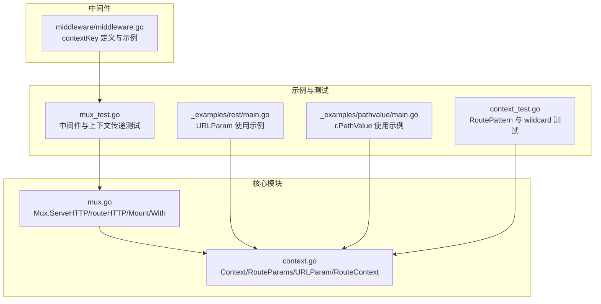
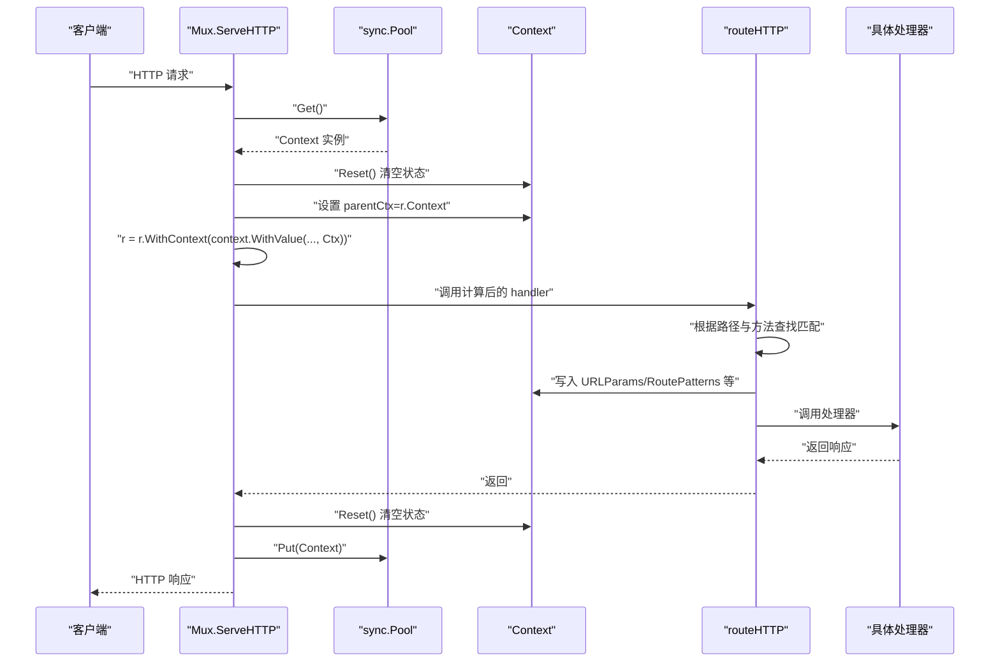
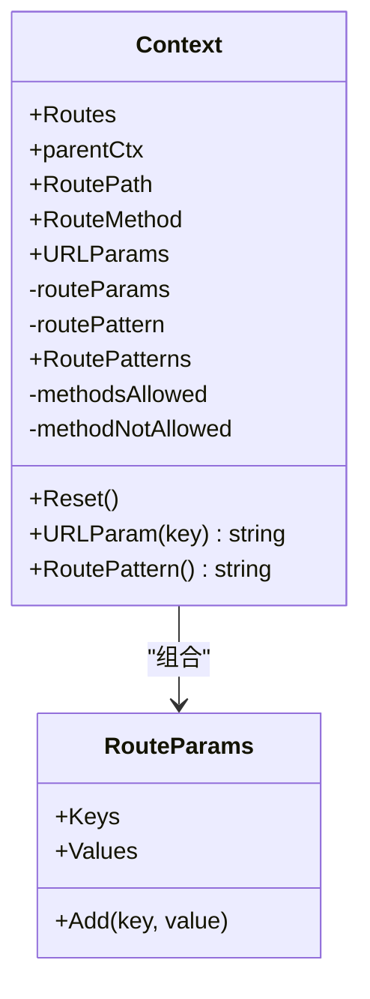
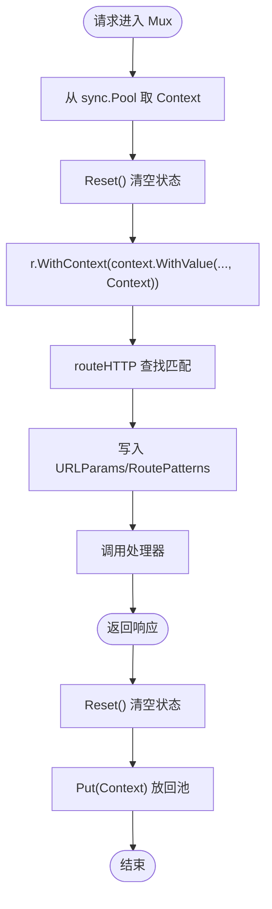
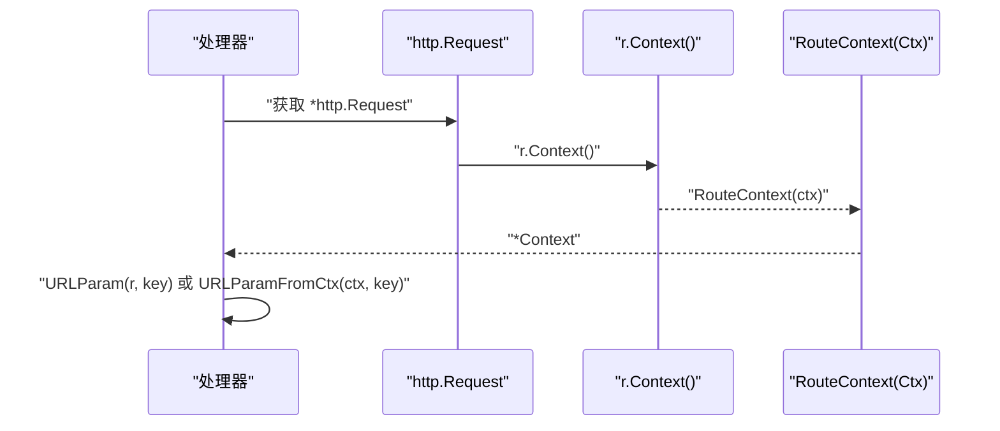
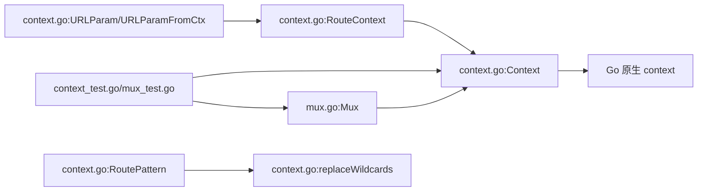

# 请求上下文管理

<cite>
**本文引用的文件**
- [context.go](file://context.go)
- [mux.go](file://mux.go)
- [context_test.go](file://context_test.go)
- [mux_test.go](file://mux_test.go)
- [middleware/middleware.go](file://middleware/middleware.go)
- [_examples/rest/main.go](file://_examples/rest/main.go)
- [_examples/pathvalue/main.go](file://_examples/pathvalue/main.go)
</cite>

## 目录
1. [引言](#引言)
2. [项目结构](#项目结构)
3. [核心组件](#核心组件)
4. [架构总览](#架构总览)
5. [详细组件分析](#详细组件分析)
6. [依赖关系分析](#依赖关系分析)
7. [性能考量](#性能考量)
8. [故障排查指南](#故障排查指南)
9. [结论](#结论)
10. [附录](#附录)

## 引言
本文件聚焦于 chi 框架中“请求上下文（Context）”的设计与管理机制，系统阐述：
- Context 结构体如何通过 sync.Pool 高效复用；
- 在请求生命周期中如何存储 URL 参数、路由模式与自定义数据；
- RouteContext 函数如何从 http.Request 的 context 中提取路由上下文；
- URLParam 等辅助函数如何基于上下文获取路径参数；
- 通过实际代码示例展示上下文在中间件与处理器之间的传递过程；
- 分析其与 Go 原生 context 包的集成方式；
- 提供性能优化建议与常见问题排查方法。

## 项目结构
围绕请求上下文的关键文件与职责如下：
- context.go：定义 Context、URLParam/URLParamFromCtx、RouteContext、RouteParams 等与上下文相关的类型与工具函数；
- mux.go：实现 Mux 的 ServeHTTP、routeHTTP、Mount、With 等方法，负责上下文池化、注入与生命周期管理；
- middleware/middleware.go：演示如何在中间件中使用 context.WithValue 注入自定义键值；
- _examples/rest/main.go 与 _examples/pathvalue/main.go：展示 URLParam、r.PathValue、中间件链路与上下文传递的实际用法；
- mux_test.go、context_test.go：验证上下文行为、线程安全、wildcard 处理与路由模式拼接等。

图表来源
- [context.go](file://context.go#L1-L167)
- [mux.go](file://mux.go#L1-L529)
- [_examples/rest/main.go](file://_examples/rest/main.go#L1-L240)
- [_examples/pathvalue/main.go](file://_examples/pathvalue/main.go#L1-L26)
- [mux_test.go](file://mux_test.go#L1-L2021)
- [context_test.go](file://context_test.go#L1-L105)
- [middleware/middleware.go](file://middleware/middleware.go#L1-L24)

章节来源
- [context.go](file://context.go#L1-L167)
- [mux.go](file://mux.go#L1-L120)

## 核心组件
- Context：承载一次请求的路由状态，包括已匹配的路由模式栈、URL 参数栈、当前子路由器的路由参数、允许的方法集合等；支持 Reset 回收至池。
- RouteParams：以键值对数组形式高效记录 URL 参数，便于快速查找与合并。
- RouteContext/URLParam/URLParamFromCtx：从 http.Request 或其 Context 中提取 chi 的路由上下文，并按键检索最近作用域内的参数值。
- Mux：在每次请求开始时从 sync.Pool 获取 Context，设置 parentCtx 与 RoutePath/RouteMethod，注入到 r.Context 中；请求结束时 Reset 并放回池。

章节来源
- [context.go](file://context.go#L42-L167)
- [mux.go](file://mux.go#L36-L120)

## 架构总览
下图展示了请求从进入 Mux 到最终处理完成的上下文流转过程，包括池化复用、参数注入与清理。

图表来源
- [mux.go](file://mux.go#L60-L120)
- [mux.go](file://mux.go#L439-L487)
- [context.go](file://context.go#L81-L107)

章节来源
- [mux.go](file://mux.go#L60-L120)
- [mux.go](file://mux.go#L439-L487)
- [context.go](file://context.go#L81-L107)

## 详细组件分析

### Context 结构与参数管理
- 字段职责
  - Routes：指向当前路由树或子路由集合；
  - parentCtx：作为 context.Context 的直接父上下文，减少一次分配；
  - RoutePath/RouteMethod：用于覆盖或指定本次路由查找的路径与方法；
  - URLParams：全局 URL 参数栈（按子路由器层级累积），优先返回最近作用域的同名参数；
  - routeParams：当前子路由器匹配到的参数；
  - RoutePatterns：路由模式栈（随子路由器叠加），用于生成最终 Pattern；
  - methodsAllowed/methodNotAllowed：记录 405 场景下的允许方法列表。
- Reset 设计
  - 将所有切片与布尔值重置为初始状态，避免跨请求污染；
  - 保留 parentCtx 以便在 Reset 后仍可作为 context.Context 使用。
- URLParam 查找策略
  - 从 URLParams.Keys/Values 末尾向前遍历，确保最近作用域覆盖更早作用域；
  - 若未找到返回空字符串，便于上层判断。
- RoutePattern 计算
  - 将 RoutePatterns 拼接后，通过 replaceWildcards 规范化连续 “/*”；
  - 对根路径与尾部斜杠进行裁剪，保证输出一致。

图表来源
- [context.go](file://context.go#L42-L167)

章节来源
- [context.go](file://context.go#L42-L167)

### 上下文池化与生命周期
- sync.Pool 初始化
  - Mux 构造时创建 sync.Pool，New 回调返回 NewRouteContext()，即一个空 Context；
  - 每次请求从池中取出 Context，Reset 后复用。
- 生命周期关键点
  - 进入：从池取 Context，Reset，设置 parentCtx=r.Context，注入 RouteCtxKey；
  - 路由：routeHTTP 根据 RoutePath/RouteMethod 与树匹配，填充 URLParams/RoutePatterns；
  - 返回：Reset 并 Put 回池，避免内存增长。
- 与 Go 原生 context 的集成
  - 使用 context.WithValue 将 Context 注入到 http.Request.Context；
  - 使用 r.WithContext 替换请求上下文，保持中间件链共享同一上下文对象；
  - Context 实现 context.Context 接口（通过 parentCtx 优化），可直接在中间件中使用 r.Context()。

图表来源
- [mux.go](file://mux.go#L60-L120)
- [mux.go](file://mux.go#L439-L487)
- [context.go](file://context.go#L81-L107)

章节来源
- [mux.go](file://mux.go#L50-L120)
- [mux.go](file://mux.go#L439-L487)
- [context.go](file://context.go#L81-L107)

### 从 http.Request 提取路由上下文
- RouteContext(ctx)：从任意 context.Context 中提取 chi 的 Context；
- URLParam(r, key)/URLParamFromCtx(ctx, key)：在存在路由上下文时，按键返回最近作用域的参数值，否则返回空字符串。

图表来源
- [context.go](file://context.go#L9-L30)

章节来源
- [context.go](file://context.go#L9-L30)

### URL 参数与路由模式的传递与使用
- URLParam 的工作流
  - 先通过 RouteContext 从 r.Context() 中提取 Context；
  - 再在 Context.URLParams 中按键查找最近作用域的值；
  - 支持在子路由器挂载后继续累加参数。
- 路由模式 RoutePattern
  - 将多级子路由器的 RoutePatterns 拼接后规范化，去除中间 wildcard；
  - 适合在中间件链末端（next.ServeHTTP 后）读取，以获得最终匹配路径。

章节来源
- [context.go](file://context.go#L9-L30)
- [context.go](file://context.go#L109-L144)
- [context_test.go](file://context_test.go#L1-L105)

### 中间件与处理器间的上下文传递
- 中间件链
  - Mux.Use/With 组合中间件，形成 handler 链；
  - 每个中间件均可通过 r.Context() 获取与修改上下文；
  - 可在中间件中使用 context.WithValue 注入自定义键值（如用户信息、请求 ID 等）。
- 示例参考
  - _examples/rest/main.go 展示了在中间件中使用 chi.URLParam 读取路径参数，并将业务对象写入 r.Context；
  - _examples/pathvalue/main.go 展示了使用 r.PathValue 获取参数（与 chi 的 URLParam 功能互补）；
  - mux_test.go 展示了在中间件中通过 r.WithContext 注入自定义 context 值并在后续处理器中读取。

章节来源
- [_examples/rest/main.go](file://_examples/rest/main.go#L120-L170)
- [_examples/pathvalue/main.go](file://_examples/pathvalue/main.go#L1-L26)
- [mux_test.go](file://mux_test.go#L1-L200)
- [middleware/middleware.go](file://middleware/middleware.go#L1-L24)

## 依赖关系分析
- Mux 依赖 Context：在 ServeHTTP/routeHTTP 中直接操作 Context；
- Context 依赖 Go 原生 context：通过 context.WithValue 注入/提取；
- URLParam/URLParamFromCtx 依赖 RouteContext；
- RoutePattern 依赖 replaceWildcards；
- 测试覆盖：context_test 验证 RoutePattern 与 wildcard 规范化；mux_test 验证中间件链与上下文传递。

图表来源
- [mux.go](file://mux.go#L1-L120)
- [context.go](file://context.go#L1-L167)
- [context_test.go](file://context_test.go#L1-L105)
- [mux_test.go](file://mux_test.go#L1-L200)

章节来源
- [mux.go](file://mux.go#L1-L120)
- [context.go](file://context.go#L1-L167)
- [context_test.go](file://context_test.go#L1-L105)
- [mux_test.go](file://mux_test.go#L1-L200)

## 性能考量
- 池化复用
  - 使用 sync.Pool 复用 Context，避免频繁分配与 GC 压力；
  - Reset 将切片容量清零但不释放底层数组，降低扩容成本。
- 最近作用域优先
  - URLParam 从末尾向前查找，减少哈希/映射开销；
  - 子路由器参数栈按顺序累加，避免重复扫描。
- 避免上下文数据泄漏
  - 不要在 Context 中保存非请求级对象（如数据库连接、大对象）；
  - 在中间件中仅注入必要键值，避免键冲突与内存膨胀；
  - 使用 With/Group 构建局部中间件栈，减少全局污染。
- 读取时机
  - RoutePattern 应在 next.ServeHTTP 后读取，避免中间态；
  - URLParam 在处理器中读取，确保参数已由路由阶段填充。

章节来源
- [context.go](file://context.go#L81-L107)
- [context.go](file://context.go#L109-L144)
- [mux.go](file://mux.go#L60-L120)

## 故障排查指南
- 参数读取为空
  - 确认请求是否命中了路由（未命中会走 404/405）；
  - 确认中间件是否提前返回或未调用 next；
  - 确认 URLParam 调用位置是否在参数已写入之后。
- wildcard 参数异常
  - 检查子路由器挂载与 RoutePath 重置逻辑；
  - 确认 RoutePattern 是否在 next.ServeHTTP 后读取。
- 线程安全
  - Context 本身不是并发安全的；不要在多个 goroutine 并发写入同一 Context；
  - 使用 sync.Pool 保证每个请求独立的 Context 实例。
- 键冲突
  - 自定义 context key 建议使用指针类型（参考 middleware/middleware.go），避免字符串键冲突；
  - 避免与第三方库使用相同键名。

章节来源
- [context_test.go](file://context_test.go#L1-L105)
- [mux_test.go](file://mux_test.go#L1685-L1720)
- [middleware/middleware.go](file://middleware/middleware.go#L1-L24)

## 结论
chi 的请求上下文通过 sync.Pool 实现高效复用，结合 Context 的 Reset 与 RouteContext 的提取机制，实现了清晰的请求生命周期管理。URLParam/URLParamFromCtx 与 RoutePattern 提供了便捷的参数访问与模式拼接能力。配合中间件链，开发者可以在请求链路中自由注入与读取上下文数据。遵循本文的性能优化与排错建议，可有效提升系统稳定性与吞吐量。

## 附录
- 实际代码示例路径
  - 使用 URLParam 的处理器：[_examples/rest/main.go](file://_examples/rest/main.go#L120-L170)
  - 使用 r.PathValue 的处理器：[_examples/pathvalue/main.go](file://_examples/pathvalue/main.go#L1-L26)
  - 中间件链与上下文传递测试：[mux_test.go](file://mux_test.go#L1-L200)
  - RoutePattern 与 wildcard 规范化测试：[context_test.go](file://context_test.go#L1-L105)