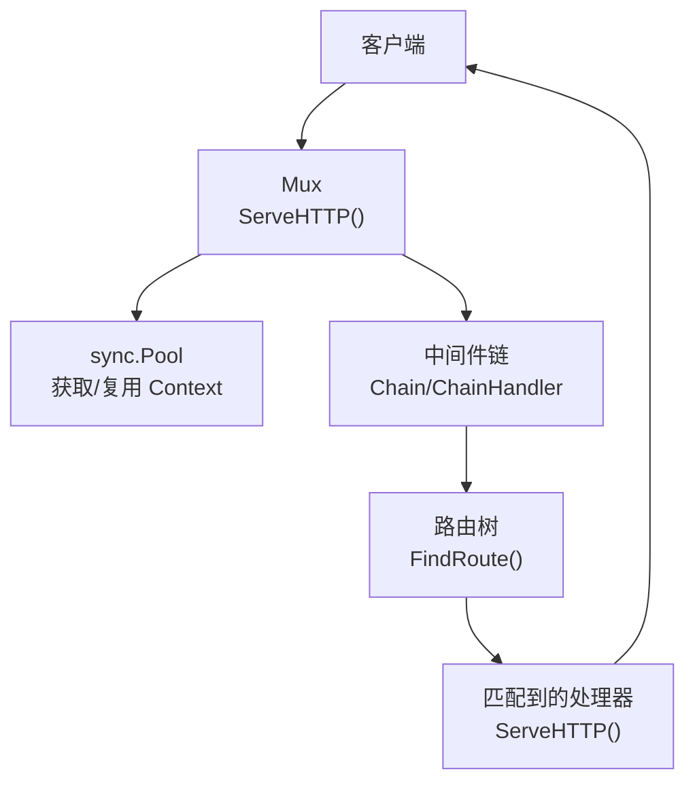
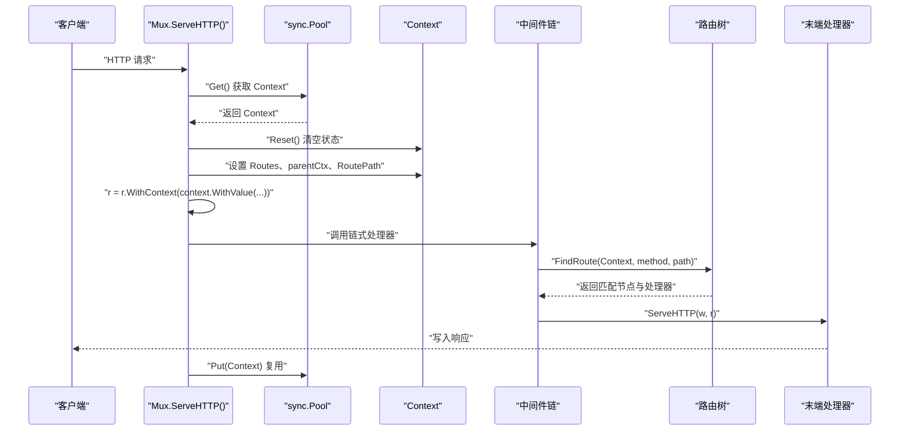
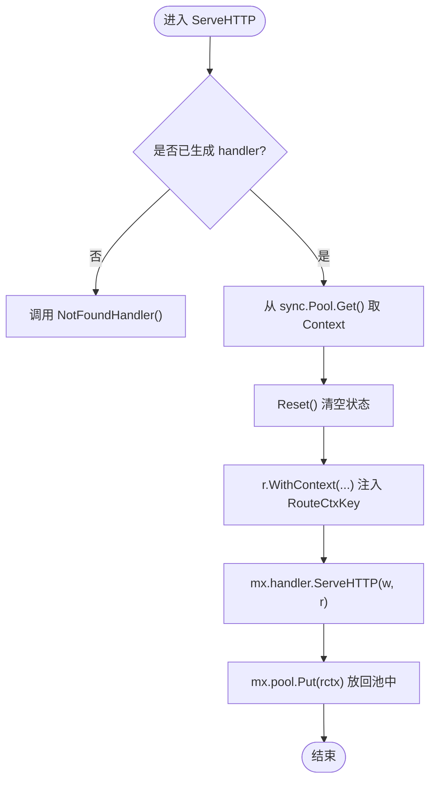
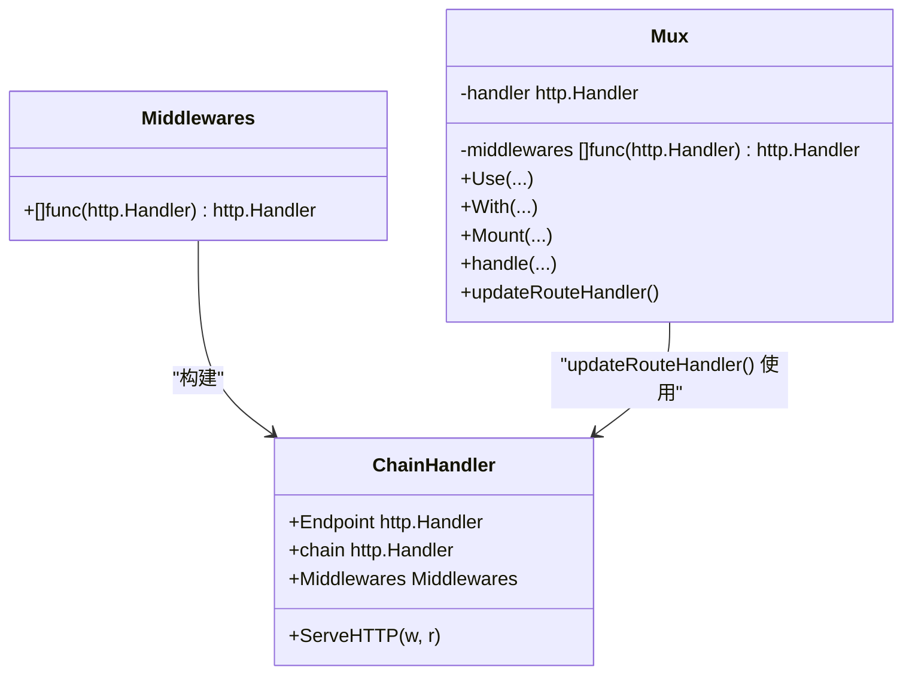
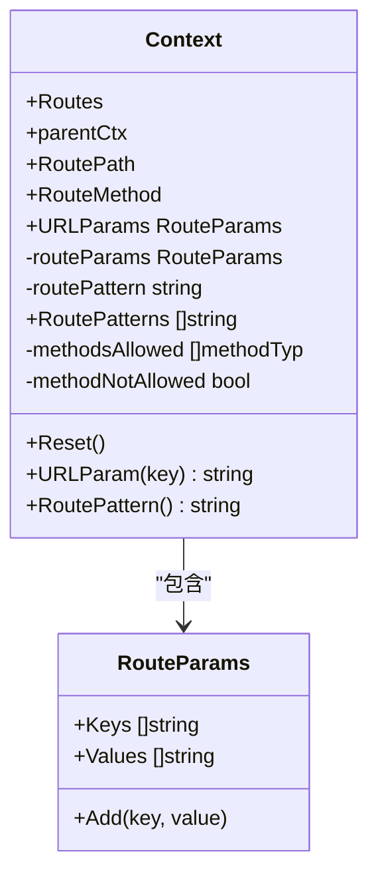
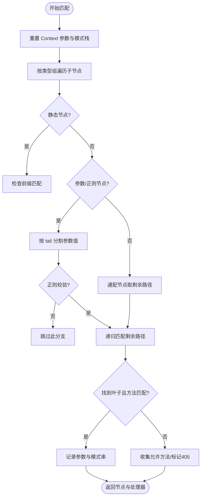
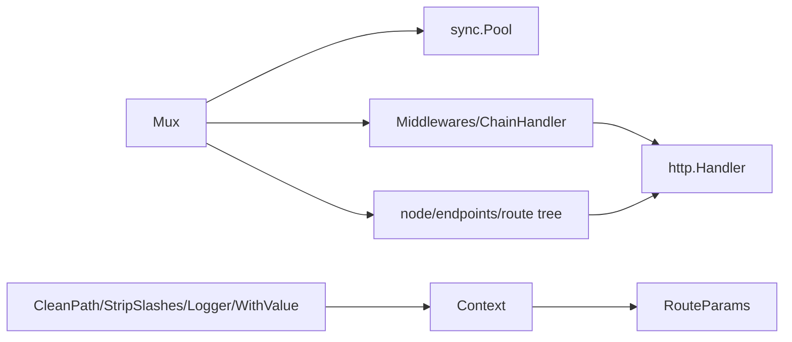

# 请求处理流程

<cite>
**本文引用的文件列表**
- [chi.go](file://chi.go)
- [mux.go](file://mux.go)
- [context.go](file://context.go)
- [chain.go](file://chain.go)
- [tree.go](file://tree.go)
- [pattern.go](file://pattern.go)
- [middleware/clean_path.go](file://middleware/clean_path.go)
- [middleware/strip.go](file://middleware/strip.go)
- [middleware/logger.go](file://middleware/logger.go)
- [middleware/value.go](file://middleware/value.go)
- [mux_test.go](file://mux_test.go)
- [_examples/hello-world/main.go](file://_examples/hello-world/main.go)
</cite>

## 目录
1. [引言](#引言)
2. [项目结构](#项目结构)
3. [核心组件](#核心组件)
4. [架构总览](#架构总览)
5. [详细组件分析](#详细组件分析)
6. [依赖关系分析](#依赖关系分析)
7. [性能考量](#性能考量)
8. [故障排查指南](#故障排查指南)
9. [结论](#结论)
10. [附录](#附录)

## 引言
本文件围绕 chi 框架从“客户端请求到达”到“响应返回”的完整处理流程展开，重点解析以下主题：
- Mux.ServeHTTP 如何通过 sync.Pool 获取与复用路由上下文 Context
- 中间件链与最终路由处理器的组合方式
- 请求上下文 Context 在请求生命周期中的作用：存储路由参数、中间件状态与自定义数据
- 请求路径的规范化处理与路由树匹配过程
- 通过实际代码示例展示中间件链与最终处理器之间的传递机制
- 性能优化建议与常见问题排查方法

## 项目结构
chi 的核心由以下模块组成：
- 路由器与入口：Mux 实现 Router 接口，作为 http.Handler 对外提供服务
- 上下文与参数：Context 记录路由路径、参数、模式等；支持 RouteParams
- 路由树：基于前缀树（radix trie）实现高性能路径匹配
- 中间件链：Middlewares 与 Chain/ChainHandler 组合中间件与末端处理器
- 中间件工具：CleanPath、StripSlashes 等用于路径规范化与重写
- 示例与测试：演示典型用法与验证行为

图表来源
- [mux.go](file://mux.go#L60-L92)
- [chain.go](file://chain.go#L10-L33)
- [tree.go](file://tree.go#L373-L396)

章节来源
- [chi.go](file://chi.go#L64-L138)
- [mux.go](file://mux.go#L1-L120)
- [context.go](file://context.go#L1-L80)
- [tree.go](file://tree.go#L1-L120)
- [chain.go](file://chain.go#L1-L33)

## 核心组件
- Mux：实现 Router 接口，负责注册路由、组装中间件链、调用路由树匹配与最终处理器
- Context：请求生命周期内的上下文容器，记录 RoutePath、URLParams、RoutePatterns、方法允许集合等
- 路由树 node/endpoints：以 radix trie 存储路由模式，按节点类型（静态/参数/正则/通配）分组遍历
- 中间件链 Middlewares/ChainHandler：将多个中间件按顺序包裹末端处理器，形成单一 http.Handler
- 路径规范化中间件：CleanPath、StripSlashes 等在进入路由树前修正请求路径

章节来源
- [mux.go](file://mux.go#L1-L120)
- [context.go](file://context.go#L42-L110)
- [tree.go](file://tree.go#L78-L128)
- [chain.go](file://chain.go#L10-L33)

## 架构总览
下面的时序图展示了从客户端请求进入，到最终响应返回的关键步骤，以及 Context 在其中的流转与复用。

图表来源
- [mux.go](file://mux.go#L60-L92)
- [context.go](file://context.go#L81-L110)
- [chain.go](file://chain.go#L10-L33)
- [tree.go](file://tree.go#L373-L396)

章节来源
- [mux.go](file://mux.go#L60-L92)
- [context.go](file://context.go#L81-L110)
- [chain.go](file://chain.go#L10-L33)
- [tree.go](file://tree.go#L373-L396)

## 详细组件分析

### Mux.ServeHTTP：同步池与上下文复用
- 初始化：Mux 在构造时创建 sync.Pool，并通过 New 设置对象工厂为 NewRouteContext()
- 请求入口：若尚未生成 handler，则直接调用 NotFoundHandler；否则从池中取出 Context 并 Reset
- 上下文注入：将 Context 以 RouteCtxKey 注入到请求上下文中，供后续中间件与路由树使用
- 执行链路：调用 mx.handler.ServeHTTP(w, r)，该 handler 是中间件链与路由树的组合
- 资源回收：请求结束后将 Context Put 回池中，避免频繁分配

图表来源
- [mux.go](file://mux.go#L60-L92)

章节来源
- [mux.go](file://mux.go#L52-L92)

### 中间件链：Middlewares 与 ChainHandler
- Chain 将一组中间件函数包装为 Middlewares
- Handler/HandlerFunc 构建 ChainHandler，内部保存 Endpoint、chain 和 Middlewares
- chain 函数从后向前包裹末端处理器，形成标准的洋葱模型
- Mux 在注册路由或更新 handler 时，会将中间件栈与路由处理器合并为单一 http.Handler

图表来源
- [chain.go](file://chain.go#L10-L33)
- [mux.go](file://mux.go#L510-L516)

章节来源
- [chain.go](file://chain.go#L1-L49)
- [mux.go](file://mux.go#L94-L105)
- [mux.go](file://mux.go#L235-L257)
- [mux.go](file://mux.go#L414-L437)
- [mux.go](file://mux.go#L509-L516)

### Context：请求生命周期中的角色
- 职责：承载路由路径、方法、参数、模式串、允许的方法集合、子路由器参数栈等
- 参数管理：URLParams 与 routeParams 分别记录跨子路由器与当前路由器的参数
- 生命周期：每次请求开始从池中取出并 Reset，结束时 Put 回池中
- Go 1.23+：当 supportsPattern 为真时，将匹配到的路由模式写入 http.Request.Pattern 字段

图表来源
- [context.go](file://context.go#L42-L110)
- [context.go](file://context.go#L146-L150)
- [pattern.go](file://pattern.go#L1-L17)

章节来源
- [context.go](file://context.go#L1-L167)
- [pattern.go](file://pattern.go#L1-L17)

### 路由树：路径匹配与参数提取
- 节点类型：静态、参数、正则、通配；children 按类型分组并排序，param 节点尾字符 '/' 排在末尾以保证优先级
- 匹配算法：多维前缀树递归遍历，按标签与前缀匹配；参数/正则节点按 tail 分隔符与正则约束匹配
- 方法支持：endpoints 映射 methodTyp 到 endpoint；支持 mALL 与 mSTUB 标记
- 结果记录：FindRoute 返回节点、端点集与处理器，并将参数与模式串写入 Context

图表来源
- [tree.go](file://tree.go#L373-L396)
- [tree.go](file://tree.go#L398-L543)
- [tree.go](file://tree.go#L78-L128)

章节来源
- [tree.go](file://tree.go#L78-L128)
- [tree.go](file://tree.go#L373-L396)
- [tree.go](file://tree.go#L398-L543)

### 请求路径规范化与路由树匹配
- 规范化中间件：
  - CleanPath：对 RoutePath 进行 path.Clean，消除多余斜杠
  - StripSlashes：对末尾斜杠进行重定向或修剪
- 路由树匹配：
  - Mux.routeHTTP 从 Context 读取 RoutePath 或 r.URL.Path/RawPath
  - 将方法映射为 methodTyp 后调用 tree.FindRoute
  - 若未找到，根据 Context 的 methodNotAllowed 标志选择 405 或 404

章节来源
- [middleware/clean_path.go](file://middleware/clean_path.go#L10-L28)
- [middleware/strip.go](file://middleware/strip.go#L45-L61)
- [mux.go](file://mux.go#L439-L487)
- [tree.go](file://tree.go#L373-L396)

### 中间件链与最终处理器的传递机制
- Mux.handle 在 inline 场景下直接将中间件链包裹末端处理器；非 inline 时先生成 mx.handler
- Mux.With 创建内联子路由器，复制父中间件栈并追加新中间件，形成局部链
- 测试用例展示了中间件初始化与执行次数、上下文值传递、404 时的链路行为

章节来源
- [mux.go](file://mux.go#L414-L437)
- [mux.go](file://mux.go#L235-L257)
- [mux_test.go](file://mux_test.go#L754-L827)
- [mux_test.go](file://mux_test.go#L328-L360)

### Context 在请求生命周期中的作用
- 存储路由参数：URLParams 与 routeParams 叠加，支持跨子路由器参数访问
- 记录模式串：RoutePatterns 与 routePattern 记录匹配到的模式，Go 1.23+ 写入 r.Pattern
- 方法与状态：记录允许方法集合与 405 标志，辅助错误响应
- 自定义数据：中间件可向 Context 注入键值，供下游处理器读取

章节来源
- [context.go](file://context.go#L1-L167)
- [pattern.go](file://pattern.go#L1-L17)

## 依赖关系分析
- Mux 依赖：
  - sync.Pool 提供 Context 复用
  - Middlewares/ChainHandler 组合中间件
  - node/endpoints/route tree 实现路径匹配
- Context 依赖：
  - context.Context 作为父上下文，减少一次分配
  - RouteParams 作为参数容器
- 中间件依赖：
  - CleanPath/StripSlashes 依赖 chi.RouteContext 与 r.URL.Path/RawPath
  - Logger/WithValue 依赖 context.WithValue 与请求上下文

图表来源
- [mux.go](file://mux.go#L1-L120)
- [chain.go](file://chain.go#L10-L33)
- [tree.go](file://tree.go#L78-L128)
- [context.go](file://context.go#L42-L110)
- [middleware/clean_path.go](file://middleware/clean_path.go#L10-L28)
- [middleware/strip.go](file://middleware/strip.go#L45-L61)
- [middleware/logger.go](file://middleware/logger.go#L32-L59)
- [middleware/value.go](file://middleware/value.go#L1-L17)

章节来源
- [mux.go](file://mux.go#L1-L120)
- [chain.go](file://chain.go#L10-L33)
- [tree.go](file://tree.go#L78-L128)
- [context.go](file://context.go#L42-L110)

## 性能考量
- sync.Pool 复用 Context：避免每次请求新建 Context，降低 GC 压力
- 中间件链顺序：将昂贵中间件（如日志、压缩）放在链靠后位置，或仅在必要时启用
- 路由树匹配：合理设计路由模式，避免过多正则与通配；参数节点尾字符排序确保更优匹配顺序
- 路径规范化：在进入路由树前进行 CleanPath/StripSlashes，减少无效分支
- 404/405 快速返回：利用 Context 的方法集合与标志位，避免无谓的处理器调用

[本节为通用性能建议，不直接分析具体文件]

## 故障排查指南
- 中间件注册时机错误：在已有路由之后再 Use() 会触发 panic，需在路由注册前完成中间件配置
- 405 Method Not Allowed：路由树返回了允许的方法集合，检查 Context.methodsAllowed 与 Allow 头
- 404 Not Found：确认路径规范化中间件是否正确设置 RoutePath；检查挂载子路由的通配符与前缀
- 上下文丢失：确认中间件链中未意外替换 r.Context；使用 chi.RouteContext 读取参数
- 日志与请求 ID：确保 Logger 在 Recoverer 之前，避免错误恢复后无法记录

章节来源
- [mux.go](file://mux.go#L94-L105)
- [mux.go](file://mux.go#L482-L487)
- [middleware/logger.go](file://middleware/logger.go#L32-L59)

## 结论
chi 通过 sync.Pool 复用 Context、以中间件链包裹末端处理器、结合 radix trie 路由树，实现了高性能且可组合的 HTTP 请求处理流程。Context 在请求生命周期中承担参数与状态载体的角色，配合路径规范化中间件与路由树匹配，确保请求从进入至返回的每个环节都清晰可控。遵循中间件注册顺序、合理设计路由模式与路径规范化策略，是获得稳定性能与可维护性的关键。

[本节为总结性内容，不直接分析具体文件]

## 附录
- 示例：基础路由与中间件使用
  - 参考：[_examples/hello-world/main.go](file://_examples/hello-world/main.go#L1-L22)
- 中间件示例：
  - 日志：[middleware/logger.go](file://middleware/logger.go#L32-L59)
  - 路径清理：[middleware/clean_path.go](file://middleware/clean_path.go#L10-L28)
  - 斜杠处理：[middleware/strip.go](file://middleware/strip.go#L45-L61)
  - 上下文值注入：[middleware/value.go](file://middleware/value.go#L1-L17)
- 关键流程测试：
  - 中间件链与上下文传递：[mux_test.go](file://mux_test.go#L754-L827)
  - With/Group/Route 行为：[mux_test.go](file://mux_test.go#L1409-L1446)