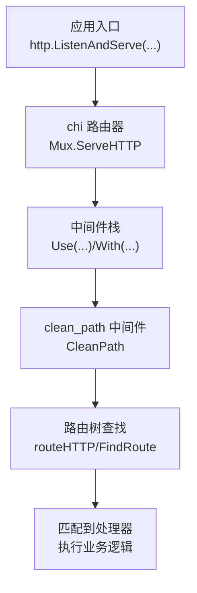
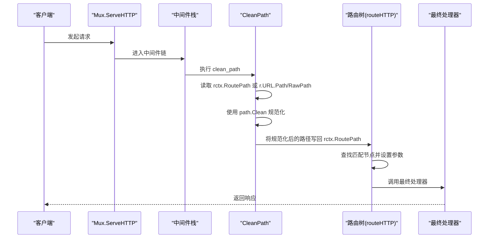
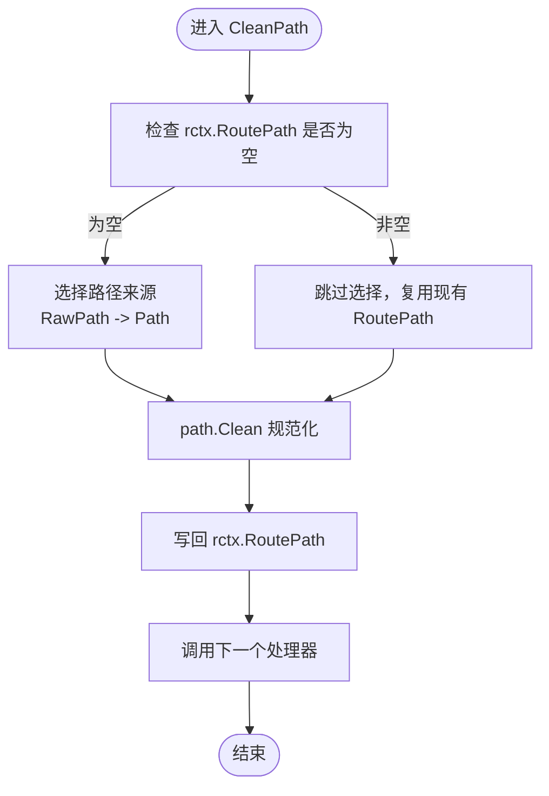
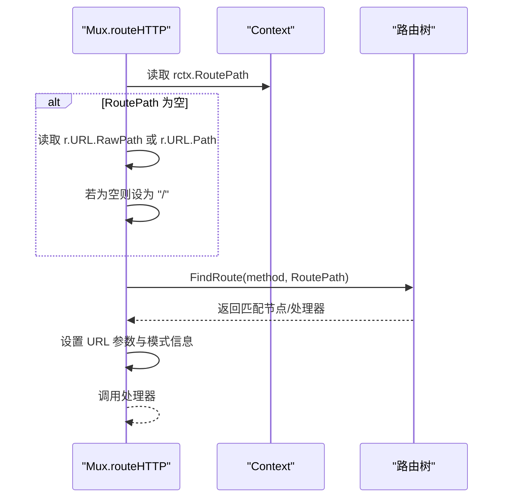
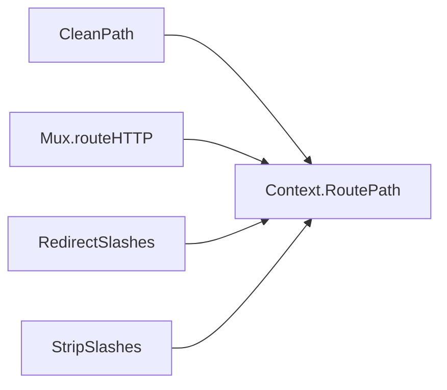

# 请求路径规范化

<cite>
**本文引用的文件列表**
- [middleware/clean_path.go](file://middleware/clean_path.go)
- [middleware/strip.go](file://middleware/strip.go)
- [context.go](file://context.go)
- [mux.go](file://mux.go)
- [README.md](file://README.md)
- [middleware/path_rewrite.go](file://middleware/path_rewrite.go)
</cite>

## 目录
1. [简介](#简介)
2. [项目结构](#项目结构)
3. [核心组件](#核心组件)
4. [架构总览](#架构总览)
5. [详细组件分析](#详细组件分析)
6. [依赖关系分析](#依赖关系分析)
7. [性能考量](#性能考量)
8. [故障排查指南](#故障排查指南)
9. [结论](#结论)
10. [附录](#附录)

## 简介
本篇文档聚焦于 chi 框架对请求路径的规范化处理流程，重点解析 clean_path 中间件如何在 ServeHTTP 调用链中执行，以及它与路由匹配的协同工作机制。我们将从代码层面梳理路径清理逻辑（去除多余斜杠、相对路径片段等）、与 RedirectSlashes 的区别与配合、在代理环境下的注意事项、以及如何通过规范化提升路由匹配的准确性与安全性。

## 项目结构
本次分析涉及以下关键文件：
- middleware/clean_path.go：实现路径规范化的核心中间件
- middleware/strip.go：包含 RedirectSlashes 与 StripSlashes，用于尾斜杠重定向与剥离
- context.go：定义路由上下文与 RoutePath 字段
- mux.go：Mux.ServeHTTP 与 routeHTTP 的路径选择逻辑
- README.md：列出 CleanPath 等中间件
- middleware/path_rewrite.go：路径重写示例，便于理解路径变更的时机

图表来源
- [mux.go](file://mux.go#L60-L120)
- [middleware/clean_path.go](file://middleware/clean_path.go#L10-L28)

章节来源
- [mux.go](file://mux.go#L60-L120)
- [README.md](file://README.md#L330-L370)

## 核心组件
- clean_path 中间件：负责清理请求路径中的多余斜杠与相对路径片段，确保后续路由匹配稳定可靠
- 路由上下文 Context：在中间件与路由树之间传递 RoutePath，供路由匹配阶段使用
- Mux.ServeHTTP 与 routeHTTP：在请求生命周期内选择正确的路径进行匹配
- RedirectSlashes/StripSlashes：与尾斜杠相关的重定向/剥离逻辑，与 clean_path 协同工作

章节来源
- [middleware/clean_path.go](file://middleware/clean_path.go#L10-L28)
- [context.go](file://context.go#L42-L76)
- [mux.go](file://mux.go#L440-L487)
- [middleware/strip.go](file://middleware/strip.go#L11-L62)

## 架构总览
clean_path 在中间件栈中处于较靠前的位置，通常在日志、鉴权等之后、路由匹配之前执行。其职责是将当前请求的“路由路径”标准化后写入路由上下文，供后续路由树查找使用。

图表来源
- [middleware/clean_path.go](file://middleware/clean_path.go#L10-L28)
- [mux.go](file://mux.go#L440-L487)
- [context.go](file://context.go#L42-L76)

## 详细组件分析

### clean_path 中间件的工作原理
- 输入来源优先级：若路由上下文中已存在 RoutePath，则直接使用；否则优先使用 URL.RawPath，最后回退到 URL.Path
- 规范化策略：使用标准库 path.Clean 对路径进行清理，消除多余斜杠、相对路径片段（如 ./ 与 ../）
- 输出：将规范化后的路径写回 rctx.RoutePath，供后续路由匹配使用

图表来源
- [middleware/clean_path.go](file://middleware/clean_path.go#L10-L28)
- [context.go](file://context.go#L42-L76)

章节来源
- [middleware/clean_path.go](file://middleware/clean_path.go#L10-L28)

### 与路由匹配的协同
- Mux.ServeHTTP 会为每个请求创建路由上下文，并在中间件链执行完毕后调用 computed handler
- routeHTTP 在匹配时优先使用 rctx.RoutePath，若为空则回退到 r.URL.RawPath 或 r.URL.Path，并保证至少为 "/"
- 因此 clean_path 的规范化结果直接影响路由树的查找路径，避免因路径变体导致的匹配失败

图表来源
- [mux.go](file://mux.go#L440-L487)
- [context.go](file://context.go#L42-L76)

章节来源
- [mux.go](file://mux.go#L440-L487)
- [context.go](file://context.go#L42-L76)

### 与 RedirectSlashes/StripSlashes 的关系
- RedirectSlashes：当路径以斜杠结尾时，重定向到去尾斜杠的路径，并保留查询参数
- StripSlashes：当路径以斜杠结尾时，直接剥离尾斜杠并继续路由，不发起重定向
- clean_path：专注于“路径规范化”，即消除多余斜杠与相对路径片段，不改变是否以斜杠结尾的行为

注意：RedirectSlashes 与 http.FileServer 存在兼容性问题，需谨慎使用。

章节来源
- [middleware/strip.go](file://middleware/strip.go#L11-L62)

### 典型路径规范化示例
- 输入："/api//v1"（多余斜杠）
  - 规范化后："/api/v1"
- 输入："//api/v1//"（首尾多余斜杠）
  - 规范化后："/api/v1"
- 输入："/api/v1/../users"（相对路径片段）
  - 规范化后："/api/users"
- 输入："/api/v1/./users"（相对路径片段）
  - 规范化后："/api/v1/users"

上述示例展示了 path.Clean 的典型行为，有助于理解 clean_path 的作用范围。

章节来源
- [middleware/clean_path.go](file://middleware/clean_path.go#L10-L28)

### 在代理环境下的注意事项
- 当上游代理（如 Nginx、Ingress）可能将原始路径编码到 URL.RawPath 时，clean_path 会优先使用 RawPath，从而避免二次解码带来的路径失真
- 若代理未正确设置 RawPath，clean_path 将回退到 URL.Path，此时仍可进行规范化
- 需要确保代理层不会引入额外的相对路径片段（如 ../），以免被 path.Clean 正常处理但影响预期路由

章节来源
- [middleware/clean_path.go](file://middleware/clean_path.go#L10-L28)
- [mux.go](file://mux.go#L440-L487)

### 配置与使用建议
- 将 CleanPath 放置在中间件栈中靠近路由匹配之前的合理位置，以确保后续中间件与处理器看到的是规范化的路径
- 如需尾斜杠重定向，可选择 RedirectSlashes；若希望保持尾斜杠但不影响匹配，可选择 StripSlashes 或不启用尾斜杠处理
- 在与 http.FileServer 组合时，避免使用 RedirectSlashes，以防止路径重定向与静态文件服务冲突

章节来源
- [README.md](file://README.md#L330-L370)
- [middleware/strip.go](file://middleware/strip.go#L11-L62)

## 依赖关系分析
- clean_path 依赖路由上下文 Context 提供的 RoutePath 字段
- Mux 在路由匹配阶段读取 RoutePath 并作为查找键
- RedirectSlashes/StripSlashes 与 clean_path 可在同一栈中组合使用，分别处理尾斜杠与路径规范化

图表来源
- [middleware/clean_path.go](file://middleware/clean_path.go#L10-L28)
- [context.go](file://context.go#L42-L76)
- [mux.go](file://mux.go#L440-L487)
- [middleware/strip.go](file://middleware/strip.go#L11-L62)

章节来源
- [context.go](file://context.go#L42-L76)
- [mux.go](file://mux.go#L440-L487)

## 性能考量
- clean_path 仅进行一次路径规范化操作，开销极低
- path.Clean 的复杂度与路径长度线性相关，通常对性能影响可忽略
- 合理放置中间件顺序可减少不必要的重复处理

## 故障排查指南
- 路由始终 404
  - 检查是否在 clean_path 之前有路径重写中间件（如 path_rewrite）错误地修改了路径
  - 确认上游代理是否正确设置 URL.RawPath
- 尾斜杠导致意外重定向
  - 若使用 RedirectSlashes，确认与 http.FileServer 的兼容性
  - 如需保留尾斜杠，考虑使用 StripSlashes 或关闭尾斜杠处理
- 相对路径片段导致路由错配
  - 确保 clean_path 已在中间件栈中执行
  - 检查是否存在自定义中间件在 clean_path 之后再次修改了路径

章节来源
- [middleware/path_rewrite.go](file://middleware/path_rewrite.go#L1-L16)
- [middleware/strip.go](file://middleware/strip.go#L11-L62)

## 结论
clean_path 中间件通过在中间件链早期对请求路径进行规范化，显著提升了路由匹配的准确性与一致性。结合 RedirectSlashes/StripSlashes，可以灵活控制尾斜杠行为；在代理环境中，应关注 RawPath 的正确性以避免路径失真。通过合理的中间件顺序与配置，chi 能够在安全与可用性之间取得良好平衡。

## 附录
- 相关中间件参考
  - CleanPath：路径规范化
  - RedirectSlashes：尾斜杠重定向
  - StripSlashes：尾斜杠剥离
  - StripPrefix：前缀剥离
  - PathRewrite：路径重写

章节来源
- [README.md](file://README.md#L330-L370)
- [middleware/strip.go](file://middleware/strip.go#L11-L62)
- [middleware/path_rewrite.go](file://middleware/path_rewrite.go#L1-L16)