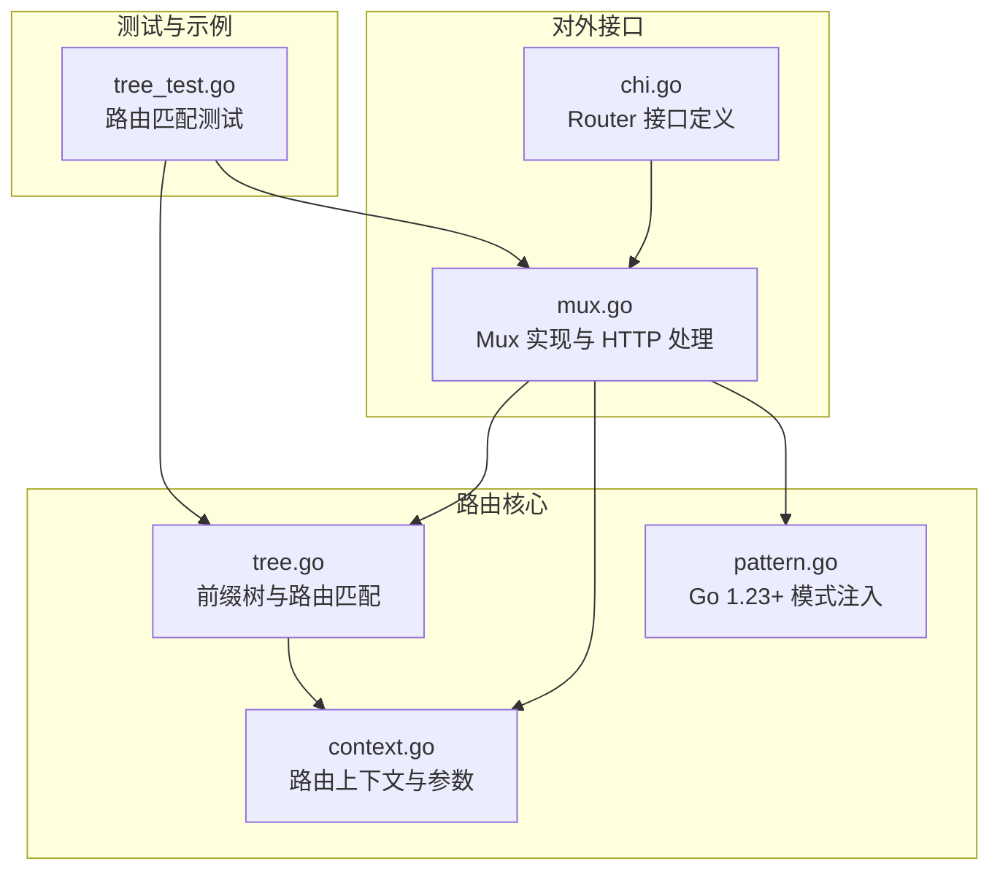
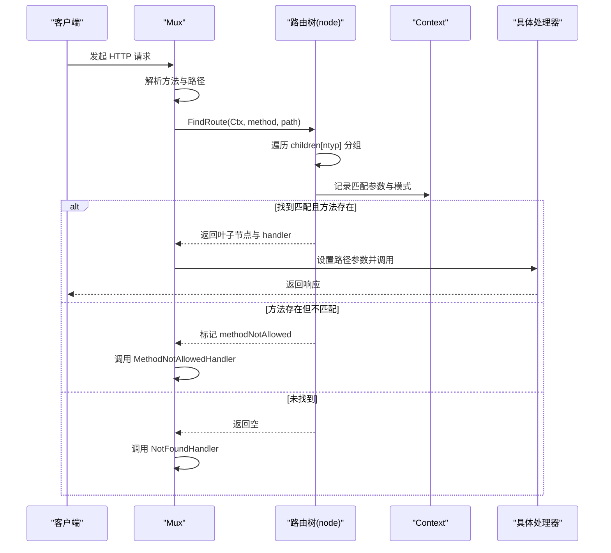
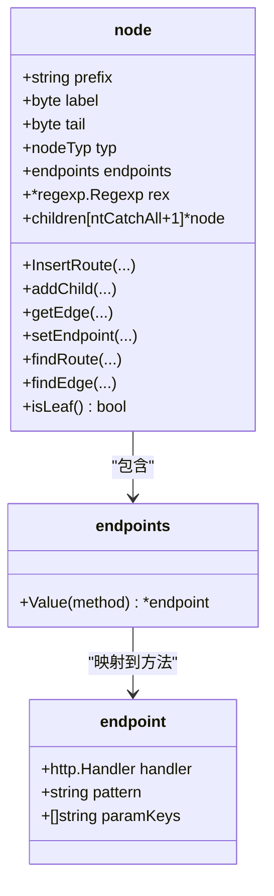
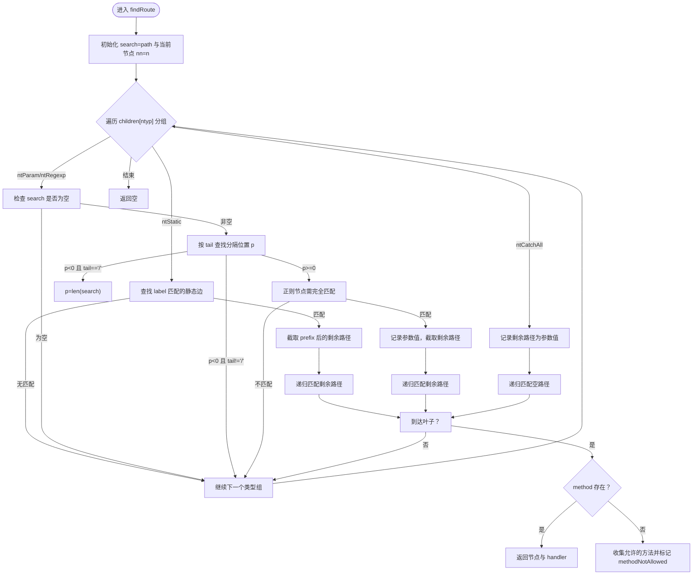
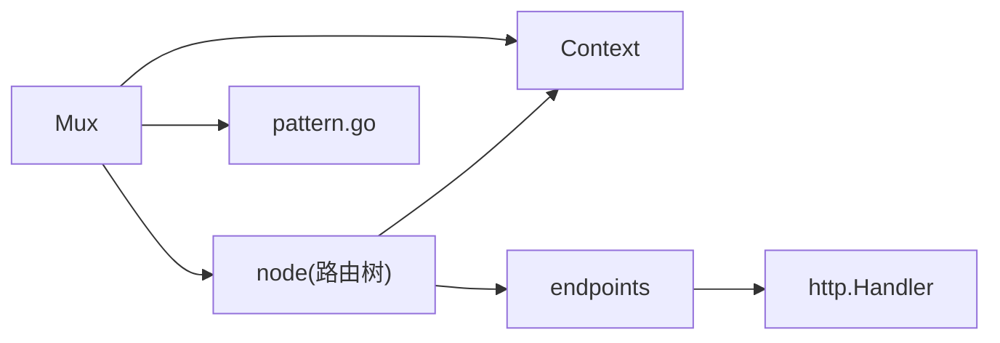

# 路由匹配机制

<cite>
**本文引用的文件**
- [tree.go](file://tree.go)
- [mux.go](file://mux.go)
- [context.go](file://context.go)
- [chi.go](file://chi.go)
- [pattern.go](file://pattern.go)
- [tree_test.go](file://tree_test.go)
</cite>

## 目录
1. [简介](#简介)
2. [项目结构](#项目结构)
3. [核心组件](#核心组件)
4. [架构总览](#架构总览)
5. [详细组件分析](#详细组件分析)
6. [依赖关系分析](#依赖关系分析)
7. [性能考量](#性能考量)
8. [故障排查指南](#故障排查指南)
9. [结论](#结论)
10. [附录](#附录)

## 简介
本文件系统性解析 chi 框架基于前缀树（Trie）的路由匹配机制，重点阐述：
- node 结构体如何组织静态、参数、正则和通配符四类节点；
- FindRoute 方法如何高效遍历路由树完成路径匹配；
- 不同路由模式（如 /{id}、/{name:[a-z]+}、/*）的匹配优先级与实现原理；
- 通过测试用例展示路由树构建过程与冲突处理；
- endpoints 映射如何按 HTTP 方法分发请求；
- methodNotAllowedHandler 在方法不匹配时的处理逻辑；
- 性能优化建议与常见问题（如通配符阻塞其他路径）的解决方案。

## 项目结构
chi 的路由核心位于 tree.go，Mux 作为对外接口与中间件栈组合器，context.go 提供请求上下文与参数收集，pattern.go 在新版本 Go 中支持将匹配模式写入 http.Request，chi.go 定义公共接口与文档注释，tree_test.go 提供大量路由匹配行为的验证用例。

图表来源
- [tree.go](file://tree.go#L1-L120)
- [mux.go](file://mux.go#L1-L120)
- [context.go](file://context.go#L1-L120)
- [pattern.go](file://pattern.go#L1-L17)
- [chi.go](file://chi.go#L60-L138)
- [tree_test.go](file://tree_test.go#L1-L120)

章节来源
- [tree.go](file://tree.go#L1-L120)
- [mux.go](file://mux.go#L1-L120)
- [context.go](file://context.go#L1-L120)
- [chi.go](file://chi.go#L60-L138)
- [pattern.go](file://pattern.go#L1-L17)
- [tree_test.go](file://tree_test.go#L1-L120)

## 核心组件
- 前缀树节点与类型
  - nodeTyp：静态（ntStatic）、参数（ntParam）、正则（ntRegexp）、通配符（ntCatchAll）
  - node：包含子节点数组（按类型分组）、前缀、标签、尾分隔符、正则表达式、端点映射等
- endpoints 映射
  - methodTyp 到 endpoint 的映射，endpoint 包含 handler、pattern、paramKeys
- 上下文 Context
  - 记录当前匹配到的路由参数、已匹配的 pattern、允许的方法集合、是否方法不匹配标记等

章节来源
- [tree.go](file://tree.go#L78-L128)
- [tree.go](file://tree.go#L114-L136)
- [context.go](file://context.go#L42-L120)

## 架构总览
chi 的路由匹配采用“多维前缀树”思想：同一层级按节点类型分组（静态/参数/正则/通配符），不同类型的优先级与匹配策略不同。Mux 将中间件链与路由树组合为单一处理器，在请求到来时通过 tree.FindRoute 完成匹配与参数提取，再交由对应方法的 handler 执行。

图表来源
- [mux.go](file://mux.go#L440-L487)
- [tree.go](file://tree.go#L373-L543)
- [context.go](file://context.go#L42-L120)

## 详细组件分析

### 节点类型与树结构
- 节点类型
  - ntStatic：纯静态路径段，按前缀匹配
  - ntParam：命名参数，以 tail 作为分隔符（默认 '/'），避免跨段匹配
  - ntRegexp：带正则约束的参数，使用预编译的 regexp 进行匹配
  - ntCatchAll：通配符，匹配剩余路径，通常放在路由末尾
- 子节点组织
  - children[ntCatchAll+1]：按类型分组存储子节点
  - nodes.Sort：按 label 排序；对参数节点进行 tailSort，使 '/' 作为尾分隔符的节点排在末尾，从而提升匹配优先级
- 插入与拆分
  - InsertRoute：逐段解析 pattern，按类型创建或复用节点；若静态段有公共前缀则拆分节点
  - addChild：递归将后续段拆分为静态/参数/正则/通配符节点，必要时插入静态后缀

图表来源
- [tree.go](file://tree.go#L78-L136)
- [tree.go](file://tree.go#L138-L228)
- [tree.go](file://tree.go#L230-L316)
- [tree.go](file://tree.go#L318-L371)

章节来源
- [tree.go](file://tree.go#L78-L136)
- [tree.go](file://tree.go#L230-L316)
- [tree.go](file://tree.go#L318-L371)

### 路由树构建流程（示例）
以下示例来自测试用例，展示不同路由模式如何被拆分为节点并插入树中：
- 静态路径：/article、/article/near
- 参数路径：/{id}、/{user}、/{id}/{opts}
- 正则路径：/{id:[0-9]+}、/{name:[a-z]+}
- 通配符路径：/*、/{id}/*

章节来源
- [tree_test.go](file://tree_test.go#L1-L120)
- [tree_test.go](file://tree_test.go#L154-L204)
- [tree_test.go](file://tree_test.go#L270-L334)

### FindRoute 匹配算法
- 控制流
  - 重置 Context 的路由参数与模式栈
  - 从根节点开始，按类型组遍历子节点
  - 静态：检查前缀匹配
  - 参数/正则：计算 tail 分隔位置，避免跨段；正则节点需满足完整匹配
  - 通配符：直接吞掉剩余路径
  - 递归深入下一层；若到达叶子且方法匹配，返回该节点；否则记录允许的方法集合并标记 methodNotAllowed
- 关键细节
  - 对于参数/正则节点，若当前路径为空则跳过该分支
  - 对于正则节点，p==0 时跳过（避免空值匹配）
  - 对于参数节点，若 tail='/' 且 p<0，则取到字符串末尾
  - 回溯：若某分支失败，恢复 Context 的参数状态

图表来源
- [tree.go](file://tree.go#L373-L543)

章节来源
- [tree.go](file://tree.go#L373-L543)

### 方法分发与 endpoints 映射
- endpoints 是 methodTyp 到 endpoint 的映射
- setEndpoint：当注册路由时，为指定方法或全部方法设置 handler、pattern、paramKeys
- FindRoute 返回的 endpoints[method].handler 即为最终执行的处理器
- Mux.routeHTTP：在匹配成功后，将 Context 中的参数写入 http.Request 的 PathValue，并调用 handler

章节来源
- [tree.go](file://tree.go#L114-L136)
- [tree.go](file://tree.go#L343-L371)
- [mux.go](file://mux.go#L440-L487)

### 通配符与优先级
- 通配符（ntCatchAll）总是放在 children 数组的最后一位，确保静态/参数/正则优先匹配
- 通配符仅能出现在路由末尾；pattern.go 中对通配符位置有严格限制
- 测试用例覆盖了通配符与静态/参数/正则的优先级与冲突处理

章节来源
- [tree.go](file://tree.go#L78-L128)
- [tree.go](file://tree.go#L318-L371)
- [tree.go](file://tree.go#L684-L752)
- [tree_test.go](file://tree_test.go#L1-L120)
- [tree_test.go](file://tree_test.go#L154-L204)

### 正则匹配与边界控制
- 正则节点在插入时预编译，匹配时要求完整匹配（^$ 已自动添加）
- 正则参数不允许空值（p==0 时跳过）
- 正则匹配避免跨路径段（通过 tail 分隔）

章节来源
- [tree.go](file://tree.go#L254-L261)
- [tree.go](file://tree.go#L447-L454)
- [tree_test.go](file://tree_test.go#L270-L334)
- [tree_test.go](file://tree_test.go#L336-L385)
- [tree_test.go](file://tree_test.go#L387-L415)

### 冲突路由与覆盖规则
- 最新注册的 handler 会覆盖之前的同路径同方法处理器（latest wins）
- 参数键重复会在解析阶段触发错误
- 通配符与静态/参数/正则的冲突通过类型顺序与 tail 分隔解决

章节来源
- [tree_test.go](file://tree_test.go#L1-L120)
- [tree_test.go](file://tree_test.go#L154-L204)
- [tree.go](file://tree.go#L754-L770)

### methodNotAllowedHandler 的处理逻辑
- 当叶子节点存在其他方法但不包含目标方法时，FindRoute 会收集所有允许的方法并标记 methodNotAllowed
- Mux.routeHTTP 在未命中时检查 rctx.methodNotAllowed 并调用 MethodNotAllowedHandler
- 默认实现会设置 Allow 头并返回 405

章节来源
- [tree.go](file://tree.go#L506-L524)
- [mux.go](file://mux.go#L482-L487)
- [mux.go](file://mux.go#L517-L529)

### 路由模式写入 http.Request（Go 1.23+）
- pattern.go 在新版本 Go 中启用 supportsPattern，并在匹配成功后将 routePattern 写入 r.Pattern

章节来源
- [pattern.go](file://pattern.go#L1-L17)
- [mux.go](file://mux.go#L475-L478)

## 依赖关系分析
- Mux 依赖 node 树进行路由匹配，并通过中间件链组合处理器
- Context 在匹配过程中贯穿始终，用于参数与模式的累积
- endpoints 与 methodTyp 共同决定方法分发
- pattern.go 与 Go 版本特性耦合，影响请求对象的模式注入

图表来源
- [mux.go](file://mux.go#L1-L120)
- [tree.go](file://tree.go#L1-L120)
- [context.go](file://context.go#L1-L120)
- [pattern.go](file://pattern.go#L1-L17)

章节来源
- [mux.go](file://mux.go#L1-L120)
- [tree.go](file://tree.go#L1-L120)
- [context.go](file://context.go#L1-L120)
- [pattern.go](file://pattern.go#L1-L17)

## 性能考量
- 节点排序与二分查找
  - 静态/参数/正则节点按 label 排序，查找采用二分；通配符节点固定取首个
- 类型分组遍历
  - 先尝试静态，再参数/正则，最后通配符，减少无效匹配
- 回溯控制
  - 对参数/正则分支在失败时及时回滚参数状态，避免污染后续分支
- 正则预编译
  - 插入时一次性编译，运行时只需匹配，降低开销
- 建议
  - 将更精确的静态路由置于前缀位置，减少参数/正则节点数量
  - 合理使用通配符，避免将其置于可能被静态/参数覆盖的位置
  - 使用正则时尽量限定范围，减少回溯

[本节为通用性能讨论，无需列出具体文件来源]

## 故障排查指南
- 通配符阻塞其他路径
  - 症状：注册了 /* 后，后续静态/参数路由无法命中
  - 原因：通配符类型在 children 数组末尾，优先级最低；但若其在树中处于更靠前的路径段，仍可能覆盖
  - 解决：调整路由注册顺序，将更具体的静态/参数路由放在通配符之前；或重构路径结构
- 正则匹配失败
  - 症状：/{id:[0-9]+} 无法匹配
  - 原因：正则未完全匹配（包含扩展名或额外字符）；或 tail 分隔导致跨段
  - 解决：确保正则覆盖完整段；必要时使用静态后缀或调整 tail
- 方法不匹配
  - 症状：返回 405
  - 原因：叶子节点存在其他方法但不包含当前方法
  - 解决：为该路径注册缺失的方法处理器；或检查路由注册顺序
- 参数键重复
  - 症状：解析阶段 panic
  - 原因：同一路由中出现重复参数键
  - 解决：修改参数键名称

章节来源
- [tree.go](file://tree.go#L447-L454)
- [tree.go](file://tree.go#L506-L524)
- [tree.go](file://tree.go#L754-L770)
- [tree_test.go](file://tree_test.go#L1-L120)
- [tree_test.go](file://tree_test.go#L270-L334)

## 结论
chi 的路由匹配通过“多维前缀树”实现了高性能、可扩展的路径匹配。静态、参数、正则与通配符四类节点在插入与匹配时各有策略，配合 Context 的参数与模式记录、endpoints 的方法分发，以及 methodNotAllowedHandler 的错误处理，形成了完整的路由生命周期。遵循本文的优化建议与问题排查清单，可在复杂 REST API 场景中获得稳定且高效的路由表现。

[本节为总结性内容，无需列出具体文件来源]

## 附录
- 示例与测试参考
  - 静态/参数/正则/通配符混合匹配：见 tree_test.go 的多个测试用例
  - 冲突与覆盖：见 tree_test.go 中的覆盖与通配符优先级测试
  - 方法不匹配：见 mux.go 的 MethodNotAllowedHandler 与 tree.go 的方法收集逻辑

章节来源
- [tree_test.go](file://tree_test.go#L1-L120)
- [tree_test.go](file://tree_test.go#L154-L204)
- [tree_test.go](file://tree_test.go#L270-L334)
- [tree_test.go](file://tree_test.go#L336-L385)
- [tree_test.go](file://tree_test.go#L387-L415)
- [mux.go](file://mux.go#L517-L529)
- [tree.go](file://tree.go#L506-L524)