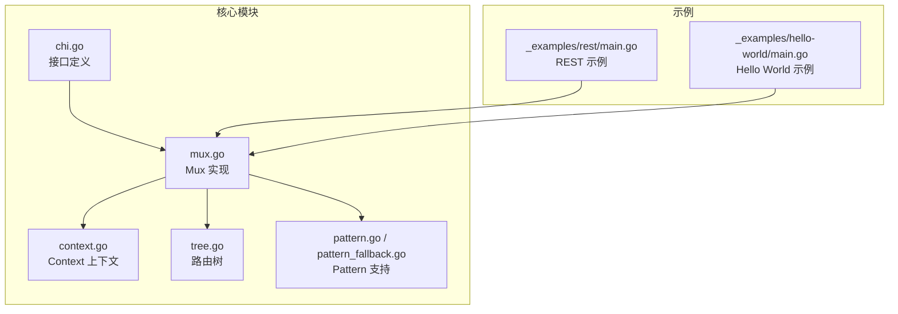
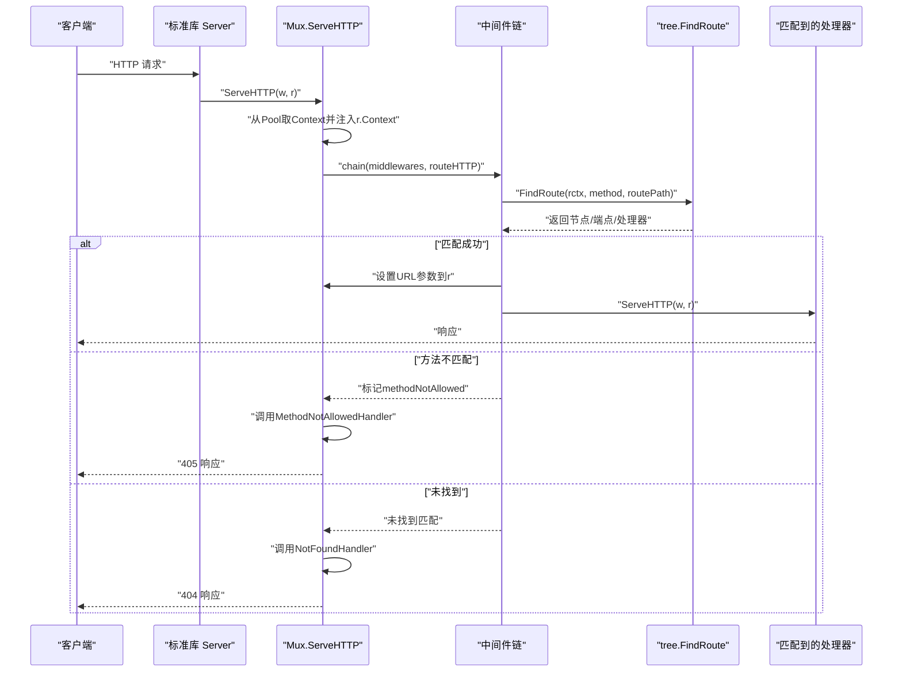
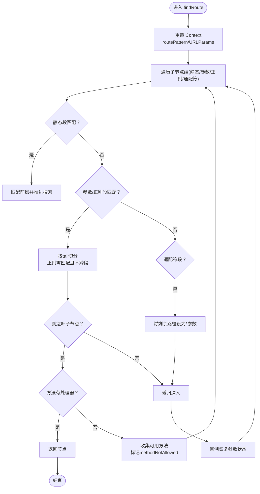
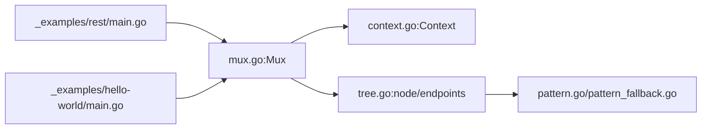

# 路由匹配机制

<cite>
**本文引用的文件**
- [chi.go](file://chi.go)
- [mux.go](file://mux.go)
- [context.go](file://context.go)
- [tree.go](file://tree.go)
- [pattern.go](file://pattern.go)
- [pattern_fallback.go](file://pattern_fallback.go)
- [tree_test.go](file://tree_test.go)
- [_examples/rest/main.go](file://_examples/rest/main.go)
- [_examples/hello-world/main.go](file://_examples/hello-world/main.go)
</cite>

## 目录
1. [引言](#引言)
2. [项目结构](#项目结构)
3. [核心组件](#核心组件)
4. [架构总览](#架构总览)
5. [详细组件分析](#详细组件分析)
6. [依赖关系分析](#依赖关系分析)
7. [性能考量](#性能考量)
8. [故障排查指南](#故障排查指南)
9. [结论](#结论)
10. [附录](#附录)

## 引言
本文件系统性解析 chi 框架的路由匹配机制，从 Mux.ServeHTTP 开始，到树形路由节点的递归查找（tree.findRoute），深入解释路由上下文（Context）在匹配过程中的作用、URL 参数的提取与存储、不同 HTTP 方法的匹配策略，以及 405（方法不允许）与 404（未找到）的判定逻辑。文档同时提供基于仓库内真实代码的调用序列图、流程图与类图，帮助读者建立从高层到代码级的完整认知。

## 项目结构
- chi.go 定义 Router 接口与常用方法（如 Get、Post 等），为上层应用提供路由注册入口。
- mux.go 实现 Mux 结构体，承载中间件栈、路由树、上下文池、以及 ServeHTTP 的主控制流。
- context.go 定义路由上下文 Context，用于在请求生命周期中记录路径、方法、参数、已匹配模式等信息。
- tree.go 实现基于前缀树（radix trie）的路由树，负责路由模式的插入与查找、参数提取、方法分支选择。
- pattern.go/pattern_fallback.go 提供 Go 1.23+ 对 http.Request.Pattern 字段的支持或空实现。
- tree_test.go 展示了大量路由匹配行为的单元测试，覆盖静态、参数、正则、通配符、子路由等场景。
- 示例程序 _examples/rest/main.go 与 _examples/hello-world/main.go 展示了典型路由注册与参数读取方式。

图表来源
- [chi.go](file://chi.go#L60-L138)
- [mux.go](file://mux.go#L1-L120)
- [context.go](file://context.go#L1-L80)
- [tree.go](file://tree.go#L1-L120)
- [pattern.go](file://pattern.go#L1-L17)
- [pattern_fallback.go](file://pattern_fallback.go#L1-L18)
- [_examples/rest/main.go](file://_examples/rest/main.go#L56-L112)
- [_examples/hello-world/main.go](file://_examples/hello-world/main.go#L10-L21)

章节来源
- [chi.go](file://chi.go#L60-L138)
- [mux.go](file://mux.go#L1-L120)
- [context.go](file://context.go#L1-L80)
- [tree.go](file://tree.go#L1-L120)
- [pattern.go](file://pattern.go#L1-L17)
- [pattern_fallback.go](file://pattern_fallback.go#L1-L18)
- [_examples/rest/main.go](file://_examples/rest/main.go#L56-L112)
- [_examples/hello-world/main.go](file://_examples/hello-world/main.go#L10-L21)

## 核心组件
- Router 接口：定义路由注册、中间件挂载、子路由挂载、NotFound/MethodNotAllowed 设置等能力。
- Mux：实现 Router 接口，维护中间件栈、路由树、上下文池；负责 ServeHTTP 的入口控制流与最终分发。
- Context：请求生命周期内的路由上下文，记录 RoutePath、RouteMethod、URLParams、routeParams、RoutePatterns、以及 405/404 相关状态。
- node/endpoints：路由树节点，按静态、参数、正则、通配符四类节点组织，叶子节点保存各 HTTP 方法对应的处理器与模式信息。
- Pattern 支持：Go 1.23+ 下将匹配到的路由模式写入 http.Request.Pattern 字段，便于可观测性与调试。

章节来源
- [chi.go](file://chi.go#L60-L138)
- [mux.go](file://mux.go#L1-L120)
- [context.go](file://context.go#L1-L120)
- [tree.go](file://tree.go#L78-L140)
- [pattern.go](file://pattern.go#L1-L17)

## 架构总览
chi 的路由匹配采用“中间件链 + 路由树”的组合架构：
- 中间件链在 Mux 初始化时构建，ServeHTTP 前置执行。
- 路由树以 radix trie 形式存储路由模式，支持静态、参数、正则、通配符四种段类型。
- 请求进入时，Mux 从 sync.Pool 获取 Context，注入到请求上下文中，随后调用中间件链与路由树查找。
- 匹配成功后，将 URL 参数回填到 http.Request 的 PathValue，并根据 Go 版本设置 Pattern 字段。

图表来源
- [mux.go](file://mux.go#L60-L120)
- [mux.go](file://mux.go#L440-L487)
- [tree.go](file://tree.go#L373-L400)

## 详细组件分析

### 1) Mux.ServeHTTP 与中间件链
- ServeHTTP 在无路由时直接调用 NotFoundHandler；否则从 sync.Pool 取出 Context 并注入到 r.Context。
- 将中间件栈与 routeHTTP 组合成单一 handler，确保所有中间件在路由查找之前执行。
- 若父路由已存在 Context，则直接透传，避免重复匹配。

章节来源
- [mux.go](file://mux.go#L60-L120)
- [mux.go](file://mux.go#L509-L516)

### 2) 路由树节点与模式解析
- node/endpoints：节点包含子节点数组（按静态/参数/正则/通配符分组）、叶子端点映射（方法->处理器）。
- patNextSegment：解析下一个模式段，识别静态、参数、正则、通配符，计算 tail 分隔符与起止索引。
- patParamKeys：从模式中提取参数键列表，用于后续参数回填。
- node.addChild/InsertRoute：将模式拆分为多段，逐段插入树中，必要时分裂节点。

章节来源
- [tree.go](file://tree.go#L78-L140)
- [tree.go](file://tree.go#L684-L752)
- [tree.go](file://tree.go#L754-L770)
- [tree.go](file://tree.go#L230-L316)
- [tree.go](file://tree.go#L138-L176)

### 3) 递归查找：tree.findRoute
- 重置 Context 的 routePattern 与 routeParams，准备本次匹配。
- 遍历当前节点的子节点集合（按节点类型分组），尝试匹配：
  - 静态段：检查前缀是否一致。
  - 参数/正则段：在剩余路径中按 tail 分隔符切分，正则段需满足正则匹配且不能跨段。
  - 通配符段：将剩余路径作为参数值。
- 若到达叶子节点且对应方法有处理器，则返回该节点；否则收集可用方法用于 405 判定。
- 递归深入匹配，若某分支失败则回溯并恢复参数状态。

图表来源
- [tree.go](file://tree.go#L373-L400)
- [tree.go](file://tree.go#L398-L543)

章节来源
- [tree.go](file://tree.go#L373-L400)
- [tree.go](file://tree.go#L398-L543)

### 4) 路由上下文（Context）的作用
- 记录 RoutePath/RouteMethod：可覆盖默认值，支持子路由切换路径。
- 记录 routeParams：当前子路由匹配到的参数键值对，仅在当前层级有效。
- 记录 URLParams：累积跨子路由的参数键值对，供最终处理器读取。
- 记录 RoutePatterns：累积匹配到的模式片段，便于生成最终模式字符串。
- 记录 methodsAllowed/methodNotAllowed：当路径存在但方法不匹配时，收集可用方法并返回 405。

章节来源
- [context.go](file://context.go#L42-L120)
- [context.go](file://context.go#L121-L167)

### 5) URL 参数提取与存储
- 在递归匹配过程中，参数值被追加到 rctx.routeParams；当匹配成功后，复制到 rctx.URLParams。
- 最终在 routeHTTP 中，将 URL 参数回填到 http.Request 的 PathValue，以便 chi.URLParam 读取。
- Go 1.23+ 条件编译下，还会将匹配到的路由模式写入 http.Request.Pattern 字段。

章节来源
- [tree.go](file://tree.go#L447-L478)
- [context.go](file://context.go#L98-L120)
- [mux.go](file://mux.go#L469-L478)
- [pattern.go](file://pattern.go#L1-L17)
- [pattern_fallback.go](file://pattern_fallback.go#L1-L18)

### 6) 不同 HTTP 方法的匹配处理
- 方法映射：methodMap/reverseMethodMap 将字符串方法映射为内部常量，支持自定义方法注册。
- Mux.handle：将方法与模式注册到路由树，支持 mALL（全部方法）与 mSTUB（仅挂载）。
- tree.FindRoute：按方法查找端点；若叶子节点存在其他方法，会收集到 methodsAllowed，用于 405 响应。

章节来源
- [tree.go](file://tree.go#L16-L77)
- [mux.go](file://mux.go#L414-L437)
- [tree.go](file://tree.go#L373-L400)

### 7) 405（方法不允许）与 404（未找到）判定逻辑
- 405：当路径匹配但方法不匹配时，tree.findRoute 会收集可用方法并标记 methodNotAllowed；routeHTTP 检测到此标志后调用 MethodNotAllowedHandler，并在响应头中设置 Allow。
- 404：当路径完全未匹配到任何节点时，routeHTTP 调用 NotFoundHandler 返回默认 404 或自定义处理器。

章节来源
- [mux.go](file://mux.go#L469-L487)
- [mux.go](file://mux.go#L396-L413)
- [tree.go](file://tree.go#L468-L524)

### 8) 子路由与 Mount 流程
- Mount：将子路由器挂载到指定模式，自动添加通配符段以继续路由；若子路由器未设置 404/405 处理器，则继承父路由器配置。
- 子路由切换：mountHandler 在每次进入子路由时更新 RoutePath，并清理通配符参数，保证参数链路正确。

章节来源
- [mux.go](file://mux.go#L282-L340)
- [mux.go](file://mux.go#L309-L323)

### 9) 路由匹配生命周期示例（基于仓库示例）
- Hello World：注册 GET / 路由，匹配成功后返回响应。
- REST 示例：注册多条 REST 资源路由，包括参数化路径与正则约束，演示 URLParam 读取与中间件链使用。

章节来源
- [_examples/hello-world/main.go](file://_examples/hello-world/main.go#L10-L21)
- [_examples/rest/main.go](file://_examples/rest/main.go#L78-L93)
- [_examples/rest/main.go](file://_examples/rest/main.go#L121-L145)

## 依赖关系分析
- Mux 依赖 Context 进行请求上下文管理，依赖 tree 进行路由查找。
- tree 依赖 pattern 解析工具进行段类型识别与参数键提取。
- pattern.go/pattern_fallback.go 通过条件编译适配不同 Go 版本的 http.Request.Pattern 字段。
- 示例程序依赖 Mux/Router 接口进行路由注册与参数读取。

图表来源
- [mux.go](file://mux.go#L1-L120)
- [context.go](file://context.go#L1-L80)
- [tree.go](file://tree.go#L1-L120)
- [pattern.go](file://pattern.go#L1-L17)
- [pattern_fallback.go](file://pattern_fallback.go#L1-L18)
- [_examples/rest/main.go](file://_examples/rest/main.go#L56-L112)
- [_examples/hello-world/main.go](file://_examples/hello-world/main.go#L10-L21)

章节来源
- [mux.go](file://mux.go#L1-L120)
- [context.go](file://context.go#L1-L80)
- [tree.go](file://tree.go#L1-L120)
- [pattern.go](file://pattern.go#L1-L17)
- [pattern_fallback.go](file://pattern_fallback.go#L1-L18)
- [_examples/rest/main.go](file://_examples/rest/main.go#L56-L112)
- [_examples/hello-world/main.go](file://_examples/hello-world/main.go#L10-L21)

## 性能考量
- sync.Pool：Mux 使用 sync.Pool 复用 Context，减少 GC 压力，提升高并发下的吞吐。
- radix trie：按段类型分组存储与查找，静态段优先匹配，参数/正则段有序遍历，整体查找复杂度接近 O(L)，L 为路径长度。
- 正则匹配：仅在参数/正则段启用，且限制在段内匹配，避免跨段导致的回溯开销。
- 405 收集：在未命中方法时收集可用方法，避免重复扫描整棵树。
- 单次构建：中间件链在首次注册路由时一次性构建，后续 ServeHTTP 直接复用，降低运行时开销。

章节来源
- [mux.go](file://mux.go#L52-L58)
- [tree.go](file://tree.go#L780-L800)
- [tree.go](file://tree.go#L447-L478)

## 故障排查指南
- 404 未找到
  - 检查路由是否已注册（Mux.handle 是否被调用）。
  - 检查路径大小写与尾斜杠差异，确认是否需要额外注册相同路径的不同变体。
  - 使用 Mux.Routes() 输出路由树，核对模式是否正确。
- 405 方法不允许
  - 确认请求方法是否在路由树中注册；可通过 Mux.Routes() 查看每条模式对应的方法集合。
  - 检查是否存在 mALL 注册导致覆盖问题。
- URL 参数为空
  - 确认模式中是否包含参数段，且参数键唯一。
  - 检查是否在子路由切换后正确读取 rctx.URLParams 或通过 chi.URLParam 读取。
- 子路由参数丢失
  - 确认 Mount 后是否正确更新 RoutePath，并清理通配符参数。
- 调试技巧
  - 使用 Mux.Routes() 与 Mux.Middlewares() 输出路由与中间件链。
  - 在中间件中打印 rctx.RoutePatterns 与 rctx.URLParams，定位参数累积情况。
  - 使用单元测试覆盖复杂路径与正则场景，参考 tree_test.go 的断言方式。

章节来源
- [mux.go](file://mux.go#L342-L351)
- [context.go](file://context.go#L98-L120)
- [tree_test.go](file://tree_test.go#L1-L120)

## 结论
chi 的路由匹配以“中间件链 + radix trie”为核心，通过 Context 在请求生命周期内串联参数与模式信息，实现了高性能、可扩展、易调试的路由系统。其对 405/404 的明确区分、对参数与模式的精细控制，以及对子路由与通配符的完善支持，使其适用于从简单服务到复杂 REST API 的广泛场景。

## 附录
- 关键 API 路径参考
  - Mux.ServeHTTP：[mux.go](file://mux.go#L60-L120)
  - Mux.routeHTTP：[mux.go](file://mux.go#L440-L487)
  - tree.FindRoute：[tree.go](file://tree.go#L373-L400)
  - tree.findRoute：[tree.go](file://tree.go#L398-L543)
  - Context.Reset/URLParam/RoutePattern：[context.go](file://context.go#L81-L134)
  - Pattern 支持（Go 1.23+）：[pattern.go](file://pattern.go#L1-L17)
  - Pattern 支持（fallback）：[pattern_fallback.go](file://pattern_fallback.go#L1-L18)
  - 示例：Hello World 与 REST 示例
    - [hello-world/main.go](file://_examples/hello-world/main.go#L10-L21)
    - [rest/main.go](file://_examples/rest/main.go#L78-L93)