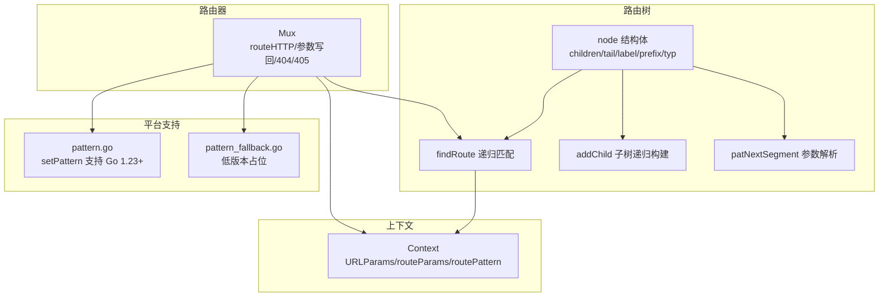
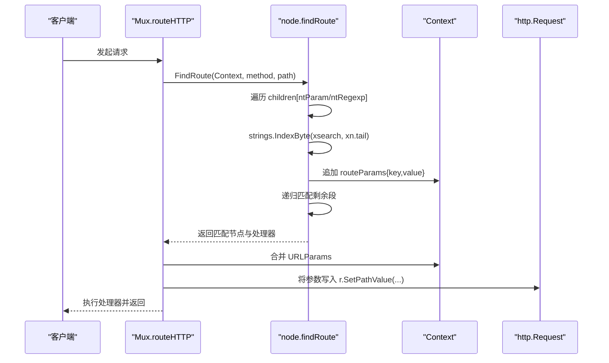
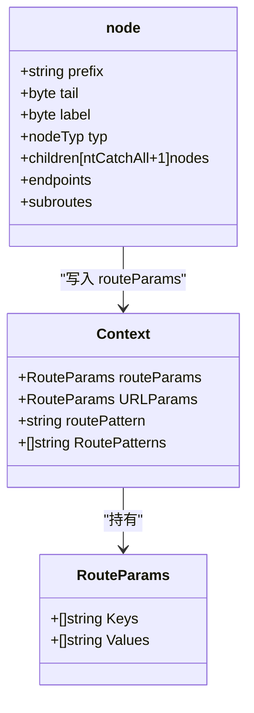
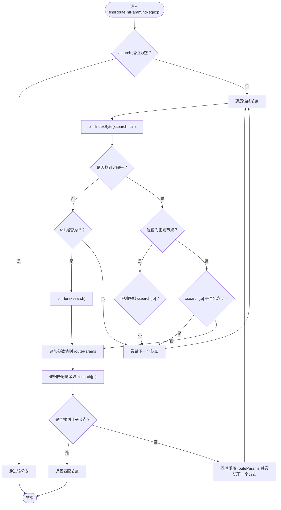
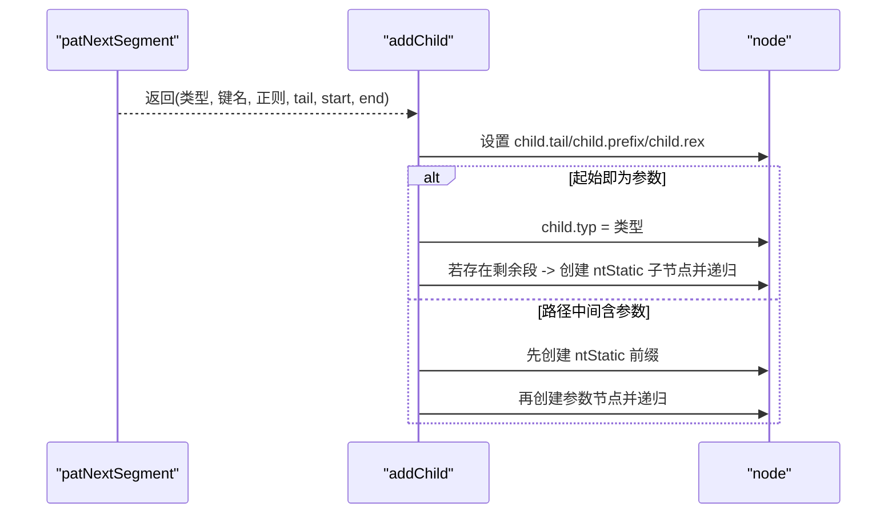
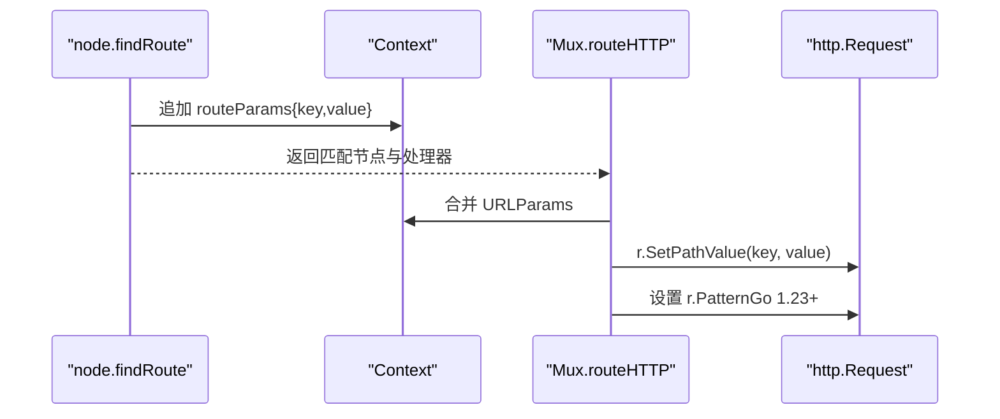
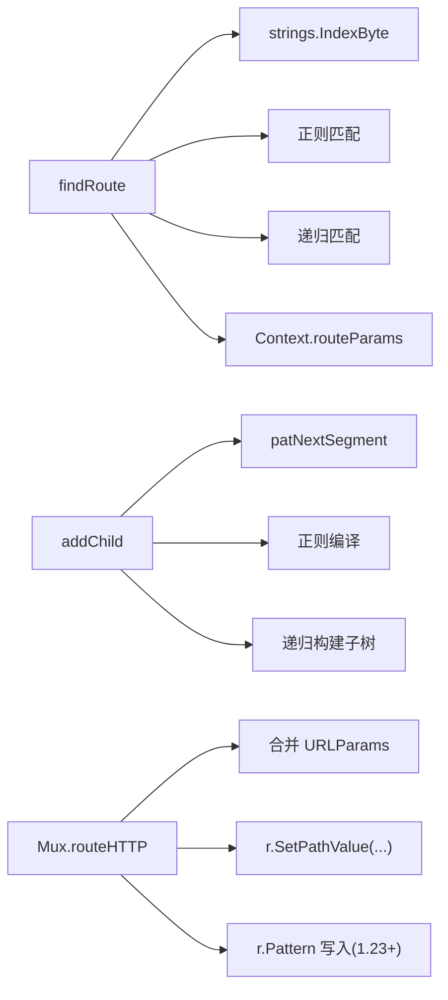

# 参数节点匹配

<cite>
**本文引用的文件**
- [tree.go](file://tree.go)
- [context.go](file://context.go)
- [mux.go](file://mux.go)
- [pattern.go](file://pattern.go)
- [pattern_fallback.go](file://pattern_fallback.go)
- [tree_test.go](file://tree_test.go)
</cite>

## 目录
1. [引言](#引言)
2. [项目结构](#项目结构)
3. [核心组件](#核心组件)
4. [架构总览](#架构总览)
5. [详细组件分析](#详细组件分析)
6. [依赖关系分析](#依赖关系分析)
7. [性能考量](#性能考量)
8. [故障排查指南](#故障排查指南)
9. [结论](#结论)
10. [附录](#附录)

## 引言
本篇文档聚焦于 chi 框架中“参数节点”（ntParam）的匹配逻辑，系统性解析路径参数如 “/{user}” 的处理流程。我们将从 node 结构体的 tail 字段如何记录参数结束分隔符（如“/”）入手，说明 findRoute 方法如何通过 strings.IndexByte 查找分隔符位置来提取参数值；解释参数提取后如何写入 Context 的 routeParams 中，并确保不会跨路径段匹配（避免匹配到“/”）；阐述 addChild 方法在处理参数节点时如何递归构建子树，并结合 patNextSegment 函数解析参数键名与尾分隔符；最后通过测试用例与示例路径展示参数捕获、上下文传递及错误处理机制。

## 项目结构
本次分析涉及的关键文件：
- tree.go：路由树实现，包含 node 结构体、插入与查找路由、参数与正则节点处理等核心逻辑
- context.go：请求上下文 Context 定义，包括 URLParams、routeParams 等
- mux.go：Mux 路由器入口，负责 ServeHTTP、routeHTTP、参数写回请求等
- pattern.go / pattern_fallback.go：Go 1.23+ 下将匹配模式写入 http.Request 的支持
- tree_test.go：覆盖参数、正则、多段参数等场景的测试

图表来源
- [tree.go](file://tree.go#L78-L128)
- [tree.go](file://tree.go#L398-L543)
- [tree.go](file://tree.go#L230-L316)
- [tree.go](file://tree.go#L684-L752)
- [context.go](file://context.go#L45-L113)
- [mux.go](file://mux.go#L440-L487)
- [pattern.go](file://pattern.go#L13-L17)
- [pattern_fallback.go](file://pattern_fallback.go#L13-L18)

章节来源
- [tree.go](file://tree.go#L78-L128)
- [context.go](file://context.go#L45-L113)
- [mux.go](file://mux.go#L440-L487)
- [pattern.go](file://pattern.go#L13-L17)
- [pattern_fallback.go](file://pattern_fallback.go#L13-L18)

## 核心组件
- node 结构体：存储前缀、类型、标签、尾分隔符、子节点数组、端点映射等
- nodeTyp 枚举：ntStatic、ntRegexp、ntParam、ntCatchAll
- Context：承载当前子路由器的 routeParams、URLParams、routePattern 等
- Mux：将 Context 注入请求生命周期，最终将参数写回 http.Request 并执行处理器

章节来源
- [tree.go](file://tree.go#L78-L128)
- [context.go](file://context.go#L45-L113)
- [mux.go](file://mux.go#L440-L487)

## 架构总览
chi 使用多维基数树（radix trie）组织路由，按 nodeTyp 分组遍历。参数节点（ntParam）与正则节点（ntRegexp）在匹配时使用 tail 作为终止分隔符，通过 strings.IndexByte 在当前搜索串中定位分隔符位置，从而截取参数值。匹配成功后，参数键与值被追加到 Context 的 routeParams，并在最终阶段合并到 URLParams，供后续中间件与处理器读取。

图表来源
- [mux.go](file://mux.go#L440-L487)
- [tree.go](file://tree.go#L398-L543)
- [context.go](file://context.go#L45-L113)

## 详细组件分析

### 参数节点（ntParam）与尾分隔符（tail）
- node 结构体中的 tail 字段用于标记参数的结束分隔符。对于以 “/” 结尾的参数，tail 默认为 “/”。当参数位于路径末尾或紧随 “}” 之后的字符即为 tail。
- addChild 在构建参数节点时设置 child.tail = segTail，确保后续匹配时能正确截断参数值。
- patNextSegment 解析下一个段的类型、键名、可选正则表达式、tail、起止索引，是 tail 与键名解析的关键。

图表来源
- [tree.go](file://tree.go#L78-L128)
- [context.go](file://context.go#L45-L113)

章节来源
- [tree.go](file://tree.go#L230-L316)
- [tree.go](file://tree.go#L684-L752)

### findRoute 中的参数匹配流程
- 对于 ntParam/ntRegexp 分支：
  - 若当前搜索串为空，直接跳过该分支
  - 遍历该组所有节点，使用 strings.IndexByte(xsearch, xn.tail) 查找分隔符位置
  - 若 tail 为 “/”，且未找到分隔符，则 p = len(xsearch)，允许匹配到路径末尾
  - 正则节点还需检查正则匹配
  - 若匹配成功，将参数值追加到 rctx.routeParams.Values，并递归匹配剩余段
  - 若递归失败，回溯重置 rctx.routeParams.Values 并尝试其他分支

图表来源
- [tree.go](file://tree.go#L398-L543)

章节来源
- [tree.go](file://tree.go#L398-L543)

### addChild 递归构建子树与参数键名解析
- addChild 根据 patNextSegment 的结果决定：
  - 若段类型为 ntRegexp，编译正则并设置 child.prefix 与 child.rex
  - 若段以参数开头（segStartIdx==0），设置 child.typ=segTyp，并设置 child.tail=segTail
  - 若存在剩余静态段，创建 ntStatic 子节点并继续递归
  - 若参数位于路径中间，先创建静态前缀节点，再创建参数节点
- patNextSegment 负责：
  - 解析 “{key:pattern}” 或 “{key}”
  - 计算 tail（默认 “/”，若 “}” 后有字符则为该字符）
  - 返回段类型、键名、正则字符串、tail、起止索引

图表来源
- [tree.go](file://tree.go#L230-L316)
- [tree.go](file://tree.go#L684-L752)

章节来源
- [tree.go](file://tree.go#L230-L316)
- [tree.go](file://tree.go#L684-L752)

### 参数提取与 Context 传递
- findRoute 在匹配成功后，会将参数键与值追加到 rctx.routeParams，并在最终返回前合并到 rctx.URLParams
- Mux.routeHTTP 在找到处理器后，将 Context 中的参数写回到 http.Request 的 PathValue，同时在 Go 1.23+ 下设置 r.Pattern

图表来源
- [tree.go](file://tree.go#L373-L396)
- [mux.go](file://mux.go#L440-L487)
- [pattern.go](file://pattern.go#L13-L17)

章节来源
- [tree.go](file://tree.go#L373-L396)
- [mux.go](file://mux.go#L440-L487)
- [pattern.go](file://pattern.go#L13-L17)
- [pattern_fallback.go](file://pattern_fallback.go#L13-L18)

### 错误处理与边界条件
- 无效正则：addChild 在编译正则失败时 panic
- 缺少闭合大括号：patNextSegment 在解析参数时检测缺失 “}” 并 panic
- wildcard 位置非法：patNextSegment 在 “*” 不在末尾时 panic
- 重复参数键：patParamKeys 在发现重复键时 panic
- 跨段匹配防护：findRoute 在非正则情况下若参数值包含 “/” 则拒绝匹配，避免跨路径段

章节来源
- [tree.go](file://tree.go#L254-L261)
- [tree.go](file://tree.go#L695-L700)
- [tree.go](file://tree.go#L719-L721)
- [tree.go](file://tree.go#L748-L751)
- [tree.go](file://tree.go#L754-L770)
- [tree.go](file://tree.go#L447-L454)

## 依赖关系分析
- node.findRoute 依赖：
  - strings.IndexByte 定位 tail
  - 正则匹配（仅 ntRegexp）
  - 递归调用自身进行后续段匹配
  - Context.routeParams 与 URLParams 的读写
- node.addChild 依赖：
  - patNextSegment 解析参数段
  - 正则编译（ntRegexp）
  - 递归构建子树
- Mux.routeHTTP 依赖：
  - Context 合并与参数写回
  - Go 1.23+ 下 pattern 支持

图表来源
- [tree.go](file://tree.go#L398-L543)
- [tree.go](file://tree.go#L230-L316)
- [tree.go](file://tree.go#L684-L752)
- [mux.go](file://mux.go#L440-L487)
- [pattern.go](file://pattern.go#L13-L17)

章节来源
- [tree.go](file://tree.go#L398-L543)
- [tree.go](file://tree.go#L230-L316)
- [tree.go](file://tree.go#L684-L752)
- [mux.go](file://mux.go#L440-L487)
- [pattern.go](file://pattern.go#L13-L17)

## 性能考量
- 多维基数树按 nodeTyp 分组遍历，减少不必要的比较
- findRoute 对 ntParam/ntRegexp 分支采用线性扫描同一组节点，配合 tail 排序（tailSort）优先处理非 “/” 尾部参数，提升命中率
- 正则匹配仅在 ntRegexp 分支触发，避免对静态与普通参数的额外开销
- Context 使用 sync.Pool 复用，降低每次请求的分配成本

章节来源
- [tree.go](file://tree.go#L790-L800)
- [mux.go](file://mux.go#L54-L91)

## 故障排查指南
- 匹配不到参数值
  - 检查路径是否以 “/” 结束，或参数尾分隔符是否正确（tail）
  - 确认参数值中不包含 “/”（非正则参数会拒绝跨段）
- 正则参数不匹配
  - 确认正则表达式合法且以 “^”、“$” 限定边界
  - 检查参数值是否满足正则约束
- 405 Method Not Allowed
  - findRoute 在叶子节点但不支持该方法时，会收集允许的方法列表并标记 methodNotAllowed
- 404 Not Found
  - 未找到任何匹配分支或子路由未找到
- 参数键重复
  - patParamKeys 会在重复键时 panic，需修正路由定义

章节来源
- [tree.go](file://tree.go#L447-L454)
- [tree.go](file://tree.go#L468-L478)
- [tree.go](file://tree.go#L754-L770)

## 结论
chi 的参数节点匹配通过 tail 字段与 strings.IndexByte 实现高效、安全的参数截取；addChild 与 patNextSegment 协作完成参数键名与尾分隔符解析，并在递归构建子树时保证路径段的正确拆分。findRoute 在匹配成功后将参数写入 Context，并在最终阶段合并到 URLParams，确保中间件与处理器可稳定读取。通过严格的边界检查与错误处理，chi 在性能与可靠性之间取得良好平衡。

## 附录

### 示例路径与预期行为（基于测试）
- “/{user}”：参数键为 “user”，tail 为 “/”，匹配 “/alice” 得到值 “alice”
- “/{id:[0-9]+}”：正则限定数字，匹配 “/123” 得到值 “123”
- “/{slug}/posts”：中间参数，静态段 “/posts” 作为后续段
- “/{firstId:[a-z0-9-]+}/{secondId:[a-z0-9-]+}/first”：多段参数，分别得到两个值

章节来源
- [tree_test.go](file://tree_test.go#L270-L334)
- [tree_test.go](file://tree_test.go#L336-L385)
- [tree_test.go](file://tree_test.go#L387-L415)