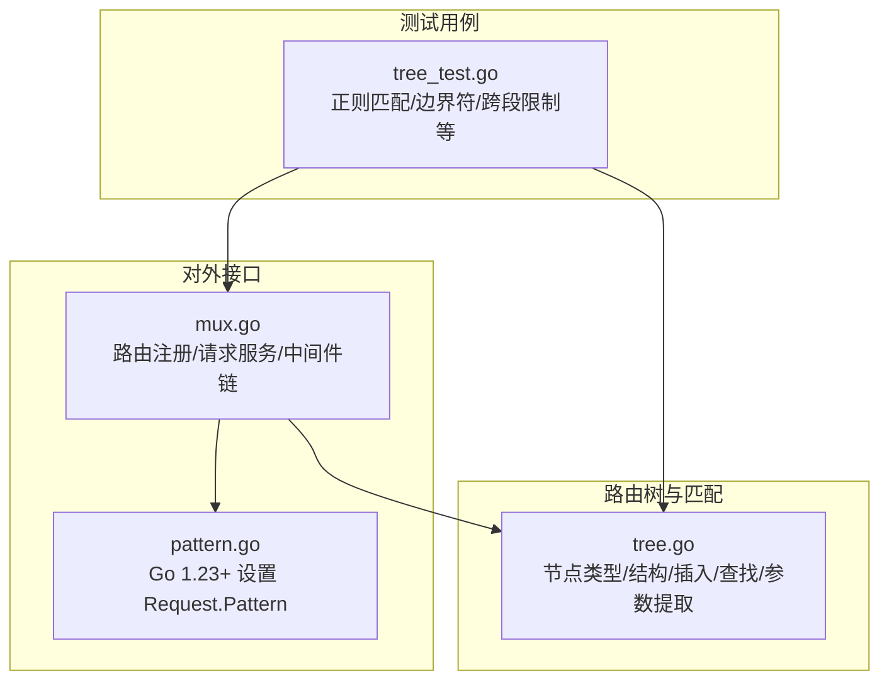
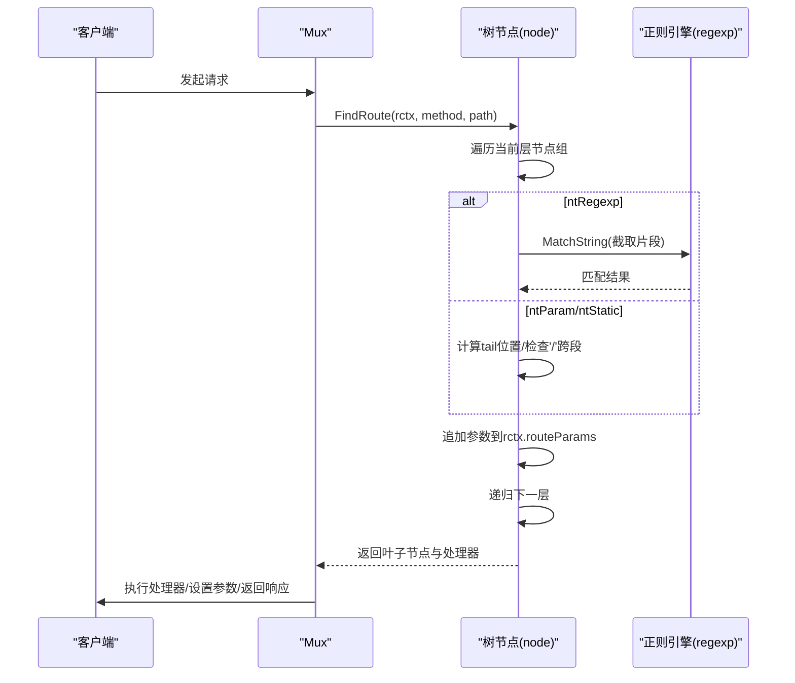
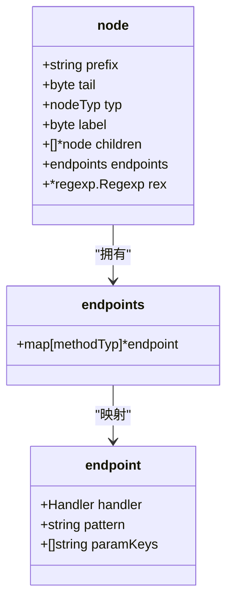
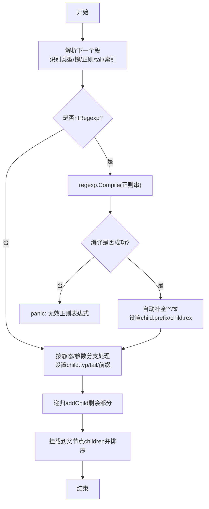
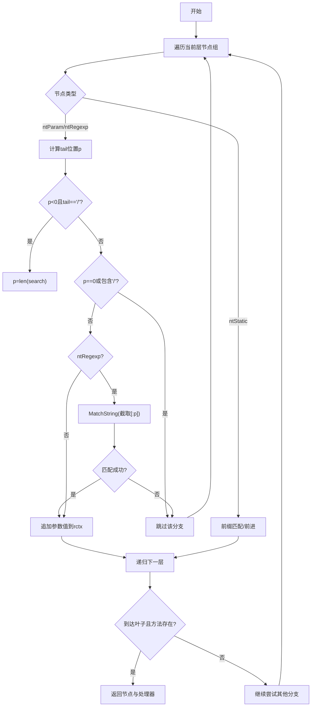
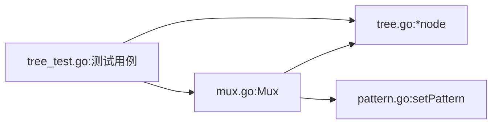

# 正则表达式节点匹配

<cite>
**本文引用的文件**
- [tree.go](file://tree.go)
- [tree_test.go](file://tree_test.go)
- [mux.go](file://mux.go)
- [pattern.go](file://pattern.go)
</cite>

## 目录
1. [简介](#简介)
2. [项目结构](#项目结构)
3. [核心组件](#核心组件)
4. [架构总览](#架构总览)
5. [详细组件分析](#详细组件分析)
6. [依赖关系分析](#依赖关系分析)
7. [性能考量](#性能考量)
8. [故障排查指南](#故障排查指南)
9. [结论](#结论)
10. [附录](#附录)

## 简介
本篇文档聚焦于 chi 框架中“正则表达式节点”（ntRegexp）的实现原理，系统讲解以 “/{id:[0-9]+}” 这类路由模式的处理流程：包括 node 结构体中 rex 字段如何存储编译后的 *regexp.Regexp 对象、addChild 在插入路由时如何对正则表达式进行预编译并自动添加 ^ 和 $ 边界符、findRoute 在匹配时如何调用 MatchString 验证内容并结合参数提取逻辑确保正则匹配不跨越路径段，以及错误处理机制（如无效正则表达式触发 panic）。同时通过测试用例中的复杂正则路由示例，展示匹配过程与性能考量。

## 项目结构
- 路由树与匹配核心位于 tree.go，包含节点类型定义、节点结构、插入与查找算法、参数提取与尾分隔符处理等。
- mux.go 提供对外接口（注册路由、服务请求），内部委托给树节点完成匹配与参数回填。
- pattern.go 提供 Go 1.23+ 下将匹配到的路由模式写入 http.Request 的能力。
- tree_test.go 包含大量针对正则表达式节点的测试用例，覆盖边界符自动添加、跨段匹配限制、递归多段正则等场景。

图表来源
- [tree.go](file://tree.go#L78-L112)
- [mux.go](file://mux.go#L414-L487)
- [pattern.go](file://pattern.go#L13-L17)
- [tree_test.go](file://tree_test.go#L270-L416)

章节来源
- [tree.go](file://tree.go#L78-L112)
- [mux.go](file://mux.go#L414-L487)
- [pattern.go](file://pattern.go#L13-L17)
- [tree_test.go](file://tree_test.go#L270-L416)

## 核心组件
- 节点类型与结构
  - 节点类型：静态、正则、参数、通配。
  - 关键字段：prefix、tail、typ、label、children、endpoints、rex。
  - 其中 rex 存储编译后的正则表达式对象，用于 ntRegexp 类型节点的快速匹配。
- 插入阶段（addChild）
  - 解析下一个段：识别是否为正则段、参数段或静态段；计算 tail 分隔符；解析出正则串。
  - 对 ntRegexp 段：使用 regexp.Compile 编译正则；若未显式以 ^/$ 开闭，则自动补全边界符。
  - 将子节点按类型与 label 排序挂载到父节点 children 中。
- 查找阶段（findRoute）
  - 遍历当前层级的节点组（ntStatic/ntParam/ntRegexp/catchAll）。
  - 对 ntRegexp：先定位到 tail 分隔符位置，避免跨路径段；若为 ntRegexp 则用已编译的 rex.MatchString 做精确匹配；否则检查是否包含 '/' 以避免跨段。
  - 成功匹配后将参数值追加到上下文，并递归进入下一层级继续匹配。
  - 若到达叶子节点且存在对应方法处理器，则返回该节点与处理器。

章节来源
- [tree.go](file://tree.go#L78-L112)
- [tree.go](file://tree.go#L230-L316)
- [tree.go](file://tree.go#L398-L543)

## 架构总览
chi 的路由树是一个多维前缀树（radix trie），不同类型的节点按组排列，查找时按组遍历并结合 tail 分隔符与正则匹配规则，最终在叶子节点处确定处理器与参数。

图表来源
- [mux.go](file://mux.go#L441-L487)
- [tree.go](file://tree.go#L398-L543)

## 详细组件分析

### 节点类型与结构体
- 节点类型枚举：ntStatic、ntRegexp、ntParam、ntCatchAll。
- node 结构体关键字段：
  - prefix：公共前缀或正则串本身（当为 ntRegexp 时）。
  - tail：参数段的尾分隔符字节（如 '/' 或其他自定义分隔符）。
  - typ：节点类型。
  - label：首个字符，用于二分查找同组节点。
  - children：按类型分组的子节点数组。
  - endpoints：各 HTTP 方法对应的处理器与模式信息。
  - rex：当为 ntRegexp 时，保存编译后的正则对象。

图表来源
- [tree.go](file://tree.go#L87-L128)

章节来源
- [tree.go](file://tree.go#L87-L128)

### addChild：正则预编译与边界符处理
- 输入：child 节点与完整 pattern。
- 处理流程：
  - 解析下一个段：识别类型、参数键、正则串、tail、起止索引。
  - 当类型为 ntRegexp：
    - 使用 regexp.Compile 对正则串进行编译。
    - 若未以 '^' 开头则自动前置 '^'；若未以 '$' 结尾则自动后置 '$'。
    - 将 child.prefix 设为原始正则串，child.rex 指向编译后的对象。
  - 根据 segStartIdx 决定 child.typ 与 tail，并递归添加剩余静态段或参数段。
  - 最终将 child 按类型与 label 排序挂入父节点 children。

图表来源
- [tree.go](file://tree.go#L230-L316)

章节来源
- [tree.go](file://tree.go#L230-L316)

### findRoute：正则匹配与参数提取
- 输入：当前节点 nn、请求上下文 rctx、方法 method、路径 search。
- 处理流程：
  - 遍历当前层的节点组（ntStatic/ntParam/ntRegexp/catchAll）。
  - 对 ntRegexp：
    - 若 search 为空直接跳过。
    - 计算 tail 分隔符位置 p；若找不到且 tail 为 '/' 则 p = len(search)。
    - 若 p==0（空参数）或截取片段包含 '/'（跨段）则跳过。
    - 使用 child.rex.MatchString 对片段进行精确匹配；失败则跳过。
    - 匹配成功则将片段作为参数值追加到 rctx.routeParams.Values，并递归进入下一层。
  - 对 ntParam/ntStatic：
    - 优先尝试静态前缀匹配；若不满足则跳过。
    - 参数段同样受 tail 与 '/' 跨段限制。
  - 到达叶子节点且存在对应方法处理器时返回该节点与处理器；否则记录允许的方法集合以支持 405。

图表来源
- [tree.go](file://tree.go#L398-L543)

章节来源
- [tree.go](file://tree.go#L398-L543)

### 错误处理机制
- 无效正则表达式：在 addChild 中对正则串调用 regexp.Compile，若返回错误则触发 panic，提示“路由参数中的正则表达式无效”。
- 重复参数键：在解析参数键时检测到重复键会触发 panic，防止歧义。
- 通配符位置非法：在解析模式时若 '*' 不在末尾会触发 panic。
- 替换缺失子节点：在替换子节点时若未找到匹配项会触发 panic。

章节来源
- [tree.go](file://tree.go#L254-L261)
- [tree.go](file://tree.go#L744-L752)
- [tree.go](file://tree.go#L318-L328)
- [tree.go](file://tree.go#L754-L770)

### 性能考量
- 预编译正则：在路由注册阶段一次性编译，运行时仅做 MatchString，避免重复编译开销。
- 边界符自动添加：确保正则只匹配单段内容，减少回溯与跨段误匹配带来的额外成本。
- 二分查找与排序：同组节点按 label 排序并使用二分查找，降低查找复杂度。
- 递归回溯：findRoute 采用回溯策略，但通过 tail 与 '/' 跨段限制缩小搜索空间，避免无谓尝试。
- 测试基准：提供基准测试用例，便于评估典型路由匹配场景的性能表现。

章节来源
- [tree.go](file://tree.go#L254-L261)
- [tree.go](file://tree.go#L398-L543)
- [tree_test.go](file://tree_test.go#L487-L510)

## 依赖关系分析
- mux.go 通过 Mux.handle 将路由注册委托给树节点 InsertRoute；通过 Mux.routeHTTP 在请求到来时调用树节点 FindRoute 完成匹配与参数回填。
- pattern.go 在 Go 1.23+ 条件下将匹配到的路由模式写入 http.Request，便于调试与日志追踪。
- tree_test.go 提供大量正则匹配测试，覆盖边界符自动添加、跨段限制、递归多段正则等关键行为。

图表来源
- [mux.go](file://mux.go#L414-L487)
- [pattern.go](file://pattern.go#L13-L17)
- [tree_test.go](file://tree_test.go#L270-L416)

章节来源
- [mux.go](file://mux.go#L414-L487)
- [pattern.go](file://pattern.go#L13-L17)
- [tree_test.go](file://tree_test.go#L270-L416)

## 性能考量
- 预编译与缓存：正则在注册时编译一次，运行时直接复用，避免每次请求重复编译。
- 边界符约束：强制 ^$ 使匹配限定在单段内，减少回溯与误匹配。
- 结构优化：children 按类型分组并按 label 排序，配合二分查找提升查找效率。
- 回溯控制：findRoute 在 ntRegexp 分支中严格限制参数长度至 tail 之前，避免不必要的尝试。
- 基准测试：tree_test.go 提供基准用例，可据此评估典型场景下的分配与耗时。

章节来源
- [tree.go](file://tree.go#L254-L261)
- [tree.go](file://tree.go#L398-L543)
- [tree_test.go](file://tree_test.go#L487-L510)

## 故障排查指南
- 注册路由时报“无效正则表达式”：
  - 检查路由中正则语法是否正确；确认未遗漏必要的转义字符。
  - 确认正则串未包含非法字符或不支持的特性。
- 注册路由时报“参数键重复”：
  - 检查同一路由中是否存在重复的参数键名，修改为唯一键。
- 请求无法命中预期处理器：
  - 确认请求路径中参数值未跨越路径段（即未包含 '/'）。
  - 检查 tail 分隔符是否与期望一致；必要时调整路由定义。
- 通配符位置错误：
  - 确保 '*' 位于路由末尾；否则需改用参数段或静态段拼接。
- 405 Method Not Allowed：
  - 检查是否匹配到相同路径但不支持该方法；根据 rctx.methodsAllowed 列表核对。

章节来源
- [tree.go](file://tree.go#L254-L261)
- [tree.go](file://tree.go#L744-L752)
- [tree.go](file://tree.go#L398-L543)

## 结论
chi 的正则表达式节点通过“预编译 + 自动边界符 + tail 分隔符 + 跨段限制”的组合，在保证灵活性的同时兼顾了性能与安全性。addChild 在注册阶段完成正则编译与边界符处理，findRoute 在运行时以高效的方式执行匹配与参数提取，tree_test.go 的丰富用例覆盖了常见与边界场景。对于复杂正则路由，建议明确 tail 分隔符、避免跨段匹配、并在注册阶段尽早发现正则语法问题。

## 附录
- 示例参考（来自测试用例）：
  - 单段数字正则：/{id:[0-9]+}
  - 多段正则组合：/one/{firstId:[a-z0-9-]+}/{secondId:[a-z0-9-]+}/first
  - 跨段限制验证：/{id:[0-9]+}、/{x:.+}/foo、/{param:[0-9]*}/test
  - 递归多段正则：/one/{firstId:[a-z0-9-]+}/{secondId:[a-z0-9-]+}/first 与 /one/{firstId:[a-z0-9-_]+}/{secondId:[a-z0-9-_]+}/second

章节来源
- [tree_test.go](file://tree_test.go#L270-L416)