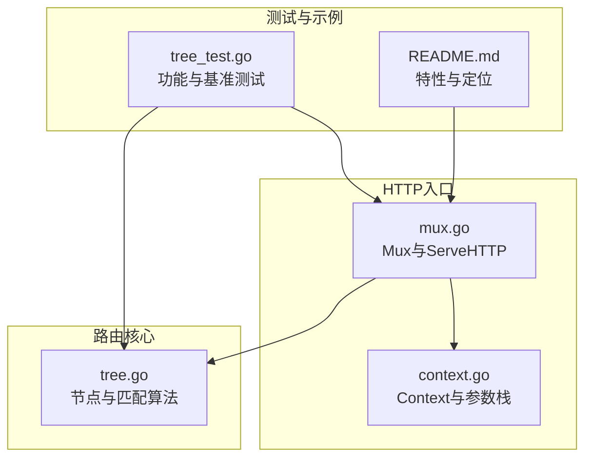
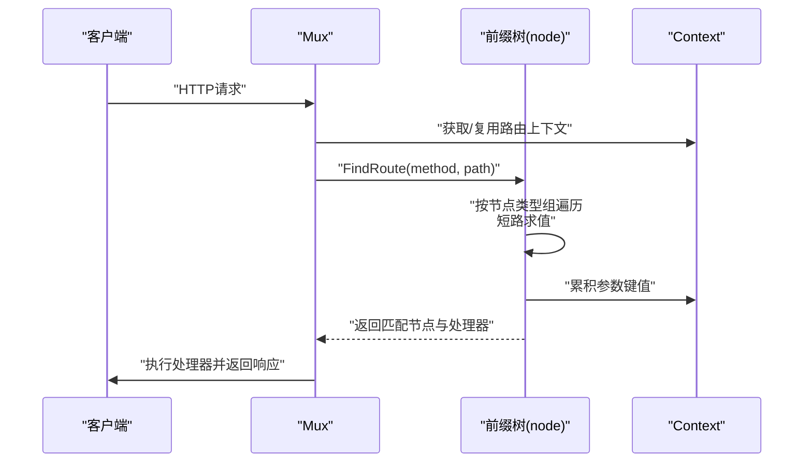
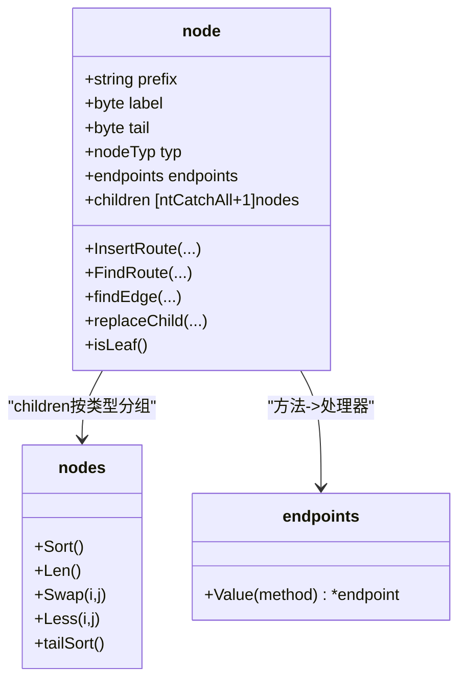
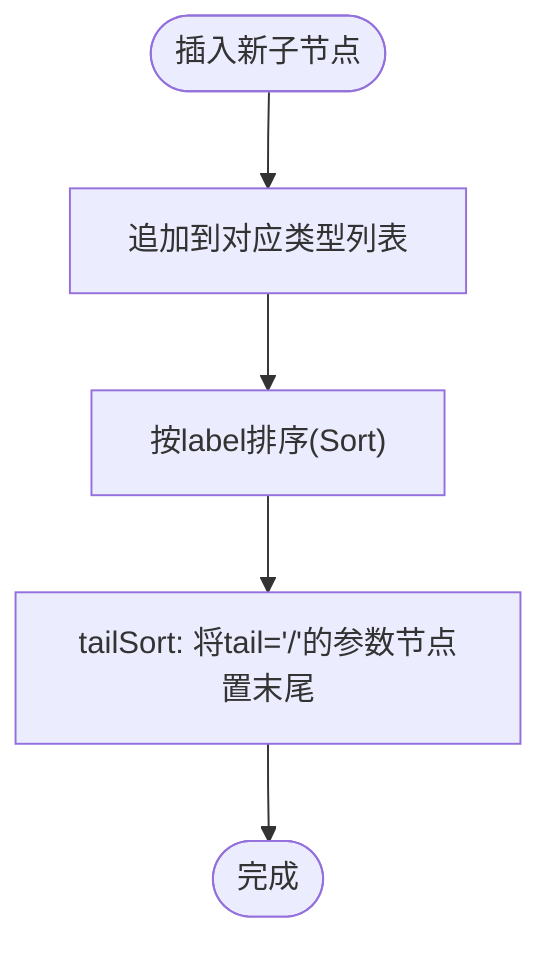
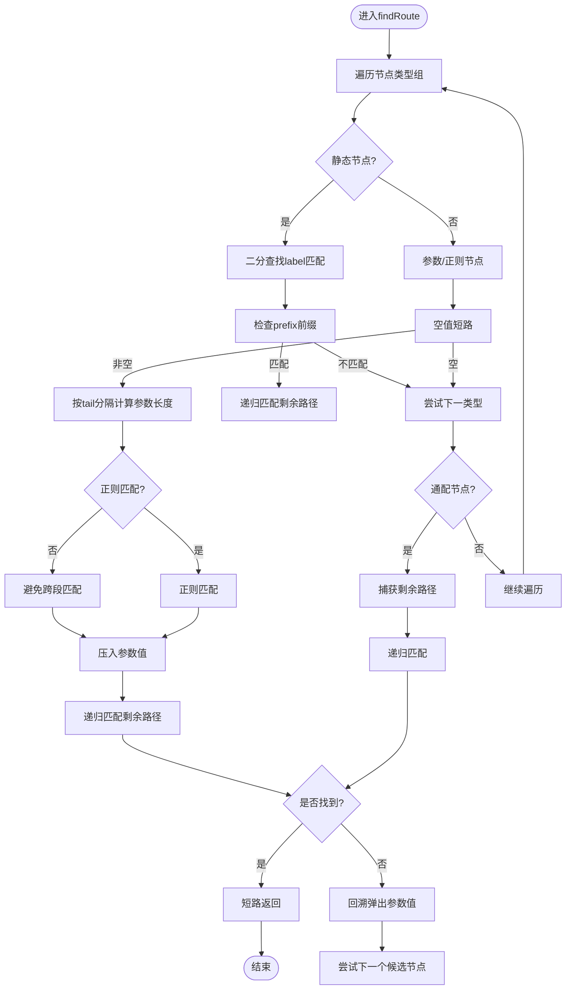
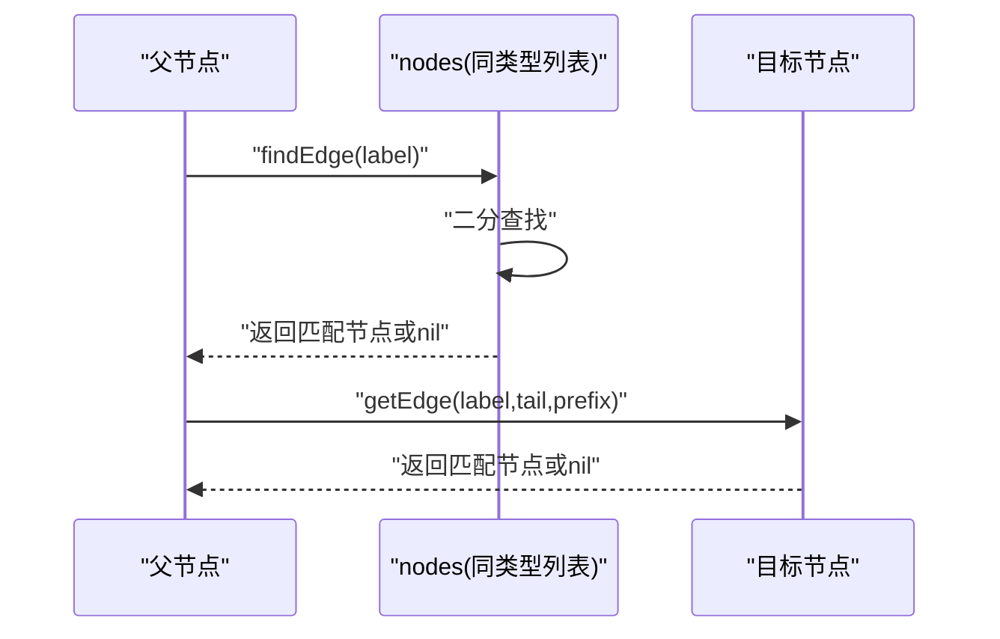
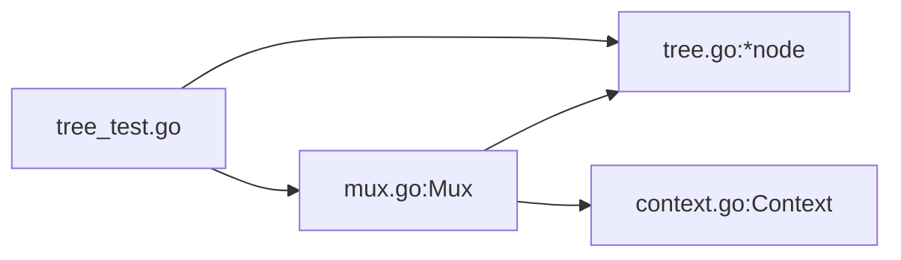

# 路由匹配性能优化

<cite>
**本文引用的文件**
- [tree.go](file://tree.go)
- [mux.go](file://mux.go)
- [context.go](file://context.go)
- [tree_test.go](file://tree_test.go)
- [README.md](file://README.md)
</cite>

## 目录
1. [引言](#引言)
2. [项目结构](#项目结构)
3. [核心组件](#核心组件)
4. [架构总览](#架构总览)
5. [详细组件分析](#详细组件分析)
6. [依赖关系分析](#依赖关系分析)
7. [性能考量](#性能考量)
8. [故障排查指南](#故障排查指南)
9. [结论](#结论)
10. [附录](#附录)

## 引言
本文件聚焦于chi框架基于前缀树（基数树）的路由匹配算法在性能方面的优化策略。我们将从数据结构设计、查找与排序策略、匹配流程与短路求值、以及大规模场景下的优化实践等维度进行系统化剖析，并结合仓库中的基准测试用例给出可操作的性能优化建议。

## 项目结构
- 路由核心位于tree.go，定义了节点结构、插入与查找逻辑、排序与tail排序策略。
- mux.go负责对外暴露Router接口、请求处理链路、子路由挂载与中间件编排。
- context.go提供请求上下文与参数栈管理，贯穿匹配生命周期。
- tree_test.go包含大量路由匹配行为验证与一个基准测试用例，便于评估性能。

图表来源
- [tree.go](file://tree.go#L1-L120)
- [mux.go](file://mux.go#L1-L120)
- [context.go](file://context.go#L1-L120)
- [tree_test.go](file://tree_test.go#L1-L120)
- [README.md](file://README.md#L170-L190)

章节来源
- [README.md](file://README.md#L170-L190)
- [tree.go](file://tree.go#L1-L120)
- [mux.go](file://mux.go#L1-L120)
- [context.go](file://context.go#L1-L120)

## 核心组件
- 节点与前缀树：node结构体以“按节点类型分组”的children数组组织子节点，配合label与tail字段实现高效匹配；同时通过nodes.Sort对同类型子节点按label有序排列，支持二分查找。
- 匹配算法：findRoute采用多维递归遍历，按静态、参数、正则、通配四类节点组依次尝试，利用短路求值减少不必要分支。
- 排序与tail排序：nodes.Sort在插入时对同类型子节点按label排序；tailSort将tail为'/'的参数节点置于末尾，优化常见路径匹配顺序。
- 上下文与参数栈：Context在匹配过程中累积参数键值，最终注入到请求对象，保证零分配或低分配的参数传递。

章节来源
- [tree.go](file://tree.go#L78-L120)
- [tree.go](file://tree.go#L318-L372)
- [tree.go](file://tree.go#L398-L543)
- [tree.go](file://tree.go#L782-L800)
- [context.go](file://context.go#L45-L110)

## 架构总览
chi的路由匹配以“多维基数树”为核心，Mux作为HTTP入口，将请求路径与方法映射到具体处理器。匹配过程通过findRoute递归遍历，按节点类型组优先级与label顺序进行短路匹配，最终在叶子节点处完成方法与处理器的绑定。

图表来源
- [mux.go](file://mux.go#L440-L487)
- [tree.go](file://tree.go#L373-L396)
- [tree.go](file://tree.go#L398-L543)
- [context.go](file://context.go#L45-L110)

## 详细组件分析

### 节点结构与children分组存储
- 结构要点
  - prefix：公共前缀
  - label：首个字符
  - tail：参数节点的分隔符（如'/'）
  - typ：节点类型（静态、参数、正则、通配）
  - children：按节点类型分组的子节点数组
  - endpoints：方法到处理器的映射
- 设计意图
  - 将同一类型的子节点集中存储，便于按类型快速筛选；
  - 在插入时对同类型子节点按label排序，为后续二分查找奠定基础。

图表来源
- [tree.go](file://tree.go#L78-L120)
- [tree.go](file://tree.go#L782-L800)

章节来源
- [tree.go](file://tree.go#L78-L120)
- [tree.go](file://tree.go#L782-L800)

### nodes.Sort与tailSort：标签排序与尾部优化
- nodes.Sort
  - 实现：基于label的Less比较，使用标准库排序；
  - 复杂度：O(k log k)，k为同类型子节点数量；
  - 作用：确保静态、参数、正则三类节点在查找时能按label顺序二分定位。
- tailSort
  - 策略：将tail为'/'的参数节点交换至该类型列表末尾；
  - 目的：使常见路径（以'/'结尾）优先匹配，减少跨段匹配的无效尝试，提高命中率。

图表来源
- [tree.go](file://tree.go#L318-L339)
- [tree.go](file://tree.go#L313-L316)
- [tree.go](file://tree.go#L782-L800)

章节来源
- [tree.go](file://tree.go#L313-L316)
- [tree.go](file://tree.go#L782-L800)

### findRoute：递归遍历与短路求值
- 遍历策略
  - 按节点类型组顺序遍历：静态、参数、正则、通配；
  - 对静态节点：先按label二分定位，再检查prefix前缀匹配；
  - 对参数/正则节点：先检查空值短路，再按tail分隔计算匹配长度，避免跨段匹配；
  - 递归深入：在当前分支匹配成功后继续向下游递归，一旦找到即短路返回。
- 短路与回溯
  - 若某分支未命中，重置参数栈与搜索状态，尝试下一个候选节点；
  - 在叶子节点处若无对应方法，记录允许的方法集合以便405响应。

图表来源
- [tree.go](file://tree.go#L398-L543)

章节来源
- [tree.go](file://tree.go#L398-L543)

### getEdge/findEdge：二分查找与边缘选择
- getEdge
  - 在指定类型组中按label与tail精确匹配；
  - 正则节点需额外校验prefix一致；
- findEdge
  - 对静态/参数/正则三类节点使用二分查找定位label；
  - 通配节点直接取首元素，避免排序开销。

图表来源
- [tree.go](file://tree.go#L330-L341)
- [tree.go](file://tree.go#L545-L571)

章节来源
- [tree.go](file://tree.go#L330-L341)
- [tree.go](file://tree.go#L545-L571)

### 插入与更新：addChild与setEndpoint
- addChild
  - 解析下一个片段类型（静态/参数/正则/通配），递归构建树；
  - 在插入后立即调用Sort与tailSort，确保后续查找效率。
- setEndpoint
  - 支持mSTUB与mALL模式，批量设置处理器与参数键；
  - 叶子节点记录pattern与paramKeys，用于最终参数注入与日志输出。

章节来源
- [tree.go](file://tree.go#L230-L317)
- [tree.go](file://tree.go#L343-L371)

### 上下文与参数栈：Context与参数累积
- Context在匹配过程中累积routePattern、URLParams与RoutePatterns；
- 叶子节点匹配成功后，将参数键值追加到请求上下文，最终在Mux.routeHTTP中写入请求对象。

章节来源
- [context.go](file://context.go#L45-L110)
- [mux.go](file://mux.go#L440-L487)

## 依赖关系分析
- Mux依赖node树进行路由匹配；
- Mux在ServeHTTP中复用sync.Pool的Context，降低分配；
- Mux在routeHTTP中根据匹配结果执行处理器或404/405响应；
- 测试用例tree_test.go覆盖了大量匹配场景与一个基准测试用例。

图表来源
- [mux.go](file://mux.go#L1-L120)
- [tree.go](file://tree.go#L1-L120)
- [context.go](file://context.go#L1-L120)
- [tree_test.go](file://tree_test.go#L1-L120)

章节来源
- [mux.go](file://mux.go#L1-L120)
- [tree.go](file://tree.go#L1-L120)
- [context.go](file://context.go#L1-L120)
- [tree_test.go](file://tree_test.go#L1-L120)

## 性能考量

### 已有优化点
- 子节点按类型分组存储，减少无关类型扫描；
- 同类型子节点按label排序，findEdge使用二分查找，查找复杂度O(log k)；
- tailSort将tail为'/'的参数节点置于末尾，有利于常见路径快速命中；
- findRoute在多个分支上采用短路求值，避免不必要的递归；
- Context复用与参数栈累积，减少重复分配。

章节来源
- [tree.go](file://tree.go#L78-L120)
- [tree.go](file://tree.go#L782-L800)
- [tree.go](file://tree.go#L398-L543)
- [mux.go](file://mux.go#L60-L92)

### 基准测试建议
- 当前仓库已提供一个基准测试用例，建议扩展：
  - 不同规模路由集（小/中/大）对比静态、参数、正则、通配节点比例变化对性能的影响；
  - 随机路径与热点路径混合场景，观察tailSort带来的收益；
  - 并发场景下的吞吐与延迟，结合sync.Pool的复用效果；
  - 参数正则表达式复杂度对匹配耗时的影响。
- 建议在tree_test.go中新增更多Benchmark函数，覆盖上述场景。

章节来源
- [tree_test.go](file://tree_test.go#L487-L512)

### 大规模路由场景优化实践
- 控制每层节点数量：尽量将高冲突路径拆分为更细粒度的静态段，减少单层同类型子节点数量；
- 合理使用通配符：通配符会增加匹配成本，优先使用静态或参数段；
- 规范参数命名与正则：避免过于复杂的正则，减少回溯；
- 利用子路由与Mount：将大型服务拆分为子路由，降低单棵树深度；
- 保持排序稳定性：在高频插入场景下，尽量批量注册路由，减少频繁Sort与tailSort；
- 监控与采样：在生产环境采集匹配耗时分布，识别慢查询路径并针对性优化。

## 故障排查指南
- 方法不被允许（405）
  - 现象：匹配到路由但无对应方法处理器；
  - 定位：findRoute在叶子节点处收集methodsAllowed，Mux.routeHTTP据此返回405；
  - 处理：确认路由是否正确声明对应方法。
- 未找到（404）
  - 现象：无任何匹配；
  - 定位：Mux.routeHTTP在未找到处理器且未标记methodNotAllowed时返回404；
  - 处理：检查路径拼写、尾斜杠、子路由挂载是否冲突。
- 参数未正确注入
  - 现象：URLParam取不到值；
  - 定位：确认Context在匹配阶段累积了参数键值，且在routeHTTP中写入请求；
  - 处理：检查子路由挂载与参数键名一致性。

章节来源
- [tree.go](file://tree.go#L460-L520)
- [mux.go](file://mux.go#L468-L487)
- [context.go](file://context.go#L45-L110)

## 结论
chi的前缀树路由在结构上通过“按类型分组+标签排序+tail排序”实现了高效的静态与参数段匹配；在算法上通过findRoute的递归与短路求值，有效减少了无效分支的探索。针对大规模路由场景，建议从路由设计、正则复杂度、子路由拆分与批量注册等方面综合优化，并结合基准测试持续验证效果。

## 附录
- 相关实现位置参考
  - 节点与匹配：[tree.go](file://tree.go#L78-L120), [tree.go](file://tree.go#L398-L543)
  - 排序与tail排序：[tree.go](file://tree.go#L782-L800)
  - 插入与端点设置：[tree.go](file://tree.go#L230-L317), [tree.go](file://tree.go#L343-L371)
  - HTTP入口与上下文：[mux.go](file://mux.go#L440-L487), [context.go](file://context.go#L45-L110)
  - 基准测试：[tree_test.go](file://tree_test.go#L487-L512)