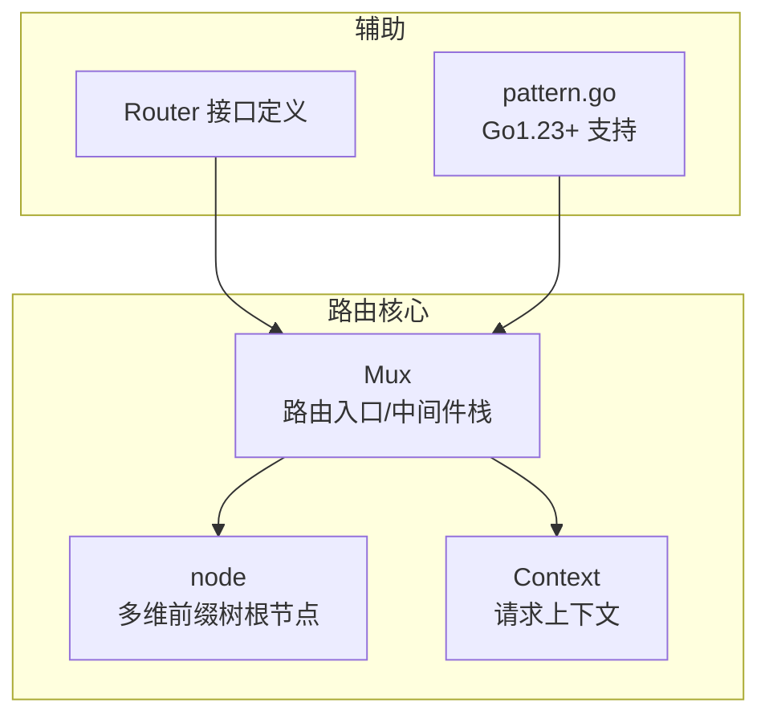
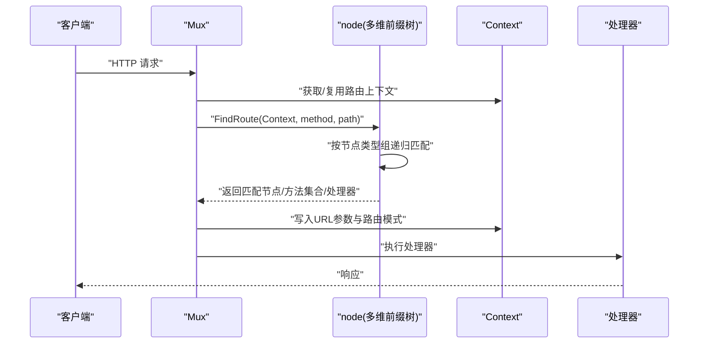
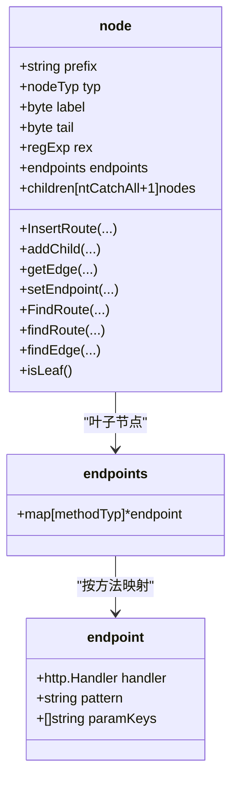
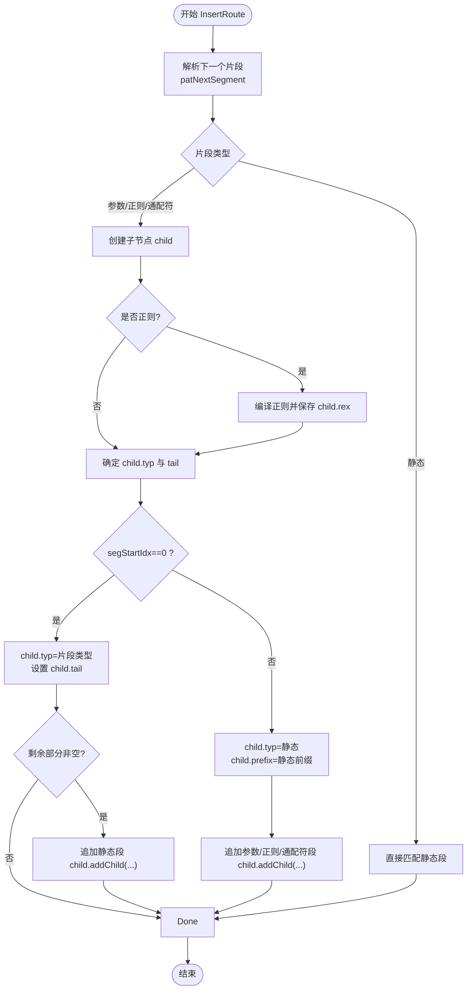
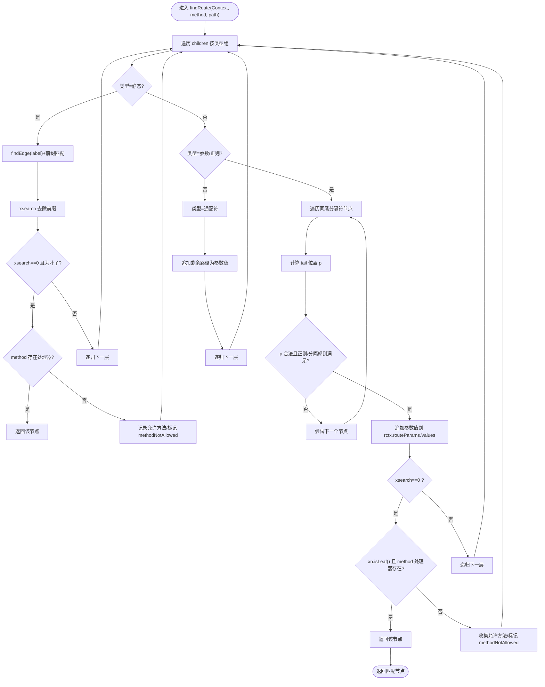
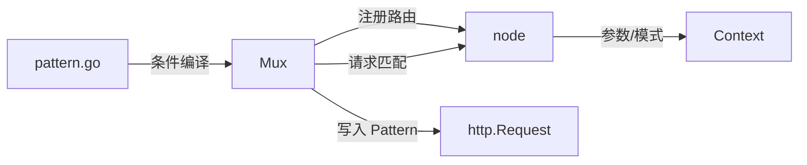

# 路由匹配算法

<cite>
**本文引用的文件**
- [tree.go](file://tree.go)
- [mux.go](file://mux.go)
- [context.go](file://context.go)
- [chi.go](file://chi.go)
- [pattern.go](file://pattern.go)
- [tree_test.go](file://tree_test.go)
</cite>

## 目录
1. [引言](#引言)
2. [项目结构](#项目结构)
3. [核心组件](#核心组件)
4. [架构总览](#架构总览)
5. [详细组件分析](#详细组件分析)
6. [依赖关系分析](#依赖关系分析)
7. [性能考量](#性能考量)
8. [故障排查指南](#故障排查指南)
9. [结论](#结论)
10. [附录](#附录)

## 引言
本文件深入剖析 chi 框架基于前缀树（Trie）的路由匹配算法实现，重点解释 node 结构体中不同节点类型（静态、参数、正则、通配符）的匹配逻辑，以及如何通过递归遍历实现高效的路径查找；详解 findRoute 方法如何处理 URL 参数提取与存储，特别是参数尾分隔符的处理机制；阐述正则表达式路由的编译与匹配过程，以及通配符路由的特殊处理方式；并通过测试用例展示复杂路由模式的匹配过程，最后给出算法性能分析与优化建议。

## 项目结构
chi 的路由系统围绕“多维前缀树”展开：Mux 作为入口与中间件栈组合器，内部持有根节点 node；node 维护按节点类型分组的子节点数组，支持静态、参数、正则、通配符四类节点；Context 在请求生命周期内记录匹配到的路由模式与参数键值对；pattern.go 提供 Go 版本条件编译以设置请求 Pattern 字段。

图表来源
- [mux.go](file://mux.go#L1-L120)
- [tree.go](file://tree.go#L78-L128)
- [context.go](file://context.go#L42-L110)
- [chi.go](file://chi.go#L64-L138)
- [pattern.go](file://pattern.go#L8-L17)

章节来源
- [mux.go](file://mux.go#L1-L120)
- [tree.go](file://tree.go#L78-L128)
- [context.go](file://context.go#L42-L110)
- [chi.go](file://chi.go#L64-L138)
- [pattern.go](file://pattern.go#L8-L17)

## 核心组件
- node 与 endpoints：node 表示树节点，包含 prefix、children、endpoints 等字段；endpoints 将 HTTP 方法映射到具体处理器与路由模式、参数键列表。
- 节点类型 nodeTyp：ntStatic、ntParam、ntRegexp、ntCatchAll 四种类型分别对应静态路径、命名参数、带正则约束的参数、通配符。
- findRoute 递归匹配：按节点类型组顺序尝试匹配，静态节点使用前缀匹配，参数/正则节点按 tail 分隔符切分，正则节点进行正则匹配，通配符捕获剩余路径。
- patNextSegment 模式解析：从路由模式中解析出下一个片段的类型、键名、正则串、尾分隔符及起止索引。
- Context 参数与模式记录：在匹配过程中累积参数键值对与匹配到的路由模式，最终写入请求对象。

章节来源
- [tree.go](file://tree.go#L78-L128)
- [tree.go](file://tree.go#L398-L543)
- [tree.go](file://tree.go#L684-L752)
- [context.go](file://context.go#L42-L110)

## 架构总览
chi 的路由匹配流程如下：
- Mux.Handle/Method/Route/Mount 注册路由时，调用 node.InsertRoute 将模式拆分为多段节点插入树中。
- 请求到达时，Mux.routeHTTP 获取 Context，调用 node.FindRoute 进行递归匹配。
- 匹配成功后，将参数键值对写入请求对象，执行处理器；否则根据是否命中路由但方法不支持返回 405 或 404。

图表来源
- [mux.go](file://mux.go#L440-L487)
- [tree.go](file://tree.go#L373-L396)
- [tree.go](file://tree.go#L398-L543)
- [context.go](file://context.go#L42-L110)

## 详细组件分析

### node 结构与节点类型
- node.typ：区分静态、参数、正则、通配符四类。
- node.prefix：静态段的公共前缀或正则字符串。
- node.children：按类型分组的子节点数组，同一类型按 label 排序。
- node.rex：正则节点保存编译后的正则表达式。
- node.endpoints：叶子节点保存各方法的处理器、模式与参数键列表。

图表来源
- [tree.go](file://tree.go#L78-L128)
- [tree.go](file://tree.go#L114-L128)

章节来源
- [tree.go](file://tree.go#L78-L128)
- [tree.go](file://tree.go#L114-L128)

### 插入路由：InsertRoute 与 addChild
- InsertRoute：自顶向下扫描模式，遇到静态段直接匹配；遇到参数/正则/通配符段时，先通过 patNextSegment 解析片段，再调用 addChild 完成节点拆分与插入。
- addChild：
  - 若为正则段，编译正则并保存在 child.rex 中。
  - 若模式以参数开头，则将该参数段作为 child，若剩余部分非空则追加一个静态段。
  - 若模式以静态段开头，先创建静态段，再追加参数/正则/通配符段。
  - 最后将 child 按类型插入父节点 children 并排序。

图表来源
- [tree.go](file://tree.go#L138-L228)
- [tree.go](file://tree.go#L230-L316)
- [tree.go](file://tree.go#L253-L311)
- [tree.go](file://tree.go#L684-L752)

章节来源
- [tree.go](file://tree.go#L138-L228)
- [tree.go](file://tree.go#L230-L316)
- [tree.go](file://tree.go#L253-L311)
- [tree.go](file://tree.go#L684-L752)

### 匹配算法：findRoute 递归遍历
findRoute 是多维前缀树的递归搜索核心，按节点类型组顺序尝试匹配：
- 静态组：按 label 二分查找匹配的子节点，检查前缀是否匹配。
- 参数/正则组：对每个同尾分隔符的节点尝试匹配：
  - 计算 tail 分隔符位置 p；若未找到且 tail 为 '/' 则取末尾。
  - 正则节点需满足正则匹配；同时避免跨路径段匹配（即 p 前不能含 '/'）。
  - 将匹配到的参数值追加到 rctx.routeParams.Values，然后递归进入下一层。
  - 若当前层已到路径末尾且为叶子节点，检查对应方法是否存在处理器；否则收集允许的方法用于 405。
- 通配符组：将剩余路径整体作为参数值，直接进入下一层。

图表来源
- [tree.go](file://tree.go#L398-L543)

章节来源
- [tree.go](file://tree.go#L398-L543)

### URL 参数提取与存储：参数尾分隔符处理
- 参数尾分隔符 tail 由 patNextSegment 解析得到，默认为 '/'。参数节点的 label 实际上是 tail 字节。
- findRoute 对参数/正则节点使用 strings.IndexByte(xsearch, xn.tail) 查找分隔位置 p；若 tail 为 '/' 且未找到，则取到路径末尾，确保参数可跨越多个段。
- 正则节点在匹配时还需满足正则表达式；同时避免跨段匹配（p 前不含 '/'）。
- 匹配成功后将参数值追加到 rctx.routeParams.Values，最终在路由完成后复制到 rctx.URLParams，以便后续中间件与处理器读取。

章节来源
- [tree.go](file://tree.go#L684-L752)
- [tree.go](file://tree.go#L426-L459)
- [context.go](file://context.go#L42-L110)

### 正则表达式路由：编译与匹配
- 编译：addChild 在处理正则段时调用 regexp.Compile，将用户提供的正则串包裹为完整匹配（自动添加 ^$），并将编译结果保存在 child.rex。
- 匹配：findRoute 在参数/正则组中，若节点为正则类型且 child.rex 非空，则使用 MatchString(xsearch[:p]) 判断是否匹配；同时仍受分隔符与跨段限制约束。
- 测试覆盖：tree_test 中包含多组正则路由的匹配用例，验证边界与组合场景。

章节来源
- [tree.go](file://tree.go#L253-L261)
- [tree.go](file://tree.go#L447-L451)
- [tree_test.go](file://tree_test.go#L270-L334)
- [tree_test.go](file://tree_test.go#L336-L385)

### 通配符路由：特殊处理方式
- 通配符仅允许位于模式末尾，且必须紧随 '/'；addChild 对通配符段设置特殊起始索引，使其匹配剩余路径。
- findRoute 对通配符组直接将整个剩余路径作为参数值，然后递归进入下一层。
- 测试覆盖：tree_test 中包含多处通配符路由的匹配用例，包括末尾通配符与嵌套子路由中的通配符。

章节来源
- [tree.go](file://tree.go#L694-L752)
- [tree.go](file://tree.go#L494-L499)
- [tree_test.go](file://tree_test.go#L1-L121)
- [tree_test.go](file://tree_test.go#L197-L237)

### 复杂路由模式匹配示例（来自测试）
以下示例展示了多种复杂路由模式的匹配行为，可用于理解算法在真实场景下的工作方式：
- 多参数组合与顺序优先级：如 "/articles/{id}/posts/{pid}" 与 "/articles/{id}/{opts}" 的覆盖与优先级。
- 正则参数与分隔符：如 "/articles/{id:^[0-9]+}/posts/{pid}" 与 "/articles/{id}.json" 的组合。
- 通配符与子路由：如 "/admin/apps/{id}/*" 与 "/hubs/{hubID}/*" 的嵌套匹配。
- 参数尾分隔符：如 "/article/{id}//related" 中的双斜杠分隔符处理。

章节来源
- [tree_test.go](file://tree_test.go#L1-L121)
- [tree_test.go](file://tree_test.go#L197-L237)
- [tree_test.go](file://tree_test.go#L270-L334)
- [tree_test.go](file://tree_test.go#L336-L385)

## 依赖关系分析
- Mux 依赖 node 实现路由树的插入与查找；Mux.routeHTTP 在请求阶段调用 node.FindRoute 并回填参数。
- node.FindRoute 依赖 Context 记录参数与模式；findRoute 递归调用自身完成多层匹配。
- pattern.go 条件编译决定是否向 http.Request 写入 Pattern 字段，影响调试与可观测性。

图表来源
- [mux.go](file://mux.go#L440-L487)
- [tree.go](file://tree.go#L373-L396)
- [context.go](file://context.go#L42-L110)
- [pattern.go](file://pattern.go#L8-L17)

章节来源
- [mux.go](file://mux.go#L440-L487)
- [tree.go](file://tree.go#L373-L396)
- [context.go](file://context.go#L42-L110)
- [pattern.go](file://pattern.go#L8-L17)

## 性能考量
- 时间复杂度
  - 插入：InsertRoute 与 addChild 在最坏情况下需要对每个片段进行节点拆分与插入，整体近似 O(L)，其中 L 为模式长度。
  - 匹配：findRoute 按类型组遍历，静态组采用二分查找，参数/正则组按 tail 分隔符线性扫描同组节点；整体平均接近 O(L)，最坏情况下可能退化至 O(L·K)，K 为同尾分隔符组的节点数量。
- 空间复杂度
  - 树的空间取决于所有路由模式的公共前缀与分支数量，通常远小于模式总数乘以常数因子。
- 优化建议
  - 减少同尾分隔符组内的节点数量：合理设计路由模式，避免大量同尾参数在同一层级堆积。
  - 正则尽量简单：减少正则匹配成本，必要时使用更精确的限定符。
  - 使用静态前缀：将高频前缀设为静态段，提升前缀匹配效率。
  - 控制通配符使用：通配符会增加匹配范围，应谨慎使用并置于模式末尾。
  - 参数键去重：重复参数键会导致 panic，应避免重复定义。

[本节为通用性能讨论，无需特定文件引用]

## 故障排查指南
- “wildcard '*' 必须位于路由末尾”：当通配符不在模式末尾或与其它字符混合时会触发 panic。请确保 '*' 紧随 '/' 且位于模式末尾。
- “route param closing delimiter '}' 缺失”：参数段缺少闭合 '}' 会触发 panic。请检查参数段格式。
- “duplicate param key”：同一模式中出现重复参数键会触发 panic。请确保参数键唯一。
- “method not allowed”：匹配到路由但不支持该 HTTP 方法时，会收集允许的方法并在响应头中返回 Allow。
- “404 not found”：未匹配到任何路由时返回 404。

章节来源
- [tree.go](file://tree.go#L694-L700)
- [tree.go](file://tree.go#L719-L721)
- [tree.go](file://tree.go#L754-L770)
- [mux.go](file://mux.go#L480-L487)

## 结论
chi 的路由系统以多维前缀树为核心，通过静态、参数、正则、通配符四种节点类型的组合，实现了高效且灵活的路径匹配。findRoute 的递归遍历策略结合参数尾分隔符与正则匹配，能够在复杂路由模式下保持良好的性能与可维护性。配合 Context 的参数与模式记录，开发者可以轻松获取匹配到的参数与路由模式，便于中间件与处理器使用。

[本节为总结性内容，无需特定文件引用]

## 附录
- 关键 API 路径参考
  - 插入路由：[node.InsertRoute](file://tree.go#L138-L228)
  - 添加子节点：[node.addChild](file://tree.go#L230-L316)
  - 匹配入口：[node.FindRoute](file://tree.go#L373-L396)
  - 递归匹配：[node.findRoute](file://tree.go#L398-L543)
  - 模式解析：[patNextSegment](file://tree.go#L684-L752)
  - 参数键提取：[patParamKeys](file://tree.go#L754-L770)
  - 请求处理：[Mux.routeHTTP](file://mux.go#L440-L487)
  - 上下文参数：[Context](file://context.go#L42-L110)
  - Go1.23+ 支持：[pattern.go](file://pattern.go#L8-L17)

[本节为参考索引，无需特定文件引用]